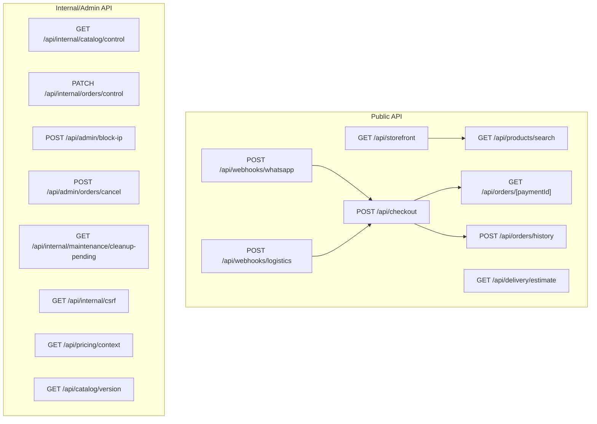
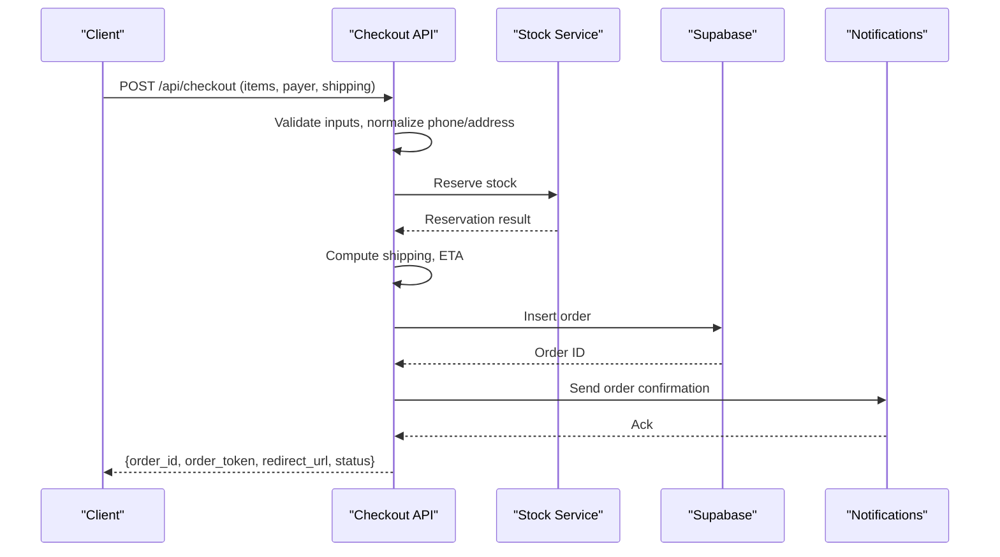
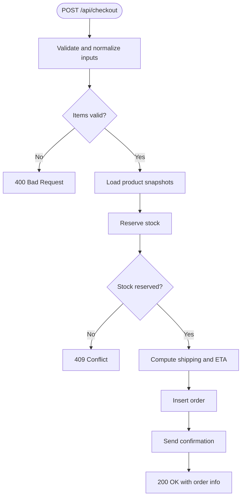
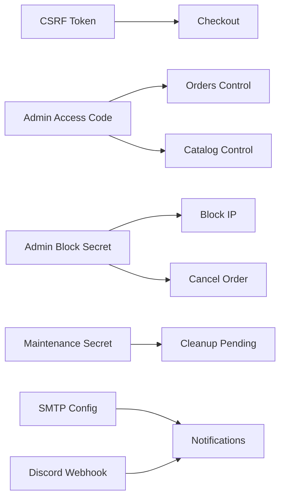
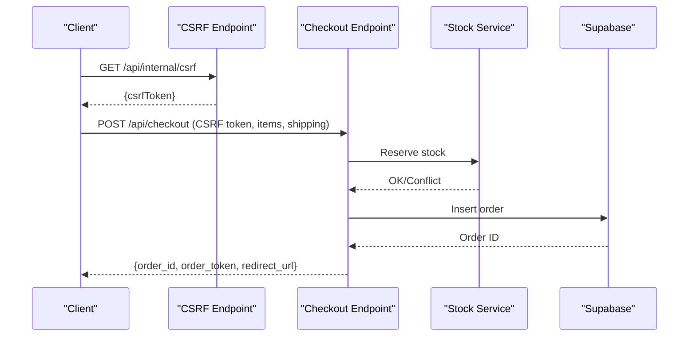
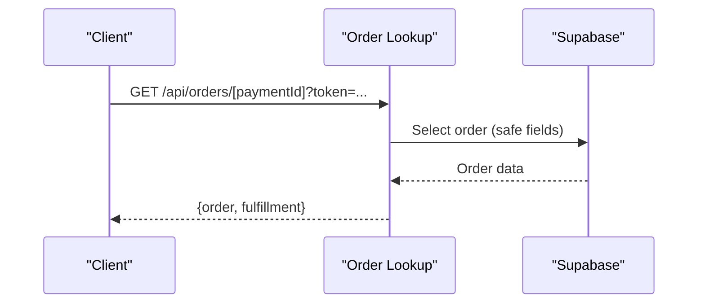

# API Reference

<cite>
**Referenced Files in This Document**
- [README.md](file://README.md)
- [src/app/api/storefront/route.ts](file://src/app/api/storefront/route.ts)
- [src/app/api/products/search/route.ts](file://src/app/api/products/search/route.ts)
- [src/app/api/checkout/route.ts](file://src/app/api/checkout/route.ts)
- [src/app/api/delivery/estimate/route.ts](file://src/app/api/delivery/estimate/route.ts)
- [src/app/api/orders/[paymentId]/route.ts](file://src/app/api/orders/[paymentId]/route.ts)
- [src/app/api/orders/history/route.ts](file://src/app/api/orders/history/route.ts)
- [src/app/api/webhooks/logistics/route.ts](file://src/app/api/webhooks/logistics/route.ts)
- [src/app/api/webhooks/whatsapp/route.ts](file://src/app/api/webhooks/whatsapp/route.ts)
- [src/app/api/internal/orders/control/route.ts](file://src/app/api/internal/orders/control/route.ts)
- [src/app/api/internal/catalog/control/route.ts](file://src/app/api/internal/catalog/control/route.ts)
- [src/app/api/admin/block-ip/route.ts](file://src/app/api/admin/block-ip/route.ts)
- [src/app/api/admin/orders/cancel/route.ts](file://src/app/api/admin/orders/cancel/route.ts)
- [src/app/api/internal/maintenance/cleanup-pending/route.ts](file://src/app/api/internal/maintenance/cleanup-pending/route.ts)
- [src/app/api/internal/csrf/route.ts](file://src/app/api/internal/csrf/route.ts)
- [src/app/api/pricing/context/route.ts](file://src/app/api/pricing/context/route.ts)
- [src/app/api/catalog/version/route.ts](file://src/app/api/catalog/version/route.ts)
- [src/app/api/feedback/route.ts](file://src/app/api/feedback/route.ts)
</cite>

## Table of Contents
1. [Introduction](#introduction)
2. [Project Structure](#project-structure)
3. [Core Components](#core-components)
4. [Architecture Overview](#architecture-overview)
5. [Detailed Component Analysis](#detailed-component-analysis)
6. [Dependency Analysis](#dependency-analysis)
7. [Performance Considerations](#performance-considerations)
8. [Troubleshooting Guide](#troubleshooting-guide)
9. [Conclusion](#conclusion)
10. [Appendices](#appendices)

## Introduction
This document describes AllShop’s REST API surface, covering storefront endpoints, checkout processing (cash-on-delivery), order management, delivery estimation, product search, and webhook handlers. It also documents authentication, rate limiting, CORS behavior, and API versioning strategy. The guide is intended for developers integrating payment processors, shipping providers, and notification services.

## Project Structure
The API is implemented as Next.js App Router pages under src/app/api with internal/admin endpoints under internal and admin subfolders. Public endpoints are designed for client consumption; internal/admin endpoints require strict authentication and are intended for trusted operators.

**Diagram sources**
- [src/app/api/storefront/route.ts:1-30](file://src/app/api/storefront/route.ts#L1-L30)
- [src/app/api/products/search/route.ts:1-31](file://src/app/api/products/search/route.ts#L1-L31)
- [src/app/api/checkout/route.ts:1-872](file://src/app/api/checkout/route.ts#L1-L872)
- [src/app/api/delivery/estimate/route.ts:1-130](file://src/app/api/delivery/estimate/route.ts#L1-L130)
- [src/app/api/orders/[paymentId]/route.ts](file://src/app/api/orders/[paymentId]/route.ts#L1-L101)
- [src/app/api/orders/history/route.ts:1-145](file://src/app/api/orders/history/route.ts#L1-L145)
- [src/app/api/webhooks/whatsapp/route.ts:1-19](file://src/app/api/webhooks/whatsapp/route.ts#L1-L19)
- [src/app/api/webhooks/logistics/route.ts:1-19](file://src/app/api/webhooks/logistics/route.ts#L1-L19)
- [src/app/api/internal/catalog/control/route.ts:1-191](file://src/app/api/internal/catalog/control/route.ts#L1-L191)
- [src/app/api/internal/orders/control/route.ts:1-664](file://src/app/api/internal/orders/control/route.ts#L1-L664)
- [src/app/api/admin/block-ip/route.ts:1-140](file://src/app/api/admin/block-ip/route.ts#L1-L140)
- [src/app/api/admin/orders/cancel/route.ts:1-237](file://src/app/api/admin/orders/cancel/route.ts#L1-L237)
- [src/app/api/internal/maintenance/cleanup-pending/route.ts:1-229](file://src/app/api/internal/maintenance/cleanup-pending/route.ts#L1-L229)
- [src/app/api/internal/csrf/route.ts:1-35](file://src/app/api/internal/csrf/route.ts#L1-L35)
- [src/app/api/pricing/context/route.ts:1-13](file://src/app/api/pricing/context/route.ts#L1-L13)
- [src/app/api/catalog/version/route.ts:1-23](file://src/app/api/catalog/version/route.ts#L1-L23)

**Section sources**
- [src/app/api/storefront/route.ts:1-30](file://src/app/api/storefront/route.ts#L1-L30)
- [src/app/api/products/search/route.ts:1-31](file://src/app/api/products/search/route.ts#L1-L31)
- [src/app/api/checkout/route.ts:1-872](file://src/app/api/checkout/route.ts#L1-L872)
- [src/app/api/delivery/estimate/route.ts:1-130](file://src/app/api/delivery/estimate/route.ts#L1-L130)
- [src/app/api/orders/[paymentId]/route.ts](file://src/app/api/orders/[paymentId]/route.ts#L1-L101)
- [src/app/api/orders/history/route.ts:1-145](file://src/app/api/orders/history/route.ts#L1-L145)
- [src/app/api/webhooks/whatsapp/route.ts:1-19](file://src/app/api/webhooks/whatsapp/route.ts#L1-L19)
- [src/app/api/webhooks/logistics/route.ts:1-19](file://src/app/api/webhooks/logistics/route.ts#L1-L19)
- [src/app/api/internal/catalog/control/route.ts:1-191](file://src/app/api/internal/catalog/control/route.ts#L1-L191)
- [src/app/api/internal/orders/control/route.ts:1-664](file://src/app/api/internal/orders/control/route.ts#L1-L664)
- [src/app/api/admin/block-ip/route.ts:1-140](file://src/app/api/admin/block-ip/route.ts#L1-L140)
- [src/app/api/admin/orders/cancel/route.ts:1-237](file://src/app/api/admin/orders/cancel/route.ts#L1-L237)
- [src/app/api/internal/maintenance/cleanup-pending/route.ts:1-229](file://src/app/api/internal/maintenance/cleanup-pending/route.ts#L1-L229)
- [src/app/api/internal/csrf/route.ts:1-35](file://src/app/api/internal/csrf/route.ts#L1-L35)
- [src/app/api/pricing/context/route.ts:1-13](file://src/app/api/pricing/context/route.ts#L1-L13)
- [src/app/api/catalog/version/route.ts:1-23](file://src/app/api/catalog/version/route.ts#L1-L23)

## Core Components
- Storefront catalog and featured products retrieval
- Product search endpoint for client-side catalogs
- Cash-on-delivery checkout pipeline with validation, stock reservation, shipping cost calculation, and order creation
- Delivery estimation service for Colombia with region/city inference
- Order lookup and history endpoints for customer-facing flows
- Webhook handlers for logistics and WhatsApp (currently disabled)
- Internal/admin endpoints for catalog control, order management, IP blocking, cancellation, maintenance cleanup, CSRF token issuance, pricing context, catalog version, and feedback submission

**Section sources**
- [src/app/api/storefront/route.ts:1-30](file://src/app/api/storefront/route.ts#L1-L30)
- [src/app/api/products/search/route.ts:1-31](file://src/app/api/products/search/route.ts#L1-L31)
- [src/app/api/checkout/route.ts:1-872](file://src/app/api/checkout/route.ts#L1-L872)
- [src/app/api/delivery/estimate/route.ts:1-130](file://src/app/api/delivery/estimate/route.ts#L1-L130)
- [src/app/api/orders/[paymentId]/route.ts](file://src/app/api/orders/[paymentId]/route.ts#L1-L101)
- [src/app/api/orders/history/route.ts:1-145](file://src/app/api/orders/history/route.ts#L1-L145)
- [src/app/api/webhooks/whatsapp/route.ts:1-19](file://src/app/api/webhooks/whatsapp/route.ts#L1-L19)
- [src/app/api/webhooks/logistics/route.ts:1-19](file://src/app/api/webhooks/logistics/route.ts#L1-L19)
- [src/app/api/internal/catalog/control/route.ts:1-191](file://src/app/api/internal/catalog/control/route.ts#L1-L191)
- [src/app/api/internal/orders/control/route.ts:1-664](file://src/app/api/internal/orders/control/route.ts#L1-L664)
- [src/app/api/admin/block-ip/route.ts:1-140](file://src/app/api/admin/block-ip/route.ts#L1-L140)
- [src/app/api/admin/orders/cancel/route.ts:1-237](file://src/app/api/admin/orders/cancel/route.ts#L1-L237)
- [src/app/api/internal/maintenance/cleanup-pending/route.ts:1-229](file://src/app/api/internal/maintenance/cleanup-pending/route.ts#L1-L229)
- [src/app/api/internal/csrf/route.ts:1-35](file://src/app/api/internal/csrf/route.ts#L1-L35)
- [src/app/api/pricing/context/route.ts:1-13](file://src/app/api/pricing/context/route.ts#L1-L13)
- [src/app/api/catalog/version/route.ts:1-23](file://src/app/api/catalog/version/route.ts#L1-L23)
- [src/app/api/feedback/route.ts:1-136](file://src/app/api/feedback/route.ts#L1-L136)

## Architecture Overview
The API follows a layered design:
- Public endpoints exposed via Next.js App Router
- Internal/admin endpoints protected by secrets/tokens
- Shared libraries handle database access, validation, notifications, rate limiting, and geographic estimations
- Webhooks are present but currently disabled

**Diagram sources**
- [src/app/api/checkout/route.ts:497-800](file://src/app/api/checkout/route.ts#L497-L800)

**Section sources**
- [src/app/api/checkout/route.ts:1-872](file://src/app/api/checkout/route.ts#L1-L872)

## Detailed Component Analysis

### Storefront Endpoint
- Method: GET
- URL: /api/storefront
- Purpose: Retrieve categories and featured products for homepage
- Response fields: categories, featuredProducts
- Cache: Public caching controlled via headers

**Section sources**
- [src/app/api/storefront/route.ts:1-30](file://src/app/api/storefront/route.ts#L1-L30)

### Product Search Endpoint
- Method: GET
- URL: /api/products/search
- Purpose: Provide searchable product metadata for client-side search
- Response fields: products array with id, slug, name, price, images (first image), category_id
- Cache: Public caching controlled via headers

**Section sources**
- [src/app/api/products/search/route.ts:1-31](file://src/app/api/products/search/route.ts#L1-L31)

### Checkout (Cash-on-Delivery)
- Method: POST
- URL: /api/checkout
- Authentication: CSRF token required in production; same-origin enforced; IP block and VPN detection applied
- Rate limiting: 5 checkouts per 10 minutes per IP
- Request body fields:
  - items: array of { id, slug?, quantity, variant? }
  - payer: { name, email, phone, document }
  - shipping: { address, reference?, city, department, zip?, type, cost?, carrier_code?, carrier_name?, insured?, eta_min_days?, eta_max_days?, eta_range? }
  - verification: { address_confirmed?, availability_confirmed?, product_acknowledged? }
  - pricing: { display_currency?, display_locale?, country_code?, display_rate? }
- Validation:
  - Name, email, phone, document, address, city, department required and sanitized
  - Department must match known Colombian departments
  - Verification flags required for COD
- Processing:
  - Normalize items, load product snapshots, compute subtotal and shipping cost
  - Reserve stock; on conflict, return 409
  - Create order with notes containing pricing/logistics metadata
  - Send order confirmation notification
- Response fields:
  - order_id, order_token, status, fulfillment_triggered, redirect_url, idempotent_replay (when replaying)
- Idempotency: Uses x-idempotency-key to derive payment_id; duplicate payment_id returns existing order
- Error codes: 400 (invalid payload), 403 (blocked IP/VPN), 409 (stock conflict), 429 (rate limit), 500 (server errors)

**Diagram sources**
- [src/app/api/checkout/route.ts:596-800](file://src/app/api/checkout/route.ts#L596-L800)

**Section sources**
- [src/app/api/checkout/route.ts:1-872](file://src/app/api/checkout/route.ts#L1-L872)

### Delivery Estimation (Colombia)
- Method: GET
- URL: /api/delivery/estimate
- Query parameters:
  - department, city, region, carrier, auto (1 to infer from headers)
- Rate limiting: 30 requests per minute per IP
- Response fields:
  - estimate: carrier, min/max business days, formatted range
  - location: source, country_code, region_code, city, department, inferred_from_headers
  - calculated_at: timestamp
- Behavior: Infers department from query or Vercel headers when auto enabled

**Section sources**
- [src/app/api/delivery/estimate/route.ts:1-130](file://src/app/api/delivery/estimate/route.ts#L1-L130)

### Order Lookup (Customer)
- Method: GET
- URL: /api/orders/[paymentId]?token=...
- Purpose: Allow customers to check order status without exposing sensitive data
- Authentication: Signed token required in production; token verification performed
- Rate limiting: 60 requests per minute per IP
- Response fields:
  - order: id, status, items, subtotal, shipping_cost, total, created_at, updated_at
  - fulfillment: fulfillment summary for manual dispatch

**Section sources**
- [src/app/api/orders/[paymentId]/route.ts](file://src/app/api/orders/[paymentId]/route.ts#L1-L101)

### Order History (Customer)
- Method: POST
- URL: /api/orders/history
- Request body: { email, phone, document? }
- Rate limiting: 10 requests per 10 minutes per IP
- Response fields: { ok, orders: [{ id, status, total, created_at, updated_at, order_token }] }

**Section sources**
- [src/app/api/orders/history/route.ts:1-145](file://src/app/api/orders/history/route.ts#L1-L145)

### Webhooks
- WhatsApp: Disabled (410)
- Logistics: Disabled (410)
- Both endpoints return a 410 Gone with a message indicating manual operation mode.

**Section sources**
- [src/app/api/webhooks/whatsapp/route.ts:1-19](file://src/app/api/webhooks/whatsapp/route.ts#L1-L19)
- [src/app/api/webhooks/logistics/route.ts:1-19](file://src/app/api/webhooks/logistics/route.ts#L1-L19)

### Internal/Admin: Orders Control Panel
- Methods: GET, PATCH, DELETE
- URL: /api/internal/orders/control
- Authentication: Requires X-CATALOG-ADMIN-CODE header with configured admin code
- GET filters and paginates orders; returns summarized view and integration status
- PATCH updates status, tracking code, dispatch reference, notes, and optionally notifies customer
- DELETE removes an order
- Response fields vary by method; PATCH returns updated order and email status

**Section sources**
- [src/app/api/internal/orders/control/route.ts:1-664](file://src/app/api/internal/orders/control/route.ts#L1-L664)

### Internal/Admin: Catalog Control
- Methods: GET, PATCH
- URL: /api/internal/catalog/control
- Authentication: Requires X-CATALOG-ADMIN-CODE header with configured admin code
- GET returns catalog snapshot
- PATCH updates price, compare_at_price, free_shipping, shipping_cost, total_stock, variants

**Section sources**
- [src/app/api/internal/catalog/control/route.ts:1-191](file://src/app/api/internal/catalog/control/route.ts#L1-L191)

### Admin: Block IP
- Method: POST
- URL: /api/admin/block-ip
- Authentication: Authorization: Bearer <ADMIN_BLOCK_SECRET>
- Body: { ip, duration: "permanent"|"24h"|"1h", action: "block"|"unblock" }
- Rate limiting: 30 requests per minute per IP
- Response: success message and action taken

**Section sources**
- [src/app/api/admin/block-ip/route.ts:1-140](file://src/app/api/admin/block-ip/route.ts#L1-L140)

### Admin: Cancel Order
- Method: POST
- URL: /api/admin/orders/cancel
- Authentication: Authorization: Bearer <ADMIN_BLOCK_SECRET>
- Body: { order_id, reason? }
- Behavior: Cancels pending/paid/processing orders, restores stock, logs cancellation
- Response: { ok, order_id, status_before, status_after, message }

**Section sources**
- [src/app/api/admin/orders/cancel/route.ts:1-237](file://src/app/api/admin/orders/cancel/route.ts#L1-L237)

### Internal: Maintenance Cleanup Pending Orders
- Method: GET/POST
- URL: /api/internal/maintenance/cleanup-pending
- Authentication: Requires secret via X-MAINTENANCE-SECRET header or secret query param
- Query params: ttl_minutes (default 120), limit (default 50)
- Behavior: Cancels stale pending orders and attempts to restore stock

**Section sources**
- [src/app/api/internal/maintenance/cleanup-pending/route.ts:1-229](file://src/app/api/internal/maintenance/cleanup-pending/route.ts#L1-L229)

### Internal: CSRF Token
- Method: GET
- URL: /api/internal/csrf
- Authentication: Requires CSRF_SECRET configured in production
- Response: { csrfToken }

**Section sources**
- [src/app/api/internal/csrf/route.ts:1-35](file://src/app/api/internal/csrf/route.ts#L1-L35)

### Pricing Context
- Method: GET
- URL: /api/pricing/context
- Response: Default pricing context payload with cache headers

**Section sources**
- [src/app/api/pricing/context/route.ts:1-13](file://src/app/api/pricing/context/route.ts#L1-L13)

### Catalog Version
- Method: GET
- URL: /api/catalog/version
- Response: { version, updated_at } with no-store cache headers

**Section sources**
- [src/app/api/catalog/version/route.ts:1-23](file://src/app/api/catalog/version/route.ts#L1-L23)

### Feedback
- Method: POST
- URL: /api/feedback
- Rate limiting: 8 requests per 10 minutes per IP
- Body: { type, name, email, message, orderId?, page? }
- Allowed types: error, sugerencia, comentario
- Response: { ok } or error

**Section sources**
- [src/app/api/feedback/route.ts:1-136](file://src/app/api/feedback/route.ts#L1-L136)

## Dependency Analysis
- Authentication and secrets:
  - Admin endpoints require either ADMIN_BLOCK_SECRET or ORDER_LOOKUP_SECRET
  - CSRF enforcement requires CSRF_SECRET in production
  - Catalog admin access requires CATALOG_ADMIN_ACCESS_CODE
- External integrations:
  - Notifications via SMTP and Discord
  - Geographic estimations for Colombia
  - Stock reservation/restoration
- Rate limiting:
  - Multiple endpoints enforce per-IP limits for safety and abuse prevention

**Diagram sources**
- [src/app/api/checkout/route.ts:505-530](file://src/app/api/checkout/route.ts#L505-L530)
- [src/app/api/internal/orders/control/route.ts:55-79](file://src/app/api/internal/orders/control/route.ts#L55-L79)
- [src/app/api/internal/catalog/control/route.ts:59-79](file://src/app/api/internal/catalog/control/route.ts#L59-L79)
- [src/app/api/admin/block-ip/route.ts:24-41](file://src/app/api/admin/block-ip/route.ts#L24-L41)
- [src/app/api/admin/orders/cancel/route.ts:48-65](file://src/app/api/admin/orders/cancel/route.ts#L48-L65)
- [src/app/api/internal/maintenance/cleanup-pending/route.ts:20-42](file://src/app/api/internal/maintenance/cleanup-pending/route.ts#L20-L42)

**Section sources**
- [src/app/api/checkout/route.ts:505-530](file://src/app/api/checkout/route.ts#L505-L530)
- [src/app/api/internal/orders/control/route.ts:55-79](file://src/app/api/internal/orders/control/route.ts#L55-L79)
- [src/app/api/internal/catalog/control/route.ts:59-79](file://src/app/api/internal/catalog/control/route.ts#L59-L79)
- [src/app/api/admin/block-ip/route.ts:24-41](file://src/app/api/admin/block-ip/route.ts#L24-L41)
- [src/app/api/admin/orders/cancel/route.ts:48-65](file://src/app/api/admin/orders/cancel/route.ts#L48-L65)
- [src/app/api/internal/maintenance/cleanup-pending/route.ts:20-42](file://src/app/api/internal/maintenance/cleanup-pending/route.ts#L20-L42)

## Performance Considerations
- Caching:
  - Storefront and product search use public caching headers to reduce origin load
  - Pricing context and catalog version use no-store headers for freshness
- Rate limiting:
  - Checkout: 5 per 10 minutes per IP
  - Delivery estimate: 30 per minute per IP
  - Order lookup: 60 per minute per IP
  - Order history: 10 per 10 minutes per IP
  - Feedback: 8 per 10 minutes per IP
  - Admin endpoints: 30 per minute per IP
  - Maintenance cleanup: 30 per minute per IP
- Idempotency:
  - Checkout uses idempotency key derived payment_id to avoid duplicate orders

[No sources needed since this section provides general guidance]

## Troubleshooting Guide
- 400 Bad Request:
  - Checkout validation failures (missing/invalid fields)
  - Order history missing required identifiers
- 401 Unauthorized:
  - Missing or invalid admin access code or bearer token
  - Order lookup token verification failed
- 403 Forbidden:
  - CSRF token missing/invalid
  - IP blocked or VPN/proxy detected
- 409 Conflict:
  - Stock reservation conflicts during checkout
- 410 Gone:
  - Webhook endpoints disabled
- 429 Too Many Requests:
  - Rate limit exceeded for any of the rate-limited endpoints
- 500/5xx:
  - Database not configured, SMTP not configured, or internal errors

**Section sources**
- [src/app/api/checkout/route.ts:505-566](file://src/app/api/checkout/route.ts#L505-L566)
- [src/app/api/orders/[paymentId]/route.ts](file://src/app/api/orders/[paymentId]/route.ts#L72-L79)
- [src/app/api/webhooks/logistics/route.ts:6-18](file://src/app/api/webhooks/logistics/route.ts#L6-L18)
- [src/app/api/webhooks/whatsapp/route.ts:6-18](file://src/app/api/webhooks/whatsapp/route.ts#L6-L18)

## Conclusion
AllShop’s API provides a secure, rate-limited, and cache-aware set of endpoints for storefront access, checkout processing, order management, and administrative controls. While public endpoints focus on cash-on-delivery checkout and order visibility, internal/admin endpoints offer robust operational capabilities with strict authentication and safeguards.

[No sources needed since this section summarizes without analyzing specific files]

## Appendices

### Authentication Methods
- CSRF Protection:
  - Required in production; obtain token from /api/internal/csrf
  - Submit via x-csrf-token header on checkout
- Admin Access Codes:
  - X-CATALOG-ADMIN-CODE header for internal/admin endpoints
- Bearer Tokens:
  - Authorization: Bearer <ADMIN_BLOCK_SECRET> for admin endpoints
- Signed Tokens:
  - Order lookup requires token parameter for production environments

**Section sources**
- [src/app/api/checkout/route.ts:523-530](file://src/app/api/checkout/route.ts#L523-L530)
- [src/app/api/internal/csrf/route.ts:1-35](file://src/app/api/internal/csrf/route.ts#L1-L35)
- [src/app/api/internal/orders/control/route.ts:55-79](file://src/app/api/internal/orders/control/route.ts#L55-L79)
- [src/app/api/admin/block-ip/route.ts:20-41](file://src/app/api/admin/block-ip/route.ts#L20-L41)
- [src/app/api/orders/[paymentId]/route.ts](file://src/app/api/orders/[paymentId]/route.ts#L72-L79)

### Rate Limiting Summary
- Checkout: 5 per 10 minutes per IP
- Delivery Estimate: 30 per minute per IP
- Order Lookup: 60 per minute per IP
- Order History: 10 per 10 minutes per IP
- Feedback: 8 per 10 minutes per IP
- Admin endpoints: 30 per minute per IP
- Maintenance Cleanup: 30 per minute per IP

**Section sources**
- [src/app/api/checkout/route.ts:532-546](file://src/app/api/checkout/route.ts#L532-L546)
- [src/app/api/delivery/estimate/route.ts:46-56](file://src/app/api/delivery/estimate/route.ts#L46-L56)
- [src/app/api/orders/[paymentId]/route.ts](file://src/app/api/orders/[paymentId]/route.ts#L45-L61)
- [src/app/api/orders/history/route.ts:45-59](file://src/app/api/orders/history/route.ts#L45-L59)
- [src/app/api/feedback/route.ts:40-54](file://src/app/api/feedback/route.ts#L40-L54)
- [src/app/api/admin/block-ip/route.ts:52-64](file://src/app/api/admin/block-ip/route.ts#L52-L64)
- [src/app/api/internal/maintenance/cleanup-pending/route.ts:98-104](file://src/app/api/internal/maintenance/cleanup-pending/route.ts#L98-L104)

### CORS and API Versioning
- CORS:
  - Not explicitly configured in the analyzed files; defaults apply
- API Versioning:
  - No explicit version path or header observed; endpoints appear to be stable

**Section sources**
- [src/app/api/storefront/route.ts:16-19](file://src/app/api/storefront/route.ts#L16-L19)
- [src/app/api/products/search/route.ts:21-26](file://src/app/api/products/search/route.ts#L21-L26)

### Example Workflows

#### Checkout Flow

**Diagram sources**
- [src/app/api/internal/csrf/route.ts:1-35](file://src/app/api/internal/csrf/route.ts#L1-L35)
- [src/app/api/checkout/route.ts:497-800](file://src/app/api/checkout/route.ts#L497-L800)

#### Order Status Check

**Diagram sources**
- [src/app/api/orders/[paymentId]/route.ts](file://src/app/api/orders/[paymentId]/route.ts#L39-L100)