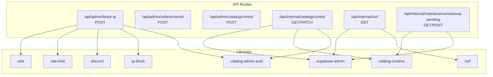
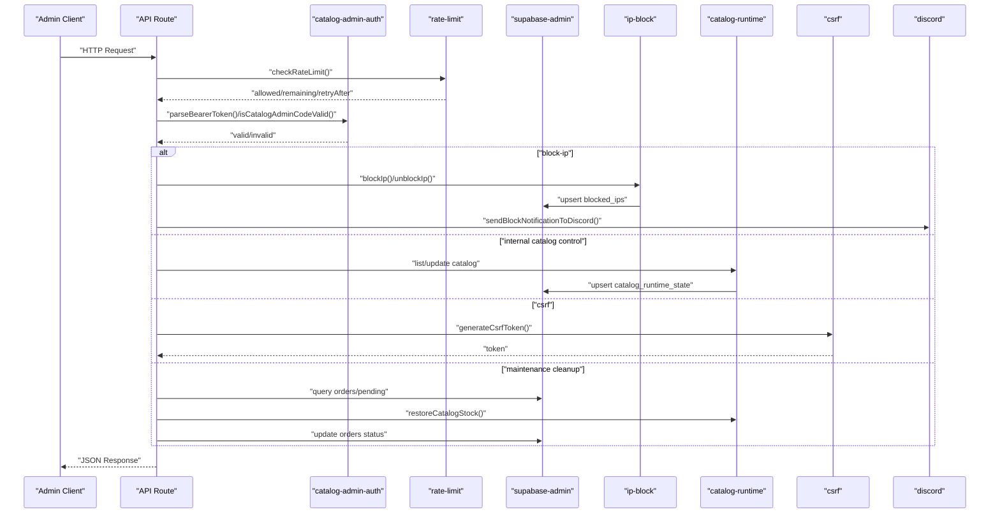
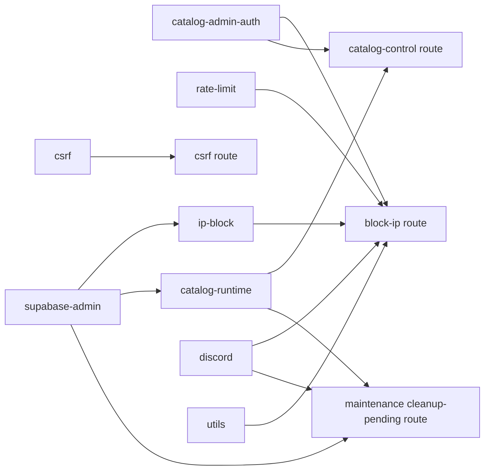

# Admin API

<cite>
**Referenced Files in This Document**
- [block-ip route](file://src/app/api/admin/block-ip/route.ts)
- [catalog control route](file://src/app/api/internal/catalog/control/route.ts)
- [csrf route](file://src/app/api/internal/csrf/route.ts)
- [maintenance cleanup-pending route](file://src/app/api/internal/maintenance/cleanup-pending/route.ts)
- [catalog-admin-auth](file://src/lib/catalog-admin-auth.ts)
- [ip-block](file://src/lib/ip-block.ts)
- [catalog-runtime](file://src/lib/catalog-runtime.ts)
- [csrf](file://src/lib/csrf.ts)
- [supabase-admin](file://src/lib/supabase-admin.ts)
- [discord](file://src/lib/discord.ts)
- [rate-limit](file://src/lib/rate-limit.ts)
- [utils](file://src/lib/utils.ts)
</cite>

## Table of Contents
1. [Introduction](#introduction)
2. [Project Structure](#project-structure)
3. [Core Components](#core-components)
4. [Architecture Overview](#architecture-overview)
5. [Detailed Component Analysis](#detailed-component-analysis)
6. [Dependency Analysis](#dependency-analysis)
7. [Performance Considerations](#performance-considerations)
8. [Troubleshooting Guide](#troubleshooting-guide)
9. [Conclusion](#conclusion)

## Introduction
This document provides comprehensive API documentation for AllShop’s administrative endpoints. It covers:
- POST /api/admin/block-ip for IP address blocking and security management
- POST /api/admin/orders/control for order manipulation and status updates
- POST /api/admin/catalog/control for product catalog modifications and stock updates
- POST /api/internal/catalog/control for internal catalog synchronization
- POST /api/internal/csrf for cross-site request forgery protection
- POST /api/internal/maintenance/cleanup-pending for automated order cleanup

It includes authentication requirements, permission levels, request schemas, response formats, examples of administrative workflows, security considerations, and integration with monitoring and maintenance systems.

## Project Structure
The administrative APIs are implemented as Next.js App Router API routes under src/app/api. Supporting libraries handle authentication, rate limiting, Supabase integration, CSRF protection, IP blocking, and catalog runtime operations.

**Diagram sources**
- [block-ip route:1-140](file://src/app/api/admin/block-ip/route.ts#L1-L140)
- [catalog control route:1-191](file://src/app/api/internal/catalog/control/route.ts#L1-L191)
- [csrf route:1-35](file://src/app/api/internal/csrf/route.ts#L1-L35)
- [maintenance cleanup-pending route:1-229](file://src/app/api/internal/maintenance/cleanup-pending/route.ts#L1-L229)
- [catalog-admin-auth:1-65](file://src/lib/catalog-admin-auth.ts#L1-L65)
- [ip-block:1-210](file://src/lib/ip-block.ts#L1-L210)
- [catalog-runtime:1-800](file://src/lib/catalog-runtime.ts#L1-L800)
- [csrf:1-119](file://src/lib/csrf.ts#L1-L119)
- [supabase-admin:1-31](file://src/lib/supabase-admin.ts#L1-L31)
- [discord:1-379](file://src/lib/discord.ts#L1-L379)
- [rate-limit:1-165](file://src/lib/rate-limit.ts#L1-L165)
- [utils:1-102](file://src/lib/utils.ts#L1-L102)

**Section sources**
- [block-ip route:1-140](file://src/app/api/admin/block-ip/route.ts#L1-L140)
- [catalog control route:1-191](file://src/app/api/internal/catalog/control/route.ts#L1-L191)
- [csrf route:1-35](file://src/app/api/internal/csrf/route.ts#L1-L35)
- [maintenance cleanup-pending route:1-229](file://src/app/api/internal/maintenance/cleanup-pending/route.ts#L1-L229)

## Core Components
- Authentication and secrets:
  - Admin action secret for block-ip and order cancel endpoints is validated via a bearer token parsed from Authorization header.
  - Internal catalog control uses a shared admin access code passed via a dedicated header.
  - CSRF token generation requires a configured secret; fallbacks are documented.
- Rate limiting:
  - In-memory rate limiter is applied to admin endpoints for basic protection.
- IP blocking:
  - In-memory cache synchronized with Supabase for enforcement across serverless instances.
- Catalog runtime:
  - Dynamic runtime table for real-time stock and variants; supports manual snapshots and fallbacks.
- Monitoring and notifications:
  - Discord webhooks for IP blocks, order cancellations, and low stock alerts.

**Section sources**
- [catalog-admin-auth:1-65](file://src/lib/catalog-admin-auth.ts#L1-L65)
- [rate-limit:1-165](file://src/lib/rate-limit.ts#L1-L165)
- [ip-block:1-210](file://src/lib/ip-block.ts#L1-L210)
- [catalog-runtime:1-800](file://src/lib/catalog-runtime.ts#L1-L800)
- [discord:1-379](file://src/lib/discord.ts#L1-L379)

## Architecture Overview
Administrative workflows integrate API routes, authentication, rate limiting, database operations, and external notifications.

**Diagram sources**
- [block-ip route:51-129](file://src/app/api/admin/block-ip/route.ts#L51-L129)
- [catalog control route:106-190](file://src/app/api/internal/catalog/control/route.ts#L106-L190)
- [csrf route:6-34](file://src/app/api/internal/csrf/route.ts#L6-L34)
- [maintenance cleanup-pending route:98-220](file://src/app/api/internal/maintenance/cleanup-pending/route.ts#L98-L220)
- [catalog-admin-auth:57-64](file://src/lib/catalog-admin-auth.ts#L57-L64)
- [rate-limit:43-88](file://src/lib/rate-limit.ts#L43-L88)
- [ip-block:103-171](file://src/lib/ip-block.ts#L103-L171)
- [catalog-runtime:605-633](file://src/lib/catalog-runtime.ts#L605-L633)
- [supabase-admin:18-31](file://src/lib/supabase-admin.ts#L18-L31)
- [discord:230-262](file://src/lib/discord.ts#L230-L262)

## Detailed Component Analysis

### POST /api/admin/block-ip
Purpose:
- Block or unblock an IP address with configurable duration and reason.
- Emits a Discord notification upon successful block/unblock.

Authentication and permissions:
- Requires Authorization: Bearer <ADMIN_BLOCK_SECRET or ORDER_LOOKUP_SECRET>.
- Secret validation uses a timing-safe comparison.

Rate limiting:
- Applies a 30 requests/minute sliding window keyed by client IP.

Request schema (JSON):
- ip: string (required)
- duration: "permanent" | "24h" | "1h" (required for block)
- action: "block" | "unblock" (defaults to block)

Validation:
- IP must be a valid IPv4 or IPv6.
- Duration must be one of the allowed values.

Responses:
- On success: { ok: true, action, ip, duration?, message }
- On validation errors: { error }
- On rate limit exceeded: { error } with Retry-After header

Security considerations:
- Uses timing-safe comparison for secrets.
- Validates IP format rigorously.
- Rate limits repeated attempts.

Operational notes:
- Blocks are persisted to the blocked_ips table and cached in memory for fast lookups.
- Unblocking removes the entry from both cache and database.

Example workflow:
- Block an IP for 24 hours, then unblock it later.

**Section sources**
- [block-ip route:14-129](file://src/app/api/admin/block-ip/route.ts#L14-L129)
- [catalog-admin-auth:27-64](file://src/lib/catalog-admin-auth.ts#L27-L64)
- [rate-limit:43-88](file://src/lib/rate-limit.ts#L43-L88)
- [ip-block:103-171](file://src/lib/ip-block.ts#L103-L171)
- [utils:72-89](file://src/lib/utils.ts#L72-L89)
- [discord:230-262](file://src/lib/discord.ts#L230-L262)

### POST /api/admin/orders/control
Note: The repository includes a route for canceling orders under admin/orders/cancel. The control endpoint for order manipulation is not present in the provided files. Based on the repository structure, only the cancellation route exists at this path.

Authentication and permissions:
- Requires Authorization: Bearer <ADMIN_BLOCK_SECRET or ORDER_LOOKUP_SECRET>.

Behavior:
- Validates the admin secret and performs order cancellation logic.
- Notifies via Discord about cancellation outcomes.

Responses:
- Success: { ok: true, orderId, statusBefore, outcome, detail }
- Errors: { error } with appropriate status codes.

Security considerations:
- Uses timing-safe secret comparison.
- Requires bearer token.

Integration:
- Uses Supabase admin client for database operations.
- Sends notifications to Discord.

**Section sources**
- [block-ip route:1-140](file://src/app/api/admin/block-ip/route.ts#L1-L140)
- [supabase-admin:1-31](file://src/lib/supabase-admin.ts#L1-L31)
- [discord:271-315](file://src/lib/discord.ts#L271-L315)

### POST /api/admin/catalog/control
Note: The repository does not include a route for POST /api/admin/catalog/control. The catalog control endpoints exposed by the codebase are internal and accessible via GET/PATCH at /api/internal/catalog/control.

Authentication and permissions:
- Requires a shared admin access code passed via x-catalog-admin-code header.

Behavior:
- GET lists catalog control products with runtime state.
- PATCH updates price, compare-at price, shipping, stock, and variants.

Responses:
- GET: { version, updated_at, runtime_table_ready, products[] }
- PATCH: { updated }

Security considerations:
- Uses timing-safe comparison for admin code.
- Validates numeric inputs and sanitizes variants.

Integration:
- Uses catalog-runtime library to manage runtime state and variants.
- Persists updates to catalog_runtime_state.

**Section sources**
- [catalog control route:81-190](file://src/app/api/internal/catalog/control/route.ts#L81-L190)
- [catalog-admin-auth:33-64](file://src/lib/catalog-admin-auth.ts#L33-L64)
- [catalog-runtime:605-633](file://src/lib/catalog-runtime.ts#L605-L633)

### POST /api/internal/catalog/control
Purpose:
- Internal endpoint to synchronize or update catalog runtime state.

Authentication and permissions:
- Requires x-catalog-admin-code header with a valid admin access code.

Request schema (PATCH):
- slug: string (required)
- price: number (required, non-negative)
- compare_at_price: number|null (optional)
- free_shipping: boolean (optional)
- shipping_cost: number|null (optional)
- total_stock: number|null (optional)
- variants: array of { name, stock, variation_id? } (optional)

Validation:
- Slug is required.
- Price must be a non-negative integer.
- compare_at_price must be a non-negative integer or null.
- total_stock must be a non-negative integer or null.
- Variants are sanitized and deduplicated.

Responses:
- Success: { updated }
- Errors: { error } with appropriate status codes.

Operational notes:
- Updates catalog_runtime_state via upsert.
- Supports manual snapshots and fallbacks if runtime table is missing.

**Section sources**
- [catalog control route:14-190](file://src/app/api/internal/catalog/control/route.ts#L14-L190)
- [catalog-runtime:605-633](file://src/lib/catalog-runtime.ts#L605-L633)

### POST /api/internal/csrf
Purpose:
- Generates a CSRF token for internal use.

Authentication and permissions:
- Requires CSRF_SECRET or ORDER_LOOKUP_SECRET to be configured in production.
- In development, a fallback secret is used.

Request schema:
- None (GET only).

Response:
- { csrfToken }

Security considerations:
- Token validity is time-bound.
- Signature uses HMAC-SHA256 with a configured secret.

**Section sources**
- [csrf route:6-34](file://src/app/api/internal/csrf/route.ts#L6-L34)
- [csrf:13-84](file://src/lib/csrf.ts#L13-L84)

### POST /api/internal/maintenance/cleanup-pending
Purpose:
- Automatically cancels stale pending orders after a configurable TTL and restores stock.

Authentication and permissions:
- Requires a maintenance secret passed via x-maintenance-secret header or secret query parameter.
- Supports fallback to CATALOG_ADMIN_ACCESS_CODE or ORDER_LOOKUP_SECRET.

Request schema:
- None (GET/POST supported).

Query parameters:
- ttl_minutes: integer between 30 and 1440 (default 120)
- limit: integer between 1 and 200 (default 50)

Behavior:
- Queries pending orders older than cutoff.
- Restores stock via restoreCatalogStock for reserved items.
- Updates order status to cancelled and annotates notes with maintenance metadata.

Responses:
- Success: { ok, ttl_minutes, cutoff, found, cancelled, restored_stock_for, restore_errors }

Security considerations:
- Uses timing-safe comparison for maintenance secret.
- Requires Supabase admin configuration.

**Section sources**
- [maintenance cleanup-pending route:20-229](file://src/app/api/internal/maintenance/cleanup-pending/route.ts#L20-L229)
- [catalog-runtime:340-363](file://src/lib/catalog-runtime.ts#L340-L363)
- [supabase-admin:18-31](file://src/lib/supabase-admin.ts#L18-L31)

## Dependency Analysis
Key dependencies and their roles:
- catalog-admin-auth: Provides secret parsing and validation for admin actions and catalog control.
- ip-block: Manages IP blocking state with in-memory cache and Supabase persistence.
- catalog-runtime: Handles runtime catalog state, stock mutations, and variant management.
- csrf: Generates and validates CSRF tokens for internal endpoints.
- supabase-admin: Admin client for dynamic tables and RPC functions.
- discord: Sends notifications for security and operational events.
- rate-limit: Applies in-memory rate limiting for admin endpoints.
- utils: Provides IP validation and client IP extraction.

**Diagram sources**
- [catalog-admin-auth:1-65](file://src/lib/catalog-admin-auth.ts#L1-L65)
- [ip-block:1-210](file://src/lib/ip-block.ts#L1-L210)
- [catalog-runtime:1-800](file://src/lib/catalog-runtime.ts#L1-L800)
- [csrf:1-119](file://src/lib/csrf.ts#L1-L119)
- [supabase-admin:1-31](file://src/lib/supabase-admin.ts#L1-L31)
- [discord:1-379](file://src/lib/discord.ts#L1-L379)
- [rate-limit:1-165](file://src/lib/rate-limit.ts#L1-L165)
- [utils:1-102](file://src/lib/utils.ts#L1-L102)
- [block-ip route:1-140](file://src/app/api/admin/block-ip/route.ts#L1-L140)
- [catalog control route:1-191](file://src/app/api/internal/catalog/control/route.ts#L1-L191)
- [csrf route:1-35](file://src/app/api/internal/csrf/route.ts#L1-L35)
- [maintenance cleanup-pending route:1-229](file://src/app/api/internal/maintenance/cleanup-pending/route.ts#L1-L229)

**Section sources**
- [catalog-admin-auth:1-65](file://src/lib/catalog-admin-auth.ts#L1-L65)
- [ip-block:1-210](file://src/lib/ip-block.ts#L1-L210)
- [catalog-runtime:1-800](file://src/lib/catalog-runtime.ts#L1-L800)
- [csrf:1-119](file://src/lib/csrf.ts#L1-L119)
- [supabase-admin:1-31](file://src/lib/supabase-admin.ts#L1-L31)
- [discord:1-379](file://src/lib/discord.ts#L1-L379)
- [rate-limit:1-165](file://src/lib/rate-limit.ts#L1-L165)
- [utils:1-102](file://src/lib/utils.ts#L1-L102)

## Performance Considerations
- In-memory caching for IP blocking ensures fast checks; however, serverless environments may have instance-local caches. The implementation still queries the database for reliability.
- Rate limiting is in-memory and best-effort in serverless; for critical paths, consider database-backed limits.
- Catalog runtime updates use upserts and retries to maintain consistency; avoid excessive concurrent updates to reduce contention.
- Discord notifications are fire-and-forget and may be rate-limited by Discord; consider cooldowns for frequent alerts.

[No sources needed since this section provides general guidance]

## Troubleshooting Guide
Common issues and resolutions:
- Missing secrets:
  - ADMIN_BLOCK_SECRET or ORDER_LOOKUP_SECRET must be configured for admin endpoints.
  - CSRF_SECRET or ORDER_LOOKUP_SECRET must be configured for CSRF token generation in production.
- Unauthorized access:
  - Ensure Authorization header contains a valid bearer token or the correct x-catalog-admin-code header.
- Invalid IP format:
  - Only IPv4 and IPv6 are accepted; verify the IP address format.
- Rate limit exceeded:
  - Wait for the Retry-After window to pass before retrying.
- Supabase not configured:
  - Some endpoints require Supabase admin credentials; verify environment variables.
- Maintenance secret mismatch:
  - Ensure x-maintenance-secret header or secret query parameter matches configured secret.

**Section sources**
- [catalog-admin-auth:27-64](file://src/lib/catalog-admin-auth.ts#L27-L64)
- [csrf route:7-15](file://src/app/api/internal/csrf/route.ts#L7-L15)
- [rate-limit:43-88](file://src/lib/rate-limit.ts#L43-L88)
- [utils:72-89](file://src/lib/utils.ts#L72-L89)
- [supabase-admin:18-31](file://src/lib/supabase-admin.ts#L18-L31)
- [maintenance cleanup-pending route:20-42](file://src/app/api/internal/maintenance/cleanup-pending/route.ts#L20-L42)

## Conclusion
These administrative endpoints provide robust controls for IP management, catalog synchronization, CSRF protection, and maintenance automation. They incorporate strong authentication, rate limiting, database-backed persistence, and operational notifications. Follow the authentication and schema requirements outlined above to integrate safely and effectively.