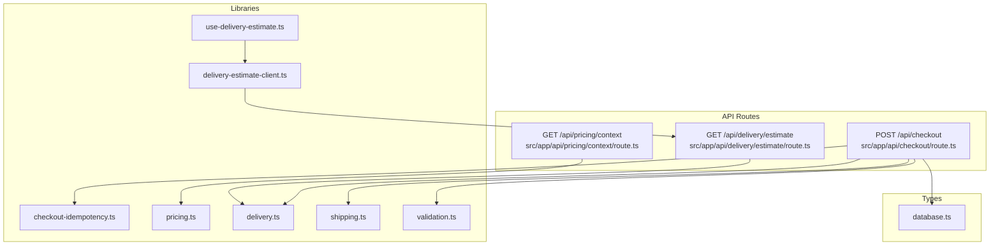
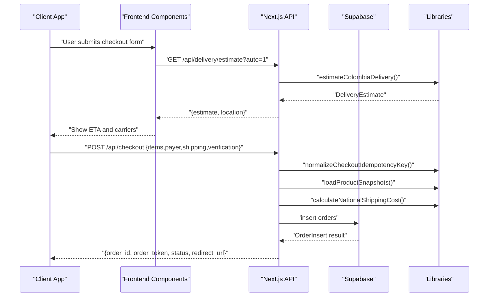
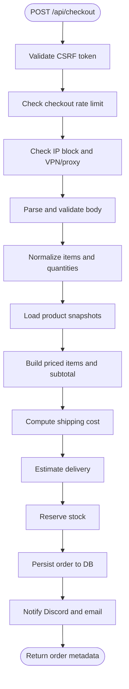
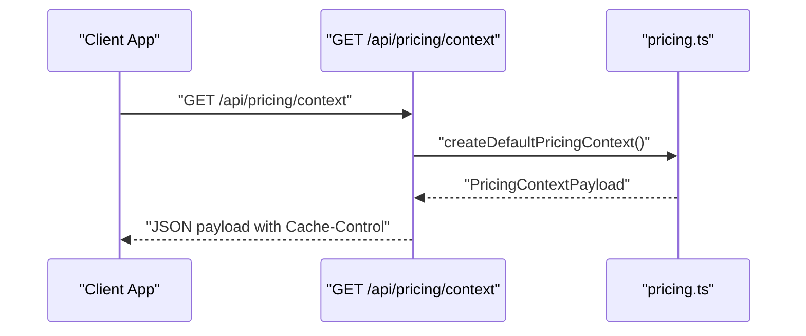
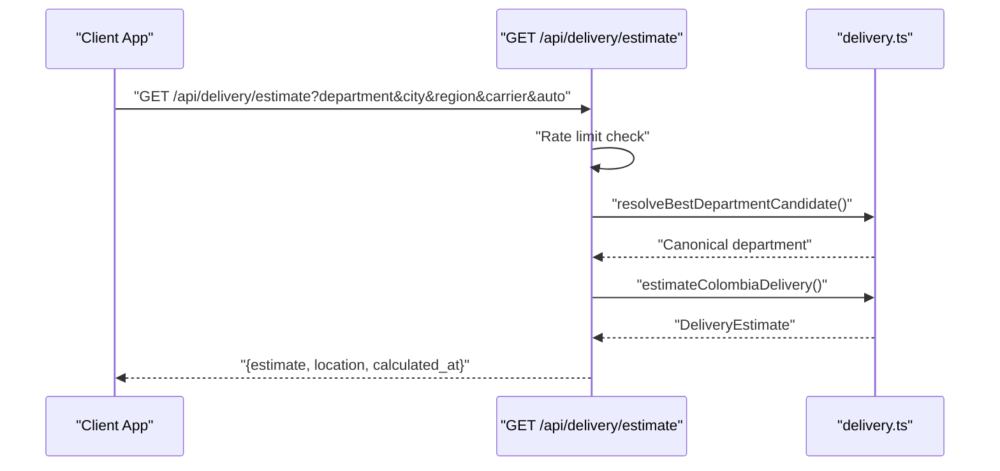
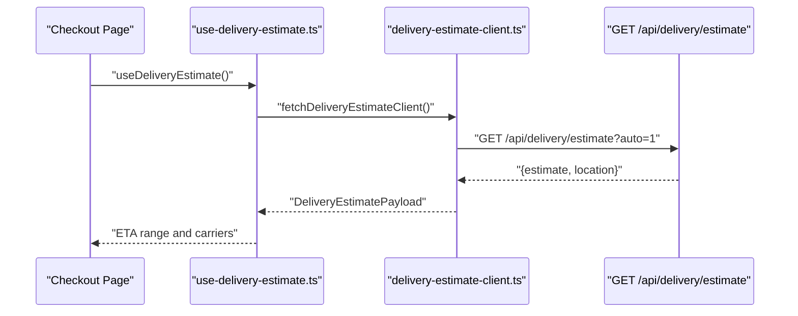
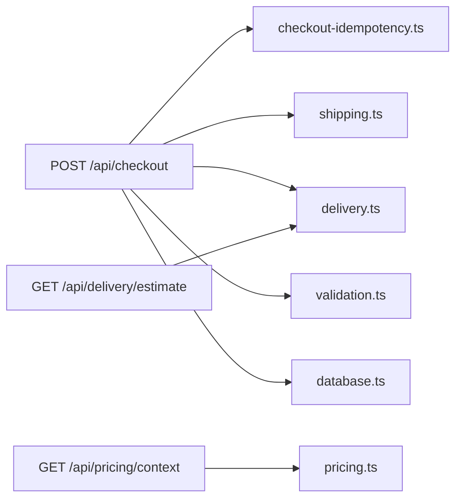

# Checkout API

<cite>
**Referenced Files in This Document**
- [README.md](file://README.md)
- [src/app/api/checkout/route.ts](file://src/app/api/checkout/route.ts)
- [src/app/api/pricing/context/route.ts](file://src/app/api/pricing/context/route.ts)
- [src/app/api/delivery/estimate/route.ts](file://src/app/api/delivery/estimate/route.ts)
- [src/lib/checkout-idempotency.ts](file://src/lib/checkout-idempotency.ts)
- [src/lib/pricing.ts](file://src/lib/pricing.ts)
- [src/lib/delivery.ts](file://src/lib/delivery.ts)
- [src/lib/shipping.ts](file://src/lib/shipping.ts)
- [src/lib/validation.ts](file://src/lib/validation.ts)
- [src/types/database.ts](file://src/types/database.ts)
- [src/lib/delivery-estimate-client.ts](file://src/lib/delivery-estimate-client.ts)
- [src/lib/use-delivery-estimate.ts](file://src/lib/use-delivery-estimate.ts)
- [src/components/checkout/CheckoutShippingForm.tsx](file://src/components/checkout/CheckoutShippingForm.tsx)
</cite>

## Table of Contents
1. [Introduction](#introduction)
2. [Project Structure](#project-structure)
3. [Core Components](#core-components)
4. [Architecture Overview](#architecture-overview)
5. [Detailed Component Analysis](#detailed-component-analysis)
6. [Dependency Analysis](#dependency-analysis)
7. [Performance Considerations](#performance-considerations)
8. [Troubleshooting Guide](#troubleshooting-guide)
9. [Conclusion](#conclusion)
10. [Appendices](#appendices)

## Introduction
This document provides comprehensive API documentation for AllShop’s checkout processing endpoints focused on cash-on-delivery (COD) order creation, dynamic pricing context retrieval, and shipping cost estimation. It covers:
- POST /api/checkout for COD order creation with shipping address validation, product availability checks, and price calculation
- GET /api/pricing/context for dynamic pricing information including taxes, promotions, and regional variations
- GET /api/delivery/estimate for shipping cost calculation based on destination, weight, and delivery method

It includes request/response schemas, validation rules, error codes, success/failure scenarios, examples of complete checkout workflows, price breakdowns, delivery estimations, idempotency handling, session management, and integration with external payment and shipping services.

## Project Structure
The checkout APIs are implemented as Next.js App Router API routes under src/app/api. Supporting libraries handle idempotency, pricing context, delivery estimation, shipping cost calculation, validation, and type definitions.

**Diagram sources**
- [src/app/api/checkout/route.ts:1-872](file://src/app/api/checkout/route.ts#L1-L872)
- [src/app/api/pricing/context/route.ts:1-13](file://src/app/api/pricing/context/route.ts#L1-L13)
- [src/app/api/delivery/estimate/route.ts:1-130](file://src/app/api/delivery/estimate/route.ts#L1-L130)
- [src/lib/checkout-idempotency.ts:1-33](file://src/lib/checkout-idempotency.ts#L1-L33)
- [src/lib/pricing.ts:1-146](file://src/lib/pricing.ts#L1-L146)
- [src/lib/delivery.ts:1-488](file://src/lib/delivery.ts#L1-L488)
- [src/lib/shipping.ts:1-73](file://src/lib/shipping.ts#L1-L73)
- [src/lib/validation.ts:1-112](file://src/lib/validation.ts#L1-L112)
- [src/lib/delivery-estimate-client.ts:1-41](file://src/lib/delivery-estimate-client.ts#L1-L41)
- [src/lib/use-delivery-estimate.ts:1-50](file://src/lib/use-delivery-estimate.ts#L1-L50)
- [src/types/database.ts:1-294](file://src/types/database.ts#L1-L294)

**Section sources**
- [README.md:1-127](file://README.md#L1-L127)
- [src/app/api/checkout/route.ts:1-872](file://src/app/api/checkout/route.ts#L1-L872)
- [src/app/api/pricing/context/route.ts:1-13](file://src/app/api/pricing/context/route.ts#L1-L13)
- [src/app/api/delivery/estimate/route.ts:1-130](file://src/app/api/delivery/estimate/route.ts#L1-L130)

## Core Components
- POST /api/checkout
  - Validates checkout payload (payer, shipping, verification)
  - Normalizes and resolves product snapshots from the catalog
  - Calculates subtotal, shipping cost, and total
  - Enforces idempotency and duplicate detection
  - Reserves stock and persists order to the database
  - Sends notifications and returns order metadata
- GET /api/pricing/context
  - Returns pricing context including currency, exchange rates, and locale
- GET /api/delivery/estimate
  - Estimates delivery window and carriers based on department/city/region or headers
  - Supports auto-inference from Vercel-provided headers

**Section sources**
- [src/app/api/checkout/route.ts:497-864](file://src/app/api/checkout/route.ts#L497-L864)
- [src/app/api/pricing/context/route.ts:1-13](file://src/app/api/pricing/context/route.ts#L1-L13)
- [src/app/api/delivery/estimate/route.ts:1-130](file://src/app/api/delivery/estimate/route.ts#L1-L130)

## Architecture Overview
The checkout flow integrates client-side delivery estimation with server-side order processing and persistence.

**Diagram sources**
- [src/app/api/delivery/estimate/route.ts:44-129](file://src/app/api/delivery/estimate/route.ts#L44-L129)
- [src/lib/delivery.ts:438-487](file://src/lib/delivery.ts#L438-L487)
- [src/lib/delivery-estimate-client.ts:19-40](file://src/lib/delivery-estimate-client.ts#L19-L40)
- [src/lib/use-delivery-estimate.ts:14-49](file://src/lib/use-delivery-estimate.ts#L14-L49)
- [src/app/api/checkout/route.ts:497-864](file://src/app/api/checkout/route.ts#L497-L864)
- [src/lib/checkout-idempotency.ts:5-17](file://src/lib/checkout-idempotency.ts#L5-L17)
- [src/lib/shipping.ts:62-68](file://src/lib/shipping.ts#L62-L68)

## Detailed Component Analysis

### POST /api/checkout
Purpose: Create a cash-on-delivery order with strict validation and idempotency.

- Request body schema
  - items: array of objects with id, slug (optional), quantity, variant (optional)
  - payer: object with name, email, phone, document
  - shipping: object with address, reference (optional), city, department, zip (optional), type (must be "nacional"), cost (optional), carrier_code/carrier_name/insured/eta_min_days/eta_max_days/eta_range (optional)
  - verification: object with address_confirmed=true, availability_confirmed=true, product_acknowledged=true
  - pricing: object with display_currency/display_locale/country_code/display_rate (optional)
- Validation rules
  - Items must be present and quantities sanitized (clamped to 1–10)
  - Payer fields: name≥6 chars, valid email, phone normalized, document 6–15 digits
  - Shipping: address≥12 chars, city≥3 chars, department known Colombia department
  - shipping.type must be "nacional"
  - verification flags must be true
- Processing logic
  - Normalize idempotency key and derive payment_id
  - Validate CSRF, rate limits, IP block, VPN/proxy
  - Load product snapshots (supports id and slug lookups)
  - Build priced items and compute subtotal
  - Calculate shipping cost:
    - If all items are free-shipping, shipping cost is 0
    - Else if custom shipping cost provided, use the maximum among items
    - Otherwise use default national fee
  - Estimate delivery days and carriers
  - Persist order with notes containing pricing/logistics/verification/email metadata
  - Notify Discord and send order confirmation email
  - Return order_id, order_token, status, redirect_url
- Idempotency handling
  - payment_id derived from normalized x-idempotency-key
  - If duplicate payment_id detected, return existing order metadata
- Error codes
  - 400: Invalid payload, missing items, invalid product resolution
  - 403: CSRF invalid, same-origin violation, VPN/proxy blocked, IP blocked
  - 409: Duplicate recent orders, stock reservation conflict
  - 429: Rate limit exceeded
  - 500: Database not configured, order save failure, internal error

**Diagram sources**
- [src/app/api/checkout/route.ts:596-864](file://src/app/api/checkout/route.ts#L596-L864)
- [src/lib/checkout-idempotency.ts:5-17](file://src/lib/checkout-idempotency.ts#L5-L17)
- [src/lib/shipping.ts:62-68](file://src/lib/shipping.ts#L62-L68)
- [src/lib/delivery.ts:438-487](file://src/lib/delivery.ts#L438-L487)

**Section sources**
- [src/app/api/checkout/route.ts:50-91](file://src/app/api/checkout/route.ts#L50-L91)
- [src/app/api/checkout/route.ts:172-196](file://src/app/api/checkout/route.ts#L172-L196)
- [src/app/api/checkout/route.ts:198-233](file://src/app/api/checkout/route.ts#L198-L233)
- [src/app/api/checkout/route.ts:255-352](file://src/app/api/checkout/route.ts#L255-L352)
- [src/app/api/checkout/route.ts:354-388](file://src/app/api/checkout/route.ts#L354-L388)
- [src/app/api/checkout/route.ts:390-408](file://src/app/api/checkout/route.ts#L390-L408)
- [src/app/api/checkout/route.ts:497-864](file://src/app/api/checkout/route.ts#L497-L864)
- [src/lib/checkout-idempotency.ts:5-32](file://src/lib/checkout-idempotency.ts#L5-L32)
- [src/lib/shipping.ts:37-68](file://src/lib/shipping.ts#L37-L68)
- [src/lib/validation.ts:14-65](file://src/lib/validation.ts#L14-L65)
- [src/types/database.ts:68-86](file://src/types/database.ts#L68-L86)

### GET /api/pricing/context
Purpose: Provide dynamic pricing context including currency, exchange rates, and locale for display.

- Response payload
  - countryCode, locale, currency, baseCurrency, paymentCurrency
  - rates: Record of currency to COP rate
  - rateToDisplay: COP rate used for display
  - source: "remote" or "fallback"
  - updatedAt: ISO timestamp
- Behavior
  - Returns default pricing context with fallback rates
  - Sets cache headers for client caching

**Diagram sources**
- [src/app/api/pricing/context/route.ts:1-13](file://src/app/api/pricing/context/route.ts#L1-L13)
- [src/lib/pricing.ts:113-126](file://src/lib/pricing.ts#L113-L126)

**Section sources**
- [src/app/api/pricing/context/route.ts:1-13](file://src/app/api/pricing/context/route.ts#L1-L13)
- [src/lib/pricing.ts:24-34](file://src/lib/pricing.ts#L24-L34)
- [src/lib/pricing.ts:113-126](file://src/lib/pricing.ts#L113-L126)

### GET /api/delivery/estimate
Purpose: Estimate delivery window and available carriers for Colombia destinations.

- Query parameters
  - department, city, region, carrier, auto (1 to enable header-based inference)
- Response payload
  - estimate: {department, city, carrier, availableCarriers, minBusinessDays, maxBusinessDays, estimatedStartDate, estimatedEndDate, formattedRange, freeShipping, cutOffApplied, confidence, modelVersion}
  - location: {source, country_code, region_code, city, department, inferred_from_headers}
  - calculated_at: ISO timestamp
- Behavior
  - Applies rate limit per IP
  - Infers department from query parameters or Vercel headers when auto=1
  - Picks best carrier considering department, remote zones, and preferences
  - Computes business-day offsets and cutoff adjustments

**Diagram sources**
- [src/app/api/delivery/estimate/route.ts:44-129](file://src/app/api/delivery/estimate/route.ts#L44-L129)
- [src/lib/delivery.ts:421-436](file://src/lib/delivery.ts#L421-L436)
- [src/lib/delivery.ts:438-487](file://src/lib/delivery.ts#L438-L487)

**Section sources**
- [src/app/api/delivery/estimate/route.ts:1-130](file://src/app/api/delivery/estimate/route.ts#L1-L130)
- [src/lib/delivery.ts:9-23](file://src/lib/delivery.ts#L9-L23)
- [src/lib/delivery.ts:421-487](file://src/lib/delivery.ts#L421-L487)

### Frontend Integration and Delivery Estimation
- Client-side hook fetches delivery estimate automatically
- Form displays ETA and carrier options
- Uses canonical departments and city-to-department mapping

**Diagram sources**
- [src/lib/use-delivery-estimate.ts:14-49](file://src/lib/use-delivery-estimate.ts#L14-L49)
- [src/lib/delivery-estimate-client.ts:19-40](file://src/lib/delivery-estimate-client.ts#L19-L40)
- [src/app/api/delivery/estimate/route.ts:44-129](file://src/app/api/delivery/estimate/route.ts#L44-L129)
- [src/components/checkout/CheckoutShippingForm.tsx:1-174](file://src/components/checkout/CheckoutShippingForm.tsx#L1-L174)

**Section sources**
- [src/lib/use-delivery-estimate.ts:1-50](file://src/lib/use-delivery-estimate.ts#L1-L50)
- [src/lib/delivery-estimate-client.ts:1-41](file://src/lib/delivery-estimate-client.ts#L1-L41)
- [src/components/checkout/CheckoutShippingForm.tsx:1-174](file://src/components/checkout/CheckoutShippingForm.tsx#L1-L174)

## Dependency Analysis
- Checkout endpoint depends on:
  - Idempotency utilities for payment_id derivation
  - Product catalog resolution and stock reservation
  - Shipping cost calculation and delivery estimation
  - Validation helpers and rate limiting
  - Database types for order insertion
- Pricing context depends on currency and locale resolution
- Delivery estimate depends on Colombia department/city mapping and carrier selection logic

**Diagram sources**
- [src/app/api/checkout/route.ts:1-49](file://src/app/api/checkout/route.ts#L1-L49)
- [src/lib/checkout-idempotency.ts:1-33](file://src/lib/checkout-idempotency.ts#L1-L33)
- [src/lib/shipping.ts:1-73](file://src/lib/shipping.ts#L1-L73)
- [src/lib/delivery.ts:1-488](file://src/lib/delivery.ts#L1-L488)
- [src/lib/validation.ts:1-112](file://src/lib/validation.ts#L1-L112)
- [src/types/database.ts:1-294](file://src/types/database.ts#L1-L294)
- [src/app/api/pricing/context/route.ts:1-13](file://src/app/api/pricing/context/route.ts#L1-L13)
- [src/lib/pricing.ts:1-146](file://src/lib/pricing.ts#L1-L146)
- [src/app/api/delivery/estimate/route.ts:1-130](file://src/app/api/delivery/estimate/route.ts#L1-L130)

**Section sources**
- [src/app/api/checkout/route.ts:1-872](file://src/app/api/checkout/route.ts#L1-L872)
- [src/lib/checkout-idempotency.ts:1-33](file://src/lib/checkout-idempotency.ts#L1-L33)
- [src/lib/shipping.ts:1-73](file://src/lib/shipping.ts#L1-L73)
- [src/lib/delivery.ts:1-488](file://src/lib/delivery.ts#L1-L488)
- [src/lib/validation.ts:1-112](file://src/lib/validation.ts#L1-L112)
- [src/types/database.ts:1-294](file://src/types/database.ts#L1-L294)
- [src/app/api/pricing/context/route.ts:1-13](file://src/app/api/pricing/context/route.ts#L1-L13)
- [src/lib/pricing.ts:1-146](file://src/lib/pricing.ts#L1-L146)
- [src/app/api/delivery/estimate/route.ts:1-130](file://src/app/api/delivery/estimate/route.ts#L1-L130)

## Performance Considerations
- Rate limiting on checkout and delivery endpoints prevents abuse
- Client-side caching of delivery estimates reduces repeated requests
- Server-side fallback pricing context avoids external dependencies
- Stock reservations are performed atomically via database RPC to prevent overselling

[No sources needed since this section provides general guidance]

## Troubleshooting Guide
Common issues and resolutions:
- 400 Bad Request
  - Ensure items array is present and quantities are valid
  - Verify payer and shipping fields meet length and format requirements
  - Confirm verification flags are true and shipping.type is "nacional"
- 403 Forbidden
  - CSRF token invalid or missing; reload page and retry
  - Same-origin validation failed; ensure requests originate from your domain
  - VPN/proxy blocked or IP blocked; disable VPN and retry
- 409 Conflict
  - Too many recent orders for the same phone/address; wait for pending orders to settle
  - Stock reservation conflict; refresh page and retry
- 429 Too Many Requests
  - Exceeded rate limits; wait for Retry-After seconds and retry
- 500 Internal Server Error
  - Database not configured or order save failed; check environment variables and logs

**Section sources**
- [src/app/api/checkout/route.ts:532-566](file://src/app/api/checkout/route.ts#L532-L566)
- [src/app/api/checkout/route.ts:633-641](file://src/app/api/checkout/route.ts#L633-L641)
- [src/app/api/checkout/route.ts:765-795](file://src/app/api/checkout/route.ts#L765-L795)
- [src/app/api/delivery/estimate/route.ts:51-56](file://src/app/api/delivery/estimate/route.ts#L51-L56)

## Conclusion
AllShop’s checkout APIs provide a robust, secure, and efficient cash-on-delivery ordering experience. They enforce strict validation, support idempotency, integrate with delivery estimation, and persist orders reliably. The pricing context and delivery estimate endpoints offer flexible, cacheable data for client-side rendering and user experience optimization.

[No sources needed since this section summarizes without analyzing specific files]

## Appendices

### Request/Response Schemas

- POST /api/checkout
  - Request body
    - items: array of { id, slug?, quantity, variant? }
    - payer: { name, email, phone, document }
    - shipping: { address, reference?, city, department, zip?, type: "nacional", cost?, carrier_code?, carrier_name?, insured?, eta_min_days?, eta_max_days?, eta_range? }
    - verification: { address_confirmed: true, availability_confirmed: true, product_acknowledged: true }
    - pricing: { display_currency?, display_locale?, country_code?, display_rate? }
  - Response
    - { order_id, order_token, status, fulfillment_triggered?, redirect_url }

- GET /api/pricing/context
  - Response
    - { countryCode, locale, currency, baseCurrency, paymentCurrency, rates, rateToDisplay, source, updatedAt }

- GET /api/delivery/estimate
  - Query params
    - department, city, region, carrier, auto=1
  - Response
    - { estimate, location, calculated_at }

**Section sources**
- [src/app/api/checkout/route.ts:57-91](file://src/app/api/checkout/route.ts#L57-L91)
- [src/app/api/checkout/route.ts:846-852](file://src/app/api/checkout/route.ts#L846-L852)
- [src/app/api/pricing/context/route.ts:4-11](file://src/app/api/pricing/context/route.ts#L4-L11)
- [src/app/api/delivery/estimate/route.ts:116-129](file://src/app/api/delivery/estimate/route.ts#L116-L129)

### Validation Rules and Examples

- Validation rules
  - Name: required, ≥6 chars
  - Email: required, valid format
  - Phone: required, digits 7–15
  - Document: required, 6–15 digits
  - Address: required, ≥12 chars
  - City: required, ≥3 chars
  - Department: must match known Colombia departments
  - Verification flags: must be true
  - Items: must be present and quantities sanitized

- Example workflows
  - Complete checkout workflow
    - Client fetches delivery estimate via GET /api/delivery/estimate?auto=1
    - Client submits POST /api/checkout with items, payer, shipping, verification, pricing
    - Server validates, reserves stock, calculates totals, persists order, and returns order metadata
  - Price breakdown
    - Subtotal = sum of unit_price × quantity for each item
    - Shipping cost = 0 if all items free-shipping, otherwise default national fee or maximum custom shipping cost
    - Total = subtotal + shipping_cost
  - Delivery estimation
    - Based on department/city/region and carrier preference
    - Business-day offsets and cutoff adjustments applied

**Section sources**
- [src/lib/validation.ts:14-65](file://src/lib/validation.ts#L14-L65)
- [src/lib/shipping.ts:62-68](file://src/lib/shipping.ts#L62-L68)
- [src/lib/delivery.ts:438-487](file://src/lib/delivery.ts#L438-L487)
- [src/app/api/checkout/route.ts:390-408](file://src/app/api/checkout/route.ts#L390-L408)

### Idempotency and Session Management
- Idempotency
  - x-idempotency-key normalized and hashed to derive payment_id
  - If duplicate payment_id detected, server returns existing order metadata without creating a new order
- Session management
  - Order lookup requires signed order_token generated server-side
  - CSRF protection enforced in production
  - Rate limits applied to checkout and delivery endpoints

**Section sources**
- [src/lib/checkout-idempotency.ts:5-32](file://src/lib/checkout-idempotency.ts#L5-L32)
- [src/app/api/checkout/route.ts:499-502](file://src/app/api/checkout/route.ts#L499-L502)
- [src/app/api/checkout/route.ts:523-530](file://src/app/api/checkout/route.ts#L523-L530)
- [src/app/api/delivery/estimate/route.ts:46-56](file://src/app/api/delivery/estimate/route.ts#L46-L56)

### Integration Notes
- External services
  - Delivery estimation relies on Colombia department/city mapping and carrier definitions
  - Pricing context provides exchange rates for display; fallback rates used when remote data unavailable
- Frontend integration
  - use-delivery-estimate.ts caches and exposes delivery estimates
  - delivery-estimate-client.ts performs GET /api/delivery/estimate with caching headers
  - CheckoutShippingForm.tsx renders department options and ETA display

**Section sources**
- [src/lib/delivery.ts:32-66](file://src/lib/delivery.ts#L32-L66)
- [src/lib/pricing.ts:93-126](file://src/lib/pricing.ts#L93-L126)
- [src/lib/use-delivery-estimate.ts:14-49](file://src/lib/use-delivery-estimate.ts#L14-L49)
- [src/lib/delivery-estimate-client.ts:19-40](file://src/lib/delivery-estimate-client.ts#L19-L40)
- [src/components/checkout/CheckoutShippingForm.tsx:1-174](file://src/components/checkout/CheckoutShippingForm.tsx#L1-L174)