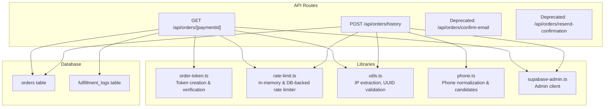
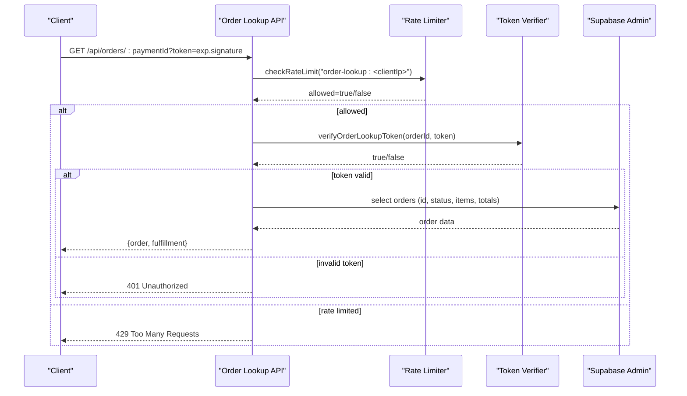
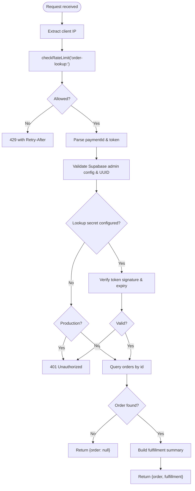
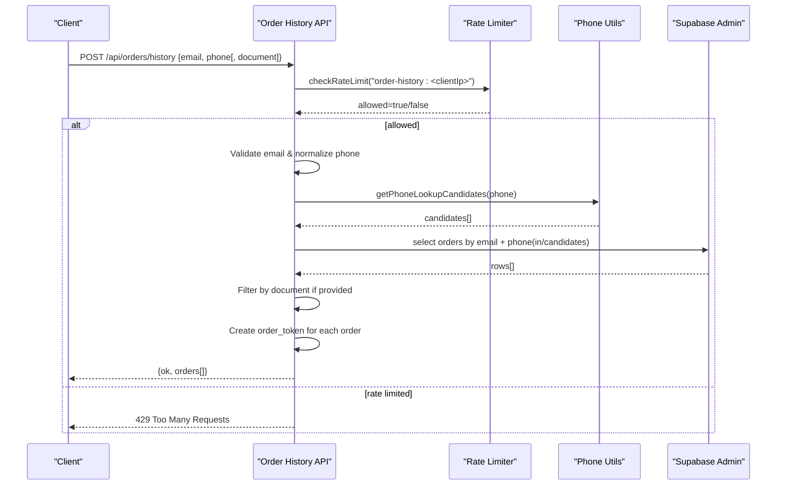
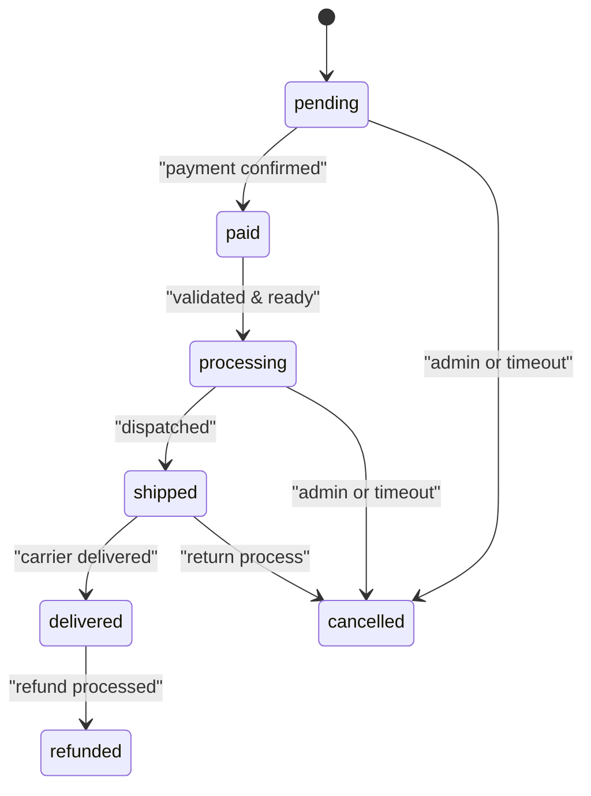
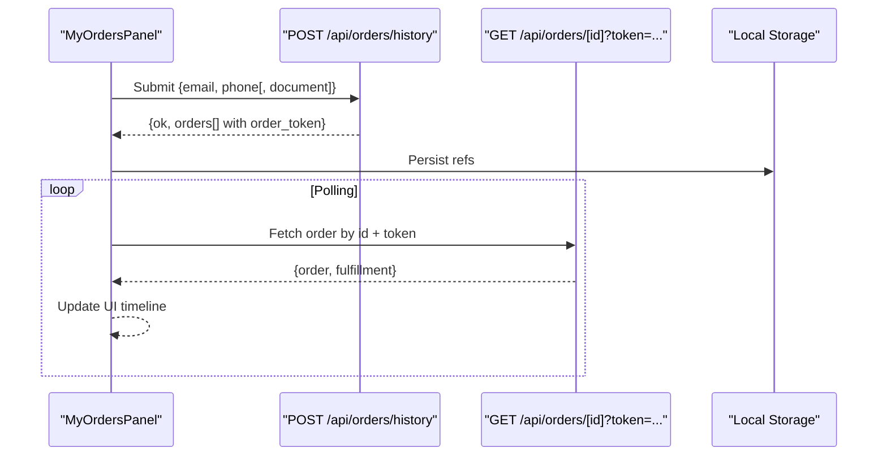
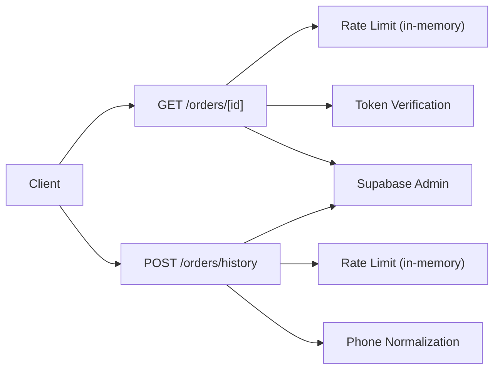

# Order Management API

<cite>
**Referenced Files in This Document**
- [README.md](file://README.md)
- [route.ts](file://src/app/api/orders/[paymentId]/route.ts)
- [route.ts](file://src/app/api/orders/history/route.ts)
- [route.ts](file://src/app/api/orders/confirm-email/route.ts)
- [route.ts](file://src/app/api/orders/resend-confirmation/route.ts)
- [order-token.ts](file://src/lib/order-token.ts)
- [rate-limit.ts](file://src/lib/rate-limit.ts)
- [utils.ts](file://src/lib/utils.ts)
- [database.ts](file://src/types/database.ts)
- [supabase-admin.ts](file://src/lib/supabase-admin.ts)
- [MyOrdersPanel.tsx](file://src/components/orders/MyOrdersPanel.tsx)
- [phone.ts](file://src/lib/phone.ts)
</cite>

## Table of Contents
1. [Introduction](#introduction)
2. [Project Structure](#project-structure)
3. [Core Components](#core-components)
4. [Architecture Overview](#architecture-overview)
5. [Detailed Component Analysis](#detailed-component-analysis)
6. [Dependency Analysis](#dependency-analysis)
7. [Performance Considerations](#performance-considerations)
8. [Troubleshooting Guide](#troubleshooting-guide)
9. [Conclusion](#conclusion)
10. [Appendices](#appendices)

## Introduction
This document describes AllShop’s order management API endpoints for retrieving order status, accessing order details, viewing customer order history, and managing email-related order confirmation flows. It covers request authentication, response formats, order state transitions, error handling patterns, and operational guidance for customer notifications and administrative access controls. It also outlines security considerations, rate limiting, and integration points with email services and order fulfillment systems.

## Project Structure
The order management API is implemented as Next.js App Router API routes under src/app/api/orders. Supporting libraries provide rate limiting, token signing/verification, phone normalization, and Supabase admin access.

**Diagram sources**
- [route.ts:1-101](file://src/app/api/orders/[paymentId]/route.ts#L1-L101)
- [route.ts:1-145](file://src/app/api/orders/history/route.ts#L1-L145)
- [order-token.ts:1-65](file://src/lib/order-token.ts#L1-L65)
- [rate-limit.ts:1-165](file://src/lib/rate-limit.ts#L1-L165)
- [utils.ts:1-102](file://src/lib/utils.ts#L1-L102)
- [phone.ts:1-35](file://src/lib/phone.ts#L1-L35)
- [supabase-admin.ts:1-31](file://src/lib/supabase-admin.ts#L1-L31)
- [database.ts:183-231](file://src/types/database.ts#L183-L231)

**Section sources**
- [README.md:1-127](file://README.md#L1-L127)

## Core Components
- GET /api/orders/[paymentId]: Retrieves a single order by ID with a signed token. Returns a subset of order fields and a fulfillment summary.
- POST /api/orders/history: Returns recent orders for a customer profile (email + phone + optional document) with generated order tokens for secure lookup.
- Deprecated endpoints: confirm-email and resend-confirmation are deprecated and return a deprecation response.

Security and infrastructure:
- Signed order lookup tokens with configurable TTL.
- In-memory and DB-backed rate limiting.
- Supabase admin client for secure DB access.
- Phone normalization for robust customer lookup.

**Section sources**
- [route.ts:39-100](file://src/app/api/orders/[paymentId]/route.ts#L39-L100)
- [route.ts:43-144](file://src/app/api/orders/history/route.ts#L43-L144)
- [route.ts:1-28](file://src/app/api/orders/confirm-email/route.ts#L1-L28)
- [route.ts:1-28](file://src/app/api/orders/resend-confirmation/route.ts#L1-L28)
- [order-token.ts:35-64](file://src/lib/order-token.ts#L35-L64)
- [rate-limit.ts:43-88](file://src/lib/rate-limit.ts#L43-L88)
- [supabase-admin.ts:18-30](file://src/lib/supabase-admin.ts#L18-L30)

## Architecture Overview
The order management API integrates with Supabase for data persistence, applies rate limiting for protection, and uses signed tokens to authorize order lookups. Frontend components consume these endpoints to present order timelines and statuses.

**Diagram sources**
- [route.ts:44-100](file://src/app/api/orders/[paymentId]/route.ts#L44-L100)
- [rate-limit.ts:43-88](file://src/lib/rate-limit.ts#L43-L88)
- [order-token.ts:50-64](file://src/lib/order-token.ts#L50-L64)
- [supabase-admin.ts:18-30](file://src/lib/supabase-admin.ts#L18-L30)

## Detailed Component Analysis

### GET /api/orders/[paymentId]
Purpose:
- Retrieve a single order by ID with a signed token. Returns a safe subset of order fields and a fulfillment summary.

Authentication and authorization:
- Requires ORDER_LOOKUP_SECRET configured. Tokens are validated using HMAC signatures and expiration checks.
- In production without a lookup secret, order lookups are rejected to prevent exposure.

Rate limiting:
- Per-IP sliding window: 60 requests per minute.

Response format:
- Success: { order: OrderSummary | null, fulfillment: FulfillmentSummary }
- Failure: 401 Unauthorized or 429 Too Many Requests

Order fields returned:
- id, status, items, subtotal, shipping_cost, total, created_at, updated_at

Fulfillment summary:
- Indicates dispatch success/failure, last event timestamps, and action/status metadata derived from order status.

**Diagram sources**
- [route.ts:44-100](file://src/app/api/orders/[paymentId]/route.ts#L44-L100)
- [order-token.ts:35-64](file://src/lib/order-token.ts#L35-L64)
- [rate-limit.ts:43-88](file://src/lib/rate-limit.ts#L43-L88)
- [utils.ts:56-67](file://src/lib/utils.ts#L56-L67)

**Section sources**
- [route.ts:39-100](file://src/app/api/orders/[paymentId]/route.ts#L39-L100)
- [order-token.ts:35-64](file://src/lib/order-token.ts#L35-L64)
- [rate-limit.ts:43-88](file://src/lib/rate-limit.ts#L43-L88)
- [utils.ts:56-67](file://src/lib/utils.ts#L56-L67)
- [supabase-admin.ts:18-30](file://src/lib/supabase-admin.ts#L18-L30)
- [database.ts:183-209](file://src/types/database.ts#L183-L209)

### POST /api/orders/history
Purpose:
- Return recent orders for a customer profile (email + phone + optional document). Each order includes a short-lived order token for secure lookup.

Authentication and authorization:
- No authentication required for this endpoint. Access is controlled by rate limiting and input validation.

Rate limiting:
- Per-IP sliding window: 10 requests per 10 minutes.

Validation:
- Email must be valid.
- Phone must normalize to a valid candidate; multiple candidates supported.
- Document is optional; if provided, must be at least 4 digits.

Response format:
- Success: { ok: true, orders: [{ id, status, total, created_at, updated_at, order_token }] }
- Failure: 400 Bad Request or 500 Internal Server Error

Order token generation:
- Uses ORDER_LOOKUP_SECRET and TTL configuration to produce a signed token with expiration.

**Diagram sources**
- [route.ts:43-144](file://src/app/api/orders/history/route.ts#L43-L144)
- [rate-limit.ts:43-88](file://src/lib/rate-limit.ts#L43-L88)
- [phone.ts:24-34](file://src/lib/phone.ts#L24-L34)
- [order-token.ts:39-48](file://src/lib/order-token.ts#L39-L48)
- [supabase-admin.ts:18-30](file://src/lib/supabase-admin.ts#L18-L30)

**Section sources**
- [route.ts:43-144](file://src/app/api/orders/history/route.ts#L43-L144)
- [phone.ts:1-35](file://src/lib/phone.ts#L1-L35)
- [order-token.ts:39-48](file://src/lib/order-token.ts#L39-L48)
- [rate-limit.ts:43-88](file://src/lib/rate-limit.ts#L43-L88)
- [supabase-admin.ts:18-30](file://src/lib/supabase-admin.ts#L18-L30)

### Deprecated: POST /api/orders/confirm-email
Purpose:
- Previously handled email-based order confirmation. Now deprecated.

Behavior:
- Returns 410 Gone with a deprecation notice.

**Section sources**
- [route.ts:1-28](file://src/app/api/orders/confirm-email/route.ts#L1-L28)

### Deprecated: POST /api/orders/resend-confirmation
Purpose:
- Previously handled resending confirmation emails. Now deprecated.

Behavior:
- Returns 410 Gone with a deprecation notice.

**Section sources**
- [route.ts:1-28](file://src/app/api/orders/resend-confirmation/route.ts#L1-L28)

### Order State Transitions and Fulfillment Summary
Order statuses:
- pending, paid, processing, shipped, delivered, cancelled, refunded

Fulfillment summary:
- Built from order status and updated_at to reflect manual dispatch readiness and success indicators.

**Diagram sources**
- [database.ts:4-11](file://src/types/database.ts#L4-L11)
- [route.ts:23-37](file://src/app/api/orders/[paymentId]/route.ts#L23-L37)

**Section sources**
- [database.ts:4-11](file://src/types/database.ts#L4-L11)
- [route.ts:23-37](file://src/app/api/orders/[paymentId]/route.ts#L23-L37)

### Frontend Integration and Customer Notifications
Frontend component MyOrdersPanel demonstrates:
- Fetching order history via POST /api/orders/history.
- Fetching individual orders via GET /api/orders/[paymentId]?token=...
- Rendering order timelines, statuses, and fulfillment hints.
- Storing order references locally for polling updates.

**Diagram sources**
- [MyOrdersPanel.tsx:335-355](file://src/components/orders/MyOrdersPanel.tsx#L335-L355)
- [MyOrdersPanel.tsx:317-333](file://src/components/orders/MyOrdersPanel.tsx#L317-L333)
- [route.ts:130-139](file://src/app/api/orders/history/route.ts#L130-L139)
- [route.ts:96-99](file://src/app/api/orders/[paymentId]/route.ts#L96-L99)

**Section sources**
- [MyOrdersPanel.tsx:317-355](file://src/components/orders/MyOrdersPanel.tsx#L317-L355)

## Dependency Analysis
- Authentication relies on ORDER_LOOKUP_SECRET and HMAC signatures.
- Rate limiting is enforced via in-memory buckets with optional DB-backed enforcement for critical paths.
- Supabase admin client is used for secure DB queries.
- Phone normalization supports Colombian phone formats and candidate expansion.

**Diagram sources**
- [route.ts:44-100](file://src/app/api/orders/[paymentId]/route.ts#L44-L100)
- [route.ts:43-144](file://src/app/api/orders/history/route.ts#L43-L144)
- [rate-limit.ts:43-88](file://src/lib/rate-limit.ts#L43-L88)
- [order-token.ts:50-64](file://src/lib/order-token.ts#L50-L64)
- [phone.ts:24-34](file://src/lib/phone.ts#L24-L34)
- [supabase-admin.ts:18-30](file://src/lib/supabase-admin.ts#L18-L30)

**Section sources**
- [rate-limit.ts:43-88](file://src/lib/rate-limit.ts#L43-L88)
- [order-token.ts:35-64](file://src/lib/order-token.ts#L35-L64)
- [phone.ts:1-35](file://src/lib/phone.ts#L1-L35)
- [supabase-admin.ts:18-30](file://src/lib/supabase-admin.ts#L18-L30)

## Performance Considerations
- In-memory rate limiter is best-effort in serverless environments; DB-backed limiter is available for critical paths.
- Queries restrict returned fields to minimize payload size.
- Frontend polling intervals are configurable to reduce load.

[No sources needed since this section provides general guidance]

## Troubleshooting Guide
Common issues and resolutions:
- 401 Unauthorized on GET /api/orders/[paymentId]: Ensure ORDER_LOOKUP_SECRET is configured and the token is valid and unexpired.
- 429 Too Many Requests: Reduce client-side polling frequency or adjust rate limits.
- Invalid email/phone/document on POST /api/orders/history: Correct input formats; phone must normalize to a valid candidate.
- 500 Internal Server Error on history: Supabase admin not configured or query error; verify environment variables and DB connectivity.
- Deprecated endpoints: confirm-email and resend-confirmation return 410; use current checkout flow instead.

**Section sources**
- [route.ts:72-79](file://src/app/api/orders/[paymentId]/route.ts#L72-L79)
- [route.ts:61-66](file://src/app/api/orders/history/route.ts#L61-L66)
- [rate-limit.ts:43-88](file://src/lib/rate-limit.ts#L43-L88)
- [README.md:115-127](file://README.md#L115-L127)

## Conclusion
AllShop’s order management API provides secure, rate-limited access to order information with signed tokens and careful field exposure. The deprecated email confirmation endpoints are no longer used. Integrations with email services and fulfillment systems can leverage the order status model and tokenized lookup for customer notifications and administrative controls.

[No sources needed since this section summarizes without analyzing specific files]

## Appendices

### API Definitions

- GET /api/orders/[paymentId]?token=exp.signature
  - Description: Retrieve a single order by ID with a signed token.
  - Authentication: ORDER_LOOKUP_SECRET required; token must be valid and unexpired.
  - Rate limit: 60 per minute per IP.
  - Response: { order: OrderSummary | null, fulfillment: FulfillmentSummary }
  - Errors: 401 Unauthorized, 429 Too Many Requests

- POST /api/orders/history
  - Description: Retrieve recent orders for a customer profile.
  - Authentication: None.
  - Rate limit: 10 per 10 minutes per IP.
  - Body: { email, phone, document? }
  - Response: { ok: true, orders: [{ id, status, total, created_at, updated_at, order_token }] }
  - Errors: 400 Bad Request, 500 Internal Server Error

- Deprecated
  - POST /api/orders/confirm-email → 410 Gone
  - POST /api/orders/resend-confirmation → 410 Gone

**Section sources**
- [route.ts:39-100](file://src/app/api/orders/[paymentId]/route.ts#L39-L100)
- [route.ts:43-144](file://src/app/api/orders/history/route.ts#L43-L144)
- [route.ts:1-28](file://src/app/api/orders/confirm-email/route.ts#L1-L28)
- [route.ts:1-28](file://src/app/api/orders/resend-confirmation/route.ts#L1-L28)

### Environment Variables
- ORDER_LOOKUP_SECRET: Required for signed order lookup tokens.
- ORDER_LOOKUP_TOKEN_TTL_MINUTES: Optional TTL for tokens (default 1440 min).
- NEXT_PUBLIC_SUPABASE_URL, SUPABASE_SERVICE_ROLE_KEY: Required for DB access.
- SMTP_USER, SMTP_PASSWORD, EMAIL_FROM: Required for customer notifications.

**Section sources**
- [README.md:14-34](file://README.md#L14-L34)