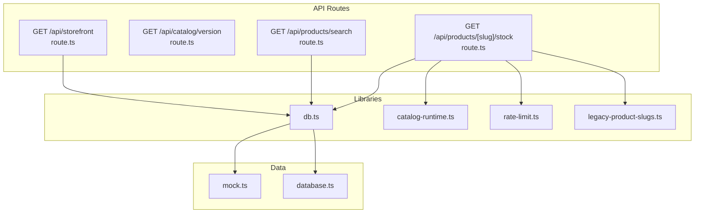
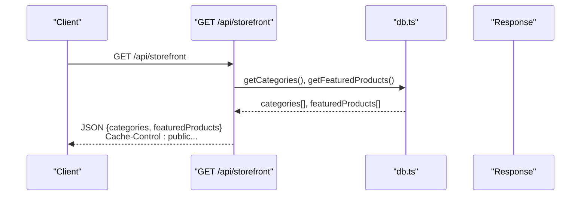
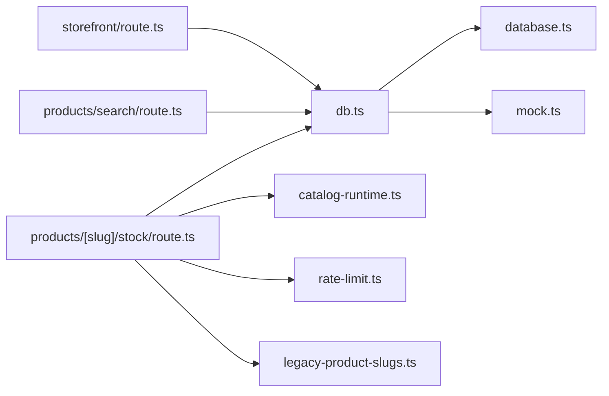

# Storefront API

<cite>
**Referenced Files in This Document**
- [route.ts](file://src/app/api/storefront/route.ts)
- [route.ts](file://src/app/api/catalog/version/route.ts)
- [route.ts](file://src/app/api/products/search/route.ts)
- [route.ts](file://src/app/api/products/[slug]/stock/route.ts)
- [db.ts](file://src/lib/db.ts)
- [catalog-runtime.ts](file://src/lib/catalog-runtime.ts)
- [rate-limit.ts](file://src/lib/rate-limit.ts)
- [legacy-product-slugs.ts](file://src/lib/legacy-product-slugs.ts)
- [database.ts](file://src/types/database.ts)
- [mock.ts](file://src/data/mock.ts)
</cite>

## Table of Contents
1. [Introduction](#introduction)
2. [Project Structure](#project-structure)
3. [Core Components](#core-components)
4. [Architecture Overview](#architecture-overview)
5. [Detailed Component Analysis](#detailed-component-analysis)
6. [Dependency Analysis](#dependency-analysis)
7. [Performance Considerations](#performance-considerations)
8. [Troubleshooting Guide](#troubleshooting-guide)
9. [Conclusion](#conclusion)

## Introduction
This document provides comprehensive API documentation for AllShop's storefront endpoints. It covers:
- GET /api/storefront for retrieving categories and featured products with caching
- GET /api/catalog/version for cache busting and content versioning
- GET /api/products/search for product discovery with lightweight indexing
- GET /api/products/[slug]/stock for inventory availability checks with rate limiting and legacy slug support

The documentation includes request parameters, response schemas, caching headers, error handling, examples, integration patterns, performance considerations, rate limiting, and SEO-friendly URL structures.

## Project Structure
The storefront API endpoints are implemented as Next.js App Router API routes under src/app/api. Supporting libraries handle database access, runtime catalog stock state, rate limiting, and legacy slug normalization.

**Diagram sources**
- [route.ts:1-30](file://src/app/api/storefront/route.ts#L1-L30)
- [route.ts:1-23](file://src/app/api/catalog/version/route.ts#L1-L23)
- [route.ts:1-31](file://src/app/api/products/search/route.ts#L1-L31)
- [route.ts:1-84](file://src/app/api/products/[slug]/stock/route.ts#L1-L84)
- [db.ts:1-309](file://src/lib/db.ts#L1-L309)
- [catalog-runtime.ts:1-800](file://src/lib/catalog-runtime.ts#L1-L800)
- [rate-limit.ts:1-165](file://src/lib/rate-limit.ts#L1-L165)
- [legacy-product-slugs.ts:1-69](file://src/lib/legacy-product-slugs.ts#L1-L69)
- [mock.ts:1-345](file://src/data/mock.ts#L1-L345)
- [database.ts:1-294](file://src/types/database.ts#L1-L294)

**Section sources**
- [route.ts:1-30](file://src/app/api/storefront/route.ts#L1-L30)
- [route.ts:1-23](file://src/app/api/catalog/version/route.ts#L1-L23)
- [route.ts:1-31](file://src/app/api/products/search/route.ts#L1-L31)
- [route.ts:1-84](file://src/app/api/products/[slug]/stock/route.ts#L1-L84)
- [db.ts:1-309](file://src/lib/db.ts#L1-L309)
- [catalog-runtime.ts:1-800](file://src/lib/catalog-runtime.ts#L1-L800)
- [rate-limit.ts:1-165](file://src/lib/rate-limit.ts#L1-L165)
- [legacy-product-slugs.ts:1-69](file://src/lib/legacy-product-slugs.ts#L1-L69)
- [mock.ts:1-345](file://src/data/mock.ts#L1-L345)
- [database.ts:1-294](file://src/types/database.ts#L1-L294)

## Core Components
- Storefront endpoint: Returns categories and featured products with shared caching headers.
- Catalog version endpoint: Provides a cache-busting token with strict no-store headers.
- Product search endpoint: Returns a minimal product index suitable for discovery and faceting.
- Stock availability endpoint: Returns live stock state for a product slug with rate limiting and legacy slug support.

**Section sources**
- [route.ts:6-28](file://src/app/api/storefront/route.ts#L6-L28)
- [route.ts:7-22](file://src/app/api/catalog/version/route.ts#L7-L22)
- [route.ts:6-30](file://src/app/api/products/search/route.ts#L6-L30)
- [route.ts:20-82](file://src/app/api/products/[slug]/stock/route.ts#L20-L82)

## Architecture Overview
The API routes depend on a layered architecture:
- Route handlers orchestrate requests and responses
- Database library abstracts data access and normalization
- Runtime catalog library manages stock state and fallbacks
- Rate limiting protects endpoints from abuse
- Legacy slug utilities normalize and alias slugs

**Diagram sources**
- [route.ts:6-28](file://src/app/api/storefront/route.ts#L6-L28)
- [db.ts:113-181](file://src/lib/db.ts#L113-L181)

**Section sources**
- [route.ts:6-28](file://src/app/api/storefront/route.ts#L6-L28)
- [db.ts:113-181](file://src/lib/db.ts#L113-L181)

## Detailed Component Analysis

### GET /api/storefront
- Purpose: Retrieve categories and featured products for the storefront.
- Request: GET /api/storefront
- Response schema:
  - categories: array of category objects
  - featuredProducts: array of product objects
- Caching: Uses shared cache-control headers for CDN/browser caching.
- Error handling: Returns 500 with error message on failure.

Response shape summary:
- categories: id, name, slug, description, image_url, icon, color, created_at
- featuredProducts: id, name, slug, description, price, compare_at_price, category_id, images, variants, stock_location, free_shipping, shipping_cost, provider_api_url, is_featured, is_active, is_bestseller, meta_title, meta_description, created_at, updated_at

Integration pattern:
- Frontend fetches once on initial page load and relies on cache headers for subsequent refreshes.

Example usage:
- curl -H "Accept: application/json" https://yoursite.com/api/storefront

**Section sources**
- [route.ts:6-28](file://src/app/api/storefront/route.ts#L6-L28)
- [db.ts:113-181](file://src/lib/db.ts#L113-L181)
- [database.ts:96-148](file://src/types/database.ts#L96-L148)

### GET /api/catalog/version
- Purpose: Provide a cache-busting token for catalog updates.
- Request: GET /api/catalog/version
- Response schema:
  - version: string token
  - updated_at: timestamp or null
- Caching: Strict no-store headers to prevent caching.
- Error handling: Returns default payload with version "0" and null updated_at on error.

Integration pattern:
- Frontend can poll or fetch-on-demand to detect catalog changes and invalidate caches.

Example usage:
- curl -H "Accept: application/json" https://yoursite.com/api/catalog/version

**Section sources**
- [route.ts:7-22](file://src/app/api/catalog/version/route.ts#L7-L22)

### GET /api/products/search
- Purpose: Lightweight product discovery endpoint for keyword matching and faceted search.
- Request: GET /api/products/search
- Response schema:
  - products: array of product summary objects
- Caching: Shared cache-control headers for CDN/browser caching.
- Error handling: Returns empty products array with 200 on failure.

Response shape summary:
- products: id, slug, name, price, images (first image only), category_id

Integration pattern:
- Use for autocomplete, search pages, and faceted navigation.
- Combine with category filters and pagination at the client level.

Example usage:
- curl -H "Accept: application/json" https://yoursite.com/api/products/search

**Section sources**
- [route.ts:6-30](file://src/app/api/products/search/route.ts#L6-L30)
- [db.ts:146-161](file://src/lib/db.ts#L146-L161)

### GET /api/products/[slug]/stock
- Purpose: Check inventory availability for a product by slug.
- Request: GET /api/products/:slug/stock
- Path parameters:
  - slug: product slug (SEO-friendly)
- Response schema:
  - live: boolean flag indicating whether stock is live
  - total_stock: total available stock or null
  - variants: array of variant stock info (name, stock, variation_id)
  - source: source of stock ("runtime_state", "manual_snapshot", or "product_fallback")
  - calculated_at: timestamp of last update or current time
- Caching: No-cache headers to prevent stale stock data.
- Error handling: Returns a safe fallback object with live=false and message on failure.
- Rate limiting: Enforced per-client IP with a 20 requests/minute window.

Integration pattern:
- Call after product selection or on product page load.
- Use slug normalization and legacy slug aliases for robustness.

Example usage:
- curl -H "Accept: application/json" https://yoursite.com/api/products/audifonos-xiaomi-redmi-buds-4-lite/stock

**Section sources**
- [route.ts:20-82](file://src/app/api/products/[slug]/stock/route.ts#L20-L82)
- [catalog-runtime.ts:43-64](file://src/lib/catalog-runtime.ts#L43-L64)
- [rate-limit.ts:43-88](file://src/lib/rate-limit.ts#L43-L88)
- [legacy-product-slugs.ts:52-69](file://src/lib/legacy-product-slugs.ts#L52-L69)

## Dependency Analysis
The endpoints share common dependencies and data models.

**Diagram sources**
- [route.ts:1-30](file://src/app/api/storefront/route.ts#L1-L30)
- [route.ts:1-31](file://src/app/api/products/search/route.ts#L1-L31)
- [route.ts:1-84](file://src/app/api/products/[slug]/stock/route.ts#L1-L84)
- [db.ts:1-309](file://src/lib/db.ts#L1-L309)
- [catalog-runtime.ts:1-800](file://src/lib/catalog-runtime.ts#L1-L800)
- [rate-limit.ts:1-165](file://src/lib/rate-limit.ts#L1-L165)
- [legacy-product-slugs.ts:1-69](file://src/lib/legacy-product-slugs.ts#L1-L69)
- [database.ts:1-294](file://src/types/database.ts#L1-L294)
- [mock.ts:1-345](file://src/data/mock.ts#L1-L345)

**Section sources**
- [db.ts:1-309](file://src/lib/db.ts#L1-L309)
- [catalog-runtime.ts:1-800](file://src/lib/catalog-runtime.ts#L1-L800)
- [rate-limit.ts:1-165](file://src/lib/rate-limit.ts#L1-L165)
- [legacy-product-slugs.ts:1-69](file://src/lib/legacy-product-slugs.ts#L1-L69)
- [database.ts:1-294](file://src/types/database.ts#L1-L294)
- [mock.ts:1-345](file://src/data/mock.ts#L1-L345)

## Performance Considerations
- Caching strategy:
  - Storefront and product search use shared cache-control headers to leverage CDN/browser caching.
  - Catalog version and stock endpoints use no-store headers to avoid stale data.
- Parallelization:
  - Storefront fetches categories and featured products concurrently.
- Data normalization:
  - Product lists are normalized to remove duplicates and ensure canonical slugs.
- Rate limiting:
  - Stock endpoint applies per-IP rate limiting to protect backend resources.
- Image optimization:
  - Product search returns a single thumbnail image to reduce payload size.

[No sources needed since this section provides general guidance]

## Troubleshooting Guide
Common issues and resolutions:
- Empty or stale product search results:
  - Verify cache-control headers and consider polling /api/catalog/version for updates.
- Stock discrepancies:
  - Confirm slug normalization and legacy slug aliases are applied.
  - Check rate limiting thresholds if receiving 429 responses.
- Database connectivity:
  - When Supabase is not configured, the system falls back to mock data. Ensure proper configuration for production.

**Section sources**
- [route.ts:30-35](file://src/app/api/products/[slug]/stock/route.ts#L30-L35)
- [db.ts:146-161](file://src/lib/db.ts#L146-L161)
- [mock.ts:1-345](file://src/data/mock.ts#L1-L345)

## Conclusion
AllShop's storefront API provides efficient, cache-aware endpoints for browsing categories, discovering products, and checking stock availability. By leveraging shared caching headers, rate limiting, and slug normalization, the API balances performance, correctness, and developer experience. Integrate these endpoints to build responsive, SEO-friendly storefront experiences.