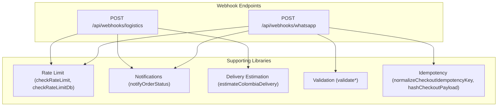
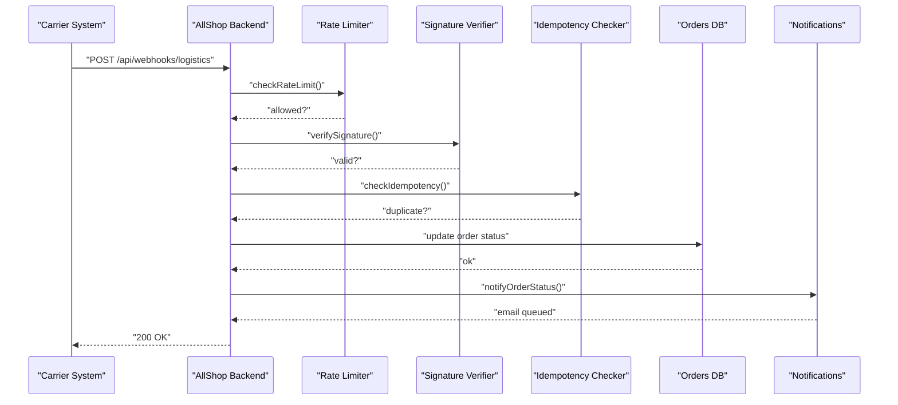
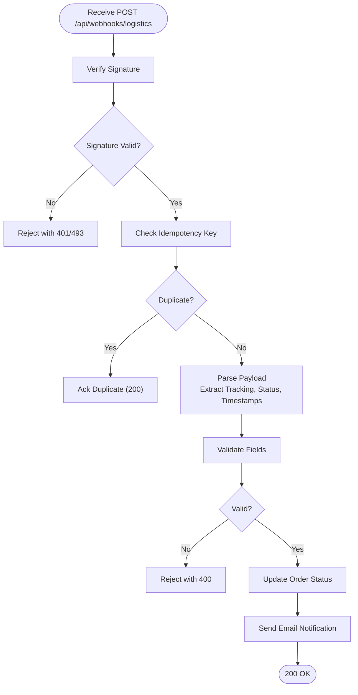
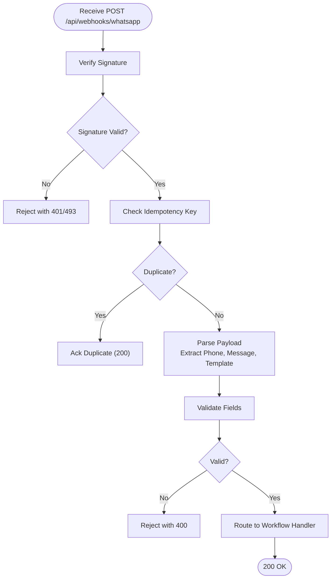
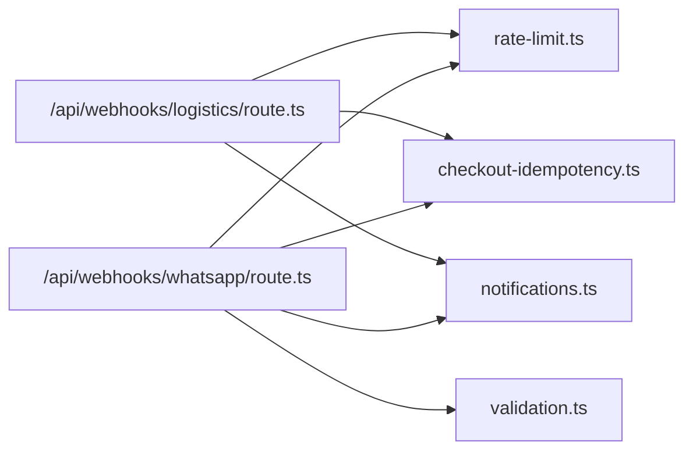

# Webhook API

<cite>
**Referenced Files in This Document**
- [README.md](file://README.md)
- [logistics route.ts](file://src/app/api/webhooks/logistics/route.ts)
- [whatsapp route.ts](file://src/app/api/webhooks/whatsapp/route.ts)
- [rate-limit.ts](file://src/lib/rate-limit.ts)
- [notifications.ts](file://src/lib/notifications.ts)
- [delivery.ts](file://src/lib/delivery.ts)
- [checkout-idempotency.ts](file://src/lib/checkout-idempotency.ts)
- [validation.ts](file://src/lib/validation.ts)
</cite>

## Table of Contents
1. [Introduction](#introduction)
2. [Project Structure](#project-structure)
3. [Core Components](#core-components)
4. [Architecture Overview](#architecture-overview)
5. [Detailed Component Analysis](#detailed-component-analysis)
6. [Dependency Analysis](#dependency-analysis)
7. [Performance Considerations](#performance-considerations)
8. [Troubleshooting Guide](#troubleshooting-guide)
9. [Conclusion](#conclusion)
10. [Appendices](#appendices)

## Introduction
This document provides comprehensive API documentation for AllShop’s webhook endpoints. It covers:
- POST /api/webhooks/logistics for delivery status updates from shipping carriers with tracking information, delivery confirmations, and exception handling.
- POST /api/webhooks/whatsapp for customer communication integration with order notifications, delivery updates, and customer support automation.

It also documents webhook payload schemas, signature verification methods, retry mechanisms, error handling strategies, response requirements, integration patterns with external services, and security considerations including webhook signatures, rate limiting, and data validation.

Important note: As implemented, the webhook endpoints currently return a disabled status. Guidance below describes how to integrate and secure these endpoints when enabled.

## Project Structure
The webhook endpoints are located under the Next.js App Router at:
- POST /api/webhooks/logistics → [logistics route.ts](file://src/app/api/webhooks/logistics/route.ts)
- POST /api/webhooks/whatsapp → [whatsapp route.ts](file://src/app/api/webhooks/whatsapp/route.ts)

Supporting infrastructure includes:
- Rate limiting utilities for throttling requests
- Email notification utilities for order status updates
- Delivery estimation utilities for shipping context
- Validation and idempotency utilities for robust order processing

**Diagram sources**
- [logistics route.ts:1-19](file://src/app/api/webhooks/logistics/route.ts#L1-L19)
- [whatsapp route.ts:1-19](file://src/app/api/webhooks/whatsapp/route.ts#L1-L19)
- [rate-limit.ts:43-88](file://src/lib/rate-limit.ts#L43-L88)
- [rate-limit.ts:101-164](file://src/lib/rate-limit.ts#L101-L164)
- [notifications.ts:89-319](file://src/lib/notifications.ts#L89-L319)
- [delivery.ts:443-487](file://src/lib/delivery.ts#L443-L487)
- [validation.ts:1-112](file://src/lib/validation.ts#L1-L112)
- [checkout-idempotency.ts:1-33](file://src/lib/checkout-idempotency.ts#L1-L33)

**Section sources**
- [logistics route.ts:1-19](file://src/app/api/webhooks/logistics/route.ts#L1-L19)
- [whatsapp route.ts:1-19](file://src/app/api/webhooks/whatsapp/route.ts#L1-L19)
- [rate-limit.ts:1-165](file://src/lib/rate-limit.ts#L1-L165)
- [notifications.ts:1-408](file://src/lib/notifications.ts#L1-L408)
- [delivery.ts:1-488](file://src/lib/delivery.ts#L1-L488)
- [validation.ts:1-112](file://src/lib/validation.ts#L1-L112)
- [checkout-idempotency.ts:1-33](file://src/lib/checkout-idempotency.ts#L1-L33)

## Core Components
- Webhook endpoints:
  - POST /api/webhooks/logistics: Currently returns a disabled status. When enabled, it should accept delivery events from carriers and update order statuses accordingly.
  - POST /api/webhooks/whatsapp: Currently returns a disabled status. When enabled, it should handle customer communication events and automate order notifications and support workflows.
- Supporting libraries:
  - Rate limiting: In-memory and DB-backed rate limiter to protect endpoints.
  - Notifications: Email notification engine for order status updates.
  - Delivery estimation: Utilities to compute delivery windows and carrier availability.
  - Validation and idempotency: Utilities to validate inputs and prevent duplicate processing.

Security and operational notes:
- Environment variables for SMTP and admin secrets are documented in the project README.
- Rate limiting is implemented to mitigate abuse.

**Section sources**
- [logistics route.ts:1-19](file://src/app/api/webhooks/logistics/route.ts#L1-L19)
- [whatsapp route.ts:1-19](file://src/app/api/webhooks/whatsapp/route.ts#L1-L19)
- [README.md:10-61](file://README.md#L10-L61)
- [rate-limit.ts:1-165](file://src/lib/rate-limit.ts#L1-L165)
- [notifications.ts:1-408](file://src/lib/notifications.ts#L1-L408)
- [delivery.ts:1-488](file://src/lib/delivery.ts#L1-L488)
- [validation.ts:1-112](file://src/lib/validation.ts#L1-L112)
- [checkout-idempotency.ts:1-33](file://src/lib/checkout-idempotency.ts#L1-L33)

## Architecture Overview
The webhook architecture integrates external systems with AllShop’s backend:
- Carriers push delivery events to POST /api/webhooks/logistics.
- WhatsApp provider pushes customer events to POST /api/webhooks/whatsapp.
- Both endpoints apply rate limiting, signature verification, and idempotency checks before processing.
- On successful processing, order status updates trigger email notifications.

**Diagram sources**
- [logistics route.ts:1-19](file://src/app/api/webhooks/logistics/route.ts#L1-L19)
- [rate-limit.ts:43-88](file://src/lib/rate-limit.ts#L43-L88)
- [rate-limit.ts:101-164](file://src/lib/rate-limit.ts#L101-L164)
- [checkout-idempotency.ts:14-21](file://src/lib/checkout-idempotency.ts#L14-L21)
- [notifications.ts:89-319](file://src/lib/notifications.ts#L89-L319)

## Detailed Component Analysis

### POST /api/webhooks/logistics
Purpose:
- Receive delivery status updates from shipping carriers.
- Accept tracking information, delivery confirmations, and exceptions.
- Update order status and notify customers via email.

Current behavior:
- Returns a disabled status with a descriptive message.

Planned implementation outline:
- Signature verification: Use a shared secret to verify the authenticity of incoming requests.
- Idempotency: Use a deduplication key derived from the event payload to avoid duplicate processing.
- Payload parsing: Extract tracking number, status, location, and timestamps.
- Order update: Persist status change and associated metadata.
- Notification: Trigger email notification via the existing notification utility.

Response requirements:
- 200 OK on successful processing.
- 4xx/5xx on validation/signature/idempotency failures or processing errors.

Retry mechanism:
- External systems should retry on transient failures with exponential backoff.
- Backend should reject duplicates using idempotency keys.

Security considerations:
- Enforce HTTPS and require signatures.
- Apply rate limiting per carrier account or IP.
- Validate payload structure and sanitize inputs.

Common use cases:
- Tracking updates during transit.
- Delivery confirmations.
- Exception handling (delay, lost package, return to sender).

**Diagram sources**
- [logistics route.ts:1-19](file://src/app/api/webhooks/logistics/route.ts#L1-L19)
- [checkout-idempotency.ts:14-21](file://src/lib/checkout-idempotency.ts#L14-L21)
- [notifications.ts:89-319](file://src/lib/notifications.ts#L89-L319)

**Section sources**
- [logistics route.ts:1-19](file://src/app/api/webhooks/logistics/route.ts#L1-L19)
- [checkout-idempotency.ts:1-33](file://src/lib/checkout-idempotency.ts#L1-L33)
- [notifications.ts:1-408](file://src/lib/notifications.ts#L1-L408)

### POST /api/webhooks/whatsapp
Purpose:
- Integrate with WhatsApp provider to automate customer notifications and support workflows.
- Handle order notifications, delivery updates, and customer support automation.

Current behavior:
- Returns a disabled status with a descriptive message.

Planned implementation outline:
- Signature verification: Use a shared secret to verify the authenticity of incoming requests.
- Idempotency: Use a deduplication key derived from the event payload to avoid duplicate processing.
- Payload parsing: Extract customer phone, message content, template identifiers, and metadata.
- Workflows: Route messages to appropriate handlers (order status, support ticket, opt-in/out).
- Responses: Acknowledge receipt and optionally send templated replies.

Response requirements:
- 200 OK on successful processing.
- 4xx/5xx on validation/signature/idempotency failures or processing errors.

Retry mechanism:
- External systems should retry on transient failures with exponential backoff.
- Backend should reject duplicates using idempotency keys.

Security considerations:
- Enforce HTTPS and require signatures.
- Apply rate limiting per provider account or IP.
- Validate payload structure and sanitize inputs.

Common use cases:
- Automated order confirmation and delivery updates.
- Customer support automation (FAQ, cancellation, refund).
- Opt-in/opt-out preferences and consent management.

**Diagram sources**
- [whatsapp route.ts:1-19](file://src/app/api/webhooks/whatsapp/route.ts#L1-L19)
- [checkout-idempotency.ts:14-21](file://src/lib/checkout-idempotency.ts#L14-L21)

**Section sources**
- [whatsapp route.ts:1-19](file://src/app/api/webhooks/whatsapp/route.ts#L1-L19)
- [checkout-idempotency.ts:1-33](file://src/lib/checkout-idempotency.ts#L1-L33)

### Payload Schemas

Note: The following schemas describe the intended structure for enabled endpoints. They are illustrative and should be aligned with your carrier and WhatsApp provider requirements.

- Logistics webhook payload (example structure)
  - tracking_number: string
  - status: enum("created","in_transit","out_for_delivery","delivered","exception","returned")
  - carrier: string
  - estimated_delivery?: date-time
  - delivered_at?: date-time
  - location?: string
  - exceptions?: array[string]
  - order_id: string
  - metadata?: object

- WhatsApp webhook payload (example structure)
  - phone: string
  - message: string
  - template?: string
  - context?: object
  - timestamp: date-time
  - provider_event_id: string

- Shared fields for both endpoints
  - idempotency_key: string (derived from payload hash or unique event identifier)
  - signature: string (HMAC-SHA256 hex digest)
  - provider_account_id: string (optional, for rate limiting and attribution)

**Section sources**
- [checkout-idempotency.ts:14-21](file://src/lib/checkout-idempotency.ts#L14-L21)

### Signature Verification Methods
- Use HMAC-SHA256 with a shared secret configured in environment variables.
- Compute signature over a canonicalized payload string and compare with the received header.
- Reject requests with mismatched or missing signatures.

Security recommendations:
- Rotate secrets periodically.
- Log signature verification attempts for monitoring.
- Enforce TLS termination at the edge and reject HTTP.

**Section sources**
- [README.md:24-28](file://README.md#L24-L28)

### Retry Mechanisms and Error Handling
- External systems should implement exponential backoff and jitter.
- Backend should acknowledge receipt immediately and return 200 for idempotent duplicates.
- Non-idempotent failures should return 5xx to signal retry.

Error categories:
- Unauthorized: invalid signature or missing auth.
- Bad Request: malformed payload or validation failure.
- Conflict: duplicate idempotency key.
- Internal Server Error: unexpected processing errors.

**Section sources**
- [logistics route.ts:1-19](file://src/app/api/webhooks/logistics/route.ts#L1-L19)
- [whatsapp route.ts:1-19](file://src/app/api/webhooks/whatsapp/route.ts#L1-L19)

### Response Requirements
- 200 OK: Event processed successfully.
- 400 Bad Request: Validation or schema error.
- 401/493 Unauthorized: Signature verification failed.
- 409 Conflict: Duplicate idempotency key.
- 500/5xx: Internal error; external system should retry.

**Section sources**
- [logistics route.ts:1-19](file://src/app/api/webhooks/logistics/route.ts#L1-L19)
- [whatsapp route.ts:1-19](file://src/app/api/webhooks/whatsapp/route.ts#L1-L19)

### Integration Patterns with External Services
- Carriers: Push structured events to logistics endpoint; include tracking_number, status, timestamps, and order_id.
- WhatsApp: Push inbound messages to whatsapp endpoint; include phone, message, and optional template/context.
- Notifications: After order updates, trigger email notifications with status-specific content.

**Section sources**
- [notifications.ts:89-319](file://src/lib/notifications.ts#L89-L319)

### Security Considerations
- Webhook signatures: HMAC-SHA256 with a shared secret.
- Rate limiting: Per-account or per-IP limits using in-memory and DB-backed mechanisms.
- Data validation: Strict field validation and sanitization.
- Idempotency: Prevent duplicate processing using idempotency keys.
- Environment variables: SMTP credentials, admin secrets, and lookup tokens.

**Section sources**
- [README.md:10-61](file://README.md#L10-L61)
- [rate-limit.ts:1-165](file://src/lib/rate-limit.ts#L1-L165)
- [validation.ts:1-112](file://src/lib/validation.ts#L1-L112)
- [checkout-idempotency.ts:1-33](file://src/lib/checkout-idempotency.ts#L1-L33)

## Dependency Analysis
The webhook endpoints depend on:
- Rate limiting for protection against abuse.
- Signature verification for authenticity.
- Idempotency utilities to prevent duplicate processing.
- Notifications for customer communication.
- Validation utilities for input sanitization.

**Diagram sources**
- [logistics route.ts:1-19](file://src/app/api/webhooks/logistics/route.ts#L1-L19)
- [whatsapp route.ts:1-19](file://src/app/api/webhooks/whatsapp/route.ts#L1-L19)
- [rate-limit.ts:1-165](file://src/lib/rate-limit.ts#L1-L165)
- [checkout-idempotency.ts:1-33](file://src/lib/checkout-idempotency.ts#L1-L33)
- [validation.ts:1-112](file://src/lib/validation.ts#L1-L112)
- [notifications.ts:1-408](file://src/lib/notifications.ts#L1-L408)

**Section sources**
- [logistics route.ts:1-19](file://src/app/api/webhooks/logistics/route.ts#L1-L19)
- [whatsapp route.ts:1-19](file://src/app/api/webhooks/whatsapp/route.ts#L1-L19)
- [rate-limit.ts:1-165](file://src/lib/rate-limit.ts#L1-L165)
- [checkout-idempotency.ts:1-33](file://src/lib/checkout-idempotency.ts#L1-L33)
- [validation.ts:1-112](file://src/lib/validation.ts#L1-L112)
- [notifications.ts:1-408](file://src/lib/notifications.ts#L1-L408)

## Performance Considerations
- Use DB-backed rate limiting for critical paths to maintain consistency across instances.
- Keep payload sizes minimal; avoid large attachments.
- Batch notifications where possible to reduce email throughput spikes.
- Monitor retry loops and alert on excessive failures.

[No sources needed since this section provides general guidance]

## Troubleshooting Guide
Common issues and resolutions:
- Disabled endpoints: The current routes return disabled status. Enable endpoints by implementing POST handlers and returning 200 OK on success.
- Signature verification failures: Ensure shared secrets match and payload canonicalization is consistent.
- Duplicate processing: Confirm idempotency keys are generated from stable payload hashes.
- Email delivery failures: Verify SMTP credentials and network connectivity.
- Rate limit exceeded: Reduce request frequency or increase limits per account/IP.

**Section sources**
- [logistics route.ts:1-19](file://src/app/api/webhooks/logistics/route.ts#L1-L19)
- [whatsapp route.ts:1-19](file://src/app/api/webhooks/whatsapp/route.ts#L1-L19)
- [rate-limit.ts:1-165](file://src/lib/rate-limit.ts#L1-L165)
- [notifications.ts:383-406](file://src/lib/notifications.ts#L383-L406)

## Conclusion
AllShop’s webhook endpoints are currently disabled. When enabled, they should implement robust signature verification, rate limiting, idempotency, and notification workflows. The supporting libraries provide strong foundations for secure, scalable integrations with carriers and WhatsApp providers.

[No sources needed since this section summarizes without analyzing specific files]

## Appendices

### Appendix A: Endpoint Reference
- POST /api/webhooks/logistics
  - Purpose: Receive delivery events from carriers.
  - Current behavior: Returns disabled status.
  - Expected response: 200 OK on success.

- POST /api/webhooks/whatsapp
  - Purpose: Receive customer communication events.
  - Current behavior: Returns disabled status.
  - Expected response: 200 OK on success.

**Section sources**
- [logistics route.ts:1-19](file://src/app/api/webhooks/logistics/route.ts#L1-L19)
- [whatsapp route.ts:1-19](file://src/app/api/webhooks/whatsapp/route.ts#L1-L19)

### Appendix B: Environment Variables
- SMTP_USER, SMTP_PASSWORD, EMAIL_FROM: Configure email notifications.
- ORDER_LOOKUP_SECRET, CSRF_SECRET: Security-related secrets.
- ADMIN_BLOCK_SECRET: Protects admin endpoints.

**Section sources**
- [README.md:10-61](file://README.md#L10-L61)