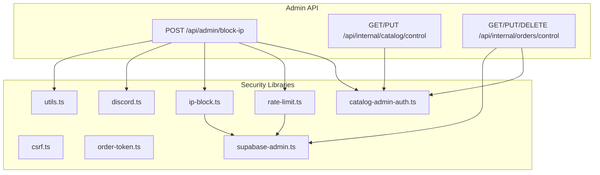
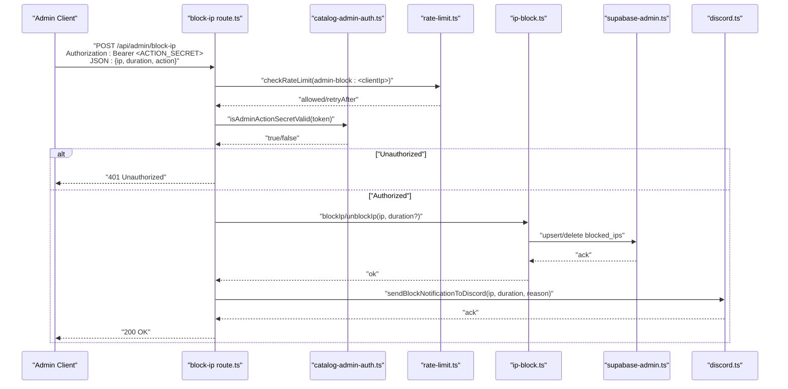
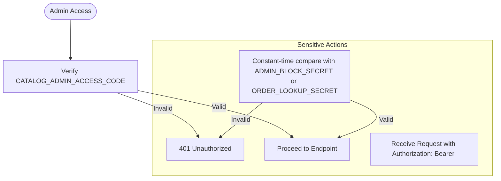
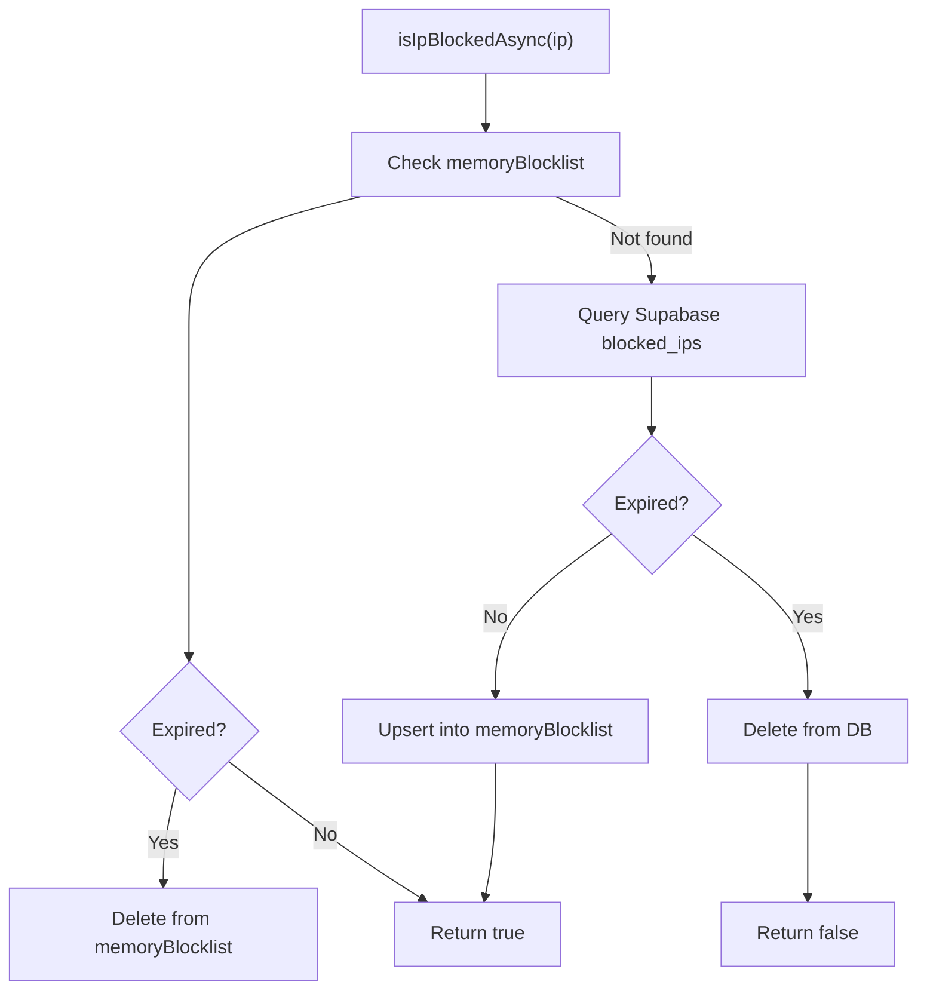
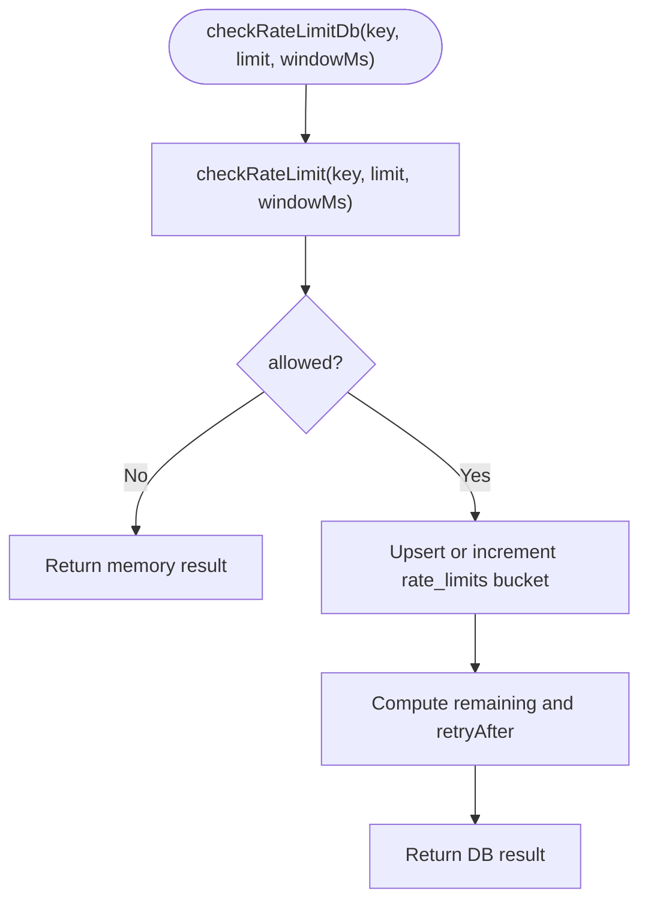
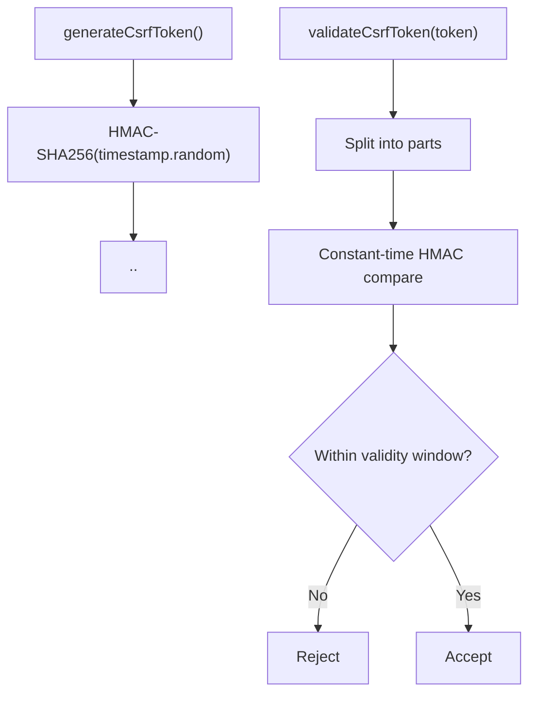
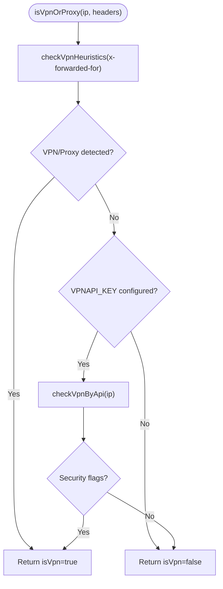
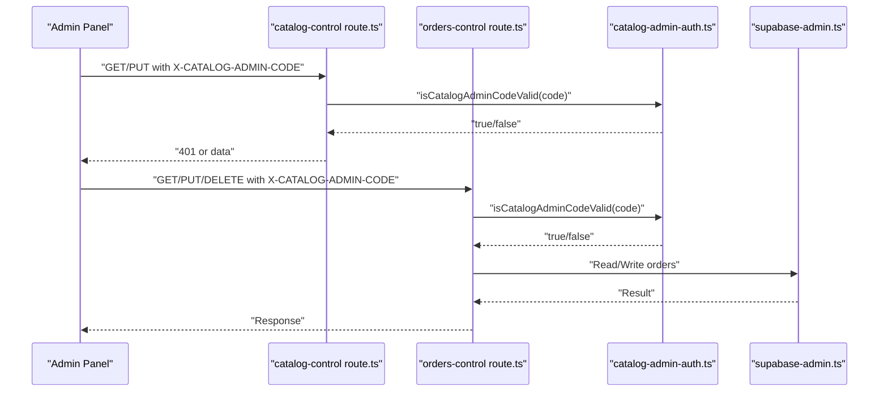
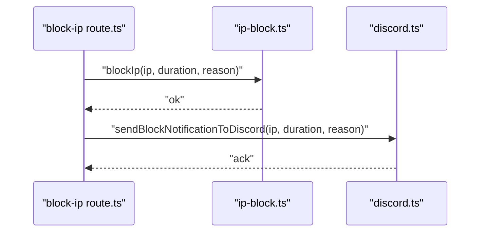
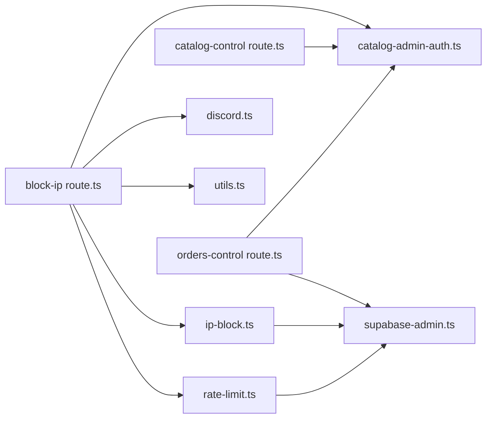

# Admin Authentication & Security

<cite>
**Referenced Files in This Document**
- [catalog-admin-auth.ts](file://src/lib/catalog-admin-auth.ts)
- [ip-block.ts](file://src/lib/ip-block.ts)
- [rate-limit.ts](file://src/lib/rate-limit.ts)
- [supabase-admin.ts](file://src/lib/supabase-admin.ts)
- [block-ip route.ts](file://src/app/api/admin/block-ip/route.ts)
- [csrf.ts](file://src/lib/csrf.ts)
- [vpn-detect.ts](file://src/lib/vpn-detect.ts)
- [discord.ts](file://src/lib/discord.ts)
- [utils.ts](file://src/lib/utils.ts)
- [catalog-control route.ts](file://src/app/api/internal/catalog/control/route.ts)
- [orders-control route.ts](file://src/app/api/internal/orders/control/route.ts)
- [order-token.ts](file://src/lib/order-token.ts)
- [blocked page.tsx](file://src/app/bloqueado/page.tsx)
</cite>

## Table of Contents
1. [Introduction](#introduction)
2. [Project Structure](#project-structure)
3. [Core Components](#core-components)
4. [Architecture Overview](#architecture-overview)
5. [Detailed Component Analysis](#detailed-component-analysis)
6. [Dependency Analysis](#dependency-analysis)
7. [Performance Considerations](#performance-considerations)
8. [Troubleshooting Guide](#troubleshooting-guide)
9. [Conclusion](#conclusion)
10. [Appendices](#appendices)

## Introduction
This document explains the admin authentication and security systems implemented in the project. It covers token-based authentication for admin endpoints, IP blocking with Supabase persistence, rate limiting for brute-force protection, CSRF safeguards, VPN/proxy detection, and administrative panels for catalog and orders. It also documents configuration requirements, operational flows, and best practices for secure administration.

## Project Structure
Security-related functionality is organized around dedicated libraries and API routes:
- Authentication and secrets: catalog-admin-auth, order-token, csrf
- IP blocking and monitoring: ip-block, discord notifications
- Rate limiting: rate-limit
- Supabase clients: supabase-admin (admin-only), supabase (public)
- Admin endpoints: block-ip, catalog control, orders control
- Utilities: utils (IP extraction, validation)
- UI for blocked state: blocked page

**Diagram sources**
- [block-ip route.ts:1-140](file://src/app/api/admin/block-ip/route.ts#L1-L140)
- [catalog-control route.ts:1-191](file://src/app/api/internal/catalog/control/route.ts#L1-L191)
- [orders-control route.ts:1-664](file://src/app/api/internal/orders/control/route.ts#L1-L664)
- [catalog-admin-auth.ts:1-65](file://src/lib/catalog-admin-auth.ts#L1-L65)
- [rate-limit.ts:1-165](file://src/lib/rate-limit.ts#L1-L165)
- [ip-block.ts:1-210](file://src/lib/ip-block.ts#L1-L210)
- [supabase-admin.ts:1-31](file://src/lib/supabase-admin.ts#L1-L31)
- [discord.ts:1-379](file://src/lib/discord.ts#L1-L379)
- [utils.ts:1-102](file://src/lib/utils.ts#L1-L102)

**Section sources**
- [block-ip route.ts:1-140](file://src/app/api/admin/block-ip/route.ts#L1-L140)
- [catalog-admin-auth.ts:1-65](file://src/lib/catalog-admin-auth.ts#L1-L65)
- [rate-limit.ts:1-165](file://src/lib/rate-limit.ts#L1-L165)
- [ip-block.ts:1-210](file://src/lib/ip-block.ts#L1-L210)
- [supabase-admin.ts:1-31](file://src/lib/supabase-admin.ts#L1-L31)
- [discord.ts:1-379](file://src/lib/discord.ts#L1-L379)
- [utils.ts:1-102](file://src/lib/utils.ts#L1-L102)

## Core Components
- Admin authentication tokens and secrets:
  - Admin access code for internal admin panels
  - Action secret for sensitive endpoints (block-ip, order cancel)
  - Order lookup token with HMAC signature and TTL
- IP blocking system:
  - In-memory cache synchronized with Supabase
  - Support for permanent and time-bound blocks
- Rate limiting:
  - In-memory buckets with periodic cleanup
  - Optional DB-backed enforcement via Supabase for critical paths
- CSRF protection:
  - Token generation/validation with HMAC and time bounds
  - Same-origin checks for POST requests
- VPN/proxy detection:
  - Heuristic checks and optional API verification
- Administrative panels:
  - Catalog control (list/update products)
  - Orders control (list/update/delete orders)
- Notifications:
  - Discord webhooks for moderation actions and order updates

**Section sources**
- [catalog-admin-auth.ts:1-65](file://src/lib/catalog-admin-auth.ts#L1-L65)
- [order-token.ts:1-65](file://src/lib/order-token.ts#L1-L65)
- [ip-block.ts:1-210](file://src/lib/ip-block.ts#L1-L210)
- [rate-limit.ts:1-165](file://src/lib/rate-limit.ts#L1-L165)
- [csrf.ts:1-119](file://src/lib/csrf.ts#L1-L119)
- [vpn-detect.ts:1-101](file://src/lib/vpn-detect.ts#L1-L101)
- [catalog-control route.ts:1-191](file://src/app/api/internal/catalog/control/route.ts#L1-L191)
- [orders-control route.ts:1-664](file://src/app/api/internal/orders/control/route.ts#L1-L664)
- [discord.ts:1-379](file://src/lib/discord.ts#L1-L379)

## Architecture Overview
The admin security architecture combines local validation, environment secrets, and Supabase for persistence and cross-instance synchronization.

**Diagram sources**
- [block-ip route.ts:1-140](file://src/app/api/admin/block-ip/route.ts#L1-L140)
- [catalog-admin-auth.ts:1-65](file://src/lib/catalog-admin-auth.ts#L1-L65)
- [rate-limit.ts:1-165](file://src/lib/rate-limit.ts#L1-L165)
- [ip-block.ts:1-210](file://src/lib/ip-block.ts#L1-L210)
- [supabase-admin.ts:1-31](file://src/lib/supabase-admin.ts#L1-L31)
- [discord.ts:1-379](file://src/lib/discord.ts#L1-L379)

## Detailed Component Analysis

### Token-Based Authentication and Secrets
- Admin access code for internal admin panels:
  - Verified via environment variable and constant-time comparison
  - Enforced on catalog and orders control endpoints
- Admin action secret:
  - Used for sensitive endpoints (block-ip, order cancel)
  - Falls back to order lookup secret if not explicitly set
  - Verified via constant-time comparison
- Order lookup token:
  - HMAC-SHA256 signature over orderId and expiration
  - Configurable TTL within bounds
  - Verification validates signature and expiration

**Diagram sources**
- [catalog-admin-auth.ts:1-65](file://src/lib/catalog-admin-auth.ts#L1-L65)
- [catalog-control route.ts:59-79](file://src/app/api/internal/catalog/control/route.ts#L59-L79)
- [orders-control route.ts:59-79](file://src/app/api/internal/orders/control/route.ts#L59-L79)

**Section sources**
- [catalog-admin-auth.ts:1-65](file://src/lib/catalog-admin-auth.ts#L1-L65)
- [catalog-control route.ts:1-191](file://src/app/api/internal/catalog/control/route.ts#L1-L191)
- [orders-control route.ts:1-664](file://src/app/api/internal/orders/control/route.ts#L1-L664)
- [order-token.ts:1-65](file://src/lib/order-token.ts#L1-L65)

### IP Blocking System
- In-memory cache per instance with lazy sync to Supabase
- Always consults Supabase for authoritative state in serverless environments
- Supports permanent and time-bound blocks with expiration cleanup
- Provides synchronous and asynchronous lookup APIs
- On block/unblock, persists to Supabase and notifies via Discord

**Diagram sources**
- [ip-block.ts:25-72](file://src/lib/ip-block.ts#L25-L72)
- [ip-block.ts:178-210](file://src/lib/ip-block.ts#L178-L210)

**Section sources**
- [ip-block.ts:1-210](file://src/lib/ip-block.ts#L1-L210)
- [block-ip route.ts:1-140](file://src/app/api/admin/block-ip/route.ts#L1-L140)
- [discord.ts:230-262](file://src/lib/discord.ts#L230-L262)

### Rate Limiting
- In-memory buckets with periodic cleanup to manage memory footprint
- Best-effort enforcement per instance in serverless
- Optional DB-backed enforcement via Supabase for critical paths
- Admin endpoints use per-IP rate limits to mitigate abuse

**Diagram sources**
- [rate-limit.ts:101-165](file://src/lib/rate-limit.ts#L101-L165)

**Section sources**
- [rate-limit.ts:1-165](file://src/lib/rate-limit.ts#L1-L165)
- [block-ip route.ts:51-64](file://src/app/api/admin/block-ip/route.ts#L51-L64)

### CSRF Protection
- Generates time-bound tokens signed with HMAC-SHA256
- Validates tokens with time window and constant-time signature comparison
- Enforces same-origin checks using Origin or Referer headers
- Falls back to a development secret in non-production environments

**Diagram sources**
- [csrf.ts:40-84](file://src/lib/csrf.ts#L40-L84)

**Section sources**
- [csrf.ts:1-119](file://src/lib/csrf.ts#L1-L119)

### VPN and Proxy Detection
- Heuristic checks on request headers for long forwarded chains
- Optional API-based detection using a third-party service with timeout
- Designed to fail open (allow if API unavailable) and labeled limitations

**Diagram sources**
- [vpn-detect.ts:89-101](file://src/lib/vpn-detect.ts#L89-L101)

**Section sources**
- [vpn-detect.ts:1-101](file://src/lib/vpn-detect.ts#L1-L101)

### Administrative Panels and Access Control
- Catalog control:
  - Requires admin access code via custom header
  - Lists and updates product prices, stock, and variants
- Orders control:
  - Requires admin access code
  - Lists orders with filtering and pagination
  - Updates status, tracking, dispatch references, notes, and optionally emails customers
  - Supports deletion of orders

**Diagram sources**
- [catalog-control route.ts:59-79](file://src/app/api/internal/catalog/control/route.ts#L59-L79)
- [orders-control route.ts:59-79](file://src/app/api/internal/orders/control/route.ts#L59-L79)
- [catalog-admin-auth.ts:1-65](file://src/lib/catalog-admin-auth.ts#L1-L65)
- [supabase-admin.ts:1-31](file://src/lib/supabase-admin.ts#L1-L31)

**Section sources**
- [catalog-control route.ts:1-191](file://src/app/api/internal/catalog/control/route.ts#L1-L191)
- [orders-control route.ts:1-664](file://src/app/api/internal/orders/control/route.ts#L1-L664)
- [catalog-admin-auth.ts:1-65](file://src/lib/catalog-admin-auth.ts#L1-L65)
- [supabase-admin.ts:1-31](file://src/lib/supabase-admin.ts#L1-L31)

### Session Management, ACLs, and RBAC
- Session model:
  - No persistent sessions for admin endpoints
  - Authentication relies on static secrets and tokens passed via headers
- Access control:
  - Admin panels require a shared admin access code
  - Sensitive endpoints require an action secret
  - Order lookup uses time-bound HMAC tokens
- Role-based permissions:
  - No explicit roles or dynamic ACLs in the analyzed code
  - Access is controlled by presence and validity of configured secrets/tokens

**Section sources**
- [catalog-admin-auth.ts:1-65](file://src/lib/catalog-admin-auth.ts#L1-L65)
- [order-token.ts:1-65](file://src/lib/order-token.ts#L1-L65)
- [catalog-control route.ts:59-79](file://src/app/api/internal/catalog/control/route.ts#L59-L79)
- [orders-control route.ts:59-79](file://src/app/api/internal/orders/control/route.ts#L59-L79)

### Security Monitoring and Audit Trails
- Discord notifications:
  - Moderation commands for IP blocking/unblocking are embedded in order notifications
  - IP block events are sent to Discord with IP, duration, and reason
  - Order cancellation outcomes are reported
- Audit-like records:
  - Orders control maintains a mutable notes field with a history array capturing admin actions
- Additional logging:
  - IP block and rate limit failures are logged to the console

**Diagram sources**
- [block-ip route.ts:114-120](file://src/app/api/admin/block-ip/route.ts#L114-L120)
- [ip-block.ts:103-132](file://src/lib/ip-block.ts#L103-L132)
- [discord.ts:230-262](file://src/lib/discord.ts#L230-L262)

**Section sources**
- [discord.ts:1-379](file://src/lib/discord.ts#L1-L379)
- [orders-control route.ts:470-538](file://src/app/api/internal/orders/control/route.ts#L470-L538)
- [ip-block.ts:1-210](file://src/lib/ip-block.ts#L1-L210)

## Dependency Analysis
- Internal dependencies:
  - Admin routes depend on catalog-admin-auth for secret validation
  - IP blocking depends on supabase-admin for persistence
  - Rate limiting optionally depends on supabase-admin for critical paths
  - Discord notifications are used by admin endpoints for audit visibility
- External dependencies:
  - Supabase client for admin operations
  - Node.js crypto for HMAC and timing-safe comparisons
  - Fetch for optional VPN API checks

**Diagram sources**
- [block-ip route.ts:1-140](file://src/app/api/admin/block-ip/route.ts#L1-L140)
- [catalog-control route.ts:1-191](file://src/app/api/internal/catalog/control/route.ts#L1-L191)
- [orders-control route.ts:1-664](file://src/app/api/internal/orders/control/route.ts#L1-L664)
- [catalog-admin-auth.ts:1-65](file://src/lib/catalog-admin-auth.ts#L1-L65)
- [rate-limit.ts:1-165](file://src/lib/rate-limit.ts#L1-L165)
- [ip-block.ts:1-210](file://src/lib/ip-block.ts#L1-L210)
- [supabase-admin.ts:1-31](file://src/lib/supabase-admin.ts#L1-L31)
- [discord.ts:1-379](file://src/lib/discord.ts#L1-L379)
- [utils.ts:1-102](file://src/lib/utils.ts#L1-L102)

**Section sources**
- [block-ip route.ts:1-140](file://src/app/api/admin/block-ip/route.ts#L1-L140)
- [catalog-control route.ts:1-191](file://src/app/api/internal/catalog/control/route.ts#L1-L191)
- [orders-control route.ts:1-664](file://src/app/api/internal/orders/control/route.ts#L1-L664)
- [ip-block.ts:1-210](file://src/lib/ip-block.ts#L1-L210)
- [rate-limit.ts:1-165](file://src/lib/rate-limit.ts#L1-L165)
- [supabase-admin.ts:1-31](file://src/lib/supabase-admin.ts#L1-L31)
- [discord.ts:1-379](file://src/lib/discord.ts#L1-L379)
- [utils.ts:1-102](file://src/lib/utils.ts#L1-L102)

## Performance Considerations
- Serverless constraints:
  - In-memory caches and rate buckets are per-instance; cross-instance coordination is achieved via Supabase for authoritative checks
- Cleanup strategies:
  - Periodic cleanup of expired rate-limit buckets reduces memory overhead
- Network dependencies:
  - Optional VPN API checks use timeouts to avoid blocking requests
- Recommendations:
  - Prefer DB-backed rate limiting for critical paths
  - Monitor Supabase availability and tune rate-limit windows for expected traffic

[No sources needed since this section provides general guidance]

## Troubleshooting Guide
- Admin endpoints return unauthorized:
  - Ensure the appropriate secret is configured and matches the expected value
  - Verify the Authorization header format and token validity
  - Confirm the admin access code header is present for internal panels
  - Reference: [block-ip route.ts:24-41](file://src/app/api/admin/block-ip/route.ts#L24-L41), [catalog-control route.ts:59-79](file://src/app/api/internal/catalog/control/route.ts#L59-L79)
- IP blocking not taking effect:
  - Confirm Supabase admin client is configured and the blocked_ips table exists
  - Check for console errors during DB upsert/delete
  - Verify the IP format is valid
  - Reference: [ip-block.ts:37-72](file://src/lib/ip-block.ts#L37-L72), [utils.ts:72-89](file://src/lib/utils.ts#L72-L89)
- Rate limit exceeded:
  - Reduce client-side retry frequency or increase window/limit
  - For critical paths, ensure Supabase is configured to enable DB-backed rate limiting
  - Reference: [rate-limit.ts:101-165](file://src/lib/rate-limit.ts#L101-L165)
- VPN detection false positives/negatives:
  - Configure VPNAPI_KEY for API checks
  - Understand that heuristics can be bypassed and the system fails open
  - Reference: [vpn-detect.ts:89-101](file://src/lib/vpn-detect.ts#L89-L101)
- Blocked page shown unexpectedly:
  - Indicates the client IP is currently blocked
  - Check the blocked_ips table and remove the entry if appropriate
  - Reference: [blocked page.tsx:1-42](file://src/app/bloqueado/page.tsx#L1-L42), [ip-block.ts:78-89](file://src/lib/ip-block.ts#L78-L89)

**Section sources**
- [block-ip route.ts:24-41](file://src/app/api/admin/block-ip/route.ts#L24-L41)
- [catalog-control route.ts:59-79](file://src/app/api/internal/catalog/control/route.ts#L59-L79)
- [ip-block.ts:37-72](file://src/lib/ip-block.ts#L37-L72)
- [utils.ts:72-89](file://src/lib/utils.ts#L72-L89)
- [rate-limit.ts:101-165](file://src/lib/rate-limit.ts#L101-L165)
- [vpn-detect.ts:89-101](file://src/lib/vpn-detect.ts#L89-L101)
- [blocked page.tsx:1-42](file://src/app/bloqueado/page.tsx#L1-L42)

## Conclusion
The admin authentication and security system centers on environment-driven secrets and tokens, with Supabase providing persistence and cross-instance consistency. IP blocking, rate limiting, and CSRF protections form a layered defense, while Discord notifications support operational oversight. Administrators should configure secrets carefully, monitor rate-limit and block events, and leverage Supabase-backed mechanisms for critical controls.

[No sources needed since this section summarizes without analyzing specific files]

## Appendices

### Practical Configuration Examples
- Admin access code:
  - Set CATALOG_ADMIN_ACCESS_CODE to a strong secret
  - Reference: [catalog-admin-auth.ts:15-21](file://src/lib/catalog-admin-auth.ts#L15-L21)
- Admin action secret:
  - Set ADMIN_BLOCK_SECRET (or fallback ORDER_LOOKUP_SECRET)
  - Reference: [catalog-admin-auth.ts:27-31](file://src/lib/catalog-admin-auth.ts#L27-L31)
- Order lookup token secret and TTL:
  - Set ORDER_LOOKUP_SECRET and optionally ORDER_LOOKUP_TOKEN_TTL_MINUTES
  - Reference: [order-token.ts:19-17](file://src/lib/order-token.ts#L19-L17)
- Supabase admin client:
  - Set NEXT_PUBLIC_SUPABASE_URL and SUPABASE_SERVICE_ROLE_KEY
  - Reference: [supabase-admin.ts:15-23](file://src/lib/supabase-admin.ts#L15-L23)
- Discord webhook:
  - Set DISCORD_WEBHOOK_URL for moderation notifications
  - Reference: [discord.ts:6-12](file://src/lib/discord.ts#L6-L12)
- VPN detection:
  - Set VPNAPI_KEY for optional API checks
  - Reference: [vpn-detect.ts:94-97](file://src/lib/vpn-detect.ts#L94-L97)

### Incident Response Procedures
- Immediate:
  - Block offending IPs using the admin endpoint with Authorization header and JSON payload
  - Unset or rotate secrets if compromise is suspected
- Investigation:
  - Review Discord moderation logs for IP block actions
  - Inspect Supabase blocked_ips and rate_limits tables
- Recovery:
  - Remove stale entries from blocked_ips
  - Re-enable access after remediation

**Section sources**
- [block-ip route.ts:51-129](file://src/app/api/admin/block-ip/route.ts#L51-L129)
- [discord.ts:230-262](file://src/lib/discord.ts#L230-L262)
- [ip-block.ts:139-171](file://src/lib/ip-block.ts#L139-L171)
- [rate-limit.ts:101-165](file://src/lib/rate-limit.ts#L101-L165)