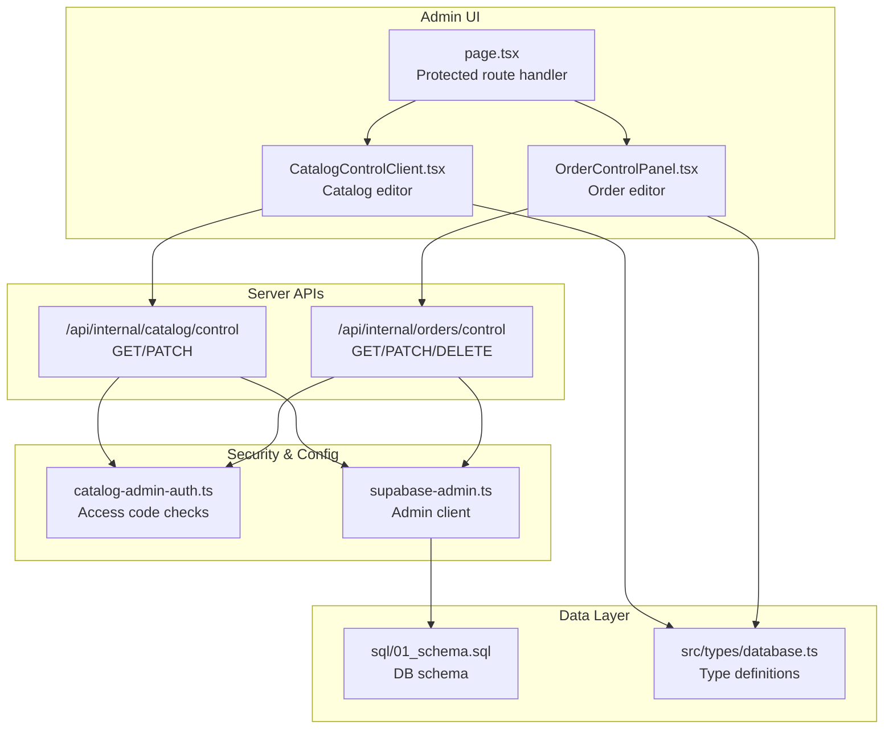
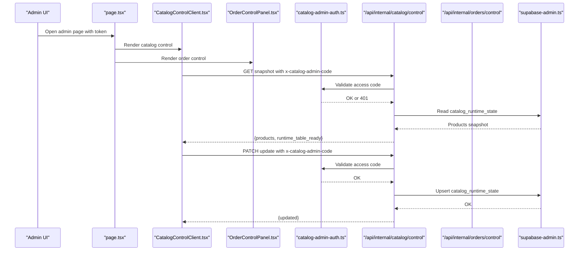
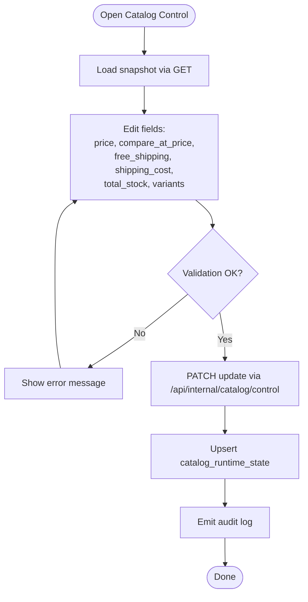
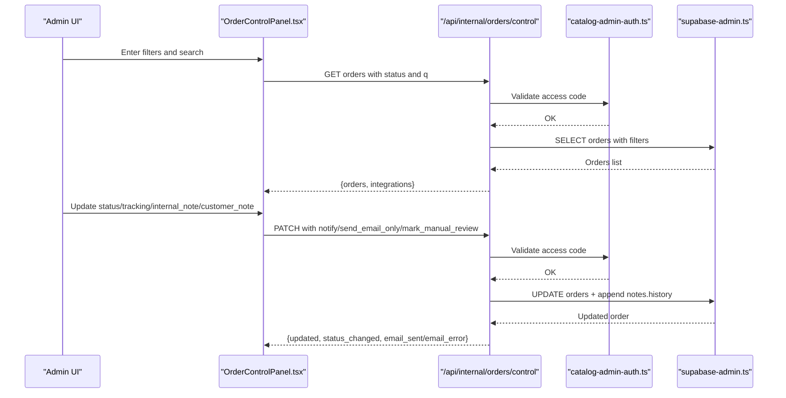
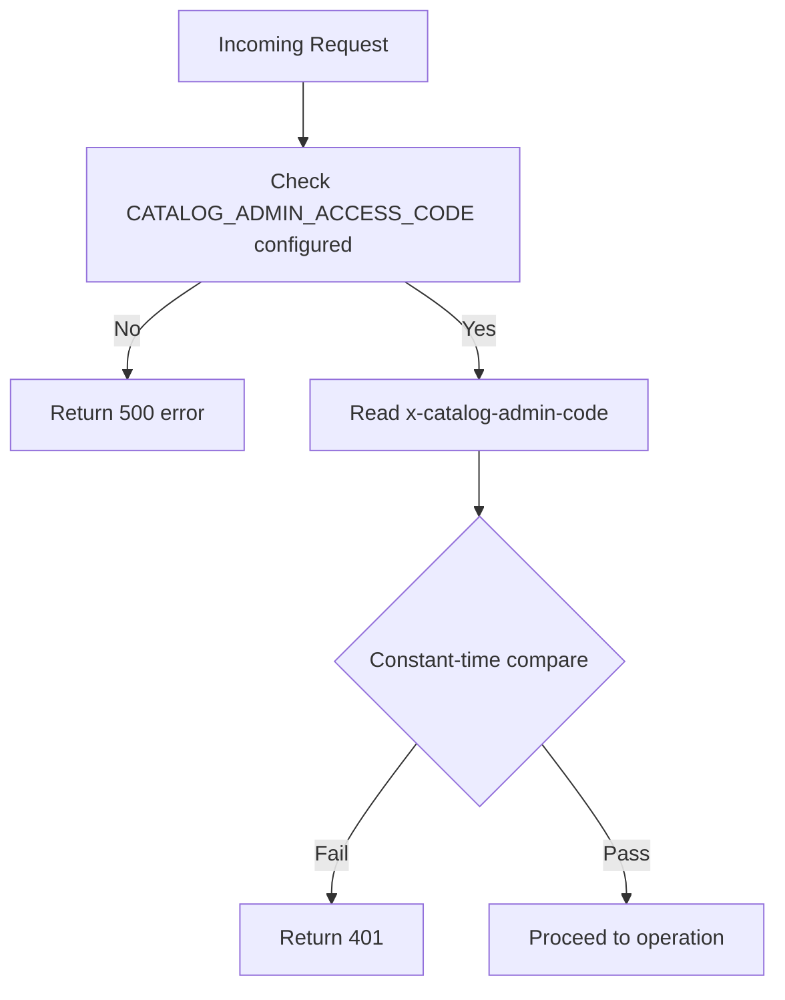
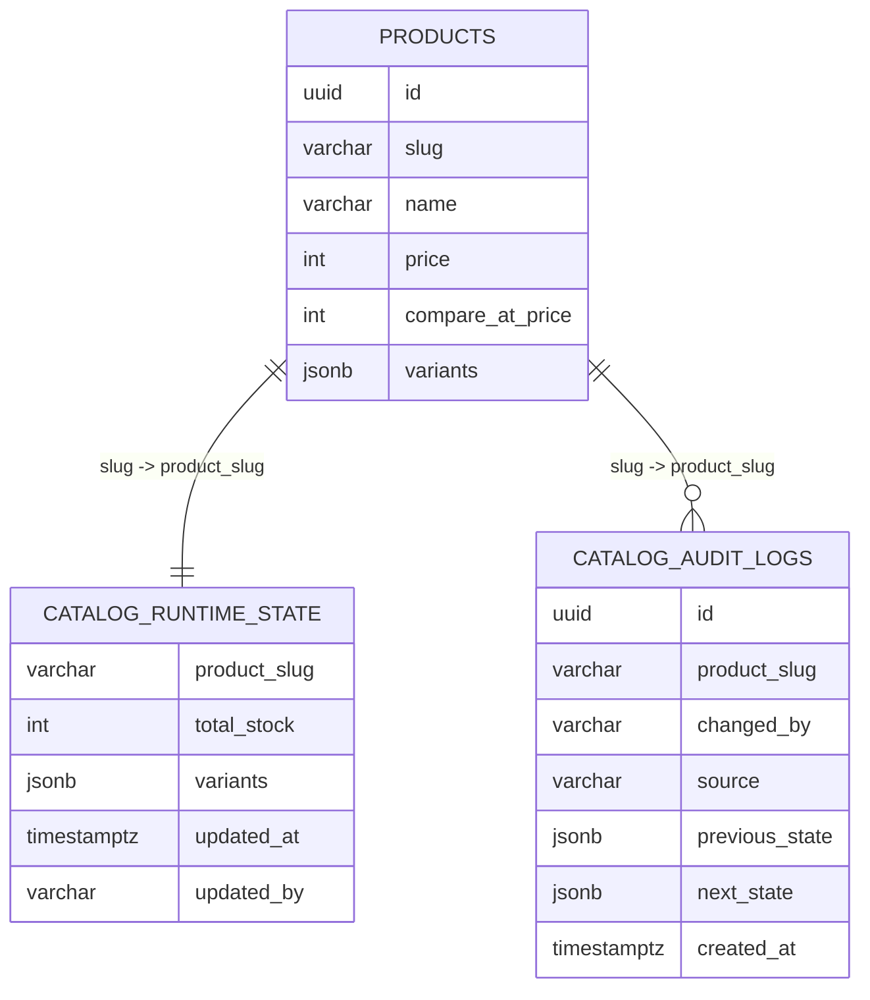
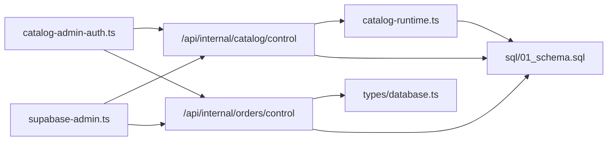

# Admin Panel

<cite>
**Referenced Files in This Document**
- [src/app/panel-privado/[token]/page.tsx](file://src/app/panel-privado/[token]/page.tsx)
- [src/app/panel-privado/[token]/CatalogControlClient.tsx](file://src/app/panel-privado/[token]/CatalogControlClient.tsx)
- [src/app/panel-privado/[token]/OrderControlPanel.tsx](file://src/app/panel-privado/[token]/OrderControlPanel.tsx)
- [src/lib/catalog-admin-auth.ts](file://src/lib/catalog-admin-auth.ts)
- [src/lib/supabase-admin.ts](file://src/lib/supabase-admin.ts)
- [src/lib/db.ts](file://src/lib/db.ts)
- [src/lib/supabase.ts](file://src/lib/supabase.ts)
- [src/app/api/internal/catalog/control/route.ts](file://src/app/api/internal/catalog/control/route.ts)
- [src/app/api/internal/orders/control/route.ts](file://src/app/api/internal/orders/control/route.ts)
- [src/lib/catalog-runtime.ts](file://src/lib/catalog-runtime.ts)
- [sql/01_schema.sql](file://sql/01_schema.sql)
- [src/types/database.ts](file://src/types/database.ts)
</cite>

## Table of Contents
1. [Introduction](#introduction)
2. [Project Structure](#project-structure)
3. [Core Components](#core-components)
4. [Architecture Overview](#architecture-overview)
5. [Detailed Component Analysis](#detailed-component-analysis)
6. [Dependency Analysis](#dependency-analysis)
7. [Performance Considerations](#performance-considerations)
8. [Troubleshooting Guide](#troubleshooting-guide)
9. [Conclusion](#conclusion)
10. [Appendices](#appendices)

## Introduction
This document describes the administrative control panel for managing the online store. It covers:
- Catalog management interface for updating product prices, promotions, shipping flags, shipping cost, and stock (including per-variant stock).
- Order management dashboard for status tracking, customer communication, and operational controls.
- Admin authentication and access control mechanisms.
- Integration with database operations, content management workflows, and reporting/alerts.
- Practical examples of typical administrative tasks and security best practices.

## Project Structure
The admin panel is implemented as a protected client-side page that loads two primary control panels:
- Catalog control panel for real-time stock and pricing updates.
- Order control panel for order lifecycle management and notifications.

**Diagram sources**
- [src/app/panel-privado/[token]/page.tsx:23-35](file://src/app/panel-privado/[token]/page.tsx#L23-L35)
- [src/app/panel-privado/[token]/CatalogControlClient.tsx:64-124](file://src/app/panel-privado/[token]/CatalogControlClient.tsx#L64-L124)
- [src/app/panel-privado/[token]/OrderControlPanel.tsx:129-201](file://src/app/panel-privado/[token]/OrderControlPanel.tsx#L129-L201)
- [src/app/api/internal/catalog/control/route.ts:81-104](file://src/app/api/internal/catalog/control/route.ts#L81-L104)
- [src/app/api/internal/orders/control/route.ts:283-347](file://src/app/api/internal/orders/control/route.ts#L283-L347)
- [src/lib/catalog-admin-auth.ts:33-55](file://src/lib/catalog-admin-auth.ts#L33-L55)
- [src/lib/supabase-admin.ts:18-31](file://src/lib/supabase-admin.ts#L18-L31)
- [sql/01_schema.sql:105-122](file://sql/01_schema.sql#L105-L122)
- [src/types/database.ts:96-288](file://src/types/database.ts#L96-L288)

**Section sources**
- [src/app/panel-privado/[token]/page.tsx:1-36](file://src/app/panel-privado/[token]/page.tsx#L1-L36)
- [src/app/panel-privado/[token]/CatalogControlClient.tsx:1-555](file://src/app/panel-privado/[token]/CatalogControlClient.tsx#L1-L555)
- [src/app/panel-privado/[token]/OrderControlPanel.tsx:1-713](file://src/app/panel-privado/[token]/OrderControlPanel.tsx#L1-L713)

## Core Components
- Admin access gate: Validates environment-configured access code via header-based authentication.
- Catalog control client: Loads a snapshot of products with runtime stock, allows editing price, compare-at price, free shipping, shipping cost, total stock, and per-variant stock, and saves changes back to the runtime table.
- Order control panel: Lists orders, filters by status and search, updates status, adds tracking and dispatch references, appends notes, triggers customer emails, and deletes orders.
- Admin database client: Supabase admin client configured with service role credentials for privileged operations.
- Runtime stock engine: Reads/writes catalog_runtime_state, supports RPC-based stock reservation/restore, and emits low-stock alerts.

**Section sources**
- [src/lib/catalog-admin-auth.ts:33-55](file://src/lib/catalog-admin-auth.ts#L33-L55)
- [src/app/api/internal/catalog/control/route.ts:59-79](file://src/app/api/internal/catalog/control/route.ts#L59-L79)
- [src/app/api/internal/orders/control/route.ts:59-79](file://src/app/api/internal/orders/control/route.ts#L59-L79)
- [src/app/panel-privado/[token]/CatalogControlClient.tsx:87-119](file://src/app/panel-privado/[token]/CatalogControlClient.tsx#L87-L119)
- [src/app/panel-privado/[token]/OrderControlPanel.tsx:142-201](file://src/app/panel-privado/[token]/OrderControlPanel.tsx#L142-L201)
- [src/lib/supabase-admin.ts:18-31](file://src/lib/supabase-admin.ts#L18-L31)
- [src/lib/catalog-runtime.ts:465-508](file://src/lib/catalog-runtime.ts#L465-L508)

## Architecture Overview
The admin panel enforces access control centrally and delegates operations to serverless routes that interact with the database through a dedicated admin client. Catalog updates write to a runtime stock table, while order updates modify order records and notes, optionally sending customer notifications.

**Diagram sources**
- [src/app/panel-privado/[token]/page.tsx:23-35](file://src/app/panel-privado/[token]/page.tsx#L23-L35)
- [src/app/panel-privado/[token]/CatalogControlClient.tsx:87-119](file://src/app/panel-privado/[token]/CatalogControlClient.tsx#L87-L119)
- [src/app/api/internal/catalog/control/route.ts:81-104](file://src/app/api/internal/catalog/control/route.ts#L81-L104)
- [src/lib/catalog-admin-auth.ts:59-79](file://src/lib/catalog-admin-auth.ts#L59-L79)
- [src/lib/supabase-admin.ts:28-31](file://src/lib/supabase-admin.ts#L28-L31)

## Detailed Component Analysis

### Catalog Management Interface
- Access control: Requires a valid access code passed in the x-catalog-admin-code header.
- Snapshot loading: Fetches product rows with computed discount percent, total stock, and per-variant stock from the runtime table.
- Editing capabilities:
  - Price and compare-at price with automatic discount percent recalculation.
  - Free shipping toggle and optional override shipping cost.
  - Total stock and per-variant stock adjustments.
- Saving: Sends PATCH requests with sanitized fields; updates runtime table and records audit entries.
- Bulk operations: Save all button iterates through all rows and saves them sequentially.

**Diagram sources**
- [src/app/panel-privado/[token]/CatalogControlClient.tsx:126-177](file://src/app/panel-privado/[token]/CatalogControlClient.tsx#L126-L177)
- [src/app/api/internal/catalog/control/route.ts:106-190](file://src/app/api/internal/catalog/control/route.ts#L106-L190)
- [src/lib/catalog-runtime.ts:605-633](file://src/lib/catalog-runtime.ts#L605-L633)
- [sql/01_schema.sql:113-122](file://sql/01_schema.sql#L113-L122)

**Section sources**
- [src/app/panel-privado/[token]/CatalogControlClient.tsx:87-177](file://src/app/panel-privado/[token]/CatalogControlClient.tsx#L87-L177)
- [src/app/api/internal/catalog/control/route.ts:81-190](file://src/app/api/internal/catalog/control/route.ts#L81-L190)
- [src/lib/catalog-runtime.ts:465-508](file://src/lib/catalog-runtime.ts#L465-L508)

### Order Management Dashboard
- Access control: Same access code enforcement via x-catalog-admin-code.
- Listing and filtering: Supports status filter and text search across id, email, phone, document, city, and department.
- Updates:
  - Change status or advance to next stage automatically.
  - Add tracking code and dispatch reference.
  - Append internal and customer notes with history tracking.
  - Optional email notification to customer.
- Deletion: Permanently deletes an order after confirmation.

**Diagram sources**
- [src/app/panel-privado/[token]/OrderControlPanel.tsx:142-322](file://src/app/panel-privado/[token]/OrderControlPanel.tsx#L142-L322)
- [src/app/api/internal/orders/control/route.ts:283-347](file://src/app/api/internal/orders/control/route.ts#L283-L347)
- [src/app/api/internal/orders/control/route.ts:349-617](file://src/app/api/internal/orders/control/route.ts#L349-L617)
- [src/lib/catalog-admin-auth.ts:59-79](file://src/lib/catalog-admin-auth.ts#L59-L79)
- [src/lib/supabase-admin.ts:28-31](file://src/lib/supabase-admin.ts#L28-L31)

**Section sources**
- [src/app/panel-privado/[token]/OrderControlPanel.tsx:129-713](file://src/app/panel-privado/[token]/OrderControlPanel.tsx#L129-L713)
- [src/app/api/internal/orders/control/route.ts:283-664](file://src/app/api/internal/orders/control/route.ts#L283-L664)

### Admin Authentication and Access Control
- Access code validation: Environment-backed access code and path token are validated using constant-time comparison to prevent timing attacks.
- Header-based authentication: Routes require x-catalog-admin-code header; missing or invalid code yields 401.
- Admin action secret: Used for sensitive actions (e.g., blocking IP, order cancellation) with fallback to order lookup secret.

**Diagram sources**
- [src/lib/catalog-admin-auth.ts:33-55](file://src/lib/catalog-admin-auth.ts#L33-L55)
- [src/app/api/internal/catalog/control/route.ts:59-79](file://src/app/api/internal/catalog/control/route.ts#L59-L79)
- [src/app/api/internal/orders/control/route.ts:59-79](file://src/app/api/internal/orders/control/route.ts#L59-L79)

**Section sources**
- [src/lib/catalog-admin-auth.ts:15-64](file://src/lib/catalog-admin-auth.ts#L15-L64)
- [src/app/api/internal/catalog/control/route.ts:59-79](file://src/app/api/internal/catalog/control/route.ts#L59-L79)
- [src/app/api/internal/orders/control/route.ts:59-79](file://src/app/api/internal/orders/control/route.ts#L59-L79)

### Database Operations and Content Management Workflows
- Catalog runtime state: Maintained in catalog_runtime_state with upsert semantics; used for real-time stock and pricing overrides.
- Audit logging: catalog_audit_logs captures changes with previous/next state snapshots.
- Order notes: Structured JSON stored in orders.notes with separate sections for fulfillment, admin_control, and customer_updates.
- RPC stock functions: reserve_catalog_stock and restore_catalog_stock enable transaction-safe stock adjustments during checkout and rollback scenarios.
- Reporting/alerts: Low stock thresholds trigger Discord alerts.

**Diagram sources**
- [sql/01_schema.sql:24-45](file://sql/01_schema.sql#L24-L45)
- [sql/01_schema.sql:105-122](file://sql/01_schema.sql#L105-L122)

**Section sources**
- [src/lib/catalog-runtime.ts:465-508](file://src/lib/catalog-runtime.ts#L465-L508)
- [src/lib/catalog-runtime.ts:605-633](file://src/lib/catalog-runtime.ts#L605-L633)
- [sql/01_schema.sql:105-122](file://sql/01_schema.sql#L105-L122)

### Security Measures
- Constant-time comparison for access codes and path tokens.
- Strict environment variable checks for admin clients and secrets.
- Supabase admin client configured with service role key and disabled token persistence.
- Access-controlled routes enforcing x-catalog-admin-code header.
- Optional admin action secret for sensitive endpoints.

**Section sources**
- [src/lib/catalog-admin-auth.ts:3-13](file://src/lib/catalog-admin-auth.ts#L3-L13)
- [src/lib/catalog-admin-auth.ts:15-64](file://src/lib/catalog-admin-auth.ts#L15-L64)
- [src/lib/supabase-admin.ts:18-31](file://src/lib/supabase-admin.ts#L18-L31)
- [src/app/api/internal/orders/control/route.ts:59-79](file://src/app/api/internal/orders/control/route.ts#L59-L79)

## Dependency Analysis
- UI depends on:
  - Protected route handler for token validation.
  - Client components for rendering and saving.
- Server routes depend on:
  - Access control module for authentication.
  - Admin Supabase client for database operations.
- Database schema defines:
  - catalog_runtime_state for runtime stock.
  - catalog_audit_logs for audit trails.
  - Orders notes structure for admin history.

**Diagram sources**
- [src/lib/catalog-admin-auth.ts:33-55](file://src/lib/catalog-admin-auth.ts#L33-L55)
- [src/lib/supabase-admin.ts:28-31](file://src/lib/supabase-admin.ts#L28-L31)
- [src/lib/catalog-runtime.ts:465-508](file://src/lib/catalog-runtime.ts#L465-L508)
- [src/types/database.ts:96-288](file://src/types/database.ts#L96-L288)
- [sql/01_schema.sql:105-122](file://sql/01_schema.sql#L105-L122)

**Section sources**
- [src/lib/catalog-admin-auth.ts:33-55](file://src/lib/catalog-admin-auth.ts#L33-L55)
- [src/lib/supabase-admin.ts:28-31](file://src/lib/supabase-admin.ts#L28-L31)
- [src/lib/catalog-runtime.ts:465-508](file://src/lib/catalog-runtime.ts#L465-L508)
- [src/types/database.ts:96-288](file://src/types/database.ts#L96-L288)
- [sql/01_schema.sql:105-122](file://sql/01_schema.sql#L105-L122)

## Performance Considerations
- Real-time stock updates: Prefer batch saves where possible; the catalog client saves one product at a time. For bulk edits, use the “Save all” action to iterate through rows.
- Order queries: Pagination and filtering reduce payload size; keep query length reasonable to avoid excessive scans.
- RPC stock functions: Reserve/restore stock operations are atomic and safe; avoid frequent rapid calls to prevent contention.
- Cache behavior: API responses disable caching to ensure fresh data; rely on client-side caching for short-lived UI state.

## Troubleshooting Guide
Common issues and resolutions:
- Access denied:
  - Ensure CATALOG_ADMIN_ACCESS_CODE is set and matches the code entered in the UI.
  - Confirm the x-catalog-admin-code header is present in requests.
- Catalog runtime table missing:
  - The UI indicates when catalog_runtime_state is not initialized; run the synchronization SQL to create the table.
- Order updates fail:
  - Verify order_id format (UUID) and that the order exists.
  - Check that sufficient changes are provided (status, tracking, notes, or email flag).
- Email notifications:
  - If email fails, the response includes an email_error field; check SMTP/Discord configuration.
- Session management:
  - The access code is cached in sessionStorage keyed by token; clearing sessionStorage removes cached code and forces re-entry.

**Section sources**
- [src/app/panel-privado/[token]/CatalogControlClient.tsx:298-304](file://src/app/panel-privado/[token]/CatalogControlClient.tsx#L298-L304)
- [src/app/api/internal/catalog/control/route.ts:60-79](file://src/app/api/internal/catalog/control/route.ts#L60-L79)
- [src/app/api/internal/orders/control/route.ts:363-398](file://src/app/api/internal/orders/control/route.ts#L363-L398)
- [src/app/api/internal/orders/control/route.ts:582-596](file://src/app/api/internal/orders/control/route.ts#L582-L596)

## Conclusion
The admin panel provides a secure, real-time interface for catalog and order management. Access control is enforced centrally, database operations leverage a dedicated admin client, and runtime stock updates are persisted safely with audit trails. Following the best practices outlined here ensures reliable administration and operational continuity.

## Appendices

### Practical Examples
- Update product price and promotion:
  - Enter access code in the catalog panel.
  - Modify price and compare-at price; discount percent updates automatically.
  - Save individual product or click “Save all”.
- Mark order as shipped and notify customer:
  - Filter by status “Paid”.
  - Enter tracking code and dispatch reference.
  - Click “Continue stage” to move to “Shipped”.
  - Optionally check “Notify by email now”.
- Delete an erroneous order:
  - Use the “Delete order” action after confirming the prompt.

### Security Best Practices
- Rotate CATALOG_ADMIN_ACCESS_CODE regularly and store it securely.
- Limit access to trusted administrators and review audit logs periodically.
- Monitor low stock thresholds and configure alerts appropriately.
- Keep Supabase service role keys secure and restrict environment exposure.