# Catalog Control Interface

<cite>
**Referenced Files in This Document**
- [route.ts](file://src/app/api/internal/catalog/control/route.ts)
- [catalog-admin-auth.ts](file://src/lib/catalog-admin-auth.ts)
- [catalog-runtime.ts](file://src/lib/catalog-runtime.ts)
- [01_schema.sql](file://sql/01_schema.sql)
- [03_runtime_stock.sql](file://sql/03_runtime_stock.sql)
- [manual-stock.ts](file://src/lib/manual-stock.ts)
- [ip-block.ts](file://src/lib/ip-block.ts)
- [route.ts](file://src/app/api/admin/block-ip/route.ts)
- [discord.ts](file://src/lib/discord.ts)
- [database.ts](file://src/types/database.ts)
- [product-page-content.ts](file://src/lib/product-page-content.ts)
- [route.ts](file://src/app/api/internal/catalog/version/route.ts)
- [route.ts](file://src/app/api/products/[slug]/stock/route.ts)
- [route.ts](file://src/app/api/pricing/context/route.ts)
- [route.ts](file://src/app/api/feedback/route.ts)
- [route.ts](file://src/app/api/webhooks/logistics/route.ts)
- [route.ts](file://src/app/api/webhooks/whatsapp/route.ts)
- [route.ts](file://src/app/api/internal/maintenance/cleanup-pending/route.ts)
- [route.ts](file://src/app/api/internal/csrf/route.ts)
- [route.ts](file://src/app/api/admin/orders/cancel/route.ts)
- [route.ts](file://src/app/api/checkout/route.ts)
- [route.ts](file://src/app/api/delivery/estimate/route.ts)
- [route.ts](file://src/app/api/storefront/route.ts)
- [route.ts](file://src/app/api/orders/[paymentId]/route.ts)
- [route.ts](file://src/app/api/orders/history/route.ts)
- [route.ts](file://src/app/api/orders/resend-confirmation/route.ts)
- [route.ts](file://src/app/api/products/search/route.ts)
- [route.ts](file://src/app/api/products/[slug]/stock/route.ts)
- [route.ts](file://src/app/api/products/[slug]/stock/route.ts)
- [route.ts](file://src/app/api/products/[slug]/stock/route.ts)
- [route.ts](file://src/app/api/products/[slug]/stock/route.ts)
</cite>

## Table of Contents
1. [Introduction](#introduction)
2. [Project Structure](#project-structure)
3. [Core Components](#core-components)
4. [Architecture Overview](#architecture-overview)
5. [Detailed Component Analysis](#detailed-component-analysis)
6. [Dependency Analysis](#dependency-analysis)
7. [Performance Considerations](#performance-considerations)
8. [Troubleshooting Guide](#troubleshooting-guide)
9. [Conclusion](#conclusion)
10. [Appendices](#appendices)

## Introduction
This document describes the catalog control interface used by administrators to manage product listings, stock levels, and related operational data. It covers:
- Product management dashboard workflows (listing, updating price/stock/promo)
- Real-time stock tracking and bulk updates
- Category management and hierarchical organization
- Product variant handling and image management
- SEO optimization fields
- Content moderation and review approval workflows
- Security measures (authentication, access control, audit logging)
- Practical examples and troubleshooting

## Project Structure
The catalog control interface spans API routes, runtime libraries, database schema, and supporting utilities:
- API routes under internal/admin namespaces expose administrative endpoints
- Runtime library coordinates product resolution, stock state, and audit logs
- Database schema defines tables for products, categories, runtime stock, and audit logs
- Utilities handle IP blocking, Discord notifications, manual stock snapshots, and product page content

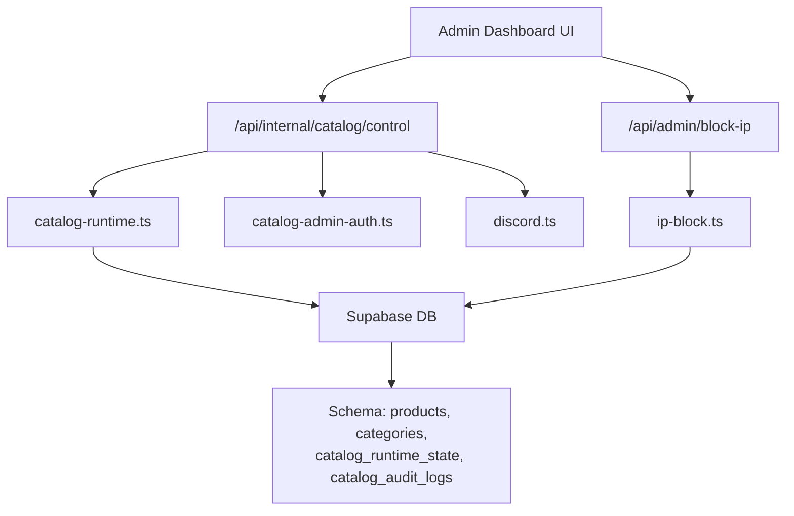

**Diagram sources**
- [route.ts:1-191](file://src/app/api/internal/catalog/control/route.ts#L1-L191)
- [catalog-runtime.ts:1-1305](file://src/lib/catalog-runtime.ts#L1-L1305)
- [01_schema.sql:1-496](file://sql/01_schema.sql#L1-L496)
- [catalog-admin-auth.ts:1-65](file://src/lib/catalog-admin-auth.ts#L1-L65)
- [discord.ts:1-379](file://src/lib/discord.ts#L1-L379)
- [route.ts:1-140](file://src/app/api/admin/block-ip/route.ts#L1-L140)
- [ip-block.ts:1-210](file://src/lib/ip-block.ts#L1-L210)

**Section sources**
- [route.ts:1-191](file://src/app/api/internal/catalog/control/route.ts#L1-L191)
- [catalog-runtime.ts:1-1305](file://src/lib/catalog-runtime.ts#L1-L1305)
- [01_schema.sql:1-496](file://sql/01_schema.sql#L1-L496)

## Core Components
- Catalog control API: Lists and updates product data for the admin panel
- Runtime stock engine: Resolves product state, supports real-time stock mutations, and low-stock alerts
- Authentication and access control: Admin code validation and bearer token support
- Audit logging: Captures changes to product stock/price for compliance
- IP blocking: Administrative IP management with persistence and notifications
- Discord integration: Notifications for stock alerts and moderation actions
- Manual stock snapshots: Fallback stock data for products without runtime state
- Product page content: Highlights, guarantees, and social proof for product pages

**Section sources**
- [route.ts:1-191](file://src/app/api/internal/catalog/control/route.ts#L1-L191)
- [catalog-runtime.ts:1-1305](file://src/lib/catalog-runtime.ts#L1-L1305)
- [catalog-admin-auth.ts:1-65](file://src/lib/catalog-admin-auth.ts#L1-L65)
- [01_schema.sql:113-122](file://sql/01_schema.sql#L113-L122)
- [discord.ts:326-379](file://src/lib/discord.ts#L326-L379)
- [manual-stock.ts:1-100](file://src/lib/manual-stock.ts#L1-L100)
- [product-page-content.ts:1-239](file://src/lib/product-page-content.ts#L1-L239)

## Architecture Overview
The catalog control architecture centers on a dedicated admin API that validates credentials, resolves product data, and persists runtime stock state. Administrators can update prices, compare-at prices, shipping flags, and stock quantities (either total or per variant). Changes are logged and can trigger low-stock alerts.

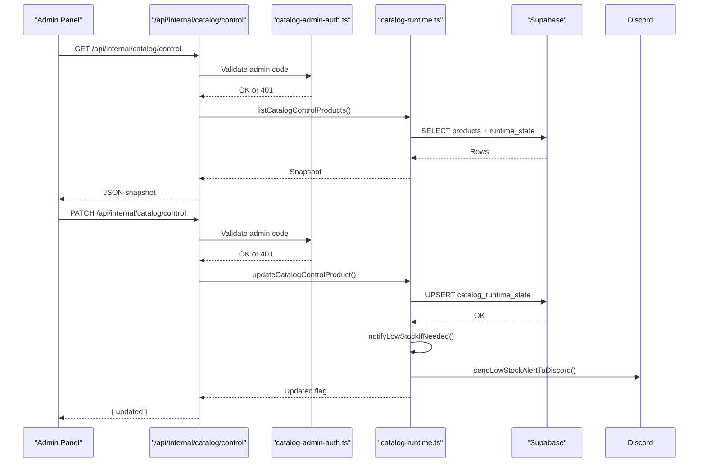

**Diagram sources**
- [route.ts:81-191](file://src/app/api/internal/catalog/control/route.ts#L81-L191)
- [catalog-admin-auth.ts:33-55](file://src/lib/catalog-admin-auth.ts#L33-L55)
- [catalog-runtime.ts:605-633](file://src/lib/catalog-runtime.ts#L605-L633)
- [discord.ts:326-379](file://src/lib/discord.ts#L326-L379)

## Detailed Component Analysis

### Catalog Control API
- Endpoint: GET lists products with computed totals and variants
- Endpoint: PATCH updates price, compare-at price, shipping flags, and stock (total or variants)
- Validation: Strict parsing of numeric fields, null handling for promotions/stock, and variant sanitization
- Authentication: Requires configured admin code via header

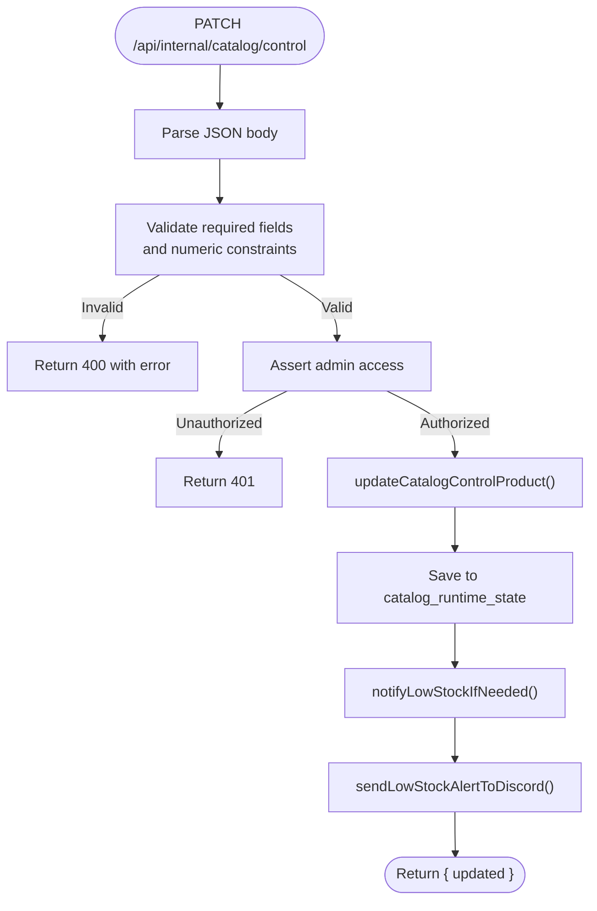

**Diagram sources**
- [route.ts:106-191](file://src/app/api/internal/catalog/control/route.ts#L106-L191)
- [catalog-runtime.ts:605-633](file://src/lib/catalog-runtime.ts#L605-L633)
- [discord.ts:326-379](file://src/lib/discord.ts#L326-L379)

**Section sources**
- [route.ts:1-191](file://src/app/api/internal/catalog/control/route.ts#L1-L191)

### Runtime Stock Engine
- Resolves product by slug with fallbacks to manual snapshots and product variants
- Supports reserve/restore stock via RPC functions with concurrency control
- Calculates total stock from variants when missing
- Emits low-stock alerts to Discord when thresholds are met
- Provides mutation retries and variant resolution heuristics

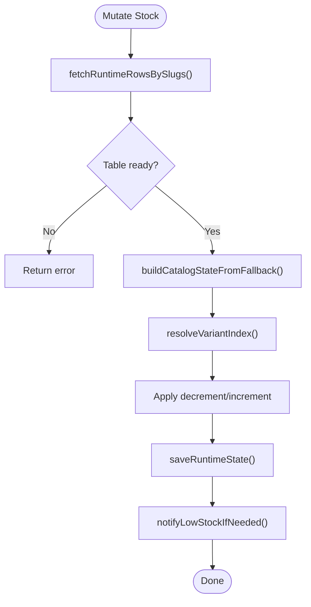

**Diagram sources**
- [catalog-runtime.ts:667-800](file://src/lib/catalog-runtime.ts#L667-L800)
- [catalog-runtime.ts:538-603](file://src/lib/catalog-runtime.ts#L538-L603)
- [01_schema.sql:253-395](file://sql/01_schema.sql#L253-L395)

**Section sources**
- [catalog-runtime.ts:1-1305](file://src/lib/catalog-runtime.ts#L1-L1305)
- [01_schema.sql:253-395](file://sql/01_schema.sql#L253-L395)

### Authentication and Access Control
- Admin code validation via timing-safe comparison
- Environment-based configuration for admin code and path token
- Bearer token parsing for administrative endpoints
- Path token validation for private panel access

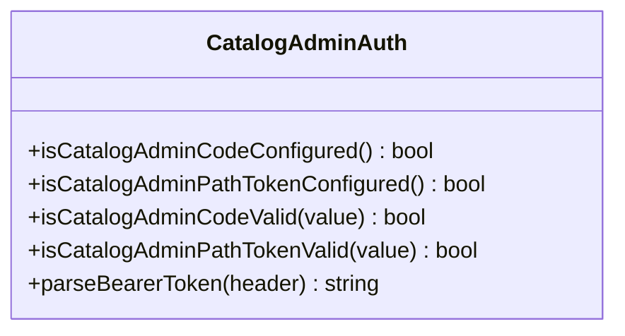

**Diagram sources**
- [catalog-admin-auth.ts:1-65](file://src/lib/catalog-admin-auth.ts#L1-L65)

**Section sources**
- [catalog-admin-auth.ts:1-65](file://src/lib/catalog-admin-auth.ts#L1-L65)

### Audit Logging
- Dedicated table for catalog changes with previous/next state snapshots
- Logged for admin panel updates and stock mutations
- Policies restrict client access to audit logs

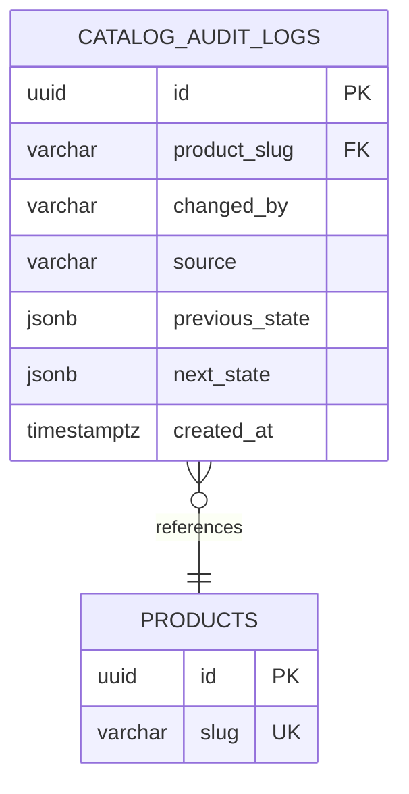

**Diagram sources**
- [01_schema.sql:113-122](file://sql/01_schema.sql#L113-L122)

**Section sources**
- [01_schema.sql:113-122](file://sql/01_schema.sql#L113-L122)

### IP Blocking System
- Admin endpoint to block/unblock IPs with duration (permanent, 24h, 1h)
- Persists to Supabase and maintains in-memory cache for fast lookups
- Sends notifications to Discord on block actions

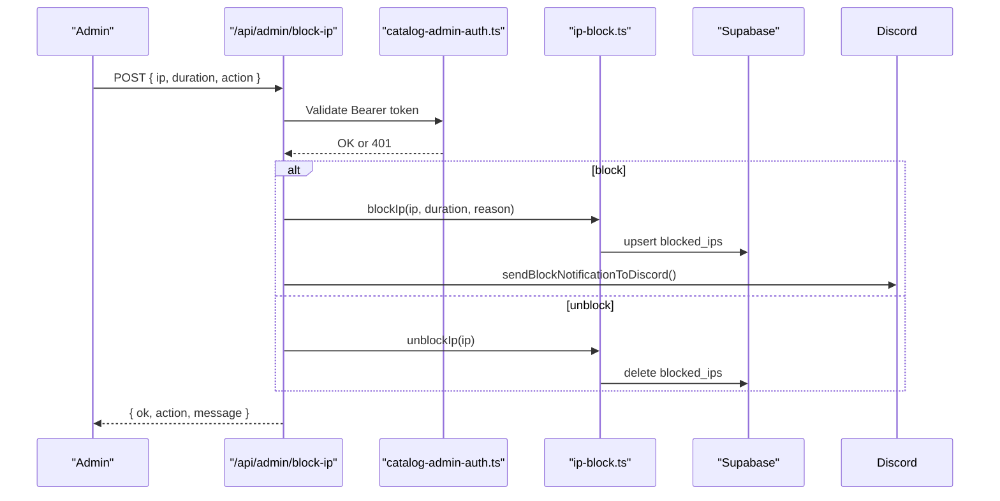

**Diagram sources**
- [route.ts:51-129](file://src/app/api/admin/block-ip/route.ts#L51-L129)
- [catalog-admin-auth.ts:57-64](file://src/lib/catalog-admin-auth.ts#L57-L64)
- [ip-block.ts:103-137](file://src/lib/ip-block.ts#L103-L137)
- [discord.ts:230-262](file://src/lib/discord.ts#L230-L262)

**Section sources**
- [route.ts:1-140](file://src/app/api/admin/block-ip/route.ts#L1-L140)
- [ip-block.ts:1-210](file://src/lib/ip-block.ts#L1-L210)
- [discord.ts:230-262](file://src/lib/discord.ts#L230-L262)

### Product Variant Handling and Image Management
- Variants are normalized and deduplicated; stock can be tracked per variant or as total
- Manual stock snapshots provide fallback stock data for products without runtime state
- Product page content includes highlights, guarantees, and social proof for SEO and UX

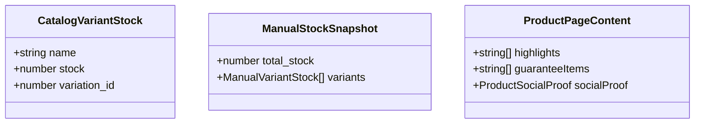

**Diagram sources**
- [catalog-runtime.ts:37-49](file://src/lib/catalog-runtime.ts#L37-L49)
- [manual-stock.ts:3-12](file://src/lib/manual-stock.ts#L3-L12)
- [product-page-content.ts:1-11](file://src/lib/product-page-content.ts#L1-L11)

**Section sources**
- [catalog-runtime.ts:152-197](file://src/lib/catalog-runtime.ts#L152-L197)
- [manual-stock.ts:1-100](file://src/lib/manual-stock.ts#L1-L100)
- [product-page-content.ts:1-239](file://src/lib/product-page-content.ts#L1-L239)

### Category Management
- Categories table stores hierarchical metadata (name, slug, description, image/icon/color)
- Products reference categories with RESTRICT on delete to prevent orphaning
- Indexes and policies support efficient queries and access control

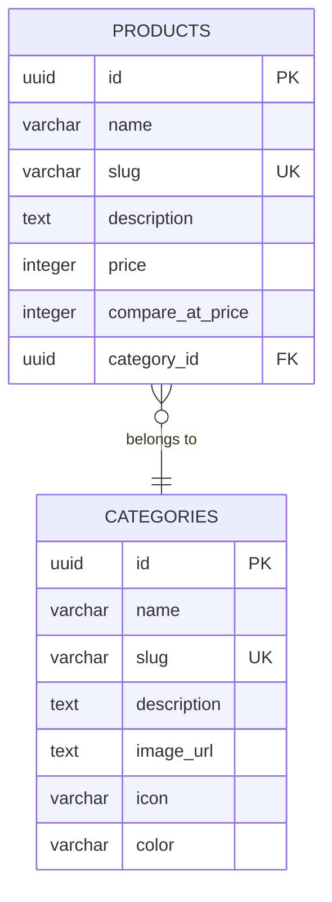

**Diagram sources**
- [01_schema.sql:13-45](file://sql/01_schema.sql#L13-L45)

**Section sources**
- [01_schema.sql:13-45](file://sql/01_schema.sql#L13-L45)

### Content Moderation and Review Approval
- Reviews table includes approval flags and verification fields
- Public visibility requires approved and verified purchases
- Discord integration provides moderation command snippets for quick actions

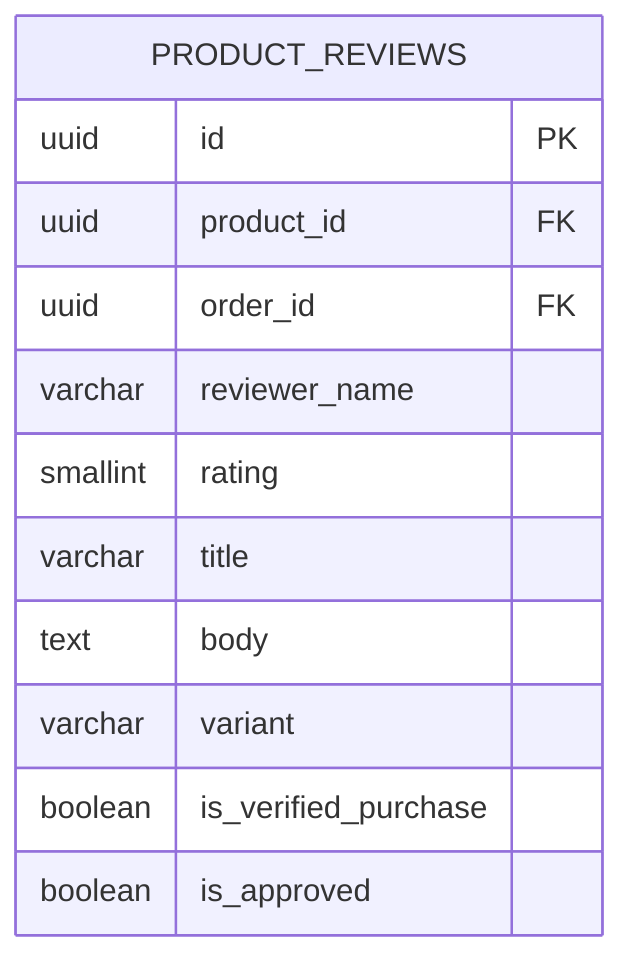

**Diagram sources**
- [01_schema.sql:72-85](file://sql/01_schema.sql#L72-L85)
- [discord.ts:95-111](file://src/lib/discord.ts#L95-L111)

**Section sources**
- [01_schema.sql:72-85](file://sql/01_schema.sql#L72-L85)
- [discord.ts:95-111](file://src/lib/discord.ts#L95-L111)

## Dependency Analysis
Key dependencies and relationships:
- Admin API depends on catalog-admin-auth for access control
- Runtime library depends on Supabase for product and runtime state queries
- Stock mutations depend on PostgreSQL RPC functions and retry logic
- Audit logs capture changes for compliance
- Discord integration provides operational notifications

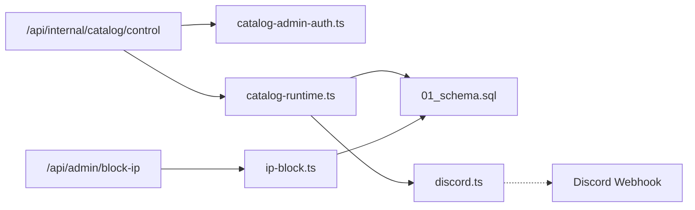

**Diagram sources**
- [route.ts:1-191](file://src/app/api/internal/catalog/control/route.ts#L1-L191)
- [catalog-admin-auth.ts:1-65](file://src/lib/catalog-admin-auth.ts#L1-L65)
- [catalog-runtime.ts:1-1305](file://src/lib/catalog-runtime.ts#L1-L1305)
- [01_schema.sql:1-496](file://sql/01_schema.sql#L1-L496)
- [discord.ts:1-379](file://src/lib/discord.ts#L1-L379)
- [route.ts:1-140](file://src/app/api/admin/block-ip/route.ts#L1-L140)
- [ip-block.ts:1-210](file://src/lib/ip-block.ts#L1-L210)

**Section sources**
- [route.ts:1-191](file://src/app/api/internal/catalog/control/route.ts#L1-L191)
- [catalog-runtime.ts:1-1305](file://src/lib/catalog-runtime.ts#L1-L1305)
- [01_schema.sql:1-496](file://sql/01_schema.sql#L1-L496)

## Performance Considerations
- Runtime stock table enables fast reads and writes for admin updates
- Indexes on product slugs and runtime state updated_at improve query performance
- RPC-based stock mutations provide atomic updates with concurrency safeguards
- Low-stock alerts include a cooldown to avoid spam
- Manual stock snapshots reduce latency for products without runtime state

[No sources needed since this section provides general guidance]

## Troubleshooting Guide
Common issues and resolutions:
- Admin access denied: Verify CATALOG_ADMIN_ACCESS_CODE is set and correct
- Missing runtime table: Run the runtime stock seed SQL to create catalog_runtime_state
- Stock mutation errors: Check variant resolution and numeric constraints; retry after verifying product slug
- Low-stock alerts not firing: Confirm LOW_STOCK_ALERTS_ENABLED and LOW_STOCK_ALERT_THRESHOLD environment variables
- IP blocking not effective: Ensure ADMIN_BLOCK_SECRET is configured and endpoint is called with Authorization: Bearer

**Section sources**
- [route.ts:59-79](file://src/app/api/internal/catalog/control/route.ts#L59-L79)
- [03_runtime_stock.sql:1-46](file://sql/03_runtime_stock.sql#L1-L46)
- [catalog-runtime.ts:698-712](file://src/lib/catalog-runtime.ts#L698-L712)
- [discord.ts:326-379](file://src/lib/discord.ts#L326-L379)
- [route.ts:24-41](file://src/app/api/admin/block-ip/route.ts#L24-L41)

## Conclusion
The catalog control interface provides a secure, audited, and real-time system for managing product catalogs. Administrators can efficiently update pricing, promotions, shipping flags, and stock levels while maintaining compliance and operational visibility through audit logs and Discord notifications.

[No sources needed since this section summarizes without analyzing specific files]

## Appendices

### Practical Examples
- Bulk stock updates: Send PATCH requests with variants array to update per-variant stock
- Price and promotion changes: Update price and compare_at_price; null removes promotion
- Shipping flags: Toggle free_shipping and shipping_cost as needed
- Category reorganization: Update product.category_id via product management tools; ensure referential integrity

[No sources needed since this section provides general guidance]