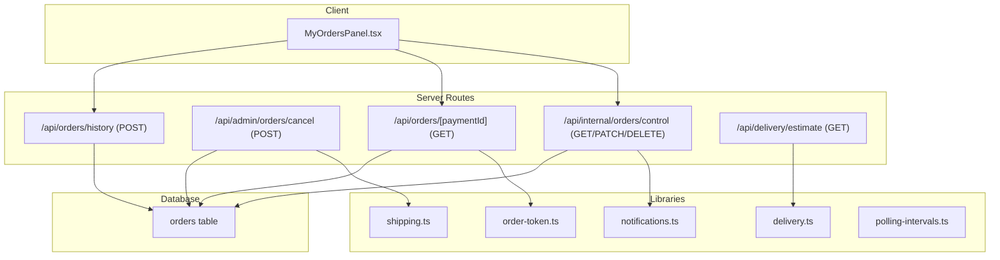
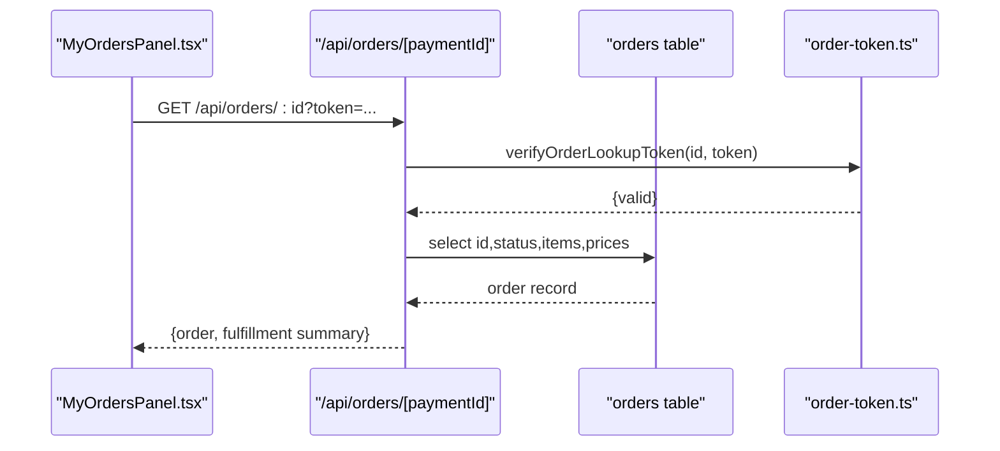
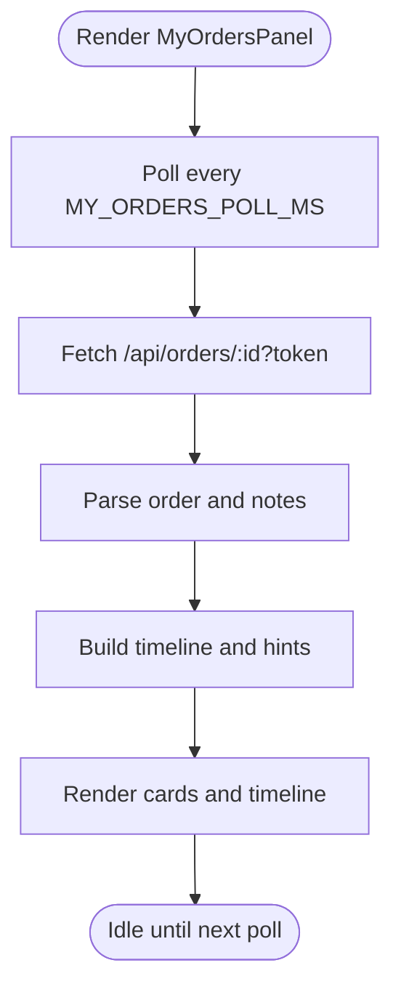
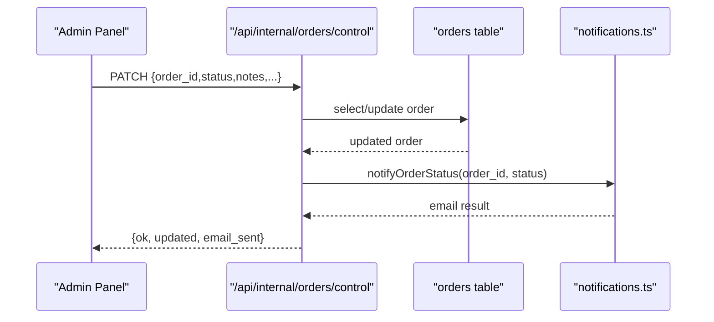
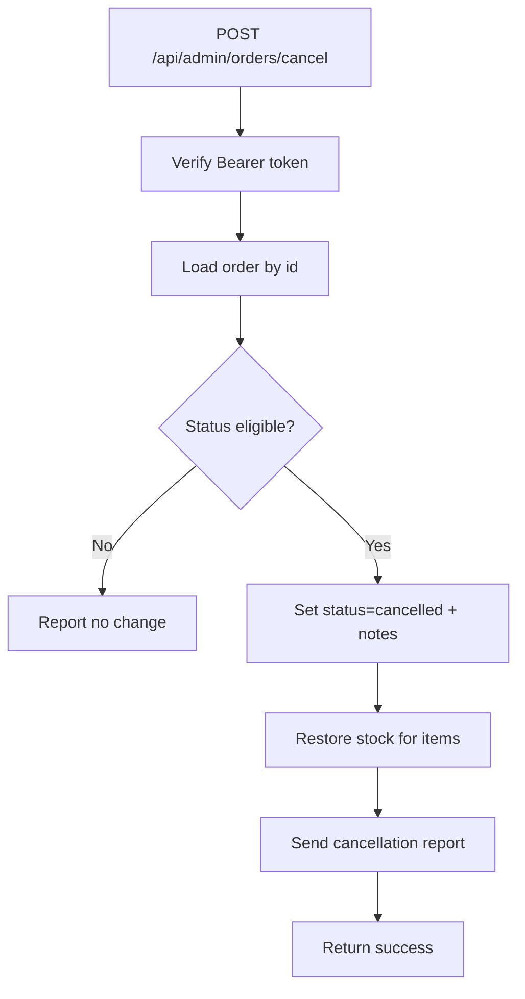
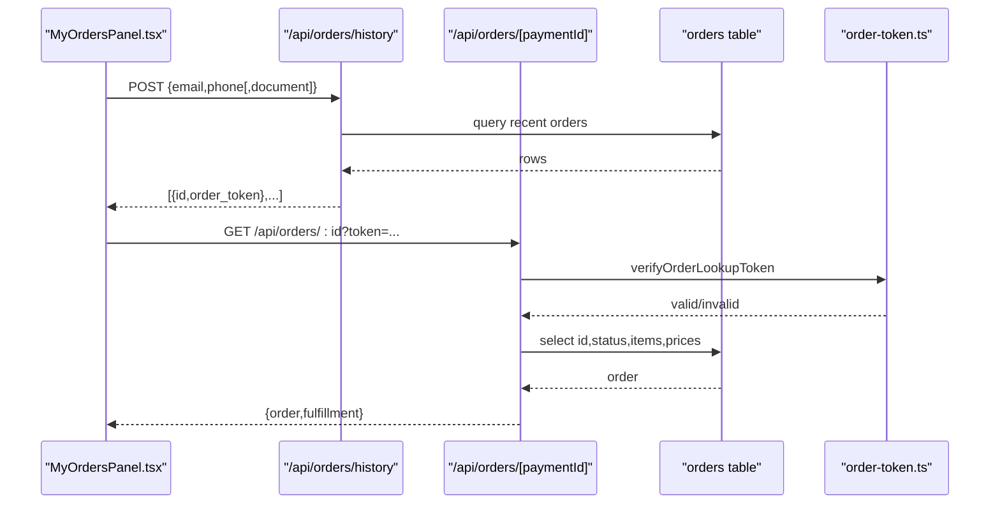
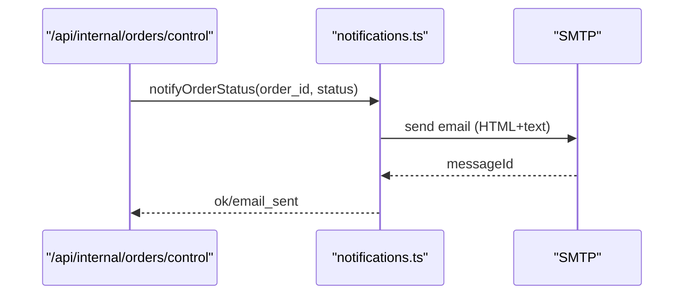
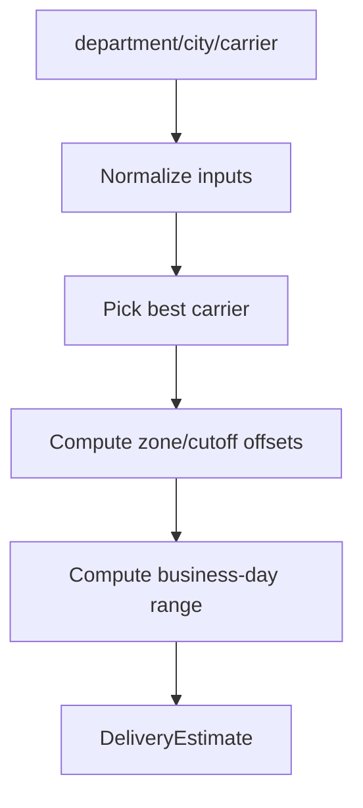
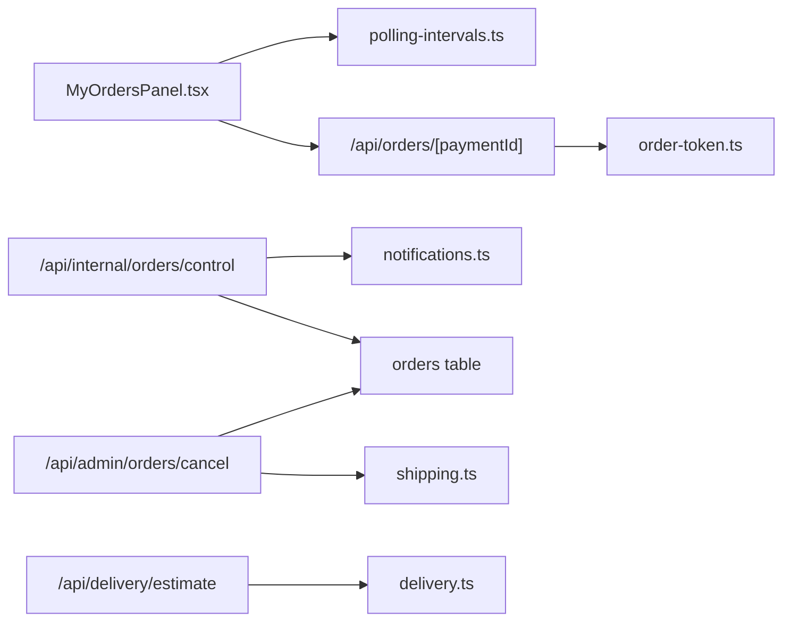

# Order Management Dashboard

<cite>
**Referenced Files in This Document**
- [src/app/api/internal/orders/control/route.ts](file://src/app/api/internal/orders/control/route.ts)
- [src/app/api/admin/orders/cancel/route.ts](file://src/app/api/admin/orders/cancel/route.ts)
- [src/app/api/orders/history/route.ts](file://src/app/api/orders/history/route.ts)
- [src/app/api/orders/[paymentId]/route.ts](file://src/app/api/orders/[paymentId]/route.ts)
- [src/components/orders/MyOrdersPanel.tsx](file://src/components/orders/MyOrdersPanel.tsx)
- [src/lib/notifications.ts](file://src/lib/notifications.ts)
- [src/lib/order-token.ts](file://src/lib/order-token.ts)
- [src/lib/delivery.ts](file://src/lib/delivery.ts)
- [src/lib/shipping.ts](file://src/lib/shipping.ts)
- [src/app/api/delivery/estimate/route.ts](file://src/app/api/delivery/estimate/route.ts)
- [src/lib/polling-intervals.ts](file://src/lib/polling-intervals.ts)
- [src/tokens/database.ts](file://src/tokens/database.ts)
</cite>

## Table of Contents
1. [Introduction](#introduction)
2. [Project Structure](#project-structure)
3. [Core Components](#core-components)
4. [Architecture Overview](#architecture-overview)
5. [Detailed Component Analysis](#detailed-component-analysis)
6. [Dependency Analysis](#dependency-analysis)
7. [Performance Considerations](#performance-considerations)
8. [Troubleshooting Guide](#troubleshooting-guide)
9. [Conclusion](#conclusion)
10. [Appendices](#appendices)

## Introduction
This document describes the order management dashboard and related workflows for order tracking, processing, and fulfillment. It covers:
- Real-time order tracking with status visualization and polling
- Administrative order control, including status updates, notes, and cancellation
- Customer-facing order lookup and history retrieval
- Communication via automated email notifications
- Shipping estimation and national shipping cost calculation
- Operational controls: filtering, bulk-like polling, and export-ready data formats
- Practical scenarios, escalation, and troubleshooting

## Project Structure
The order management system spans server-side API routes, client-side UI components, and shared libraries for notifications, tokens, and shipping logic.

**Diagram sources**
- [src/components/orders/MyOrdersPanel.tsx:615-794](file://src/components/orders/MyOrdersPanel.tsx#L615-L794)
- [src/app/api/internal/orders/control/route.ts:283-347](file://src/app/api/internal/orders/control/route.ts#L283-L347)
- [src/app/api/admin/orders/cancel/route.ts:67-226](file://src/app/api/admin/orders/cancel/route.ts#L67-L226)
- [src/app/api/orders/history/route.ts:43-144](file://src/app/api/orders/history/route.ts#L43-L144)
- [src/app/api/orders/[paymentId]/route.ts](file://src/app/api/orders/[paymentId]/route.ts#L39-L100)
- [src/app/api/delivery/estimate/route.ts:44-129](file://src/app/api/delivery/estimate/route.ts#L44-L129)
- [src/lib/notifications.ts:89-319](file://src/lib/notifications.ts#L89-L319)
- [src/lib/order-token.ts:39-64](file://src/lib/order-token.ts#L39-L64)
- [src/lib/delivery.ts:443-487](file://src/lib/delivery.ts#L443-L487)
- [src/lib/shipping.ts:62-72](file://src/lib/shipping.ts#L62-L72)

**Section sources**
- [src/components/orders/MyOrdersPanel.tsx:615-794](file://src/components/orders/MyOrdersPanel.tsx#L615-L794)
- [src/app/api/internal/orders/control/route.ts:283-347](file://src/app/api/internal/orders/control/route.ts#L283-L347)
- [src/app/api/admin/orders/cancel/route.ts:67-226](file://src/app/api/admin/orders/cancel/route.ts#L67-L226)
- [src/app/api/orders/history/route.ts:43-144](file://src/app/api/orders/history/route.ts#L43-L144)
- [src/app/api/orders/[paymentId]/route.ts](file://src/app/api/orders/[paymentId]/route.ts#L39-L100)
- [src/app/api/delivery/estimate/route.ts:44-129](file://src/app/api/delivery/estimate/route.ts#L44-L129)
- [src/lib/notifications.ts:89-319](file://src/lib/notifications.ts#L89-L319)
- [src/lib/order-token.ts:39-64](file://src/lib/order-token.ts#L39-L64)
- [src/lib/delivery.ts:443-487](file://src/lib/delivery.ts#L443-L487)
- [src/lib/shipping.ts:62-72](file://src/lib/shipping.ts#L62-L72)
- [src/lib/polling-intervals.ts:1-18](file://src/lib/polling-intervals.ts#L1-L18)

## Core Components
- Order tracking UI: displays order status, timeline, tracking reference, and dispatch reference with live polling.
- Admin order control: fetches, filters, updates statuses, records notes, and triggers email notifications.
- Order cancellation: validates admin credentials, cancels eligible orders, and restores stock.
- Order lookup and history: secure retrieval of order summaries and token-based access.
- Notifications: HTML/text emails with status-specific content and links.
- Delivery estimation: Colombia-focused delivery windows and carrier selection.
- Shipping cost: national shipping fee and free-shipping logic.

**Section sources**
- [src/components/orders/MyOrdersPanel.tsx:615-794](file://src/components/orders/MyOrdersPanel.tsx#L615-L794)
- [src/app/api/internal/orders/control/route.ts:283-347](file://src/app/api/internal/orders/control/route.ts#L283-L347)
- [src/app/api/admin/orders/cancel/route.ts:67-226](file://src/app/api/admin/orders/cancel/route.ts#L67-L226)
- [src/app/api/orders/history/route.ts:43-144](file://src/app/api/orders/history/route.ts#L43-L144)
- [src/app/api/orders/[paymentId]/route.ts](file://src/app/api/orders/[paymentId]/route.ts#L39-L100)
- [src/lib/notifications.ts:89-319](file://src/lib/notifications.ts#L89-L319)
- [src/lib/delivery.ts:443-487](file://src/lib/delivery.ts#L443-L487)
- [src/lib/shipping.ts:62-72](file://src/lib/shipping.ts#L62-L72)

## Architecture Overview
The system follows a client-server pattern:
- Client-side React component polls order endpoints and renders a timeline and status cards.
- Server routes enforce admin access for internal control and cancellation, and provide order lookup with token verification.
- Notifications are sent asynchronously after significant status changes.
- Delivery estimates are computed server-side using a deterministic model.

**Diagram sources**
- [src/components/orders/MyOrdersPanel.tsx:317-333](file://src/components/orders/MyOrdersPanel.tsx#L317-L333)
- [src/app/api/orders/[paymentId]/route.ts](file://src/app/api/orders/[paymentId]/route.ts#L39-L100)
- [src/lib/order-token.ts:50-64](file://src/lib/order-token.ts#L50-L64)

**Section sources**
- [src/components/orders/MyOrdersPanel.tsx:615-794](file://src/components/orders/MyOrdersPanel.tsx#L615-L794)
- [src/app/api/orders/[paymentId]/route.ts](file://src/app/api/orders/[paymentId]/route.ts#L39-L100)
- [src/lib/order-token.ts:39-64](file://src/lib/order-token.ts#L39-L64)

## Detailed Component Analysis

### Order Tracking Interface (Client)
- Real-time polling: fetches order data periodically based on environment-driven intervals.
- Status visualization: badge styles per status, timeline stages, and contextual hints.
- Notes parsing: extracts tracking references, dispatch references, manual review completion, and customer notes.
- Fulfillment summary: indicates dispatch success/error and last event timestamps.

**Diagram sources**
- [src/components/orders/MyOrdersPanel.tsx:668-673](file://src/components/orders/MyOrdersPanel.tsx#L668-L673)
- [src/components/orders/MyOrdersPanel.tsx:317-333](file://src/components/orders/MyOrdersPanel.tsx#L317-L333)
- [src/components/orders/MyOrdersPanel.tsx:186-272](file://src/components/orders/MyOrdersPanel.tsx#L186-L272)

**Section sources**
- [src/components/orders/MyOrdersPanel.tsx:615-794](file://src/components/orders/MyOrdersPanel.tsx#L615-L794)
- [src/lib/polling-intervals.ts:12-15](file://src/lib/polling-intervals.ts#L12-L15)

### Admin Order Control (Server)
- Authentication: admin code via header for internal routes.
- Filtering and pagination: status filter, text query, and limit.
- Updates: status advancement, tracking reference, dispatch reference, internal/customer notes, and manual review markers.
- Email notifications: triggered on significant changes or explicit send.
- Deletion: removes orders by ID.

**Diagram sources**
- [src/app/api/internal/orders/control/route.ts:349-617](file://src/app/api/internal/orders/control/route.ts#L349-L617)
- [src/lib/notifications.ts:89-319](file://src/lib/notifications.ts#L89-L319)

**Section sources**
- [src/app/api/internal/orders/control/route.ts:283-347](file://src/app/api/internal/orders/control/route.ts#L283-L347)
- [src/app/api/internal/orders/control/route.ts:349-617](file://src/app/api/internal/orders/control/route.ts#L349-L617)

### Order Cancellation (Server)
- Admin authentication via Bearer token.
- Validates order eligibility (pending/paid/processing).
- Updates status to cancelled and merges cancellation metadata into notes.
- Restores stock for ordered items by product identifiers.

**Diagram sources**
- [src/app/api/admin/orders/cancel/route.ts:67-226](file://src/app/api/admin/orders/cancel/route.ts#L67-L226)

**Section sources**
- [src/app/api/admin/orders/cancel/route.ts:67-226](file://src/app/api/admin/orders/cancel/route.ts#L67-L226)

### Order Lookup and History (Server)
- History endpoint: accepts email, phone, and optional document; returns recent orders with short-lived tokens.
- Lookup endpoint: returns sanitized order fields with fulfillment summary; protected by token verification.

**Diagram sources**
- [src/app/api/orders/history/route.ts:43-144](file://src/app/api/orders/history/route.ts#L43-L144)
- [src/app/api/orders/[paymentId]/route.ts](file://src/app/api/orders/[paymentId]/route.ts#L39-L100)
- [src/lib/order-token.ts:50-64](file://src/lib/order-token.ts#L50-L64)

**Section sources**
- [src/app/api/orders/history/route.ts:43-144](file://src/app/api/orders/history/route.ts#L43-L144)
- [src/app/api/orders/[paymentId]/route.ts](file://src/app/api/orders/[paymentId]/route.ts#L39-L100)
- [src/lib/order-token.ts:39-64](file://src/lib/order-token.ts#L39-L64)

### Notifications and Communication
- Email transport: SMTP Gmail configuration.
- Dynamic subject and content based on status and notes.
- Includes items summary, dispatch reference, tracking code, and customer note.

**Diagram sources**
- [src/app/api/internal/orders/control/route.ts:582-596](file://src/app/api/internal/orders/control/route.ts#L582-L596)
- [src/lib/notifications.ts:89-319](file://src/lib/notifications.ts#L89-L319)

**Section sources**
- [src/lib/notifications.ts:89-319](file://src/lib/notifications.ts#L89-L319)

### Shipping Estimation and Cost
- Delivery estimation: Colombia departments and cities, carrier selection, cutoff logic, and business-day arithmetic.
- National shipping cost: configurable fee or free for qualifying products.

**Diagram sources**
- [src/lib/delivery.ts:443-487](file://src/lib/delivery.ts#L443-L487)

**Section sources**
- [src/lib/delivery.ts:443-487](file://src/lib/delivery.ts#L443-L487)
- [src/lib/shipping.ts:62-72](file://src/lib/shipping.ts#L62-L72)

## Dependency Analysis
- Client depends on polling intervals and order token verification for secure lookups.
- Admin control depends on Supabase for reads/writes and notifications for customer communication.
- Cancellation depends on stock restoration utilities and Discord reporting.
- Delivery estimate depends on department/city normalization and carrier availability.

**Diagram sources**
- [src/components/orders/MyOrdersPanel.tsx:615-794](file://src/components/orders/MyOrdersPanel.tsx#L615-L794)
- [src/lib/polling-intervals.ts:12-15](file://src/lib/polling-intervals.ts#L12-L15)
- [src/app/api/orders/[paymentId]/route.ts](file://src/app/api/orders/[paymentId]/route.ts#L39-L100)
- [src/lib/order-token.ts:39-64](file://src/lib/order-token.ts#L39-L64)
- [src/app/api/internal/orders/control/route.ts:283-347](file://src/app/api/internal/orders/control/route.ts#L283-L347)
- [src/lib/notifications.ts:89-319](file://src/lib/notifications.ts#L89-L319)
- [src/app/api/admin/orders/cancel/route.ts:67-226](file://src/app/api/admin/orders/cancel/route.ts#L67-L226)
- [src/lib/shipping.ts:62-72](file://src/lib/shipping.ts#L62-L72)
- [src/app/api/delivery/estimate/route.ts:44-129](file://src/app/api/delivery/estimate/route.ts#L44-L129)
- [src/lib/delivery.ts:443-487](file://src/lib/delivery.ts#L443-L487)

**Section sources**
- [src/components/orders/MyOrdersPanel.tsx:615-794](file://src/components/orders/MyOrdersPanel.tsx#L615-L794)
- [src/app/api/internal/orders/control/route.ts:283-347](file://src/app/api/internal/orders/control/route.ts#L283-L347)
- [src/app/api/admin/orders/cancel/route.ts:67-226](file://src/app/api/admin/orders/cancel/route.ts#L67-L226)
- [src/app/api/orders/[paymentId]/route.ts](file://src/app/api/orders/[paymentId]/route.ts#L39-L100)
- [src/app/api/delivery/estimate/route.ts:44-129](file://src/app/api/delivery/estimate/route.ts#L44-L129)
- [src/lib/notifications.ts:89-319](file://src/lib/notifications.ts#L89-L319)
- [src/lib/order-token.ts:39-64](file://src/lib/order-token.ts#L39-L64)
- [src/lib/delivery.ts:443-487](file://src/lib/delivery.ts#L443-L487)
- [src/lib/shipping.ts:62-72](file://src/lib/shipping.ts#L62-L72)
- [src/lib/polling-intervals.ts:12-15](file://src/lib/polling-intervals.ts#L12-L15)

## Performance Considerations
- Polling intervals adapt to usage mode and Supabase plan to reduce load.
- Delivery estimation and order lookup endpoints apply rate limits.
- Admin control endpoints restrict updates to meaningful changes and batch email sends conditionally.

[No sources needed since this section provides general guidance]

## Troubleshooting Guide
Common issues and resolutions:
- Invalid admin access: ensure admin code or Bearer token is configured and valid.
- Order not found: verify order ID format and token for lookup endpoints.
- Email failures: check SMTP credentials and network connectivity.
- Stock restoration errors: cancellation proceeds even if stock restore fails; verify product slugs and quantities.
- Excessive requests: rate limits return retry-after headers; reduce polling frequency.

**Section sources**
- [src/app/api/internal/orders/control/route.ts:59-78](file://src/app/api/internal/orders/control/route.ts#L59-L78)
- [src/app/api/admin/orders/cancel/route.ts:48-65](file://src/app/api/admin/orders/cancel/route.ts#L48-L65)
- [src/app/api/orders/[paymentId]/route.ts](file://src/app/api/orders/[paymentId]/route.ts#L72-L79)
- [src/lib/notifications.ts:389-406](file://src/lib/notifications.ts#L389-L406)
- [src/app/api/admin/orders/cancel/route.ts:191-194](file://src/app/api/admin/orders/cancel/route.ts#L191-L194)

## Conclusion
The order management dashboard combines a reactive client UI with robust server-side administrative controls, secure order lookup, and integrated notifications. While logistics webhooks are currently disabled, the system supports manual dispatch tracking and provides accurate delivery estimates and shipping cost calculations tailored to Colombia.

[No sources needed since this section summarizes without analyzing specific files]

## Appendices

### Order Processing Workflows
- Payment verification: handled externally; order transitions to paid upon successful payment.
- Fulfillment coordination: manual dispatch tracking via dispatch reference and tracking candidate fields.
- Shipping management: dispatch timestamp recorded automatically when moving to shipped/delivered; delivery estimates available via dedicated endpoint.

**Section sources**
- [src/app/api/internal/orders/control/route.ts:454-460](file://src/app/api/internal/orders/control/route.ts#L454-L460)
- [src/app/api/delivery/estimate/route.ts:44-129](file://src/app/api/delivery/estimate/route.ts#L44-L129)

### Customer Communication Tools
- Automated status emails with dynamic content and links to tracking.
- Customer notes and internal notes stored in order notes JSON for transparency.

**Section sources**
- [src/lib/notifications.ts:89-319](file://src/lib/notifications.ts#L89-L319)
- [src/app/api/internal/orders/control/route.ts:473-505](file://src/app/api/internal/orders/control/route.ts#L473-L505)

### Order Modification and Cancellation
- Modify: update status, tracking/dispatch references, notes, and manual review flags.
- Cancel: only eligible statuses; updates status and restores stock.

**Section sources**
- [src/app/api/internal/orders/control/route.ts:349-617](file://src/app/api/internal/orders/control/route.ts#L349-L617)
- [src/app/api/admin/orders/cancel/route.ts:132-225](file://src/app/api/admin/orders/cancel/route.ts#L132-L225)

### Reporting and Analytics
- Export-ready data: order history endpoint returns compact order summaries with tokens for secure retrieval.
- No built-in analytics endpoints; use exported lists for downstream reporting.

**Section sources**
- [src/app/api/orders/history/route.ts:129-143](file://src/app/api/orders/history/route.ts#L129-L143)

### External Integrations
- Logistics provider APIs: webhook endpoints return disabled; operations remain manual.
- WhatsApp webhook: disabled.

**Section sources**
- [src/app/api/webhooks/logistics/route.ts:1-19](file://src/app/api/webhooks/logistics/route.ts#L1-L19)
- [src/app/api/webhooks/whatsapp/route.ts:1-19](file://src/app/api/webhooks/whatsapp/route.ts#L1-L19)

### Operational Controls
- Filtering: admin control supports status and text queries.
- Bulk actions: client-side polling and local storage manage multiple orders; server-side PATCH supports single updates.
- Export: order history returns order tokens for secure retrieval.

**Section sources**
- [src/app/api/internal/orders/control/route.ts:294-328](file://src/app/api/internal/orders/control/route.ts#L294-L328)
- [src/app/api/orders/history/route.ts:129-143](file://src/app/api/orders/history/route.ts#L129-L143)

### Practical Scenarios
- Track a recent order: enter email/phone/document to retrieve recent orders, then open individual order cards.
- Advance status manually: admin panel allows advancing to next stage or setting specific status with notes.
- Cancel an order: admin endpoint with Bearer token for eligible orders; stock restored automatically.

**Section sources**
- [src/components/orders/MyOrdersPanel.tsx:675-704](file://src/components/orders/MyOrdersPanel.tsx#L675-L704)
- [src/app/api/internal/orders/control/route.ts:403-417](file://src/app/api/internal/orders/control/route.ts#L403-L417)
- [src/app/api/admin/orders/cancel/route.ts:132-225](file://src/app/api/admin/orders/cancel/route.ts#L132-L225)