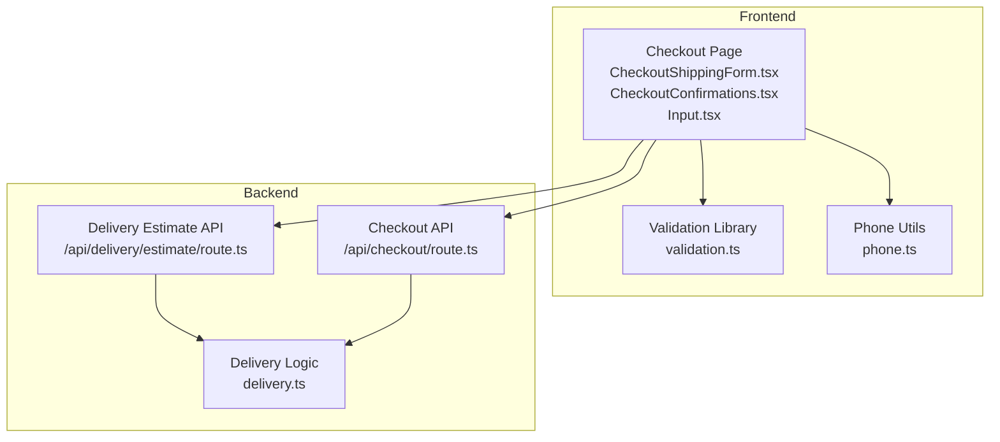
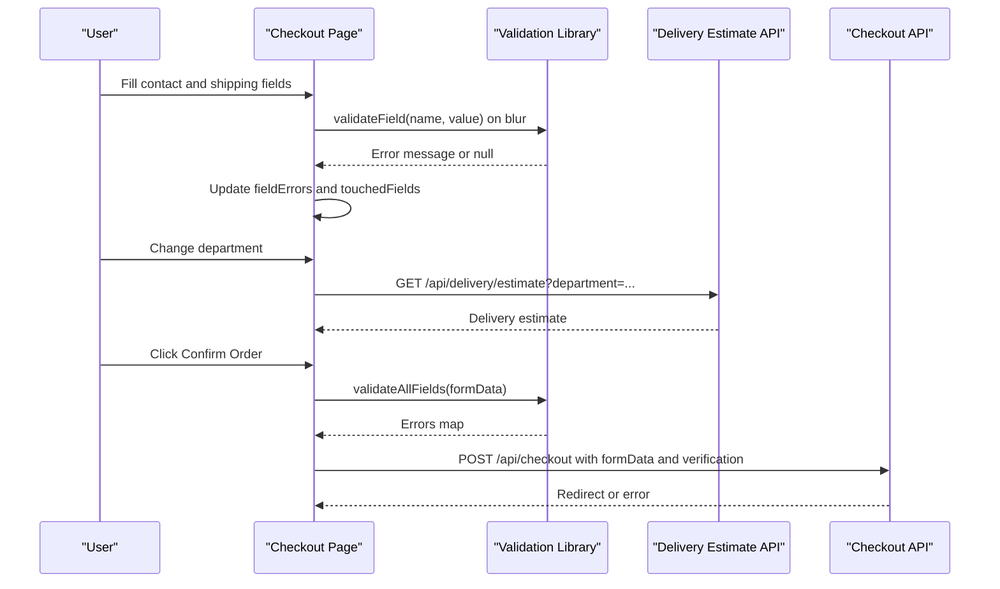
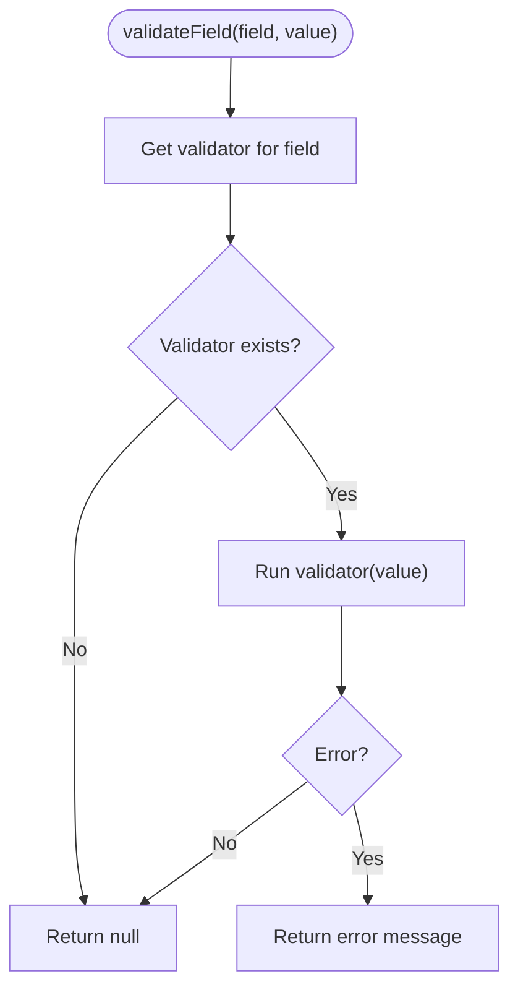
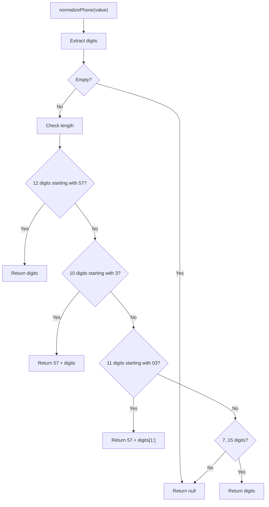
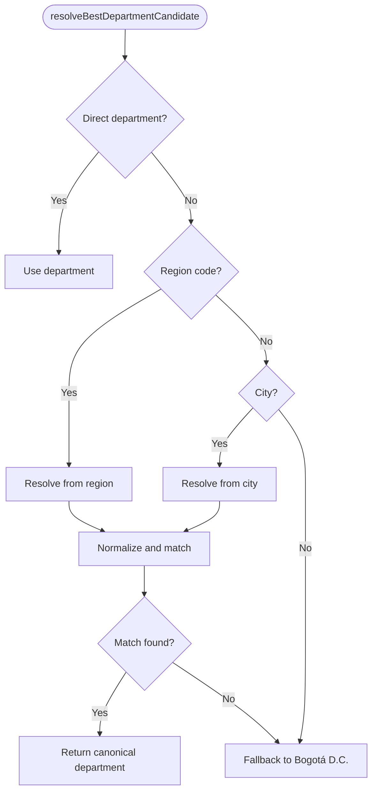
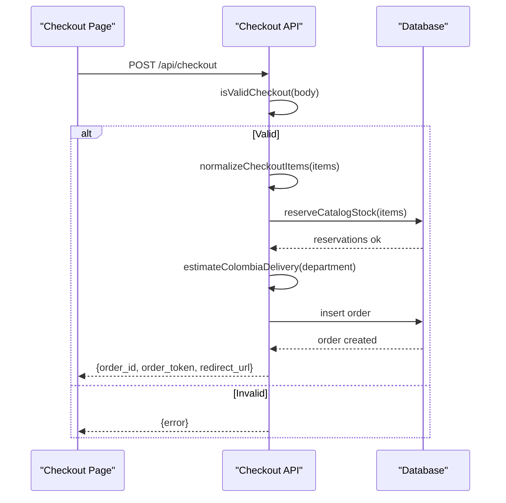
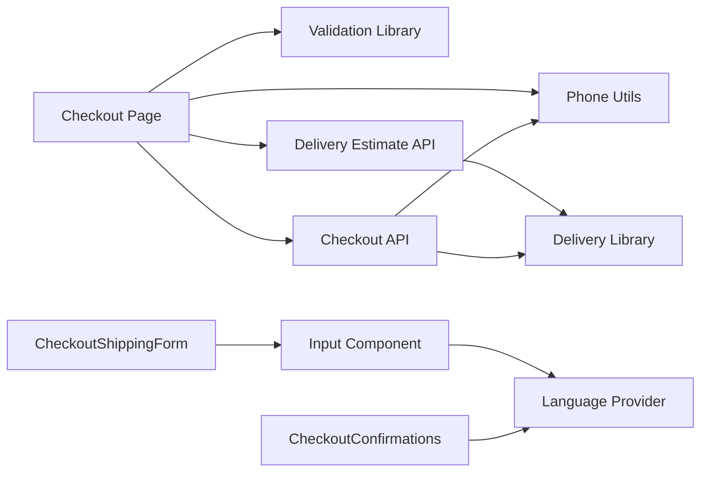

# Checkout Form Validation

<cite>
**Referenced Files in This Document**
- [CheckoutShippingForm.tsx](file://src/components/checkout/CheckoutShippingForm.tsx)
- [CheckoutConfirmations.tsx](file://src/components/checkout/CheckoutConfirmations.tsx)
- [Checkout page](file://src/app/checkout/page.tsx)
- [Validation library](file://src/lib/validation.ts)
- [Phone normalization](file://src/lib/phone.ts)
- [Delivery estimation](file://src/lib/delivery.ts)
- [Checkout API](file://src/app/api/checkout/route.ts)
- [Delivery estimate API](file://src/app/api/delivery/estimate/route.ts)
- [Input UI component](file://src/components/ui/Input.tsx)
- [Language provider](file://src/providers/LanguageProvider.tsx)
- [Translations](file://src/providers/translations.ts)
</cite>

## Table of Contents
1. [Introduction](#introduction)
2. [Project Structure](#project-structure)
3. [Core Components](#core-components)
4. [Architecture Overview](#architecture-overview)
5. [Detailed Component Analysis](#detailed-component-analysis)
6. [Dependency Analysis](#dependency-analysis)
7. [Performance Considerations](#performance-considerations)
8. [Troubleshooting Guide](#troubleshooting-guide)
9. [Conclusion](#conclusion)
10. [Appendices](#appendices)

## Introduction
This document explains the checkout form validation system used in the application. It covers multi-field validation for contact information, shipping address, and confirmation checkboxes. It documents validation rules for Colombian addresses, document verification, and phone number formatting. It also describes the real-time validation feedback system, error state management, and field-specific error messages. Implementation details include the validation library, form state handling, and integration with the checkout workflow. Examples of common validation scenarios, edge cases, and troubleshooting steps are included, along with internationalization and accessibility considerations.

## Project Structure
The checkout validation spans UI components, a validation library, and backend APIs:
- Frontend form components render inputs and manage local state.
- A validation library defines field-level validators and collects errors.
- Phone normalization ensures consistent phone formats.
- Delivery estimation integrates with the checkout to compute shipping estimates.
- Backend APIs enforce stricter validation and persist orders.

**Diagram sources**
- [Checkout page:54-595](file://src/app/checkout/page.tsx#L54-L595)
- [CheckoutShippingForm.tsx:53-172](file://src/components/checkout/CheckoutShippingForm.tsx#L53-L172)
- [CheckoutConfirmations.tsx:14-42](file://src/components/checkout/CheckoutConfirmations.tsx#L14-L42)
- [Validation library:1-112](file://src/lib/validation.ts#L1-L112)
- [Phone normalization:1-35](file://src/lib/phone.ts#L1-L35)
- [Checkout API:497-872](file://src/app/api/checkout/route.ts#L497-L872)
- [Delivery estimate API:44-129](file://src/app/api/delivery/estimate/route.ts#L44-L129)
- [Delivery estimation:438-487](file://src/lib/delivery.ts#L438-L487)

**Section sources**
- [Checkout page:54-595](file://src/app/checkout/page.tsx#L54-L595)
- [CheckoutShippingForm.tsx:53-172](file://src/components/checkout/CheckoutShippingForm.tsx#L53-L172)
- [CheckoutConfirmations.tsx:14-42](file://src/components/checkout/CheckoutConfirmations.tsx#L14-L42)
- [Validation library:1-112](file://src/lib/validation.ts#L1-L112)
- [Phone normalization:1-35](file://src/lib/phone.ts#L1-L35)
- [Checkout API:497-872](file://src/app/api/checkout/route.ts#L497-L872)
- [Delivery estimate API:44-129](file://src/app/api/delivery/estimate/route.ts#L44-L129)
- [Delivery estimation:438-487](file://src/lib/delivery.ts#L438-L487)

## Core Components
- Validation library: Defines field validators and aggregates errors.
- Phone normalization: Converts various phone formats to a canonical form.
- UI components: Present inputs, show real-time validation feedback, and manage focus states.
- Delivery estimation: Computes shipping estimates and departments/cities.
- Checkout page: Orchestrates form state, validation triggers, and submission.
- Backend APIs: Enforce strict validation and persist orders.

Key responsibilities:
- Real-time validation on blur and change.
- Field-specific error messages in Spanish.
- Internationalization via LanguageProvider and translations.
- Accessibility attributes for screen readers and keyboard navigation.
- Backend validation mirroring frontend rules plus additional checks.

**Section sources**
- [Validation library:1-112](file://src/lib/validation.ts#L1-L112)
- [Phone normalization:1-35](file://src/lib/phone.ts#L1-L35)
- [Input UI component:1-107](file://src/components/ui/Input.tsx#L1-L107)
- [CheckoutShippingForm.tsx:53-172](file://src/components/checkout/CheckoutShippingForm.tsx#L53-L172)
- [Checkout page:54-595](file://src/app/checkout/page.tsx#L54-L595)
- [Checkout API:172-196](file://src/app/api/checkout/route.ts#L172-L196)

## Architecture Overview
The checkout validation follows a layered approach:
- UI layer: Collects user input and displays immediate feedback.
- Validation layer: Applies field-specific rules and returns localized messages.
- Delivery layer: Infers department/city and computes shipping estimates.
- Submission layer: Validates all fields and sends data to the backend.

**Diagram sources**
- [Checkout page:210-225](file://src/app/checkout/page.tsx#L210-L225)
- [Checkout page:227-353](file://src/app/checkout/page.tsx#L227-L353)
- [Validation library:92-110](file://src/lib/validation.ts#L92-L110)
- [Delivery estimate API:110-114](file://src/app/api/delivery/estimate/route.ts#L110-L114)
- [Checkout API:596-603](file://src/app/api/checkout/route.ts#L596-L603)

## Detailed Component Analysis

### Validation Library
The validation library centralizes field-level rules and returns user-friendly Spanish messages. It validates:
- Full name: required, minimum length, maximum length.
- Email: required, format validation.
- Phone: required, digit count between 7 and 15; normalization occurs elsewhere.
- Document: required, digit count between 6 and 15.
- Address: required, minimum length.
- City: required, minimum length.
- Department: required selection from Colombian departments.

It exposes:
- validateField(field, value): returns a single error or null.
- validateAllFields(data): returns a map of field -> error.

**Diagram sources**
- [Validation library:92-99](file://src/lib/validation.ts#L92-L99)

**Section sources**
- [Validation library:14-65](file://src/lib/validation.ts#L14-L65)
- [Validation library:79-90](file://src/lib/validation.ts#L79-L90)
- [Validation library:92-110](file://src/lib/validation.ts#L92-L110)

### Phone Number Formatting
Phone normalization converts various formats to a canonical representation:
- Accepts 7–15 digits.
- Supports Colombian formats with or without leading country code.
- Generates candidate numbers for lookups.

**Diagram sources**
- [Phone normalization:1-22](file://src/lib/phone.ts#L1-L22)

**Section sources**
- [Phone normalization:1-35](file://src/lib/phone.ts#L1-L35)

### UI Components and Real-Time Feedback
- Input component:
  - Displays floating labels and hints.
  - Shows error messages with accessible ARIA attributes.
  - Updates focus and value states for visual feedback.
- CheckoutShippingForm:
  - Renders contact and shipping fields.
  - Uses Input component with error prop.
  - Shows delivery estimate card with loading and unavailable states.
- CheckoutConfirmations:
  - Single checkbox that toggles three related confirmations.

Accessibility features:
- ARIA invalid and described-by attributes on inputs.
- Focus management and visual feedback for floating labels.
- Screen-reader-friendly error messages.

**Section sources**
- [Input UI component:14-106](file://src/components/ui/Input.tsx#L14-L106)
- [Checkout page:496-545](file://src/app/checkout/page.tsx#L496-L545)
- [Checkout page:548-556](file://src/app/checkout/page.tsx#L548-L556)
- [Checkout page:558-563](file://src/app/checkout/page.tsx#L558-L563)
- [CheckoutShippingForm.tsx:53-172](file://src/components/checkout/CheckoutShippingForm.tsx#L53-L172)
- [CheckoutConfirmations.tsx:14-42](file://src/components/checkout/CheckoutConfirmations.tsx#L14-L42)

### Delivery Estimation and Colombian Departments
- Department inference:
  - Accepts direct department, region code, or city.
  - Falls back to Bogotá D.C. if none provided.
- Estimation model:
  - Computes business days based on department zones, carrier, and cutoff logic.
  - Returns formatted date range and confidence level.
- UI integration:
  - Loads estimate when department changes.
  - Shows loading, estimate, or unavailable states.

**Diagram sources**
- [Delivery estimation:421-436](file://src/lib/delivery.ts#L421-L436)

**Section sources**
- [Delivery estimate API:76-107](file://src/app/api/delivery/estimate/route.ts#L76-L107)
- [Delivery estimation:438-487](file://src/lib/delivery.ts#L438-L487)
- [Checkout page:122-192](file://src/app/checkout/page.tsx#L122-L192)

### Backend Validation and Submission
The backend enforces stricter validation and mirrors frontend rules:
- Name, email, phone, document, address, city, department, shipping type, and verification flags.
- Phone normalization and document digit extraction.
- Duplicate order prevention and stock reservation.
- Order creation with notes containing logistics and verification metadata.

**Diagram sources**
- [Checkout API:596-603](file://src/app/api/checkout/route.ts#L596-L603)
- [Checkout API:663-683](file://src/app/api/checkout/route.ts#L663-L683)
- [Checkout API:704-706](file://src/app/api/checkout/route.ts#L704-L706)
- [Checkout API:759-763](file://src/app/api/checkout/route.ts#L759-L763)

**Section sources**
- [Checkout API:172-196](file://src/app/api/checkout/route.ts#L172-L196)
- [Checkout API:623-629](file://src/app/api/checkout/route.ts#L623-L629)
- [Checkout API:704-706](file://src/app/api/checkout/route.ts#L704-L706)
- [Checkout API:759-763](file://src/app/api/checkout/route.ts#L759-L763)

## Dependency Analysis
- Checkout page depends on:
  - Validation library for field-level checks.
  - Phone normalization for consistent phone handling.
  - Delivery estimate API for department inference and ETA.
  - Backend checkout API for order submission.
- UI components depend on:
  - Input component for rendering and accessibility.
  - LanguageProvider for translations.
- Backend APIs depend on:
  - Delivery estimation library for ETA computation.
  - Phone normalization for phone validation.
  - Stock reservation and catalog runtime for inventory checks.

**Diagram sources**
- [Checkout page:25-25](file://src/app/checkout/page.tsx#L25-L25)
- [Validation library:1-112](file://src/lib/validation.ts#L1-L112)
- [Phone normalization:1-35](file://src/lib/phone.ts#L1-L35)
- [Delivery estimate API:1-129](file://src/app/api/delivery/estimate/route.ts#L1-L129)
- [Checkout API:1-872](file://src/app/api/checkout/route.ts#L1-L872)
- [Input UI component:1-107](file://src/components/ui/Input.tsx#L1-L107)
- [Language provider:1-81](file://src/providers/LanguageProvider.tsx#L1-L81)
- [CheckoutShippingForm.tsx:1-172](file://src/components/checkout/CheckoutShippingForm.tsx#L1-L172)
- [CheckoutConfirmations.tsx:1-42](file://src/components/checkout/CheckoutConfirmations.tsx#L1-L42)
- [Delivery estimation:1-487](file://src/lib/delivery.ts#L1-L487)

**Section sources**
- [Checkout page:25-25](file://src/app/checkout/page.tsx#L25-L25)
- [Checkout page:122-192](file://src/app/checkout/page.tsx#L122-L192)
- [Checkout page:227-353](file://src/app/checkout/page.tsx#L227-L353)
- [Checkout API:497-872](file://src/app/api/checkout/route.ts#L497-L872)
- [Delivery estimate API:44-129](file://src/app/api/delivery/estimate/route.ts#L44-L129)
- [Delivery estimation:438-487](file://src/lib/delivery.ts#L438-L487)

## Performance Considerations
- Debounce or batch validation updates to reduce re-renders during typing.
- Memoize derived values (e.g., touched fields) to prevent unnecessary state updates.
- Limit network requests to delivery estimate API to avoid excessive calls.
- Use efficient error aggregation and minimal DOM updates for error messages.
- Cache department/city resolution when possible to avoid repeated computations.

## Troubleshooting Guide
Common validation issues and resolutions:
- Missing required fields:
  - Ensure all asterisked fields are filled before submission.
  - Review fieldErrors and touchedFields to locate missing data.
- Invalid email format:
  - Verify the email matches the expected pattern.
- Phone number errors:
  - Confirm the number contains 7–15 digits.
  - Use a Colombian number with or without leading country code.
- Document length errors:
  - Ensure the document has 6–15 digits.
- Address and city length errors:
  - Provide at least 12 characters for address and 3 for city.
- Department selection:
  - Choose a valid Colombian department from the dropdown.
- Confirmation checkbox:
  - Must be checked to proceed to payment.
- Backend validation failures:
  - Review the error message returned by the API.
  - Check phone normalization and document digit extraction.
  - Ensure stock availability and rate limits are not exceeded.

Accessibility tips:
- Use screen readers to navigate forms and listen to error announcements.
- Ensure focus indicators are visible and keyboard navigation works.
- Provide clear, concise error messages that describe the required action.

**Section sources**
- [Checkout page:227-246](file://src/app/checkout/page.tsx#L227-L246)
- [Checkout page:230-238](file://src/app/checkout/page.tsx#L230-L238)
- [Validation library:14-65](file://src/lib/validation.ts#L14-L65)
- [Phone normalization:1-35](file://src/lib/phone.ts#L1-L35)
- [Checkout API:596-603](file://src/app/api/checkout/route.ts#L596-L603)
- [Checkout page:424-445](file://src/app/checkout/page.tsx#L424-L445)

## Conclusion
The checkout form validation system combines real-time frontend validation with robust backend enforcement. It provides clear, localized feedback, supports Colombian-specific validations, and maintains accessibility standards. By following the guidelines and troubleshooting steps outlined here, developers can ensure reliable validation behavior and a smooth checkout experience.

## Appendices

### Validation Rules Summary
- Full name: required, min 6 chars, max 120 chars.
- Email: required, valid format.
- Phone: required, 7–15 digits; supports Colombian formats.
- Document: required, 6–15 digits.
- Address: required, min 12 chars.
- City: required, min 3 chars.
- Department: required selection from Colombian departments.
- Verification: all three confirmations must be checked.

**Section sources**
- [Validation library:14-65](file://src/lib/validation.ts#L14-L65)
- [CheckoutConfirmations.tsx:14-42](file://src/components/checkout/CheckoutConfirmations.tsx#L14-L42)

### Internationalization and Messages
- All validation messages are in Spanish and rendered via the LanguageProvider.
- Translations include checkout-specific keys for placeholders, labels, and error messages.
- The system supports variable substitution for dynamic content.

**Section sources**
- [Language provider:36-42](file://src/providers/LanguageProvider.tsx#L36-L42)
- [Translations:5-612](file://src/providers/translations.ts#L5-L612)