# Checkout Process

<cite>
**Referenced Files in This Document**
- [checkout/route.ts](file://src/app/api/checkout/route.ts)
- [delivery/estimate/route.ts](file://src/app/api/delivery/estimate/route.ts)
- [delivery.ts](file://src/lib/delivery.ts)
- [shipping.ts](file://src/lib/shipping.ts)
- [checkout-idempotency.ts](file://src/lib/checkout-idempotency.ts)
- [catalog-runtime.ts](file://src/lib/catalog-runtime.ts)
- [order-token.ts](file://src/lib/order-token.ts)
- [notifications.ts](file://src/lib/notifications.ts)
- [webhooks/logistics/route.ts](file://src/app/api/webhooks/logistics/route.ts)
- [maintenance/cleanup-pending/route.ts](file://src/app/api/internal/maintenance/cleanup-pending/route.ts)
- [checkout/page.tsx](file://src/app/checkout/page.tsx)
- [CheckoutShippingForm.tsx](file://src/components/checkout/CheckoutShippingForm.tsx)
- [validation.ts](file://src/lib/validation.ts)
- [cart.ts](file://src/store/cart.ts)
- [pricing/context/route.ts](file://src/app/api/pricing/context/route.ts)
- [order-token.ts](file://src/lib/order-token.ts)
- [order.tsx](file://src/app/orden/confirmacion/page.tsx)
- [database.ts](file://src/types/database.ts)
</cite>

## Table of Contents
1. [Introduction](#introduction)
2. [Project Structure](#project-structure)
3. [Core Components](#core-components)
4. [Architecture Overview](#architecture-overview)
5. [Detailed Component Analysis](#detailed-component-analysis)
6. [Dependency Analysis](#dependency-analysis)
7. [Performance Considerations](#performance-considerations)
8. [Troubleshooting Guide](#troubleshooting-guide)
9. [Conclusion](#conclusion)
10. [Appendices](#appendices)

## Introduction
This document explains the multi-step checkout process for cash-on-delivery (COD) purchases. It covers the shipping form validation, delivery estimation calculations, order confirmation flow, state management, idempotency handling, price recalculation, stock reservation, and integrations with external services. It also documents relationships with the cart system, customer data management, order creation, and order status tracking. Practical scenarios and edge cases are included to help developers and operators troubleshoot and optimize the checkout experience.

## Project Structure
The checkout system spans client pages, API routes, shared libraries, and UI components:
- Client-side checkout page orchestrates form handling, validation, delivery estimates, and submission.
- API routes implement server-side checkout logic, validation, idempotency, stock reservation, and order creation.
- Shared libraries encapsulate delivery estimation, shipping cost calculation, idempotency, catalog stock operations, notifications, and tokenization.
- UI components render the shipping form and order summary.

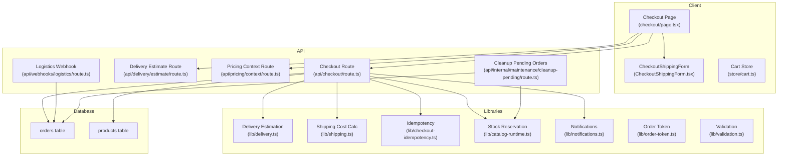

**Diagram sources**
- [checkout/page.tsx:1-595](file://src/app/checkout/page.tsx#L1-L595)
- [CheckoutShippingForm.tsx:1-174](file://src/components/checkout/CheckoutShippingForm.tsx#L1-L174)
- [delivery/estimate/route.ts:1-130](file://src/app/api/delivery/estimate/route.ts#L1-L130)
- [checkout/route.ts:1-872](file://src/app/api/checkout/route.ts#L1-L872)
- [pricing/context/route.ts:1-13](file://src/app/api/pricing/context/route.ts#L1-L13)
- [webhooks/logistics/route.ts:1-19](file://src/app/api/webhooks/logistics/route.ts#L1-L19)
- [maintenance/cleanup-pending/route.ts:1-229](file://src/app/api/internal/maintenance/cleanup-pending/route.ts#L1-L229)
- [delivery.ts:1-488](file://src/lib/delivery.ts#L1-L488)
- [shipping.ts:1-73](file://src/lib/shipping.ts#L1-L73)
- [checkout-idempotency.ts:1-33](file://src/lib/checkout-idempotency.ts#L1-L33)
- [catalog-runtime.ts:1-1305](file://src/lib/catalog-runtime.ts#L1-L1305)
- [notifications.ts:1-408](file://src/lib/notifications.ts#L1-L408)
- [order-token.ts:1-65](file://src/lib/order-token.ts#L1-L65)
- [validation.ts:1-112](file://src/lib/validation.ts#L1-L112)
- [cart.ts:1-149](file://src/store/cart.ts#L1-L149)

**Section sources**
- [checkout/page.tsx:1-595](file://src/app/checkout/page.tsx#L1-L595)
- [delivery/estimate/route.ts:1-130](file://src/app/api/delivery/estimate/route.ts#L1-L130)
- [checkout/route.ts:1-872](file://src/app/api/checkout/route.ts#L1-L872)

## Core Components
- Checkout API endpoint validates inputs, resolves product snapshots, calculates prices, reserves stock, computes shipping costs, estimates delivery, persists the order, and triggers notifications.
- Delivery estimation API computes delivery windows based on department/city/carrier preferences and applies operational offsets and cutoff rules.
- Shipping cost calculator determines national shipping fees depending on whether items qualify for free shipping.
- Idempotency utilities prevent duplicate orders using normalized keys and payment identifiers.
- Stock reservation library coordinates database-level stock mutations and rollbacks.
- Notifications module sends order status emails and parses notes for tracking references.
- Order token utilities create and verify secure lookup tokens for order pages.
- Client-side checkout page manages form state, validation, delivery estimates, and submission.

**Section sources**
- [checkout/route.ts:497-800](file://src/app/api/checkout/route.ts#L497-L800)
- [delivery/estimate/route.ts:44-129](file://src/app/api/delivery/estimate/route.ts#L44-L129)
- [shipping.ts:55-68](file://src/lib/shipping.ts#L55-L68)
- [checkout-idempotency.ts:5-32](file://src/lib/checkout-idempotency.ts#L5-L32)
- [catalog-runtime.ts:293-363](file://src/lib/catalog-runtime.ts#L293-L363)
- [notifications.ts:89-319](file://src/lib/notifications.ts#L89-L319)
- [order-token.ts:39-64](file://src/lib/order-token.ts#L39-L64)
- [checkout/page.tsx:227-353](file://src/app/checkout/page.tsx#L227-L353)

## Architecture Overview
The checkout flow integrates client-side UI, server-side validation and processing, and backend services for stock and notifications.

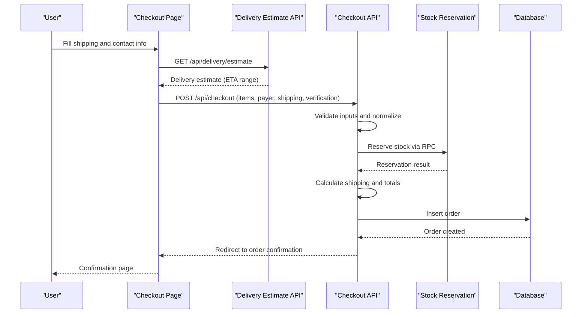

**Diagram sources**
- [checkout/page.tsx:122-353](file://src/app/checkout/page.tsx#L122-L353)
- [delivery/estimate/route.ts:44-129](file://src/app/api/delivery/estimate/route.ts#L44-L129)
- [checkout/route.ts:497-800](file://src/app/api/checkout/route.ts#L497-L800)
- [catalog-runtime.ts:293-363](file://src/lib/catalog-runtime.ts#L293-L363)

## Detailed Component Analysis

### Cash-on-Delivery Workflow
- Client collects items from the cart, contact info, shipping address, and verification flags.
- Client sends a POST request to the checkout endpoint with an idempotency key and CSRF token.
- Server validates the request, checks duplicates, loads product snapshots, reserves stock, computes totals, and inserts the order.
- On success, the server returns a redirect URL to the order confirmation page and clears the cart.

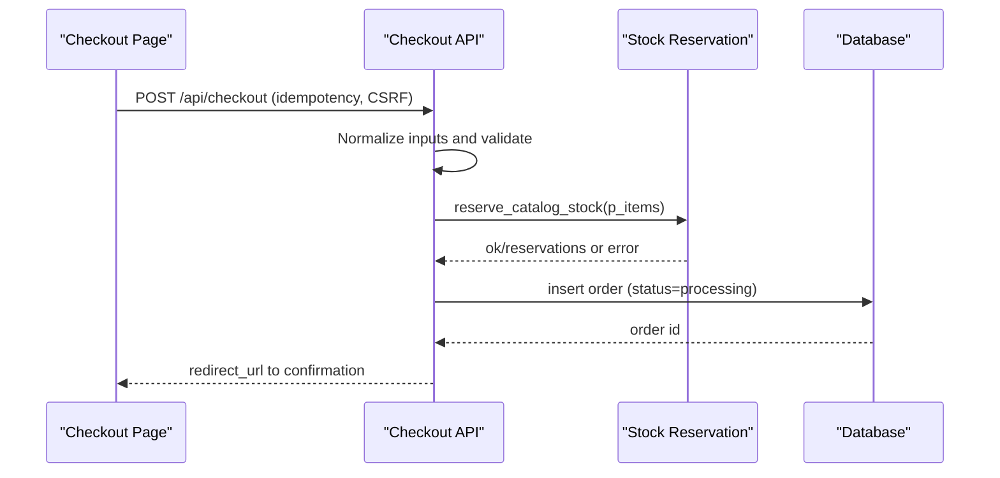

**Diagram sources**
- [checkout/page.tsx:227-353](file://src/app/checkout/page.tsx#L227-L353)
- [checkout/route.ts:497-800](file://src/app/api/checkout/route.ts#L497-L800)
- [catalog-runtime.ts:293-363](file://src/lib/catalog-runtime.ts#L293-L363)

**Section sources**
- [checkout/page.tsx:227-353](file://src/app/checkout/page.tsx#L227-L353)
- [checkout/route.ts:497-800](file://src/app/api/checkout/route.ts#L497-L800)

### Shipping Form Validation
- Client-side validation runs on blur and submit to enforce required fields and format rules.
- Server-side validation ensures minimum lengths, valid email, phone normalization, address length, city length, and known department.
- Verification flags (address_confirmed, availability_confirmed, product_acknowledged) must be true.

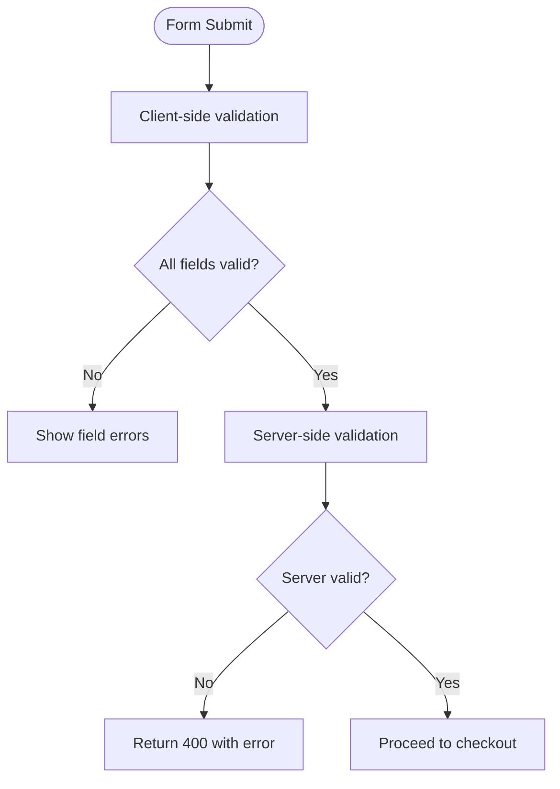

**Diagram sources**
- [validation.ts:92-110](file://src/lib/validation.ts#L92-L110)
- [checkout/route.ts:172-196](file://src/app/api/checkout/route.ts#L172-L196)

**Section sources**
- [validation.ts:1-112](file://src/lib/validation.ts#L1-L112)
- [checkout/route.ts:172-196](file://src/app/api/checkout/route.ts#L172-L196)

### Delivery Estimation Calculations
- The delivery estimate endpoint accepts department, city, region, and optional carrier preference.
- It resolves the department from multiple sources (query, region code, city, headers) and selects a carrier considering availability and remote zones.
- Business-day offsets, cutoff times, and confidence levels are applied to compute ETA ranges.

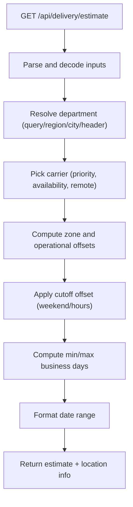

**Diagram sources**
- [delivery/estimate/route.ts:44-129](file://src/app/api/delivery/estimate/route.ts#L44-L129)
- [delivery.ts:438-487](file://src/lib/delivery.ts#L438-L487)

**Section sources**
- [delivery/estimate/route.ts:44-129](file://src/app/api/delivery/estimate/route.ts#L44-L129)
- [delivery.ts:438-487](file://src/lib/delivery.ts#L438-L487)

### Price Recalculation and Shipping Cost
- Shipping cost depends on whether all items are free shipping; otherwise a national fee applies or a custom base cost is used.
- Subtotal is computed from unit prices and quantities.
- Client and server both compute shipping cost; mismatches are logged for monitoring.

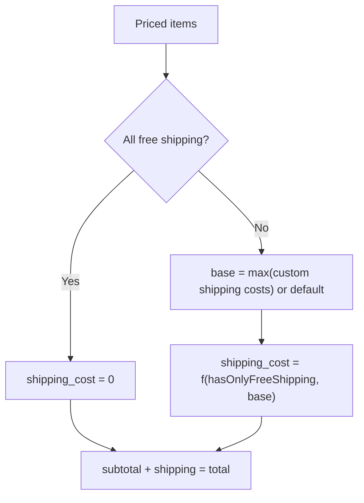

**Diagram sources**
- [shipping.ts:55-68](file://src/lib/shipping.ts#L55-L68)
- [checkout/route.ts:687-708](file://src/app/api/checkout/route.ts#L687-L708)

**Section sources**
- [shipping.ts:55-68](file://src/lib/shipping.ts#L55-L68)
- [checkout/route.ts:687-708](file://src/app/api/checkout/route.ts#L687-L708)

### Order Confirmation Flow
- On successful checkout, the client receives a redirect URL to the order confirmation page.
- The confirmation page polls order status, displays summary, and shows COD-specific steps.
- Email notifications are sent for order updates; tracking references are extracted from order notes.

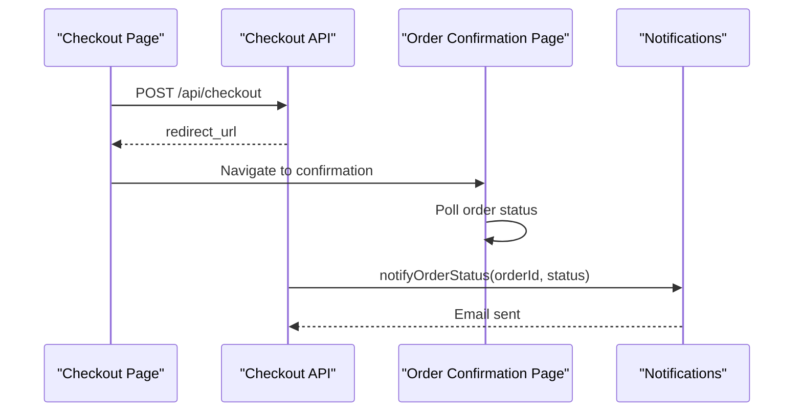

**Diagram sources**
- [checkout/page.tsx:328-353](file://src/app/checkout/page.tsx#L328-L353)
- [checkout/route.ts:759-795](file://src/app/api/checkout/route.ts#L759-L795)
- [order.tsx:65-191](file://src/app/orden/confirmacion/page.tsx#L65-L191)
- [notifications.ts:89-319](file://src/lib/notifications.ts#L89-L319)

**Section sources**
- [checkout/page.tsx:328-353](file://src/app/checkout/page.tsx#L328-L353)
- [order.tsx:65-191](file://src/app/orden/confirmacion/page.tsx#L65-L191)
- [notifications.ts:89-319](file://src/lib/notifications.ts#L89-L319)

### Idempotency Handling
- Client generates a UUID-based idempotency key; server normalizes it and derives a payment ID.
- Duplicate payment IDs are detected; if found, the server returns the existing order details without re-processing.

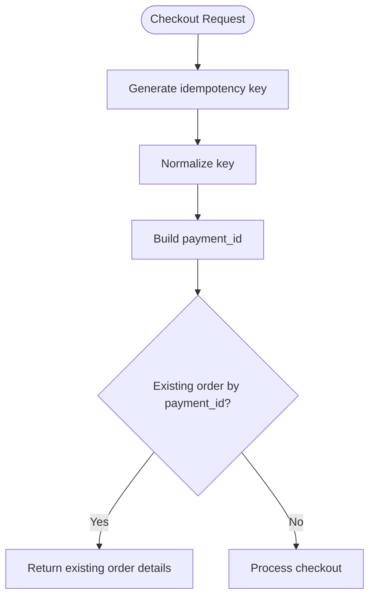

**Diagram sources**
- [checkout/page.tsx:250-255](file://src/app/checkout/page.tsx#L250-L255)
- [checkout-idempotency.ts:5-17](file://src/lib/checkout-idempotency.ts#L5-L17)
- [checkout/route.ts:643-661](file://src/app/api/checkout/route.ts#L643-L661)

**Section sources**
- [checkout-idempotency.ts:5-32](file://src/lib/checkout-idempotency.ts#L5-L32)
- [checkout/route.ts:643-661](file://src/app/api/checkout/route.ts#L643-L661)

### Stock Reservation During Checkout
- The checkout endpoint prepares stock reservation items and calls a stored procedure to reserve stock.
- If stock is insufficient, the request fails with a conflict; on order creation errors, reserved stock is restored.

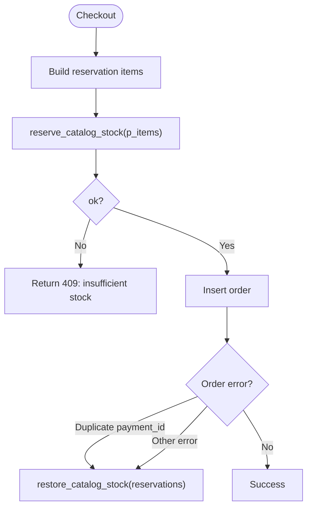

**Diagram sources**
- [checkout/route.ts:663-685](file://src/app/api/checkout/route.ts#L663-L685)
- [catalog-runtime.ts:293-363](file://src/lib/catalog-runtime.ts#L293-L363)

**Section sources**
- [checkout/route.ts:663-685](file://src/app/api/checkout/route.ts#L663-L685)
- [catalog-runtime.ts:293-363](file://src/lib/catalog-runtime.ts#L293-L363)

### Integration with External Services
- Delivery estimation relies on department/city/carrier logic and business-day arithmetic.
- Notifications integrate with an email transport for order status updates.
- Webhooks for logistics are disabled; fulfillment remains manual.
- Maintenance job cleans up stale pending orders and restores stock.

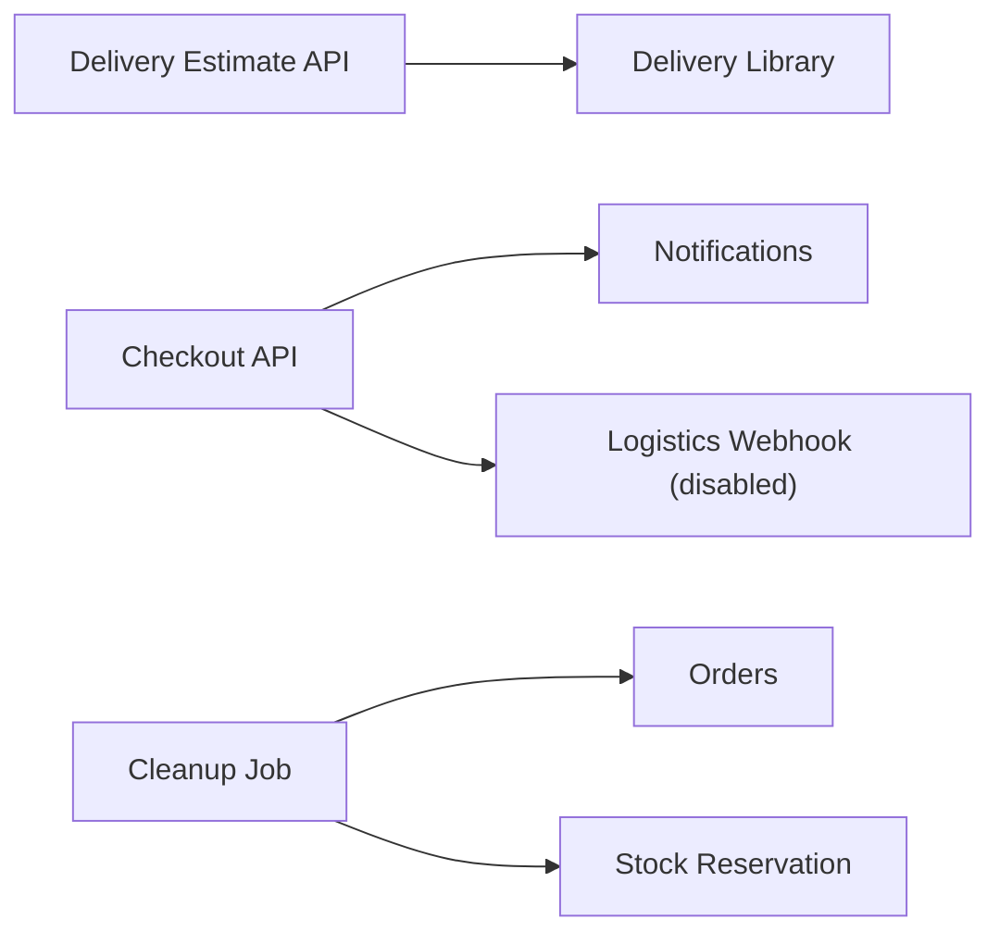

**Diagram sources**
- [delivery/estimate/route.ts:44-129](file://src/app/api/delivery/estimate/route.ts#L44-L129)
- [delivery.ts:438-487](file://src/lib/delivery.ts#L438-L487)
- [notifications.ts:89-319](file://src/lib/notifications.ts#L89-L319)
- [webhooks/logistics/route.ts:1-19](file://src/app/api/webhooks/logistics/route.ts#L1-L19)
- [maintenance/cleanup-pending/route.ts:98-220](file://src/app/api/internal/maintenance/cleanup-pending/route.ts#L98-L220)

**Section sources**
- [delivery.ts:438-487](file://src/lib/delivery.ts#L438-L487)
- [notifications.ts:89-319](file://src/lib/notifications.ts#L89-L319)
- [webhooks/logistics/route.ts:1-19](file://src/app/api/webhooks/logistics/route.ts#L1-L19)
- [maintenance/cleanup-pending/route.ts:98-220](file://src/app/api/internal/maintenance/cleanup-pending/route.ts#L98-L220)

### Checkout State Management and Form Handling
- Client state includes form data, field errors, touched fields, delivery estimate loading, and confirmation flags.
- Cart store provides item totals, counts, and shipping type detection.
- Pricing context route exposes currency and exchange rate metadata.

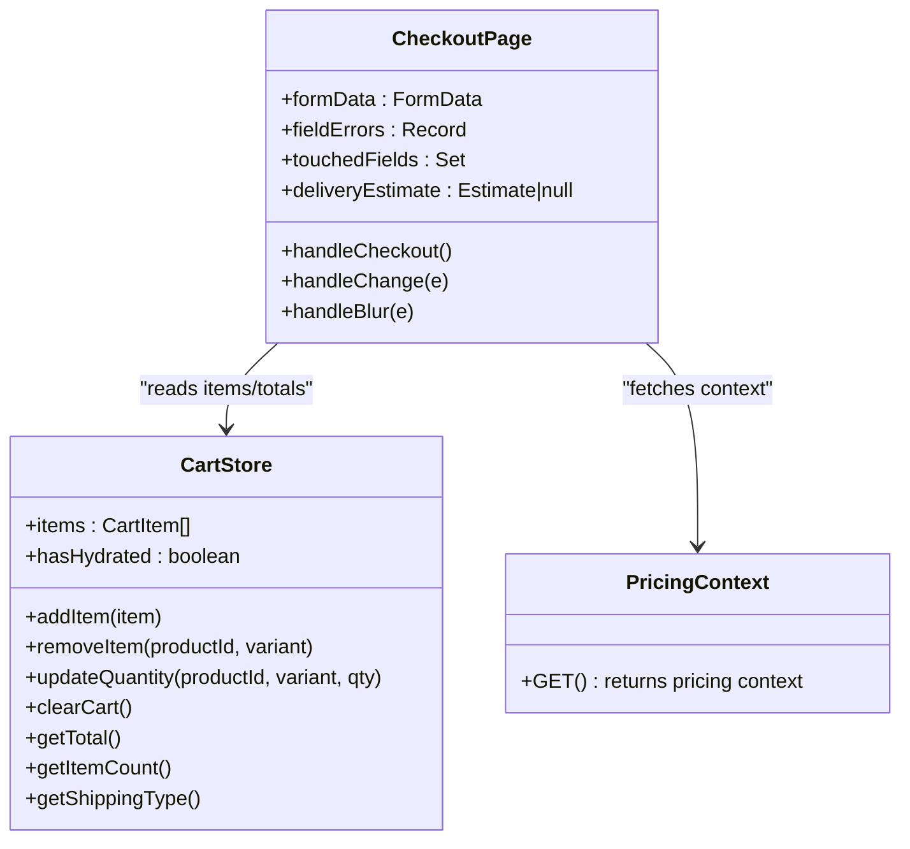

**Diagram sources**
- [cart.ts:39-124](file://src/store/cart.ts#L39-L124)
- [checkout/page.tsx:54-595](file://src/app/checkout/page.tsx#L54-L595)
- [pricing/context/route.ts:1-13](file://src/app/api/pricing/context/route.ts#L1-L13)

**Section sources**
- [cart.ts:39-124](file://src/store/cart.ts#L39-L124)
- [checkout/page.tsx:54-595](file://src/app/checkout/page.tsx#L54-L595)
- [pricing/context/route.ts:1-13](file://src/app/api/pricing/context/route.ts#L1-L13)

### Order Creation and Notes Schema
- The order insertion payload includes customer info, shipping details, totals, items, and a notes field containing fulfillment metadata.
- The notes field stores delivery estimates, verification flags, and email confirmation timestamps.

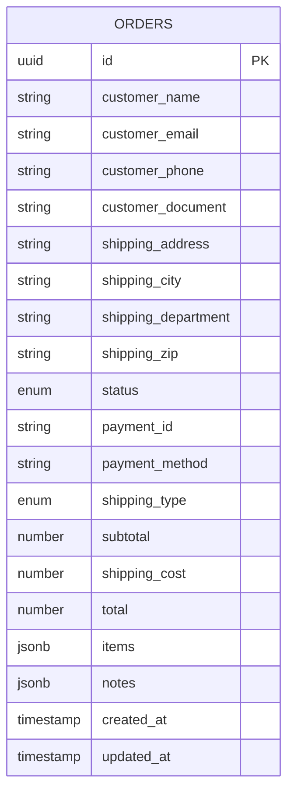

**Diagram sources**
- [database.ts:68-86](file://src/types/database.ts#L68-L86)
- [checkout/route.ts:720-757](file://src/app/api/checkout/route.ts#L720-L757)

**Section sources**
- [database.ts:68-86](file://src/types/database.ts#L68-L86)
- [checkout/route.ts:720-757](file://src/app/api/checkout/route.ts#L720-L757)

## Dependency Analysis
- Checkout API depends on validation, shipping, delivery estimation, idempotency, stock reservation, notifications, and database access.
- Client depends on cart store, validation, and pricing context.
- Delivery estimation depends on department/city/carrier availability and business-day logic.

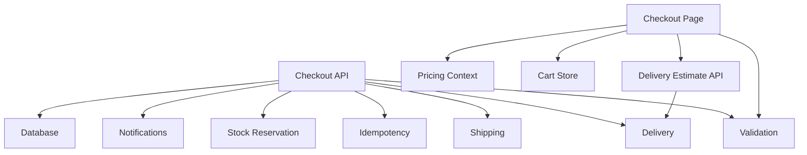

**Diagram sources**
- [checkout/route.ts:1-800](file://src/app/api/checkout/route.ts#L1-L800)
- [checkout/page.tsx:1-595](file://src/app/checkout/page.tsx#L1-L595)
- [delivery/estimate/route.ts:1-130](file://src/app/api/delivery/estimate/route.ts#L1-L130)
- [validation.ts:1-112](file://src/lib/validation.ts#L1-L112)
- [shipping.ts:1-73](file://src/lib/shipping.ts#L1-L73)
- [delivery.ts:1-488](file://src/lib/delivery.ts#L1-L488)
- [checkout-idempotency.ts:1-33](file://src/lib/checkout-idempotency.ts#L1-L33)
- [catalog-runtime.ts:1-1305](file://src/lib/catalog-runtime.ts#L1-L1305)
- [notifications.ts:1-408](file://src/lib/notifications.ts#L1-L408)

**Section sources**
- [checkout/route.ts:1-800](file://src/app/api/checkout/route.ts#L1-L800)
- [checkout/page.tsx:1-595](file://src/app/checkout/page.tsx#L1-L595)

## Performance Considerations
- Rate limits protect checkout against abuse; consider tuning thresholds for peak traffic.
- Delivery estimation caches results via client-side requests; avoid redundant calls by debouncing department changes.
- Stock reservation uses a single RPC call per order; batch operations are not supported.
- Email notifications are asynchronous; ensure SMTP configuration is optimized for throughput.

[No sources needed since this section provides general guidance]

## Troubleshooting Guide
Common issues and resolutions:
- Form validation errors: Ensure required fields meet length/format rules; client and server validations must pass.
- Delivery estimation accuracy: Confirm department/city resolution and carrier availability; verify cutoff and remote zone rules.
- Checkout abandonment: Implement sticky mobile bar, progress indicators, and persistent cart hydration.
- Duplicate orders: Verify idempotency key generation and payment ID uniqueness; check for replay responses.
- Stock conflicts: Insufficient stock returns a conflict; restore reserved stock and retry after inventory updates.
- Email failures: Validate SMTP credentials and network connectivity; inspect notification logs.
- Cleanup stale orders: Run maintenance job to cancel and restore stock for expired pending orders.

**Section sources**
- [checkout/route.ts:532-546](file://src/app/api/checkout/route.ts#L532-L546)
- [checkout/route.ts:633-641](file://src/app/api/checkout/route.ts#L633-L641)
- [checkout/route.ts:765-795](file://src/app/api/checkout/route.ts#L765-L795)
- [catalog-runtime.ts:340-363](file://src/lib/catalog-runtime.ts#L340-L363)
- [notifications.ts:383-406](file://src/lib/notifications.ts#L383-L406)
- [maintenance/cleanup-pending/route.ts:98-220](file://src/app/api/internal/maintenance/cleanup-pending/route.ts#L98-L220)

## Conclusion
The checkout process combines robust client-side validation, server-side idempotency, precise delivery estimation, and reliable stock reservation to support a smooth cash-on-delivery experience. Integrations with notifications and maintenance jobs ensure order reliability and operational hygiene. By following the patterns and safeguards documented here, teams can maintain a high-quality checkout flow while minimizing errors and abandonment.

[No sources needed since this section summarizes without analyzing specific files]

## Appendices

### Practical Scenarios and Edge Cases
- Scenario: Customer enters a partial address; server validation rejects it; client shows an error and prevents submission.
- Scenario: Remote department with cutoff applied; delivery estimate adjusts ETA accordingly.
- Scenario: Duplicate payment ID detected; server returns existing order details without re-creating.
- Scenario: Stock insufficient for an item; server responds with a conflict; client prompts the user to adjust quantities or remove items.
- Scenario: Maintenance job cancels stale pending orders and restores stock; customer can retry checkout.

**Section sources**
- [checkout/route.ts:596-621](file://src/app/api/checkout/route.ts#L596-L621)
- [delivery.ts:402-413](file://src/lib/delivery.ts#L402-L413)
- [checkout-idempotency.ts:23-32](file://src/lib/checkout-idempotency.ts#L23-L32)
- [catalog-runtime.ts:757-771](file://src/lib/catalog-runtime.ts#L757-L771)
- [maintenance/cleanup-pending/route.ts:178-209](file://src/app/api/internal/maintenance/cleanup-pending/route.ts#L178-L209)