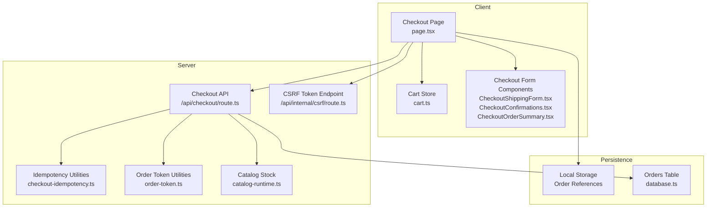
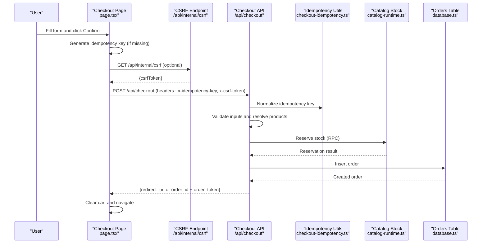
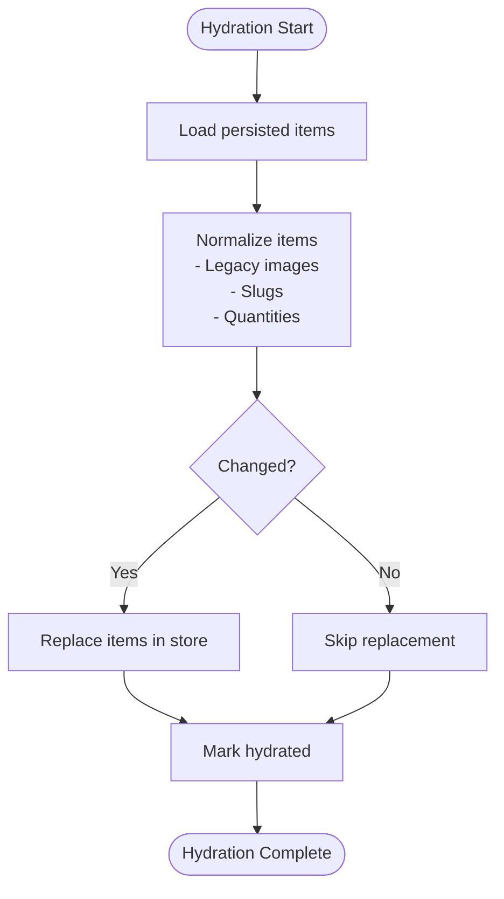
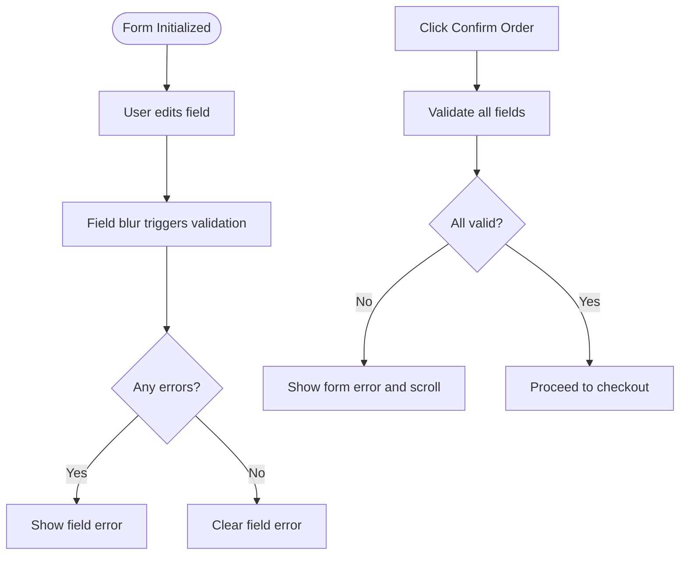
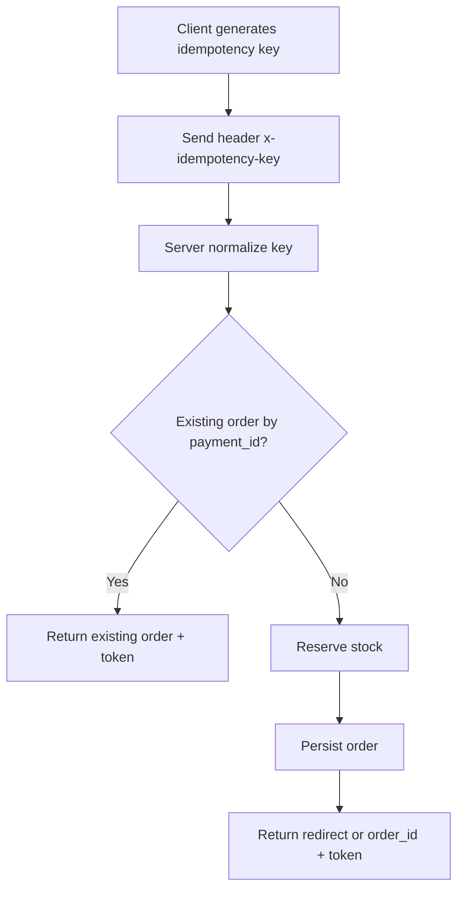
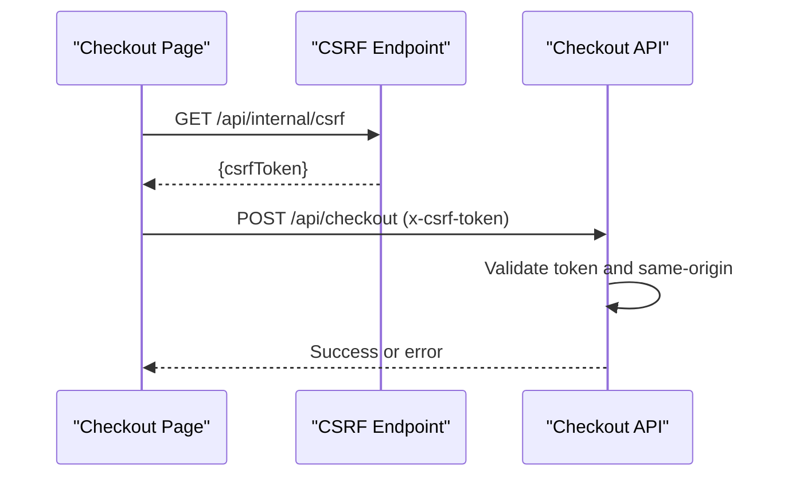
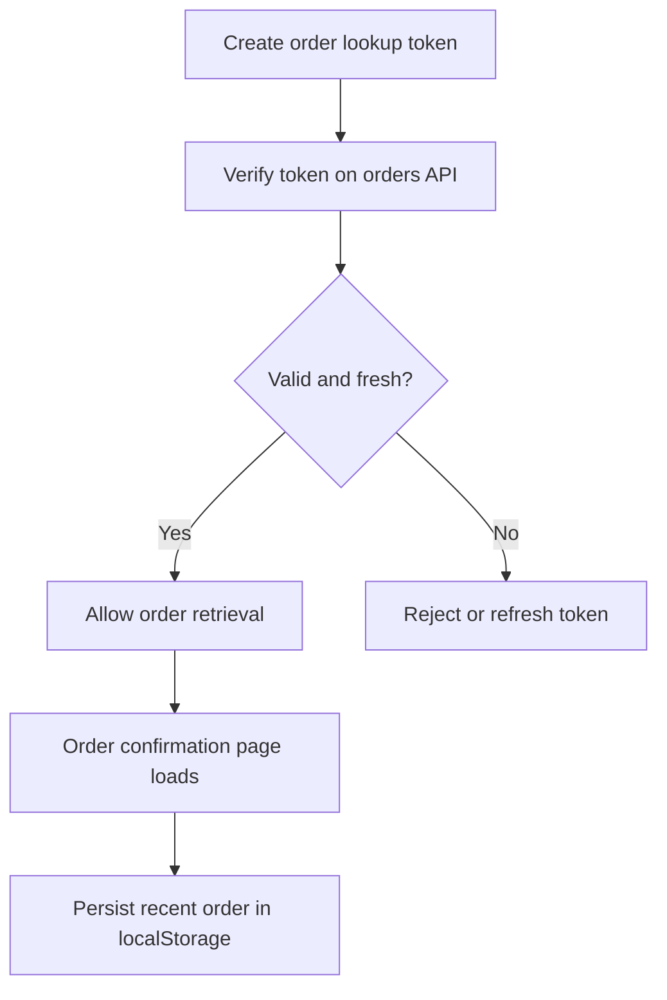
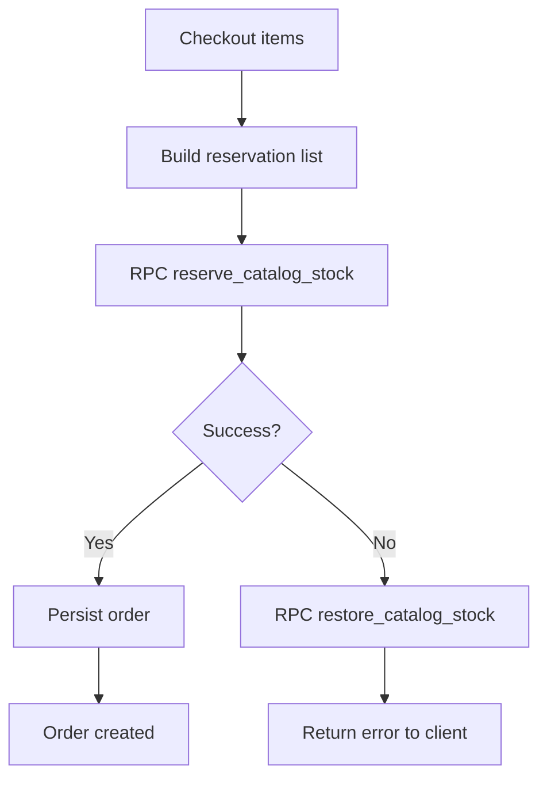
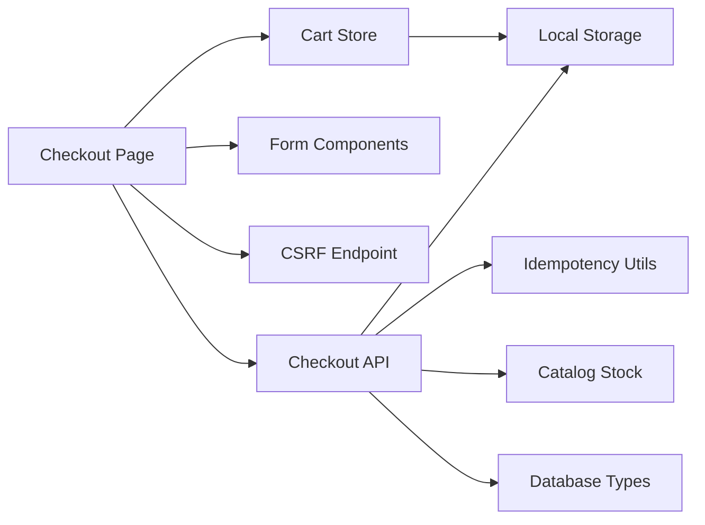

# Checkout State Management

<cite>
**Referenced Files in This Document**
- [cart.ts](file://src/store/cart.ts)
- [checkout/route.ts](file://src/app/api/checkout/route.ts)
- [checkout/page.tsx](file://src/app/checkout/page.tsx)
- [CheckoutShippingForm.tsx](file://src/components/checkout/CheckoutShippingForm.tsx)
- [CheckoutConfirmations.tsx](file://src/components/checkout/CheckoutConfirmations.tsx)
- [CheckoutOrderSummary.tsx](file://src/components/checkout/CheckoutOrderSummary.tsx)
- [csrf/route.ts](file://src/app/api/internal/csrf/route.ts)
- [csrf.ts](file://src/lib/csrf.ts)
- [checkout-idempotency.ts](file://src/lib/checkout-idempotency.ts)
- [order-token.ts](file://src/lib/order-token.ts)
- [catalog-runtime.ts](file://src/lib/catalog-runtime.ts)
- [database.ts](file://src/types/database.ts)
- [validation.ts](file://src/lib/validation.ts)
- [cleanup-pending/route.ts](file://src/app/api/internal/maintenance/cleanup-pending/route.ts)
- [order-confirmation/page.tsx](file://src/app/orden/confirmacion/page.tsx)
</cite>

## Table of Contents
1. [Introduction](#introduction)
2. [Project Structure](#project-structure)
3. [Core Components](#core-components)
4. [Architecture Overview](#architecture-overview)
5. [Detailed Component Analysis](#detailed-component-analysis)
6. [Dependency Analysis](#dependency-analysis)
7. [Performance Considerations](#performance-considerations)
8. [Troubleshooting Guide](#troubleshooting-guide)
9. [Conclusion](#conclusion)

## Introduction
This document explains the checkout state management and persistence in the ecommerce application. It covers how cart state integrates with the checkout flow, including state hydration, cart item preservation, and state cleanup. It also documents idempotency key generation and management to prevent duplicate orders, CSRF token handling, and session management. The guide details checkout progress tracking, form state persistence, error recovery mechanisms, state synchronization, memory management, and performance optimization. Examples of state transitions, error scenarios, and debugging checkout state issues are included.

## Project Structure
The checkout system spans client-side React components, server-side API routes, and shared libraries for security and state management. Key areas:
- Client-side checkout UI and state: cart store, checkout page, form components
- Server-side checkout pipeline: validation, product resolution, stock reservation, order creation
- Shared utilities: CSRF protection, idempotency keys, order tokens, catalog stock management
- Persistence and cleanup: local storage for order references, maintenance job for stale orders

**Diagram sources**
- [checkout/page.tsx:54-595](file://src/app/checkout/page.tsx#L54-L595)
- [cart.ts:1-149](file://src/store/cart.ts#L1-L149)
- [CheckoutShippingForm.tsx:1-174](file://src/components/checkout/CheckoutShippingForm.tsx#L1-L174)
- [CheckoutConfirmations.tsx:1-44](file://src/components/checkout/CheckoutConfirmations.tsx#L1-L44)
- [CheckoutOrderSummary.tsx:1-193](file://src/components/checkout/CheckoutOrderSummary.tsx#L1-L193)
- [csrf/route.ts:1-35](file://src/app/api/internal/csrf/route.ts#L1-L35)
- [checkout/route.ts:497-800](file://src/app/api/checkout/route.ts#L497-L800)
- [checkout-idempotency.ts:1-33](file://src/lib/checkout-idempotency.ts#L1-L33)
- [order-token.ts:1-65](file://src/lib/order-token.ts#L1-L65)
- [catalog-runtime.ts:293-363](file://src/lib/catalog-runtime.ts#L293-L363)
- [database.ts:68-86](file://src/types/database.ts#L68-L86)

**Section sources**
- [checkout/page.tsx:54-595](file://src/app/checkout/page.tsx#L54-L595)
- [cart.ts:1-149](file://src/store/cart.ts#L1-L149)

## Core Components
- Cart store (Zustand with persistence): manages cart items, hydration, normalization, and shipping type computation.
- Checkout page: orchestrates form state, validation, idempotency key generation, CSRF token retrieval, and submission to the checkout API.
- Checkout API: validates inputs, resolves products, reserves stock, creates orders, and handles idempotent replays.
- CSRF utilities: generate and validate CSRF tokens and enforce same-origin checks.
- Idempotency utilities: normalize and transform idempotency keys into payment identifiers and detect duplicate order errors.
- Order token utilities: create and verify short-lived tokens for order lookup.
- Catalog stock utilities: reserve and restore stock via RPC functions.
- Maintenance job: cancel stale pending orders and restore stock.

**Section sources**
- [cart.ts:39-147](file://src/store/cart.ts#L39-L147)
- [checkout/page.tsx:227-353](file://src/app/checkout/page.tsx#L227-L353)
- [checkout/route.ts:497-800](file://src/app/api/checkout/route.ts#L497-L800)
- [csrf.ts:1-119](file://src/lib/csrf.ts#L1-L119)
- [checkout-idempotency.ts:1-33](file://src/lib/checkout-idempotency.ts#L1-L33)
- [order-token.ts:1-65](file://src/lib/order-token.ts#L1-L65)
- [catalog-runtime.ts:293-363](file://src/lib/catalog-runtime.ts#L293-L363)
- [cleanup-pending/route.ts:98-220](file://src/app/api/internal/maintenance/cleanup-pending/route.ts#L98-L220)

## Architecture Overview
The checkout flow integrates client-side state with server-side validation and persistence. The client generates an idempotency key and optional CSRF token, submits a structured payload, and receives either a redirect to the confirmation page or an order identifier with a lookup token. The server validates inputs, resolves product snapshots, reserves stock, and persists the order. Idempotency prevents duplicate orders, while CSRF and same-origin checks protect against cross-origin abuse. Local storage stores recent order references for quick lookup.

**Diagram sources**
- [checkout/page.tsx:250-353](file://src/app/checkout/page.tsx#L250-L353)
- [csrf/route.ts:6-34](file://src/app/api/internal/csrf/route.ts#L6-L34)
- [checkout/route.ts:497-800](file://src/app/api/checkout/route.ts#L497-L800)
- [checkout-idempotency.ts:5-21](file://src/lib/checkout-idempotency.ts#L5-L21)
- [catalog-runtime.ts:293-363](file://src/lib/catalog-runtime.ts#L293-L363)
- [database.ts:68-86](file://src/types/database.ts#L68-L86)

## Detailed Component Analysis

### Cart State Management and Hydration
- Persistence: Zustand store persists to storage with a hydration hook that normalizes legacy images and slugs, updates quantities, and marks hydration completion.
- Normalization: Legacy image paths and slugs are normalized; quantities are capped and validated.
- Computed properties: Total amount, item count, and shipping type are derived from cart items.
- Cleanup: On successful checkout, the cart is cleared to avoid stale items.

**Diagram sources**
- [cart.ts:125-147](file://src/store/cart.ts#L125-L147)

**Section sources**
- [cart.ts:39-147](file://src/store/cart.ts#L39-L147)

### Checkout Form State and Validation
- Form state: Controlled inputs for contact info, shipping address, and confirmations.
- Validation: Field-level validators provide localized error messages; all fields are validated on submit.
- Progress tracking: Visual steps indicate shipping data and confirmation steps.
- Delivery estimate: Auto-detection and manual selection of department; displays delivery range and carriers.

**Diagram sources**
- [checkout/page.tsx:194-225](file://src/app/checkout/page.tsx#L194-L225)
- [validation.ts:92-112](file://src/lib/validation.ts#L92-L112)
- [CheckoutShippingForm.tsx:62-172](file://src/components/checkout/CheckoutShippingForm.tsx#L62-L172)
- [CheckoutConfirmations.tsx:14-44](file://src/components/checkout/CheckoutConfirmations.tsx#L14-L44)

**Section sources**
- [checkout/page.tsx:75-94](file://src/app/checkout/page.tsx#L75-L94)
- [validation.ts:1-112](file://src/lib/validation.ts#L1-L112)
- [CheckoutShippingForm.tsx:37-61](file://src/components/checkout/CheckoutShippingForm.tsx#L37-L61)
- [CheckoutConfirmations.tsx:5-25](file://src/components/checkout/CheckoutConfirmations.tsx#L5-L25)

### Idempotency Keys and Duplicate Prevention
- Generation: Client generates a UUID-like idempotency key if missing.
- Normalization: Server trims and sanitizes the key; minimum length enforced.
- Payment ID mapping: Converts normalized key into a payment identifier for database uniqueness.
- Duplicate detection: Detects PostgreSQL unique constraint violations for payment_id and replays existing order lookup.

**Diagram sources**
- [checkout/page.tsx:250-255](file://src/app/checkout/page.tsx#L250-L255)
- [checkout/route.ts:499-502](file://src/app/api/checkout/route.ts#L499-L502)
- [checkout-idempotency.ts:5-21](file://src/lib/checkout-idempotency.ts#L5-L21)
- [checkout/route.ts:643-661](file://src/app/api/checkout/route.ts#L643-L661)

**Section sources**
- [checkout-idempotency.ts:5-32](file://src/lib/checkout-idempotency.ts#L5-L32)
- [checkout/route.ts:499-502](file://src/app/api/checkout/route.ts#L499-L502)
- [checkout/route.ts:643-661](file://src/app/api/checkout/route.ts#L643-L661)

### CSRF Protection and Session Management
- Token generation: Server endpoint emits a signed CSRF token with expiration.
- Token validation: Headers are checked on checkout; timing-safe comparison prevents timing attacks.
- Same-origin enforcement: Validates Origin or Referer against host; strict in production.

**Diagram sources**
- [csrf/route.ts:6-34](file://src/app/api/internal/csrf/route.ts#L6-L34)
- [csrf.ts:40-84](file://src/lib/csrf.ts#L40-L84)
- [checkout/route.ts:523-530](file://src/app/api/checkout/route.ts#L523-L530)

**Section sources**
- [csrf.ts:13-119](file://src/lib/csrf.ts#L13-L119)
- [csrf/route.ts:6-34](file://src/app/api/internal/csrf/route.ts#L6-L34)
- [checkout/route.ts:515-530](file://src/app/api/checkout/route.ts#L515-L530)

### Order Lookup Tokens and Confirmation Flow
- Token creation: Short-lived token with expiration embedded and HMAC signature.
- Verification: Validates signature and expiration before allowing order retrieval.
- Confirmation page: Polls order status, clears cart, persists recent order references in local storage.

**Diagram sources**
- [order-token.ts:39-64](file://src/lib/order-token.ts#L39-L64)
- [order-confirmation/page.tsx:65-73](file://src/app/orden/confirmacion/page.tsx#L65-L73)
- [order-confirmation/page.tsx:109-154](file://src/app/orden/confirmacion/page.tsx#L109-L154)

**Section sources**
- [order-token.ts:1-65](file://src/lib/order-token.ts#L1-L65)
- [order-confirmation/page.tsx:65-154](file://src/app/orden/confirmacion/page.tsx#L65-L154)

### Stock Reservation and Recovery
- Reservation: Uses RPC to reserve stock for checkout items; aggregates quantities by slug and variant.
- Failure handling: On stock conflicts or DB errors, restores reserved stock and returns meaningful errors.
- Cleanup job: Periodically cancels stale pending orders and restores stock.

**Diagram sources**
- [checkout/route.ts:663-685](file://src/app/api/checkout/route.ts#L663-L685)
- [catalog-runtime.ts:293-363](file://src/lib/catalog-runtime.ts#L293-L363)
- [cleanup-pending/route.ts:178-209](file://src/app/api/internal/maintenance/cleanup-pending/route.ts#L178-L209)

**Section sources**
- [checkout/route.ts:663-685](file://src/app/api/checkout/route.ts#L663-L685)
- [catalog-runtime.ts:293-363](file://src/lib/catalog-runtime.ts#L293-L363)
- [cleanup-pending/route.ts:98-220](file://src/app/api/internal/maintenance/cleanup-pending/route.ts#L98-L220)

### State Synchronization and Memory Management
- Client-side: Zustand store with persistence avoids memory leaks by normalizing and replacing items during hydration.
- Server-side: Immediate cleanup after successful order creation; stock restoration on failures.
- Local storage: Limits stored recent orders and cleans up expired entries.

**Section sources**
- [cart.ts:125-147](file://src/store/cart.ts#L125-L147)
- [checkout/route.ts:767-795](file://src/app/api/checkout/route.ts#L767-L795)
- [order-confirmation/page.tsx:109-154](file://src/app/orden/confirmacion/page.tsx#L109-L154)

## Dependency Analysis
The checkout system exhibits clear separation of concerns:
- Client depends on cart store, form components, CSRF endpoint, and checkout API.
- Server depends on idempotency utilities, CSRF utilities, catalog stock utilities, and database types.
- Persistence relies on local storage and database tables.

**Diagram sources**
- [checkout/page.tsx:54-595](file://src/app/checkout/page.tsx#L54-L595)
- [cart.ts:1-149](file://src/store/cart.ts#L1-L149)
- [checkout/route.ts:497-800](file://src/app/api/checkout/route.ts#L497-L800)
- [checkout-idempotency.ts:1-33](file://src/lib/checkout-idempotency.ts#L1-L33)
- [catalog-runtime.ts:293-363](file://src/lib/catalog-runtime.ts#L293-L363)
- [database.ts:68-86](file://src/types/database.ts#L68-L86)

**Section sources**
- [checkout/page.tsx:54-595](file://src/app/checkout/page.tsx#L54-L595)
- [checkout/route.ts:497-800](file://src/app/api/checkout/route.ts#L497-L800)
- [database.ts:68-86](file://src/types/database.ts#L68-L86)

## Performance Considerations
- Client-side
  - Debounce heavy computations (e.g., shipping cost calculation) using memoization and controlled updates.
  - Limit re-renders by passing stable callbacks and avoiding unnecessary prop drilling.
- Server-side
  - Batch product queries and use concurrent resolution to minimize latency.
  - Use RPC functions for stock operations to reduce round trips.
  - Apply rate limits to prevent abuse and maintain throughput.
- Persistence
  - Persist only essential cart data; avoid storing large metadata.
  - Clean up stale local storage entries periodically.

## Troubleshooting Guide
Common issues and resolutions:
- Duplicate orders
  - Symptom: Unique constraint error on payment_id.
  - Resolution: Use idempotency keys; server replays existing order lookup.
  - Reference: [checkout-idempotency.ts:23-32](file://src/lib/checkout-idempotency.ts#L23-L32), [checkout/route.ts:766-787](file://src/app/api/checkout/route.ts#L766-L787)
- CSRF validation failure
  - Symptom: 403 Forbidden on checkout.
  - Resolution: Ensure CSRF token endpoint is reachable and headers are set; verify same-origin policy.
  - Reference: [csrf.ts:57-84](file://src/lib/csrf.ts#L57-L84), [checkout/route.ts:523-530](file://src/app/api/checkout/route.ts#L523-L530)
- Stale pending orders
  - Symptom: Orders remain pending after TTL.
  - Resolution: Run maintenance job to cancel and restore stock for stale orders.
  - Reference: [cleanup-pending/route.ts:98-220](file://src/app/api/internal/maintenance/cleanup-pending/route.ts#L98-L220)
- Stock reservation conflicts
  - Symptom: 409 Conflict indicating insufficient stock.
  - Resolution: Restore reserved stock and prompt user to adjust quantities or retry later.
  - Reference: [catalog-runtime.ts:340-363](file://src/lib/catalog-runtime.ts#L340-L363), [checkout/route.ts:674-683](file://src/app/api/checkout/route.ts#L674-L683)
- Cart hydration anomalies
  - Symptom: Cart items not displaying or quantities incorrect.
  - Resolution: Verify hydration hook runs and normalized items are replaced; check legacy image/path normalization.
  - Reference: [cart.ts:125-147](file://src/store/cart.ts#L125-L147)

**Section sources**
- [checkout-idempotency.ts:23-32](file://src/lib/checkout-idempotency.ts#L23-L32)
- [csrf.ts:57-84](file://src/lib/csrf.ts#L57-L84)
- [cleanup-pending/route.ts:98-220](file://src/app/api/internal/maintenance/cleanup-pending/route.ts#L98-L220)
- [catalog-runtime.ts:340-363](file://src/lib/catalog-runtime.ts#L340-L363)
- [cart.ts:125-147](file://src/store/cart.ts#L125-L147)

## Conclusion
The checkout state management system combines robust client-side cart persistence with secure, idempotent server-side order processing. Idempotency keys prevent duplicate orders, CSRF and same-origin checks protect against abuse, and catalog stock utilities ensure inventory integrity. The confirmation flow leverages order lookup tokens and local storage for reliable user experience. With proper error handling, maintenance jobs, and performance optimizations, the system provides a resilient and scalable checkout experience.