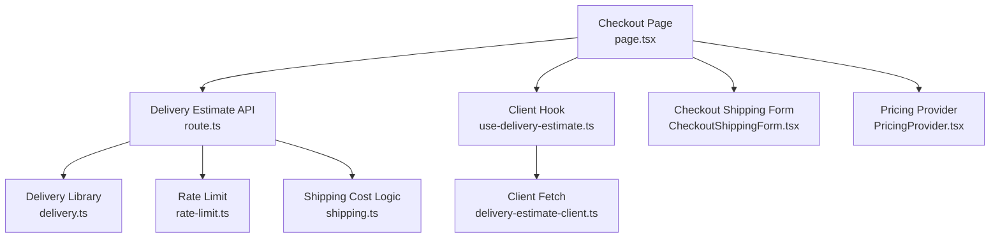
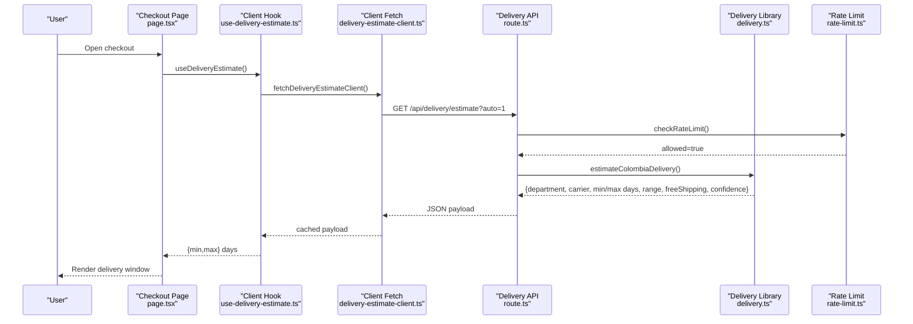
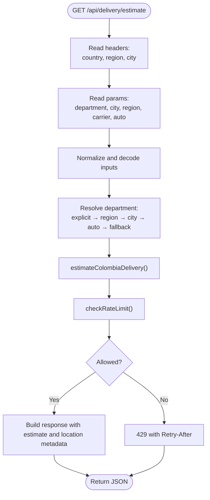
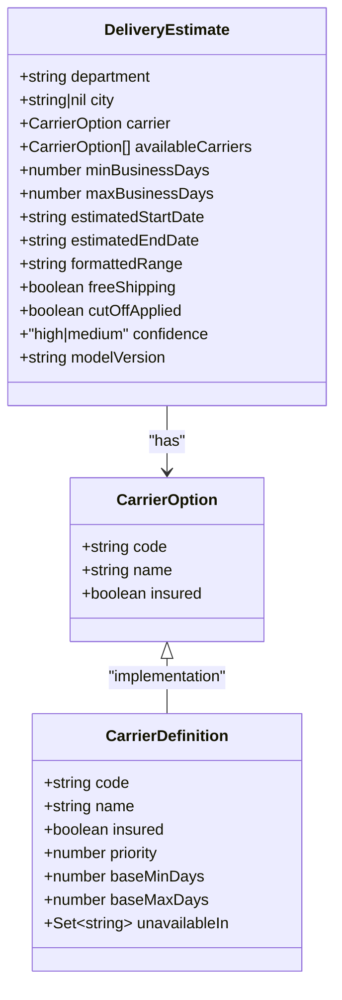
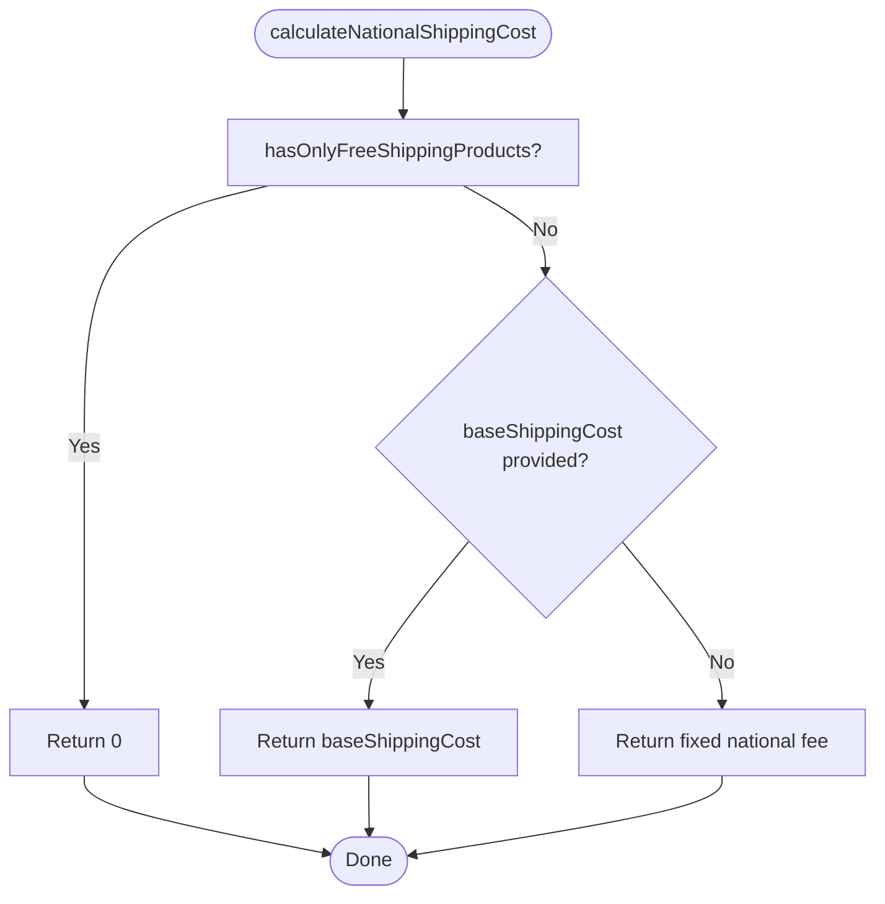
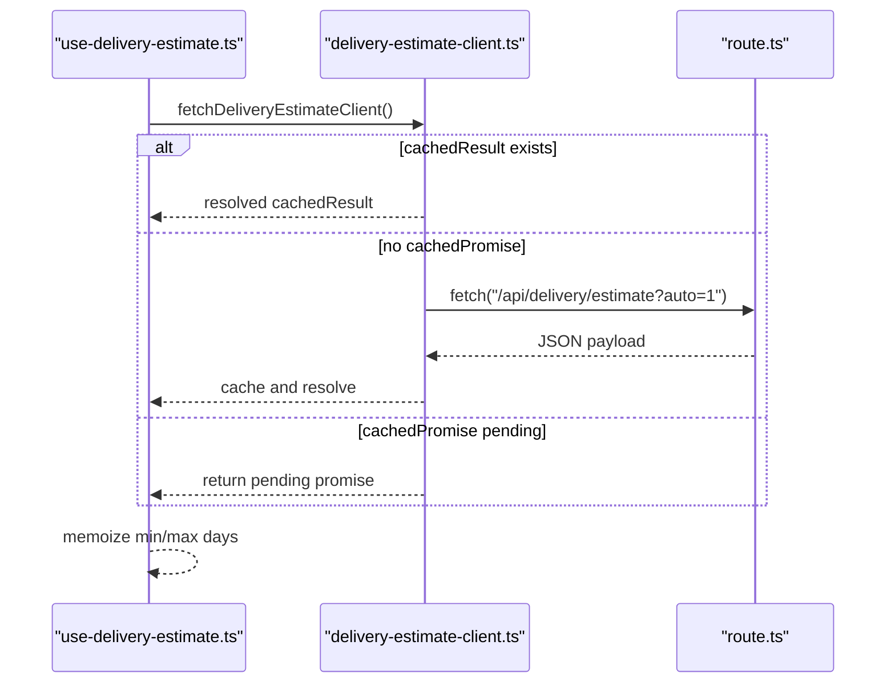
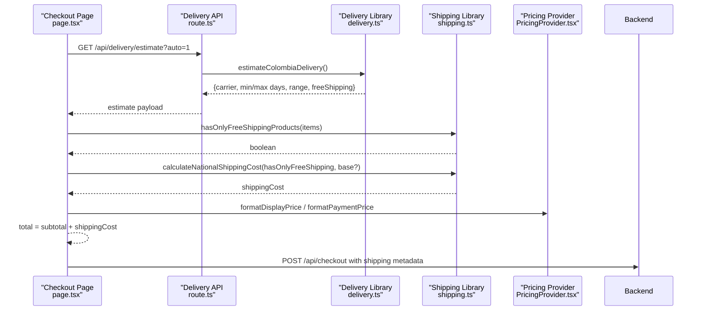
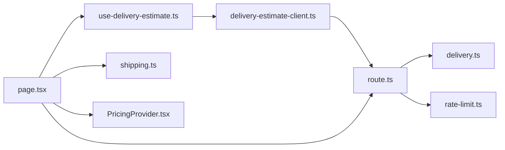

# Delivery Estimation System

<cite>
**Referenced Files in This Document**
- [route.ts](file://src/app/api/delivery/estimate/route.ts)
- [delivery.ts](file://src/lib/delivery.ts)
- [shipping.ts](file://src/lib/shipping.ts)
- [delivery-estimate-client.ts](file://src/lib/delivery-estimate-client.ts)
- [use-delivery-estimate.ts](file://src/lib/use-delivery-estimate.ts)
- [CheckoutShippingForm.tsx](file://src/components/checkout/CheckoutShippingForm.tsx)
- [page.tsx](file://src/app/checkout/page.tsx)
- [rate-limit.ts](file://src/lib/rate-limit.ts)
- [route.ts](file://src/app/api/pricing/context/route.ts)
- [PricingProvider.tsx](file://src/providers/PricingProvider.tsx)
</cite>

## Table of Contents
1. [Introduction](#introduction)
2. [Project Structure](#project-structure)
3. [Core Components](#core-components)
4. [Architecture Overview](#architecture-overview)
5. [Detailed Component Analysis](#detailed-component-analysis)
6. [Dependency Analysis](#dependency-analysis)
7. [Performance Considerations](#performance-considerations)
8. [Troubleshooting Guide](#troubleshooting-guide)
9. [Conclusion](#conclusion)
10. [Appendices](#appendices)

## Introduction
This document explains the delivery estimation system for national shipping within Colombia. It covers:
- National shipping cost calculation algorithm
- Automatic department detection from query parameters, headers, and fallback
- Carrier selection logic considering geography, availability, and insurance preferences
- ETA calculation using business days and cutoff handling
- Confidence scoring for estimate reliability
- Integration with external delivery services via API
- Free shipping logic and custom per-product shipping costs
- Shipping type handling and checkout pricing linkage
- Real-time updates and user experience considerations for displaying delivery information

## Project Structure
The delivery estimation system spans API routes, shared libraries, and UI components:
- API endpoint: resolves location, selects carrier, computes ETA and shipping cost, and returns structured estimates
- Shared library: encapsulates Colombian departments, zones, carriers, and estimation logic
- Client utilities: cache and memoize delivery estimates for client-side rendering
- UI components: present delivery windows and integrate with checkout
- Pricing provider: formats prices consistently across display and payment contexts

**Diagram sources**
- [route.ts:44-129](file://src/app/api/delivery/estimate/route.ts#L44-L129)
- [delivery.ts:438-487](file://src/lib/delivery.ts#L438-L487)
- [rate-limit.ts:43-88](file://src/lib/rate-limit.ts#L43-L88)
- [use-delivery-estimate.ts:14-49](file://src/lib/use-delivery-estimate.ts#L14-L49)
- [delivery-estimate-client.ts:19-40](file://src/lib/delivery-estimate-client.ts#L19-L40)
- [CheckoutShippingForm.tsx:53-172](file://src/components/checkout/CheckoutShippingForm.tsx#L53-L172)
- [page.tsx:54-353](file://src/app/checkout/page.tsx#L54-L353)
- [shipping.ts:62-68](file://src/lib/shipping.ts#L62-L68)
- [PricingProvider.tsx:33-58](file://src/providers/PricingProvider.tsx#L33-L58)

**Section sources**
- [route.ts:44-129](file://src/app/api/delivery/estimate/route.ts#L44-L129)
- [delivery.ts:438-487](file://src/lib/delivery.ts#L438-L487)
- [shipping.ts:62-68](file://src/lib/shipping.ts#L62-L68)
- [delivery-estimate-client.ts:19-40](file://src/lib/delivery-estimate-client.ts#L19-L40)
- [use-delivery-estimate.ts:14-49](file://src/lib/use-delivery-estimate.ts#L14-L49)
- [CheckoutShippingForm.tsx:53-172](file://src/components/checkout/CheckoutShippingForm.tsx#L53-L172)
- [page.tsx:54-353](file://src/app/checkout/page.tsx#L54-L353)
- [rate-limit.ts:43-88](file://src/lib/rate-limit.ts#L43-L88)
- [PricingProvider.tsx:33-58](file://src/providers/PricingProvider.tsx#L33-L58)

## Core Components
- Delivery Estimate API: Parses query/header inputs, selects department, picks carrier, computes ETA and shipping cost, and returns a standardized payload with metadata and confidence.
- Delivery Library: Implements department normalization, city-to-department resolution, department-to-region resolution, carrier availability and selection, zone offsets, cutoff handling, and ETA formatting.
- Shipping Cost Library: Computes national shipping cost based on free shipping flags and optional per-product overrides.
- Client Utilities: Provides caching and memoization for client-side delivery estimates and exposes a hook to consume them.
- UI Integration: Displays delivery windows and integrates with checkout to send ETA and carrier info to the backend.

**Section sources**
- [route.ts:44-129](file://src/app/api/delivery/estimate/route.ts#L44-L129)
- [delivery.ts:438-487](file://src/lib/delivery.ts#L438-L487)
- [shipping.ts:62-68](file://src/lib/shipping.ts#L62-L68)
- [delivery-estimate-client.ts:19-40](file://src/lib/delivery-estimate-client.ts#L19-L40)
- [use-delivery-estimate.ts:14-49](file://src/lib/use-delivery-estimate.ts#L14-L49)
- [CheckoutShippingForm.tsx:53-172](file://src/components/checkout/CheckoutShippingForm.tsx#L53-L172)
- [page.tsx:54-353](file://src/app/checkout/page.tsx#L54-L353)

## Architecture Overview
The system follows a layered architecture:
- Presentation layer: checkout page and shipping form render delivery estimates and collect user input
- API layer: delivery estimate endpoint validates inputs, applies rate limits, and delegates to the delivery library
- Domain layer: delivery library encapsulates business rules for department detection, carrier selection, ETA computation, and confidence scoring
- Persistence and caching: in-memory rate limiting and client-side caching improve performance and resilience

**Diagram sources**
- [page.tsx:122-192](file://src/app/checkout/page.tsx#L122-L192)
- [use-delivery-estimate.ts:14-49](file://src/lib/use-delivery-estimate.ts#L14-L49)
- [delivery-estimate-client.ts:19-40](file://src/lib/delivery-estimate-client.ts#L19-L40)
- [route.ts:44-129](file://src/app/api/delivery/estimate/route.ts#L44-L129)
- [delivery.ts:438-487](file://src/lib/delivery.ts#L438-L487)
- [rate-limit.ts:43-88](file://src/lib/rate-limit.ts#L43-L88)

## Detailed Component Analysis

### Delivery Estimate API
Responsibilities:
- Extract and normalize location inputs from query parameters and Vercel request headers
- Resolve department using precedence: explicit department, region code, city, auto-detected headers, fallback
- Compute delivery estimate using the delivery library
- Enforce rate limits and return structured response with metadata and calculated timestamp

Key behaviors:
- Location resolution precedence and canonicalization
- Carrier preference handling and fallback selection
- Business-day arithmetic for ETA computation
- Confidence scoring based on presence of city and metro/remote classification
- Rate limiting with retry-after guidance

**Diagram sources**
- [route.ts:44-129](file://src/app/api/delivery/estimate/route.ts#L44-L129)
- [rate-limit.ts:43-88](file://src/lib/rate-limit.ts#L43-L88)
- [delivery.ts:438-487](file://src/lib/delivery.ts#L438-L487)

**Section sources**
- [route.ts:44-129](file://src/app/api/delivery/estimate/route.ts#L44-L129)
- [rate-limit.ts:43-88](file://src/lib/rate-limit.ts#L43-L88)

### Delivery Library
Responsibilities:
- Define Colombian departments and canonical mappings
- Map region codes and cities to departments
- Classify zones (fast, remote, metro) and express hubs
- Define carriers with availability, priority, and base delivery windows
- Compute carrier selection considering availability, insurance needs, and geography
- Calculate business-day offsets for zones and operational adjustments
- Apply cutoff handling based on time/day and remote area rules
- Format ETA range and confidence scoring

Implementation highlights:
- Department normalization and canonical lookup
- City-to-department and region-to-department resolution
- Zone offset matrix and special-case cities
- Carrier operational offsets for remote areas
- Cutoff offset logic for weekends and afternoon cutoffs
- Confidence scoring based on city presence and metro classification

**Diagram sources**
- [delivery.ts:9-30](file://src/lib/delivery.ts#L9-L30)
- [delivery.ts:438-487](file://src/lib/delivery.ts#L438-L487)

**Section sources**
- [delivery.ts:32-135](file://src/lib/delivery.ts#L32-L135)
- [delivery.ts:137-208](file://src/lib/delivery.ts#L137-L208)
- [delivery.ts:210-242](file://src/lib/delivery.ts#L210-L242)
- [delivery.ts:286-311](file://src/lib/delivery.ts#L286-L311)
- [delivery.ts:352-388](file://src/lib/delivery.ts#L352-L388)
- [delivery.ts:390-413](file://src/lib/delivery.ts#L390-L413)
- [delivery.ts:415-419](file://src/lib/delivery.ts#L415-L419)
- [delivery.ts:438-487](file://src/lib/delivery.ts#L438-L487)

### Shipping Cost Library
Responsibilities:
- Determine if a product qualifies for free shipping via flags or environment-configured lists
- Decide whether the cart contains only free-shipping products
- Compute national shipping cost with optional per-item override

Key logic:
- Product-level free shipping flags take precedence
- Environment-controlled product ID/slug sets enable bulk free shipping
- National shipping cost defaults to a fixed COP amount unless overridden or fully free

**Diagram sources**
- [shipping.ts:55-68](file://src/lib/shipping.ts#L55-L68)

**Section sources**
- [shipping.ts:37-68](file://src/lib/shipping.ts#L37-L68)

### Client-Side Delivery Estimation
Responsibilities:
- Cache and memoize delivery estimates for performance
- Expose a React hook to fetch and expose min/max business days
- Integrate with checkout UI to show delivery windows

Behavior:
- First call fetches from the API with caching hints
- Subsequent calls return cached results
- On error, promise is cleared to allow retries

**Diagram sources**
- [use-delivery-estimate.ts:14-49](file://src/lib/use-delivery-estimate.ts#L14-L49)
- [delivery-estimate-client.ts:19-40](file://src/lib/delivery-estimate-client.ts#L19-L40)
- [route.ts:44-129](file://src/app/api/delivery/estimate/route.ts#L44-L129)

**Section sources**
- [delivery-estimate-client.ts:19-40](file://src/lib/delivery-estimate-client.ts#L19-L40)
- [use-delivery-estimate.ts:14-49](file://src/lib/use-delivery-estimate.ts#L14-L49)

### UI Integration and Checkout Pricing
Responsibilities:
- Detect department automatically and populate the form
- Load delivery estimates when department changes
- Display delivery windows and ETA range
- Send shipping metadata (carrier, ETA, cost) to the checkout API
- Compute shipping cost and total price using pricing provider

Checkout flow integration:
- Auto-department detection via API
- On department change, fetch estimate and update UI
- Pass carrier code/name, ETA min/max days, and formatted range to backend
- Compute shipping cost using shipping library and include in order payload

**Diagram sources**
- [page.tsx:122-192](file://src/app/checkout/page.tsx#L122-L192)
- [route.ts:44-129](file://src/app/api/delivery/estimate/route.ts#L44-L129)
- [delivery.ts:438-487](file://src/lib/delivery.ts#L438-L487)
- [shipping.ts:55-68](file://src/lib/shipping.ts#L55-L68)
- [PricingProvider.tsx:33-58](file://src/providers/PricingProvider.tsx#L33-L58)

**Section sources**
- [page.tsx:98-118](file://src/app/checkout/page.tsx#L98-L118)
- [page.tsx:122-192](file://src/app/checkout/page.tsx#L122-L192)
- [page.tsx:268-318](file://src/app/checkout/page.tsx#L268-L318)
- [CheckoutShippingForm.tsx:143-169](file://src/components/checkout/CheckoutShippingForm.tsx#L143-L169)
- [PricingProvider.tsx:33-58](file://src/providers/PricingProvider.tsx#L33-L58)

## Dependency Analysis
- API depends on:
  - Delivery library for estimation logic
  - Rate limit utility for throttling
  - Request headers for auto-location detection
- Client utilities depend on:
  - API endpoint for estimates
  - React lifecycle for caching/memoization
- Checkout page depends on:
  - Client utilities for estimates
  - Shipping library for cost computation
  - Pricing provider for consistent currency formatting
- Delivery library depends on:
  - Canonical department lists and mappings
  - Carrier definitions and availability sets
  - Geographic classifications (zones, metro, hubs)

**Diagram sources**
- [route.ts:44-129](file://src/app/api/delivery/estimate/route.ts#L44-L129)
- [delivery.ts:438-487](file://src/lib/delivery.ts#L438-L487)
- [rate-limit.ts:43-88](file://src/lib/rate-limit.ts#L43-L88)
- [use-delivery-estimate.ts:14-49](file://src/lib/use-delivery-estimate.ts#L14-L49)
- [delivery-estimate-client.ts:19-40](file://src/lib/delivery-estimate-client.ts#L19-L40)
- [page.tsx:54-353](file://src/app/checkout/page.tsx#L54-L353)
- [shipping.ts:62-68](file://src/lib/shipping.ts#L62-L68)
- [PricingProvider.tsx:33-58](file://src/providers/PricingProvider.tsx#L33-L58)

**Section sources**
- [route.ts:44-129](file://src/app/api/delivery/estimate/route.ts#L44-L129)
- [delivery.ts:438-487](file://src/lib/delivery.ts#L438-L487)
- [shipping.ts:62-68](file://src/lib/shipping.ts#L62-L68)
- [use-delivery-estimate.ts:14-49](file://src/lib/use-delivery-estimate.ts#L14-L49)
- [delivery-estimate-client.ts:19-40](file://src/lib/delivery-estimate-client.ts#L19-L40)
- [page.tsx:54-353](file://src/app/checkout/page.tsx#L54-L353)
- [PricingProvider.tsx:33-58](file://src/providers/PricingProvider.tsx#L33-L58)

## Performance Considerations
- Client-side caching: The client utility caches the first successful estimate and memoizes subsequent reads to reduce network requests.
- Revalidation strategy: The client fetch specifies a revalidation interval to refresh estimates periodically.
- Rate limiting: The API enforces a per-IP limit to prevent abuse and ensure fair usage.
- Business-day arithmetic: Efficient loops increment only business days, minimizing overhead.
- Memoization in UI: The hook avoids redundant computations and re-renders by caching the parsed estimate range.

Recommendations:
- Monitor rate-limit hits and adjust thresholds if needed.
- Consider warming caches during low-traffic periods.
- Validate that cutoff and zone logic align with actual carrier SLAs to avoid overpromising.

**Section sources**
- [delivery-estimate-client.ts:19-40](file://src/lib/delivery-estimate-client.ts#L19-L40)
- [rate-limit.ts:43-88](file://src/lib/rate-limit.ts#L43-L88)
- [delivery.ts:318-334](file://src/lib/delivery.ts#L318-L334)
- [use-delivery-estimate.ts:14-49](file://src/lib/use-delivery-estimate.ts#L14-L49)

## Troubleshooting Guide
Common issues and resolutions:
- Unavailable areas or unsupported departments:
  - The system falls back to a default department when auto-detection fails. Users can still select a department manually.
  - Carriers may be unavailable in certain departments; the system filters unavailable carriers and selects the next best option.
- Rate limit exceeded:
  - The API responds with a 429 status and includes a retry-after hint. Clients should honor the header and back off.
- No delivery estimate returned:
  - The checkout page displays a message indicating the estimate is unavailable when the API fails or returns incomplete data.
- Pricing inconsistencies:
  - Use the pricing provider to format amounts consistently for display and payment contexts.

Error handling references:
- API rate limit enforcement and response headers
- Client fetch error handling and promise clearing
- Checkout page fallback UI for unavailable estimates

**Section sources**
- [route.ts:51-56](file://src/app/api/delivery/estimate/route.ts#L51-L56)
- [delivery-estimate-client.ts:34-37](file://src/lib/delivery-estimate-client.ts#L34-L37)
- [page.tsx:176-184](file://src/app/checkout/page.tsx#L176-L184)
- [CheckoutShippingForm.tsx:166-168](file://src/components/checkout/CheckoutShippingForm.tsx#L166-L168)

## Conclusion
The delivery estimation system combines robust location detection, carrier selection, and ETA computation tailored to Colombia’s geography and logistics constraints. It integrates seamlessly with checkout pricing and UI, offering reliable, real-time delivery windows with appropriate fallbacks and performance optimizations. The modular design ensures maintainability and extensibility for future enhancements.

## Appendices

### API Definition: Delivery Estimate Endpoint
- Method: GET
- Path: /api/delivery/estimate
- Query parameters:
  - department: string (optional)
  - city: string (optional)
  - region: string (optional)
  - carrier: string (optional)
  - auto: "1" to enable header-based auto-detection
- Response fields:
  - estimate: DeliveryEstimate payload
  - location: Source and resolved location metadata
  - calculated_at: ISO timestamp

Example response structure:
- estimate: { department, city, carrier, availableCarriers, minBusinessDays, maxBusinessDays, estimatedStartDate, estimatedEndDate, formattedRange, freeShipping, cutOffApplied, confidence, modelVersion }
- location: { source, country_code, region_code, city, department, inferred_from_headers }
- calculated_at: string

**Section sources**
- [route.ts:58-128](file://src/app/api/delivery/estimate/route.ts#L58-L128)

### Carrier Selection Logic Summary
- Available carriers are filtered by department availability and sorted by priority
- Preferred carrier is chosen if available
- Otherwise, selection favors Veloces for fast zones and metro departments
- For remote departments, an insured carrier is preferred
- Final fallback selects the highest-priority available carrier

**Section sources**
- [delivery.ts:352-388](file://src/lib/delivery.ts#L352-L388)

### ETA Calculation Summary
- Base carrier windows plus zone offsets and operational adjustments
- Cutoff offset applied based on time-of-day and day-of-week
- Business-day arithmetic ensures accurate delivery dates
- Formatted range uses local date formatting

**Section sources**
- [delivery.ts:458-466](file://src/lib/delivery.ts#L458-L466)
- [delivery.ts:402-413](file://src/lib/delivery.ts#L402-L413)
- [delivery.ts:336-350](file://src/lib/delivery.ts#L336-L350)

### Free Shipping and Custom Costs
- Product-level flags and environment-controlled product lists determine free shipping eligibility
- Cart-level determination checks if all items are free shipping
- National shipping cost defaults to a fixed amount unless overridden by per-item maximum or fully free cart

**Section sources**
- [shipping.ts:37-68](file://src/lib/shipping.ts#L37-L68)

### Checkout Pricing Integration
- Pricing provider exposes consistent formatting for display and payment
- Checkout page computes totals using shipping cost and formats prices for user display

**Section sources**
- [PricingProvider.tsx:33-58](file://src/providers/PricingProvider.tsx#L33-L58)
- [page.tsx:98-118](file://src/app/checkout/page.tsx#L98-L118)