# Order Processing Workflow

<cite>
**Referenced Files in This Document**
- [route.ts](file://src/app/api/checkout/route.ts)
- [route.ts](file://src/app/api/orders/[paymentId]/route.ts)
- [order-token.ts](file://src/lib/order-token.ts)
- [checkout-idempotency.ts](file://src/lib/checkout-idempotency.ts)
- [notifications.ts](file://src/lib/notifications.ts)
- [route.ts](file://src/app/api/webhooks/logistics/route.ts)
- [route.ts](file://src/app/api/internal/maintenance/cleanup-pending/route.ts)
- [page.tsx](file://src/app/orden/confirmacion/page.tsx)
- [rate-limit.ts](file://src/lib/rate-limit.ts)
- [validation.ts](file://src/lib/validation.ts)
- [route.ts](file://src/app/admin/block-ip/route.ts)
- [vpn-detect.ts](file://src/lib/vpn-detect.ts)
- [ip-block.ts](file://src/lib/ip-block.ts)
</cite>

## Table of Contents
1. [Introduction](#introduction)
2. [Project Structure](#project-structure)
3. [Core Components](#core-components)
4. [Architecture Overview](#architecture-overview)
5. [Detailed Component Analysis](#detailed-component-analysis)
6. [Dependency Analysis](#dependency-analysis)
7. [Performance Considerations](#performance-considerations)
8. [Troubleshooting Guide](#troubleshooting-guide)
9. [Conclusion](#conclusion)
10. [Appendices](#appendices)

## Introduction
This document explains the end-to-end order processing workflow for cash-on-delivery (COD) purchases, from checkout completion to order confirmation. It covers the API request structure, data validation, order creation, payment method handling, order token generation, redirect behavior, order confirmation flow, email notifications, status initialization, error handling, retries, rollbacks, and security controls including rate limiting and fraud prevention.

## Project Structure
The order processing pipeline spans API routes, shared libraries, and the frontend confirmation page:
- API routes handle checkout, order retrieval, and administrative maintenance.
- Shared libraries implement idempotency, order tokens, rate limiting, validation, notifications, VPN detection, and IP blocking.
- The frontend confirmation page polls order status and displays order details.

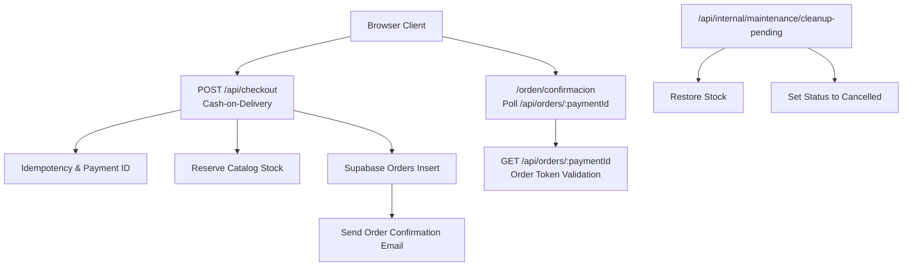

**Diagram sources**
- [route.ts:497-800](file://src/app/api/checkout/route.ts#L497-L800)
- [checkout-idempotency.ts:14-17](file://src/lib/checkout-idempotency.ts#L14-L17)
- [route.ts:39-100](file://src/app/api/orders/[paymentId]/route.ts#L39-L100)
- [route.ts:98-220](file://src/app/api/internal/maintenance/cleanup-pending/route.ts#L98-L220)

**Section sources**
- [route.ts:497-800](file://src/app/api/checkout/route.ts#L497-L800)
- [route.ts:39-100](file://src/app/api/orders/[paymentId]/route.ts#L39-L100)
- [order-token.ts:39-64](file://src/lib/order-token.ts#L39-L64)
- [checkout-idempotency.ts:14-17](file://src/lib/checkout-idempotency.ts#L14-L17)
- [notifications.ts:89-126](file://src/lib/notifications.ts#L89-L126)
- [page.tsx:65-73](file://src/app/orden/confirmacion/page.tsx#L65-L73)
- [route.ts:98-220](file://src/app/api/internal/maintenance/cleanup-pending/route.ts#L98-L220)

## Core Components
- Checkout API: Validates inputs, resolves product snapshots, reserves stock, calculates totals, creates orders, generates tokens, and redirects to confirmation.
- Order Lookup API: Returns sanitized order details with fulfillment summary and enforces token-based access.
- Order Token Library: Generates and validates short-lived HMAC signatures for secure order viewing.
- Idempotency Library: Derives stable payment identifiers from client-provided keys to prevent duplicate orders.
- Notifications Library: Sends HTML and plaintext emails with structured order details and status updates.
- Frontend Confirmation Page: Polls order status, persists recent orders, and renders order details and next steps.
- Maintenance Cleanup: Periodically restores stock and cancels stale pending orders.
- Rate Limiting, Validation, VPN Detection, IP Blocking: Security and anti-abuse controls applied during checkout.

**Section sources**
- [route.ts:172-196](file://src/app/api/checkout/route.ts#L172-L196)
- [route.ts:23-37](file://src/app/api/orders/[paymentId]/route.ts#L23-L37)
- [order-token.ts:39-64](file://src/lib/order-token.ts#L39-L64)
- [checkout-idempotency.ts:14-17](file://src/lib/checkout-idempotency.ts#L14-L17)
- [notifications.ts:89-126](file://src/lib/notifications.ts#L89-L126)
- [page.tsx:156-191](file://src/app/orden/confirmacion/page.tsx#L156-L191)
- [route.ts:98-220](file://src/app/api/internal/maintenance/cleanup-pending/route.ts#L98-L220)
- [rate-limit.ts:43-88](file://src/lib/rate-limit.ts#L43-L88)
- [validation.ts:14-42](file://src/lib/validation.ts#L14-L42)
- [vpn-detect.ts:89-100](file://src/lib/vpn-detect.ts#L89-L100)
- [ip-block.ts:25-72](file://src/lib/ip-block.ts#L25-L72)

## Architecture Overview
The checkout flow is designed for a manual fulfillment model with cash on delivery. The system enforces idempotency, validates inputs, reserves stock, writes an order record, and triggers an email confirmation. The frontend confirms order status via a signed token and safe order lookup endpoint.

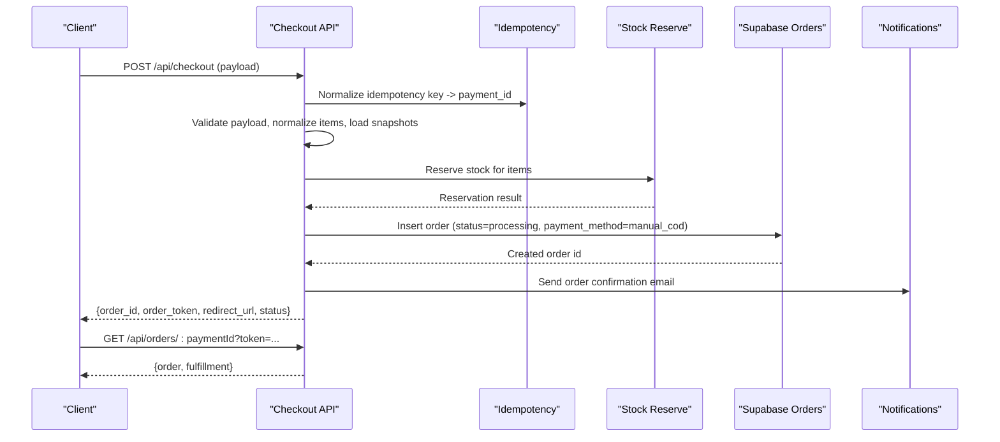

**Diagram sources**
- [route.ts:497-800](file://src/app/api/checkout/route.ts#L497-L800)
- [checkout-idempotency.ts:14-17](file://src/lib/checkout-idempotency.ts#L14-L17)
- [route.ts:39-100](file://src/app/api/orders/[paymentId]/route.ts#L39-L100)
- [notifications.ts:89-126](file://src/lib/notifications.ts#L89-L126)

## Detailed Component Analysis

### Checkout API: Cash-on-Delivery Order Creation
- Request structure: The API expects a JSON body containing items, payer info, shipping info, verification flags, and optional pricing metadata.
- Validation: Strict field validation ensures names, emails, phones, documents, addresses, cities, departments, and shipping type meet requirements. Verification flags must confirm address, availability, and product acknowledgment.
- Idempotency: An idempotency key is normalized and transformed into a stable payment identifier. Duplicate payment IDs are detected to avoid replay duplication.
- Stock reservation: Catalog stock is reserved for requested items. If insufficient stock exists, the request fails with a conflict status.
- Totals and shipping: Subtotal is computed from priced items. National shipping cost is calculated, considering free-shipping products and custom shipping costs. Delivery estimates are derived from the department.
- Order creation: The order is inserted with status initialized to processing, payment method set to manual COD, and notes populated with pricing, logistics, verification, and email confirmation metadata.
- Redirect and token: On success, an order lookup token is generated and a redirect URL to the confirmation page is returned. On duplicate payment ID, the existing order’s token and redirect are reused.

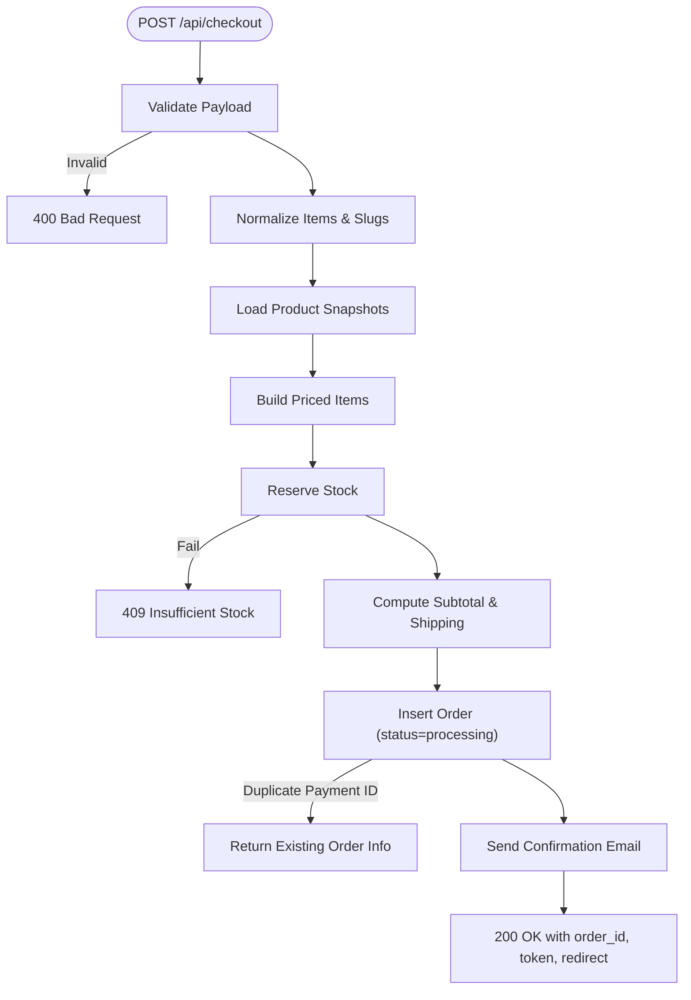

**Diagram sources**
- [route.ts:596-795](file://src/app/api/checkout/route.ts#L596-L795)
- [checkout-idempotency.ts:23-32](file://src/lib/checkout-idempotency.ts#L23-L32)

**Section sources**
- [route.ts:57-91](file://src/app/api/checkout/route.ts#L57-L91)
- [route.ts:172-196](file://src/app/api/checkout/route.ts#L172-L196)
- [route.ts:255-352](file://src/app/api/checkout/route.ts#L255-L352)
- [route.ts:354-408](file://src/app/api/checkout/route.ts#L354-L408)
- [route.ts:497-800](file://src/app/api/checkout/route.ts#L497-L800)
- [checkout-idempotency.ts:14-17](file://src/lib/checkout-idempotency.ts#L14-L17)

### Order Lookup API: Secure Order Visibility
- Access control: Requires a signed order lookup token when configured. Without the secret, production environments reject lookups.
- Response: Returns a safe subset of order fields (id, status, items, pricing, timestamps) suitable for display.
- Fulfillment summary: Builds a manual fulfillment summary indicating dispatch-like statuses.

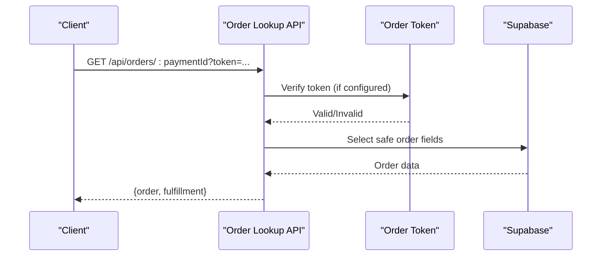

**Diagram sources**
- [route.ts:39-100](file://src/app/api/orders/[paymentId]/route.ts#L39-L100)
- [order-token.ts:50-64](file://src/lib/order-token.ts#L50-L64)

**Section sources**
- [route.ts:44-100](file://src/app/api/orders/[paymentId]/route.ts#L44-L100)
- [order-token.ts:35-64](file://src/lib/order-token.ts#L35-L64)

### Order Token Generation and Verification
- Token TTL: Configurable via environment variable with sensible bounds.
- Signature: HMAC-SHA256 over “orderId.exp” with a shared secret.
- Verification: Constant-time comparison and expiration checks.

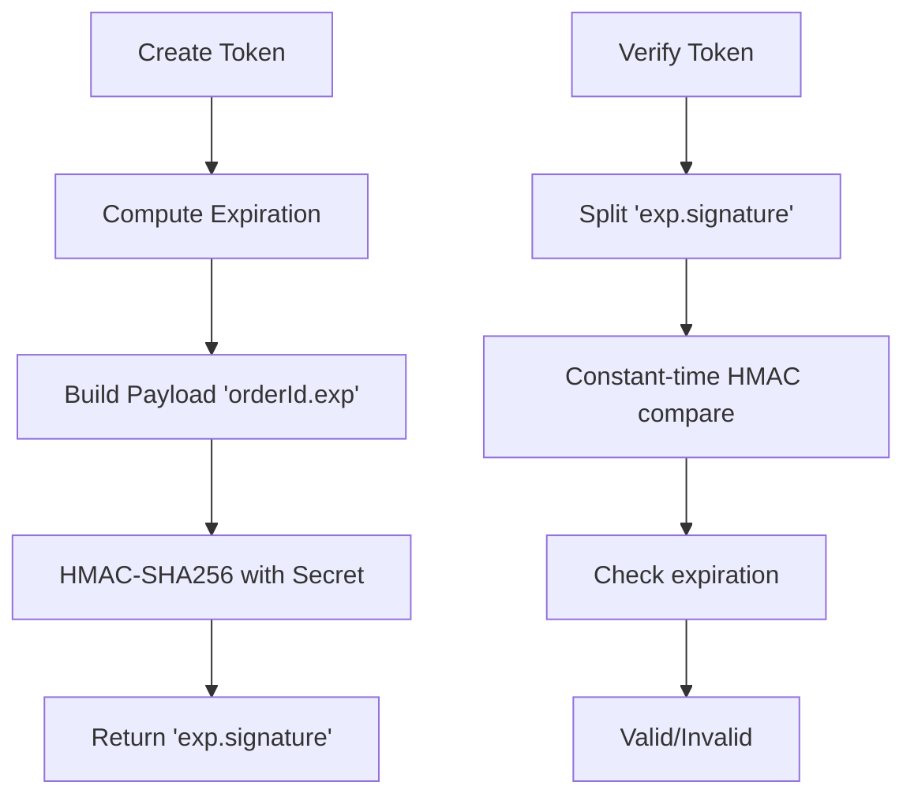

**Diagram sources**
- [order-token.ts:7-17](file://src/lib/order-token.ts#L7-L17)
- [order-token.ts:39-64](file://src/lib/order-token.ts#L39-L64)

**Section sources**
- [order-token.ts:39-64](file://src/lib/order-token.ts#L39-L64)

### Idempotency and Duplicate Prevention
- Idempotency key normalization: Trims and sanitizes client-provided keys.
- Payment ID derivation: Prefixes normalized keys to form stable payment identifiers.
- Duplicate detection: Checks for existing orders with the same payment ID and returns the existing order to avoid duplication.

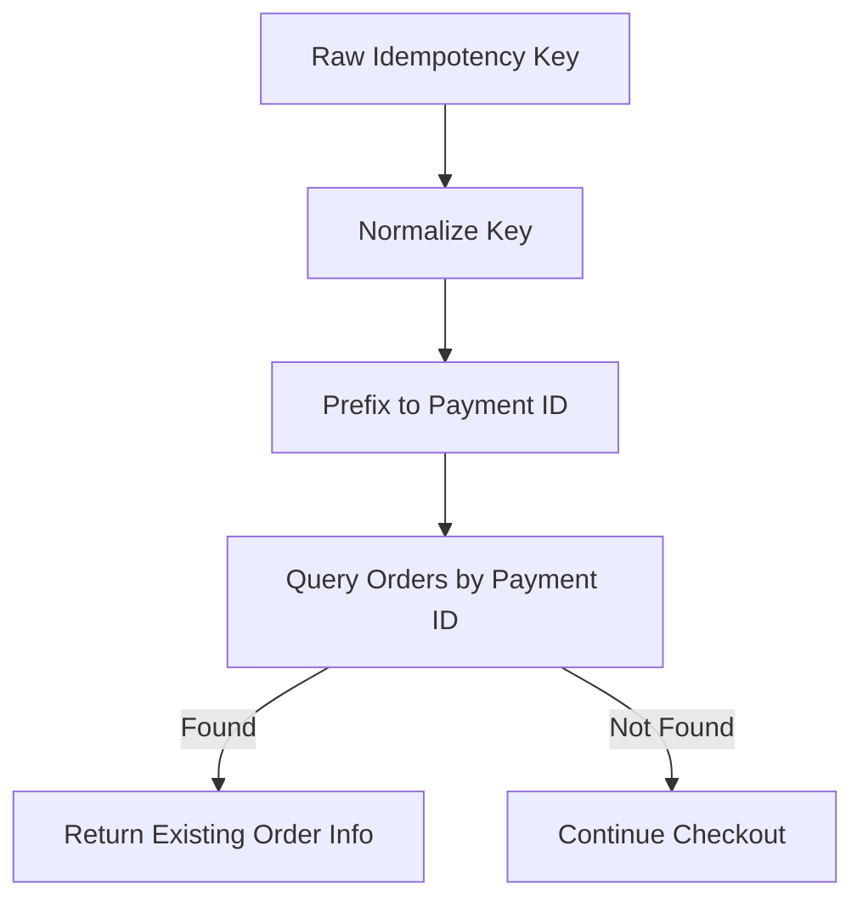

**Diagram sources**
- [checkout-idempotency.ts:5-12](file://src/lib/checkout-idempotency.ts#L5-L12)
- [checkout-idempotency.ts:14-17](file://src/lib/checkout-idempotency.ts#L14-L17)
- [route.ts:643-661](file://src/app/api/checkout/route.ts#L643-L661)

**Section sources**
- [checkout-idempotency.ts:14-32](file://src/lib/checkout-idempotency.ts#L14-L32)
- [route.ts:643-661](file://src/app/api/checkout/route.ts#L643-L661)

### Order Confirmation Flow and Redirect Handling
- Frontend polling: The confirmation page fetches order status periodically using the order token.
- Local storage: Stores recent orders for quick access.
- Redirect behavior: The checkout API returns a redirect URL to the confirmation page with the order token embedded in the query string.

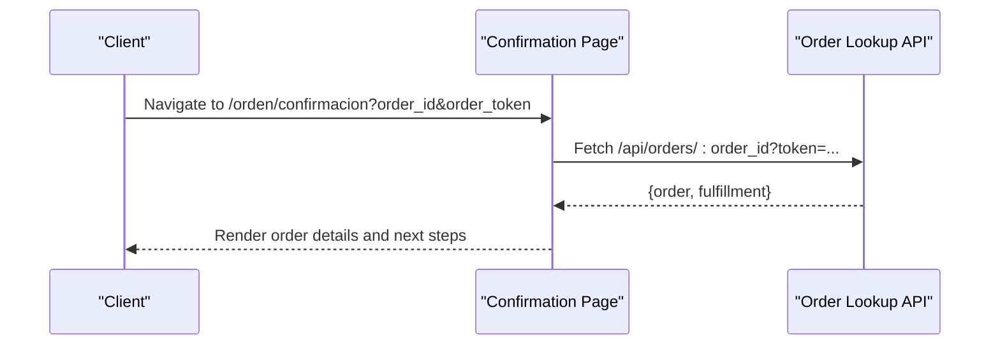

**Diagram sources**
- [page.tsx:65-73](file://src/app/orden/confirmacion/page.tsx#L65-L73)
- [route.ts:39-100](file://src/app/api/orders/[paymentId]/route.ts#L39-L100)

**Section sources**
- [page.tsx:75-191](file://src/app/orden/confirmacion/page.tsx#L75-L191)
- [route.ts:797-800](file://src/app/api/checkout/route.ts#L797-L800)

### Email Notification Triggers and Content
- Trigger: The system sends an order confirmation email upon successful order creation.
- Content: HTML and plaintext emails include status pill, items, totals, tracking reference (if present), and next-step messaging.
- Parsing: Extracts tracking codes, dispatch references, and manual review status from order notes.

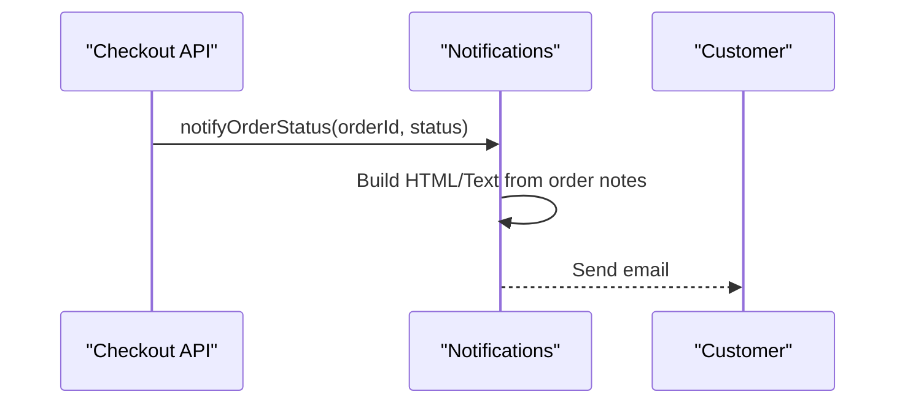

**Diagram sources**
- [notifications.ts:89-126](file://src/lib/notifications.ts#L89-L126)
- [route.ts:759-763](file://src/app/api/checkout/route.ts#L759-L763)

**Section sources**
- [notifications.ts:89-126](file://src/lib/notifications.ts#L89-L126)
- [route.ts:737-756](file://src/app/api/checkout/route.ts#L737-L756)

### Order Status Initialization and Manual Fulfillment
- Initial status: Orders are created with status processing.
- Fulfillment summary: The order lookup endpoint builds a manual fulfillment summary indicating dispatched-like statuses for processing, shipped, and delivered states.

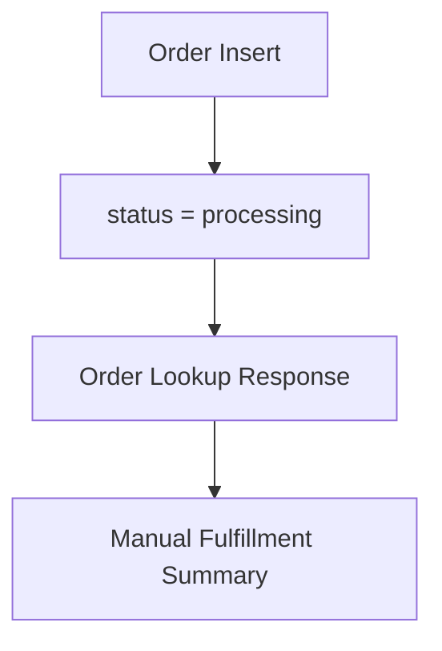

**Diagram sources**
- [route.ts:729-729](file://src/app/api/checkout/route.ts#L729-L729)
- [route.ts:23-37](file://src/app/api/orders/[paymentId]/route.ts#L23-L37)

**Section sources**
- [route.ts:729-729](file://src/app/api/checkout/route.ts#L729-L729)
- [route.ts:23-37](file://src/app/api/orders/[paymentId]/route.ts#L23-L37)

### Error Handling, Retry Mechanisms, and Rollback Scenarios
- Duplicate payment ID: On encountering a duplicate, the system restores reserved stock and returns the existing order’s token and redirect.
- Stock reservation failure: Returns a conflict response with a message prompting the user to refresh and retry.
- General order insert failures: Logs the error, restores stock, and returns a server error response.
- Maintenance cleanup: Periodically restores stock and cancels stale pending orders after a configurable TTL.

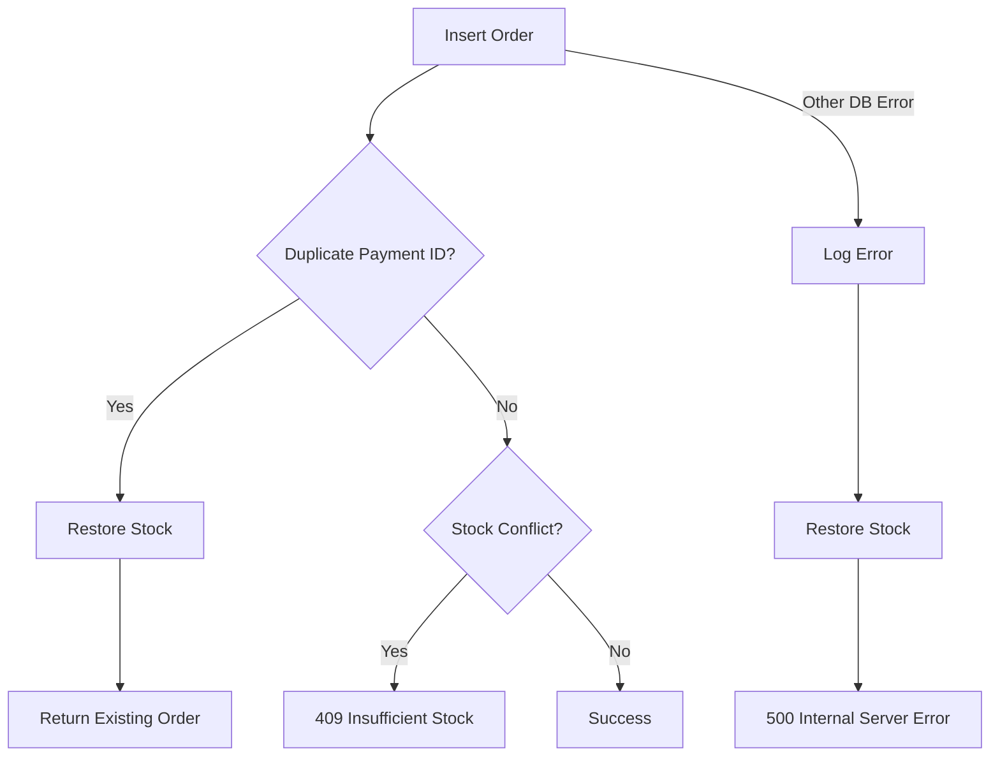

**Diagram sources**
- [route.ts:765-795](file://src/app/api/checkout/route.ts#L765-L795)
- [checkout-idempotency.ts:23-32](file://src/lib/checkout-idempotency.ts#L23-L32)
- [route.ts:178-209](file://src/app/api/internal/maintenance/cleanup-pending/route.ts#L178-L209)

**Section sources**
- [route.ts:765-795](file://src/app/api/checkout/route.ts#L765-L795)
- [route.ts:178-209](file://src/app/api/internal/maintenance/cleanup-pending/route.ts#L178-L209)

### Security Considerations, Rate Limiting, and Fraud Prevention
- CSRF protection: Validates CSRF tokens and enforces same-origin checks in production.
- Rate limiting: In-memory and DB-backed rate limiting for checkout and order lookup to mitigate abuse.
- VPN/Proxy detection: Heuristic checks and optional API-based verification to flag suspicious sessions.
- IP blocking: Supabase-backed IP blocklist with in-memory caching and enforcement across instances.
- Admin endpoints: Require bearer token authentication and rate limiting.

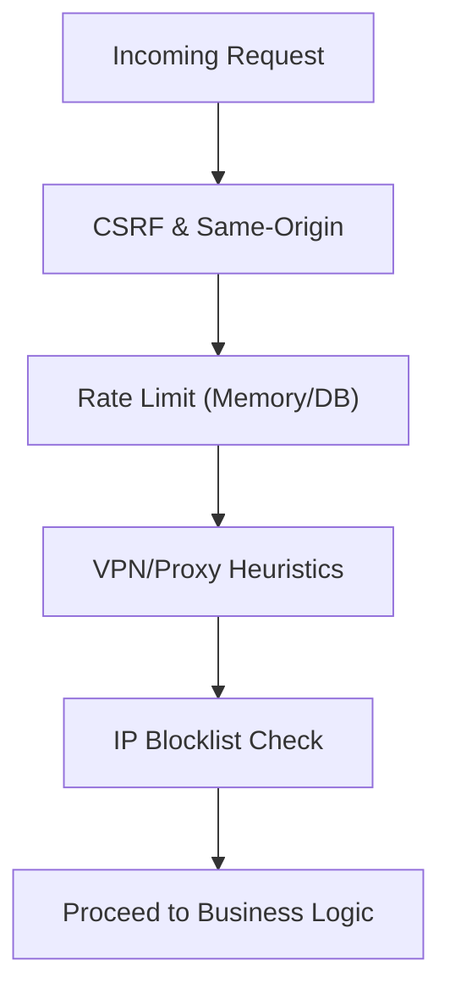

**Diagram sources**
- [route.ts:523-566](file://src/app/api/checkout/route.ts#L523-L566)
- [rate-limit.ts:101-164](file://src/lib/rate-limit.ts#L101-L164)
- [vpn-detect.ts:89-100](file://src/lib/vpn-detect.ts#L89-L100)
- [ip-block.ts:25-72](file://src/lib/ip-block.ts#L25-L72)
- [route.ts:24-41](file://src/app/admin/block-ip/route.ts#L24-L41)

**Section sources**
- [route.ts:523-566](file://src/app/api/checkout/route.ts#L523-L566)
- [rate-limit.ts:43-88](file://src/lib/rate-limit.ts#L43-L88)
- [rate-limit.ts:101-164](file://src/lib/rate-limit.ts#L101-L164)
- [vpn-detect.ts:89-100](file://src/lib/vpn-detect.ts#L89-L100)
- [ip-block.ts:25-72](file://src/lib/ip-block.ts#L25-L72)
- [route.ts:51-64](file://src/app/admin/block-ip/route.ts#L51-L64)

## Dependency Analysis
The checkout flow depends on several shared libraries and APIs:
- Checkout API depends on idempotency, order token, notifications, rate limiting, validation, VPN detection, IP blocking, and catalog stock reservation.
- Order Lookup API depends on order token verification and Supabase for safe field retrieval.
- Maintenance cleanup depends on catalog stock restoration and Supabase updates.

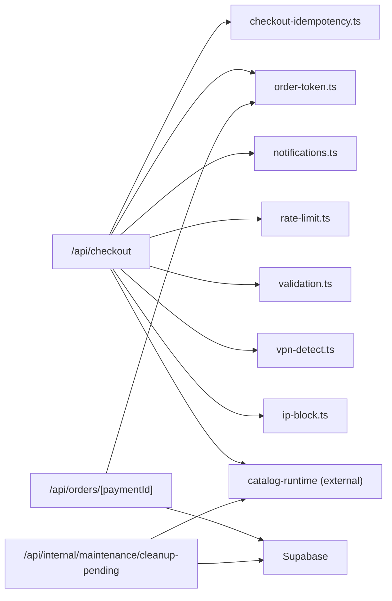

**Diagram sources**
- [route.ts:1-50](file://src/app/api/checkout/route.ts#L1-L50)
- [checkout-idempotency.ts:1-33](file://src/lib/checkout-idempotency.ts#L1-L33)
- [order-token.ts:1-65](file://src/lib/order-token.ts#L1-L65)
- [notifications.ts:1-42](file://src/lib/notifications.ts#L1-L42)
- [rate-limit.ts:1-165](file://src/lib/rate-limit.ts#L1-L165)
- [validation.ts:1-112](file://src/lib/validation.ts#L1-L112)
- [vpn-detect.ts:1-101](file://src/lib/vpn-detect.ts#L1-L101)
- [ip-block.ts:1-210](file://src/lib/ip-block.ts#L1-L210)
- [route.ts:1-100](file://src/app/api/orders/[paymentId]/route.ts#L1-L100)
- [route.ts:1-229](file://src/app/api/internal/maintenance/cleanup-pending/route.ts#L1-L229)

**Section sources**
- [route.ts:1-50](file://src/app/api/checkout/route.ts#L1-L50)
- [route.ts:1-100](file://src/app/api/orders/[paymentId]/route.ts#L1-L100)
- [route.ts:1-229](file://src/app/api/internal/maintenance/cleanup-pending/route.ts#L1-L229)

## Performance Considerations
- In-memory rate limiting provides low-latency enforcement but is per-instance in serverless environments; DB-backed checks augment accuracy for critical paths.
- Stock reservation and product snapshot loading use batched queries to minimize database round trips.
- Frontend polling intervals balance responsiveness with network efficiency.
- Email sending is asynchronous and guarded by environment configuration to avoid blocking.

## Troubleshooting Guide
Common failure modes and resolutions:
- Invalid checkout payload: Ensure all required fields are present and meet validation criteria. See field validators for expected formats.
- Duplicate payment ID: Occurs when the same idempotency key is used. The system returns the existing order’s token and redirect.
- Insufficient stock: Stock reservation fails if inventory is lower than requested. Ask the customer to reduce quantities or wait.
- Database connectivity issues: Order insert failures trigger a rollback of stock reservations and return a server error.
- Email not sent: Verify SMTP credentials are configured; otherwise, the system logs and surfaces an error.
- Order lookup unauthorized: Ensure the order token is present and valid for the requested order ID.
- Stale pending orders: Maintenance cleanup automatically restores stock and cancels orders older than the configured TTL.

**Section sources**
- [validation.ts:14-42](file://src/lib/validation.ts#L14-L42)
- [route.ts:596-621](file://src/app/api/checkout/route.ts#L596-L621)
- [route.ts:674-683](file://src/app/api/checkout/route.ts#L674-L683)
- [route.ts:765-795](file://src/app/api/checkout/route.ts#L765-L795)
- [notifications.ts:383-406](file://src/lib/notifications.ts#L383-L406)
- [route.ts:71-79](file://src/app/api/orders/[paymentId]/route.ts#L71-L79)
- [route.ts:122-149](file://src/app/api/internal/maintenance/cleanup-pending/route.ts#L122-L149)

## Conclusion
The order processing workflow for cash-on-delivery is robust, secure, and designed for manual fulfillment. It leverages idempotency, strict validation, stock reservations, and token-based order visibility to ensure correctness and usability. Built-in rate limiting, VPN detection, and IP blocking help mitigate abuse. The frontend confirmation page provides a responsive, user-friendly way to track order status and next steps.

## Appendices

### API Definitions and Examples

- POST /api/checkout
  - Request body fields: items[].id, items[].slug, items[].quantity, items[].variant, payer.name, payer.email, payer.phone, payer.document, shipping.address, shipping.reference, shipping.city, shipping.department, shipping.zip, shipping.type, shipping.cost, shipping.carrier_code, shipping.carrier_name, shipping.insured, shipping.eta_min_days, shipping.eta_max_days, shipping.eta_range, verification.address_confirmed, verification.availability_confirmed, verification.product_acknowledged, pricing.display_currency, pricing.display_locale, pricing.country_code, pricing.display_rate.
  - Successful response fields: order_id, order_token, status, fulfillment_triggered, redirect_url, idempotent_replay.
  - Example: [route.ts:596-795](file://src/app/api/checkout/route.ts#L596-L795)

- GET /api/orders/[paymentId]?token=...
  - Query parameters: token (required if ORDER_LOOKUP_SECRET configured).
  - Response fields: order (id, status, items, subtotal, shipping_cost, total, created_at, updated_at), fulfillment (has_dispatch_success, last_status, last_event_at, last_action, skipped_reason).
  - Example: [route.ts:39-100](file://src/app/api/orders/[paymentId]/route.ts#L39-L100)

- GET /api/internal/maintenance/cleanup-pending?secret=...&ttl_minutes=...&limit=...
  - Query parameters: secret, ttl_minutes, limit.
  - Response fields: ok, ttl_minutes, cutoff, found, cancelled, restored_stock_for, restore_errors.
  - Example: [route.ts:222-229](file://src/app/api/internal/maintenance/cleanup-pending/route.ts#L222-L229)

### Security and Compliance Notes
- CSRF protection and same-origin enforcement are mandatory in production.
- Order lookup requires a valid token when configured; otherwise, production rejects the request.
- VPN/Proxy detection is best-effort and should be combined with other controls.
- IP blocking is enforced via DB checks to ensure consistency across serverless instances.

**Section sources**
- [route.ts:515-530](file://src/app/api/checkout/route.ts#L515-L530)
- [route.ts:523-566](file://src/app/api/checkout/route.ts#L523-L566)
- [route.ts:71-79](file://src/app/api/orders/[paymentId]/route.ts#L71-L79)
- [vpn-detect.ts:89-100](file://src/lib/vpn-detect.ts#L89-L100)
- [ip-block.ts:25-72](file://src/lib/ip-block.ts#L25-L72)