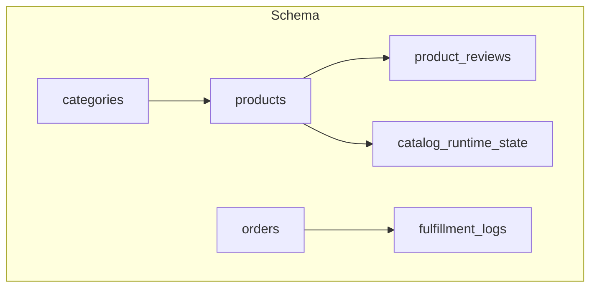
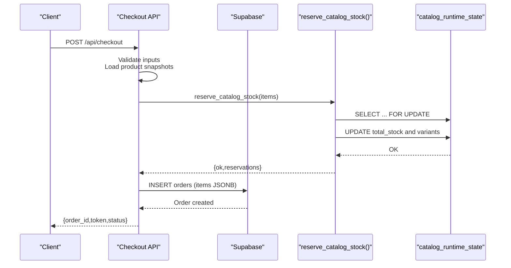
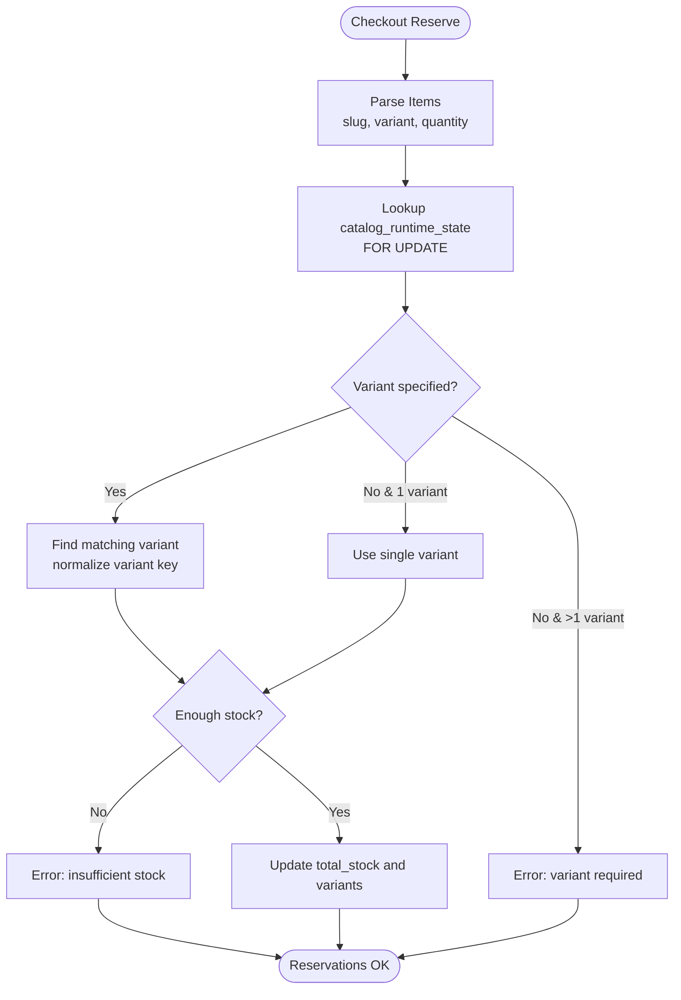
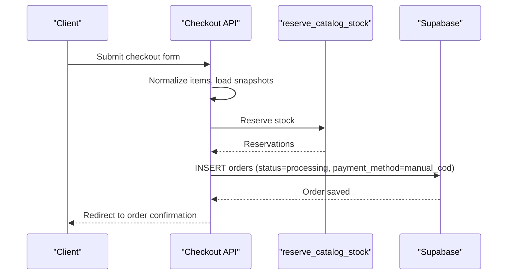
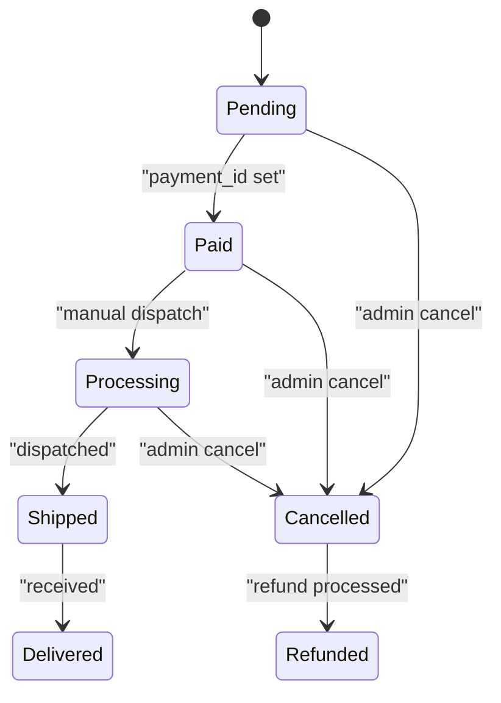
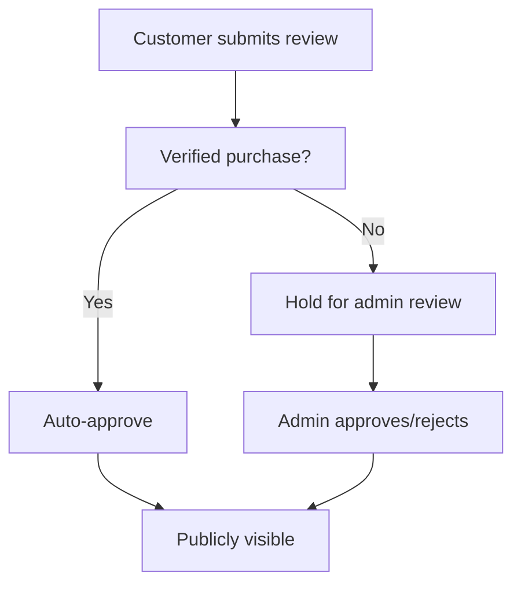
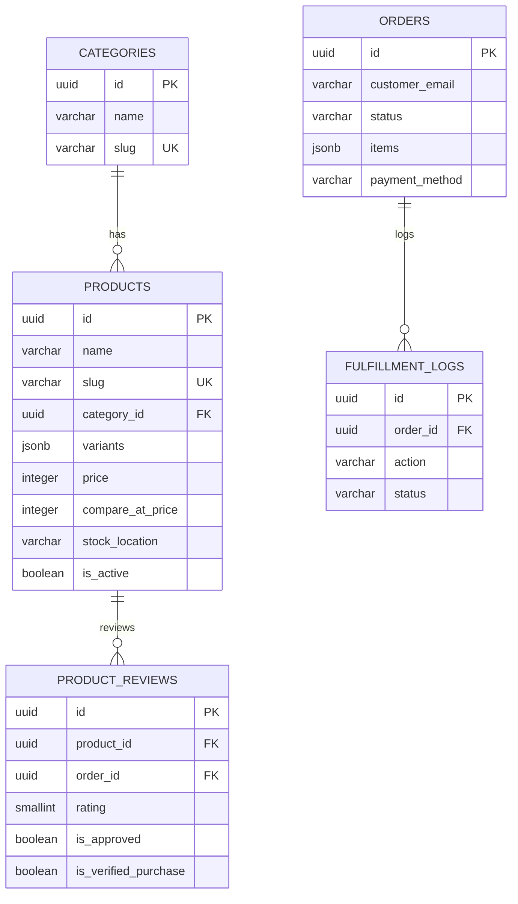

# Core Entities & Relationships

<cite>
**Referenced Files in This Document**
- [schema.sql](file://schema.sql)
- [01_schema.sql](file://sql/01_schema.sql)
- [02_seed_catalog.sql](file://sql/02_seed_catalog.sql)
- [03_runtime_stock.sql](file://sql/03_runtime_stock.sql)
- [03_seed_product_reviews.sql](file://sql/03_seed_product_reviews.sql)
- [database.ts](file://src/types/database.ts)
- [route.ts](file://src/app/api/checkout/route.ts)
- [catalog-runtime.ts](file://src/lib/catalog-runtime.ts)
- [route.ts](file://src/app/api/admin/orders/cancel/route.ts)
- [route.ts](file://src/app/api/webhooks/logistics/route.ts)
- [delivery.ts](file://src/lib/delivery.ts)
</cite>

## Table of Contents
1. [Introduction](#introduction)
2. [Project Structure](#project-structure)
3. [Core Components](#core-components)
4. [Architecture Overview](#architecture-overview)
5. [Detailed Component Analysis](#detailed-component-analysis)
6. [Dependency Analysis](#dependency-analysis)
7. [Performance Considerations](#performance-considerations)
8. [Troubleshooting Guide](#troubleshooting-guide)
9. [Conclusion](#conclusion)
10. [Appendices](#appendices)

## Introduction
This document provides comprehensive data model documentation for AllShop’s core database entities: categories, products, orders, product_reviews, and fulfillment_logs. It explains field definitions, data types, constraints, and validation rules; documents the canonical product catalog design with slug-based URLs and variant handling via JSONB arrays; and details the transactional stock management system. It also covers the order lifecycle, review moderation workflows, and how the schema supports the cash-on-delivery checkout process.

## Project Structure
The schema is defined in SQL migration files and mirrored in TypeScript type definitions for frontend/backend alignment. The checkout flow integrates with Supabase to reserve stock via PostgreSQL functions and persist orders with JSONB arrays for items and notes.

**Diagram sources**
- [schema.sql:11-106](file://schema.sql#L11-L106)
- [01_schema.sql:13-95](file://sql/01_schema.sql#L13-L95)

**Section sources**
- [schema.sql:1-230](file://schema.sql#L1-L230)
- [01_schema.sql:1-496](file://sql/01_schema.sql#L1-L496)

## Core Components

### Categories
- Purpose: Organize products into thematic groups.
- Primary key: id (UUID).
- Fields:
  - id (UUID, PK)
  - name (VARCHAR(100), NOT NULL)
  - slug (VARCHAR(100), UNIQUE, NOT NULL)
  - description (TEXT)
  - image_url (TEXT)
  - icon (VARCHAR(50))
  - color (VARCHAR(7))
  - created_at (TIMESTAMPTZ, DEFAULT NOW())
- Constraints:
  - Unique slug enforced at DB level.
- Indexes:
  - idx_categories_slug (slug)

**Section sources**
- [schema.sql:11-20](file://schema.sql#L11-L20)
- [01_schema.sql:13-45](file://sql/01_schema.sql#L13-L45)

### Products
- Purpose: Canonical product catalog with metadata, pricing, images, variants, and stock location.
- Primary key: id (UUID).
- Foreign key: category_id → categories(id) (ON DELETE RESTRICT).
- Fields:
  - id (UUID, PK)
  - name (VARCHAR(255), NOT NULL)
  - slug (VARCHAR(255), UNIQUE, NOT NULL)
  - description (TEXT, NOT NULL)
  - price (INTEGER, NOT NULL, CHECK >= 0)
  - compare_at_price (INTEGER, CHECK IS NULL OR >= 0)
  - category_id (UUID, NOT NULL)
  - images (TEXT[], NOT NULL, DEFAULT '{}')
  - variants (JSONB, NOT NULL, DEFAULT '[]')
  - stock_location (VARCHAR(20), NOT NULL, DEFAULT 'nacional', CHECK IN ('nacional','internacional','ambos'))
  - free_shipping (BOOLEAN, NOT NULL, DEFAULT false)
  - shipping_cost (INTEGER)
  - provider_api_url (TEXT)
  - is_featured (BOOLEAN, NOT NULL, DEFAULT false)
  - is_active (BOOLEAN, NOT NULL, DEFAULT true)
  - is_bestseller (BOOLEAN)
  - meta_title (VARCHAR(255))
  - meta_description (TEXT)
  - created_at (TIMESTAMPTZ, DEFAULT NOW())
  - updated_at (TIMESTAMPTZ, DEFAULT NOW())
- Constraints:
  - Price and optional compare_at_price validated with CHECK.
  - stock_location constrained to allowed values.
- Indexes:
  - idx_products_category (category_id)
  - idx_products_slug (slug)
  - idx_products_featured (is_featured) where true
  - idx_products_active (is_active) where true

**Section sources**
- [schema.sql:25-47](file://schema.sql#L25-L47)
- [01_schema.sql:24-54](file://sql/01_schema.sql#L24-L54)

### Orders
- Purpose: Customer purchase records with shipping info, totals, and items stored as JSONB array.
- Primary key: id (UUID).
- Fields:
  - id (UUID, PK)
  - customer_name (VARCHAR(255), NOT NULL)
  - customer_email (VARCHAR(255), NOT NULL)
  - customer_phone (VARCHAR(20), NOT NULL)
  - customer_document (VARCHAR(20), NOT NULL)
  - shipping_address (TEXT, NOT NULL)
  - shipping_city (VARCHAR(100), NOT NULL)
  - shipping_department (VARCHAR(100), NOT NULL)
  - shipping_zip (VARCHAR(10))
  - status (VARCHAR(20), NOT NULL, DEFAULT 'pending', CHECK IN ('pending','paid','processing','shipped','delivered','cancelled','refunded'))
  - payment_id (VARCHAR(255))
  - payment_method (VARCHAR(50))
  - shipping_type (VARCHAR(20), NOT NULL, DEFAULT 'nacional', CHECK IN ('nacional'))
  - subtotal (INTEGER, NOT NULL, CHECK >= 0)
  - shipping_cost (INTEGER, NOT NULL, DEFAULT 0, CHECK >= 0)
  - total (INTEGER, NOT NULL, CHECK >= 0)
  - items (JSONB, NOT NULL, DEFAULT '[]')
  - notes (TEXT)
  - created_at (TIMESTAMPTZ, DEFAULT NOW())
  - updated_at (TIMESTAMPTZ, DEFAULT NOW())
- Constraints:
  - Amount fields validated with CHECK.
  - status constrained to allowed values.
- Indexes:
  - idx_orders_status (status)
  - idx_orders_email (customer_email)
  - idx_orders_pending_created_at (created_at) where status = 'pending'
  - idx_orders_payment_unique (payment_id) where not null

**Section sources**
- [schema.sql:52-75](file://schema.sql#L52-L75)
- [01_schema.sql:47-79](file://sql/01_schema.sql#L47-L79)

### Product Reviews
- Purpose: Customer feedback linked to products and optionally to orders.
- Primary key: id (UUID).
- Foreign keys:
  - product_id → products(id) (ON DELETE CASCADE)
  - order_id → orders(id) (ON DELETE SET NULL)
- Fields:
  - id (UUID, PK)
  - product_id (UUID, NOT NULL)
  - order_id (UUID)
  - reviewer_name (VARCHAR(120))
  - rating (SMALLINT, NOT NULL, CHECK BETWEEN 1 AND 5)
  - title (VARCHAR(160))
  - body (TEXT, NOT NULL, CHECK char_length(trim(body)) >= 10)
  - variant (VARCHAR(120))
  - is_verified_purchase (BOOLEAN, NOT NULL, DEFAULT true)
  - is_approved (BOOLEAN, NOT NULL, DEFAULT false)
  - created_at (TIMESTAMPTZ, DEFAULT NOW())
  - updated_at (TIMESTAMPTZ, DEFAULT NOW())
- Indexes:
  - idx_product_reviews_product (product_id)
  - idx_product_reviews_public (product_id, created_at DESC) where is_approved=true AND is_verified_purchase=true

**Section sources**
- [schema.sql:80-93](file://schema.sql#L80-L93)
- [01_schema.sql:72-85](file://sql/01_schema.sql#L72-L85)

### Fulfillment Logs
- Purpose: Audit trail for fulfillment actions triggered by orders.
- Primary key: id (UUID).
- Foreign key: order_id → orders(id) (ON DELETE CASCADE).
- Fields:
  - id (UUID, PK)
  - order_id (UUID, NOT NULL)
  - action (VARCHAR(50), NOT NULL)
  - payload (JSONB)
  - response (JSONB)
  - status (VARCHAR(20), NOT NULL, DEFAULT 'pending')
  - created_at (TIMESTAMPTZ, DEFAULT NOW())

**Section sources**
- [schema.sql:98-106](file://schema.sql#L98-L106)
- [01_schema.sql:87-95](file://sql/01_schema.sql#L87-L95)

### Catalog Runtime State (Stock)
- Purpose: Operational stock snapshot enabling transactional reservations during checkout.
- Primary key: product_slug (VARCHAR(255)).
- Foreign key: product_slug → products(slug) (ON DELETE CASCADE).
- Fields:
  - product_slug (VARCHAR(255), PK)
  - total_stock (INTEGER, CHECK IS NULL OR >= 0)
  - variants (JSONB, NOT NULL, DEFAULT '[]')
  - updated_by (VARCHAR(120))
  - updated_at (TIMESTAMPTZ, NOT NULL, DEFAULT NOW())
- Indexes:
  - idx_catalog_runtime_state_updated_at (updated_at DESC)

**Section sources**
- [schema.sql:122-128](file://schema.sql#L122-L128)
- [01_schema.sql:105-111](file://sql/01_schema.sql#L105-L111)

## Architecture Overview
The checkout pipeline reserves stock atomically using PostgreSQL functions and persists orders with JSONB arrays for items and notes. The fulfillment logs track manual dispatch operations. Product reviews are moderated server-side and exposed publicly only when approved and verified.

**Diagram sources**
- [route.ts:497-800](file://src/app/api/checkout/route.ts#L497-L800)
- [01_schema.sql:253-407](file://sql/01_schema.sql#L253-L407)
- [03_runtime_stock.sql:8-45](file://sql/03_runtime_stock.sql#L8-L45)

## Detailed Component Analysis

### Canonical Product Catalog Design
- Slug-based URLs: products.slug is unique and indexed, enabling deterministic routing and SEO-friendly URLs.
- Variants via JSONB: products.variants stores structured variant definitions (e.g., name/options), allowing flexible variant handling without separate tables.
- Active filtering: RLS policy exposes only is_active=true products to public reads.

**Section sources**
- [schema.sql:27-34](file://schema.sql#L27-L34)
- [01_schema.sql:26-33](file://sql/01_schema.sql#L26-L33)
- [01_schema.sql:216-217](file://sql/01_schema.sql#L216-L217)

### Transactional Stock Management
- Reservation flow:
  - Checkout calls reserve_catalog_stock with items array containing slug, variant, and quantity.
  - The function validates presence, normalizes variant keys, checks total and per-variant stock, and updates catalog_runtime_state atomically.
- Restoration:
  - On errors or cancellations, restore_catalog_stock reverses reservations.
- Manual stock snapshot:
  - catalog_runtime_state seeded with initial stock and variants for each product.

**Diagram sources**
- [01_schema.sql:253-407](file://sql/01_schema.sql#L253-L407)
- [catalog-runtime.ts:293-338](file://src/lib/catalog-runtime.ts#L293-L338)

**Section sources**
- [route.ts:663-685](file://src/app/api/checkout/route.ts#L663-L685)
- [03_runtime_stock.sql:19-43](file://sql/03_runtime_stock.sql#L19-L43)
- [catalog-runtime.ts:340-363](file://src/lib/catalog-runtime.ts#L340-L363)

### Cash-on-Delivery Checkout Workflow
- Endpoint: POST /api/checkout creates orders with status=processing and payment_method='manual_cod'.
- Shipping estimation and costs are computed client-side and validated server-side.
- Notes field stores structured checkout metadata (pricing, logistics, verification).
- Duplicate detection via payment_id and recent order limits prevents abuse.

**Diagram sources**
- [route.ts:497-800](file://src/app/api/checkout/route.ts#L497-L800)
- [01_schema.sql:253-407](file://sql/01_schema.sql#L253-L407)

**Section sources**
- [route.ts:596-757](file://src/app/api/checkout/route.ts#L596-L757)
- [delivery.ts:438-487](file://src/lib/delivery.ts#L438-L487)

### Order Lifecycle and Cancellation
- Status transitions are constrained by CHECK and application logic.
- Cancellation endpoint (admin-only) updates order status to cancelled and restores stock for items.

**Diagram sources**
- [schema.sql:62-63](file://schema.sql#L62-L63)
- [route.ts:132-210](file://src/app/api/admin/orders/cancel/route.ts#L132-L210)

**Section sources**
- [route.ts:132-210](file://src/app/api/admin/orders/cancel/route.ts#L132-L210)

### Review Moderation Workflow
- Public exposure: Only approved and verified purchases are selectable by public policy.
- Moderation: Admins can approve reviews; seed script approves verified purchases for current catalog.

**Diagram sources**
- [schema.sql:85-93](file://schema.sql#L85-L93)
- [01_schema.sql:219-221](file://sql/01_schema.sql#L219-L221)
- [03_seed_product_reviews.sql:8-28](file://sql/03_seed_product_reviews.sql#L8-L28)

**Section sources**
- [01_schema.sql:219-234](file://sql/01_schema.sql#L219-L234)
- [03_seed_product_reviews.sql:340-395](file://sql/03_seed_product_reviews.sql#L340-L395)

### Fulfillment Logging
- Manual dispatch: Webhook endpoints return 410 (disabled) indicating 100% manual fulfillment.
- Logs capture action, payload, response, and status for auditability.

**Section sources**
- [route.ts:6-18](file://src/app/api/webhooks/logistics/route.ts#L6-L18)
- [schema.sql:98-106](file://schema.sql#L98-L106)

## Dependency Analysis
Entity relationships and referential integrity are enforced by foreign keys and ON DELETE behaviors.

**Diagram sources**
- [schema.sql:11-106](file://schema.sql#L11-L106)
- [01_schema.sql:13-95](file://sql/01_schema.sql#L13-L95)

**Section sources**
- [schema.sql:32-33](file://schema.sql#L32-L33)
- [schema.sql:82-83](file://schema.sql#L82-L83)
- [schema.sql:100-100](file://schema.sql#L100-L100)

## Performance Considerations
- JSONB indexing: Consider GIN indexes for frequently queried JSONB fields if queries become complex.
- Partitioning: For very large catalogs, partition orders by status or created_at to improve scans.
- Materialized views: Consider a denormalized product summary view for frequent storefront queries.
- RLS overhead: Row-level security adds minimal overhead but ensure policies remain selective.

## Troubleshooting Guide
- Stock reservation failures:
  - Validate item arrays contain non-empty slugs and positive quantities.
  - Check that variants are specified when multiple variants exist.
  - Confirm catalog_runtime_state exists for the product slug.
- Checkout duplicates:
  - payment_id uniqueness is enforced; handle idempotency keys properly.
  - Limit concurrent orders per phone/address to prevent abuse.
- Cancellation stock restoration:
  - Ensure order items include product_id and variant; map product_id to slug for restoration.

**Section sources**
- [route.ts:663-685](file://src/app/api/checkout/route.ts#L663-L685)
- [route.ts:162-194](file://src/app/api/admin/orders/cancel/route.ts#L162-L194)
- [01_schema.sql:150-152](file://sql/01_schema.sql#L150-L152)

## Conclusion
AllShop’s schema centers on a canonical product catalog with slug-based URLs and flexible variants, supported by a transactional stock reservation system and a JSONB-first order model. The design enables cash-on-delivery checkout, manual fulfillment, and robust moderation of product reviews, while maintaining referential integrity and performance through strategic indexes and policies.

## Appendices

### Field Reference: Types and Constraints
- Categories: Unique slug, created_at default.
- Products: Unique slug, price>=0, stock_location enum, is_active filter for public.
- Orders: Status enum, amount fields checked, payment_id unique when present.
- Reviews: Rating 1–5, body min length, public visibility requires approval and verification.
- Fulfillment logs: Action and status fields, order_id FK.

**Section sources**
- [schema.sql:11-106](file://schema.sql#L11-L106)
- [01_schema.sql:13-95](file://sql/01_schema.sql#L13-L95)

### Sample Data Structures
- Product variants (JSONB):
  - [{"name":"Color","options":["NEGRO","BLANCO"]}]
- Order items (JSONB):
  - [{"product_id":"...","product_name":"...","variant":null,"quantity":1,"price":85000,"image":"..."}]
- Order notes (JSONB):
  - {"checkout_model":"manual_cod_v1","fulfillment_mode":"manual_dispatch",...}

**Section sources**
- [02_seed_catalog.sql:45-50](file://sql/02_seed_catalog.sql#L45-L50)
- [route.ts:399-453](file://src/app/api/checkout/route.ts#L399-L453)