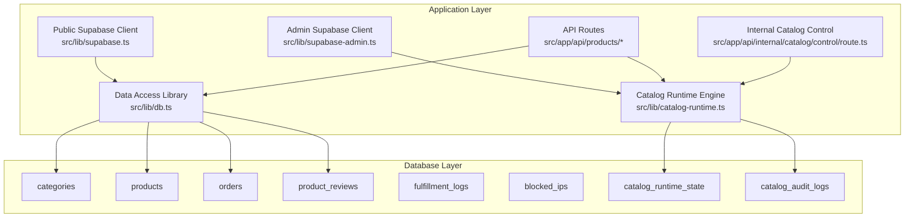
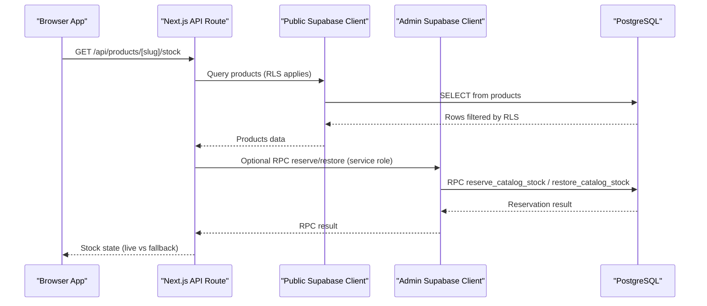
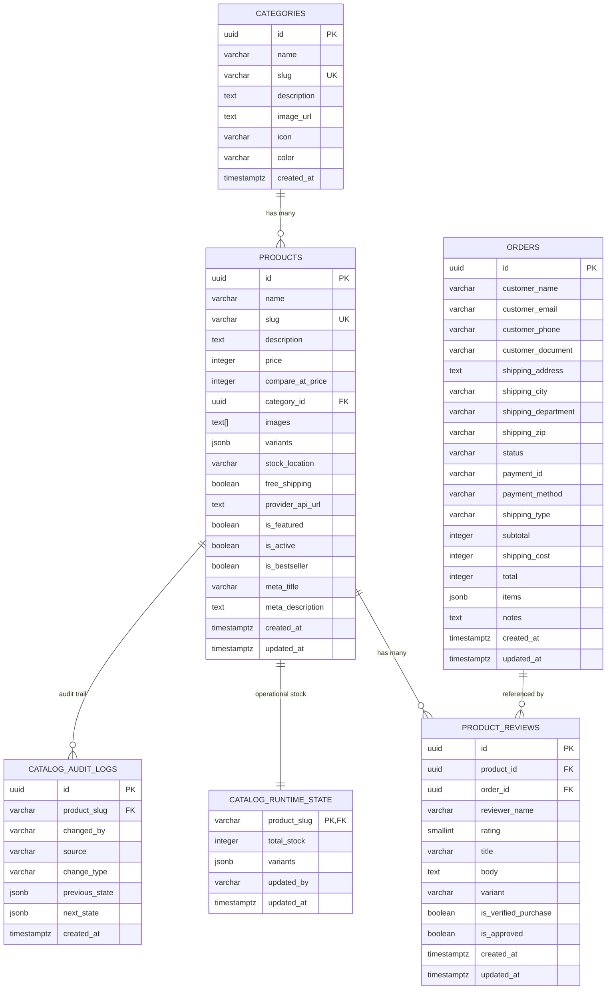
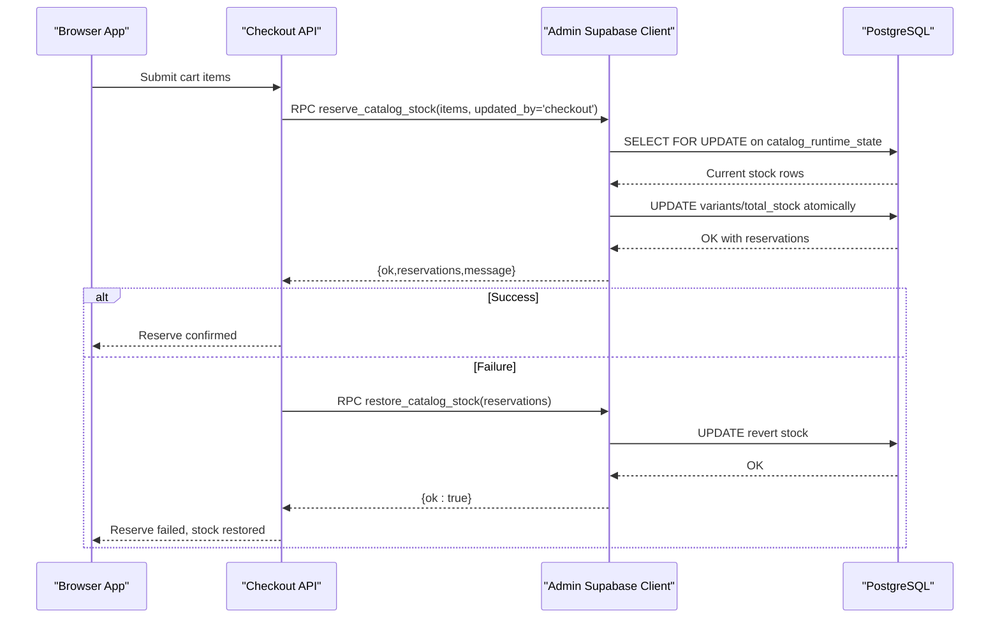
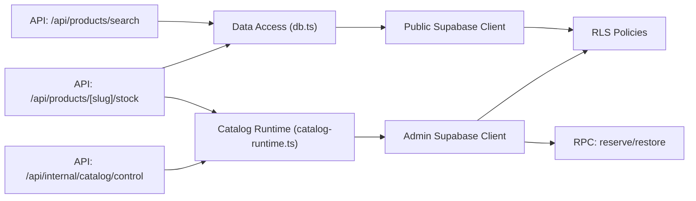

# Database Schema & Data Model

<cite>
**Referenced Files in This Document**
- [schema.sql](file://schema.sql)
- [supabase_bootstrap.sql](file://supabase_bootstrap.sql)
- [full_database_update.sql](file://full_database_update.sql)
- [manual_catalog_sync.sql](file://manual_catalog_sync.sql)
- [sql/01_schema.sql](file://sql/01_schema.sql)
- [sql/02_seed_catalog.sql](file://sql/02_seed_catalog.sql)
- [sql/03_runtime_stock.sql](file://sql/03_runtime_stock.sql)
- [sql/03_seed_product_reviews.sql](file://sql/03_seed_product_reviews.sql)
- [src/lib/db.ts](file://src/lib/db.ts)
- [src/lib/supabase.ts](file://src/lib/supabase.ts)
- [src/lib/supabase-admin.ts](file://src/lib/supabase-admin.ts)
- [src/lib/catalog-runtime.ts](file://src/lib/catalog-runtime.ts)
- [src/app/api/products/search/route.ts](file://src/app/api/products/search/route.ts)
- [src/app/api/products/[slug]/stock/route.ts](file://src/app/api/products/[slug]/stock/route.ts)
- [src/app/api/internal/catalog/control/route.ts](file://src/app/api/internal/catalog/control/route.ts)
- [src/types/database.ts](file://src/types/database.ts)
</cite>

## Table of Contents
1. [Introduction](#introduction)
2. [Project Structure](#project-structure)
3. [Core Components](#core-components)
4. [Architecture Overview](#architecture-overview)
5. [Detailed Component Analysis](#detailed-component-analysis)
6. [Dependency Analysis](#dependency-analysis)
7. [Performance Considerations](#performance-considerations)
8. [Troubleshooting Guide](#troubleshooting-guide)
9. [Conclusion](#conclusion)
10. [Appendices](#appendices)

## Introduction
This document describes the AllShop PostgreSQL database schema built on Supabase. It covers the canonical product catalog, transactional stock management via custom RPC functions, row-level security (RLS) policies, and data access patterns through the Supabase client. It also documents indexes, constraints, and the operational runtime stock table used for checkout reservations. The goal is to provide a comprehensive understanding of the schema, relationships, and operational mechanics for developers and operators.

## Project Structure
The database schema is defined and evolved through SQL scripts and Supabase-managed migrations. The frontend interacts with the database through typed Supabase clients and API routes.

**Diagram sources**
- [schema.sql:11-122](file://schema.sql#L11-L122)
- [src/lib/db.ts:113-308](file://src/lib/db.ts#L113-L308)
- [src/lib/supabase.ts:1-20](file://src/lib/supabase.ts#L1-L20)
- [src/lib/supabase-admin.ts:1-31](file://src/lib/supabase-admin.ts#L1-L31)
- [src/lib/catalog-runtime.ts:1-800](file://src/lib/catalog-runtime.ts#L1-L800)
- [src/app/api/products/search/route.ts:1-31](file://src/app/api/products/search/route.ts#L1-L31)
- [src/app/api/products/[slug]/stock/route.ts:1-84](file://src/app/api/products/[slug]/stock/route.ts#L1-L84)
- [src/app/api/internal/catalog/control/route.ts:1-191](file://src/app/api/internal/catalog/control/route.ts#L1-L191)

**Section sources**
- [schema.sql:11-122](file://schema.sql#L11-L122)
- [src/lib/db.ts:113-308](file://src/lib/db.ts#L113-L308)
- [src/lib/supabase.ts:1-20](file://src/lib/supabase.ts#L1-L20)
- [src/lib/supabase-admin.ts:1-31](file://src/lib/supabase-admin.ts#L1-L31)
- [src/lib/catalog-runtime.ts:1-800](file://src/lib/catalog-runtime.ts#L1-L800)
- [src/app/api/products/search/route.ts:1-31](file://src/app/api/products/search/route.ts#L1-L31)
- [src/app/api/products/[slug]/stock/route.ts:1-84](file://src/app/api/products/[slug]/stock/route.ts#L1-L84)
- [src/app/api/internal/catalog/control/route.ts:1-191](file://src/app/api/internal/catalog/control/route.ts#L1-L191)

## Core Components
- categories: Canonical category taxonomy with unique slug and metadata.
- products: Canonical product catalog with pricing, images, variants, stock location, and flags.
- orders: Customer order records with shipping info, totals, and items payload.
- product_reviews: Verified and approved customer reviews linked to products and optionally orders.
- fulfillment_logs: Operational logs for order fulfillment actions.
- blocked_ips: IP blocking policy with duration and expiration.
- catalog_runtime_state: Operational stock snapshot for checkout reservations and admin control.
- catalog_audit_logs: Audit trail for catalog changes.

**Section sources**
- [schema.sql:11-122](file://schema.sql#L11-L122)
- [sql/01_schema.sql:13-122](file://sql/01_schema.sql#L13-L122)

## Architecture Overview
The system separates public read access (RLS) from administrative operations requiring a service role key. Public clients query canonical tables (categories, products, product_reviews) with RLS policies. Administrative operations (stock updates, RPC stock mutations, audits) use the admin client against runtime and audit tables.

**Diagram sources**
- [src/app/api/products/[slug]/stock/route.ts:1-L84](file://src/app/api/products/[slug]/stock/route.ts#L1-L84)
- [src/lib/db.ts:183-224](file://src/lib/db.ts#L183-L224)
- [src/lib/supabase.ts:1-20](file://src/lib/supabase.ts#L1-L20)
- [src/lib/supabase-admin.ts:1-31](file://src/lib/supabase-admin.ts#L1-L31)
- [schema.sql:262-404](file://schema.sql#L262-L404)

## Detailed Component Analysis

### Entity Relationships and Constraints
- categories.id is PK; products.category_id FK to categories.id with ON DELETE RESTRICT.
- product_reviews.product_id FK to products.id with ON DELETE CASCADE; product_reviews.order_id FK to orders.id with ON DELETE SET NULL.
- orders.items is JSONB array of order line items.
- catalog_runtime_state.product_slug PK and FK to products.slug with ON DELETE CASCADE.
- catalog_audit_logs.product_slug FK to products.slug with ON DELETE CASCADE.

**Diagram sources**
- [schema.sql:11-122](file://schema.sql#L11-L122)
- [sql/01_schema.sql:13-122](file://sql/01_schema.sql#L13-L122)

**Section sources**
- [schema.sql:11-122](file://schema.sql#L11-L122)
- [sql/01_schema.sql:13-122](file://sql/01_schema.sql#L13-L122)

### Field Definitions and Data Types
- categories: id (UUID), name (varchar), slug (unique), description (text), image_url (text), icon (varchar), color (varchar), created_at (timestamptz).
- products: id (UUID), name (varchar), slug (unique), description (text), price (integer), compare_at_price (integer), category_id (UUID), images (text[]), variants (jsonb), stock_location (varchar), free_shipping (boolean), provider_api_url (text), is_featured (boolean), is_active (boolean), is_bestseller (boolean), meta_title (varchar), meta_description (text), created_at/updated_at (timestamptz).
- orders: id (UUID), customer_* fields (varchar/text), shipping_* fields (varchar/text), status (varchar), payment_id/method (varchar), shipping_type/status (varchar), subtotal/shipping_cost/total (integer), items (jsonb), notes (text), created_at/updated_at (timestamptz).
- product_reviews: id (UUID), product_id/order_id (UUID), reviewer_name (varchar), rating (smallint), title/body (varchar/text), variant (varchar), is_verified_purchase/is_approved (boolean), created_at/updated_at (timestamptz).
- fulfillment_logs: id (UUID), order_id (UUID), action (varchar), payload/response (jsonb), status (varchar), created_at (timestamptz).
- blocked_ips: ip (varchar), duration (varchar), reason (text), blocked_at/expires_at (timestamptz).
- catalog_runtime_state: product_slug (varchar), total_stock (integer), variants (jsonb), updated_by (varchar), updated_at (timestamptz).
- catalog_audit_logs: id (UUID), product_slug (varchar), changed_by (varchar), source (varchar), change_type (varchar), previous_state/next_state (jsonb), created_at (timestamptz).

**Section sources**
- [schema.sql:11-122](file://schema.sql#L11-L122)
- [sql/01_schema.sql:13-122](file://sql/01_schema.sql#L13-L122)
- [src/types/database.ts:96-288](file://src/types/database.ts#L96-L288)

### Indexes and Constraints
- Unique and partial indexes:
  - categories.slug (unique)
  - products.slug (unique)
  - products.is_active=true (partial)
  - products.is_featured=true (partial)
  - product_reviews (product_id, created_at desc) where is_approved=true AND is_verified_purchase=true
  - orders.status, orders.customer_email, orders.payment_id (unique when not null)
  - blocked_ips.expires_at (partial)
  - catalog_runtime_state.updated_at (descending)
  - catalog_audit_logs (product_slug, created_at desc)
- Foreign keys:
  - products.category_id -> categories.id (RESTRICT)
  - product_reviews.product_id -> products.id (CASCADE)
  - product_reviews.order_id -> orders.id (SET NULL)
  - catalog_runtime_state.product_slug -> products.slug (CASCADE)
  - catalog_audit_logs.product_slug -> products.slug (CASCADE)
- Check constraints:
  - products.price >= 0, compare_at_price >= 0 or null
  - orders.subtotal, shipping_cost, total >= 0
  - orders.status in ('pending','paid','processing','shipped','delivered','cancelled','refunded')
  - orders.shipping_type in ('nacional')
  - product_reviews.rating between 1 and 5, body length >= 10 after trim
  - stock_location in ('nacional','internacional','ambos')

**Section sources**
- [schema.sql:135-154](file://schema.sql#L135-L154)
- [sql/01_schema.sql:139-159](file://sql/01_schema.sql#L139-L159)

### Transactional Stock Management (Checkout Reservations)
AllShop uses a dedicated runtime stock table and two RPC functions for atomic stock reservations and rollbacks during checkout.

- reserve_catalog_stock:
  - Accepts JSONB array of items with slug, variant, quantity.
  - Groups by normalized slug and variant.
  - Locks rows with FOR UPDATE.
  - Validates variant presence when multiple variants exist.
  - Updates both per-variant stock and total_stock atomically.
  - Returns reservations array and status.
- restore_catalog_stock:
  - Accepts reservations array to rollback stock.
  - Reverses increments for each item.
  - Used on checkout failure or timeout.

**Diagram sources**
- [schema.sql:262-404](file://schema.sql#L262-L404)
- [src/lib/catalog-runtime.ts:293-363](file://src/lib/catalog-runtime.ts#L293-L363)

**Section sources**
- [schema.sql:262-404](file://schema.sql#L262-L404)
- [src/lib/catalog-runtime.ts:293-363](file://src/lib/catalog-runtime.ts#L293-L363)

### Row-Level Security (RLS) Policies
RLS is enabled on all relevant tables. Public-facing reads are permitted for categories and products (active only), and for approved, verified reviews. Orders, fulfillment logs, blocked IPs, catalog runtime state, and catalog audit logs are restricted to service role access.

- Categories: SELECT USING (true)
- Products: SELECT USING (is_active = true)
- Product reviews: SELECT USING (is_approved = true AND is_verified_purchase = true)
- Orders, fulfillment_logs, blocked_ips, catalog_runtime_state, catalog_audit_logs: ALL USING (false) WITH CHECK (false)

These policies ensure public pages show only curated content while sensitive operational data remains server-side.

**Section sources**
- [schema.sql:182-220](file://schema.sql#L182-L220)
- [sql/01_schema.sql:194-240](file://sql/01_schema.sql#L194-L240)

### Data Access Patterns Through Supabase Clients
- Public client (src/lib/supabase.ts):
  - Typed access to canonical tables (categories, products, product_reviews).
  - Used by frontend API routes for read operations.
- Admin client (src/lib/supabase-admin.ts):
  - Service role access for dynamic tables and RPC functions.
  - Used by catalog runtime engine for reservations, restores, and state writes.

Examples of usage:
- Product search endpoint caches results and returns minimal fields.
- Product stock endpoint validates rate limits, resolves product, and queries runtime state.
- Internal catalog control endpoint authenticates with admin code and updates runtime state.

**Section sources**
- [src/lib/supabase.ts:1-20](file://src/lib/supabase.ts#L1-L20)
- [src/lib/supabase-admin.ts:1-31](file://src/lib/supabase-admin.ts#L1-L31)
- [src/lib/db.ts:113-308](file://src/lib/db.ts#L113-L308)
- [src/app/api/products/search/route.ts:1-31](file://src/app/api/products/search/route.ts#L1-L31)
- [src/app/api/products/[slug]/stock/route.ts:1-L84](file://src/app/api/products/[slug]/stock/route.ts#L1-L84)
- [src/app/api/internal/catalog/control/route.ts:1-191](file://src/app/api/internal/catalog/control/route.ts#L1-L191)

### Canonical Product Catalog Design
- Categories seeded with icons and colors; products linked by category_id.
- Products include images array, variants JSONB, pricing, compare_at_price, and SEO metadata.
- Reviews are approved and verified to appear publicly.
- Manual stock snapshots and runtime state enable flexible stock management.

**Section sources**
- [schema.sql:224-230](file://schema.sql#L224-L230)
- [sql/02_seed_catalog.sql:8-21](file://sql/02_seed_catalog.sql#L8-L21)
- [sql/02_seed_catalog.sql:27-326](file://sql/02_seed_catalog.sql#L27-L326)
- [sql/03_seed_product_reviews.sql:1-219](file://sql/03_seed_product_reviews.sql#L1-L219)

### Sample Data Structures
- Product: id, slug, name, description, price, compare_at_price, category_id, images[], variants[], stock_location, flags, meta fields, timestamps.
- Review: product_id, order_id, reviewer_name, rating, title, body, variant, flags, timestamps.
- Order: customer info, shipping info, status, totals, items JSONB, notes, timestamps.
- Runtime stock: product_slug, total_stock, variants[], updated_by, updated_at.

**Section sources**
- [src/types/database.ts:96-288](file://src/types/database.ts#L96-L288)
- [sql/02_seed_catalog.sql:27-326](file://sql/02_seed_catalog.sql#L27-L326)
- [sql/03_seed_product_reviews.sql:8-219](file://sql/03_seed_product_reviews.sql#L8-L219)
- [sql/03_runtime_stock.sql:8-45](file://sql/03_runtime_stock.sql#L8-L45)

## Dependency Analysis
- Frontend API routes depend on the data access library for canonical queries and on the catalog runtime engine for stock operations.
- The catalog runtime engine depends on the admin client and RPC functions for atomic stock mutations.
- RLS policies enforce access boundaries between public and admin operations.

**Diagram sources**
- [src/app/api/products/search/route.ts:1-31](file://src/app/api/products/search/route.ts#L1-L31)
- [src/app/api/products/[slug]/stock/route.ts:1-L84](file://src/app/api/products/[slug]/stock/route.ts#L1-L84)
- [src/app/api/internal/catalog/control/route.ts:1-191](file://src/app/api/internal/catalog/control/route.ts#L1-L191)
- [src/lib/db.ts:113-308](file://src/lib/db.ts#L113-L308)
- [src/lib/catalog-runtime.ts:293-363](file://src/lib/catalog-runtime.ts#L293-L363)
- [src/lib/supabase.ts:1-20](file://src/lib/supabase.ts#L1-L20)
- [src/lib/supabase-admin.ts:1-31](file://src/lib/supabase-admin.ts#L1-L31)
- [schema.sql:182-220](file://schema.sql#L182-L220)

**Section sources**
- [src/app/api/products/search/route.ts:1-31](file://src/app/api/products/search/route.ts#L1-L31)
- [src/app/api/products/[slug]/stock/route.ts:1-L84](file://src/app/api/products/[slug]/stock/route.ts#L1-L84)
- [src/app/api/internal/catalog/control/route.ts:1-191](file://src/app/api/internal/catalog/control/route.ts#L1-L191)
- [src/lib/db.ts:113-308](file://src/lib/db.ts#L113-L308)
- [src/lib/catalog-runtime.ts:293-363](file://src/lib/catalog-runtime.ts#L293-L363)
- [src/lib/supabase.ts:1-20](file://src/lib/supabase.ts#L1-L20)
- [src/lib/supabase-admin.ts:1-31](file://src/lib/supabase-admin.ts#L1-L31)
- [schema.sql:182-220](file://schema.sql#L182-L220)

## Performance Considerations
- Indexes:
  - Products: category_id, slug, is_active=true, is_featured=true, variants JSONB storage optimized for queries.
  - Reviews: composite index for approved+verified+recent sorting.
  - Orders: status, customer_email, pending-created_at partial index, unique payment_id when present.
  - Runtime state: descending updated_at index for recent-first queries.
- RLS overhead: Minimal for read-only public policies; admin operations bypass RLS via service role.
- RPC stock mutations: FOR UPDATE ensures concurrency safety; keep reservation windows short.
- Caching:
  - Product search endpoint sets cache headers for CDN-friendly caching.
  - Stock endpoint disables caching to reflect live state.

**Section sources**
- [schema.sql:135-154](file://schema.sql#L135-L154)
- [sql/01_schema.sql:139-159](file://sql/01_schema.sql#L139-L159)
- [src/app/api/products/search/route.ts:4-26](file://src/app/api/products/search/route.ts#L4-L26)
- [src/app/api/products/[slug]/stock/route.ts:14-L18](file://src/app/api/products/[slug]/stock/route.ts#L14-L18)

## Troubleshooting Guide
- Missing RPC functions:
  - If RPC reserve/restore calls fail due to missing functions, run the bootstrap/update SQL to create them.
- Missing runtime table:
  - If catalog_runtime_state does not exist, sync the manual catalog snapshot SQL to seed the table.
- Rate limiting on stock endpoint:
  - Excessive requests receive 429 with Retry-After header; adjust client retry logic.
- RLS access denied:
  - Public reads are restricted by policies; admin operations require service role key and proper auth.

**Section sources**
- [src/lib/catalog-runtime.ts:226-268](file://src/lib/catalog-runtime.ts#L226-L268)
- [src/app/api/products/[slug]/stock/route.ts:25-L35](file://src/app/api/products/[slug]/stock/route.ts#L25-L35)
- [schema.sql:182-220](file://schema.sql#L182-L220)

## Conclusion
AllShop’s database schema centers on a canonical product catalog with robust RLS for public exposure and strict admin-only access for sensitive operations. The transactional stock system uses a runtime table and RPC functions to safely manage reservations during checkout. Indexes and policies balance performance and security, while API routes and typed clients provide clean data access patterns.

## Appendices

### Schema Evolution and Migration Paths
- Initial bootstrap and schema creation:
  - Run the bootstrap SQL to create extensions, tables, indexes, triggers, RLS, and RPC functions.
- Seed canonical catalog and reviews:
  - Insert categories and products; approve verified purchases for canonical products.
- Runtime stock seeding:
  - Populate catalog_runtime_state with initial stock snapshots for checkout and admin control.
- Full update consolidation:
  - The consolidated update script merges schema, seed, and runtime stock steps.

**Section sources**
- [supabase_bootstrap.sql:1-507](file://supabase_bootstrap.sql#L1-L507)
- [full_database_update.sql:1-507](file://full_database_update.sql#L1-L507)
- [manual_catalog_sync.sql:1-390](file://manual_catalog_sync.sql#L1-L390)
- [sql/01_schema.sql:1-496](file://sql/01_schema.sql#L1-L496)
- [sql/02_seed_catalog.sql:1-399](file://sql/02_seed_catalog.sql#L1-L399)
- [sql/03_runtime_stock.sql:1-46](file://sql/03_runtime_stock.sql#L1-L46)
- [sql/03_seed_product_reviews.sql:1-219](file://sql/03_seed_product_reviews.sql#L1-L219)

### Data Lifecycle and Retention
- Product catalog and categories are maintained via admin-controlled updates and audits.
- Runtime stock snapshots reflect operational state; historical changes are recorded in catalog_audit_logs.
- Orders and fulfillment logs capture transactional history; expiration of blocked IPs is enforced by index on expires_at.

**Section sources**
- [schema.sql:122-134](file://schema.sql#L122-L134)
- [sql/01_schema.sql:113-135](file://sql/01_schema.sql#L113-L135)

### Security Measures
- RLS policies restrict public access to operational tables.
- Admin client uses service role key for privileged operations.
- RPC functions execute with SECURITY DEFINER and controlled search_path.
- IP blocking table supports temporary or permanent blocks with optional expiration.

**Section sources**
- [schema.sql:182-220](file://schema.sql#L182-L220)
- [schema.sql:253-263](file://schema.sql#L253-L263)
- [schema.sql:406-414](file://schema.sql#L406-L414)
- [sql/01_schema.sql:203-240](file://sql/01_schema.sql#L203-L240)