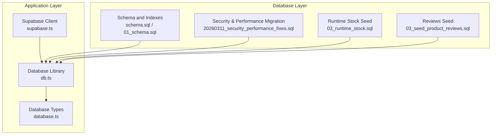
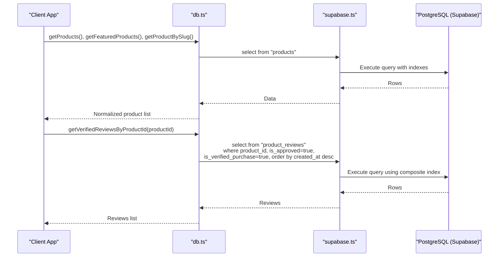
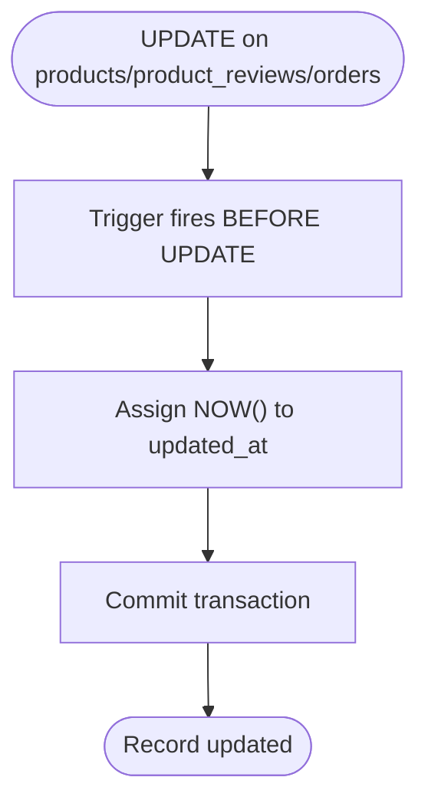
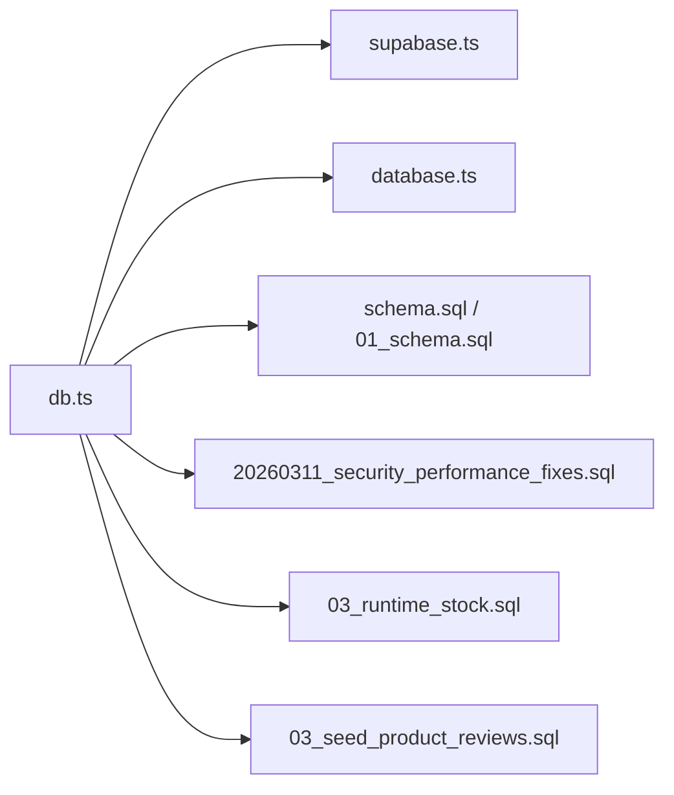

# Indexes & Database Triggers

<cite>
**Referenced Files in This Document**
- [schema.sql](file://schema.sql)
- [01_schema.sql](file://sql/01_schema.sql)
- [02_seed_catalog.sql](file://sql/02_seed_catalog.sql)
- [03_runtime_stock.sql](file://sql/03_runtime_stock.sql)
- [03_seed_product_reviews.sql](file://sql/03_seed_product_reviews.sql)
- [04_add_corrector_postura.sql](file://sql/04_add_corrector_postura.sql)
- [20260311_security_performance_fixes.sql](file://supabase/migrations/20260311_security_performance_fixes.sql)
- [db.ts](file://src/lib/db.ts)
- [supabase.ts](file://src/lib/supabase.ts)
- [database.ts](file://src/types/database.ts)
</cite>

## Table of Contents
1. [Introduction](#introduction)
2. [Project Structure](#project-structure)
3. [Core Components](#core-components)
4. [Architecture Overview](#architecture-overview)
5. [Detailed Component Analysis](#detailed-component-analysis)
6. [Dependency Analysis](#dependency-analysis)
7. [Performance Considerations](#performance-considerations)
8. [Troubleshooting Guide](#troubleshooting-guide)
9. [Conclusion](#conclusion)

## Introduction
This document explains AllShop’s database indexing strategy and trigger implementations. It focuses on:
- Index coverage for product_reviews (approved and verified purchases), orders (status and email filtering), and catalog_runtime_state
- Conditional indexes for featured products, active products, and pending orders
- The update_updated_at_column trigger function that automatically refreshes timestamps on record updates
- How triggers maintain data consistency and improve performance for common operations like product searches, order retrieval, and review filtering

## Project Structure
The database schema and indexes are defined across multiple SQL files and migrations. The application code interacts with the database via Supabase client libraries.

**Diagram sources**
- [schema.sql:131-178](file://schema.sql#L131-L178)
- [01_schema.sql:137-190](file://sql/01_schema.sql#L137-L190)
- [20260311_security_performance_fixes.sql:6-71](file://supabase/migrations/20260311_security_performance_fixes.sql#L6-L71)
- [03_runtime_stock.sql:16-17](file://sql/03_runtime_stock.sql#L16-L17)
- [03_seed_product_reviews.sql:289-308](file://sql/03_seed_product_reviews.sql#L289-L308)
- [supabase.ts:1-20](file://src/lib/supabase.ts#L1-L20)
- [db.ts:113-308](file://src/lib/db.ts#L113-L308)
- [database.ts:96-288](file://src/types/database.ts#L96-L288)

**Section sources**
- [schema.sql:131-178](file://schema.sql#L131-L178)
- [01_schema.sql:137-190](file://sql/01_schema.sql#L137-L190)
- [20260311_security_performance_fixes.sql:6-71](file://supabase/migrations/20260311_security_performance_fixes.sql#L6-L71)
- [03_runtime_stock.sql:16-17](file://sql/03_runtime_stock.sql#L16-L17)
- [03_seed_product_reviews.sql:289-308](file://sql/03_seed_product_reviews.sql#L289-L308)
- [supabase.ts:1-20](file://src/lib/supabase.ts#L1-L20)
- [db.ts:113-308](file://src/lib/db.ts#L113-L308)
- [database.ts:96-288](file://src/types/database.ts#L96-L288)

## Core Components
- Indexes and conditional indexes across products, orders, product_reviews, catalog_runtime_state, and audit logs
- Triggers that automatically set updated_at on updates for products, product_reviews, and orders
- Row Level Security (RLS) policies that restrict client access to sensitive tables

Key index families:
- product_reviews: product_id, and a composite index for approved+verified purchases
- orders: status, customer_email, created_at (conditional for pending), and unique payment_id
- products: category_id, slug, active, and featured (conditional)
- catalog_runtime_state: updated_at (descending)
- catalog_audit_logs: product_slug + created_at (descending)

Trigger family:
- update_updated_at_column executed before UPDATE on products, product_reviews, orders

**Section sources**
- [schema.sql:131-178](file://schema.sql#L131-L178)
- [01_schema.sql:137-190](file://sql/01_schema.sql#L137-L190)
- [20260311_security_performance_fixes.sql:6-71](file://supabase/migrations/20260311_security_performance_fixes.sql#L6-L71)
- [03_runtime_stock.sql:16-17](file://sql/03_runtime_stock.sql#L16-L17)
- [03_seed_product_reviews.sql:289-308](file://sql/03_seed_product_reviews.sql#L289-L308)

## Architecture Overview
The application uses Supabase client libraries to query the database. Queries leverage indexes to optimize performance for:
- Product discovery and filtering by category, slug, active/featured status
- Review retrieval filtered by product and approval/verification flags
- Order retrieval by status, email, and payment identifiers
- Runtime stock and audit log lookups by product and timestamp

**Diagram sources**
- [db.ts:146-181](file://src/lib/db.ts#L146-L181)
- [db.ts:183-224](file://src/lib/db.ts#L183-L224)
- [db.ts:289-308](file://src/lib/db.ts#L289-L308)
- [schema.sql:131-178](file://schema.sql#L131-L178)
- [01_schema.sql:137-190](file://sql/01_schema.sql#L137-L190)

## Detailed Component Analysis

### Index Strategy and Purpose

- product_reviews
  - product_id: accelerates joins and per-product review queries
  - idx_product_reviews_public (product_id, created_at DESC) WHERE is_approved = true AND is_verified_purchase = true: optimizes frontend review feeds by product with strict visibility conditions
  - Benefit: avoids scanning all reviews; leverages conditional index for approved+verified subset

- orders
  - idx_orders_status: supports status-based filtering for fulfillment and reporting
  - idx_orders_email: supports customer-centric order retrieval
  - idx_orders_pending_created_at (created_at) WHERE status = 'pending': targeted index for pending order cleanup and monitoring
  - idx_orders_payment_unique (payment_id) WHERE payment_id IS NOT NULL: ensures uniqueness and fast lookup by payment reference
  - Benefit: improves order lifecycle operations and reduces I/O for payment reconciliation

- products
  - idx_products_category: accelerates category browsing
  - idx_products_slug: fast slug-based lookups
  - idx_products_active (is_active) WHERE is_active = true: serves storefront filtering
  - idx_products_featured (is_featured) WHERE is_featured = true: powers featured product listings
  - Benefit: reduces scans for active/featured content and improves UI responsiveness

- catalog_runtime_state
  - idx_catalog_runtime_state_updated_at (updated_at DESC): supports sorting runtime stock by last update
  - Benefit: efficient pagination and recent-first views for inventory operations

- catalog_audit_logs
  - idx_catalog_audit_logs_product_created (product_slug, created_at DESC): optimizes audit trails per product
  - Benefit: fast per-product audit history queries

- Additional indexes from migration
  - idx_orders_status_created (status, created_at DESC): compound index for status+time ordering
  - idx_products_slug: slug lookups
  - idx_products_active: active filtering
  - idx_catalog_runtime_slug: runtime state lookups by slug
  - idx_blocked_ips_expires: expiration-based cleanup
  - idx_rate_limits_reset: rate limit resets
  - Benefit: broad operational performance improvements across orders, products, and security tables

**Section sources**
- [schema.sql:131-178](file://schema.sql#L131-L178)
- [01_schema.sql:137-190](file://sql/01_schema.sql#L137-L190)
- [20260311_security_performance_fixes.sql:6-71](file://supabase/migrations/20260311_security_performance_fixes.sql#L6-L71)
- [03_runtime_stock.sql:16-17](file://sql/03_runtime_stock.sql#L16-L17)
- [03_seed_product_reviews.sql:289-308](file://sql/03_seed_product_reviews.sql#L289-L308)

### Trigger Implementation: update_updated_at_column
Purpose:
- Automatically sets updated_at to the current time on UPDATE for products, product_reviews, and orders
- Ensures auditability and freshness of modification timestamps

Execution order:
- Trigger fires BEFORE UPDATE on each affected table
- The function assigns NOW() to NEW.updated_at and returns NEW

Consistency guarantees:
- Atomicity: updated_at is updated alongside other changes in the same transaction
- Determinism: timestamp reflects the exact moment of the update

**Diagram sources**
- [schema.sql:159-178](file://schema.sql#L159-L178)
- [01_schema.sql:164-202](file://sql/01_schema.sql#L164-L202)

**Section sources**
- [schema.sql:159-178](file://schema.sql#L159-L178)
- [01_schema.sql:164-202](file://sql/01_schema.sql#L164-L202)

### Conditional Indexes and Their Benefits
- products.is_active and products.is_featured: serve storefront filtering and featured lists without scanning inactive rows
- product_reviews.is_approved AND product_reviews.is_verified_purchase: ensures only approved+verified reviews are served to clients
- orders.status = 'pending' with created_at: enables targeted maintenance tasks (e.g., cleanup of stale pending orders)
- Benefits: reduced I/O, faster scans, and improved UX for product discovery and review feeds

**Section sources**
- [schema.sql:131-178](file://schema.sql#L131-L178)
- [01_schema.sql:137-190](file://sql/01_schema.sql#L137-L190)
- [20260311_security_performance_fixes.sql:6-71](file://supabase/migrations/20260311_security_performance_fixes.sql#L6-L71)

### Query Optimization Examples
- Product search and filtering
  - Get active products ordered by creation date: uses idx_products_active and products.created_at ordering
  - Get featured products: uses idx_products_featured and products.created_at ordering
  - Get product by slug: uses idx_products_slug
  - Benefit: index-only scans or index seek for fast lookups

- Review retrieval
  - Get approved+verified reviews per product: uses idx_product_reviews_public
  - Benefit: avoids scanning unapproved or unverified rows; sorts by newest first

- Order retrieval
  - Get orders by status: uses idx_orders_status
  - Get orders by customer email: uses idx_orders_email
  - Get pending orders by created_at: uses idx_orders_pending_created_at
  - Unique payment_id lookup: uses idx_orders_payment_unique
  - Benefit: efficient order management and reconciliation

- Runtime stock and audit logs
  - Sort runtime stock by last update: uses idx_catalog_runtime_state_updated_at
  - Audit trail per product: uses idx_catalog_audit_logs_product_created
  - Benefit: responsive inventory dashboards and audit views

**Section sources**
- [db.ts:146-181](file://src/lib/db.ts#L146-L181)
- [db.ts:183-224](file://src/lib/db.ts#L183-L224)
- [db.ts:289-308](file://src/lib/db.ts#L289-L308)
- [schema.sql:131-178](file://schema.sql#L131-L178)
- [01_schema.sql:137-190](file://sql/01_schema.sql#L137-L190)
- [03_runtime_stock.sql:16-17](file://sql/03_runtime_stock.sql#L16-L17)
- [03_seed_product_reviews.sql:289-308](file://sql/03_seed_product_reviews.sql#L289-L308)

## Dependency Analysis
- Application code depends on Supabase client configuration and typed database interfaces
- Database operations rely on indexes and triggers defined in schema files
- Runtime stock and audit logs depend on product slug references

**Diagram sources**
- [db.ts:113-308](file://src/lib/db.ts#L113-L308)
- [supabase.ts:1-20](file://src/lib/supabase.ts#L1-L20)
- [database.ts:96-288](file://src/types/database.ts#L96-L288)
- [schema.sql:131-178](file://schema.sql#L131-L178)
- [01_schema.sql:137-190](file://sql/01_schema.sql#L137-L190)
- [20260311_security_performance_fixes.sql:6-71](file://supabase/migrations/20260311_security_performance_fixes.sql#L6-L71)
- [03_runtime_stock.sql:16-17](file://sql/03_runtime_stock.sql#L16-L17)
- [03_seed_product_reviews.sql:289-308](file://sql/03_seed_product_reviews.sql#L289-L308)

**Section sources**
- [db.ts:113-308](file://src/lib/db.ts#L113-L308)
- [supabase.ts:1-20](file://src/lib/supabase.ts#L1-L20)
- [database.ts:96-288](file://src/types/database.ts#L96-L288)
- [schema.sql:131-178](file://schema.sql#L131-L178)
- [01_schema.sql:137-190](file://sql/01_schema.sql#L137-L190)
- [20260311_security_performance_fixes.sql:6-71](file://supabase/migrations/20260311_security_performance_fixes.sql#L6-L71)
- [03_runtime_stock.sql:16-17](file://sql/03_runtime_stock.sql#L16-L17)
- [03_seed_product_reviews.sql:289-308](file://sql/03_seed_product_reviews.sql#L289-L308)

## Performance Considerations
- Prefer selective filters with indexes:
  - Use is_active and is_featured for storefront queries
  - Use is_approved and is_verified_purchase for review feeds
  - Use status and payment_id for order reconciliation
- Leverage descending indexes for time-based sorting:
  - product_reviews.created_at DESC and catalog_runtime_state.updated_at DESC
- Avoid full table scans:
  - Ensure slug-based lookups use idx_products_slug
  - Use unique indexes for payment_id to prevent duplicates and speed lookups
- Monitor conditional indexes:
  - Verify that filters align with WHERE clauses to ensure index usage

[No sources needed since this section provides general guidance]

## Troubleshooting Guide
Common issues and resolutions:
- Slow product queries
  - Ensure is_active is included in filters to leverage idx_products_active
  - Confirm slug queries use idx_products_slug

- Slow review retrieval
  - Verify is_approved and is_verified_purchase filters to leverage idx_product_reviews_public

- Order reconciliation delays
  - Confirm status and payment_id filters to leverage idx_orders_status and idx_orders_payment_unique

- Timestamp inconsistencies
  - Confirm triggers are present for products, product_reviews, and orders to maintain updated_at

- Security policy conflicts
  - Orders, fulfillment_logs, catalog_runtime_state, and catalog_audit_logs are restricted to service roles; client access is denied by policies

**Section sources**
- [schema.sql:159-178](file://schema.sql#L159-L178)
- [01_schema.sql:164-202](file://sql/01_schema.sql#L164-L202)
- [schema.sql:180-220](file://schema.sql#L180-L220)
- [01_schema.sql:203-240](file://sql/01_schema.sql#L203-L240)

## Conclusion
AllShop’s database design emphasizes performance and correctness:
- Strategic indexes and conditional indexes accelerate common storefront, review, and order operations
- Triggers ensure consistent timestamps across key tables
- RLS policies protect sensitive data while enabling secure server-side access
Together, these mechanisms deliver responsive UIs, reliable order management, and maintainable data integrity.