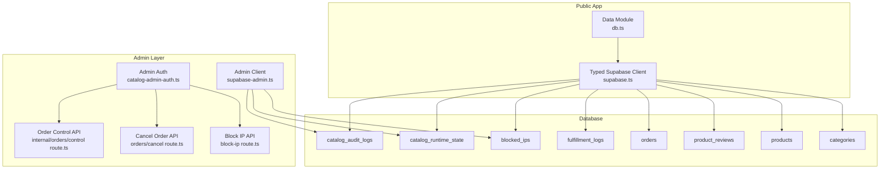
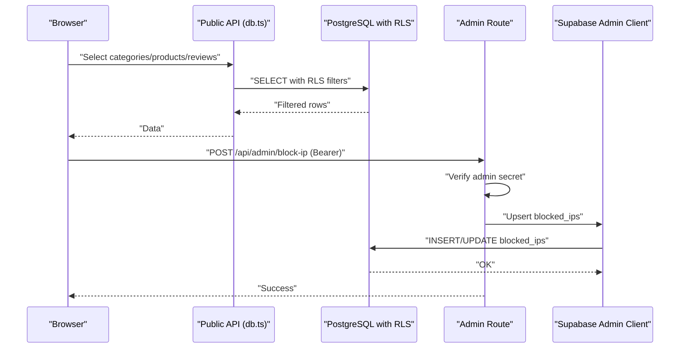
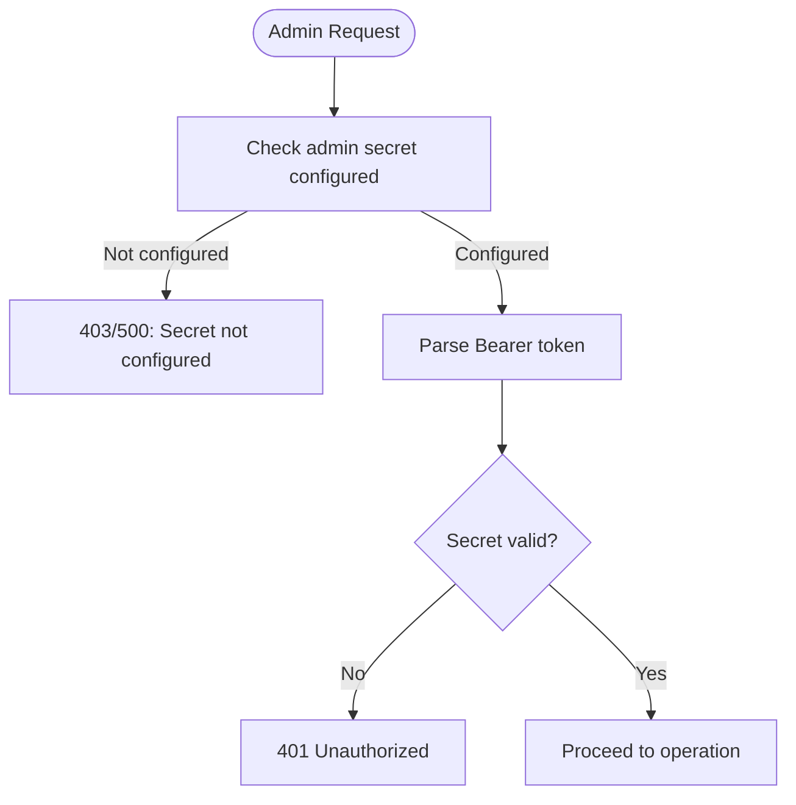
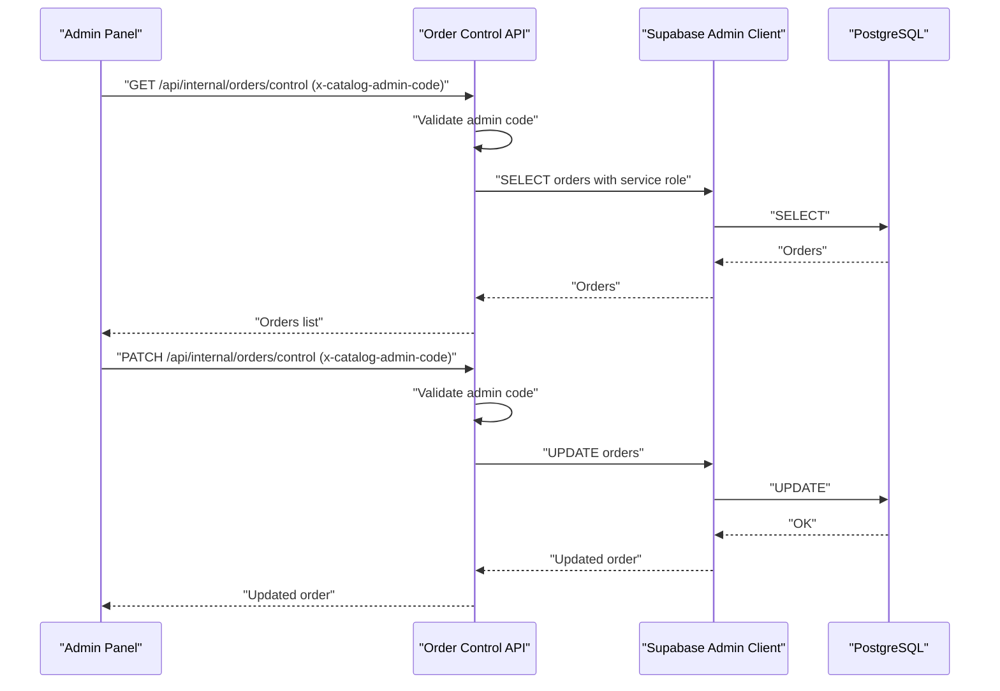
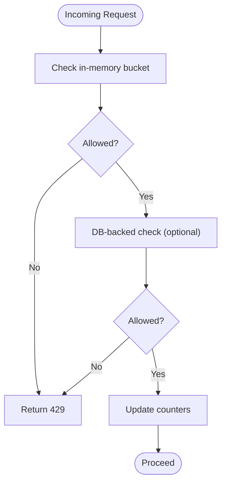
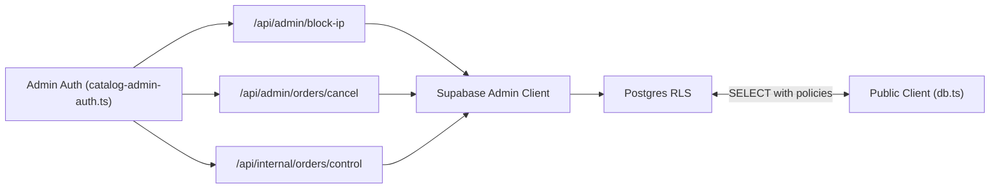

# Row Level Security & Access Control

<cite>
**Referenced Files in This Document**
- [01_schema.sql](file://sql/01_schema.sql)
- [20260311_security_performance_fixes.sql](file://supabase/migrations/20260311_security_performance_fixes.sql)
- [catalog-admin-auth.ts](file://src/lib/catalog-admin-auth.ts)
- [supabase.ts](file://src/lib/supabase.ts)
- [supabase-admin.ts](file://src/lib/supabase-admin.ts)
- [db.ts](file://src/lib/db.ts)
- [ip-block.ts](file://src/lib/ip-block.ts)
- [rate-limit.ts](file://src/lib/rate-limit.ts)
- [block-ip route.ts](file://src/app/api/admin/block-ip/route.ts)
- [orders/cancel route.ts](file://src/app/api/admin/orders/cancel/route.ts)
- [internal/orders/control route.ts](file://src/app/api/internal/orders/control/route.ts)
- [database types.ts](file://src/types/database.ts)
</cite>

## Table of Contents
1. [Introduction](#introduction)
2. [Project Structure](#project-structure)
3. [Core Components](#core-components)
4. [Architecture Overview](#architecture-overview)
5. [Detailed Component Analysis](#detailed-component-analysis)
6. [Dependency Analysis](#dependency-analysis)
7. [Performance Considerations](#performance-considerations)
8. [Troubleshooting Guide](#troubleshooting-guide)
9. [Conclusion](#conclusion)

## Introduction
This document explains AllShop’s Row Level Security (RLS) implementation and access control mechanisms. It details the RLS policies applied to each table, the security implications of each policy, and how they prevent unauthorized data access. It also documents the admin panel authentication and authorization logic, including the catalog_admin-auth.ts module, and clarifies how RLS interacts with Supabase authentication. Finally, it covers performance characteristics of RLS policies, monitoring approaches for security auditing, and best practices for secure database access.

## Project Structure
The security model spans three layers:
- Database schema and RLS policies in SQL migrations
- Public application access via typed Supabase client
- Admin-only operations via service role client and admin authentication

**Diagram sources**
- [01_schema.sql:194-240](file://sql/01_schema.sql#L194-L240)
- [supabase.ts:1-20](file://src/lib/supabase.ts#L1-L20)
- [db.ts:113-308](file://src/lib/db.ts#L113-L308)
- [catalog-admin-auth.ts:1-65](file://src/lib/catalog-admin-auth.ts#L1-L65)
- [supabase-admin.ts:1-31](file://src/lib/supabase-admin.ts#L1-L31)
- [block-ip route.ts:1-140](file://src/app/api/admin/block-ip/route.ts#L1-L140)
- [orders/cancel route.ts:1-237](file://src/app/api/admin/orders/cancel/route.ts#L1-L237)
- [internal/orders/control route.ts:1-664](file://src/app/api/internal/orders/control/route.ts#L1-L664)

**Section sources**
- [01_schema.sql:194-240](file://sql/01_schema.sql#L194-L240)
- [supabase.ts:1-20](file://src/lib/supabase.ts#L1-L20)
- [db.ts:113-308](file://src/lib/db.ts#L113-L308)
- [catalog-admin-auth.ts:1-65](file://src/lib/catalog-admin-auth.ts#L1-L65)
- [supabase-admin.ts:1-31](file://src/lib/supabase-admin.ts#L1-L31)
- [block-ip route.ts:1-140](file://src/app/api/admin/block-ip/route.ts#L1-L140)
- [orders/cancel route.ts:1-237](file://src/app/api/admin/orders/cancel/route.ts#L1-L237)
- [internal/orders/control route.ts:1-664](file://src/app/api/internal/orders/control/route.ts#L1-L664)

## Core Components
- RLS-enabled tables and policies: categories, products, product_reviews, orders, fulfillment_logs, blocked_ips, catalog_runtime_state, catalog_audit_logs
- Public client for frontend queries with RLS filters
- Admin-only endpoints guarded by admin secrets and service role access
- IP blocking and rate limiting with DB-backed enforcement for critical paths

**Section sources**
- [01_schema.sql:194-240](file://sql/01_schema.sql#L194-L240)
- [db.ts:113-308](file://src/lib/db.ts#L113-L308)
- [catalog-admin-auth.ts:1-65](file://src/lib/catalog-admin-auth.ts#L1-L65)
- [supabase-admin.ts:1-31](file://src/lib/supabase-admin.ts#L1-L31)
- [ip-block.ts:1-210](file://src/lib/ip-block.ts#L1-L210)
- [rate-limit.ts:1-165](file://src/lib/rate-limit.ts#L1-L165)

## Architecture Overview
The system enforces access control at the database level using RLS and augments it with admin-layer controls for sensitive operations.

**Diagram sources**
- [db.ts:113-308](file://src/lib/db.ts#L113-L308)
- [01_schema.sql:194-240](file://sql/01_schema.sql#L194-L240)
- [block-ip route.ts:1-140](file://src/app/api/admin/block-ip/route.ts#L1-L140)
- [supabase-admin.ts:1-31](file://src/lib/supabase-admin.ts#L1-L31)

## Detailed Component Analysis

### RLS Policies by Table
- categories
  - Policy: “Categories are viewable by everyone”
  - Effect: SELECT is permitted for all roles; no filtering
  - Security implication: Public browsing of categories is allowed; no sensitive fields
- products
  - Policy: “Products are viewable by everyone”
  - Effect: SELECT allowed when is_active = true
  - Security implication: Only active products are visible; inactive items are hidden
- product_reviews
  - Policy: “Product reviews are viewable by everyone”
  - Effect: SELECT allowed when is_approved = true AND is_verified_purchase = true
  - Policy: “Product reviews blocked for client roles”
  - Effect: ALL operations denied for anon/authenticated
  - Security implication: Reviews are shown only after moderation and verification; clients cannot insert or modify reviews
- orders
  - Policy: “Orders blocked for client roles”
  - Effect: ALL operations denied for anon/authenticated
  - Security implication: Clients cannot access order records; admin-only APIs handle order operations
- fulfillment_logs
  - Policy: “Fulfillment logs blocked for client roles”
  - Effect: ALL operations denied for anon/authenticated
  - Security implication: Fulfillment logs are restricted to admin operations
- blocked_ips
  - Policy: “Blocked IPs blocked for client roles”
  - Effect: ALL operations denied for anon/authenticated
  - Additional: Explicit deny-all policy; service_role bypasses RLS
  - Security implication: IP blocking is fully admin-controlled; clients cannot see or modify blocked IPs
- catalog_runtime_state
  - Policy: “Catalog runtime blocked for client roles”
  - Effect: ALL operations denied for anon/authenticated
  - Security implication: Runtime stock state is protected; only admin APIs can update
- catalog_audit_logs
  - Policy: “Catalog audit blocked for client roles”
  - Effect: ALL operations denied for anon/authenticated
  - Security implication: Audit trail is admin-only; prevents tampering and unauthorized inspection

**Section sources**
- [01_schema.sql:213-239](file://sql/01_schema.sql#L213-L239)

### Public Data Access (db.ts)
- categories: SELECT * ordered by name
- products: SELECT * filtered by is_active=true, ordered by created_at desc
- product_reviews: SELECT * filtered by product_id, is_approved=true AND is_verified_purchase=true, ordered by created_at desc, limited by caller
- These queries rely on RLS policies to enforce visibility; clients cannot bypass via public client

**Section sources**
- [db.ts:113-308](file://src/lib/db.ts#L113-L308)
- [01_schema.sql:213-221](file://sql/01_schema.sql#L213-L221)

### Admin Authentication and Authorization (catalog-admin-auth.ts)
- Admin code for internal admin panel: validated via header x-catalog-admin-code
- Admin secrets for privileged endpoints:
  - ADMIN_BLOCK_SECRET (preferred)
  - ORDER_LOOKUP_SECRET (fallback)
- Path token validation for certain endpoints
- Safe comparison using constant-time algorithm to mitigate timing attacks
- Bearer token parsing from Authorization header

**Diagram sources**
- [catalog-admin-auth.ts:27-54](file://src/lib/catalog-admin-auth.ts#L27-L54)
- [block-ip route.ts:24-41](file://src/app/api/admin/block-ip/route.ts#L24-L41)
- [orders/cancel route.ts:48-65](file://src/app/api/admin/orders/cancel/route.ts#L48-L65)

**Section sources**
- [catalog-admin-auth.ts:1-65](file://src/lib/catalog-admin-auth.ts#L1-L65)
- [block-ip route.ts:24-41](file://src/app/api/admin/block-ip/route.ts#L24-L41)
- [orders/cancel route.ts:48-65](file://src/app/api/admin/orders/cancel/route.ts#L48-L65)

### Admin Panel Access Control (internal/orders/control)
- Internal admin panel uses a separate admin code header (x-catalog-admin-code)
- Validates presence and correctness of admin code
- Uses supabase-admin client (service role) for order queries and updates
- Supports GET (list orders), PATCH (update status/notes), DELETE (remove order)

**Diagram sources**
- [internal/orders/control route.ts:59-79](file://src/app/api/internal/orders/control/route.ts#L59-L79)
- [supabase-admin.ts:18-31](file://src/lib/supabase-admin.ts#L18-L31)
- [01_schema.sql:194-240](file://sql/01_schema.sql#L194-L240)

**Section sources**
- [internal/orders/control route.ts:1-664](file://src/app/api/internal/orders/control/route.ts#L1-L664)
- [supabase-admin.ts:1-31](file://src/lib/supabase-admin.ts#L1-L31)

### IP Blocking and Rate Limiting
- IP blocking:
  - In-memory cache per instance with DB sync for reliability in serverless environments
  - Always verifies against DB for accurate enforcement
  - Upserts blocked_ips via service role client
- Rate limiting:
  - In-memory buckets per instance (best-effort in serverless)
  - DB-backed rate limits for critical paths using rate_limits table
  - Both approaches deny requests when limits exceeded

**Diagram sources**
- [rate-limit.ts:43-88](file://src/lib/rate-limit.ts#L43-L88)
- [rate-limit.ts:101-164](file://src/lib/rate-limit.ts#L101-L164)
- [20260311_security_performance_fixes.sql:48-76](file://supabase/migrations/20260311_security_performance_fixes.sql#L48-L76)

**Section sources**
- [ip-block.ts:25-72](file://src/lib/ip-block.ts#L25-L72)
- [ip-block.ts:103-171](file://src/lib/ip-block.ts#L103-L171)
- [rate-limit.ts:1-165](file://src/lib/rate-limit.ts#L1-L165)
- [20260311_security_performance_fixes.sql:48-76](file://supabase/migrations/20260311_security_performance_fixes.sql#L48-L76)

### Policy Violations and Examples
- Attempting to INSERT/UPDATE/DELETE on product_reviews as a client will fail under RLS because ALL operations are denied for client roles
- Attempting to access orders, fulfillment_logs, blocked_ips, catalog_runtime_state, or catalog_audit_logs via public client will return empty sets or permission errors
- Calling admin endpoints without a valid admin secret or code will return 401/403/500 depending on configuration state
- Using malformed tokens or missing Authorization header will cause admin endpoints to reject the request

**Section sources**
- [01_schema.sql:223-239](file://sql/01_schema.sql#L223-L239)
- [block-ip route.ts:35-41](file://src/app/api/admin/block-ip/route.ts#L35-L41)
- [internal/orders/control route.ts:60-79](file://src/app/api/internal/orders/control/route.ts#L60-L79)

## Dependency Analysis
- Public data access depends on typed Supabase client and RLS policies
- Admin operations depend on:
  - Admin authentication module for secrets/codes
  - Supabase admin client (service role) for unrestricted access to sensitive tables
- IP blocking and rate limiting depend on DB-backed tables and admin client for persistence

**Diagram sources**
- [db.ts:113-308](file://src/lib/db.ts#L113-L308)
- [catalog-admin-auth.ts:1-65](file://src/lib/catalog-admin-auth.ts#L1-L65)
- [block-ip route.ts:1-140](file://src/app/api/admin/block-ip/route.ts#L1-L140)
- [orders/cancel route.ts:1-237](file://src/app/api/admin/orders/cancel/route.ts#L1-L237)
- [internal/orders/control route.ts:1-664](file://src/app/api/internal/orders/control/route.ts#L1-L664)
- [supabase-admin.ts:1-31](file://src/lib/supabase-admin.ts#L1-L31)

**Section sources**
- [db.ts:113-308](file://src/lib/db.ts#L113-L308)
- [catalog-admin-auth.ts:1-65](file://src/lib/catalog-admin-auth.ts#L1-L65)
- [supabase-admin.ts:1-31](file://src/lib/supabase-admin.ts#L1-L31)

## Performance Considerations
- RLS evaluation occurs per-row during SELECT; keep filters selective (e.g., is_active, approved+verified) to minimize scans
- Indexes improve performance:
  - Products: active and slug indexes
  - Orders: status, created_at, pending-created_at partial index
  - Reviews: public index on product_id with partial condition
  - Blocked IPs and rate limits: expiry and reset indexes
- Admin operations use service role bypass; avoid unnecessary RLS overhead for trusted backend paths
- In-memory caches for IP blocking and rate limiting reduce DB load but are best-effort in serverless; DB-backed fallback ensures correctness

**Section sources**
- [01_schema.sql:139-159](file://sql/01_schema.sql#L139-L159)
- [20260311_security_performance_fixes.sql:6-21](file://supabase/migrations/20260311_security_performance_fixes.sql#L6-L21)
- [ip-block.ts:19-21](file://src/lib/ip-block.ts#L19-L21)
- [rate-limit.ts:30-38](file://src/lib/rate-limit.ts#L30-L38)

## Troubleshooting Guide
- Symptom: Clients cannot see orders or reviews
  - Cause: RLS denies client access to orders and product_reviews; only approved+verified reviews are shown
  - Action: Verify RLS policies and ensure product_reviews moderation flags are set appropriately
- Symptom: Admin endpoints return 401 or 500
  - Cause: Missing or invalid admin secret/token, or admin code not configured
  - Action: Confirm environment variables and admin code; ensure Authorization header is present
- Symptom: IP blocking appears inconsistent across instances
  - Cause: In-memory cache per instance; relies on DB for authoritative checks
  - Action: Ensure DB connectivity and verify blocked_ips entries; allow DB sync to refresh cache
- Symptom: Rate limiting seems unreliable in production
  - Cause: In-memory buckets are per-instance; DB-backed limits recommended for critical paths
  - Action: Enable DB-backed rate limits and monitor rate_limits table

**Section sources**
- [01_schema.sql:223-239](file://sql/01_schema.sql#L223-L239)
- [block-ip route.ts:24-41](file://src/app/api/admin/block-ip/route.ts#L24-L41)
- [internal/orders/control route.ts:60-79](file://src/app/api/internal/orders/control/route.ts#L60-L79)
- [ip-block.ts:25-72](file://src/lib/ip-block.ts#L25-L72)
- [rate-limit.ts:101-164](file://src/lib/rate-limit.ts#L101-L164)

## Conclusion
AllShop’s security model combines database-level RLS with admin-layer controls to protect sensitive data and operations. Public clients are restricted to curated views of categories, active products, and approved reviews. Admin-only endpoints enforce strict authentication and authorization using dedicated secrets and service role clients. IP blocking and rate limiting provide layered defenses, with DB-backed mechanisms ensuring correctness in serverless environments. Proper configuration of environment variables and adherence to best practices will maintain strong access control and auditability.