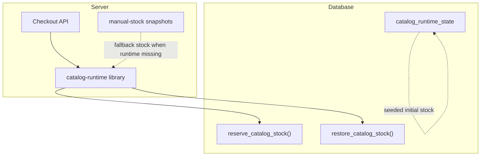
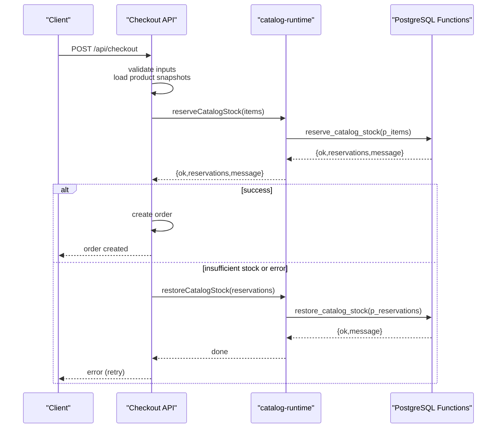
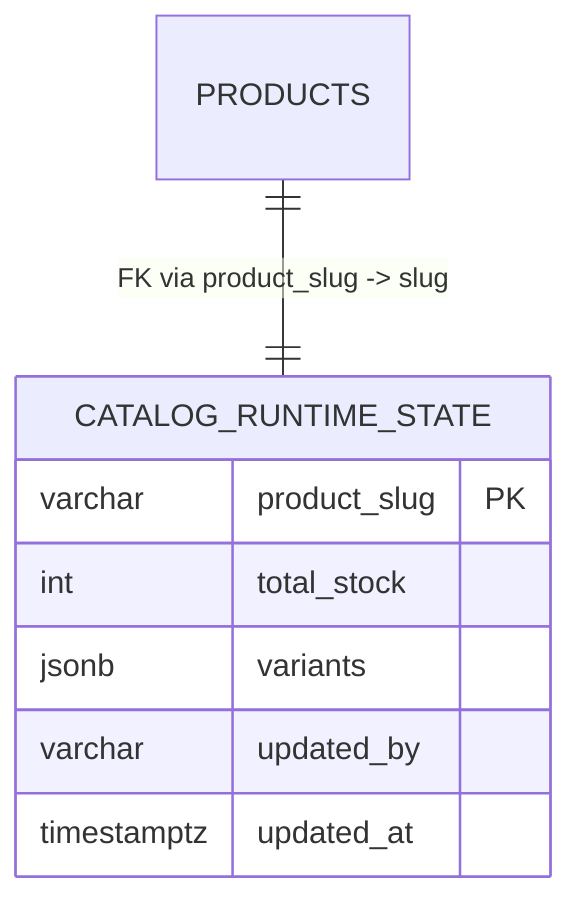
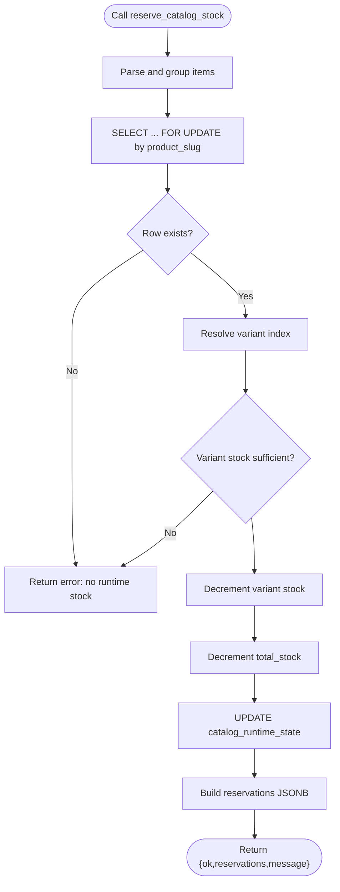
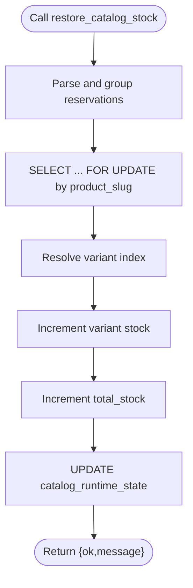
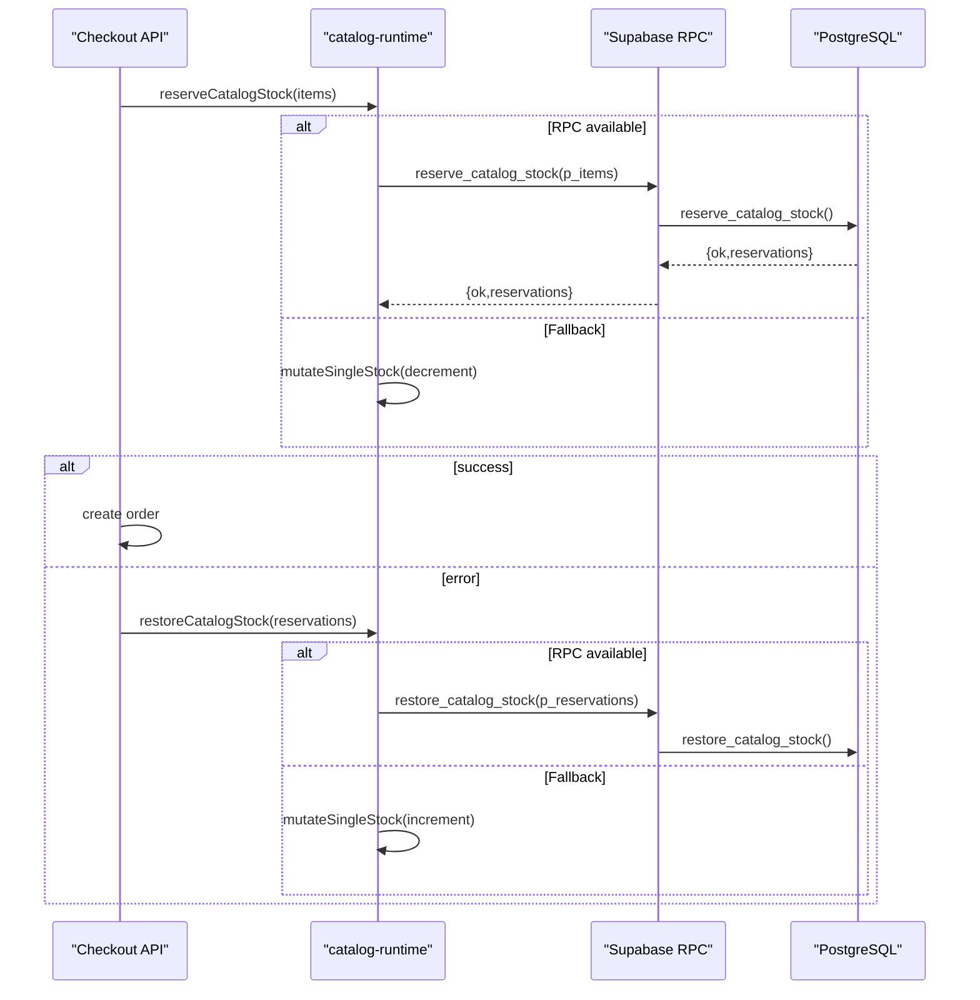
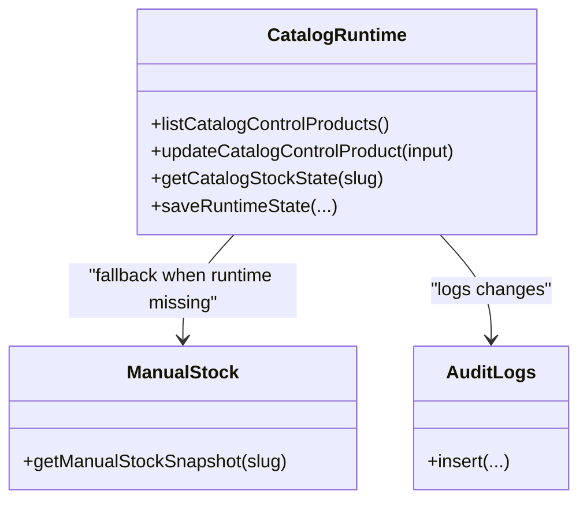
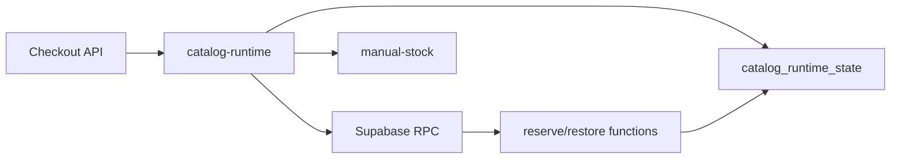

# Stock Management System

<cite>
**Referenced Files in This Document**
- [03_runtime_stock.sql](file://sql/03_runtime_stock.sql)
- [01_schema.sql](file://sql/01_schema.sql)
- [catalog-runtime.ts](file://src/lib/catalog-runtime.ts)
- [manual-stock.ts](file://src/lib/manual-stock.ts)
- [route.ts](file://src/app/api/checkout/route.ts)
- [checkout-idempotency.ts](file://src/lib/checkout-idempotency.ts)
- [route.ts](file://src/app/api/internal/orders/control/route.ts)
</cite>

## Table of Contents
1. [Introduction](#introduction)
2. [Project Structure](#project-structure)
3. [Core Components](#core-components)
4. [Architecture Overview](#architecture-overview)
5. [Detailed Component Analysis](#detailed-component-analysis)
6. [Dependency Analysis](#dependency-analysis)
7. [Performance Considerations](#performance-considerations)
8. [Troubleshooting Guide](#troubleshooting-guide)
9. [Conclusion](#conclusion)

## Introduction
This document explains AllShop’s transactional stock management system. It covers the catalog_runtime_state table design for real-time inventory tracking, the PostgreSQL functions that reserve and restore stock atomically, the checkout workflow that validates quantities and handles rollbacks, and the admin-managed manual stock features. It also documents performance characteristics for high-concurrency scenarios and the role of advisory locks in preventing race conditions.

## Project Structure
The stock management system spans:
- Database schema and runtime stock table
- PostgreSQL functions for atomic stock operations
- Frontend/backend checkout flow
- Admin control surface for manual stock updates

**Diagram sources**
- [03_runtime_stock.sql:8-46](file://sql/03_runtime_stock.sql#L8-L46)
- [01_schema.sql:253-493](file://sql/01_schema.sql#L253-L493)
- [catalog-runtime.ts:293-363](file://src/lib/catalog-runtime.ts#L293-L363)
- [manual-stock.ts:89-100](file://src/lib/manual-stock.ts#L89-L100)

**Section sources**
- [03_runtime_stock.sql:8-46](file://sql/03_runtime_stock.sql#L8-L46)
- [01_schema.sql:253-493](file://sql/01_schema.sql#L253-L493)
- [catalog-runtime.ts:13-28](file://src/lib/catalog-runtime.ts#L13-L28)
- [manual-stock.ts:14-76](file://src/lib/manual-stock.ts#L14-L76)

## Core Components
- catalog_runtime_state: Stores total_stock and variants JSONB for each product slug, enabling real-time, variant-aware stock tracking.
- reserve_catalog_stock: PostgreSQL function that atomically decrements variant and/or total stock for checkout reservations.
- restore_catalog_stock: PostgreSQL function that atomically restores reserved stock on rollback.
- catalog-runtime library: Orchestrates RPC calls to the PostgreSQL functions, local fallbacks, and low-stock alerts; provides manual stock mutation and admin control.
- checkout API: Drives the checkout flow, validates items, reserves stock, persists orders, and triggers rollbacks on failure.
- manual-stock snapshots: Admin-controlled stock fallback when runtime table is unavailable.

**Section sources**
- [03_runtime_stock.sql:8-46](file://sql/03_runtime_stock.sql#L8-L46)
- [01_schema.sql:253-493](file://sql/01_schema.sql#L253-L493)
- [catalog-runtime.ts:1212-1304](file://src/lib/catalog-runtime.ts#L1212-L1304)
- [route.ts:497-800](file://src/app/api/checkout/route.ts#L497-L800)
- [manual-stock.ts:14-76](file://src/lib/manual-stock.ts#L14-L76)

## Architecture Overview
The system ensures isolation and correctness during checkout by:
- Using PostgreSQL functions with row-level locking to prevent race conditions.
- Grouping and deduplicating checkout items to avoid double-counting.
- Persisting orders only after successful stock reservation.
- Rolling back stock reservations automatically on order creation errors.

**Diagram sources**
- [route.ts:497-800](file://src/app/api/checkout/route.ts#L497-L800)
- [catalog-runtime.ts:1212-1281](file://src/lib/catalog-runtime.ts#L1212-L1281)
- [01_schema.sql:253-395](file://sql/01_schema.sql#L253-L395)
- [01_schema.sql:397-493](file://sql/01_schema.sql#L397-L493)

## Detailed Component Analysis

### catalog_runtime_state table design
- Primary key: product_slug referencing products(slug) with cascade delete.
- total_stock: integer check constraint ensuring non-negative or null.
- variants: JSONB array storing variant stock, name, and optional variation_id.
- Index: updated_at descending to support versioning queries.
- Seeding: Initial stock is inserted/upserted for multiple products, including variant arrays.

**Diagram sources**
- [03_runtime_stock.sql:8-18](file://sql/03_runtime_stock.sql#L8-L18)
- [03_runtime_stock.sql:19-43](file://sql/03_runtime_stock.sql#L19-L43)

**Section sources**
- [03_runtime_stock.sql:8-18](file://sql/03_runtime_stock.sql#L8-L18)
- [03_runtime_stock.sql:19-43](file://sql/03_runtime_stock.sql#L19-L43)

### reserve_catalog_stock PostgreSQL function
- Accepts p_items JSONB array of {slug, variant, quantity}.
- Groups items by slug and variant, summing quantities.
- Locks the row for update to prevent concurrent modifications.
- Validates variant presence for multi-variant products.
- Decrements variant stock (if present) and total_stock atomically.
- Returns a JSONB payload with ok flag, reservations, and message.

**Diagram sources**
- [01_schema.sql:253-395](file://sql/01_schema.sql#L253-L395)

**Section sources**
- [01_schema.sql:253-395](file://sql/01_schema.sql#L253-L395)

### restore_catalog_stock PostgreSQL function
- Accepts p_reservations JSONB array of {slug, variant, quantity}.
- Groups by slug and variant, summing quantities.
- Locks the row for update.
- Increments variant stock (if present) and total_stock atomically.
- Returns a success message indicating restoration.

**Diagram sources**
- [01_schema.sql:397-493](file://sql/01_schema.sql#L397-L493)

**Section sources**
- [01_schema.sql:397-493](file://sql/01_schema.sql#L397-L493)

### checkout stock reservation workflow
- The checkout API:
  - Normalizes and groups items.
  - Calls reserveCatalogStock, which:
    - Uses RPC reserve_catalog_stock when available.
    - Falls back to local mutateSingleStock for manual stock adjustments.
  - On success, proceeds to create the order.
  - On failure, restores stock via restoreCatalogStock, which:
    - Uses RPC restore_catalog_stock when available.
    - Falls back to local mutateSingleStock incrementing stock.

**Diagram sources**
- [route.ts:663-685](file://src/app/api/checkout/route.ts#L663-L685)
- [catalog-runtime.ts:1212-1281](file://src/lib/catalog-runtime.ts#L1212-L1281)
- [catalog-runtime.ts:1283-1304](file://src/lib/catalog-runtime.ts#L1283-L1304)
- [01_schema.sql:253-395](file://sql/01_schema.sql#L253-L395)
- [01_schema.sql:397-493](file://sql/01_schema.sql#L397-L493)

**Section sources**
- [route.ts:663-685](file://src/app/api/checkout/route.ts#L663-L685)
- [catalog-runtime.ts:1212-1281](file://src/lib/catalog-runtime.ts#L1212-L1281)
- [catalog-runtime.ts:1283-1304](file://src/lib/catalog-runtime.ts#L1283-L1304)

### Variant-specific stock tracking and quantity validation
- Variant resolution:
  - For multi-variant products, variant must be specified; otherwise, the function fails.
  - For single-variant products, variant is optional and defaults to the sole variant.
- Validation:
  - Variant stock must be >= requested quantity.
  - Total stock must be >= requested quantity when applicable.
- Deduplication:
  - Items are grouped by slug+variant to avoid double counting.

**Section sources**
- [01_schema.sql:319-337](file://sql/01_schema.sql#L319-L337)
- [01_schema.sql:342-348](file://sql/01_schema.sql#L342-L348)
- [01_schema.sql:362-368](file://sql/01_schema.sql#L362-L368)
- [catalog-runtime.ts:1215-1236](file://src/lib/catalog-runtime.ts#L1215-L1236)

### Automatic rollback mechanisms
- On order creation failure (e.g., duplicate payment_id), the system restores stock immediately.
- Rollback uses RPC restore_catalog_stock if available; otherwise falls back to local mutation.

**Section sources**
- [route.ts:767-795](file://src/app/api/checkout/route.ts#L767-L795)
- [catalog-runtime.ts:1283-1304](file://src/lib/catalog-runtime.ts#L1283-L1304)

### Manual stock management features
- Admin control:
  - listCatalogControlProducts and updateCatalogControlProduct enable viewing and updating stock.
  - updateCatalogControlProduct writes to catalog_runtime_state and logs changes to catalog_audit_logs.
- Local manual snapshots:
  - getManualStockSnapshot provides a static fallback when runtime table is missing.
- Low stock alerts:
  - notifyLowStockIfNeeded and notifyLowStockForReservations trigger alerts when thresholds are met.

**Diagram sources**
- [catalog-runtime.ts:960-1030](file://src/lib/catalog-runtime.ts#L960-L1030)
- [catalog-runtime.ts:1032-1210](file://src/lib/catalog-runtime.ts#L1032-L1210)
- [manual-stock.ts:89-100](file://src/lib/manual-stock.ts#L89-L100)

**Section sources**
- [catalog-runtime.ts:960-1030](file://src/lib/catalog-runtime.ts#L960-L1030)
- [catalog-runtime.ts:1032-1210](file://src/lib/catalog-runtime.ts#L1032-L1210)
- [manual-stock.ts:14-76](file://src/lib/manual-stock.ts#L14-L76)

### Examples of stock reservation scenarios
- Single-variant product:
  - Request: {slug: "product-a", quantity: 2}
  - Behavior: Decrements total_stock by 2; variant stock unchanged.
- Multi-variant product:
  - Request: {slug: "product-b", variant: "Red", quantity: 1}
  - Behavior: Decrements variant "Red" stock; if variant stock < 1, fails.
- Mixed items:
  - Request: two entries for same slug with different variants
  - Behavior: Items are grouped and summed before decrement.

**Section sources**
- [01_schema.sql:282-295](file://sql/01_schema.sql#L282-L295)
- [01_schema.sql:319-337](file://sql/01_schema.sql#L319-L337)
- [catalog-runtime.ts:1215-1236](file://src/lib/catalog-runtime.ts#L1215-L1236)

### Error handling for insufficient stock
- reserve_catalog_stock returns an error message when:
  - No runtime stock exists for the slug.
  - Variant is missing for multi-variant products.
  - Variant stock or total stock is insufficient.
- The checkout API surfaces these messages to the client and triggers rollback.

**Section sources**
- [01_schema.sql:303-309](file://sql/01_schema.sql#L303-L309)
- [01_schema.sql:330-336](file://sql/01_schema.sql#L330-L336)
- [01_schema.sql:342-348](file://sql/01_schema.sql#L342-L348)
- [01_schema.sql:362-368](file://sql/01_schema.sql#L362-L368)
- [route.ts:674-683](file://src/app/api/checkout/route.ts#L674-L683)

### Relationship between catalog_runtime_state and physical inventory
- catalog_runtime_state reflects operational stock visible to customers and used for checkout reservations.
- Physical inventory is managed externally; catalog_runtime_state is the source of truth for real-time availability.
- Admin updates via the control panel write to catalog_runtime_state, optionally logging changes.

**Section sources**
- [03_runtime_stock.sql:19-43](file://sql/03_runtime_stock.sql#L19-L43)
- [catalog-runtime.ts:1032-1210](file://src/lib/catalog-runtime.ts#L1032-L1210)

## Dependency Analysis
- The checkout API depends on catalog-runtime for stock operations.
- catalog-runtime depends on:
  - Supabase RPC for reserve_catalog_stock and restore_catalog_stock.
  - catalog_runtime_state for persisted stock.
  - manual-stock snapshots for fallback.
- PostgreSQL functions depend on catalog_runtime_state and enforce atomicity via row-level locking.

**Diagram sources**
- [route.ts:497-800](file://src/app/api/checkout/route.ts#L497-L800)
- [catalog-runtime.ts:1212-1304](file://src/lib/catalog-runtime.ts#L1212-L1304)
- [01_schema.sql:253-493](file://sql/01_schema.sql#L253-L493)

**Section sources**
- [route.ts:497-800](file://src/app/api/checkout/route.ts#L497-L800)
- [catalog-runtime.ts:1212-1304](file://src/lib/catalog-runtime.ts#L1212-L1304)
- [01_schema.sql:253-493](file://sql/01_schema.sql#L253-L493)

## Performance Considerations
- High-concurrency checkout:
  - reserve_catalog_stock and restore_catalog_stock use row-level locks to serialize updates per product slug.
  - Grouping items reduces the number of DB round-trips and minimizes contention.
- Advisory locks:
  - Not explicitly used in the provided code; however, row-level FOR UPDATE on product_slug provides strong isolation for concurrent reservations.
- Retry and fallback:
  - catalog-runtime retries local mutations and falls back to RPC when available, improving resilience under transient failures.
- Indexing:
  - The updated_at index supports versioning queries and efficient ordering.

**Section sources**
- [01_schema.sql:299-301](file://sql/01_schema.sql#L299-L301)
- [01_schema.sql:437-439](file://sql/01_schema.sql#L437-L439)
- [catalog-runtime.ts:14-18](file://src/lib/catalog-runtime.ts#L14-L18)
- [catalog-runtime.ts:698-730](file://src/lib/catalog-runtime.ts#L698-L730)
- [03_runtime_stock.sql:16-17](file://sql/03_runtime_stock.sql#L16-L17)

## Troubleshooting Guide
- Missing catalog_runtime_state table:
  - Symptoms: Errors indicating the table does not exist when fetching runtime rows or saving runtime state.
  - Resolution: Run the schema migration that creates and seeds catalog_runtime_state.
- Missing PostgreSQL functions:
  - Symptoms: Errors stating reserve_catalog_stock or restore_catalog_stock could not be found.
  - Resolution: Ensure the schema migration containing the functions is applied.
- Insufficient stock:
  - Symptoms: Reservation fails with a message indicating lack of variant or total stock.
  - Resolution: Adjust quantities or variants; verify stock via admin control panel.
- Order creation failure:
  - Symptoms: Duplicate payment_id or other DB errors during order insert.
  - Resolution: The system automatically restores stock; inspect logs and retry after correcting inputs.
- Idempotency:
  - The checkout endpoint uses idempotency keys to prevent duplicate orders; ensure proper key generation and reuse semantics.

**Section sources**
- [catalog-runtime.ts:479-494](file://src/lib/catalog-runtime.ts#L479-L494)
- [catalog-runtime.ts:625-632](file://src/lib/catalog-runtime.ts#L625-L632)
- [catalog-runtime.ts:309-316](file://src/lib/catalog-runtime.ts#L309-L316)
- [catalog-runtime.ts:356-362](file://src/lib/catalog-runtime.ts#L356-L362)
- [route.ts:767-795](file://src/app/api/checkout/route.ts#L767-L795)
- [checkout-idempotency.ts:14-32](file://src/lib/checkout-idempotency.ts#L14-L32)

## Conclusion
AllShop’s stock management system combines a robust runtime table with atomic PostgreSQL functions to guarantee accurate, real-time inventory during checkout. The design supports variant-specific tracking, automatic rollbacks, admin-managed updates, and resilient fallbacks. While advisory locks are not used, row-level locking in the functions provides strong concurrency control suitable for high-throughput scenarios.