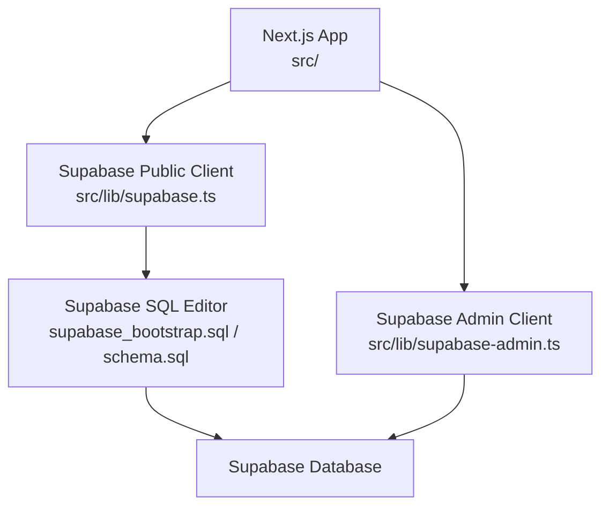
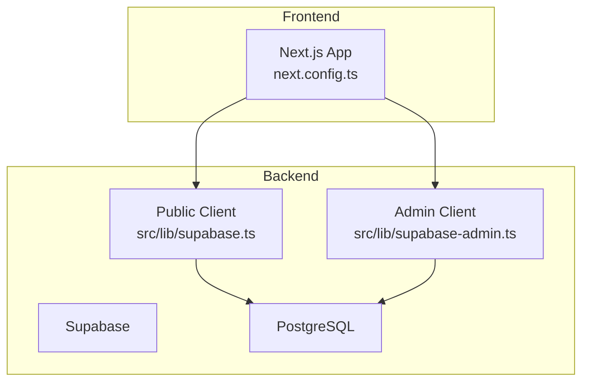
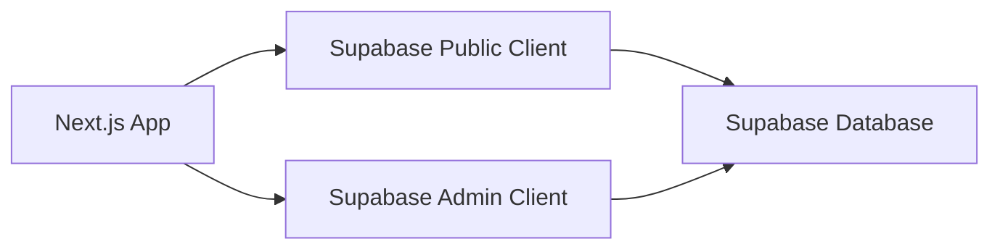

# Deployment & DevOps

<cite>
**Referenced Files in This Document**
- [package.json](file://package.json)
- [README.md](file://README.md)
- [next.config.ts](file://next.config.ts)
- [supabase_bootstrap.sql](file://supabase_bootstrap.sql)
- [schema.sql](file://schema.sql)
- [supabase/migrations/20260311_security_performance_fixes.sql](file://supabase/migrations/20260311_security_performance_fixes.sql)
- [src/lib/db.ts](file://src/lib/db.ts)
- [src/lib/supabase.ts](file://src/lib/supabase.ts)
- [src/lib/supabase-admin.ts](file://src/lib/supabase-admin.ts)
</cite>

## Table of Contents
1. [Introduction](#introduction)
2. [Project Structure](#project-structure)
3. [Core Components](#core-components)
4. [Architecture Overview](#architecture-overview)
5. [Detailed Component Analysis](#detailed-component-analysis)
6. [Dependency Analysis](#dependency-analysis)
7. [Performance Considerations](#performance-considerations)
8. [Troubleshooting Guide](#troubleshooting-guide)
9. [Conclusion](#conclusion)
10. [Appendices](#appendices)

## Introduction
This document describes deployment and DevOps practices for AllShop, focusing on the deployment pipeline, environment configuration management, and production monitoring. It explains how to deploy the Next.js application to Vercel, manage Supabase database migrations, and handle environment variables across environments. It also covers CI/CD workflows, automated testing, rollback procedures, infrastructure provisioning touchpoints, security scanning, and performance monitoring. Practical examples illustrate deployment workflows, environment management, and operational procedures for maintaining a reliable ecommerce platform.

## Project Structure
AllShop is a Next.js 16 application with a Supabase backend. The repository includes:
- Application code under src/
- Supabase bootstrap and migration scripts under supabase_bootstrap.sql, schema.sql, and supabase/migrations/
- Build and test scripts in package.json
- Environment variable guidance in README.md
- Production hardening via next.config.ts (security headers, image hosts, caching)

**Diagram sources**
- [src/lib/supabase.ts:1-20](file://src/lib/supabase.ts#L1-L20)
- [src/lib/supabase-admin.ts:1-31](file://src/lib/supabase-admin.ts#L1-L31)
- [supabase_bootstrap.sql:1-120](file://supabase_bootstrap.sql#L1-L120)
- [schema.sql:1-230](file://schema.sql#L1-L230)

**Section sources**
- [package.json:1-49](file://package.json#L1-L49)
- [README.md:100-127](file://README.md#L100-L127)
- [next.config.ts:53-117](file://next.config.ts#L53-L117)

## Core Components
- Next.js application with production-grade security headers and image optimization configuration.
- Supabase integration for public and admin operations, including typed public client and untyped admin client for dynamic tables and RPCs.
- Database bootstrap and migration assets for schema, RLS, indexes, and helper functions.
- Environment variable management for local development and production deployments.

Key implementation details:
- Security headers and cache-control policies are applied in production via next.config.ts.
- Supabase public client reads NEXT_PUBLIC_SUPABASE_URL and NEXT_PUBLIC_SUPABASE_ANON_KEY.
- Supabase admin client reads NEXT_PUBLIC_SUPABASE_URL and SUPABASE_SERVICE_ROLE_KEY.
- Database initialization and migrations are provided via supabase_bootstrap.sql and supabase/migrations/.

**Section sources**
- [next.config.ts:6-27](file://next.config.ts#L6-L27)
- [next.config.ts:53-117](file://next.config.ts#L53-L117)
- [src/lib/supabase.ts:4-12](file://src/lib/supabase.ts#L4-L12)
- [src/lib/supabase-admin.ts:15-23](file://src/lib/supabase-admin.ts#L15-L23)
- [supabase_bootstrap.sql:15-250](file://supabase_bootstrap.sql#L15-L250)
- [supabase/migrations/20260311_security_performance_fixes.sql:6-86](file://supabase/migrations/20260311_security_performance_fixes.sql#L6-L86)

## Architecture Overview
The deployment architecture ties the frontend (Next.js/Vercel) to the backend (Supabase). The application uses:
- Public client for read/write operations against Supabase tables with RLS policies.
- Admin client for privileged operations (e.g., catalog runtime updates, IP/rate-limit management) using the service role key.
- Database bootstrap and migrations to define schema, indexes, triggers, RLS, and helper functions.

**Diagram sources**
- [next.config.ts:53-117](file://next.config.ts#L53-L117)
- [src/lib/supabase.ts:1-20](file://src/lib/supabase.ts#L1-L20)
- [src/lib/supabase-admin.ts:1-31](file://src/lib/supabase-admin.ts#L1-L31)

## Detailed Component Analysis

### Vercel Deployment Pipeline
- Build and start commands are defined in package.json.
- Environment variables are managed per Vercel project environment (development, preview, production).
- Recommended to set NEXT_PUBLIC_APP_URL, NEXT_PUBLIC_SUPABASE_URL, NEXT_PUBLIC_SUPABASE_ANON_KEY, SUPABASE_SERVICE_ROLE_KEY, ORDER_LOOKUP_SECRET, CSRF_SECRET, SMTP credentials, ADMIN_BLOCK_SECRET, CATALOG_ADMIN_ACCESS_CODE, CATALOG_ADMIN_PATH_TOKEN, and optional flags.

Practical steps:
- Configure project settings in Vercel to inject environment variables per stage.
- Use Vercel’s preview deployments for pull request validation.
- Lock down production secrets and enable encrypted environment variables.

**Section sources**
- [package.json:5-11](file://package.json#L5-L11)
- [README.md:10-61](file://README.md#L10-L61)

### Supabase Database Migrations
- Initial bootstrap: Run supabase_bootstrap.sql in the Supabase SQL Editor to create schema, indexes, RLS, triggers, and helper functions.
- Incremental migrations: Apply supabase/migrations/20260311_security_performance_fixes.sql for performance and security improvements.
- For existing databases, apply compatibility alterations and indexes as needed.

Operational guidance:
- Always test migrations in staging before applying to production.
- Use Supabase SQL Editor for controlled execution and review.
- Keep migration scripts idempotent and documented.

**Section sources**
- [supabase_bootstrap.sql:1-120](file://supabase_bootstrap.sql#L1-L120)
- [supabase/migrations/20260311_security_performance_fixes.sql:1-86](file://supabase/migrations/20260311_security_performance_fixes.sql#L1-L86)

### Environment Variable Management
- Local development: Use .env.local with NEXT_PUBLIC_APP_URL, Supabase keys, security secrets, SMTP, admin codes, and optional flags.
- Staging/Production: Manage via Vercel project settings; separate environment-specific values for URLs, keys, and flags.
- Critical variables include Supabase keys, ORDER_LOOKUP_SECRET, CSRF_SECRET, SMTP, ADMIN_BLOCK_SECRET, CATALOG_ADMIN_ACCESS_CODE, and CATALOG_ADMIN_PATH_TOKEN.

Best practices:
- Never commit secrets to version control.
- Use Vercel’s encrypted environment variables for production.
- Validate presence of required variables during build/start.

**Section sources**
- [README.md:10-61](file://README.md#L10-L61)
- [src/lib/supabase.ts:4-12](file://src/lib/supabase.ts#L4-L12)
- [src/lib/supabase-admin.ts:15-23](file://src/lib/supabase-admin.ts#L15-L23)

### CI/CD Workflows and Automated Testing
- Testing: npm run test executes Vitest tests.
- Linting and build validation: npm run lint and npm run build.
- Recommended CI tasks:
  - Run lint and tests on pull requests.
  - Build and preview on PRs.
  - Gate production deployments with successful tests and builds.
  - Store Supabase service role key and Vercel secrets in CI securely.

**Section sources**
- [package.json:9-11](file://package.json#L9-L11)
- [README.md:107-113](file://README.md#L107-L113)

### Rollback Procedures
- Frontend rollback:
  - Re-deploy the previous working Vercel release.
  - If environment drift occurred, re-apply the last known good migration set in Supabase SQL Editor.
- Database rollback:
  - Revert to the last known good migration snapshot.
  - If irreversible changes were made, restore from the latest database backup.
- Communication:
  - Notify stakeholders and monitor error rates after rollback.

**Section sources**
- [supabase/migrations/20260311_security_performance_fixes.sql:72-77](file://supabase/migrations/20260311_security_performance_fixes.sql#L72-L77)

### Infrastructure Provisioning Touchpoints
- Supabase:
  - Use Supabase SQL Editor to run bootstrap and migrations.
  - Enable Row Level Security and configure policies as defined in schema and bootstrap scripts.
- Vercel:
  - Connect Git repository and configure environment variables per stage.
  - Use Vercel Analytics and Speed Insights for performance telemetry.

**Section sources**
- [supabase_bootstrap.sql:202-249](file://supabase_bootstrap.sql#L202-L249)
- [next.config.ts:6-27](file://next.config.ts#L6-L27)

### Security Scanning and Hardening
- Security headers: next.config.ts configures strict headers for production.
- Image hosts: next.config.ts dynamically adds image hosts from environment variables.
- Supabase RLS: Policies restrict client access to sensitive tables; service role bypasses RLS for backend operations.
- Secrets: Use service role key and admin secrets; avoid exposing to the client.

**Section sources**
- [next.config.ts:6-27](file://next.config.ts#L6-L27)
- [next.config.ts:31-51](file://next.config.ts#L31-L51)
- [supabase_bootstrap.sql:202-249](file://supabase_bootstrap.sql#L202-L249)

### Monitoring and Alerting
- Frontend telemetry:
  - @vercel/analytics and @vercel/speed-insights are included; configure in Vercel for analytics.
- Database monitoring:
  - Track slow queries and index usage; leverage created indexes for performance.
- Alerts:
  - Monitor deployment health, database connectivity, and critical endpoints.
  - Integrate with external alerting systems as needed.

**Section sources**
- [package.json:14-15](file://package.json#L14-L15)
- [supabase/migrations/20260311_security_performance_fixes.sql:6-21](file://supabase/migrations/20260311_security_performance_fixes.sql#L6-L21)

## Dependency Analysis
The application depends on Supabase for data persistence and authentication. The public client is used for most operations, while the admin client is reserved for privileged actions.

**Diagram sources**
- [src/lib/supabase.ts:1-20](file://src/lib/supabase.ts#L1-L20)
- [src/lib/supabase-admin.ts:1-31](file://src/lib/supabase-admin.ts#L1-L31)

**Section sources**
- [src/lib/db.ts:1-309](file://src/lib/db.ts#L1-L309)
- [src/lib/supabase.ts:1-20](file://src/lib/supabase.ts#L1-L20)
- [src/lib/supabase-admin.ts:1-31](file://src/lib/supabase-admin.ts#L1-L31)

## Performance Considerations
- Image optimization: next.config.ts configures formats, cache TTLs, and remote patterns for Supabase-hosted images.
- Caching: Production-specific cache-control headers reduce bandwidth and latency.
- Database indexes: Created indexes improve query performance for orders, products, and runtime catalog state.

Recommendations:
- Monitor image load performance and adjust formats and sizes.
- Review cache-control headers periodically.
- Add database monitoring and query profiling in production.

**Section sources**
- [next.config.ts:64-74](file://next.config.ts#L64-L74)
- [next.config.ts:75-113](file://next.config.ts#L75-L113)
- [supabase/migrations/20260311_security_performance_fixes.sql:6-21](file://supabase/migrations/20260311_security_performance_fixes.sql#L6-L21)

## Troubleshooting Guide
Common deployment issues and resolutions:
- Database migration failures:
  - Validate that supabase_bootstrap.sql and migration scripts are executed in order.
  - Check for conflicting policies and indexes; ensure RLS is enabled as intended.
- Environment sync problems:
  - Confirm NEXT_PUBLIC_SUPABASE_URL and NEXT_PUBLIC_SUPABASE_ANON_KEY match the target Supabase project.
  - Verify SUPABASE_SERVICE_ROLE_KEY is present for admin operations.
- Rollback scenarios:
  - Re-deploy the previous known-good Vercel release.
  - Re-apply the last known-good migration set in Supabase SQL Editor.
- Supabase connectivity:
  - Ensure environment variables are set in Vercel project settings.
  - Confirm Supabase project is reachable and not rate-limited.

**Section sources**
- [supabase/migrations/20260311_security_performance_fixes.sql:33-43](file://supabase/migrations/20260311_security_performance_fixes.sql#L33-L43)
- [src/lib/supabase.ts:4-12](file://src/lib/supabase.ts#L4-L12)
- [src/lib/supabase-admin.ts:15-23](file://src/lib/supabase-admin.ts#L15-L23)

## Conclusion
AllShop’s deployment and DevOps model centers on a secure Next.js frontend deployed to Vercel and a hardened Supabase backend. By following the outlined practices—secure environment variable management, controlled database migrations, CI/CD gating, and robust monitoring—you can maintain a reliable ecommerce platform with predictable deployments and quick recovery from incidents.

## Appendices

### Practical Examples

- Deploy to Vercel:
  - Configure environment variables in Vercel project settings.
  - Trigger a production deployment after successful tests and lint checks.
  - Monitor deployment logs and verify analytics integration.

- Apply database migrations:
  - Run supabase_bootstrap.sql in Supabase SQL Editor.
  - Apply supabase/migrations/20260311_security_performance_fixes.sql.
  - Validate indexes and RLS policies.

- Environment management:
  - Use .env.local for local development.
  - Use Vercel environment variables for staging and production.
  - Separate secrets per environment and encrypt in Vercel.

- Operational procedures:
  - Run npm run test, npm run lint, and npm run build locally before pushing.
  - Gate production with CI checks.
  - Prepare rollback artifacts (previous Vercel release and migration snapshots).

**Section sources**
- [package.json:5-11](file://package.json#L5-L11)
- [README.md:100-127](file://README.md#L100-L127)
- [supabase/migrations/20260311_security_performance_fixes.sql:1-86](file://supabase/migrations/20260311_security_performance_fixes.sql#L1-L86)