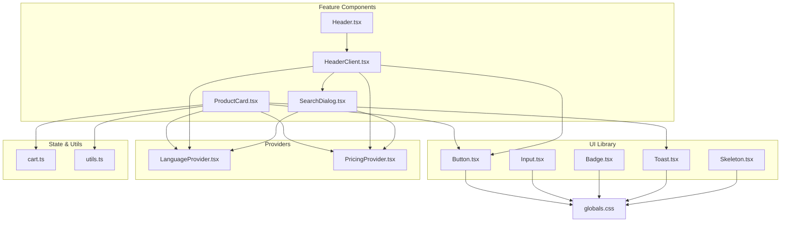
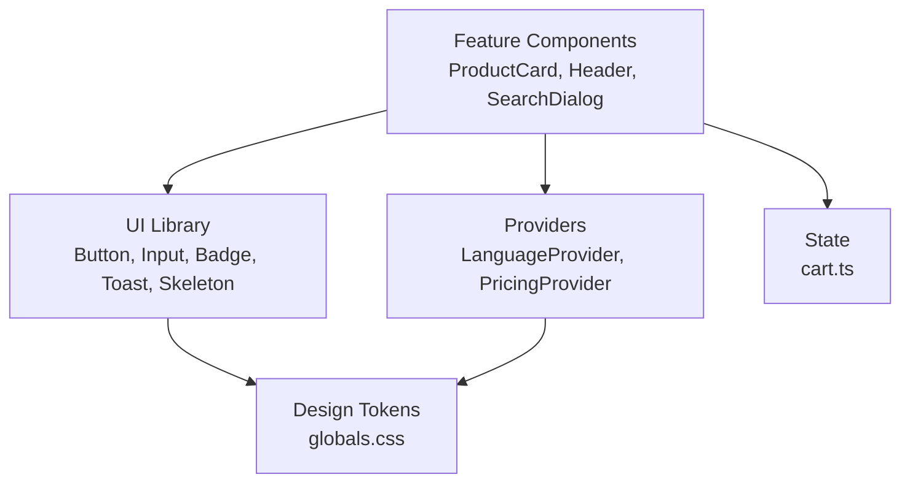
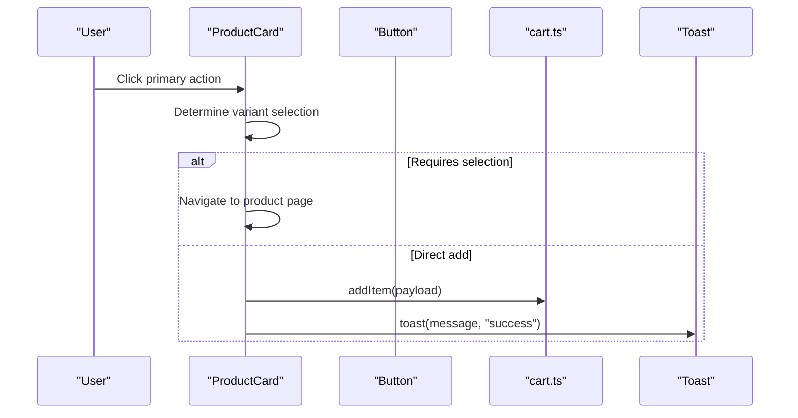
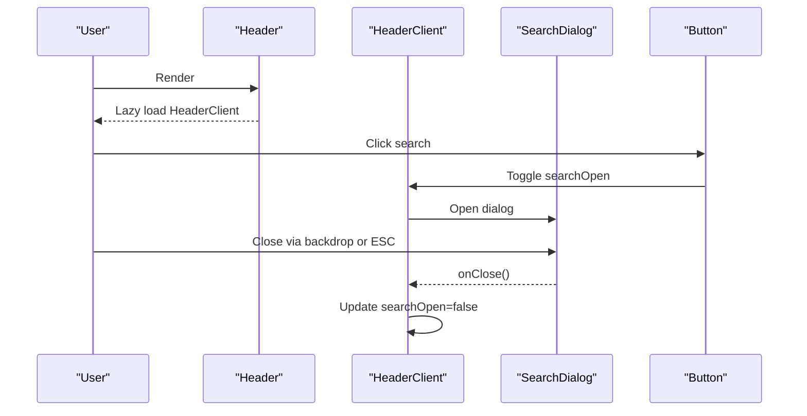
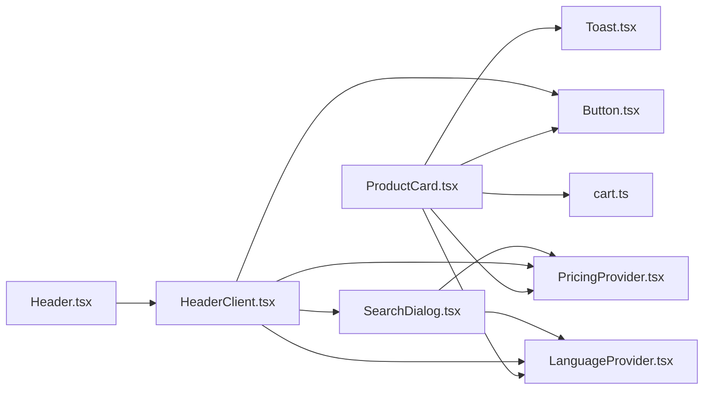

# Component System

<cite>
**Referenced Files in This Document**
- [Button.tsx](file://src/components/ui/Button.tsx)
- [Input.tsx](file://src/components/ui/Input.tsx)
- [Badge.tsx](file://src/components/ui/Badge.tsx)
- [Toast.tsx](file://src/components/ui/Toast.tsx)
- [Skeleton.tsx](file://src/components/ui/Skeleton.tsx)
- [ProductCard.tsx](file://src/components/ProductCard.tsx)
- [Header.tsx](file://src/components/Header.tsx)
- [HeaderClient.tsx](file://src/components/HeaderClient.tsx)
- [SearchDialog.tsx](file://src/components/SearchDialog.tsx)
- [cart.ts](file://src/store/cart.ts)
- [LanguageProvider.tsx](file://src/providers/LanguageProvider.tsx)
- [PricingProvider.tsx](file://src/providers/PricingProvider.tsx)
- [utils.ts](file://src/lib/utils.ts)
- [globals.css](file://src/app/globals.css)
</cite>

## Table of Contents
1. [Introduction](#introduction)
2. [Project Structure](#project-structure)
3. [Core Components](#core-components)
4. [Architecture Overview](#architecture-overview)
5. [Detailed Component Analysis](#detailed-component-analysis)
6. [Dependency Analysis](#dependency-analysis)
7. [Performance Considerations](#performance-considerations)
8. [Troubleshooting Guide](#troubleshooting-guide)
9. [Conclusion](#conclusion)
10. [Appendices](#appendices)

## Introduction
This document describes AllShop’s component system architecture, focusing on the reusable UI component library, design system tokens, component composition strategies, state management patterns, and inter-component communication. It also provides guidance for building robust, accessible, and performant components, with concrete examples of ProductCard and Header.

## Project Structure
The component system is organized around:
- A shared UI library under src/components/ui implementing base primitives (Button, Input, Badge, Toast, Skeleton).
- Feature-level components (ProductCard, Header/HeaderClient, SearchDialog).
- Providers for cross-cutting concerns (LanguageProvider, PricingProvider).
- Global design tokens and animations in src/app/globals.css.
- Centralized utilities and stores (cart.ts) for shared logic.

**Diagram sources**
- [Button.tsx:1-150](file://src/components/ui/Button.tsx#L1-L150)
- [Input.tsx:1-107](file://src/components/ui/Input.tsx#L1-L107)
- [Badge.tsx:1-62](file://src/components/ui/Badge.tsx#L1-L62)
- [Toast.tsx:1-124](file://src/components/ui/Toast.tsx#L1-L124)
- [Skeleton.tsx:1-32](file://src/components/ui/Skeleton.tsx#L1-L32)
- [ProductCard.tsx:1-305](file://src/components/ProductCard.tsx#L1-L305)
- [Header.tsx:1-37](file://src/components/Header.tsx#L1-L37)
- [HeaderClient.tsx:1-252](file://src/components/HeaderClient.tsx#L1-L252)
- [SearchDialog.tsx:1-202](file://src/components/SearchDialog.tsx#L1-L202)
- [cart.ts:1-149](file://src/store/cart.ts#L1-L149)
- [LanguageProvider.tsx:1-81](file://src/providers/LanguageProvider.tsx#L1-L81)
- [PricingProvider.tsx:1-63](file://src/providers/PricingProvider.tsx#L1-L63)
- [utils.ts:1-102](file://src/lib/utils.ts#L1-L102)
- [globals.css:1-800](file://src/app/globals.css#L1-L800)

**Section sources**
- [Button.tsx:1-150](file://src/components/ui/Button.tsx#L1-L150)
- [Input.tsx:1-107](file://src/components/ui/Input.tsx#L1-L107)
- [Badge.tsx:1-62](file://src/components/ui/Badge.tsx#L1-L62)
- [Toast.tsx:1-124](file://src/components/ui/Toast.tsx#L1-L124)
- [Skeleton.tsx:1-32](file://src/components/ui/Skeleton.tsx#L1-L32)
- [ProductCard.tsx:1-305](file://src/components/ProductCard.tsx#L1-L305)
- [Header.tsx:1-37](file://src/components/Header.tsx#L1-L37)
- [HeaderClient.tsx:1-252](file://src/components/HeaderClient.tsx#L1-L252)
- [SearchDialog.tsx:1-202](file://src/components/SearchDialog.tsx#L1-L202)
- [cart.ts:1-149](file://src/store/cart.ts#L1-L149)
- [LanguageProvider.tsx:1-81](file://src/providers/LanguageProvider.tsx#L1-L81)
- [PricingProvider.tsx:1-63](file://src/providers/PricingProvider.tsx#L1-L63)
- [utils.ts:1-102](file://src/lib/utils.ts#L1-L102)
- [globals.css:1-800](file://src/app/globals.css#L1-L800)

## Core Components
This section documents the reusable UI primitives and their design system integration.

- Button
  - Purpose: Action primitive with variant and size scales, ripple and loading states.
  - Props: Inherits button attributes plus variant, size, ripple, loading, loadingText.
  - Behavior: Ripple effect on click, optional loading spinner, disabled state handling.
  - Design tokens: Uses CSS variables for colors, shadows, transitions, and gradients.

- Input
  - Purpose: Text input with floating label, icons, error/hint messaging, focus states.
  - Props: Inherits input attributes plus label, error, hint, icon, iconRight.
  - Behavior: Floating label on focus/value, controlled focus state, aria integration.

- Badge
  - Purpose: Lightweight status or tag indicator with variants, sizes, and animations.
  - Props: Inherits span attributes plus variant, size, animation, icon.
  - Behavior: Composes variants via class variance authority.

- Toast
  - Purpose: Notification system with provider pattern and dismissible alerts.
  - Props: None for consumer; exposes useToast hook.
  - Behavior: Adds/removes toasts with auto-dismiss, supports multiple variants.

- Skeleton
  - Purpose: Loading placeholders with variants and animation modes.
  - Props: className, variant, animation.
  - Behavior: Applies shimmer/pulse animations and shape-specific rounding.

**Section sources**
- [Button.tsx:44-150](file://src/components/ui/Button.tsx#L44-L150)
- [Input.tsx:6-107](file://src/components/ui/Input.tsx#L6-L107)
- [Badge.tsx:45-62](file://src/components/ui/Badge.tsx#L45-L62)
- [Toast.tsx:13-124](file://src/components/ui/Toast.tsx#L13-L124)
- [Skeleton.tsx:3-32](file://src/components/ui/Skeleton.tsx#L3-L32)

## Architecture Overview
The component system follows a layered architecture:
- Base UI library (Button, Input, Badge, Toast, Skeleton) encapsulate atomic behaviors and styles.
- Feature components (ProductCard, Header/HeaderClient, SearchDialog) compose base components and integrate with providers and stores.
- Providers supply cross-cutting concerns (language, pricing).
- Global CSS defines design tokens and animations.

**Diagram sources**
- [Button.tsx:1-150](file://src/components/ui/Button.tsx#L1-L150)
- [Input.tsx:1-107](file://src/components/ui/Input.tsx#L1-L107)
- [Badge.tsx:1-62](file://src/components/ui/Badge.tsx#L1-L62)
- [Toast.tsx:1-124](file://src/components/ui/Toast.tsx#L1-L124)
- [Skeleton.tsx:1-32](file://src/components/ui/Skeleton.tsx#L1-L32)
- [ProductCard.tsx:1-305](file://src/components/ProductCard.tsx#L1-L305)
- [Header.tsx:1-37](file://src/components/Header.tsx#L1-L37)
- [HeaderClient.tsx:1-252](file://src/components/HeaderClient.tsx#L1-L252)
- [SearchDialog.tsx:1-202](file://src/components/SearchDialog.tsx#L1-L202)
- [LanguageProvider.tsx:1-81](file://src/providers/LanguageProvider.tsx#L1-L81)
- [PricingProvider.tsx:1-63](file://src/providers/PricingProvider.tsx#L1-L63)
- [cart.ts:1-149](file://src/store/cart.ts#L1-L149)
- [globals.css:1-800](file://src/app/globals.css#L1-L800)

## Detailed Component Analysis

### ProductCard
- Composition: Renders product metadata, images, badges, pricing, and a primary action button.
- Props:
  - product: Product object with images, pricing, availability, variants.
  - index?: number for staggered animations.
  - enableImageRotation?: boolean to auto-rotate cover images.
  - deliveryEstimate?: Delivery range or null.
- Events:
  - Clicking “Add to Cart” dispatches addItem to cart store and triggers a toast.
  - Clicking the card navigates to the product page.
- State:
  - activeImageIndex for rotation.
  - Memoized derived values (discount, fake rating/sold count).
- Integrations:
  - Uses Button, Toast, LanguageProvider, PricingProvider, cart store, image normalization utilities.

**Diagram sources**
- [ProductCard.tsx:88-115](file://src/components/ProductCard.tsx#L88-L115)
- [cart.ts:62-81](file://src/store/cart.ts#L62-L81)
- [Toast.tsx:94-101](file://src/components/ui/Toast.tsx#L94-L101)

**Section sources**
- [ProductCard.tsx:20-32](file://src/components/ProductCard.tsx#L20-L32)
- [ProductCard.tsx:41-72](file://src/components/ProductCard.tsx#L41-L72)
- [ProductCard.tsx:88-115](file://src/components/ProductCard.tsx#L88-L115)
- [ProductCard.tsx:119-304](file://src/components/ProductCard.tsx#L119-L304)

### Header and HeaderClient
- Composition: Header is a lazy-loaded wrapper; HeaderClient implements the full header UI.
- Responsibilities:
  - Navigation links with active state.
  - Search dialog trigger.
  - Cart badge with item count.
  - Mobile menu with scroll locking.
  - Scroll-aware elevation and blur.
- Interactions:
  - Toggling mobile menu updates body overflow.
  - Brand click scrolls to top on home.
  - Uses buttonVariants for ghost buttons.

**Diagram sources**
- [Header.tsx:9-36](file://src/components/Header.tsx#L9-L36)
- [HeaderClient.tsx:14-252](file://src/components/HeaderClient.tsx#L14-L252)
- [SearchDialog.tsx:32-202](file://src/components/SearchDialog.tsx#L32-L202)

**Section sources**
- [Header.tsx:5-36](file://src/components/Header.tsx#L5-L36)
- [HeaderClient.tsx:14-252](file://src/components/HeaderClient.tsx#L14-L252)
- [SearchDialog.tsx:32-202](file://src/components/SearchDialog.tsx#L32-L202)

### SearchDialog
- Composition: Modal dialog with live search, debounced query, and product suggestions.
- Props:
  - open: boolean to control visibility.
  - onClose: callback to close the dialog.
- Behavior:
  - Debounces input to reduce fetches.
  - Loads product list on open.
  - Supports Escape key to close.
  - Renders product thumbnails and prices using PricingProvider.

**Section sources**
- [SearchDialog.tsx:19-31](file://src/components/SearchDialog.tsx#L19-L31)
- [SearchDialog.tsx:41-86](file://src/components/SearchDialog.tsx#L41-L86)
- [SearchDialog.tsx:100-201](file://src/components/SearchDialog.tsx#L100-L201)

### Toast Provider Pattern
- Composition: Context-based provider exposes a toast function; renders stacked notifications.
- Props: children only.
- Behavior:
  - Adds toasts with unique ids and auto-dismiss timers.
  - Dismissal removes toasts immediately.
  - Accessibility: Polite live region for screen readers.

**Section sources**
- [Toast.tsx:22-32](file://src/components/ui/Toast.tsx#L22-L32)
- [Toast.tsx:87-124](file://src/components/ui/Toast.tsx#L87-L124)

### Design System Implementation
- Design tokens:
  - Colors: foreground, background, surface, borders, accents (primary, secondary, warm), states (success, error).
  - Shadows: layered card, button, elevated, glass, and glow variants.
  - Radii: card, section, button.
  - Gradients: primary, secondary, hero, card, glass, shimmer.
  - Transitions: fast, base, slow, spring, smooth.
- Animations:
  - Fade, slide, float, bounce, shimmer, ripple, scale-in.
- Utilities:
  - Scroll reveal animations with stagger delays.
  - Focus-visible outlines, hover effects, touch targets.

**Section sources**
- [globals.css:5-113](file://src/app/globals.css#L5-L113)
- [globals.css:124-363](file://src/app/globals.css#L124-L363)
- [globals.css:396-791](file://src/app/globals.css#L396-L791)

## Dependency Analysis
- Component dependencies:
  - ProductCard depends on Button, Toast, LanguageProvider, PricingProvider, cart store, and utility helpers.
  - Header composes HeaderClient lazily; HeaderClient depends on Button, SearchDialog, PricingProvider, LanguageProvider.
  - SearchDialog depends on PricingProvider and LanguageProvider.
- Provider dependencies:
  - LanguageProvider supplies translation keys and formatting.
  - PricingProvider supplies currency formatting and conversion helpers.
- Store dependencies:
  - cart store is consumed by ProductCard and HeaderClient for item counts and actions.

**Diagram sources**
- [ProductCard.tsx:1-305](file://src/components/ProductCard.tsx#L1-L305)
- [Button.tsx:1-150](file://src/components/ui/Button.tsx#L1-L150)
- [Toast.tsx:1-124](file://src/components/ui/Toast.tsx#L1-L124)
- [LanguageProvider.tsx:1-81](file://src/providers/LanguageProvider.tsx#L1-L81)
- [PricingProvider.tsx:1-63](file://src/providers/PricingProvider.tsx#L1-L63)
- [cart.ts:1-149](file://src/store/cart.ts#L1-L149)
- [Header.tsx:1-37](file://src/components/Header.tsx#L1-L37)
- [HeaderClient.tsx:1-252](file://src/components/HeaderClient.tsx#L1-L252)
- [SearchDialog.tsx:1-202](file://src/components/SearchDialog.tsx#L1-L202)

**Section sources**
- [ProductCard.tsx:1-305](file://src/components/ProductCard.tsx#L1-L305)
- [Header.tsx:1-37](file://src/components/Header.tsx#L1-L37)
- [HeaderClient.tsx:1-252](file://src/components/HeaderClient.tsx#L1-L252)
- [SearchDialog.tsx:1-202](file://src/components/SearchDialog.tsx#L1-L202)
- [cart.ts:1-149](file://src/store/cart.ts#L1-L149)
- [LanguageProvider.tsx:1-81](file://src/providers/LanguageProvider.tsx#L1-L81)
- [PricingProvider.tsx:1-63](file://src/providers/PricingProvider.tsx#L1-L63)

## Performance Considerations
- Rendering best practices:
  - Prefer memoization for derived values (e.g., discount, fake rating/sold count) to avoid recomputation.
  - Use forwardRef for components that accept refs to minimize re-renders.
  - Avoid unnecessary re-creations of callbacks; use useCallback where appropriate.
- Image optimization:
  - ProductCard leverages Next.js Image with sizes and priority hints.
  - Normalize legacy image paths to reduce render errors and improve caching.
- State management:
  - Zustand with persistence reduces hydration overhead and avoids server/client mismatches.
  - Keep cart updates minimal; batch operations when possible.
- Animations and effects:
  - Use CSS variables and keyframes for smooth transitions; avoid layout thrashing.
  - Limit DOM nodes in lists (e.g., truncated suggestion lists).
- Bundle splitting:
  - Lazy-load heavy client components (Header) to defer initial JS payload.

[No sources needed since this section provides general guidance]

## Troubleshooting Guide
- Missing translations:
  - Ensure LanguageProvider wraps the app and that translation keys exist; the provider falls back gracefully.
- Currency formatting inconsistencies:
  - Verify PricingProvider is initialized and locale/currency settings align with expectations.
- Cart state anomalies:
  - Confirm persisted cart items are normalized; quantities are capped and validated.
- Accessibility:
  - Ensure aria labels and roles are present for interactive elements (buttons, dialogs).
  - Respect reduced motion preferences via global CSS.

**Section sources**
- [LanguageProvider.tsx:36-42](file://src/providers/LanguageProvider.tsx#L36-L42)
- [PricingProvider.tsx:33-57](file://src/providers/PricingProvider.tsx#L33-L57)
- [cart.ts:125-147](file://src/store/cart.ts#L125-L147)
- [globals.css:529-541](file://src/app/globals.css#L529-L541)

## Conclusion
AllShop’s component system emphasizes composability, design token-driven styling, and pragmatic state management. The UI library provides consistent primitives, while feature components orchestrate providers and stores to deliver cohesive user experiences. Following the patterns documented here ensures maintainability, performance, and accessibility across the application.

[No sources needed since this section summarizes without analyzing specific files]

## Appendices

### Component Composition Strategies
- Prefer small, single-responsibility components and compose them declaratively.
- Use variants and sizes via class variance authority to keep styles centralized.
- Encapsulate side effects (e.g., cart updates, search) in dedicated hooks/providers.

**Section sources**
- [Button.tsx:7-42](file://src/components/ui/Button.tsx#L7-L42)
- [Badge.tsx:4-43](file://src/components/ui/Badge.tsx#L4-L43)

### Prop Interfaces and Lifecycle Management
- Props should be explicit and typed; avoid spreading unknown props.
- Lifecycle:
  - Initialize state in useEffect for side effects (e.g., scroll listeners, timers).
  - Cleanup timers and event listeners on unmount.
  - Use useMemo/useCallback to stabilize references for downstream consumers.

**Section sources**
- [HeaderClient.tsx:38-53](file://src/components/HeaderClient.tsx#L38-L53)
- [ProductCard.tsx:77-86](file://src/components/ProductCard.tsx#L77-L86)

### Event Handling and Inter-Component Communication
- Use context (e.g., Toast, LanguageProvider, PricingProvider) for cross-component communication.
- For parent-child communication, pass callbacks via props; for sibling communication, elevate state to a common ancestor or use a store.

**Section sources**
- [Toast.tsx:26-32](file://src/components/ui/Toast.tsx#L26-L32)
- [LanguageProvider.tsx:10-26](file://src/providers/LanguageProvider.tsx#L10-L26)
- [PricingProvider.tsx:12-31](file://src/providers/PricingProvider.tsx#L12-L31)

### Guidelines for Component Development
- Accessibility:
  - Provide meaningful aria-labels and roles.
  - Ensure keyboard navigation and focus management.
- Testing:
  - Unit-test pure functions and helpers (e.g., discount calculation).
  - Snapshot test static renders; use user-event tests for interactions.
- Documentation:
  - Document props, events, and behavioral expectations per component.

**Section sources**
- [utils.ts:24-27](file://src/lib/utils.ts#L24-L27)
- [globals.css:390-394](file://src/app/globals.css#L390-L394)

### Examples Index
- ProductCard: props, events, integration patterns.
- Header/HeaderClient: navigation, search, cart badge, mobile menu.
- SearchDialog: modal UX, debounced search, product suggestions.
- Toast: provider pattern, variants, dismissal.
- UI primitives: Button, Input, Badge, Skeleton.

**Section sources**
- [ProductCard.tsx:20-32](file://src/components/ProductCard.tsx#L20-L32)
- [Header.tsx:9-36](file://src/components/Header.tsx#L9-L36)
- [HeaderClient.tsx:14-252](file://src/components/HeaderClient.tsx#L14-L252)
- [SearchDialog.tsx:19-31](file://src/components/SearchDialog.tsx#L19-L31)
- [Toast.tsx:13-124](file://src/components/ui/Toast.tsx#L13-L124)
- [Button.tsx:44-150](file://src/components/ui/Button.tsx#L44-L150)
- [Input.tsx:6-107](file://src/components/ui/Input.tsx#L6-L107)
- [Badge.tsx:45-62](file://src/components/ui/Badge.tsx#L45-L62)
- [Skeleton.tsx:3-32](file://src/components/ui/Skeleton.tsx#L3-L32)