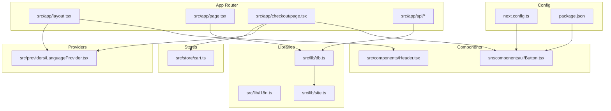
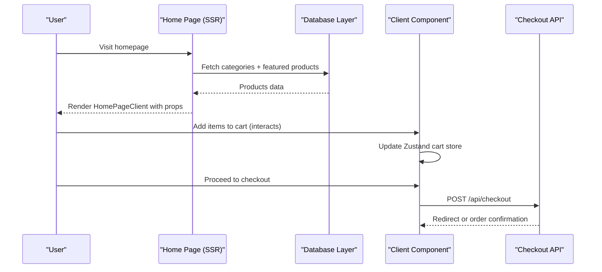
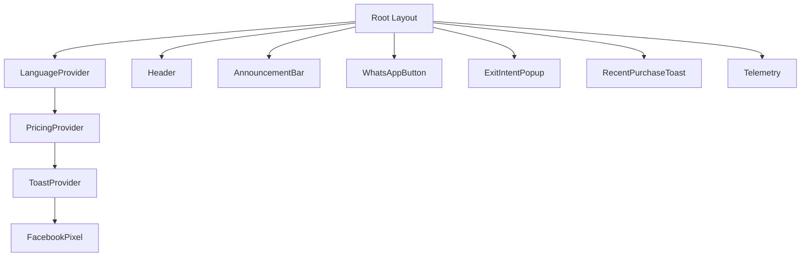
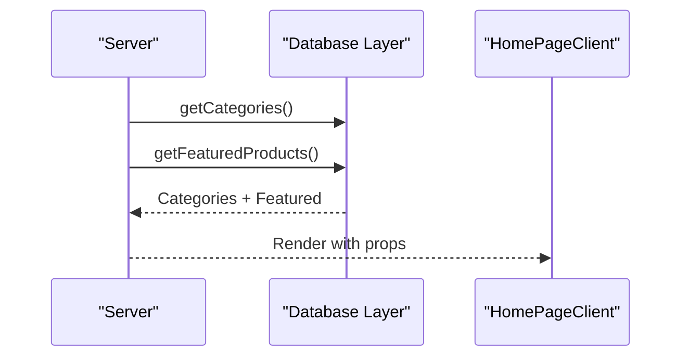
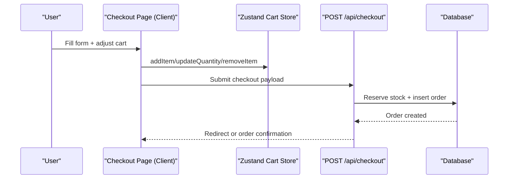
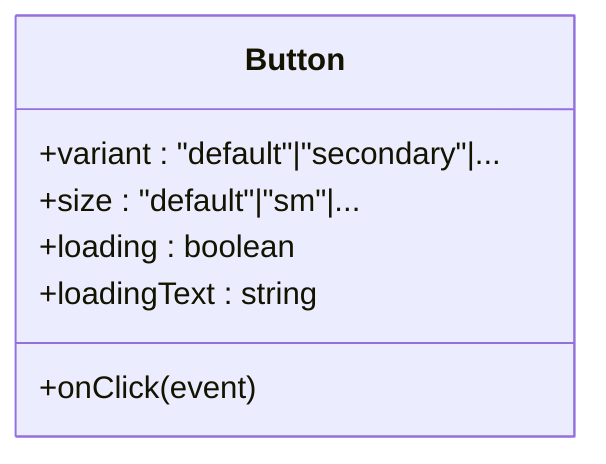
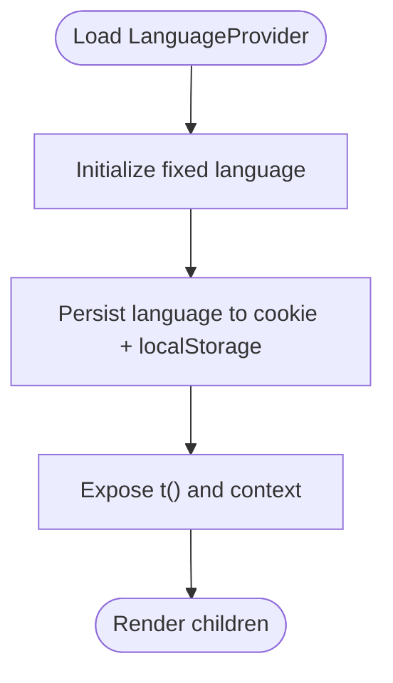
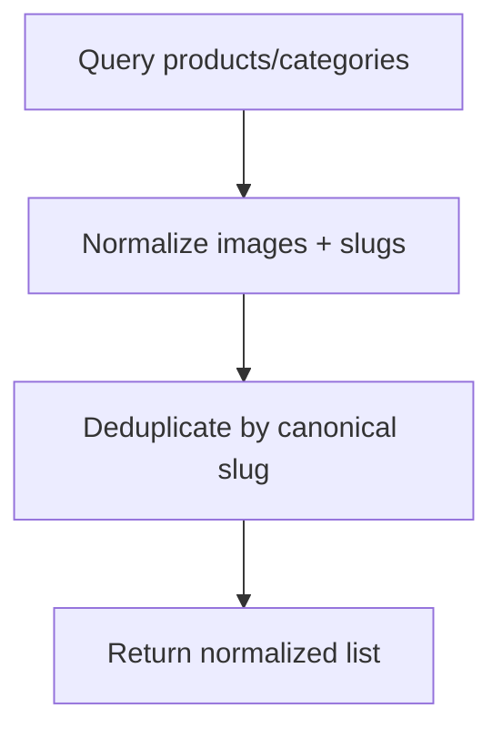
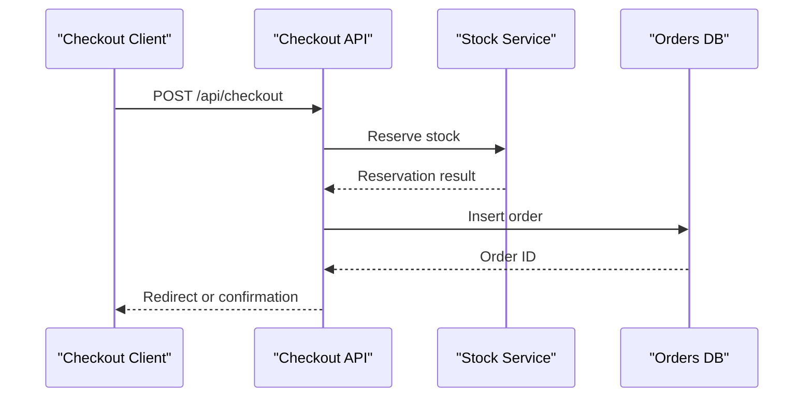
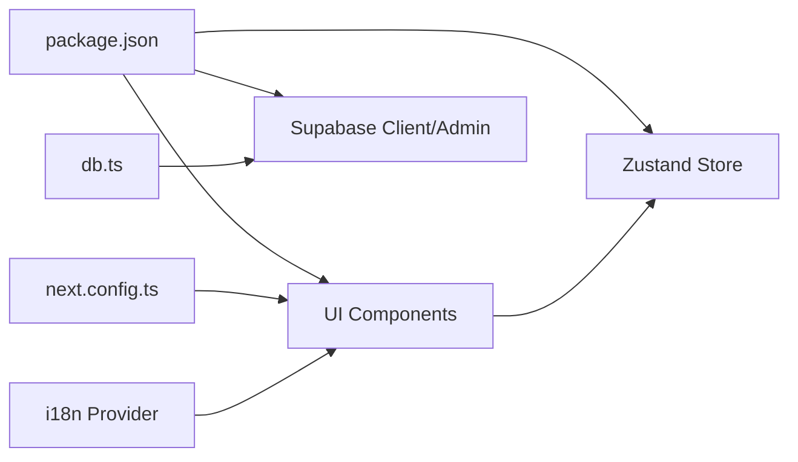

# Frontend Architecture

<cite>
**Referenced Files in This Document**
- [src/app/layout.tsx](file://src/app/layout.tsx)
- [src/app/page.tsx](file://src/app/page.tsx)
- [src/components/Header.tsx](file://src/components/Header.tsx)
- [src/providers/LanguageProvider.tsx](file://src/providers/LanguageProvider.tsx)
- [src/lib/i18n.ts](file://src/lib/i18n.ts)
- [src/store/cart.ts](file://src/store/cart.ts)
- [src/app/checkout/page.tsx](file://src/app/checkout/page.tsx)
- [src/lib/db.ts](file://src/lib/db.ts)
- [src/app/api/checkout/route.ts](file://src/app/api/checkout/route.ts)
- [src/app/api/products/search/route.ts](file://src/app/api/products/search/route.ts)
- [src/components/ui/Button.tsx](file://src/components/ui/Button.tsx)
- [src/types/index.ts](file://src/types/index.ts)
- [src/lib/site.ts](file://src/lib/site.ts)
- [src/app/robots.ts](file://src/app/robots.ts)
- [next.config.ts](file://next.config.ts)
- [package.json](file://package.json)
</cite>

## Table of Contents
1. [Introduction](#introduction)
2. [Project Structure](#project-structure)
3. [Core Components](#core-components)
4. [Architecture Overview](#architecture-overview)
5. [Detailed Component Analysis](#detailed-component-analysis)
6. [Dependency Analysis](#dependency-analysis)
7. [Performance Considerations](#performance-considerations)
8. [Troubleshooting Guide](#troubleshooting-guide)
9. [Conclusion](#conclusion)
10. [Appendices](#appendices)

## Introduction
This document describes the frontend architecture of AllShop, a Next.js 16 application leveraging the App Router with server components, client components, and explicit data fetching patterns. It explains the component hierarchy, provider-based state management, internationalization, routing strategies, and reusable UI patterns. It also covers infrastructure requirements, build optimization, deployment considerations, and cross-cutting concerns such as performance, SEO, and accessibility.

## Project Structure
AllShop follows Next.js 16’s App Router conventions:
- App directory pages and layouts under src/app
- Shared UI components under src/components
- Providers under src/providers
- Stores under src/store
- Libraries and utilities under src/lib
- Type definitions under src/types
- Application-wide configuration under next.config.ts and package.json

**Diagram sources**
- [src/app/layout.tsx](file://src/app/layout.tsx)
- [src/app/page.tsx](file://src/app/page.tsx)
- [src/app/checkout/page.tsx](file://src/app/checkout/page.tsx)
- [src/providers/LanguageProvider.tsx](file://src/providers/LanguageProvider.tsx)
- [src/components/Header.tsx](file://src/components/Header.tsx)
- [src/components/ui/Button.tsx](file://src/components/ui/Button.tsx)
- [src/lib/db.ts](file://src/lib/db.ts)
- [src/lib/i18n.ts](file://src/lib/i18n.ts)
- [src/lib/site.ts](file://src/lib/site.ts)
- [src/store/cart.ts](file://src/store/cart.ts)
- [next.config.ts](file://next.config.ts)
- [package.json](file://package.json)

**Section sources**
- [src/app/layout.tsx](file://src/app/layout.tsx)
- [src/app/page.tsx](file://src/app/page.tsx)
- [next.config.ts](file://next.config.ts)
- [package.json](file://package.json)

## Core Components
- Root layout and providers: The root layout composes providers for language, pricing, and toast notifications, and renders shared UI such as header, footer, and telemetry.
- Home page: Demonstrates server component pattern with data fetching and hydration of client components.
- Checkout page: A client component orchestrating cart state, pricing, validations, and API submission.
- UI primitives: Reusable components like Button with variant and size systems.
- State management: Zustand stores encapsulate cart state with persistence and normalization.
- Internationalization: A lightweight client-side provider with fixed language and translation helpers.

**Section sources**
- [src/app/layout.tsx](file://src/app/layout.tsx)
- [src/app/page.tsx](file://src/app/page.tsx)
- [src/app/checkout/page.tsx](file://src/app/checkout/page.tsx)
- [src/components/ui/Button.tsx](file://src/components/ui/Button.tsx)
- [src/store/cart.ts](file://src/store/cart.ts)
- [src/providers/LanguageProvider.tsx](file://src/providers/LanguageProvider.tsx)
- [src/lib/i18n.ts](file://src/lib/i18n.ts)

## Architecture Overview
The system separates rendering responsibilities:
- Server components render static or SSR content and pass props to client components.
- Client components manage interactivity, state, and user-driven flows.
- Providers supply cross-cutting services (language, pricing, notifications).
- APIs handle backend operations, validations, and integrations.

**Diagram sources**
- [src/app/page.tsx](file://src/app/page.tsx)
- [src/lib/db.ts](file://src/lib/db.ts)
- [src/app/checkout/page.tsx](file://src/app/checkout/page.tsx)
- [src/app/api/checkout/route.ts](file://src/app/api/checkout/route.ts)

## Detailed Component Analysis

### Root Layout and Providers
- Providers orchestration: LanguageProvider, PricingProvider, ToastProvider wrap the application subtree.
- Shared UI: Header, Footer, AnnouncementBar, CatalogUpdateWatcher, and telemetry components are rendered in layout.
- Metadata and SEO: Open Graph, Twitter, and robots configuration are centralized in the root layout and robots file.

**Diagram sources**
- [src/app/layout.tsx](file://src/app/layout.tsx)
- [src/providers/LanguageProvider.tsx](file://src/providers/LanguageProvider.tsx)

**Section sources**
- [src/app/layout.tsx](file://src/app/layout.tsx)
- [src/app/robots.ts](file://src/app/robots.ts)

### Home Page: Server Component + Client Hydration
- Server component fetches categories and featured products concurrently and passes them to a client component.
- Uses revalidation to balance freshness and performance.

**Diagram sources**
- [src/app/page.tsx](file://src/app/page.tsx)
- [src/lib/db.ts](file://src/lib/db.ts)

**Section sources**
- [src/app/page.tsx](file://src/app/page.tsx)
- [src/lib/db.ts](file://src/lib/db.ts)

### Checkout Flow: Client Component + Zustand Store + API
- Client component manages form state, validations, cart updates, and shipping estimates.
- Uses Zustand store for cart persistence and normalization.
- Submits to a server action endpoint that performs validations, stock reservations, and order creation.

**Diagram sources**
- [src/app/checkout/page.tsx](file://src/app/checkout/page.tsx)
- [src/store/cart.ts](file://src/store/cart.ts)
- [src/app/api/checkout/route.ts](file://src/app/api/checkout/route.ts)

**Section sources**
- [src/app/checkout/page.tsx](file://src/app/checkout/page.tsx)
- [src/store/cart.ts](file://src/store/cart.ts)
- [src/app/api/checkout/route.ts](file://src/app/api/checkout/route.ts)

### UI Primitive: Button
- Implements variant and size systems with Tailwind-based CSS variables and interactive effects (ripple, shine).
- Designed for composability and consistent theming across the app.

**Diagram sources**
- [src/components/ui/Button.tsx](file://src/components/ui/Button.tsx)

**Section sources**
- [src/components/ui/Button.tsx](file://src/components/ui/Button.tsx)

### Internationalization Provider
- Fixed single-language provider with translation helpers and cookie/local storage persistence.
- Server-side translation helper ensures consistent language handling.

**Diagram sources**
- [src/providers/LanguageProvider.tsx](file://src/providers/LanguageProvider.tsx)
- [src/lib/i18n.ts](file://src/lib/i18n.ts)

**Section sources**
- [src/providers/LanguageProvider.tsx](file://src/providers/LanguageProvider.tsx)
- [src/lib/i18n.ts](file://src/lib/i18n.ts)

### Data Access Layer
- Centralized database access with normalization, deduplication, and slug resolution.
- Mock fallbacks when database is not configured.

**Diagram sources**
- [src/lib/db.ts](file://src/lib/db.ts)

**Section sources**
- [src/lib/db.ts](file://src/lib/db.ts)

### API Endpoints
- Checkout endpoint validates inputs, reserves stock, calculates shipping, and creates orders.
- Product search endpoint exposes cached product metadata for client-side search.

**Diagram sources**
- [src/app/api/checkout/route.ts](file://src/app/api/checkout/route.ts)

**Section sources**
- [src/app/api/checkout/route.ts](file://src/app/api/checkout/route.ts)
- [src/app/api/products/search/route.ts](file://src/app/api/products/search/route.ts)

## Dependency Analysis
- Next.js 16 runtime with App Router and server/client component model.
- Zustand for lightweight client-side state with persistence.
- Tailwind-based design system with CSS variables for theming.
- Supabase client/admin for data access and administrative operations.
- Optimizations: Image optimization, caching headers, and package imports optimization.

**Diagram sources**
- [package.json](file://package.json)
- [next.config.ts](file://next.config.ts)
- [src/components/ui/Button.tsx](file://src/components/ui/Button.tsx)
- [src/store/cart.ts](file://src/store/cart.ts)
- [src/lib/db.ts](file://src/lib/db.ts)
- [src/providers/LanguageProvider.tsx](file://src/providers/LanguageProvider.tsx)

**Section sources**
- [package.json](file://package.json)
- [next.config.ts](file://next.config.ts)
- [src/lib/db.ts](file://src/lib/db.ts)

## Performance Considerations
- Image optimization: next.config.ts configures formats, sizes, caching, and remote patterns for Supabase and external hosts.
- Caching: API endpoints and static routes use appropriate cache headers and revalidation strategies.
- Bundle optimization: optimizePackageImports reduces bundle size for key libraries.
- Client component lazy-loading: Header is dynamically imported to defer heavy client code.
- State normalization: Cart store normalizes legacy data and caps quantities to improve reliability.

**Section sources**
- [next.config.ts](file://next.config.ts)
- [src/components/Header.tsx](file://src/components/Header.tsx)
- [src/store/cart.ts](file://src/store/cart.ts)

## Troubleshooting Guide
- Checkout errors: The checkout client displays localized messages and scrolls to the error area. Validate form fields and confirmations before submitting.
- Duplicate orders: The API checks for recent duplicates and returns conflict responses; ensure idempotency keys are generated and reused.
- Stock unavailability: Stock reservation failures trigger restoration and user-facing messages; refresh the page and retry.
- SEO and indexing: robots.txt disallows sensitive routes; ensure canonical URLs are set per page and meta tags are accurate.

**Section sources**
- [src/app/checkout/page.tsx](file://src/app/checkout/page.tsx)
- [src/app/api/checkout/route.ts](file://src/app/api/checkout/route.ts)
- [src/app/robots.ts](file://src/app/robots.ts)

## Conclusion
AllShop’s frontend leverages Next.js 16’s App Router to cleanly separate server-rendered content from client interactivity. Providers deliver cohesive cross-cutting services, Zustand manages shopping cart state efficiently, and a small set of reusable UI primitives ensures consistent design. Infrastructure and build configurations emphasize performance, security, and maintainability.

## Appendices

### Routing Strategies
- Dynamic routes: Category and product pages use catch-all slugs for flexible matching.
- API routes: Dedicated endpoints under src/app/api handle checkout, search, and administrative tasks.
- Static generation and caching: Pages and API routes apply revalidation and cache headers to balance freshness and performance.

**Section sources**
- [src/app/api/products/search/route.ts](file://src/app/api/products/search/route.ts)
- [src/lib/site.ts](file://src/lib/site.ts)

### State Management Approach
- Zustand store encapsulates cart operations with persistence and normalization.
- Store methods include adding, updating, removing, and calculating totals and shipping types.

**Section sources**
- [src/store/cart.ts](file://src/store/cart.ts)
- [src/types/index.ts](file://src/types/index.ts)

### Internationalization Implementation
- Client-side provider with fixed language and translation helpers.
- Server-side translation helper supports SSR scenarios.

**Section sources**
- [src/providers/LanguageProvider.tsx](file://src/providers/LanguageProvider.tsx)
- [src/lib/i18n.ts](file://src/lib/i18n.ts)

### Design System and Theming
- CSS variables define theme tokens consumed by components.
- Button variants and sizes provide a consistent, extensible design system.

**Section sources**
- [src/components/ui/Button.tsx](file://src/components/ui/Button.tsx)
- [src/app/layout.tsx](file://src/app/layout.tsx)

### Responsive Design Patterns
- Utility-first Tailwind classes and responsive breakpoints ensure mobile-first layouts.
- Components adapt spacing, typography, and interactions across screen sizes.

**Section sources**
- [src/components/ui/Button.tsx](file://src/components/ui/Button.tsx)
- [src/app/layout.tsx](file://src/app/layout.tsx)

### Accessibility Compliance
- Semantic markup and focus management in interactive components.
- Proper labeling and ARIA roles where applicable.
- Ensures keyboard navigation and screen reader compatibility.

**Section sources**
- [src/app/checkout/page.tsx](file://src/app/checkout/page.tsx)
- [src/components/ui/Button.tsx](file://src/components/ui/Button.tsx)

### SEO Implementation
- Structured metadata in root layout and robots configuration.
- Canonical URLs and social media images configured centrally.

**Section sources**
- [src/app/layout.tsx](file://src/app/layout.tsx)
- [src/app/robots.ts](file://src/app/robots.ts)

### Infrastructure and Deployment
- Next.js configuration sets security headers, image optimization, and caching policies.
- Environment variables drive URLs, emails, and feature toggles.

**Section sources**
- [next.config.ts](file://next.config.ts)
- [src/lib/site.ts](file://src/lib/site.ts)