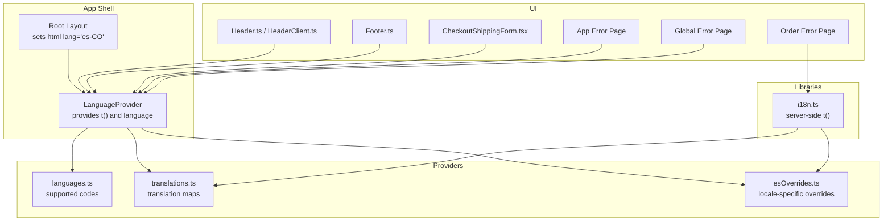
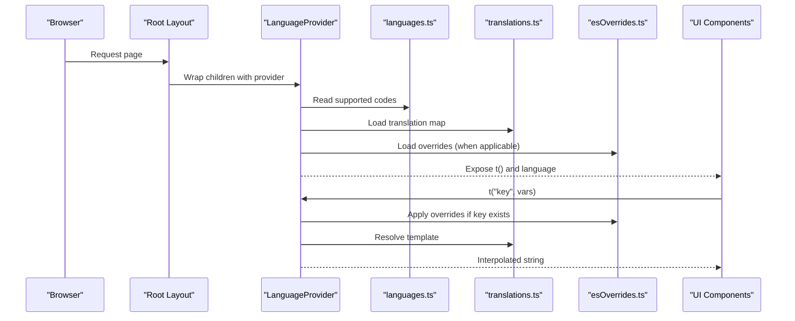
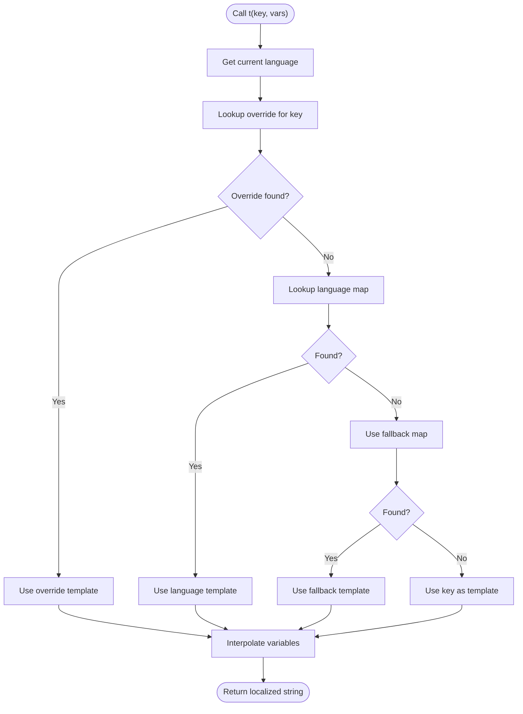
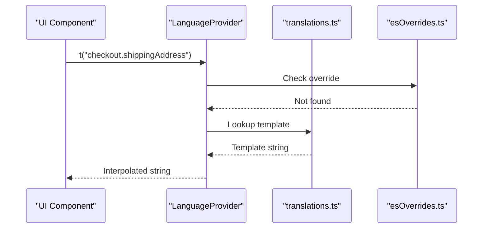
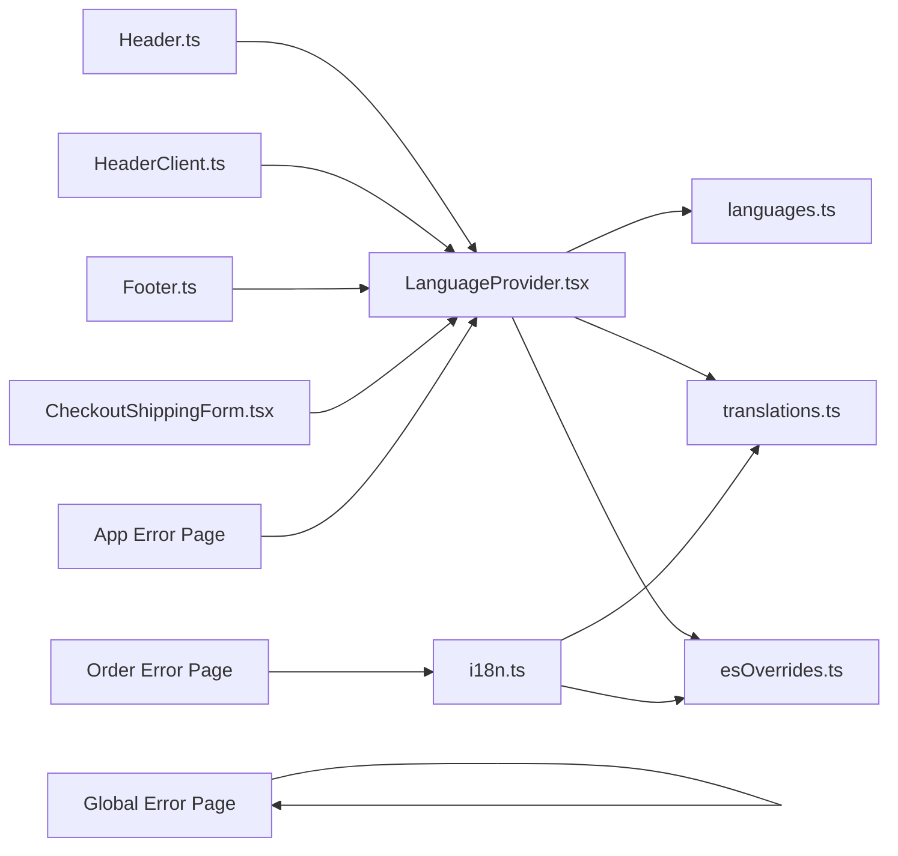

# Internationalization

<cite>
**Referenced Files in This Document**
- [LanguageProvider.tsx](file://src/providers/LanguageProvider.tsx)
- [languages.ts](file://src/providers/languages.ts)
- [translations.ts](file://src/providers/translations.ts)
- [esOverrides.ts](file://src/providers/esOverrides.ts)
- [i18n.ts](file://src/lib/i18n.ts)
- [layout.tsx](file://src/app/layout.tsx)
- [Header.tsx](file://src/components/Header.tsx)
- [HeaderClient.tsx](file://src/components/HeaderClient.tsx)
- [Footer.tsx](file://src/components/Footer.tsx)
- [CheckoutShippingForm.tsx](file://src/components/checkout/CheckoutShippingForm.tsx)
- [validation.ts](file://src/lib/validation.ts)
- [page.tsx](file://src/app/orden/error/page.tsx)
- [error.tsx](file://src/app/error.tsx)
- [global-error.tsx](file://src/app/global-error.tsx)
</cite>

## Table of Contents
1. [Introduction](#introduction)
2. [Project Structure](#project-structure)
3. [Core Components](#core-components)
4. [Architecture Overview](#architecture-overview)
5. [Detailed Component Analysis](#detailed-component-analysis)
6. [Dependency Analysis](#dependency-analysis)
7. [Performance Considerations](#performance-considerations)
8. [Troubleshooting Guide](#troubleshooting-guide)
9. [Conclusion](#conclusion)

## Introduction
This document explains AllShop’s internationalization (i18n) system with a focus on the Colombian Spanish locale. It covers the language provider implementation, translation management, locale-specific content handling, and the mechanisms for dynamic rendering, form validation messages, and error handling. It also documents the translation key structure, fallback strategies, and content localization patterns used across the application. Guidance is included for managing large translation datasets, right-to-left language support, cultural adaptations, and regional variations within Colombia.

## Project Structure
The i18n system is centered around a small set of provider and library modules that expose a simple translation function and manage language state. The application layout configures the HTML language attribute and integrates the provider at the root level. Client components consume the translation function to render localized content, while server-side pages use a server-side translation function for metadata and static content.

**Diagram sources**
- [layout.tsx:160-165](file://src/app/layout.tsx#L160-L165)
- [LanguageProvider.tsx:44-75](file://src/providers/LanguageProvider.tsx#L44-L75)
- [languages.ts:1-24](file://src/providers/languages.ts#L1-L24)
- [translations.ts:1-612](file://src/providers/translations.ts#L1-L612)
- [esOverrides.ts:1-229](file://src/providers/esOverrides.ts#L1-L229)
- [i18n.ts:15-28](file://src/lib/i18n.ts#L15-L28)
- [Header.tsx:34-36](file://src/components/Header.tsx#L34-L36)
- [HeaderClient.tsx:14-36](file://src/components/HeaderClient.tsx#L14-L36)
- [Footer.tsx:13-47](file://src/components/Footer.tsx#L13-L47)
- [CheckoutShippingForm.tsx:53-62](file://src/components/checkout/CheckoutShippingForm.tsx#L53-L62)
- [page.tsx:14-16](file://src/app/orden/error/page.tsx#L14-L16)
- [error.tsx:9-16](file://src/app/error.tsx#L9-L16)
- [global-error.tsx:12-13](file://src/app/global-error.tsx#L12-L13)

**Section sources**
- [layout.tsx:160-165](file://src/app/layout.tsx#L160-L165)
- [LanguageProvider.tsx:44-75](file://src/providers/LanguageProvider.tsx#L44-L75)
- [languages.ts:1-24](file://src/providers/languages.ts#L1-L24)
- [translations.ts:1-612](file://src/providers/translations.ts#L1-L612)
- [esOverrides.ts:1-229](file://src/providers/esOverrides.ts#L1-L229)
- [i18n.ts:15-28](file://src/lib/i18n.ts#L15-L28)

## Core Components
- LanguageProvider: Exposes a translation function t(key, vars?), language code, and a setLanguage function. It sets the HTML lang attribute, persists the language in localStorage and a cookie, and applies locale-specific overrides for Colombian Spanish.
- languages: Defines supported language codes and helpers to validate language codes.
- translations: Contains the translation map for Colombian Spanish.
- esOverrides: Provides Colombian Spanish-specific overrides for keys to tailor messaging to the Colombian market.
- i18n (server): Supplies a server-side translation function for generating metadata and rendering server components in the correct locale.
- UI consumers: Components such as Header, Footer, CheckoutShippingForm, and error pages use the translation function to render localized content.

Key behaviors:
- Fixed language mode: The provider initializes and keeps the language fixed to Colombian Spanish, disabling runtime switching.
- Fallback strategy: Uses the language-specific translation map, then falls back to the Spanish map, then to the key itself.
- Overrides: Applies Colombian Spanish overrides when the language is Spanish.
- Variable interpolation: Supports named placeholders in translation templates.

**Section sources**
- [LanguageProvider.tsx:17-26](file://src/providers/LanguageProvider.tsx#L17-L26)
- [LanguageProvider.tsx:36-42](file://src/providers/LanguageProvider.tsx#L36-L42)
- [LanguageProvider.tsx:59-62](file://src/providers/LanguageProvider.tsx#L59-L62)
- [languages.ts:1-24](file://src/providers/languages.ts#L1-L24)
- [translations.ts:609-612](file://src/providers/translations.ts#L609-L612)
- [esOverrides.ts:1-229](file://src/providers/esOverrides.ts#L1-L229)
- [i18n.ts:15-28](file://src/lib/i18n.ts#L15-L28)

## Architecture Overview
The i18n architecture is a minimal, centralized provider pattern with server-side support for metadata generation.

**Diagram sources**
- [layout.tsx:178-197](file://src/app/layout.tsx#L178-L197)
- [LanguageProvider.tsx:44-75](file://src/providers/LanguageProvider.tsx#L44-L75)
- [languages.ts:1-24](file://src/providers/languages.ts#L1-L24)
- [translations.ts:609-612](file://src/providers/translations.ts#L609-L612)
- [esOverrides.ts:1-229](file://src/providers/esOverrides.ts#L1-L229)

## Detailed Component Analysis

### LanguageProvider
- Purpose: Centralizes language state and translation resolution for the client.
- Behavior:
  - Initializes language to a fixed Colombian Spanish code.
  - Sets document.documentElement.lang and persists language in localStorage and a cookie.
  - Provides t(key, vars?) that resolves templates from overrides, language map, or fallback map, then interpolates variables.
  - Disables runtime language switching by design.
- Variables: Named placeholders like {name}, {count}, {date} are supported and replaced at runtime.

**Diagram sources**
- [LanguageProvider.tsx:36-42](file://src/providers/LanguageProvider.tsx#L36-L42)

**Section sources**
- [LanguageProvider.tsx:17-26](file://src/providers/LanguageProvider.tsx#L17-L26)
- [LanguageProvider.tsx:36-42](file://src/providers/LanguageProvider.tsx#L36-L42)
- [LanguageProvider.tsx:59-62](file://src/providers/LanguageProvider.tsx#L59-L62)

### Server-side Translation (i18n)
- Purpose: Provide translation on the server for metadata and server-rendered content.
- Behavior:
  - Returns a t function bound to the fixed Colombian Spanish locale.
  - Applies the same override and fallback logic as the client provider.

**Section sources**
- [i18n.ts:15-28](file://src/lib/i18n.ts#L15-L28)

### Translation Keys and Overrides
- Translation keys follow a dot notation hierarchy (e.g., categories.title, checkout.shippingAddress).
- The Spanish translation map contains hundreds of keys covering categories, checkout, policies, product pages, and UI elements.
- esOverrides selectively replaces specific keys to reflect Colombian market messaging and guarantees.

Examples of key categories:
- Categories and navigation: categories.*, nav.*
- Checkout: checkout.*
- Policies: policy.* (privacy, returns, shipping, terms, tracking, support)
- Products: product.*, productCard.*, trustbar.*, guarantee.*
- Orders: orders.*, order.*

**Section sources**
- [translations.ts:5-607](file://src/providers/translations.ts#L5-L607)
- [esOverrides.ts:1-229](file://src/providers/esOverrides.ts#L1-L229)

### Dynamic Content Rendering
- Header and Footer: Render localized labels for navigation, links, and footers using t().
- CheckoutShippingForm: Renders placeholders, labels, and delivery estimate messages in Spanish with variable interpolation for days and ranges.
- Order Error Page: Uses server-side t() to set metadata and render error content.

**Diagram sources**
- [HeaderClient.tsx:22-36](file://src/components/HeaderClient.tsx#L22-L36)
- [Footer.tsx:13-47](file://src/components/Footer.tsx#L13-L47)
- [CheckoutShippingForm.tsx:62-62](file://src/components/checkout/CheckoutShippingForm.tsx#L62-L62)
- [page.tsx:14-16](file://src/app/orden/error/page.tsx#L14-L16)

**Section sources**
- [HeaderClient.tsx:22-36](file://src/components/HeaderClient.tsx#L22-L36)
- [Footer.tsx:13-47](file://src/components/Footer.tsx#L13-L47)
- [CheckoutShippingForm.tsx:62-62](file://src/components/checkout/CheckoutShippingForm.tsx#L62-L62)
- [page.tsx:14-16](file://src/app/orden/error/page.tsx#L14-L16)

### Form Validation Messages
- Validation utilities produce user-friendly Spanish messages for checkout fields.
- These messages are surfaced in forms alongside translated labels and placeholders.

Validation coverage includes:
- Name, email, phone, document, address, city, department.

**Section sources**
- [validation.ts:14-65](file://src/lib/validation.ts#L14-L65)

### Error Handling in Multiple Languages
- Runtime error page: Uses the client-side provider to render localized error UI and actions.
- Global error page: Renders a generic message in Spanish for deep server errors.
- Order error page: Uses the server-side translation function to set metadata and render localized content.

**Section sources**
- [error.tsx:9-16](file://src/app/error.tsx#L9-L16)
- [global-error.tsx:12-13](file://src/app/global-error.tsx#L12-L13)
- [page.tsx:14-16](file://src/app/orden/error/page.tsx#L14-L16)

## Dependency Analysis
The i18n module depends on a small set of modules with clear separation of concerns.

**Diagram sources**
- [LanguageProvider.tsx:44-75](file://src/providers/LanguageProvider.tsx#L44-L75)
- [languages.ts:1-24](file://src/providers/languages.ts#L1-L24)
- [translations.ts:609-612](file://src/providers/translations.ts#L609-L612)
- [esOverrides.ts:1-229](file://src/providers/esOverrides.ts#L1-L229)
- [i18n.ts:15-28](file://src/lib/i18n.ts#L15-L28)
- [Header.tsx:34-36](file://src/components/Header.tsx#L34-L36)
- [HeaderClient.tsx:14-36](file://src/components/HeaderClient.tsx#L14-L36)
- [Footer.tsx:13-47](file://src/components/Footer.tsx#L13-L47)
- [CheckoutShippingForm.tsx:53-62](file://src/components/checkout/CheckoutShippingForm.tsx#L53-L62)
- [page.tsx:14-16](file://src/app/orden/error/page.tsx#L14-L16)
- [error.tsx:9-16](file://src/app/error.tsx#L9-L16)
- [global-error.tsx:12-13](file://src/app/global-error.tsx#L12-L13)

**Section sources**
- [LanguageProvider.tsx:44-75](file://src/providers/LanguageProvider.tsx#L44-L75)
- [i18n.ts:15-28](file://src/lib/i18n.ts#L15-L28)

## Performance Considerations
- Translation lookup is O(1) per key via object property access.
- Overrides and fallbacks are constant-time checks.
- Variable interpolation is linear in template length.
- Recommendations:
  - Keep translation keys concise and hierarchical to minimize churn.
  - Avoid excessively large templates; prefer modular keys and compose messages in components.
  - Consider lazy-loading translation bundles if the dataset grows substantially beyond current size.
  - Use memoization for repeated renders of the same localized strings.
  - For very large datasets, consider splitting translations by feature or page to reduce memory footprint.

[No sources needed since this section provides general guidance]

## Troubleshooting Guide
Common issues and resolutions:
- Missing translation key:
  - Symptom: Key appears in output.
  - Cause: Key missing from language map and fallback.
  - Resolution: Add key to the Spanish translation map or provide an override.
- Incorrect variable substitution:
  - Symptom: Literal tokens like {name} remain.
  - Cause: Missing or wrong variable object passed to t().
  - Resolution: Ensure vars includes all referenced tokens.
- Unexpected language change:
  - Symptom: Language switches unexpectedly.
  - Cause: setLanguage is called despite being disabled.
  - Resolution: Confirm provider initialization and that setLanguage is not invoked elsewhere.
- Server metadata not localized:
  - Symptom: Open Graph or page title not translated.
  - Cause: Using client t() instead of server getServerT().
  - Resolution: Use getServerT() in server components and generateMetadata.

**Section sources**
- [LanguageProvider.tsx:59-62](file://src/providers/LanguageProvider.tsx#L59-L62)
- [i18n.ts:19-28](file://src/lib/i18n.ts#L19-L28)

## Conclusion
AllShop’s i18n system is intentionally simple and robust for a single-language Colombian Spanish storefront. The LanguageProvider centralizes translation resolution with a clear fallback chain and locale-specific overrides tailored to the Colombian market. Server-side translation enables localized metadata and content. The system supports variable interpolation and is easy to maintain, with straightforward extension points for future growth or additional locales.