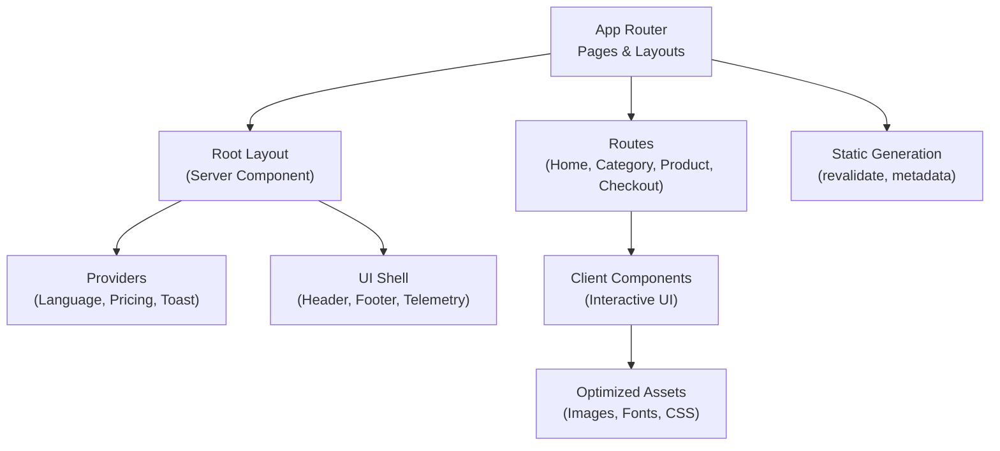
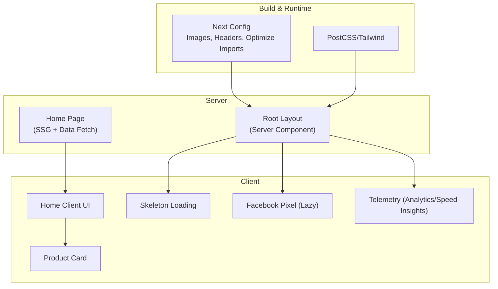
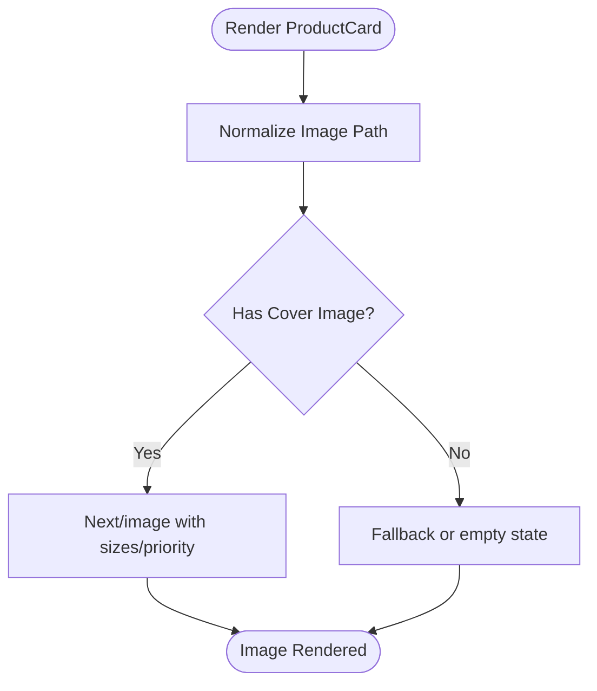
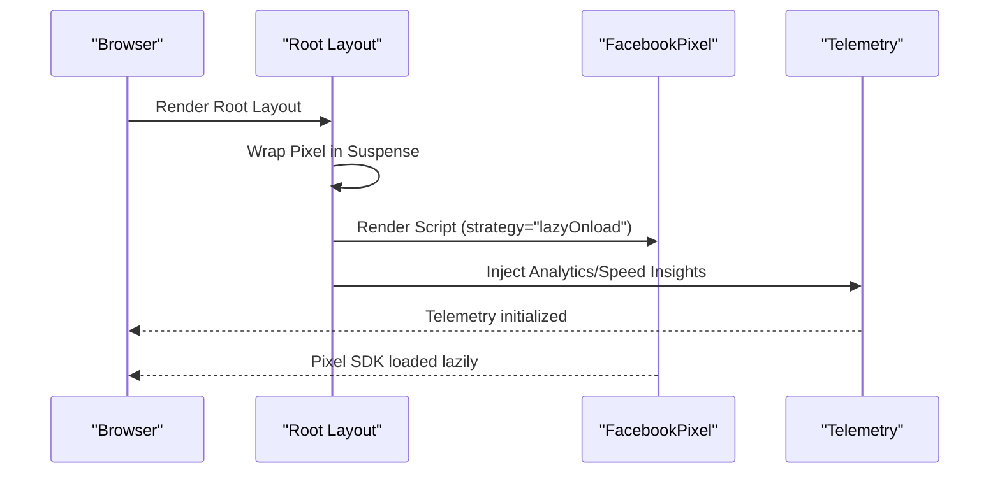
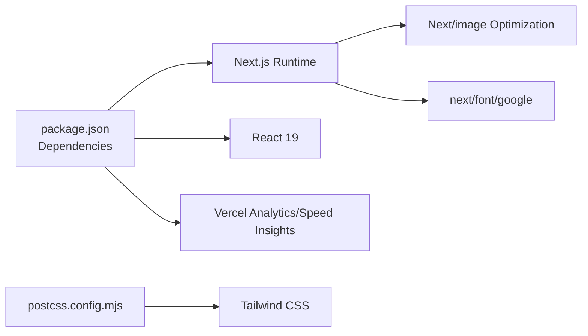

# Performance Optimization

<cite>
**Referenced Files in This Document**
- [next.config.ts](file://next.config.ts)
- [package.json](file://package.json)
- [src/app/layout.tsx](file://src/app/layout.tsx)
- [src/app/globals.css](file://src/app/globals.css)
- [src/components/Telemetry.tsx](file://src/components/Telemetry.tsx)
- [src/components/FacebookPixel.tsx](file://src/components/FacebookPixel.tsx)
- [src/lib/utils.ts](file://src/lib/utils.ts)
- [src/hooks/use-scroll-reveal.ts](file://src/hooks/use-scroll-reveal.ts)
- [src/app/loading.tsx](file://src/app/loading.tsx)
- [src/app/page.tsx](file://src/app/page.tsx)
- [src/components/home/HomePageClient.tsx](file://src/components/home/HomePageClient.tsx)
- [src/components/ProductCard.tsx](file://src/components/ProductCard.tsx)
- [src/lib/image-paths.ts](file://src/lib/image-paths.ts)
- [src/app/checkout/loading.tsx](file://src/app/checkout/loading.tsx)
- [postcss.config.mjs](file://postcss.config.mjs)
</cite>

## Table of Contents
1. [Introduction](#introduction)
2. [Project Structure](#project-structure)
3. [Core Components](#core-components)
4. [Architecture Overview](#architecture-overview)
5. [Detailed Component Analysis](#detailed-component-analysis)
6. [Dependency Analysis](#dependency-analysis)
7. [Performance Considerations](#performance-considerations)
8. [Troubleshooting Guide](#troubleshooting-guide)
9. [Conclusion](#conclusion)
10. [Appendices](#appendices)

## Introduction
This document details AllShop’s frontend performance optimization strategies implemented in the Next.js application. It covers static generation, server components, automatic code splitting, image optimization, font loading, critical rendering path improvements, lazy loading, Suspense boundaries, hydration optimization, telemetry and monitoring, bundle analysis and tree shaking, asset optimization, Core Web Vitals targets, Lighthouse scoring expectations, and performance budget management. The goal is to help developers understand how the current codebase achieves fast, reliable, and user-friendly performance while maintaining maintainability.

## Project Structure
AllShop follows a conventional Next.js App Router project layout with:
- App directory for pages, layouts, metadata, and route handlers
- Components organized under src/components for UI building blocks
- Utilities and libraries under src/lib
- Providers for state and internationalization under src/providers
- Global styles and animations under src/app/globals.css
- Build-time configuration under next.config.ts and postcss.config.mjs

**Diagram sources**
- [src/app/layout.tsx:111-200](file://src/app/layout.tsx#L111-L200)
- [src/app/page.tsx:1-26](file://src/app/page.tsx#L1-L26)
- [src/components/Telemetry.tsx:1-27](file://src/components/Telemetry.tsx#L1-L27)

**Section sources**
- [src/app/layout.tsx:1-201](file://src/app/layout.tsx#L1-L201)
- [src/app/page.tsx:1-26](file://src/app/page.tsx#L1-L26)
- [next.config.ts:53-117](file://next.config.ts#L53-L117)
- [postcss.config.mjs:1-8](file://postcss.config.mjs#L1-L8)

## Core Components
- Root layout as a server component orchestrating providers and telemetry
- Global CSS with Tailwind-based design tokens, keyframes, and scroll-reveal animations
- Telemetry integration for analytics and speed insights
- Facebook Pixel script loaded lazily with safe initialization
- Client-side hooks for scroll-triggered animations
- Skeleton-based loading states for fast perceived performance
- Optimized image rendering with Next/image and responsive sizing
- Utility functions for formatting, discount calculations, and image path normalization

**Section sources**
- [src/app/layout.tsx:111-200](file://src/app/layout.tsx#L111-L200)
- [src/app/globals.css:1-1105](file://src/app/globals.css#L1-L1105)
- [src/components/Telemetry.tsx:1-27](file://src/components/Telemetry.tsx#L1-L27)
- [src/components/FacebookPixel.tsx:1-64](file://src/components/FacebookPixel.tsx#L1-L64)
- [src/hooks/use-scroll-reveal.ts:1-46](file://src/hooks/use-scroll-reveal.ts#L1-L46)
- [src/app/loading.tsx:1-71](file://src/app/loading.tsx#L1-L71)
- [src/components/ProductCard.tsx:1-305](file://src/components/ProductCard.tsx#L1-L305)
- [src/lib/utils.ts:1-102](file://src/lib/utils.ts#L1-L102)
- [src/lib/image-paths.ts:1-78](file://src/lib/image-paths.ts#L1-L78)

## Architecture Overview
The frontend architecture leverages Next.js primitives to minimize client payload and maximize caching:
- Server components render the shell and pass data to client components
- Static generation with incremental regeneration (revalidate) for routes
- Automatic code splitting via route-based bundling
- Next/image with adaptive formats, sizes, and priorities
- Google Fonts with font-display swap and preconnect removal handled by next/font
- Telemetry and analytics injected conditionally in production

**Diagram sources**
- [next.config.ts:53-117](file://next.config.ts#L53-L117)
- [postcss.config.mjs:1-8](file://postcss.config.mjs#L1-L8)
- [src/app/layout.tsx:111-200](file://src/app/layout.tsx#L111-L200)
- [src/app/page.tsx:1-26](file://src/app/page.tsx#L1-L26)
- [src/components/Telemetry.tsx:1-27](file://src/components/Telemetry.tsx#L1-L27)
- [src/components/FacebookPixel.tsx:1-64](file://src/components/FacebookPixel.tsx#L1-L64)
- [src/app/loading.tsx:1-71](file://src/app/loading.tsx#L1-L71)
- [src/components/ProductCard.tsx:1-305](file://src/components/ProductCard.tsx#L1-L305)

## Detailed Component Analysis

### Next.js Optimization Techniques
- Static generation and incremental regeneration:
  - The home route uses asynchronous rendering and a revalidation interval to balance freshness and cache efficiency.
- Server components:
  - The root layout is a server component that renders providers and telemetry, reducing client-side JavaScript.
- Automatic code splitting:
  - Route segments naturally split bundles; client components are marked with "use client" to isolate client code.

**Section sources**
- [src/app/page.tsx:5-11](file://src/app/page.tsx#L5-L11)
- [src/app/layout.tsx:111-200](file://src/app/layout.tsx#L111-L200)

### Image Optimization
- Next/image configuration:
  - Adaptive formats (AVIF/WebP), cache TTL tuning, device and image sizes, and remote pattern hosts for Supabase and custom domains.
- Responsive image rendering:
  - Product cards use fill-based images with sizes and priority hints to improve Core Web Vitals.
- Legacy path normalization:
  - Ensures consistent image URLs across datasets and reduces broken assets.

**Diagram sources**
- [src/components/ProductCard.tsx:139-147](file://src/components/ProductCard.tsx#L139-L147)
- [src/lib/image-paths.ts:40-72](file://src/lib/image-paths.ts#L40-L72)

**Section sources**
- [next.config.ts:64-74](file://next.config.ts#L64-L74)
- [src/components/ProductCard.tsx:139-147](file://src/components/ProductCard.tsx#L139-L147)
- [src/lib/image-paths.ts:1-78](file://src/lib/image-paths.ts#L1-L78)

### Font Loading Strategies
- next/font/google is used for Jakarta Sans and DM Serif Display with font-display swap to avoid FOIT/FOUT.
- Preconnect optimizations are removed because next/font handles this automatically.

**Section sources**
- [src/app/layout.tsx:20-31](file://src/app/layout.tsx#L20-L31)
- [src/app/layout.tsx:166-166](file://src/app/layout.tsx#L166-L166)

### Critical CSS Extraction and Tailwind
- Tailwind is configured via PostCSS; design tokens and keyframes are centralized in globals.css to reduce runtime CSS generation overhead.
- Utility-first CSS minimizes custom CSS and leverages prebuilt animations.

**Section sources**
- [postcss.config.mjs:1-8](file://postcss.config.mjs#L1-L8)
- [src/app/globals.css:1-122](file://src/app/globals.css#L1-L122)

### Lazy Loading and Suspense Boundaries
- Suspense boundary around third-party scripts (Facebook Pixel) ensures non-critical UI does not block the main render.
- Skeleton-based loading states for home and checkout pages provide instant perceived performance.

**Diagram sources**
- [src/app/layout.tsx:180-182](file://src/app/layout.tsx#L180-L182)
- [src/components/FacebookPixel.tsx:42-62](file://src/components/FacebookPixel.tsx#L42-L62)
- [src/components/Telemetry.tsx:20-25](file://src/components/Telemetry.tsx#L20-L25)

**Section sources**
- [src/app/layout.tsx:180-182](file://src/app/layout.tsx#L180-L182)
- [src/app/loading.tsx:1-71](file://src/app/loading.tsx#L1-L71)
- [src/app/checkout/loading.tsx:1-77](file://src/app/checkout/loading.tsx#L1-L77)

### Hydration Optimization
- Hydration warnings are suppressed selectively in the root HTML tag to avoid unnecessary client-server mismatches in non-critical areas.
- Telemetry and third-party scripts are conditionally rendered in production to reduce hydration work during SSR.

**Section sources**
- [src/app/layout.tsx:161-161](file://src/app/layout.tsx#L161-L161)
- [src/components/Telemetry.tsx:12-18](file://src/components/Telemetry.tsx#L12-L18)

### Component Suspense Boundaries
- The root layout wraps non-critical client components in Suspense to allow streaming server rendering and progressive hydration.
- Loading UIs are route-specific and use Skeleton components to keep the interface responsive.

**Section sources**
- [src/app/layout.tsx:180-182](file://src/app/layout.tsx#L180-L182)
- [src/app/loading.tsx:1-71](file://src/app/loading.tsx#L1-L71)

### Bundle Analysis, Tree Shaking, and Asset Optimization
- Package imports are optimized for specific libraries to reduce bundle size.
- Tailwind purges unused CSS at build time; PostCSS pipeline is configured accordingly.
- Image optimization and font optimization reduce transfer sizes.

**Section sources**
- [next.config.ts:57-63](file://next.config.ts#L57-L63)
- [postcss.config.mjs:1-8](file://postcss.config.mjs#L1-L8)
- [package.json:12-26](file://package.json#L12-L26)

### Metrics Collection, Performance Monitoring, and Debugging Tools
- Vercel Analytics and Speed Insights are integrated conditionally in production and exclude specific internal routes.
- Facebook Pixel is loaded lazily with safe initialization to avoid blocking the main thread.
- Utilities provide shared helpers for formatting and discount calculations to keep components lean.

**Section sources**
- [src/components/Telemetry.tsx:1-27](file://src/components/Telemetry.tsx#L1-L27)
- [src/components/FacebookPixel.tsx:1-64](file://src/components/FacebookPixel.tsx#L1-L64)
- [src/lib/utils.ts:8-27](file://src/lib/utils.ts#L8-L27)

### Core Web Vitals Improvement Strategies and Lighthouse Targets
- Largest Contentful Paint (LCP):
  - Use next/image with appropriate sizes and priority for above-the-fold images.
  - Keep skeleton loading minimal and focused on critical sections.
- First Input Delay (FID)/Interaction to Next Paint (INP):
  - Minimize client-side JavaScript; defer non-critical scripts.
  - Use Suspense boundaries to progressively reveal content.
- Cumulative Layout Shift (CLS):
  - Reserve space for images using aspect ratios and skeleton placeholders.
  - Avoid late-inserted content that shifts the layout.

[No sources needed since this section provides general guidance]

### Performance Budget Management
- Monitor bundle sizes with Next.js build stats and Lighthouse budgets.
- Keep the number of external scripts small and lazy-load where possible.
- Regularly audit unused CSS and remove legacy animations or utilities.

[No sources needed since this section provides general guidance]

## Dependency Analysis
The frontend depends on Next.js runtime, React 19, and Vercel telemetry. Image optimization relies on Next.js configuration and Supabase-hosted assets. Tailwind is configured via PostCSS.

**Diagram sources**
- [package.json:12-26](file://package.json#L12-L26)
- [next.config.ts:64-74](file://next.config.ts#L64-L74)
- [postcss.config.mjs:1-8](file://postcss.config.mjs#L1-L8)

**Section sources**
- [package.json:12-26](file://package.json#L12-L26)
- [next.config.ts:53-117](file://next.config.ts#L53-L117)
- [postcss.config.mjs:1-8](file://postcss.config.mjs#L1-L8)

## Performance Considerations
- Prefer server components for non-interactive shells and metadata.
- Use Skeleton loading for long lists and forms to maintain interactivity.
- Keep client components small and lazy-load heavy libraries.
- Ensure images are sized appropriately and use modern formats.
- Avoid layout thrashing by reserving space for dynamic content.

[No sources needed since this section provides general guidance]

## Troubleshooting Guide
- Telemetry not reporting:
  - Verify production environment and excluded route prefixes.
- Facebook Pixel not firing:
  - Confirm pixel ID environment variable and lazy strategy usage.
- Fonts causing layout shift:
  - Ensure font-display swap and avoid preconnect overrides.
- Slow builds or large bundles:
  - Audit unused CSS and confirm optimizePackageImports configuration.

**Section sources**
- [src/components/Telemetry.tsx:7-18](file://src/components/Telemetry.tsx#L7-L18)
- [src/components/FacebookPixel.tsx:13-15](file://src/components/FacebookPixel.tsx#L13-L15)
- [src/app/layout.tsx:20-31](file://src/app/layout.tsx#L20-L31)
- [next.config.ts:57-63](file://next.config.ts#L57-L63)

## Conclusion
AllShop’s Next.js frontend applies a comprehensive set of performance best practices: server components for minimal client payload, static generation with incremental updates, automatic code splitting, optimized images and fonts, skeleton-based loading, and telemetry-driven monitoring. These strategies collectively improve Core Web Vitals, reduce bundle sizes, and enhance user experience. Continued monitoring, periodic audits, and adherence to performance budgets will sustain and further improve performance over time.

## Appendices
- Example setup references:
  - Telemetry integration: [src/components/Telemetry.tsx:1-27](file://src/components/Telemetry.tsx#L1-L27)
  - Facebook Pixel lazy load: [src/components/FacebookPixel.tsx:42-62](file://src/components/FacebookPixel.tsx#L42-L62)
  - Skeleton loading states: [src/app/loading.tsx:1-71](file://src/app/loading.tsx#L1-L71), [src/app/checkout/loading.tsx:1-77](file://src/app/checkout/loading.tsx#L1-L77)
  - Image optimization config: [next.config.ts:64-74](file://next.config.ts#L64-L74)
  - Global CSS and animations: [src/app/globals.css:1-1105](file://src/app/globals.css#L1-L1105)