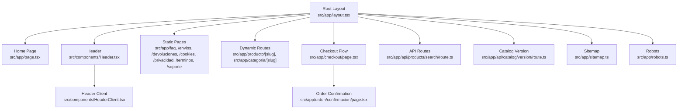
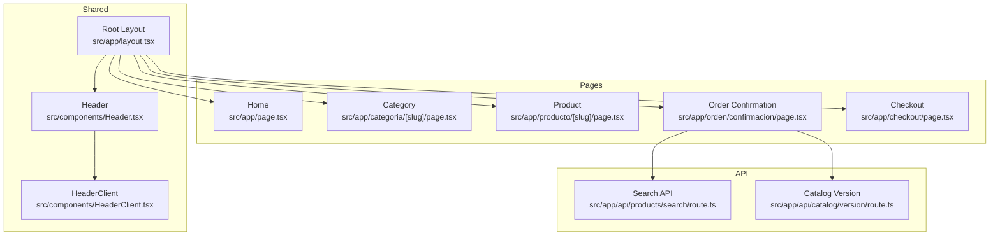
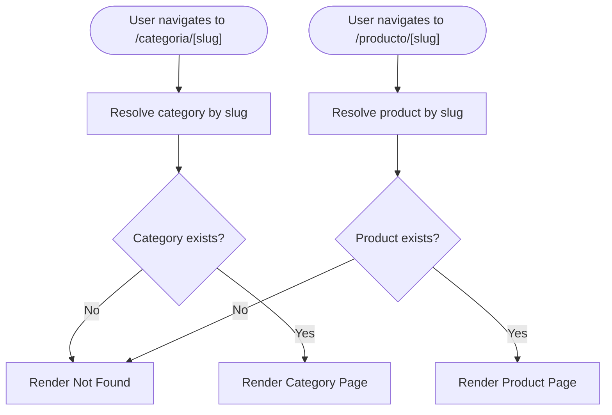
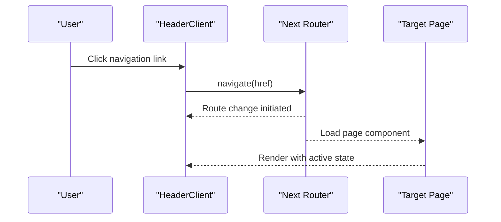
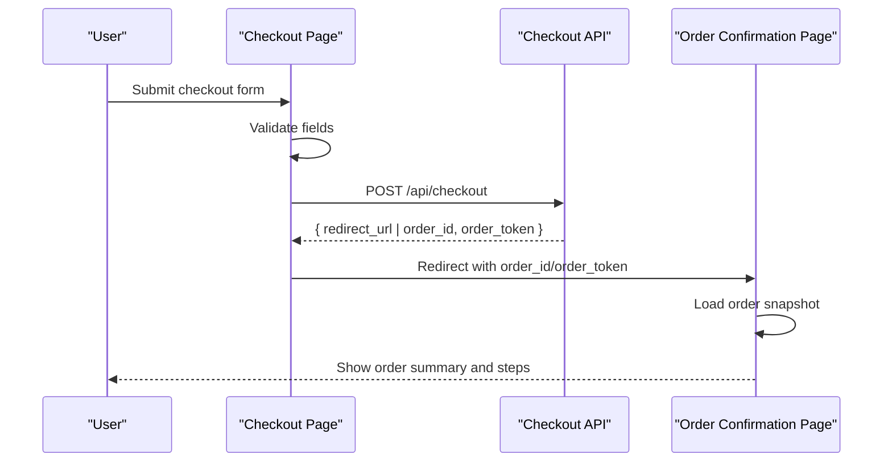
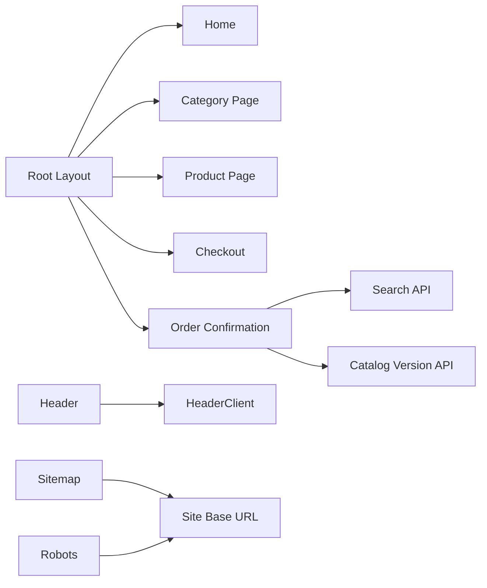

# Routing & Navigation

<cite>
**Referenced Files in This Document**
- [layout.tsx](file://src/app/layout.tsx)
- [page.tsx](file://src/app/page.tsx)
- [Header.tsx](file://src/components/Header.tsx)
- [HeaderClient.tsx](file://src/components/HeaderClient.tsx)
- [checkout/page.tsx](file://src/app/checkout/page.tsx)
- [orden/confirmacion/page.tsx](file://src/app/orden/confirmacion/page.tsx)
- [api/products/search/route.ts](file://src/app/api/products/search/route.ts)
- [api/catalog/version/route.ts](file://src/app/api/catalog/version/route.ts)
- [site.ts](file://src/lib/site.ts)
- [sitemap.ts](file://src/app/sitemap.ts)
- [robots.ts](file://src/app/robots.ts)
</cite>

## Table of Contents
1. [Introduction](#introduction)
2. [Project Structure](#project-structure)
3. [Core Components](#core-components)
4. [Architecture Overview](#architecture-overview)
5. [Detailed Component Analysis](#detailed-component-analysis)
6. [Dependency Analysis](#dependency-analysis)
7. [Performance Considerations](#performance-considerations)
8. [Troubleshooting Guide](#troubleshooting-guide)
9. [Conclusion](#conclusion)

## Introduction
This document explains AllShop’s routing and navigation system built with Next.js App Router. It covers the page-based architecture, dynamic routes for products and categories, static pages, navigation patterns, route parameters handling, URL structure, header navigation, internal linking strategies, programmatic navigation, route guards, SEO-friendly URLs, canonical tags, meta management, prefetching strategies, and navigation performance optimizations.

## Project Structure
AllShop organizes routes under the src/app directory using the App Router convention. Pages are grouped by feature and URL segment, with dynamic routes using square brackets. Shared metadata and providers live in the root layout, while static pages and dynamic pages coexist alongside API routes for search and catalog versioning.

**Diagram sources**
- [layout.tsx:112-202](file://src/app/layout.tsx#L112-L202)
- [page.tsx:13-25](file://src/app/page.tsx#L13-L25)
- [Header.tsx:34-36](file://src/components/Header.tsx#L34-L36)
- [HeaderClient.tsx:14-252](file://src/components/HeaderClient.tsx#L14-L252)
- [checkout/page.tsx:54-595](file://src/app/checkout/page.tsx#L54-L595)
- [orden/confirmacion/page.tsx:75-404](file://src/app/orden/confirmacion/page.tsx#L75-L404)
- [api/products/search/route.ts:6-30](file://src/app/api/products/search/route.ts#L6-L30)
- [api/catalog/version/route.ts:7-22](file://src/app/api/catalog/version/route.ts#L7-L22)
- [sitemap.ts:9-60](file://src/app/sitemap.ts#L9-L60)
- [robots.ts:4-28](file://src/app/robots.ts#L4-L28)

**Section sources**
- [layout.tsx:112-202](file://src/app/layout.tsx#L112-L202)
- [page.tsx:13-25](file://src/app/page.tsx#L13-L25)
- [Header.tsx:34-36](file://src/components/Header.tsx#L34-L36)
- [HeaderClient.tsx:14-252](file://src/components/HeaderClient.tsx#L14-L252)
- [checkout/page.tsx:54-595](file://src/app/checkout/page.tsx#L54-L595)
- [orden/confirmacion/page.tsx:75-404](file://src/app/orden/confirmacion/page.tsx#L75-L404)
- [api/products/search/route.ts:6-30](file://src/app/api/products/search/route.ts#L6-L30)
- [api/catalog/version/route.ts:7-22](file://src/app/api/catalog/version/route.ts#L7-L22)
- [sitemap.ts:9-60](file://src/app/sitemap.ts#L9-L60)
- [robots.ts:4-28](file://src/app/robots.ts#L4-L28)

## Core Components
- Root layout sets global metadata, providers, and shared UI scaffolding.
- Home page defines canonical and revalidation behavior.
- Header and HeaderClient implement desktop and mobile navigation, cart badge, and search dialog.
- Dynamic product and category pages use [slug] parameters.
- Checkout and order confirmation pages demonstrate programmatic navigation and route guards.
- Sitemap and robots define SEO policies and crawlability.

**Section sources**
- [layout.tsx:34-103](file://src/app/layout.tsx#L34-L103)
- [page.tsx:7-11](file://src/app/page.tsx#L7-L11)
- [Header.tsx:34-36](file://src/components/Header.tsx#L34-L36)
- [HeaderClient.tsx:25-36](file://src/components/HeaderClient.tsx#L25-L36)

## Architecture Overview
The routing architecture follows Next.js conventions:
- Static routes: /faq, /envios, /devoluciones, /cookies, /privacidad, /terminos, /soporte
- Dynamic routes: /categoria/[slug], /producto/[slug], /panel-privado/[token], /orden/confirmacion (with query params)
- API routes: /api/products/search, /api/catalog/version, and others for internal/admin use
- Canonical and SEO metadata are centralized in pages and computed via helpers

**Diagram sources**
- [layout.tsx:112-202](file://src/app/layout.tsx#L112-L202)
- [page.tsx:13-25](file://src/app/page.tsx#L13-L25)
- [Header.tsx:34-36](file://src/components/Header.tsx#L34-L36)
- [HeaderClient.tsx:14-252](file://src/components/HeaderClient.tsx#L14-L252)
- [checkout/page.tsx:54-595](file://src/app/checkout/page.tsx#L54-L595)
- [orden/confirmacion/page.tsx:75-404](file://src/app/orden/confirmacion/page.tsx#L75-L404)
- [api/products/search/route.ts:6-30](file://src/app/api/products/search/route.ts#L6-L30)
- [api/catalog/version/route.ts:7-22](file://src/app/api/catalog/version/route.ts#L7-L22)

## Detailed Component Analysis

### Dynamic Routes: Products and Categories
- Category page: src/app/categoria/[slug]/page.tsx
- Product page: src/app/producto/[slug]/page.tsx
- Both pages are dynamic and rely on the slug parameter to resolve content server-side.
- SEO metadata is set per page; canonical is defined in the home page and should be set similarly in product/category pages.

**Diagram sources**
- [HeaderClient.tsx:25-36](file://src/components/HeaderClient.tsx#L25-L36)
- [layout.tsx:34-103](file://src/app/layout.tsx#L34-L103)

**Section sources**
- [HeaderClient.tsx:25-36](file://src/components/HeaderClient.tsx#L25-L36)
- [layout.tsx:34-103](file://src/app/layout.tsx#L34-L103)

### Header Navigation and Internal Linking
- Desktop and mobile navigation lists are defined in HeaderClient and bound to the current path to highlight active links.
- Internal links use next/link for client-side navigation and prefetching.
- Cart badge displays item count and updates after hydration.

**Diagram sources**
- [HeaderClient.tsx:112-135](file://src/components/HeaderClient.tsx#L112-L135)
- [HeaderClient.tsx:212-234](file://src/components/HeaderClient.tsx#L212-L234)

**Section sources**
- [HeaderClient.tsx:14-252](file://src/components/HeaderClient.tsx#L14-L252)

### Programmatic Navigation and Route Guards
- Checkout page demonstrates guarded navigation:
  - Validates form data before submission.
  - Uses query params to redirect to order confirmation after successful checkout.
  - Clears cart upon successful order creation.
- Order confirmation page:
  - Reads order_id and optional order_token from query params.
  - Polls order status until resolved.
  - Stores recent orders in localStorage for quick access.

**Diagram sources**
- [checkout/page.tsx:227-353](file://src/app/checkout/page.tsx#L227-L353)
- [orden/confirmacion/page.tsx:156-191](file://src/app/orden/confirmacion/page.tsx#L156-L191)

**Section sources**
- [checkout/page.tsx:227-353](file://src/app/checkout/page.tsx#L227-L353)
- [orden/confirmacion/page.tsx:156-191](file://src/app/orden/confirmacion/page.tsx#L156-L191)

### URL Structure and SEO-Friendly Patterns
- Home: /
- Static pages: /faq, /envios, /devoluciones, /cookies, /privacidad, /terminos, /soporte
- Categories: /categoria/[slug]
- Products: /producto/[slug]
- Checkout: /checkout
- Order confirmation: /orden/confirmacion?order_id=...&order_token=...
- Panel (admin): /panel-privado/[token]

Sitemap and robots define crawl policy and priorities:
- Sitemap includes static pages, categories, and products with appropriate frequencies and priorities.
- Robots disallows API and admin routes from indexing.

**Section sources**
- [sitemap.ts:9-60](file://src/app/sitemap.ts#L9-L60)
- [robots.ts:4-28](file://src/app/robots.ts#L4-L28)

### Meta Information Management and Canonical Tags
- Root layout sets global metadata (title, description, Open Graph, Twitter), and disables canonical and OG URL at the root level to allow per-page overrides.
- Home page sets alternates.canonical to "/".
- Absolute URL helpers ensure canonical and OG images use the configured base URL.

**Section sources**
- [layout.tsx:34-103](file://src/app/layout.tsx#L34-L103)
- [page.tsx:7-11](file://src/app/page.tsx#L7-L11)
- [site.ts:17-25](file://src/lib/site.ts#L17-L25)

### API Routes for Search and Catalog Versioning
- Search API: Returns a subset of product data for client-side search suggestions.
- Catalog version API: Provides a version token for runtime catalog synchronization.

**Section sources**
- [api/products/search/route.ts:6-30](file://src/app/api/products/search/route.ts#L6-L30)
- [api/catalog/version/route.ts:7-22](file://src/app/api/catalog/version/route.ts#L7-L22)

## Dependency Analysis
The routing system exhibits low coupling and high cohesion:
- Pages depend on shared providers and layout.
- Header depends on client-side navigation and cart store.
- Order confirmation depends on API routes and local storage.
- Sitemap and robots depend on site base URL helpers.

**Diagram sources**
- [layout.tsx:112-202](file://src/app/layout.tsx#L112-L202)
- [Header.tsx:34-36](file://src/components/Header.tsx#L34-L36)
- [HeaderClient.tsx:14-252](file://src/components/HeaderClient.tsx#L14-L252)
- [checkout/page.tsx:54-595](file://src/app/checkout/page.tsx#L54-L595)
- [orden/confirmacion/page.tsx:75-404](file://src/app/orden/confirmacion/page.tsx#L75-L404)
- [api/products/search/route.ts:6-30](file://src/app/api/products/search/route.ts#L6-L30)
- [api/catalog/version/route.ts:7-22](file://src/app/api/catalog/version/route.ts#L7-L22)
- [sitemap.ts:9-60](file://src/app/sitemap.ts#L9-L60)
- [robots.ts:4-28](file://src/app/robots.ts#L4-L28)
- [site.ts:17-25](file://src/lib/site.ts#L17-L25)

**Section sources**
- [layout.tsx:112-202](file://src/app/layout.tsx#L112-L202)
- [Header.tsx:34-36](file://src/components/Header.tsx#L34-L36)
- [HeaderClient.tsx:14-252](file://src/components/HeaderClient.tsx#L14-L252)
- [checkout/page.tsx:54-595](file://src/app/checkout/page.tsx#L54-L595)
- [orden/confirmacion/page.tsx:75-404](file://src/app/orden/confirmacion/page.tsx#L75-L404)
- [api/products/search/route.ts:6-30](file://src/app/api/products/search/route.ts#L6-L30)
- [api/catalog/version/route.ts:7-22](file://src/app/api/catalog/version/route.ts#L7-L22)
- [sitemap.ts:9-60](file://src/app/sitemap.ts#L9-L60)
- [robots.ts:4-28](file://src/app/robots.ts#L4-L28)
- [site.ts:17-25](file://src/lib/site.ts#L17-L25)

## Performance Considerations
- Revalidation:
  - Home page configures revalidate to balance freshness and caching.
  - Search API sets cache-control headers to reuse data efficiently.
- Prefetching:
  - next/link enables automatic prefetching for visible links.
  - Client-side navigation avoids full page reloads.
- Hydration and lazy loading:
  - Header is dynamically imported to reduce initial bundle size.
  - Suspense boundaries in order confirmation prevent blocking renders.
- Image and asset optimization:
  - Next.js image optimization is configured via next.config and fonts via next/font/google.

**Section sources**
- [page.tsx:5-11](file://src/app/page.tsx#L5-L11)
- [api/products/search/route.ts:22-26](file://src/app/api/products/search/route.ts#L22-L26)
- [Header.tsx:9-32](file://src/components/Header.tsx#L9-L32)
- [layout.tsx:170-198](file://src/app/layout.tsx#L170-L198)
- [orden/confirmacion/page.tsx:389-403](file://src/app/orden/confirmacion/page.tsx#L389-L403)

## Troubleshooting Guide
- Dynamic route resolution failures:
  - Verify slug correctness and existence in the database.
  - Ensure category/product pages handle not-found gracefully.
- Canonical and SEO issues:
  - Confirm alternates.canonical is set on content pages.
  - Use absolute URLs for OG images and canonical via site helpers.
- Programmatic navigation:
  - Validate query params parsing in order confirmation.
  - Confirm redirects after checkout lead to the correct confirmation route.
- API route errors:
  - Check cache-control headers and error responses in search and catalog version APIs.
- Robots and sitemap:
  - Confirm robots disallows sensitive routes and points to sitemap.xml.

**Section sources**
- [page.tsx:7-11](file://src/app/page.tsx#L7-L11)
- [site.ts:17-25](file://src/lib/site.ts#L17-L25)
- [orden/confirmacion/page.tsx:75-191](file://src/app/orden/confirmacion/page.tsx#L75-L191)
- [checkout/page.tsx:227-353](file://src/app/checkout/page.tsx#L227-L353)
- [api/products/search/route.ts:6-30](file://src/app/api/products/search/route.ts#L6-L30)
- [api/catalog/version/route.ts:7-22](file://src/app/api/catalog/version/route.ts#L7-L22)
- [robots.ts:4-28](file://src/app/robots.ts#L4-L28)
- [sitemap.ts:9-60](file://src/app/sitemap.ts#L9-L60)

## Conclusion
AllShop’s routing and navigation system leverages Next.js App Router effectively:
- Clear page-based architecture with dynamic routes for products and categories.
- Robust header navigation with active-state highlighting and cart integration.
- Programmatic navigation and route guards in checkout and order confirmation.
- Strong SEO foundation with sitemap, robots, and per-page canonical/meta management.
- Performance-conscious caching, prefetching, and hydration strategies.