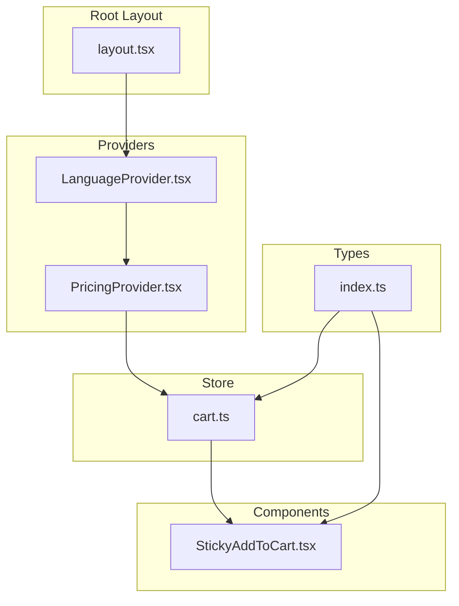
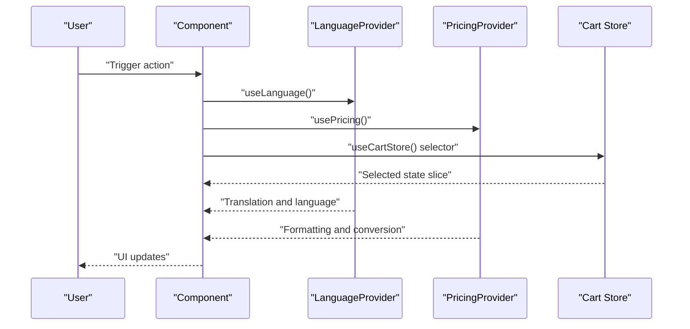
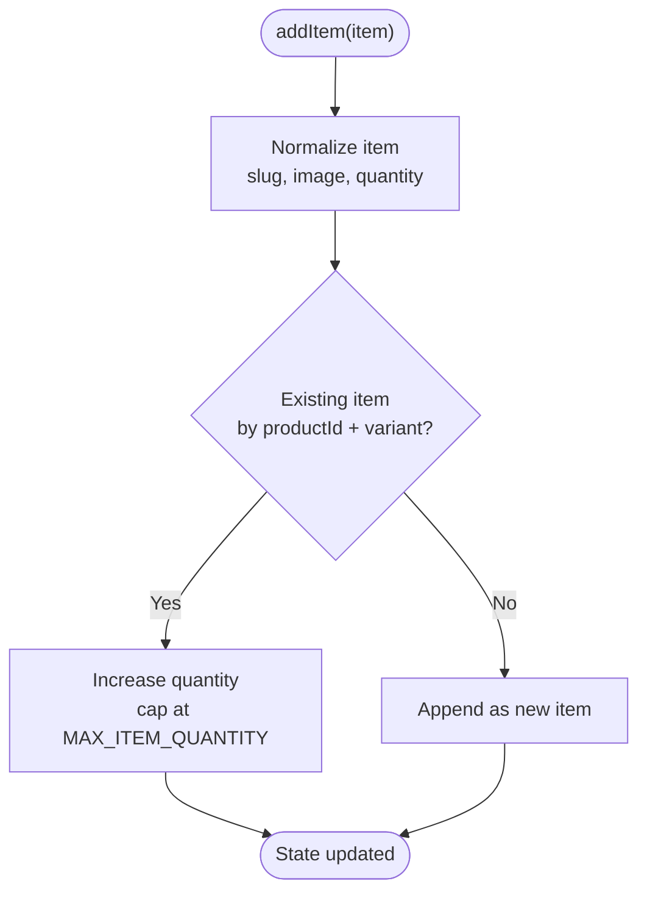
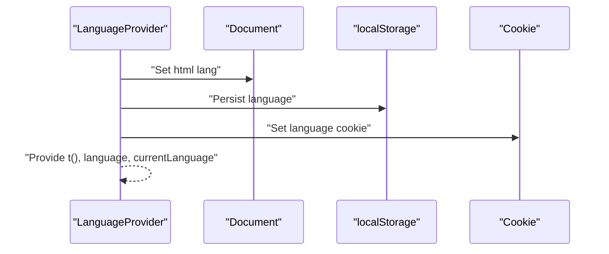
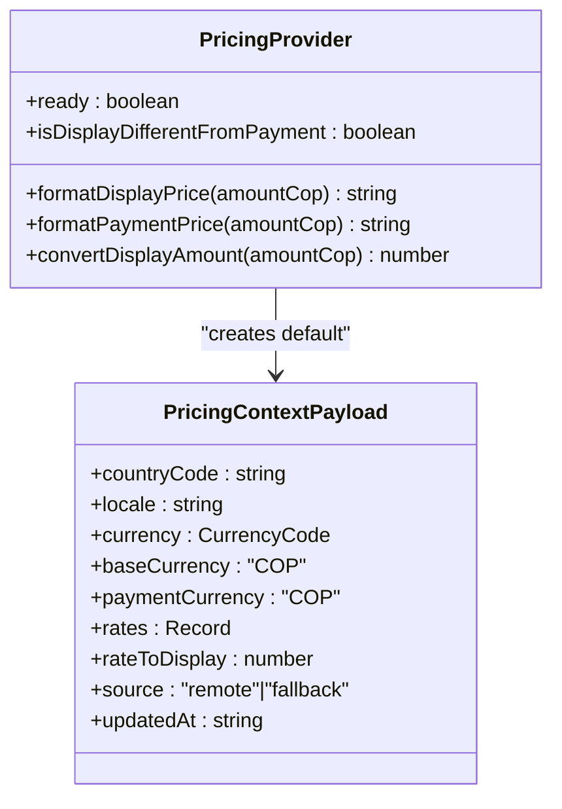
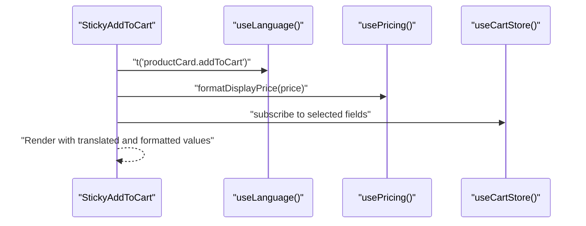
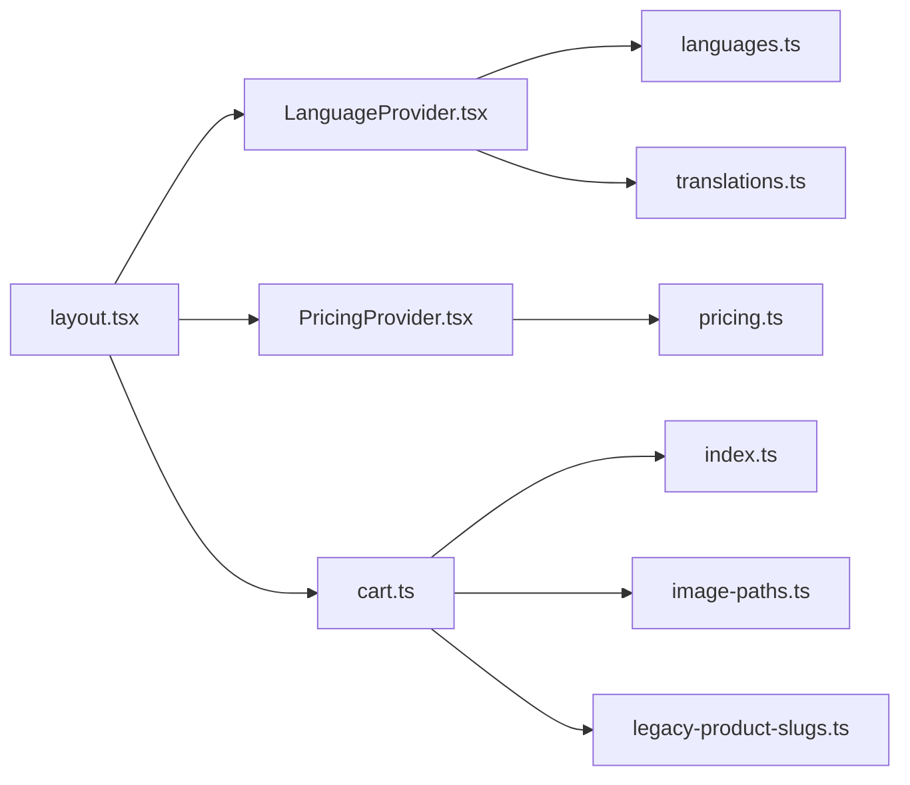

# State Management

<cite>
**Referenced Files in This Document**
- [cart.ts](file://src/store/cart.ts)
- [LanguageProvider.tsx](file://src/providers/LanguageProvider.tsx)
- [PricingProvider.tsx](file://src/providers/PricingProvider.tsx)
- [pricing.ts](file://src/lib/pricing.ts)
- [languages.ts](file://src/providers/languages.ts)
- [translations.ts](file://src/providers/translations.ts)
- [index.ts](file://src/types/index.ts)
- [layout.tsx](file://src/app/layout.tsx)
- [StickyAddToCart.tsx](file://src/components/product/StickyAddToCart.tsx)
</cite>

## Table of Contents
1. [Introduction](#introduction)
2. [Project Structure](#project-structure)
3. [Core Components](#core-components)
4. [Architecture Overview](#architecture-overview)
5. [Detailed Component Analysis](#detailed-component-analysis)
6. [Dependency Analysis](#dependency-analysis)
7. [Performance Considerations](#performance-considerations)
8. [Troubleshooting Guide](#troubleshooting-guide)
9. [Conclusion](#conclusion)
10. [Appendices](#appendices)

## Introduction
This document explains AllShop’s state management architecture with a focus on:
- Zustand-based shopping cart store, including state shape, actions, middleware, hydration, and persistence
- Provider pattern for language and pricing contexts, including data flow and synchronization
- Custom hooks usage, cross-component state sharing, and persistence strategies
- Examples of state updates, subscriptions, and performance optimizations
- Best practices, debugging, testing, and SSR/hydration considerations

## Project Structure
The state management spans three primary areas:
- Store: a single cart Zustand store with persistence and hydration
- Providers: language and pricing contexts wired at the root layout
- Types: shared TypeScript interfaces used by the store and components

**Diagram sources**
- [layout.tsx:178-197](file://src/app/layout.tsx#L178-L197)
- [LanguageProvider.tsx:44-74](file://src/providers/LanguageProvider.tsx#L44-L74)
- [PricingProvider.tsx:33-57](file://src/providers/PricingProvider.tsx#L33-L57)
- [cart.ts:53-147](file://src/store/cart.ts#L53-L147)
- [index.ts:3-14](file://src/types/index.ts#L3-L14)
- [StickyAddToCart.tsx:6-25](file://src/components/product/StickyAddToCart.tsx#L6-L25)

**Section sources**
- [layout.tsx:178-197](file://src/app/layout.tsx#L178-L197)
- [cart.ts:53-147](file://src/store/cart.ts#L53-L147)
- [index.ts:3-14](file://src/types/index.ts#L3-L14)

## Core Components
- Zustand cart store
  - State: items array, hydration flag
  - Actions: replaceItems, addItem, removeItem, updateQuantity, clearCart, getTotal, getItemCount, getShippingType
  - Middleware: persist with storage key and hydration callback
  - Normalization: legacy image paths, slugs, and quantities
- Language provider
  - Context exposes language, setLanguage, translation function, and current language metadata
  - Persists language preference to localStorage and cookie
- Pricing provider
  - Context exposes currency, rates, locales, and formatting helpers
  - Computes display/payment conversions and formatting

**Section sources**
- [cart.ts:39-51](file://src/store/cart.ts#L39-L51)
- [cart.ts:53-147](file://src/store/cart.ts#L53-L147)
- [LanguageProvider.tsx:10-26](file://src/providers/LanguageProvider.tsx#L10-L26)
- [PricingProvider.tsx:12-31](file://src/providers/PricingProvider.tsx#L12-L31)

## Architecture Overview
The system uses a minimal, predictable state model:
- Root layout composes providers that inject language and pricing context
- Components consume these contexts via custom hooks
- The cart store persists to storage and hydrates on mount, normalizing legacy data
- Components subscribe to context and store via hooks

**Diagram sources**
- [layout.tsx:178-197](file://src/app/layout.tsx#L178-L197)
- [LanguageProvider.tsx:77-79](file://src/providers/LanguageProvider.tsx#L77-L79)
- [PricingProvider.tsx:60-62](file://src/providers/PricingProvider.tsx#L60-L62)
- [cart.ts:53-147](file://src/store/cart.ts#L53-L147)

## Detailed Component Analysis

### Zustand Cart Store
- State structure
  - items: array of CartItem with productId, variant, name, price, image, quantity, stockLocation
  - hasHydrated: boolean flag indicating hydration completion
- Actions
  - replaceItems: bulk replacement of cart items
  - addItem: deduplicates by productId + variant, caps quantity at a constant
  - removeItem: filters out matching item
  - updateQuantity: deletes if zero, caps at constant otherwise
  - clearCart: empties items
  - getTotal/getItemCount: derived computations
  - getShippingType: determines national/international/mixed based on stockLocation
- Middleware and hydration
  - persist with storage key
  - onRehydrateStorage normalizes legacy images, slugs, and quantities during hydration
  - sets hasHydrated after normalization
- Normalization
  - Legacy image path fallback for removed directories
  - Slug normalization via legacy mapping
  - Quantity flooring and minimum enforcement

**Diagram sources**
- [cart.ts:62-81](file://src/store/cart.ts#L62-L81)
- [cart.ts:12-31](file://src/store/cart.ts#L12-L31)

**Section sources**
- [cart.ts:39-51](file://src/store/cart.ts#L39-L51)
- [cart.ts:53-147](file://src/store/cart.ts#L53-L147)
- [index.ts:3-14](file://src/types/index.ts#L3-L14)

### Language Context Provider
- Exposes translation function t(key, vars?), language code, and current language metadata
- Persists language to localStorage and cookie on change
- Fixed language mode: setLanguage is a no-op to enforce a single language
- Uses translations map with ES overrides and fallback to Spanish

**Diagram sources**
- [LanguageProvider.tsx:53-57](file://src/providers/LanguageProvider.tsx#L53-L57)
- [languages.ts:1-24](file://src/providers/languages.ts#L1-L24)
- [translations.ts:609-612](file://src/providers/translations.ts#L609-L612)

**Section sources**
- [LanguageProvider.tsx:44-74](file://src/providers/LanguageProvider.tsx#L44-L74)
- [languages.ts:1-24](file://src/providers/languages.ts#L1-L24)
- [translations.ts:609-612](file://src/providers/translations.ts#L609-L612)

### Pricing Context Provider
- Creates a default pricing payload with fallback rates and locale
- Computes display/payment conversions and formatting helpers
- Exposes ready flag and difference indicator between display and payment currencies

**Diagram sources**
- [PricingProvider.tsx:12-31](file://src/providers/PricingProvider.tsx#L12-L31)
- [pricing.ts:24-34](file://src/lib/pricing.ts#L24-L34)
- [pricing.ts:113-126](file://src/lib/pricing.ts#L113-L126)

**Section sources**
- [PricingProvider.tsx:33-57](file://src/providers/PricingProvider.tsx#L33-L57)
- [pricing.ts:1-146](file://src/lib/pricing.ts#L1-L146)

### Custom Hooks Usage Patterns
- Components consume language and pricing via useLanguage and usePricing
- StickyAddToCart demonstrates:
  - Using t() for localized strings
  - Using formatDisplayPrice for currency formatting
  - Conditional behavior based on variant selection

**Diagram sources**
- [StickyAddToCart.tsx:6-25](file://src/components/product/StickyAddToCart.tsx#L6-L25)

**Section sources**
- [StickyAddToCart.tsx:17-34](file://src/components/product/StickyAddToCart.tsx#L17-L34)

### Cross-Component State Sharing
- Cart store is globally available via Zustand; components subscribe to slices
- Providers share language and pricing across the tree
- Hydration ensures consistent state after SSR

**Section sources**
- [cart.ts:53-147](file://src/store/cart.ts#L53-L147)
- [layout.tsx:178-197](file://src/app/layout.tsx#L178-L197)

## Dependency Analysis
- cart.ts depends on:
  - types.CartItem
  - image normalization utilities
  - legacy slug normalization
  - zustand and zustand/persist
- providers depend on:
  - languages and translations for language context
  - pricing library for currency and formatting
- layout.tsx composes providers at the root

**Diagram sources**
- [cart.ts:5-7](file://src/store/cart.ts#L5-L7)
- [index.ts:3-14](file://src/types/index.ts#L3-L14)
- [LanguageProvider.tsx:3-6](file://src/providers/LanguageProvider.tsx#L3-L6)
- [languages.ts:1-24](file://src/providers/languages.ts#L1-L24)
- [translations.ts:1-2](file://src/providers/translations.ts#L1-L2)
- [PricingProvider.tsx:3-10](file://src/providers/PricingProvider.tsx#L3-L10)
- [pricing.ts:1-146](file://src/lib/pricing.ts#L1-L146)
- [layout.tsx:7-8](file://src/app/layout.tsx#L7-L8)

**Section sources**
- [cart.ts:5-7](file://src/store/cart.ts#L5-L7)
- [index.ts:3-14](file://src/types/index.ts#L3-L14)
- [LanguageProvider.tsx:3-6](file://src/providers/LanguageProvider.tsx#L3-L6)
- [languages.ts:1-24](file://src/providers/languages.ts#L1-L24)
- [translations.ts:1-2](file://src/providers/translations.ts#L1-L2)
- [PricingProvider.tsx:3-10](file://src/providers/PricingProvider.tsx#L3-L10)
- [pricing.ts:1-146](file://src/lib/pricing.ts#L1-L146)
- [layout.tsx:7-8](file://src/app/layout.tsx#L7-L8)

## Performance Considerations
- Prefer narrow selectors to minimize re-renders when subscribing to the cart store
- Keep derived computations (getTotal, getItemCount) memoized at the component level if needed
- Avoid unnecessary deep equality checks; rely on primitive selectors
- Persist only essential fields to reduce storage footprint
- Normalize legacy data once during hydration to avoid repeated work

## Troubleshooting Guide
- Cart hydration anomalies
  - Verify onRehydrateStorage runs and normalization occurs
  - Check that legacy image paths are redirected to fallback
- Quantity limits
  - Confirm MAX_ITEM_QUANTITY is enforced consistently across actions
- Language context not updating
  - Ensure setLanguage is not overridden by fixed behavior
  - Confirm localStorage and cookie keys are present
- Pricing formatting differences
  - Validate currency and locale resolution
  - Confirm rates and conversion helpers compute as expected

**Section sources**
- [cart.ts:125-144](file://src/store/cart.ts#L125-L144)
- [cart.ts:10-11](file://src/store/cart.ts#L10-L11)
- [LanguageProvider.tsx:59-62](file://src/providers/LanguageProvider.tsx#L59-L62)
- [pricing.ts:85-91](file://src/lib/pricing.ts#L85-L91)
- [pricing.ts:128-136](file://src/lib/pricing.ts#L128-L136)

## Conclusion
AllShop’s state management is intentionally simple and robust:
- The cart store encapsulates shopping logic with persistence and hydration
- Providers deliver language and pricing consistently across the app
- Components subscribe to narrow slices and use custom hooks for predictable updates
- Normalization and hydration ensure data integrity across sessions

## Appendices

### State Updates and Subscriptions
- Cart updates
  - Add/remove/update/clear items
  - Derived totals and counts
- Context updates
  - Language and pricing are static in this setup; future expansion could introduce remote fetch and refresh logic

**Section sources**
- [cart.ts:62-104](file://src/store/cart.ts#L62-L104)
- [LanguageProvider.tsx:59-66](file://src/providers/LanguageProvider.tsx#L59-L66)
- [PricingProvider.tsx:34-55](file://src/providers/PricingProvider.tsx#L34-L55)

### Debugging and Testing Strategies
- Unit tests for normalization and helpers
- Snapshot tests for hydrated cart state
- Integration tests for provider composition and hook usage
- E2E tests for cart actions and UI updates

### SSR and Hydration Considerations
- Root layout suppresses hydration warnings for language attributes
- Cart hydration occurs via onRehydrateStorage; ensure legacy normalization runs before rendering
- Providers initialize language and pricing early in the tree to avoid mismatched renders

**Section sources**
- [layout.tsx:162](file://src/app/layout.tsx#L162)
- [cart.ts:127-144](file://src/store/cart.ts#L127-L144)