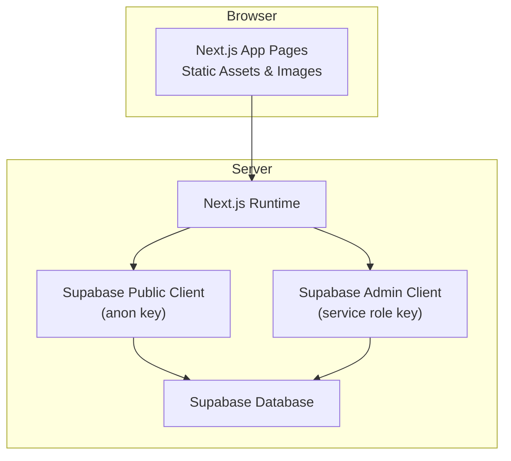
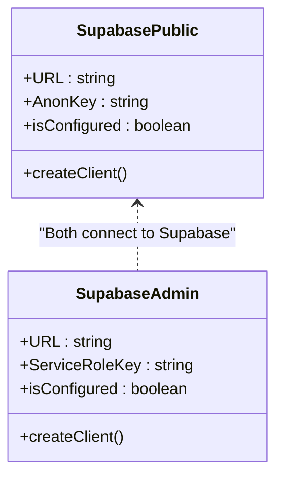
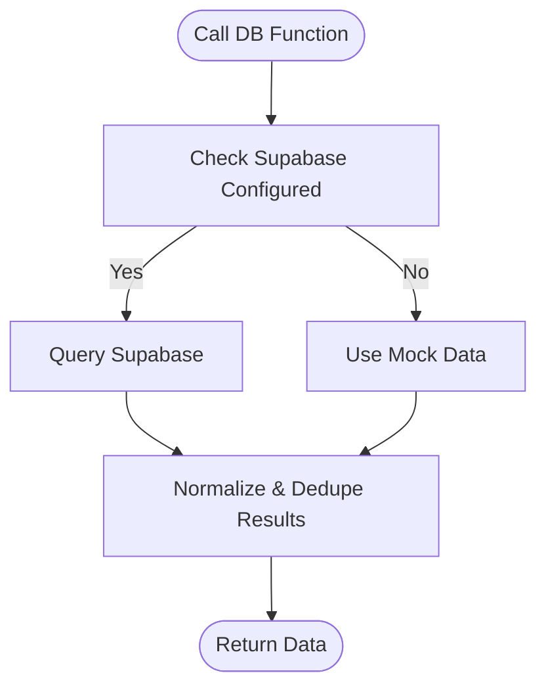
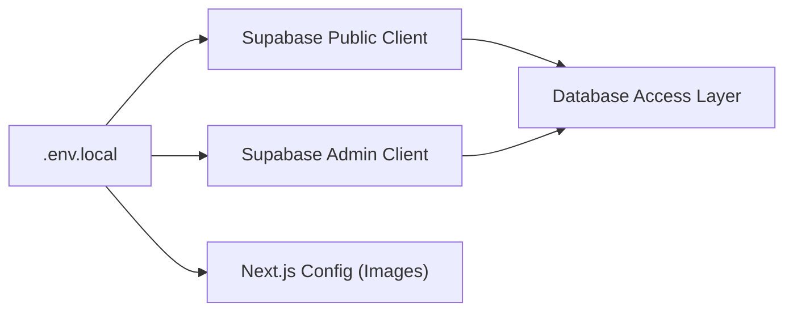

# Getting Started

<cite>
**Referenced Files in This Document**
- [README.md](file://README.md)
- [package.json](file://package.json)
- [full_database_update.sql](file://full_database_update.sql)
- [supabase_bootstrap.sql](file://supabase_bootstrap.sql)
- [sql/01_schema.sql](file://sql/01_schema.sql)
- [sql/02_seed_catalog.sql](file://sql/02_seed_catalog.sql)
- [sql/03_runtime_stock.sql](file://sql/03_runtime_stock.sql)
- [src/lib/supabase.ts](file://src/lib/supabase.ts)
- [src/lib/supabase-admin.ts](file://src/lib/supabase-admin.ts)
- [src/lib/db.ts](file://src/lib/db.ts)
- [next.config.ts](file://next.config.ts)
</cite>

## Table of Contents
1. [Introduction](#introduction)
2. [Prerequisites](#prerequisites)
3. [Environment Setup](#environment-setup)
4. [Installation](#installation)
5. [Environment Variables](#environment-variables)
6. [Database Bootstrap](#database-bootstrap)
7. [Local Development](#local-development)
8. [Initial Project Verification](#initial-project-verification)
9. [Architecture Overview](#architecture-overview)
10. [Detailed Component Analysis](#detailed-component-analysis)
11. [Dependency Analysis](#dependency-analysis)
12. [Performance Considerations](#performance-considerations)
13. [Troubleshooting Guide](#troubleshooting-guide)
14. [Conclusion](#conclusion)

## Introduction
This guide helps you set up the AllShop development environment from scratch. It covers prerequisites, environment configuration, installation, database bootstrap, and validation steps to ensure everything works correctly. AllShop is a Next.js-based e-commerce application tailored for Colombia with cash-on-delivery checkout, manual dispatch management, and integrated Supabase for data and authentication.

## Prerequisites
- Node.js 20+ and npm 10+ installed on your machine.
- Access to a Supabase project with a database, anon public key, and service role key.
- Basic familiarity with command-line tools and environment variables.

**Section sources**
- [README.md:5-8](file://README.md#L5-L8)

## Environment Setup
1. Create a `.env.local` file at the project root.
2. Add all required environment variables as documented below.
3. Keep sensitive keys out of version control.

**Section sources**
- [README.md:12-61](file://README.md#L12-L61)

## Installation
1. Install dependencies:
   ```bash
   npm install
   ```
2. Start the development server:
   ```bash
   npm run dev
   ```

**Section sources**
- [README.md:100-105](file://README.md#L100-L105)
- [package.json:5-11](file://package.json#L5-L11)

## Environment Variables
Below are the required and optional environment variables. Required variables are marked accordingly.

- Application
  - NEXT_PUBLIC_APP_URL: Public URL of your app (e.g., http://localhost:3000)
  - NEXT_PUBLIC_SUPPORT_EMAIL: Support contact email shown in the app

- Supabase (required for real operation)
  - NEXT_PUBLIC_SUPABASE_URL: Supabase project URL
  - NEXT_PUBLIC_SUPABASE_ANON_KEY: Supabase anonymous public key
  - SUPABASE_SERVICE_ROLE_KEY: Supabase service role key (server-only)

- Security (recommended for production)
  - ORDER_LOOKUP_SECRET: Secret for signed order lookup tokens
  - CSRF_SECRET: Secret for CSRF protection
  - ORDER_LOOKUP_TOKEN_TTL_MINUTES: Optional TTL for order lookup tokens (default: 1440 minutes)

- Email (required for order status notifications)
  - SMTP_USER: SMTP username
  - SMTP_PASSWORD: SMTP password
  - EMAIL_FROM: Sender name and email address for outgoing emails

- Admin endpoints (optional)
  - ADMIN_BLOCK_SECRET: Secret for admin endpoint protection

- Internal catalog admin panel (required for internal operations)
  - CATALOG_ADMIN_ACCESS_CODE: Access code for catalog admin panel
  - CATALOG_ADMIN_PATH_TOKEN: Path token for catalog admin panel

- Optional: Free shipping configuration
  - FREE_SHIPPING_PRODUCT_IDS: Comma-separated product IDs to mark as free shipping
  - NEXT_PUBLIC_FREE_SHIPPING_PRODUCT_IDS: Same IDs for frontend
  - FREE_SHIPPING_PRODUCT_SLUGS: Comma-separated product slugs to mark as free shipping
  - NEXT_PUBLIC_FREE_SHIPPING_PRODUCT_SLUGS: Same slugs for frontend

- Optional: Polling/mode settings (for free plan)
  - NEXT_PUBLIC_USAGE_MODE: free or paid
  - NEXT_PUBLIC_SUPABASE_PLAN: free or pro
  - NEXT_PUBLIC_ECO_MODE: Enable eco mode (1 to enable)

- Optional: Low stock alerts
  - LOW_STOCK_ALERTS_ENABLED: Enable low stock alerts (1 to enable)
  - LOW_STOCK_ALERT_THRESHOLD: Threshold for low stock alerts (default: 5)

- Maintenance
  - MAINTENANCE_SECRET: Secret for internal maintenance endpoint

Notes:
- The support form posts feedback to a Discord webhook (see note in README).
- For existing databases, you can add the free_shipping flag column if needed.

**Section sources**
- [README.md:14-61](file://README.md#L14-L61)

## Database Bootstrap
Choose one of the following approaches to initialize your database:

Option 1: Single consolidated script
- Run the full database update script in your Supabase SQL Editor:
  - [full_database_update.sql](file://full_database_update.sql)

Option 2: Individual scripts (recommended for maintenance)
- Apply the following scripts in order:
  - Schema: [sql/01_schema.sql](file://sql/01_schema.sql)
  - Seed catalog: [sql/02_seed_catalog.sql](file://sql/02_seed_catalog.sql)
  - Runtime stock: [sql/03_runtime_stock.sql](file://sql/03_runtime_stock.sql)

Optional: If you already have a database and want to add per-product free shipping flag:
- Execute the compatibility alter in your Supabase SQL Editor:
  - ALTER TABLE products ADD COLUMN IF NOT EXISTS free_shipping BOOLEAN NOT NULL DEFAULT false;

What gets created:
- Core tables: categories, products, orders, product_reviews, fulfillment_logs, blocked_ips, catalog_runtime_state, catalog_audit_logs
- Row Level Security (RLS) policies
- Indexes for performance
- Stored procedures for stock reservation and restoration
- Sample categories and products
- Initial runtime stock entries

**Section sources**
- [README.md:65-90](file://README.md#L65-L90)
- [full_database_update.sql:1-12](file://full_database_update.sql#L1-L12)
- [supabase_bootstrap.sql:6-10](file://supabase_bootstrap.sql#L6-L10)
- [sql/01_schema.sql:1-496](file://sql/01_schema.sql#L1-L496)
- [sql/02_seed_catalog.sql:1-400](file://sql/02_seed_catalog.sql#L1-L400)
- [sql/03_runtime_stock.sql:1-46](file://sql/03_runtime_stock.sql#L1-L46)

## Local Development
1. Ensure environment variables are configured in `.env.local`.
2. Install dependencies:
   ```bash
   npm install
   ```
3. Start the development server:
   ```bash
   npm run dev
   ```
4. Open your browser to http://localhost:3000 to verify the storefront loads.

Validation commands:
- Lint the project:
  ```bash
  npm run lint
  ```
- Run tests:
  ```bash
  npm run test
  ```
- Build the project:
  ```bash
  npm run build
  ```

**Section sources**
- [README.md:100-113](file://README.md#L100-L113)
- [package.json:5-11](file://package.json#L5-L11)

## Initial Project Verification
After setting up the environment and database:

1. Confirm Supabase connectivity
   - The client initialization checks for configured Supabase URL and anon key and guards against placeholder values.
   - See: [src/lib/supabase.ts:7-12](file://src/lib/supabase.ts#L7-L12)

2. Verify admin client availability
   - The admin client requires the service role key and guards against placeholders.
   - See: [src/lib/supabase-admin.ts:18-23](file://src/lib/supabase-admin.ts#L18-L23)

3. Test data access
   - Database access functions query Supabase when configured; otherwise they fall back to mock data.
   - Examples:
     - Categories: [src/lib/db.ts:113-123](file://src/lib/db.ts#L113-L123)
     - Products: [src/lib/db.ts:146-161](file://src/lib/db.ts#L146-L161)
     - Product by slug: [src/lib/db.ts:183-224](file://src/lib/db.ts#L183-L224)

4. Confirm Next.js image hosts
   - Image remote patterns are built from configured Supabase and app URLs.
   - See: [next.config.ts:42-51](file://next.config.ts#L42-L51)

5. Validate Supabase configuration
   - The public client checks for configured Supabase URL and key and prevents placeholder usage.
   - See: [src/lib/supabase.ts:7-12](file://src/lib/supabase.ts#L7-L12)

6. Confirm admin configuration
   - The admin client checks for configured Supabase URL and service role key and prevents placeholder usage.
   - See: [src/lib/supabase-admin.ts:18-23](file://src/lib/supabase-admin.ts#L18-L23)

**Section sources**
- [src/lib/supabase.ts:7-12](file://src/lib/supabase.ts#L7-L12)
- [src/lib/supabase-admin.ts:18-23](file://src/lib/supabase-admin.ts#L18-L23)
- [src/lib/db.ts:113-123](file://src/lib/db.ts#L113-L123)
- [src/lib/db.ts:146-161](file://src/lib/db.ts#L146-L161)
- [src/lib/db.ts:183-224](file://src/lib/db.ts#L183-L224)
- [next.config.ts:42-51](file://next.config.ts#L42-L51)

## Architecture Overview
High-level components and their interactions during development:



**Diagram sources**
- [src/lib/supabase.ts:1-19](file://src/lib/supabase.ts#L1-L19)
- [src/lib/supabase-admin.ts:1-31](file://src/lib/supabase-admin.ts#L1-L31)
- [next.config.ts:42-51](file://next.config.ts#L42-L51)

## Detailed Component Analysis

### Supabase Clients
- Public client
  - Purpose: Client-side operations using the public anon key.
  - Behavior: Guards against placeholder values and falls back to safe defaults when not configured.
  - Key checks: URL and key presence and non-placeholder values.
  - Reference: [src/lib/supabase.ts:7-19](file://src/lib/supabase.ts#L7-L19)

- Admin client
  - Purpose: Server-only admin operations using the service role key.
  - Behavior: Guards against placeholder values and disables token refresh/persistence.
  - Key checks: URL and service role key presence and non-placeholder values.
  - Reference: [src/lib/supabase-admin.ts:18-31](file://src/lib/supabase-admin.ts#L18-L31)



**Diagram sources**
- [src/lib/supabase.ts:1-19](file://src/lib/supabase.ts#L1-L19)
- [src/lib/supabase-admin.ts:1-31](file://src/lib/supabase-admin.ts#L1-L31)

### Database Access Layer
- Functions query Supabase when configured; otherwise they return mock data.
- Examples:
  - Categories: [src/lib/db.ts:113-123](file://src/lib/db.ts#L113-L123)
  - Products: [src/lib/db.ts:146-161](file://src/lib/db.ts#L146-L161)
  - Product by slug: [src/lib/db.ts:183-224](file://src/lib/db.ts#L183-L224)



**Diagram sources**
- [src/lib/db.ts:113-123](file://src/lib/db.ts#L113-L123)
- [src/lib/db.ts:146-161](file://src/lib/db.ts#L146-L161)
- [src/lib/db.ts:183-224](file://src/lib/db.ts#L183-L224)

### Next.js Image Hosts
- Remote image hosts are derived from configured Supabase and app URLs.
- Additional hosts can be appended via NEXT_PUBLIC_IMAGE_HOSTS.
- Reference: [next.config.ts:42-51](file://next.config.ts#L42-L51)

**Section sources**
- [src/lib/supabase.ts:7-12](file://src/lib/supabase.ts#L7-L12)
- [src/lib/supabase-admin.ts:18-23](file://src/lib/supabase-admin.ts#L18-L23)
- [src/lib/db.ts:113-123](file://src/lib/db.ts#L113-L123)
- [src/lib/db.ts:146-161](file://src/lib/db.ts#L146-L161)
- [src/lib/db.ts:183-224](file://src/lib/db.ts#L183-L224)
- [next.config.ts:42-51](file://next.config.ts#L42-L51)

## Dependency Analysis
- Supabase clients depend on environment variables:
  - Public client depends on NEXT_PUBLIC_SUPABASE_URL and NEXT_PUBLIC_SUPABASE_ANON_KEY.
  - Admin client depends on NEXT_PUBLIC_SUPABASE_URL and SUPABASE_SERVICE_ROLE_KEY.
- Database access functions depend on Supabase client configuration.
- Next.js image optimization depends on configured image hosts.



**Diagram sources**
- [src/lib/supabase.ts:4-19](file://src/lib/supabase.ts#L4-L19)
- [src/lib/supabase-admin.ts:15-31](file://src/lib/supabase-admin.ts#L15-L31)
- [src/lib/db.ts:1-12](file://src/lib/db.ts#L1-L12)
- [next.config.ts:42-51](file://next.config.ts#L42-L51)

**Section sources**
- [src/lib/supabase.ts:4-19](file://src/lib/supabase.ts#L4-L19)
- [src/lib/supabase-admin.ts:15-31](file://src/lib/supabase-admin.ts#L15-L31)
- [src/lib/db.ts:1-12](file://src/lib/db.ts#L1-L12)
- [next.config.ts:42-51](file://next.config.ts#L42-L51)

## Performance Considerations
- Use the recommended database bootstrap approach to ensure indexes and policies are applied.
- For free plans, consider enabling eco mode and appropriate polling settings via environment variables.
- Keep Supabase connection strings and keys configured to avoid fallback to mock data in development.

## Troubleshooting Guide
Common setup issues and resolutions:

- Supabase client not configured
  - Symptom: Data appears as mock or client warns about missing configuration.
  - Cause: Missing or placeholder NEXT_PUBLIC_SUPABASE_URL or NEXT_PUBLIC_SUPABASE_ANON_KEY.
  - Fix: Set valid values in `.env.local`.
  - Reference: [src/lib/supabase.ts:7-12](file://src/lib/supabase.ts#L7-L12)

- Admin client not configured
  - Symptom: Admin features unavailable or errors when using admin functions.
  - Cause: Missing or placeholder SUPABASE_SERVICE_ROLE_KEY.
  - Fix: Set the service role key in `.env.local`.
  - Reference: [src/lib/supabase-admin.ts:18-23](file://src/lib/supabase-admin.ts#L18-L23)

- Database bootstrap issues
  - Symptom: Tables missing or queries failing.
  - Cause: Scripts not applied or incompatible schema.
  - Fix: Run the consolidated script or apply the individual scripts in order.
  - References:
    - [full_database_update.sql:1-12](file://full_database_update.sql#L1-L12)
    - [sql/01_schema.sql:1-496](file://sql/01_schema.sql#L1-L496)
    - [sql/02_seed_catalog.sql:1-400](file://sql/02_seed_catalog.sql#L1-L400)
    - [sql/03_runtime_stock.sql:1-46](file://sql/03_runtime_stock.sql#L1-L46)

- Image optimization errors
  - Symptom: Images fail to load or Next.js reports remote pattern issues.
  - Cause: NEXT_PUBLIC_SUPABASE_URL or NEXT_PUBLIC_APP_URL not set or invalid.
  - Fix: Ensure these variables are set and valid; additional hosts can be added via NEXT_PUBLIC_IMAGE_HOSTS.
  - Reference: [next.config.ts:42-51](file://next.config.ts#L42-L51)

- Development server fails to start
  - Symptom: npm run dev exits immediately or shows configuration errors.
  - Cause: Missing environment variables or incorrect values.
  - Fix: Review `.env.local` against the environment variables list and ensure all required values are present.

**Section sources**
- [src/lib/supabase.ts:7-12](file://src/lib/supabase.ts#L7-L12)
- [src/lib/supabase-admin.ts:18-23](file://src/lib/supabase-admin.ts#L18-L23)
- [full_database_update.sql:1-12](file://full_database_update.sql#L1-L12)
- [sql/01_schema.sql:1-496](file://sql/01_schema.sql#L1-L496)
- [sql/02_seed_catalog.sql:1-400](file://sql/02_seed_catalog.sql#L1-L400)
- [sql/03_runtime_stock.sql:1-46](file://sql/03_runtime_stock.sql#L1-L46)
- [next.config.ts:42-51](file://next.config.ts#L42-L51)

## Conclusion
You now have the complete picture to set up AllShop locally. Ensure all environment variables are configured, run the database bootstrap scripts, and verify connectivity using the initial project verification steps. If you encounter issues, consult the troubleshooting section and refer to the specific source files cited above.