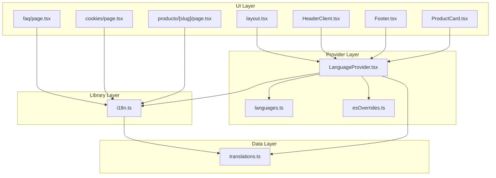
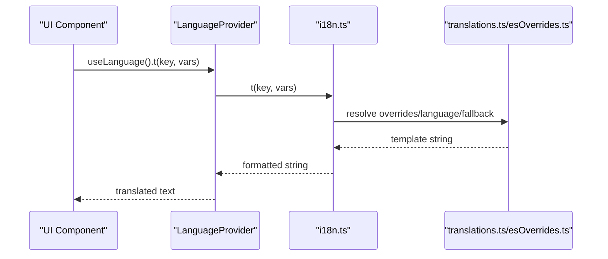
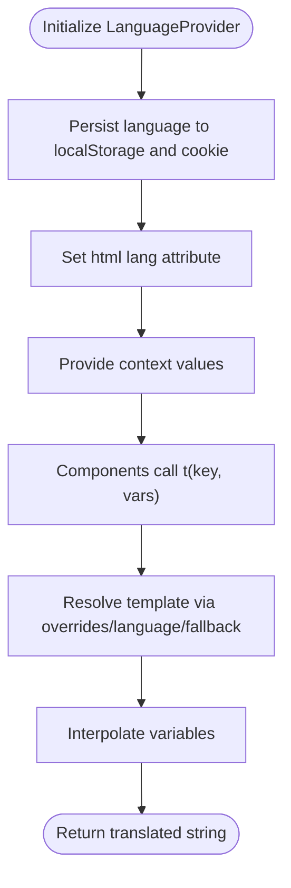
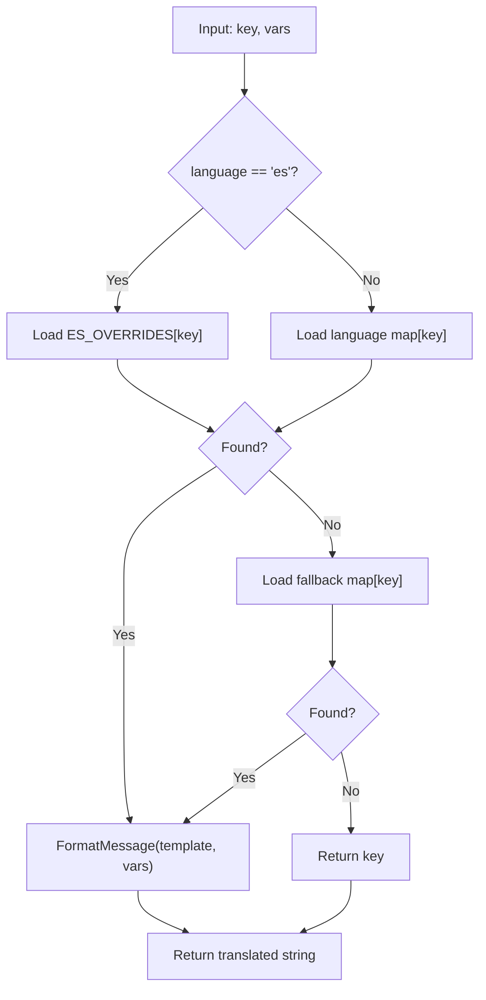
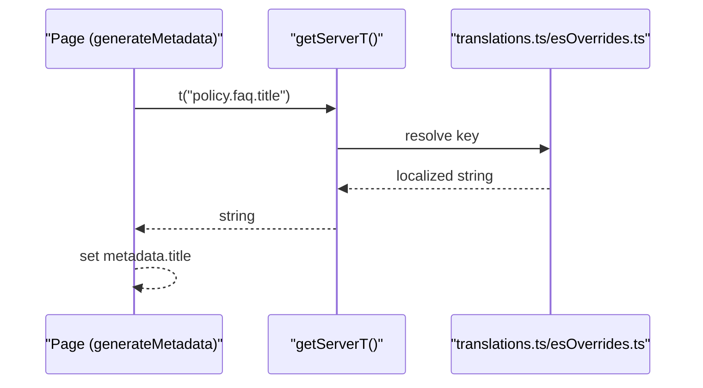
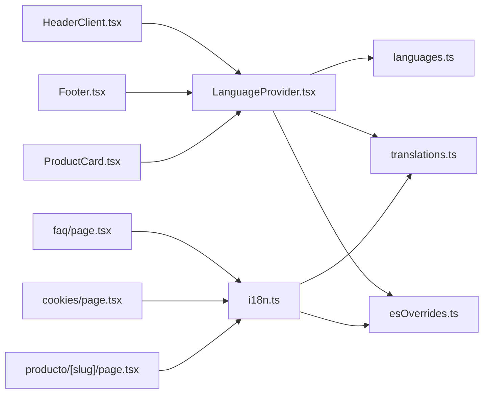

# Internationalization

<cite>
**Referenced Files in This Document**
- [i18n.ts](file://src/lib/i18n.ts)
- [LanguageProvider.tsx](file://src/providers/LanguageProvider.tsx)
- [languages.ts](file://src/providers/languages.ts)
- [translations.ts](file://src/providers/translations.ts)
- [esOverrides.ts](file://src/providers/esOverrides.ts)
- [layout.tsx](file://src/app/layout.tsx)
- [Footer.tsx](file://src/components/Footer.tsx)
- [HeaderClient.tsx](file://src/components/HeaderClient.tsx)
- [ProductCard.tsx](file://src/components/ProductCard.tsx)
- [faq/page.tsx](file://src/app/faq/page.tsx)
- [cookies/page.tsx](file://src/app/cookies/page.tsx)
- [producto/[slug]/page.tsx](file://src/app/producto/[slug]/page.tsx)
</cite>

## Table of Contents
1. [Introduction](#introduction)
2. [Project Structure](#project-structure)
3. [Core Components](#core-components)
4. [Architecture Overview](#architecture-overview)
5. [Detailed Component Analysis](#detailed-component-analysis)
6. [Dependency Analysis](#dependency-analysis)
7. [Performance Considerations](#performance-considerations)
8. [Troubleshooting Guide](#troubleshooting-guide)
9. [Conclusion](#conclusion)
10. [Appendices](#appendices)

## Introduction
This document explains the internationalization (i18n) system for the ecommerce platform. It covers language support implementation, translation management, locale-specific formatting, React context provider architecture, translation key organization, and dynamic language switching. It also documents Spanish language overrides, pluralization rules, date/time formatting, relationships with product content, UI components, and database content localization. Practical guidance is included for missing translations, context-specific translations, performance optimization for large translation sets, integration with content management, SEO considerations for multilingual content, accessibility compliance across languages, and concrete translation workflows.

## Project Structure
The i18n system is organized around three layers:
- Provider layer: React context provider that exposes the current language and translation function.
- Library layer: Server-side and client-side translation helpers that resolve keys against translation maps and apply overrides.
- Data layer: Translation maps and language metadata.

**Diagram sources**
- [LanguageProvider.tsx:1-81](file://src/providers/LanguageProvider.tsx#L1-L81)
- [languages.ts:1-24](file://src/providers/languages.ts#L1-L24)
- [translations.ts:1-612](file://src/providers/translations.ts#L1-L612)
- [esOverrides.ts:1-229](file://src/providers/esOverrides.ts#L1-L229)
- [i18n.ts:1-29](file://src/lib/i18n.ts#L1-L29)
- [layout.tsx:1-203](file://src/app/layout.tsx#L1-L203)
- [HeaderClient.tsx:1-252](file://src/components/HeaderClient.tsx#L1-L252)
- [Footer.tsx:1-135](file://src/components/Footer.tsx#L1-L135)
- [ProductCard.tsx:1-305](file://src/components/ProductCard.tsx#L1-L305)
- [faq/page.tsx:1-77](file://src/app/faq/page.tsx#L1-L77)
- [cookies/page.tsx:1-40](file://src/app/cookies/page.tsx#L1-L40)
- [producto/[slug]/page.tsx](file://src/app/producto/[slug]/page.tsx#L1-L249)

**Section sources**
- [LanguageProvider.tsx:1-81](file://src/providers/LanguageProvider.tsx#L1-L81)
- [i18n.ts:1-29](file://src/lib/i18n.ts#L1-L29)
- [translations.ts:1-612](file://src/providers/translations.ts#L1-L612)
- [esOverrides.ts:1-229](file://src/providers/esOverrides.ts#L1-L229)
- [languages.ts:1-24](file://src/providers/languages.ts#L1-L24)
- [layout.tsx:1-203](file://src/app/layout.tsx#L1-L203)

## Core Components
- LanguageProvider: React context provider that manages the current language, persists it to storage and cookies, and exposes a translation function t(key, vars).
- i18n library: Provides server-side and client-side translation helpers with fallback resolution and variable interpolation.
- Translations data: Centralized translation maps per language and Spanish overrides for contextual adjustments.
- Language metadata: Supported language codes and language descriptors.

Key responsibilities:
- Language persistence and propagation via HTML lang attribute.
- Fallback chain: overrides → language-specific map → fallback map → key itself.
- Variable interpolation for placeholders in templates.

**Section sources**
- [LanguageProvider.tsx:1-81](file://src/providers/LanguageProvider.tsx#L1-L81)
- [i18n.ts:1-29](file://src/lib/i18n.ts#L1-L29)
- [translations.ts:1-612](file://src/providers/translations.ts#L1-L612)
- [esOverrides.ts:1-229](file://src/providers/esOverrides.ts#L1-L229)
- [languages.ts:1-24](file://src/providers/languages.ts#L1-L24)

## Architecture Overview
The i18n architecture combines a React context provider with a small translation library and static translation maps. The provider initializes the language, persists it, and supplies t. On the server, getServerT resolves translations similarly but is designed for server-rendered metadata and content.

**Diagram sources**
- [LanguageProvider.tsx:36-42](file://src/providers/LanguageProvider.tsx#L36-L42)
- [i18n.ts:19-28](file://src/lib/i18n.ts#L19-L28)
- [translations.ts:609-612](file://src/providers/translations.ts#L609-L612)
- [esOverrides.ts:1-229](file://src/providers/esOverrides.ts#L1-L229)

## Detailed Component Analysis

### React Context Provider: LanguageProvider
- Exposes language, setLanguage, t, and currentLanguage.
- Persists language to localStorage and a cookie.
- Sets document.documentElement.lang for accessibility and SEO.
- Fixed language mode: setLanguage is intentionally a no-op to keep a single-language storefront.

**Diagram sources**
- [LanguageProvider.tsx:53-66](file://src/providers/LanguageProvider.tsx#L53-L66)

**Section sources**
- [LanguageProvider.tsx:1-81](file://src/providers/LanguageProvider.tsx#L1-L81)

### Translation Resolution and Overrides
- Overrides are applied first for Spanish.
- Then language-specific map is used.
- Fallback map is consulted if needed.
- If still missing, the key is returned as-is.
- Variables are interpolated using placeholder replacement.

**Diagram sources**
- [i18n.ts:19-28](file://src/lib/i18n.ts#L19-L28)
- [LanguageProvider.tsx:36-42](file://src/providers/LanguageProvider.tsx#L36-L42)
- [esOverrides.ts:1-229](file://src/providers/esOverrides.ts#L1-L229)
- [translations.ts:609-612](file://src/providers/translations.ts#L609-L612)

**Section sources**
- [i18n.ts:1-29](file://src/lib/i18n.ts#L1-L29)
- [LanguageProvider.tsx:28-42](file://src/providers/LanguageProvider.tsx#L28-L42)
- [esOverrides.ts:1-229](file://src/providers/esOverrides.ts#L1-L229)
- [translations.ts:1-612](file://src/providers/translations.ts#L1-L612)

### Translation Key Organization
- Keys are grouped by domain: categories, common, checkout, footer, policies, product, trust, etc.
- Keys include placeholders for dynamic values (e.g., {name}, {count}, {date}).
- Example keys:
  - "policy.faq.q1", "policy.faq.a1"
  - "product.metaTitle", "product.metaDescription"
  - "order.verifyCodeSuccess", "order.verifyAttemptsLeft"

**Section sources**
- [translations.ts:1-612](file://src/providers/translations.ts#L1-L612)

### Dynamic Language Switching
- The provider defines setLanguage but intentionally disables switching in the current storefront configuration.
- Language persistence is handled via localStorage and a cookie.
- The html lang attribute is updated to reflect the current language.

**Section sources**
- [LanguageProvider.tsx:17-62](file://src/providers/LanguageProvider.tsx#L17-L62)
- [layout.tsx:160-165](file://src/app/layout.tsx#L160-L165)

### Spanish Language Overrides
- ES_OVERRIDES provides contextual Spanish adjustments for terms like guarantees, shipping, and checkout steps.
- Overrides take precedence over language-specific and fallback maps.

**Section sources**
- [esOverrides.ts:1-229](file://src/providers/esOverrides.ts#L1-L229)

### Pluralization Rules
- The system does not implement explicit pluralization logic.
- Placeholders like {count} and {reviews} are used to render counts and labels.
- For pluralization-sensitive content, use placeholders and compose messages in components or pages.

**Section sources**
- [translations.ts:255-258](file://src/providers/translations.ts#L255-L258)
- [translations.ts:532-533](file://src/providers/translations.ts#L532-L533)

### Date/Time Formatting
- The system does not include dedicated date/time formatting utilities.
- For localized dates, integrate a library (e.g., Intl.DateTimeFormat) and pass formatted values via variables to t.

[No sources needed since this section provides general guidance]

### Integration with Product Content, UI Components, and Database Content Localization
- Pages use getServerT to generate metadata and structured data with localized strings.
- UI components consume t from the context for labels, buttons, and content.
- Product pages combine database content with localized metadata and structured data.

**Diagram sources**
- [faq/page.tsx:6-14](file://src/app/faq/page.tsx#L6-L14)
- [i18n.ts:19-28](file://src/lib/i18n.ts#L19-L28)
- [translations.ts:609-612](file://src/providers/translations.ts#L609-L612)
- [esOverrides.ts:1-229](file://src/providers/esOverrides.ts#L1-L229)

**Section sources**
- [faq/page.tsx:1-77](file://src/app/faq/page.tsx#L1-L77)
- [cookies/page.tsx:1-40](file://src/app/cookies/page.tsx#L1-L40)
- [producto/[slug]/page.tsx](file://src/app/producto/[slug]/page.tsx#L36-L102)
- [HeaderClient.tsx:22-36](file://src/components/HeaderClient.tsx#L22-L36)
- [Footer.tsx:14-47](file://src/components/Footer.tsx#L14-L47)
- [ProductCard.tsx:36-103](file://src/components/ProductCard.tsx#L36-L103)

### Usage Examples and Workflows
- Server-side metadata generation:
  - Use getServerT in generateMetadata to localize page titles and descriptions.
- Client-side rendering:
  - Use useLanguage().t in components to render localized UI.
- Product page localization:
  - Combine database product data with localized metadata and structured data.

**Section sources**
- [faq/page.tsx:6-14](file://src/app/faq/page.tsx#L6-L14)
- [cookies/page.tsx:5-14](file://src/app/cookies/page.tsx#L5-L14)
- [producto/[slug]/page.tsx](file://src/app/producto/[slug]/page.tsx#L36-L102)
- [HeaderClient.tsx:22-36](file://src/components/HeaderClient.tsx#L22-L36)
- [Footer.tsx:14-47](file://src/components/Footer.tsx#L14-L47)
- [ProductCard.tsx:36-103](file://src/components/ProductCard.tsx#L36-L103)

## Dependency Analysis
- LanguageProvider depends on:
  - languages.ts for supported language codes and descriptors.
  - translations.ts for language-specific and fallback maps.
  - esOverrides.ts for Spanish-specific overrides.
- UI components depend on LanguageProvider via useLanguage().
- Pages depend on getServerT for server-side translation.

**Diagram sources**
- [LanguageProvider.tsx:1-81](file://src/providers/LanguageProvider.tsx#L1-L81)
- [languages.ts:1-24](file://src/providers/languages.ts#L1-L24)
- [translations.ts:1-612](file://src/providers/translations.ts#L1-L612)
- [esOverrides.ts:1-229](file://src/providers/esOverrides.ts#L1-L229)
- [i18n.ts:1-29](file://src/lib/i18n.ts#L1-L29)
- [HeaderClient.tsx:1-252](file://src/components/HeaderClient.tsx#L1-L252)
- [Footer.tsx:1-135](file://src/components/Footer.tsx#L1-L135)
- [ProductCard.tsx:1-305](file://src/components/ProductCard.tsx#L1-L305)
- [faq/page.tsx:1-77](file://src/app/faq/page.tsx#L1-L77)
- [cookies/page.tsx:1-40](file://src/app/cookies/page.tsx#L1-L40)
- [producto/[slug]/page.tsx](file://src/app/producto/[slug]/page.tsx#L1-L249)

**Section sources**
- [LanguageProvider.tsx:1-81](file://src/providers/LanguageProvider.tsx#L1-L81)
- [i18n.ts:1-29](file://src/lib/i18n.ts#L1-L29)
- [translations.ts:1-612](file://src/providers/translations.ts#L1-L612)
- [esOverrides.ts:1-229](file://src/providers/esOverrides.ts#L1-L229)
- [languages.ts:1-24](file://src/providers/languages.ts#L1-L24)
- [HeaderClient.tsx:1-252](file://src/components/HeaderClient.tsx#L1-L252)
- [Footer.tsx:1-135](file://src/components/Footer.tsx#L1-L135)
- [ProductCard.tsx:1-305](file://src/components/ProductCard.tsx#L1-L305)
- [faq/page.tsx:1-77](file://src/app/faq/page.tsx#L1-L77)
- [cookies/page.tsx:1-40](file://src/app/cookies/page.tsx#L1-L40)
- [producto/[slug]/page.tsx](file://src/app/producto/[slug]/page.tsx#L1-L249)

## Performance Considerations
- Keep translation maps as static imports to benefit from tree-shaking and build-time optimizations.
- Avoid runtime key generation; use centralized keys to enable efficient caching and reuse.
- Minimize the number of t calls per render by computing values with useMemo where appropriate.
- For large translation sets, consider lazy-loading translation chunks per feature or route if the storefront evolves to support multiple languages.

[No sources needed since this section provides general guidance]

## Troubleshooting Guide
Common issues and resolutions:
- Missing translation:
  - Symptom: Key is returned as-is.
  - Resolution: Add the key to the appropriate language map or override map.
- Context-specific translation:
  - Symptom: Generic term does not fit the UI context.
  - Resolution: Introduce a dedicated key or use overrides for Spanish.
- Placeholder mismatch:
  - Symptom: Variables are not interpolated.
  - Resolution: Ensure placeholders match the keys and provide values in vars.
- Accessibility and SEO:
  - Ensure html lang is set to the current language.
  - Verify Open Graph and Twitter metadata use the correct locale.

**Section sources**
- [i18n.ts:7-13](file://src/lib/i18n.ts#L7-L13)
- [LanguageProvider.tsx:53-57](file://src/providers/LanguageProvider.tsx#L53-L57)
- [layout.tsx:60-61](file://src/app/layout.tsx#L60-L61)
- [layout.tsx:74-79](file://src/app/layout.tsx#L74-L79)

## Conclusion
The i18n system is intentionally minimal and optimized for a single-language (Spanish) storefront. It provides a robust provider, a concise translation library, and a centralized translation map with Spanish overrides. The architecture supports server-side metadata generation, client-side UI rendering, and database-backed content localization. For future expansion to multiple languages, maintain the current provider pattern, add new translation maps, and introduce language detection and switching while preserving the existing fallback and override mechanisms.

[No sources needed since this section summarizes without analyzing specific files]

## Appendices

### Practical Examples Index
- Server-side metadata: [faq/page.tsx:6-14](file://src/app/faq/page.tsx#L6-L14), [cookies/page.tsx:5-14](file://src/app/cookies/page.tsx#L5-L14), [producto/[slug]/page.tsx](file://src/app/producto/[slug]/page.tsx#L36-L102)
- Client-side UI: [HeaderClient.tsx:22-36](file://src/components/HeaderClient.tsx#L22-L36), [Footer.tsx:14-47](file://src/components/Footer.tsx#L14-L47), [ProductCard.tsx:36-103](file://src/components/ProductCard.tsx#L36-L103)
- Translation resolution: [i18n.ts:19-28](file://src/lib/i18n.ts#L19-L28), [LanguageProvider.tsx:36-42](file://src/providers/LanguageProvider.tsx#L36-L42)