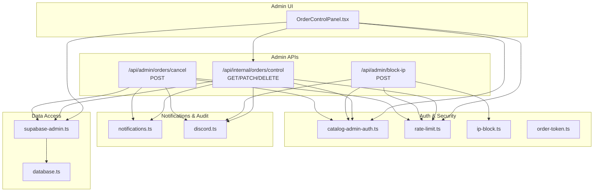
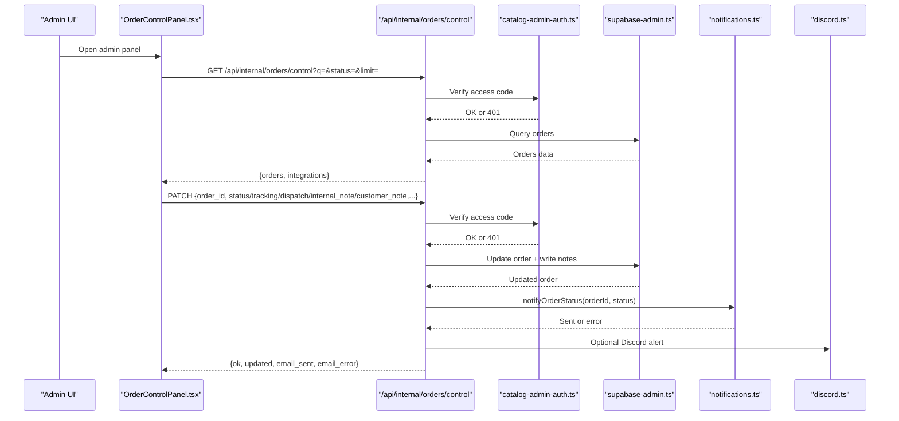
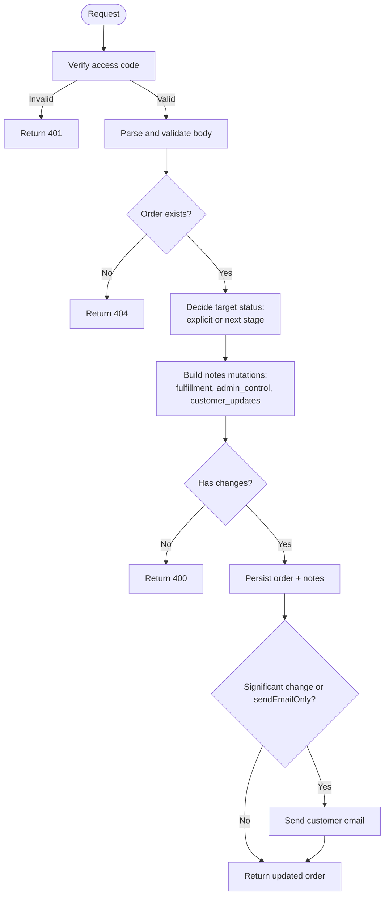
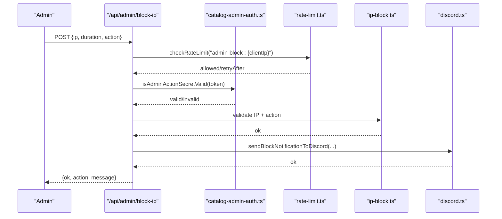
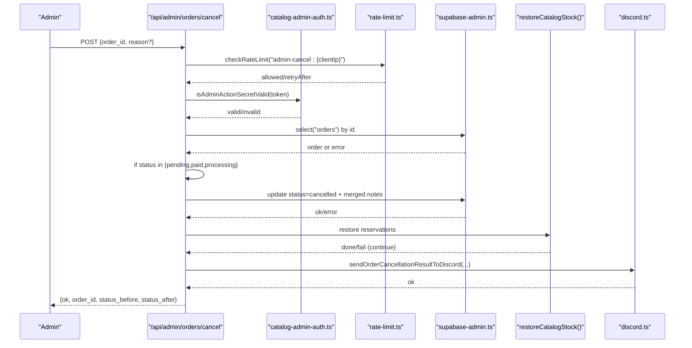
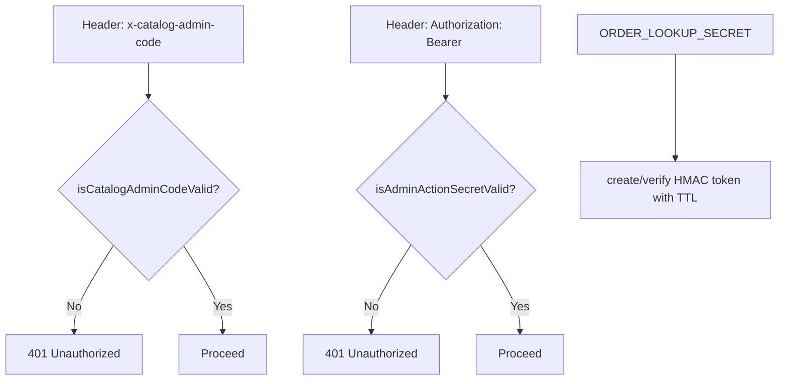
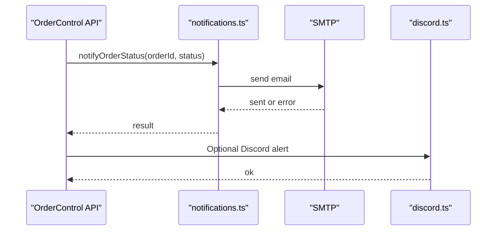
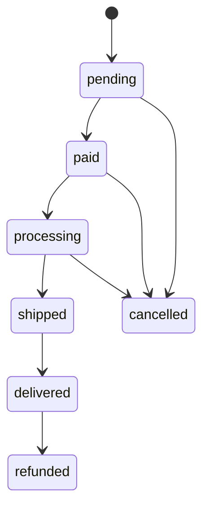
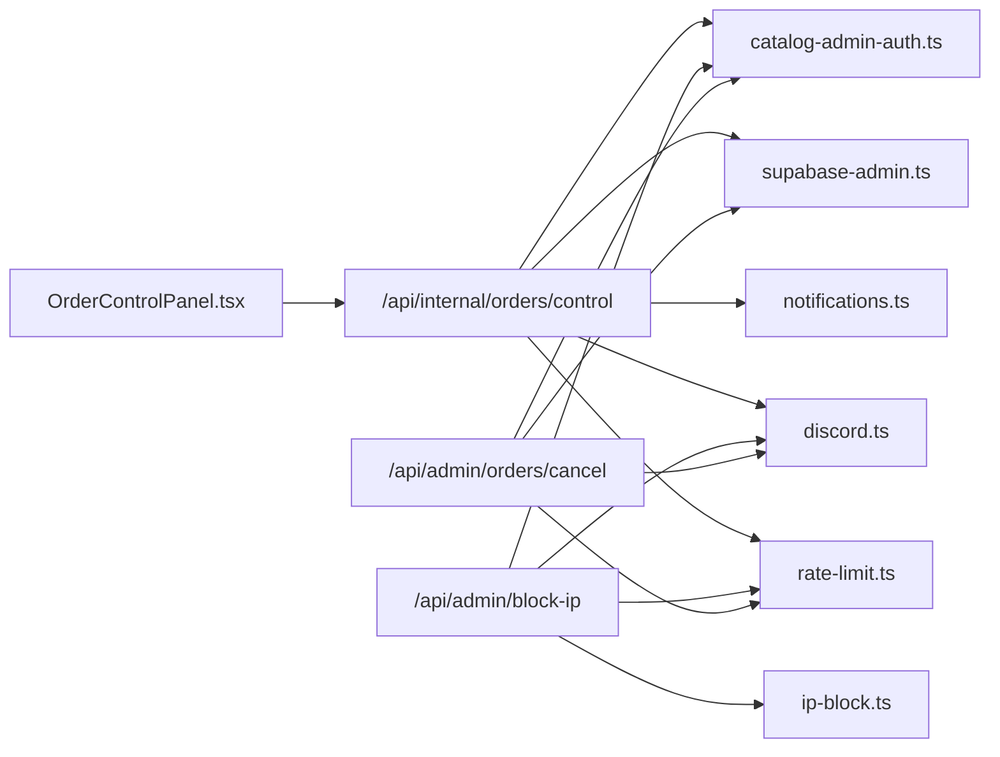

# Administrative Order Controls

<cite>
**Referenced Files in This Document**
- [src/app/api/internal/orders/control/route.ts](file://src/app/api/internal/orders/control/route.ts)
- [src/app/api/admin/block-ip/route.ts](file://src/app/api/admin/block-ip/route.ts)
- [src/app/api/admin/orders/cancel/route.ts](file://src/app/api/admin/orders/cancel/route.ts)
- [src/app/panel-privado/[token]/OrderControlPanel.tsx](file://src/app/panel-privado/[token]/OrderControlPanel.tsx)
- [src/lib/catalog-admin-auth.ts](file://src/lib/catalog-admin-auth.ts)
- [src/lib/order-token.ts](file://src/lib/order-token.ts)
- [src/lib/notifications.ts](file://src/lib/notifications.ts)
- [src/lib/discord.ts](file://src/lib/discord.ts)
- [src/lib/supabase-admin.ts](file://src/lib/supabase-admin.ts)
- [src/lib/rate-limit.ts](file://src/lib/rate-limit.ts)
- [src/lib/ip-block.ts](file://src/lib/ip-block.ts)
- [src/types/database.ts](file://src/types/database.ts)
</cite>

## Table of Contents
1. [Introduction](#introduction)
2. [Project Structure](#project-structure)
3. [Core Components](#core-components)
4. [Architecture Overview](#architecture-overview)
5. [Detailed Component Analysis](#detailed-component-analysis)
6. [Dependency Analysis](#dependency-analysis)
7. [Performance Considerations](#performance-considerations)
8. [Troubleshooting Guide](#troubleshooting-guide)
9. [Conclusion](#conclusion)
10. [Appendices](#appendices)

## Introduction
This document describes the administrative order management interface and backend controls. It explains how administrators modify order statuses, communicate with customers, cancel orders, and enforce security via private tokens and rate limits. It also documents order state transitions, bulk-like operations through the admin panel, and integration with external delivery systems and notifications.

## Project Structure
The administrative order controls are implemented as a combination of:
- Frontend admin panel (React component) that queries internal admin APIs
- Internal admin API endpoints for order listing, updates, and deletion
- Public admin endpoints for IP blocking and order cancellation
- Authentication and authorization utilities for admin access
- Notification and audit integrations (email and Discord)
- Supabase admin client for database operations
- Rate limiting and IP blocking utilities

**Diagram sources**
- [src/app/panel-privado/[token]/OrderControlPanel.tsx](file://src/app/panel-privado/[token]/OrderControlPanel.tsx#L129-L201)
- [src/app/api/internal/orders/control/route.ts:283-347](file://src/app/api/internal/orders/control/route.ts#L283-L347)
- [src/app/api/admin/block-ip/route.ts:51-129](file://src/app/api/admin/block-ip/route.ts#L51-L129)
- [src/app/api/admin/orders/cancel/route.ts:67-226](file://src/app/api/admin/orders/cancel/route.ts#L67-L226)
- [src/lib/catalog-admin-auth.ts:33-64](file://src/lib/catalog-admin-auth.ts#L33-L64)
- [src/lib/rate-limit.ts:43-88](file://src/lib/rate-limit.ts#L43-L88)
- [src/lib/ip-block.ts:25-89](file://src/lib/ip-block.ts#L25-L89)
- [src/lib/order-token.ts:35-64](file://src/lib/order-token.ts#L35-L64)
- [src/lib/notifications.ts:89-126](file://src/lib/notifications.ts#L89-L126)
- [src/lib/discord.ts:79-228](file://src/lib/discord.ts#L79-L228)
- [src/lib/supabase-admin.ts:18-31](file://src/lib/supabase-admin.ts#L18-L31)
- [src/types/database.ts:4-11](file://src/types/database.ts#L4-L11)

**Section sources**
- [src/app/panel-privado/[token]/OrderControlPanel.tsx](file://src/app/panel-privado/[token]/OrderControlPanel.tsx#L129-L201)
- [src/app/api/internal/orders/control/route.ts:283-347](file://src/app/api/internal/orders/control/route.ts#L283-L347)
- [src/app/api/admin/block-ip/route.ts:51-129](file://src/app/api/admin/block-ip/route.ts#L51-L129)
- [src/app/api/admin/orders/cancel/route.ts:67-226](file://src/app/api/admin/orders/cancel/route.ts#L67-L226)
- [src/lib/catalog-admin-auth.ts:33-64](file://src/lib/catalog-admin-auth.ts#L33-L64)
- [src/lib/supabase-admin.ts:18-31](file://src/lib/supabase-admin.ts#L18-L31)

## Core Components
- Admin order control API: Lists, updates, and deletes orders; supports status advancement, tracking and dispatch references, internal/customer notes, and optional customer notification.
- Admin IP blocking API: Blocks/unblocks IPs with configurable durations and notifies via Discord.
- Admin order cancellation API: Cancels eligible orders and restores stock; notifies via Discord.
- Admin authentication: Two-layer protection: access code for the internal panel and admin action secret for protected endpoints.
- Notifications: Email notifications to customers on status changes; Discord notifications for moderation actions and cancellations.
- Supabase admin client: Typed access to core tables and untyped access for dynamic tables and RPCs.
- Rate limiting: In-memory and DB-backed rate limiting for admin endpoints.
- IP blocking: In-memory cache synchronized with Supabase for fast checks and persistence.

**Section sources**
- [src/app/api/internal/orders/control/route.ts:283-347](file://src/app/api/internal/orders/control/route.ts#L283-L347)
- [src/app/api/admin/block-ip/route.ts:51-129](file://src/app/api/admin/block-ip/route.ts#L51-L129)
- [src/app/api/admin/orders/cancel/route.ts:67-226](file://src/app/api/admin/orders/cancel/route.ts#L67-L226)
- [src/lib/catalog-admin-auth.ts:33-64](file://src/lib/catalog-admin-auth.ts#L33-L64)
- [src/lib/notifications.ts:89-126](file://src/lib/notifications.ts#L89-L126)
- [src/lib/discord.ts:271-315](file://src/lib/discord.ts#L271-L315)
- [src/lib/supabase-admin.ts:18-31](file://src/lib/supabase-admin.ts#L18-L31)
- [src/lib/rate-limit.ts:43-88](file://src/lib/rate-limit.ts#L43-L88)
- [src/lib/ip-block.ts:25-89](file://src/lib/ip-block.ts#L25-L89)

## Architecture Overview
The admin order management system centers on a React admin panel that calls internal and public admin endpoints. Internal endpoints require an access code header and use Supabase admin client for database operations. Public endpoints require an admin action secret and enforce strict validation and rate limiting. Notifications and Discord alerts are integrated for auditability and operational visibility.

**Diagram sources**
- [src/app/panel-privado/[token]/OrderControlPanel.tsx](file://src/app/panel-privado/[token]/OrderControlPanel.tsx#L142-L201)
- [src/app/api/internal/orders/control/route.ts:283-347](file://src/app/api/internal/orders/control/route.ts#L283-L347)
- [src/lib/catalog-admin-auth.ts:59-79](file://src/lib/catalog-admin-auth.ts#L59-L79)
- [src/lib/supabase-admin.ts:18-31](file://src/lib/supabase-admin.ts#L18-L31)
- [src/lib/notifications.ts:89-126](file://src/lib/notifications.ts#L89-L126)
- [src/lib/discord.ts:271-315](file://src/lib/discord.ts#L271-L315)

## Detailed Component Analysis

### Admin Order Control API
- Purpose: Admin panel endpoint to list, update, and delete orders.
- Access control: Requires access code via header.
- Capabilities:
  - List orders with filters (status, query, limit).
  - Advance stage automatically or set explicit status.
  - Update tracking code and dispatch reference; records fulfillment metadata.
  - Add internal and customer notes; maintains audit history.
  - Mark manual review as completed.
  - Optionally send email notification to customer.
  - Delete orders.
- Notes structure: Maintains structured notes for fulfillment, admin control history, and customer updates.

**Diagram sources**
- [src/app/api/internal/orders/control/route.ts:349-617](file://src/app/api/internal/orders/control/route.ts#L349-L617)

**Section sources**
- [src/app/api/internal/orders/control/route.ts:283-347](file://src/app/api/internal/orders/control/route.ts#L283-L347)
- [src/app/api/internal/orders/control/route.ts:349-617](file://src/app/api/internal/orders/control/route.ts#L349-L617)
- [src/types/database.ts:4-11](file://src/types/database.ts#L4-L11)

### Admin IP Blocking API
- Purpose: Block or unblock IPs with duration (permanent, 24h, 1h) and notify via Discord.
- Access control: Requires admin action secret via Authorization Bearer.
- Validation: IP address format validation, duration validation, and rate limiting.
- Persistence: Updates in-memory cache and persists to Supabase.

**Diagram sources**
- [src/app/api/admin/block-ip/route.ts:51-129](file://src/app/api/admin/block-ip/route.ts#L51-L129)
- [src/lib/catalog-admin-auth.ts:49-64](file://src/lib/catalog-admin-auth.ts#L49-L64)
- [src/lib/rate-limit.ts:43-88](file://src/lib/rate-limit.ts#L43-L88)
- [src/lib/ip-block.ts:103-137](file://src/lib/ip-block.ts#L103-L137)
- [src/lib/discord.ts:230-262](file://src/lib/discord.ts#L230-L262)

**Section sources**
- [src/app/api/admin/block-ip/route.ts:51-129](file://src/app/api/admin/block-ip/route.ts#L51-L129)
- [src/lib/ip-block.ts:103-137](file://src/lib/ip-block.ts#L103-L137)
- [src/lib/discord.ts:230-262](file://src/lib/discord.ts#L230-L262)

### Admin Order Cancellation API
- Purpose: Cancel orders in eligible states and restore stock.
- Access control: Requires admin action secret via Authorization Bearer.
- Validation: UUID order ID, current status eligibility, and rate limiting.
- Stock restoration: Resolves product slugs and quantities to restore catalog stock.
- Notifications: Sends Discord alert with outcome and detail.

**Diagram sources**
- [src/app/api/admin/orders/cancel/route.ts:67-226](file://src/app/api/admin/orders/cancel/route.ts#L67-L226)
- [src/lib/catalog-admin-auth.ts:49-64](file://src/lib/catalog-admin-auth.ts#L49-L64)
- [src/lib/rate-limit.ts:43-88](file://src/lib/rate-limit.ts#L43-L88)
- [src/lib/supabase-admin.ts:18-31](file://src/lib/supabase-admin.ts#L18-L31)
- [src/lib/discord.ts:271-315](file://src/lib/discord.ts#L271-L315)

**Section sources**
- [src/app/api/admin/orders/cancel/route.ts:67-226](file://src/app/api/admin/orders/cancel/route.ts#L67-L226)

### Admin Authentication and Access Controls
- Access code for internal panel: Verified via dedicated header; used by the internal order control API.
- Admin action secret for public endpoints: Used by block-ip and cancel endpoints; supports fallback to ORDER_LOOKUP_SECRET.
- Private order lookup tokens: HMAC-signed tokens with TTL for secure order lookups.

**Diagram sources**
- [src/lib/catalog-admin-auth.ts:33-64](file://src/lib/catalog-admin-auth.ts#L33-L64)
- [src/lib/order-token.ts:35-64](file://src/lib/order-token.ts#L35-L64)

**Section sources**
- [src/lib/catalog-admin-auth.ts:33-64](file://src/lib/catalog-admin-auth.ts#L33-L64)
- [src/lib/order-token.ts:35-64](file://src/lib/order-token.ts#L35-L64)

### Customer Communication Tools
- Email notifications: Triggered on significant changes or explicit send; includes order summary, tracking, dispatch reference, and customer note.
- Discord notifications: Sent for moderation actions and cancellations; includes actionable curl commands for admin operations.

**Diagram sources**
- [src/lib/notifications.ts:89-126](file://src/lib/notifications.ts#L89-L126)
- [src/lib/discord.ts:79-228](file://src/lib/discord.ts#L79-L228)

**Section sources**
- [src/lib/notifications.ts:89-126](file://src/lib/notifications.ts#L89-L126)
- [src/lib/discord.ts:79-228](file://src/lib/discord.ts#L79-L228)

### Order State Transitions and Bulk Operations
- State machine: pending/paid → processing → shipped → delivered; final states are cancelled/refunded.
- Automatic advancement: “Continue stage” button advances to next logical state.
- Bulk-like operations: The admin panel allows updating multiple orders in a single session; each update is atomic.

**Diagram sources**
- [src/app/api/internal/orders/control/route.ts:95-100](file://src/app/api/internal/orders/control/route.ts#L95-L100)
- [src/types/database.ts:4-11](file://src/types/database.ts#L4-L11)

**Section sources**
- [src/app/api/internal/orders/control/route.ts:95-100](file://src/app/api/internal/orders/control/route.ts#L95-L100)
- [src/types/database.ts:4-11](file://src/types/database.ts#L4-L11)

### Integration with External Delivery Systems
- Tracking and dispatch references: Stored in order notes under a structured fulfillment object; updated via PATCH.
- Dispatch timestamps: Automatically recorded when transitioning to shipped/delivered or when dispatch reference is set.
- Manual review: Optional flagging to indicate human verification completion.

**Section sources**
- [src/app/api/internal/orders/control/route.ts:423-466](file://src/app/api/internal/orders/control/route.ts#L423-L466)
- [src/app/api/internal/orders/control/route.ts:507-520](file://src/app/api/internal/orders/control/route.ts#L507-L520)

### Administrative Controls and Audit Trail
- Audit history: Maintained in order notes under admin_control.history with timestamps and actions.
- Discord audit: Moderation and cancellation outcomes are posted to Discord for visibility.
- Email audit: SMTP errors are returned to the caller for diagnostics.

**Section sources**
- [src/app/api/internal/orders/control/route.ts:468-538](file://src/app/api/internal/orders/control/route.ts#L468-L538)
- [src/lib/discord.ts:271-315](file://src/lib/discord.ts#L271-L315)
- [src/lib/notifications.ts:383-406](file://src/lib/notifications.ts#L383-L406)

## Dependency Analysis
- Internal order control depends on:
  - Access code validation
  - Supabase admin client for reads/writes
  - Email notifications and Discord alerts
  - Rate limiting
- Public admin endpoints depend on:
  - Admin action secret validation
  - IP blocking utilities
  - Discord alerts
  - Rate limiting
- Shared utilities:
  - Supabase admin client
  - Rate limiting
  - IP blocking
  - Order token utilities

**Diagram sources**
- [src/app/panel-privado/[token]/OrderControlPanel.tsx](file://src/app/panel-privado/[token]/OrderControlPanel.tsx#L142-L201)
- [src/app/api/internal/orders/control/route.ts:283-347](file://src/app/api/internal/orders/control/route.ts#L283-L347)
- [src/app/api/admin/block-ip/route.ts:51-129](file://src/app/api/admin/block-ip/route.ts#L51-L129)
- [src/app/api/admin/orders/cancel/route.ts:67-226](file://src/app/api/admin/orders/cancel/route.ts#L67-L226)
- [src/lib/catalog-admin-auth.ts:33-64](file://src/lib/catalog-admin-auth.ts#L33-L64)
- [src/lib/supabase-admin.ts:18-31](file://src/lib/supabase-admin.ts#L18-L31)
- [src/lib/notifications.ts:89-126](file://src/lib/notifications.ts#L89-L126)
- [src/lib/discord.ts:271-315](file://src/lib/discord.ts#L271-L315)
- [src/lib/rate-limit.ts:43-88](file://src/lib/rate-limit.ts#L43-L88)
- [src/lib/ip-block.ts:25-89](file://src/lib/ip-block.ts#L25-L89)

**Section sources**
- [src/app/panel-privado/[token]/OrderControlPanel.tsx](file://src/app/panel-privado/[token]/OrderControlPanel.tsx#L142-L201)
- [src/app/api/internal/orders/control/route.ts:283-347](file://src/app/api/internal/orders/control/route.ts#L283-L347)
- [src/app/api/admin/block-ip/route.ts:51-129](file://src/app/api/admin/block-ip/route.ts#L51-L129)
- [src/app/api/admin/orders/cancel/route.ts:67-226](file://src/app/api/admin/orders/cancel/route.ts#L67-L226)

## Performance Considerations
- Rate limiting: In-memory buckets with periodic cleanup; DB-backed fallback for critical paths.
- Supabase admin client: Untyped client used for dynamic tables to avoid TypeScript overhead while preserving runtime correctness.
- IP blocking: In-memory cache synchronized with Supabase for fast checks; always verifies against DB for reliability in serverless environments.
- Email delivery: Asynchronous; errors surfaced to the caller for diagnostics.

[No sources needed since this section provides general guidance]

## Troubleshooting Guide
- Access denied:
  - Internal panel: Ensure correct access code header is provided.
  - Public endpoints: Ensure Authorization Bearer matches configured admin action secret.
- Rate limit exceeded:
  - Reduce request frequency or wait for the window to reset.
- Order not found:
  - Verify UUID format and existence.
- Email sending failures:
  - Check SMTP configuration and error messages returned by the API.
- Discord notifications:
  - Verify webhook URL configuration and inspect logs for HTTP errors.

**Section sources**
- [src/lib/catalog-admin-auth.ts:59-79](file://src/lib/catalog-admin-auth.ts#L59-L79)
- [src/lib/rate-limit.ts:43-88](file://src/lib/rate-limit.ts#L43-L88)
- [src/lib/notifications.ts:383-406](file://src/lib/notifications.ts#L383-L406)
- [src/lib/discord.ts:215-227](file://src/lib/discord.ts#L215-L227)

## Conclusion
The administrative order management system provides a secure, auditable, and automated workflow for order lifecycle management. Administrators can efficiently update statuses, manage tracking and dispatch references, communicate with customers, and enforce security through access codes, admin secrets, rate limits, and IP blocking. The integration with email and Discord ensures transparency and operational readiness.

[No sources needed since this section summarizes without analyzing specific files]

## Appendices

### Practical Examples of Common Administrative Tasks
- Modify order status:
  - Use the admin panel to select a status or click “Continue stage.”
- Add tracking and dispatch reference:
  - Enter tracking code and dispatch reference; saved with the order.
- Add internal and customer notes:
  - Internal notes remain private; customer notes are included in the email.
- Notify customer:
  - Enable “Notificar por email al cliente” and save; or use “Enviar email ahora.”
- Cancel an order:
  - Use the cancel endpoint with admin action secret; stock is restored automatically.
- Block an IP:
  - Use the block endpoint with admin action secret; choose duration and action.

**Section sources**
- [src/app/panel-privado/[token]/OrderControlPanel.tsx](file://src/app/panel-privado/[token]/OrderControlPanel.tsx#L238-L322)
- [src/app/api/admin/orders/cancel/route.ts:67-226](file://src/app/api/admin/orders/cancel/route.ts#L67-L226)
- [src/app/api/admin/block-ip/route.ts:51-129](file://src/app/api/admin/block-ip/route.ts#L51-L129)