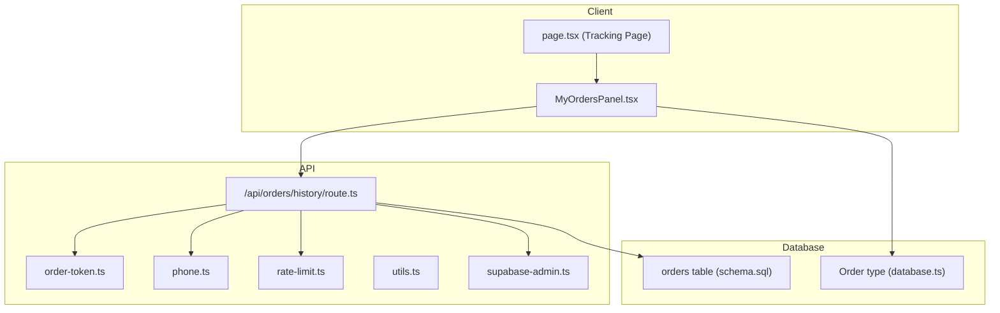
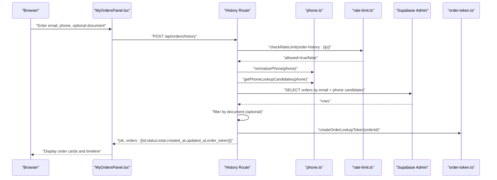
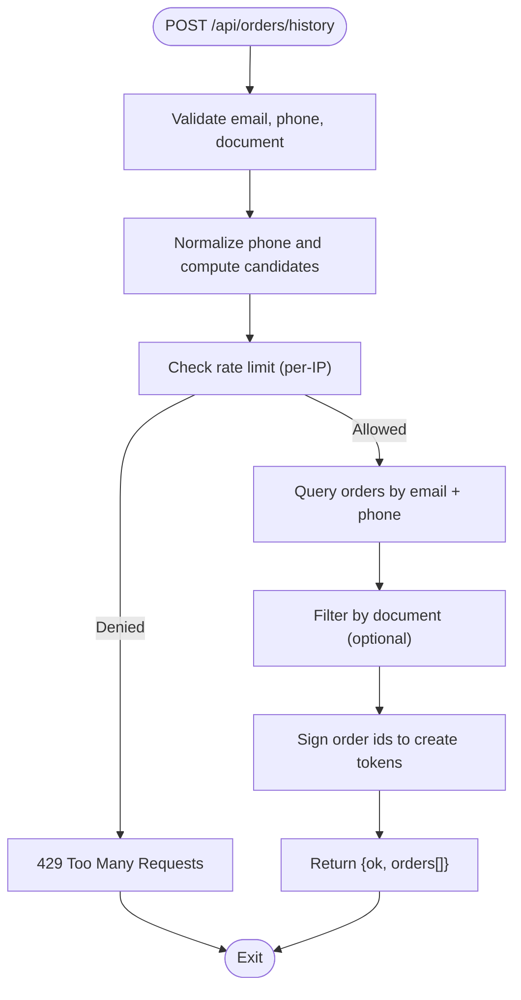
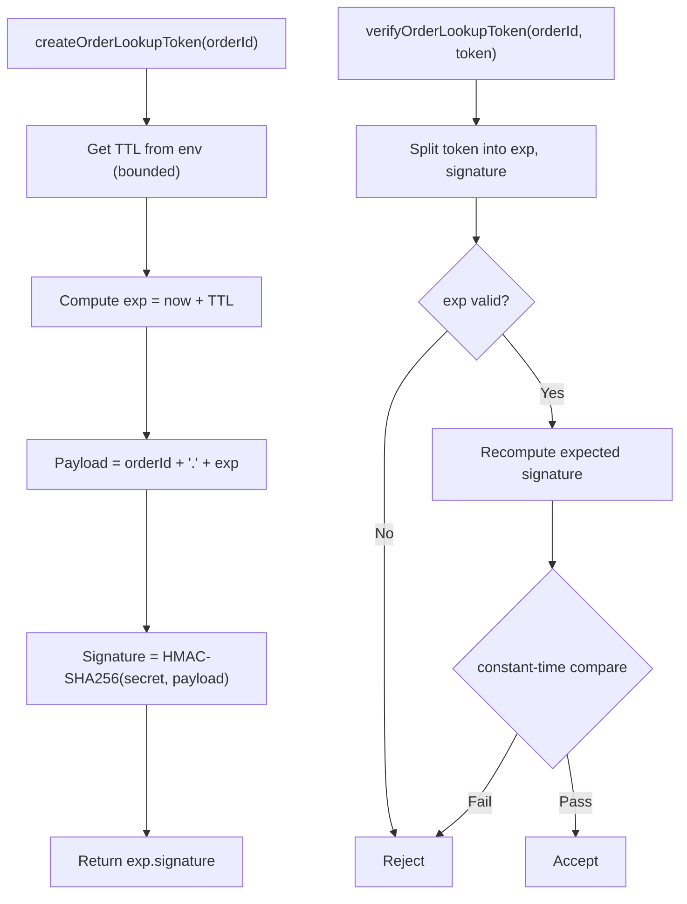
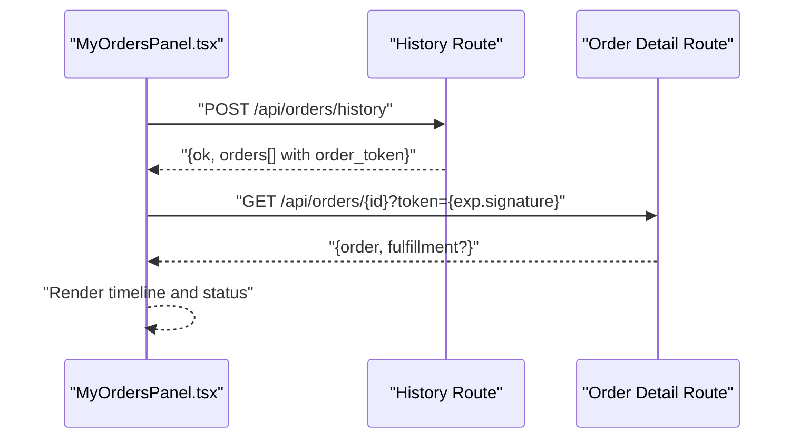
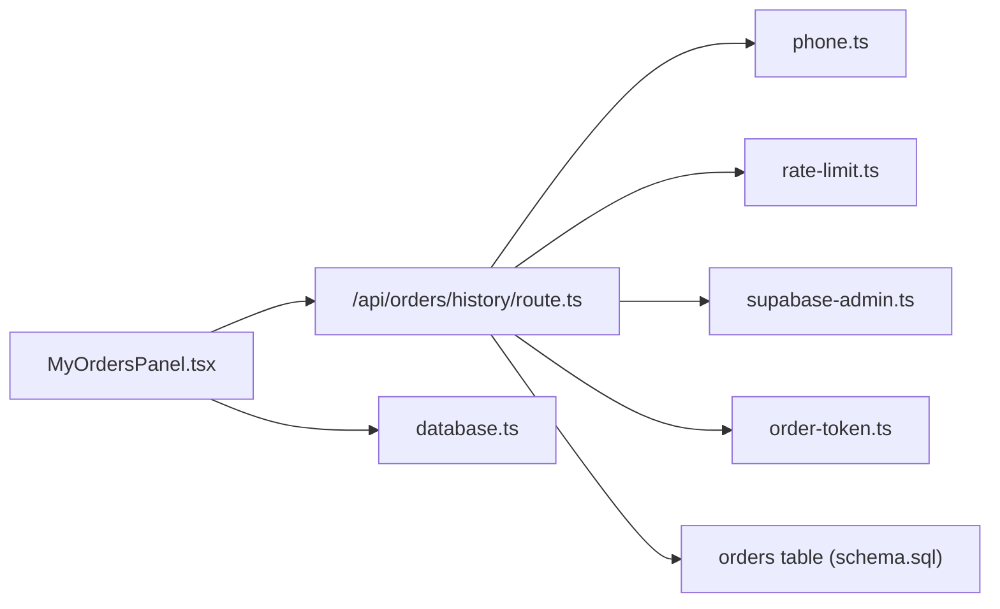

# Customer Order Tracking

<cite>
**Referenced Files in This Document**
- [route.ts](file://src/app/api/orders/history/route.ts)
- [order-token.ts](file://src/lib/order-token.ts)
- [phone.ts](file://src/lib/phone.ts)
- [rate-limit.ts](file://src/lib/rate-limit.ts)
- [MyOrdersPanel.tsx](file://src/components/orders/MyOrdersPanel.tsx)
- [page.tsx](file://src/app/seguimiento/page.tsx)
- [schema.sql](file://schema.sql)
- [database.ts](file://src/types/database.ts)
- [supabase-admin.ts](file://src/lib/supabase-admin.ts)
- [utils.ts](file://src/lib/utils.ts)
</cite>

## Table of Contents
1. [Introduction](#introduction)
2. [Project Structure](#project-structure)
3. [Core Components](#core-components)
4. [Architecture Overview](#architecture-overview)
5. [Detailed Component Analysis](#detailed-component-analysis)
6. [Dependency Analysis](#dependency-analysis)
7. [Performance Considerations](#performance-considerations)
8. [Troubleshooting Guide](#troubleshooting-guide)
9. [Conclusion](#conclusion)

## Introduction
This document describes the customer-facing order tracking system. It covers:
- The order history API endpoint, including request parameters, validation rules, and response format
- Token-based secure order access and security mechanisms
- The customer order panel interface, order status display, and order detail viewing
- Implementation details for phone number normalization, document verification matching, and rate limiting
- Practical examples and troubleshooting guidance for common order lookup failures

## Project Structure
The order tracking system spans API routes, client components, shared libraries, and database schema:
- API: order history retrieval and token generation
- Client: order panel UI and order detail display
- Libraries: phone normalization, rate limiting, token signing/verification, Supabase admin client
- Database: orders table and related indices

**Diagram sources**
- [route.ts:1-145](file://src/app/api/orders/history/route.ts#L1-L145)
- [order-token.ts:1-65](file://src/lib/order-token.ts#L1-L65)
- [phone.ts:1-35](file://src/lib/phone.ts#L1-L35)
- [rate-limit.ts:1-165](file://src/lib/rate-limit.ts#L1-L165)
- [utils.ts:1-102](file://src/lib/utils.ts#L1-L102)
- [supabase-admin.ts:1-31](file://src/lib/supabase-admin.ts#L1-L31)
- [schema.sql:50-75](file://schema.sql#L50-L75)
- [database.ts:4-11](file://src/types/database.ts#L4-L11)

**Section sources**
- [route.ts:1-145](file://src/app/api/orders/history/route.ts#L1-L145)
- [MyOrdersPanel.tsx:1-794](file://src/components/orders/MyOrdersPanel.tsx#L1-L794)
- [page.tsx:1-57](file://src/app/seguimiento/page.tsx#L1-L57)
- [schema.sql:50-75](file://schema.sql#L50-L75)
- [database.ts:4-11](file://src/types/database.ts#L4-L11)

## Core Components
- Order history API: Validates inputs, normalizes phone numbers, applies rate limits, queries orders, filters by document, and returns order tokens
- Order token library: Generates and verifies short-lived tokens for secure order access
- Phone normalization: Converts various phone formats to a canonical national format
- Rate limiting: In-memory and DB-backed limits for API protection
- Client order panel: Fetches order history, displays statuses, timelines, and allows manual token-based access

**Section sources**
- [route.ts:43-144](file://src/app/api/orders/history/route.ts#L43-L144)
- [order-token.ts:39-64](file://src/lib/order-token.ts#L39-L64)
- [phone.ts:1-35](file://src/lib/phone.ts#L1-L35)
- [rate-limit.ts:43-88](file://src/lib/rate-limit.ts#L43-L88)
- [MyOrdersPanel.tsx:335-355](file://src/components/orders/MyOrdersPanel.tsx#L335-L355)

## Architecture Overview
End-to-end flow for order history and secure order access:

**Diagram sources**
- [route.ts:43-144](file://src/app/api/orders/history/route.ts#L43-L144)
- [phone.ts:1-35](file://src/lib/phone.ts#L1-L35)
- [rate-limit.ts:43-88](file://src/lib/rate-limit.ts#L43-L88)
- [supabase-admin.ts:18-31](file://src/lib/supabase-admin.ts#L18-L31)
- [order-token.ts:39-48](file://src/lib/order-token.ts#L39-L48)
- [MyOrdersPanel.tsx:335-355](file://src/components/orders/MyOrdersPanel.tsx#L335-L355)

## Detailed Component Analysis

### Order History API Endpoint
- Endpoint: POST /api/orders/history
- Purpose: Retrieve recent orders for a customer and issue secure lookup tokens
- Request body fields:
  - email: required, validated as an email
  - phone: required, normalized to a national phone number; multiple candidates supported
  - document: optional, numeric suffix matching against stored digits
- Validation rules:
  - Email must match a standard pattern
  - Phone must normalize to a valid digit sequence; at least 7 digits after normalization
  - Document, if present, must be at least 4 digits
- Rate limiting:
  - Per-IP sliding window: 10 requests per 10 minutes
  - Returns Retry-After header on throttling
- Query logic:
  - Queries orders by email
  - Filters by customer_phone using either exact match or IN clause with candidates
  - Limits to latest 30 orders
- Response:
  - ok: boolean
  - orders: array of order summaries with computed order_token
- Security:
  - Tokens are signed with a secret and include expiration
  - Tokens enable secure order detail access without exposing order internals

**Diagram sources**
- [route.ts:43-144](file://src/app/api/orders/history/route.ts#L43-L144)

**Section sources**
- [route.ts:9-22](file://src/app/api/orders/history/route.ts#L9-L22)
- [route.ts:24-41](file://src/app/api/orders/history/route.ts#L24-L41)
- [route.ts:43-144](file://src/app/api/orders/history/route.ts#L43-L144)
- [rate-limit.ts:43-88](file://src/lib/rate-limit.ts#L43-L88)
- [phone.ts:1-35](file://src/lib/phone.ts#L1-L35)

### Order Lookup Token Generation and Verification
- Token format: expiration_epoch.signature
- TTL: configurable via environment variable with min/max bounds; defaults to 24 hours
- Secret: required; must be set to enable token creation/verification
- Signature: HMAC-SHA256 over orderId.timestamp
- Verification:
  - Checks presence of secret, orderId, and token
  - Parses exp and signature
  - Compares exp against current time
  - Recomputes signature and performs constant-time comparison

**Diagram sources**
- [order-token.ts:7-17](file://src/lib/order-token.ts#L7-L17)
- [order-token.ts:39-64](file://src/lib/order-token.ts#L39-L64)

**Section sources**
- [order-token.ts:1-65](file://src/lib/order-token.ts#L1-L65)

### Customer Order Panel Interface
- Features:
  - Order history search by email, phone, and optional document
  - Manual order lookup by orderId and token
  - Persistent order list storage in local storage
  - Auto-refresh loop with polling intervals
  - Timeline visualization of order stages
  - Status badges and guidance hints
- Data fetching:
  - History: POST /api/orders/history with sanitized inputs
  - Details: GET /api/orders/{id}?token={exp.signature}
- UI behavior:
  - Shows localized messages and errors
  - Displays order totals, dates, tracking codes, and dispatch references
  - Highlights warnings for dispatch errors

**Diagram sources**
- [MyOrdersPanel.tsx:317-333](file://src/components/orders/MyOrdersPanel.tsx#L317-L333)
- [MyOrdersPanel.tsx:335-355](file://src/components/orders/MyOrdersPanel.tsx#L335-L355)
- [route.ts:139-144](file://src/app/api/orders/history/route.ts#L139-L144)

**Section sources**
- [MyOrdersPanel.tsx:615-794](file://src/components/orders/MyOrdersPanel.tsx#L615-L794)
- [page.tsx:17-36](file://src/app/seguimiento/page.tsx#L17-L36)

### Phone Number Normalization
- Accepts multiple Colombian phone formats and normalizes to a 10–15 digit national number
- Supports leading country code 57 and common prefixes
- Produces candidate variations for querying when multiple formats are valid

**Section sources**
- [phone.ts:1-35](file://src/lib/phone.ts#L1-L35)

### Document Verification Matching
- Strips non-digits from both stored and provided values
- Enforces minimum length for provided document
- Matches either exact equality (for long documents) or suffix matching (for shorter inputs)

**Section sources**
- [route.ts:28-41](file://src/app/api/orders/history/route.ts#L28-L41)

### Rate Limiting Protection
- In-memory sliding window per key
- Cleanup of expired buckets
- DB-backed fallback for critical paths (checkout), with in-memory fast-path

**Section sources**
- [rate-limit.ts:43-88](file://src/lib/rate-limit.ts#L43-L88)
- [rate-limit.ts:101-165](file://src/lib/rate-limit.ts#L101-L165)

### Database Schema and Types
- Orders table stores customer identifiers, status, totals, timestamps, and notes
- Indexes support email and status lookups
- Type definitions constrain order status values

**Section sources**
- [schema.sql:50-75](file://schema.sql#L50-L75)
- [database.ts:4-11](file://src/types/database.ts#L4-L11)

## Dependency Analysis
- API depends on:
  - phone normalization for robust customer phone matching
  - rate limiting for protection
  - Supabase admin client for secure server-side queries
  - order token library for secure order access
- Client depends on:
  - API for history and detail retrieval
  - Types for strong typing of order data
  - Local storage for persistence

**Diagram sources**
- [route.ts:1-145](file://src/app/api/orders/history/route.ts#L1-L145)
- [phone.ts:1-35](file://src/lib/phone.ts#L1-L35)
- [rate-limit.ts:1-165](file://src/lib/rate-limit.ts#L1-L165)
- [supabase-admin.ts:1-31](file://src/lib/supabase-admin.ts#L1-L31)
- [order-token.ts:1-65](file://src/lib/order-token.ts#L1-L65)
- [schema.sql:50-75](file://schema.sql#L50-L75)
- [database.ts:183-209](file://src/types/database.ts#L183-L209)
- [MyOrdersPanel.tsx:1-794](file://src/components/orders/MyOrdersPanel.tsx#L1-L794)

**Section sources**
- [route.ts:1-145](file://src/app/api/orders/history/route.ts#L1-L145)
- [MyOrdersPanel.tsx:1-794](file://src/components/orders/MyOrdersPanel.tsx#L1-L794)

## Performance Considerations
- Index usage: Email and status indexes improve query performance for order retrieval
- Limiting results: API caps to latest 30 orders to reduce payload size
- Polling intervals: Client-side polling reduces unnecessary requests while keeping UI fresh
- Rate limiting: Prevents abuse and protects downstream systems

[No sources needed since this section provides general guidance]

## Troubleshooting Guide
Common issues and resolutions:
- Invalid email or phone:
  - Ensure email matches standard format and phone has at least 7 digits after normalization
- Document too short:
  - Provide at least 4 digits for document filtering
- Too many requests:
  - Wait for the Retry-After period returned by the API
- No orders found:
  - Verify email and phone combination; try different phone formats
  - Confirm document suffix matches stored digits
- Token invalid or expired:
  - Re-fetch order history to obtain a new token
  - Ensure ORDER_LOOKUP_SECRET is configured and consistent
- Database not configured:
  - Confirm Supabase admin credentials are set for server-side access

**Section sources**
- [route.ts:78-102](file://src/app/api/orders/history/route.ts#L78-L102)
- [rate-limit.ts:66-75](file://src/lib/rate-limit.ts#L66-L75)
- [order-token.ts:35-37](file://src/lib/order-token.ts#L35-L37)
- [MyOrdersPanel.tsx:317-333](file://src/components/orders/MyOrdersPanel.tsx#L317-L333)

## Conclusion
The order tracking system combines robust input validation, secure token-based access, and a responsive client interface to deliver a reliable customer experience. By normalizing phone numbers, enforcing rate limits, and issuing time-bound tokens, it balances usability with security. The client panel provides clear status updates and actionable guidance, while the backend ensures efficient and protected access to order data.