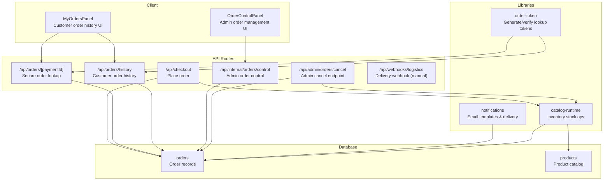
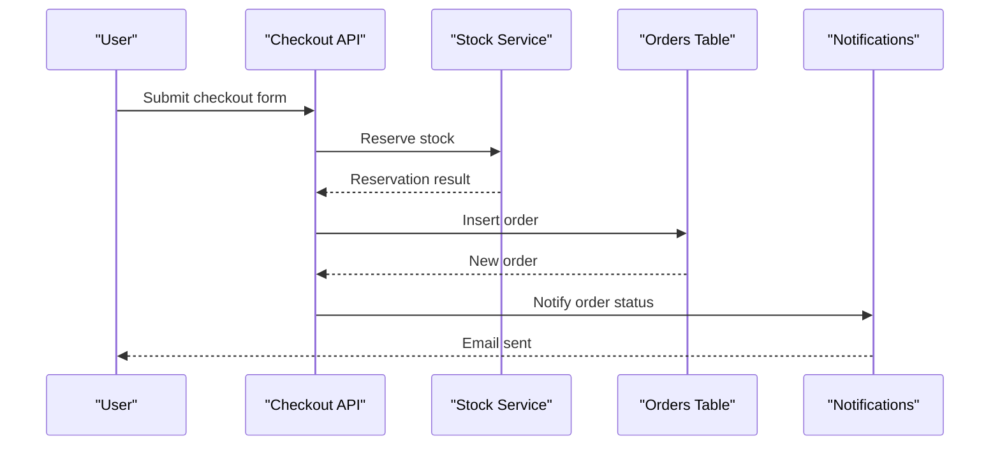
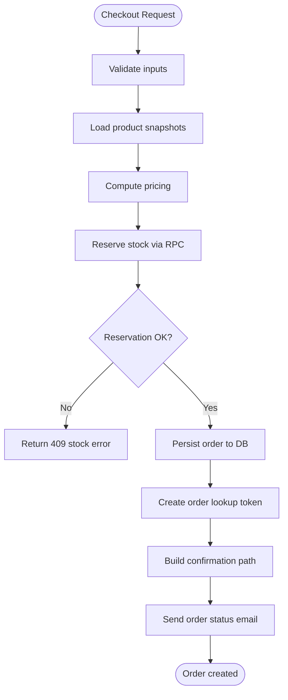
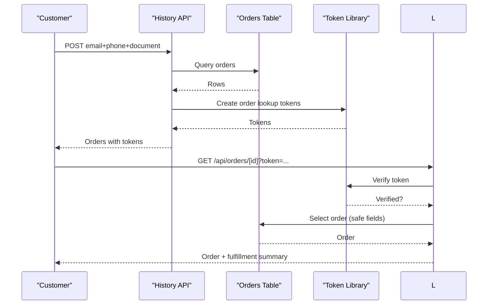
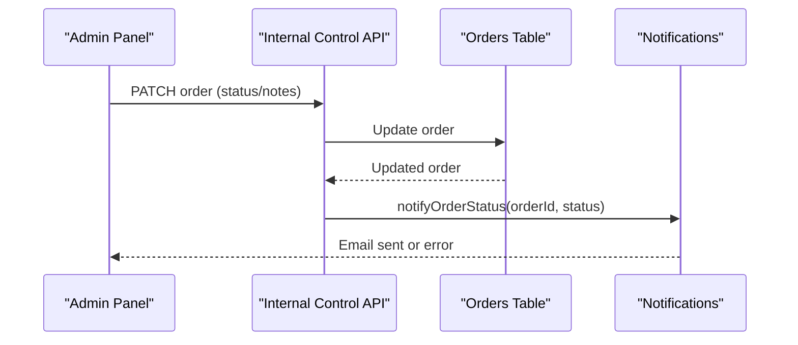
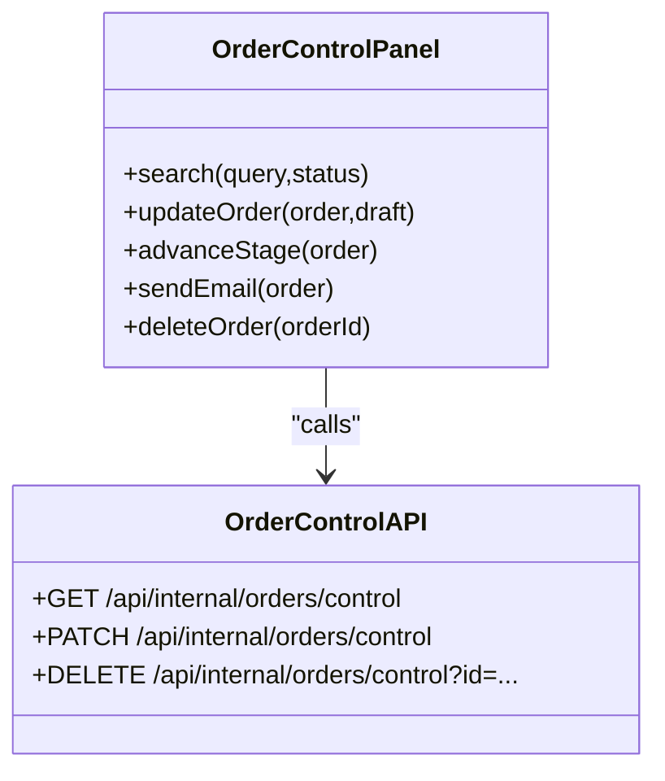
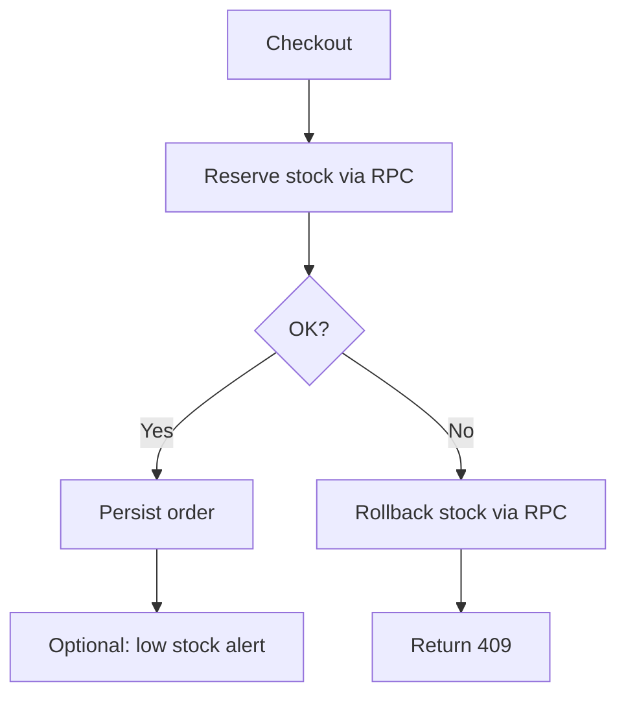
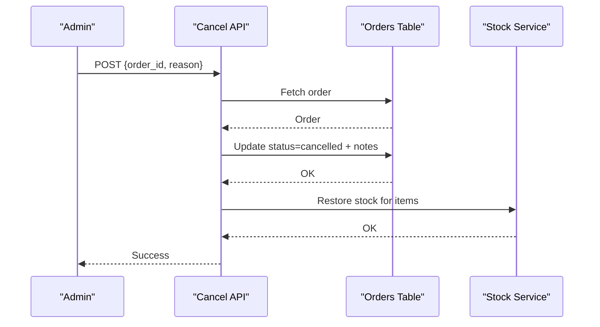
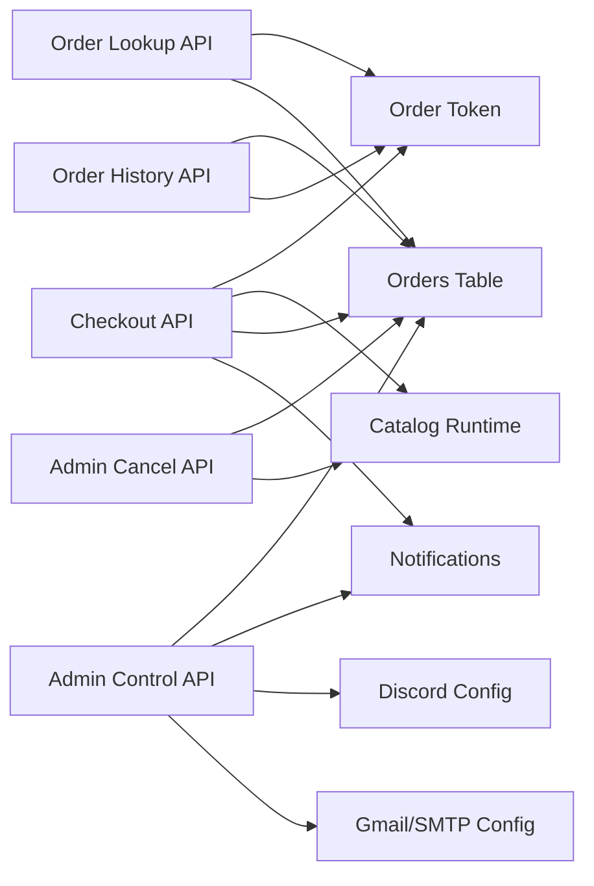

# Order Management

<cite>
**Referenced Files in This Document**
- [src/app/api/checkout/route.ts](file://src/app/api/checkout/route.ts)
- [src/app/api/orders/[paymentId]/route.ts](file://src/app/api/orders/[paymentId]/route.ts)
- [src/app/api/orders/history/route.ts](file://src/app/api/orders/history/route.ts)
- [src/app/api/orders/confirm-email/route.ts](file://src/app/api/orders/confirm-email/route.ts)
- [src/app/api/orders/resend-confirmation/route.ts](file://src/app/api/orders/resend-confirmation/route.ts)
- [src/app/api/admin/orders/cancel/route.ts](file://src/app/api/admin/orders/cancel/route.ts)
- [src/app/api/webhooks/logistics/route.ts](file://src/app/api/webhooks/logistics/route.ts)
- [src/app/api/internal/orders/control/route.ts](file://src/app/api/internal/orders/control/route.ts)
- [src/lib/order-token.ts](file://src/lib/order-token.ts)
- [src/lib/notifications.ts](file://src/lib/notifications.ts)
- [src/lib/catalog-runtime.ts](file://src/lib/catalog-runtime.ts)
- [src/components/orders/MyOrdersPanel.tsx](file://src/components/orders/MyOrdersPanel.tsx)
- [src/app/panel-privado/[token]/OrderControlPanel.tsx](file://src/app/panel-privado/[token]/OrderControlPanel.tsx)
- [src/tpl/types/database.ts](file://src/tpl/types/database.ts)
</cite>

## Table of Contents
1. [Introduction](#introduction)
2. [Project Structure](#project-structure)
3. [Core Components](#core-components)
4. [Architecture Overview](#architecture-overview)
5. [Detailed Component Analysis](#detailed-component-analysis)
6. [Dependency Analysis](#dependency-analysis)
7. [Performance Considerations](#performance-considerations)
8. [Troubleshooting Guide](#troubleshooting-guide)
9. [Conclusion](#conclusion)
10. [Appendices](#appendices)

## Introduction
This document explains the order management system end-to-end: from order placement to completion, status tracking, and customer notifications. It covers the order retrieval API, email confirmation system, customer order history interface, secure token-based lookup, administrative controls, and operational integrations with delivery and inventory. It also documents common issues, synchronization concerns, and practical troubleshooting steps.

## Project Structure
The order management system spans API routes, client components, libraries for tokens and notifications, and administrative panels. Key areas:
- Checkout and order creation
- Secure order lookup and history
- Email notifications
- Administrative order control
- Inventory stock management
- Delivery webhook integration (currently manual)

**Diagram sources**
- [src/components/orders/MyOrdersPanel.tsx:317-355](file://src/components/orders/MyOrdersPanel.tsx#L317-L355)
- [src/app/api/orders/[paymentId]/route.ts](file://src/app/api/orders/[paymentId]/route.ts#L39-L100)
- [src/app/api/orders/history/route.ts:43-144](file://src/app/api/orders/history/route.ts#L43-L144)
- [src/app/api/checkout/route.ts:497-800](file://src/app/api/checkout/route.ts#L497-L800)
- [src/app/api/internal/orders/control/route.ts:283-347](file://src/app/api/internal/orders/control/route.ts#L283-L347)
- [src/app/api/admin/orders/cancel/route.ts:67-226](file://src/app/api/admin/orders/cancel/route.ts#L67-L226)
- [src/app/api/webhooks/logistics/route.ts:1-19](file://src/app/api/webhooks/logistics/route.ts#L1-L19)
- [src/lib/order-token.ts:39-64](file://src/lib/order-token.ts#L39-L64)
- [src/lib/notifications.ts:89-319](file://src/lib/notifications.ts#L89-L319)
- [src/lib/catalog-runtime.ts:293-363](file://src/lib/catalog-runtime.ts#L293-L363)

**Section sources**
- [src/components/orders/MyOrdersPanel.tsx:317-355](file://src/components/orders/MyOrdersPanel.tsx#L317-L355)
- [src/app/api/orders/[paymentId]/route.ts](file://src/app/api/orders/[paymentId]/route.ts#L39-L100)
- [src/app/api/orders/history/route.ts:43-144](file://src/app/api/orders/history/route.ts#L43-L144)
- [src/app/api/checkout/route.ts:497-800](file://src/app/api/checkout/route.ts#L497-L800)
- [src/app/api/internal/orders/control/route.ts:283-347](file://src/app/api/internal/orders/control/route.ts#L283-L347)
- [src/app/api/admin/orders/cancel/route.ts:67-226](file://src/app/api/admin/orders/cancel/route.ts#L67-L226)
- [src/app/api/webhooks/logistics/route.ts:1-19](file://src/app/api/webhooks/logistics/route.ts#L1-L19)
- [src/lib/order-token.ts:39-64](file://src/lib/order-token.ts#L39-L64)
- [src/lib/notifications.ts:89-319](file://src/lib/notifications.ts#L89-L319)
- [src/lib/catalog-runtime.ts:293-363](file://src/lib/catalog-runtime.ts#L293-L363)

## Core Components
- Order creation and checkout pipeline: validates inputs, reserves stock, calculates totals, persists order, and triggers notifications.
- Secure order lookup: HMAC-signed tokens protect order visibility and prevent enumeration.
- Customer order history: retrieves recent orders and generates lookup tokens for private viewing.
- Email notifications: HTML and plaintext emails with contextual status, tracking, and messages.
- Administrative order control: filters, updates status, adds notes, and sends targeted emails.
- Inventory management: reserves and restores stock via RPC wrappers.
- Delivery integration: webhook disabled; fulfillment is manual.

**Section sources**
- [src/app/api/checkout/route.ts:497-800](file://src/app/api/checkout/route.ts#L497-L800)
- [src/lib/order-token.ts:39-64](file://src/lib/order-token.ts#L39-L64)
- [src/app/api/orders/history/route.ts:43-144](file://src/app/api/orders/history/route.ts#L43-L144)
- [src/lib/notifications.ts:89-319](file://src/lib/notifications.ts#L89-L319)
- [src/app/api/internal/orders/control/route.ts:283-347](file://src/app/api/internal/orders/control/route.ts#L283-L347)
- [src/lib/catalog-runtime.ts:293-363](file://src/lib/catalog-runtime.ts#L293-L363)
- [src/app/api/webhooks/logistics/route.ts:1-19](file://src/app/api/webhooks/logistics/route.ts#L1-L19)

## Architecture Overview
The system follows a layered architecture:
- Presentation: Next.js pages and client components for customer and admin views.
- API: Route handlers under src/app/api implementing REST-like endpoints.
- Services: Libraries for tokens, notifications, and catalog runtime operations.
- Persistence: Supabase-backed orders and related tables.

**Diagram sources**
- [src/app/api/checkout/route.ts:663-795](file://src/app/api/checkout/route.ts#L663-L795)
- [src/lib/catalog-runtime.ts:293-363](file://src/lib/catalog-runtime.ts#L293-L363)
- [src/lib/notifications.ts:89-319](file://src/lib/notifications.ts#L89-L319)

**Section sources**
- [src/app/api/checkout/route.ts:663-795](file://src/app/api/checkout/route.ts#L663-L795)
- [src/lib/catalog-runtime.ts:293-363](file://src/lib/catalog-runtime.ts#L293-L363)
- [src/lib/notifications.ts:89-319](file://src/lib/notifications.ts#L89-L319)

## Detailed Component Analysis

### Order Lifecycle: Placement to Completion
- Inputs validated: name, email, phone, document, address, department, and verifications.
- Product snapshots loaded from database with slug/ID resolution.
- Pricing computed: subtotal, shipping cost, total; shipping cost aligned with client expectations.
- Stock reserved via RPC; on failure, inventory errors returned.
- Order persisted with status “processing” and notes containing logistics, pricing, and verification metadata.
- Confirmation token generated and redirect path built for the customer.
- Notifications triggered for initial status.

**Diagram sources**
- [src/app/api/checkout/route.ts:596-795](file://src/app/api/checkout/route.ts#L596-L795)
- [src/lib/catalog-runtime.ts:293-363](file://src/lib/catalog-runtime.ts#L293-L363)
- [src/lib/notifications.ts:89-319](file://src/lib/notifications.ts#L89-L319)

**Section sources**
- [src/app/api/checkout/route.ts:596-795](file://src/app/api/checkout/route.ts#L596-L795)
- [src/lib/catalog-runtime.ts:293-363](file://src/lib/catalog-runtime.ts#L293-L363)
- [src/lib/notifications.ts:89-319](file://src/lib/notifications.ts#L89-L319)

### Secure Order Lookup and Customer History
- Secure lookup: HMAC token with expiration protects order retrieval; enforced in production when secret configured.
- Customer history: accepts email, normalized phone, and optional document suffix; returns last N orders with tokens for private access.
- UI: client component fetches history, stores references, polls statuses, and renders timelines.

**Diagram sources**
- [src/app/api/orders/history/route.ts:43-144](file://src/app/api/orders/history/route.ts#L43-L144)
- [src/lib/order-token.ts:39-64](file://src/lib/order-token.ts#L39-L64)
- [src/app/api/orders/[paymentId]/route.ts](file://src/app/api/orders/[paymentId]/route.ts#L39-L100)
- [src/components/orders/MyOrdersPanel.tsx:317-355](file://src/components/orders/MyOrdersPanel.tsx#L317-L355)

**Section sources**
- [src/app/api/orders/history/route.ts:43-144](file://src/app/api/orders/history/route.ts#L43-L144)
- [src/lib/order-token.ts:39-64](file://src/lib/order-token.ts#L39-L64)
- [src/app/api/orders/[paymentId]/route.ts](file://src/app/api/orders/[paymentId]/route.ts#L39-L100)
- [src/components/orders/MyOrdersPanel.tsx:317-355](file://src/components/orders/MyOrdersPanel.tsx#L317-L355)

### Email Confirmation and Notification Workflows
- Deprecated endpoints: confirm-email and resend-confirmation are disabled; confirmation is handled during checkout.
- Notification engine builds HTML/plaintext emails with status badges, items, tracking, and customer notes.
- Trigger conditions: significant changes (status, tracking, dispatch reference, customer note) or explicit send.

**Diagram sources**
- [src/app/api/internal/orders/control/route.ts:579-604](file://src/app/api/internal/orders/control/route.ts#L579-L604)
- [src/lib/notifications.ts:89-319](file://src/lib/notifications.ts#L89-L319)

**Section sources**
- [src/app/api/orders/confirm-email/route.ts:1-28](file://src/app/api/orders/confirm-email/route.ts#L1-L28)
- [src/app/api/orders/resend-confirmation/route.ts:1-28](file://src/app/api/orders/resend-confirmation/route.ts#L1-L28)
- [src/app/api/internal/orders/control/route.ts:579-604](file://src/app/api/internal/orders/control/route.ts#L579-L604)
- [src/lib/notifications.ts:89-319](file://src/lib/notifications.ts#L89-L319)

### Administrative Order Management
- Access control: admin code header validation.
- Filtering: query by text, status, limit.
- Updates: change status, advance stage automatically, set tracking/dispatch references, add internal/customer notes, mark manual review, send email.
- Deletion: hard-delete order by ID.
- Integration health: reports Discord/Gmail configuration status.

**Diagram sources**
- [src/app/api/internal/orders/control/route.ts:283-347](file://src/app/api/internal/orders/control/route.ts#L283-L347)
- [src/app/panel-privado/[token]/OrderControlPanel.tsx](file://src/app/panel-privado/[token]/OrderControlPanel.tsx#L129-L322)

**Section sources**
- [src/app/api/internal/orders/control/route.ts:283-347](file://src/app/api/internal/orders/control/route.ts#L283-L347)
- [src/app/panel-privado/[token]/OrderControlPanel.tsx](file://src/app/panel-privado/[token]/OrderControlPanel.tsx#L129-L322)

### Inventory and Stock Management
- Stock reservation and restoration via RPC wrappers.
- Fallbacks: runtime table, manual snapshot, product variants.
- Low stock alerts to Discord when thresholds are met.

**Diagram sources**
- [src/app/api/checkout/route.ts:663-795](file://src/app/api/checkout/route.ts#L663-L795)
- [src/lib/catalog-runtime.ts:293-363](file://src/lib/catalog-runtime.ts#L293-L363)

**Section sources**
- [src/app/api/checkout/route.ts:663-795](file://src/app/api/checkout/route.ts#L663-L795)
- [src/lib/catalog-runtime.ts:293-363](file://src/lib/catalog-runtime.ts#L293-L363)

### Delivery Integration
- Webhook endpoints return 410 (disabled) indicating manual fulfillment.
- Tracking and dispatch references are stored in order notes for UI rendering.

**Section sources**
- [src/app/api/webhooks/logistics/route.ts:1-19](file://src/app/api/webhooks/logistics/route.ts#L1-L19)
- [src/app/api/internal/orders/control/route.ts:167-179](file://src/app/api/internal/orders/control/route.ts#L167-L179)

### Order Cancellation (Admin)
- Validates admin secret, checks order exists and status allows cancellation.
- Updates status to “cancelled,” merges cancellation note, and restores stock for all items.

**Diagram sources**
- [src/app/api/admin/orders/cancel/route.ts:67-226](file://src/app/api/admin/orders/cancel/route.ts#L67-L226)
- [src/lib/catalog-runtime.ts:340-363](file://src/lib/catalog-runtime.ts#L340-L363)

**Section sources**
- [src/app/api/admin/orders/cancel/route.ts:67-226](file://src/app/api/admin/orders/cancel/route.ts#L67-L226)
- [src/lib/catalog-runtime.ts:340-363](file://src/lib/catalog-runtime.ts#L340-L363)

## Dependency Analysis
- Order creation depends on:
  - Product catalog resolution
  - Stock reservation
  - Email configuration
  - IP/block/vpn checks
- Order lookup depends on:
  - Token library for signing/verification
  - Supabase for order retrieval
- Admin control depends on:
  - Admin code validation
  - Supabase for reads/writes
  - Notifications for email dispatch
  - Discord/Gmail for integrations

**Diagram sources**
- [src/app/api/checkout/route.ts:497-800](file://src/app/api/checkout/route.ts#L497-L800)
- [src/lib/order-token.ts:39-64](file://src/lib/order-token.ts#L39-L64)
- [src/lib/catalog-runtime.ts:293-363](file://src/lib/catalog-runtime.ts#L293-L363)
- [src/lib/notifications.ts:89-319](file://src/lib/notifications.ts#L89-L319)
- [src/app/api/internal/orders/control/route.ts:283-347](file://src/app/api/internal/orders/control/route.ts#L283-L347)
- [src/app/api/admin/orders/cancel/route.ts:67-226](file://src/app/api/admin/orders/cancel/route.ts#L67-L226)

**Section sources**
- [src/app/api/checkout/route.ts:497-800](file://src/app/api/checkout/route.ts#L497-L800)
- [src/lib/order-token.ts:39-64](file://src/lib/order-token.ts#L39-L64)
- [src/lib/catalog-runtime.ts:293-363](file://src/lib/catalog-runtime.ts#L293-L363)
- [src/lib/notifications.ts:89-319](file://src/lib/notifications.ts#L89-L319)
- [src/app/api/internal/orders/control/route.ts:283-347](file://src/app/api/internal/orders/control/route.ts#L283-L347)
- [src/app/api/admin/orders/cancel/route.ts:67-226](file://src/app/api/admin/orders/cancel/route.ts#L67-L226)

## Performance Considerations
- Rate limits: checkout, order lookup, and admin cancel endpoints enforce per-IP quotas to prevent abuse.
- Idempotency: checkout uses idempotency keys derived from payment identifiers to avoid duplicate orders.
- Polling: customer order panel polls statuses at a configurable interval to minimize long-poll overhead.
- Database queries: selective column retrieval for lookup and history to reduce payload sizes.

[No sources needed since this section provides general guidance]

## Troubleshooting Guide
Common issues and resolutions:
- Order status not updating
  - Ensure admin updates include significant changes or explicitly send email; otherwise, no notification is sent.
  - Verify admin code and Supabase configuration.
- Email notifications failing
  - Confirm SMTP credentials are set; errors are logged and surfaced to the admin panel.
  - Check Discord/Gmail integration toggles in the admin panel.
- Stock reservation conflicts
  - On 409, inform customers to refresh and retry; underlying stock may have changed.
  - Review low stock thresholds and alerts.
- Order lookup unauthorized
  - Production requires ORDER_LOOKUP_SECRET; without it, requests are rejected.
  - Verify token format and expiration.
- Duplicate orders
  - Checkout prevents duplicates by checking recent orders for the same phone/address; returns conflict if exceeded.
- Delivery webhooks
  - Webhooks are disabled; fulfillment is manual. Ensure dispatch references and tracking codes are entered in notes.

**Section sources**
- [src/app/api/internal/orders/control/route.ts:579-604](file://src/app/api/internal/orders/control/route.ts#L579-L604)
- [src/lib/notifications.ts:383-406](file://src/lib/notifications.ts#L383-L406)
- [src/app/api/admin/orders/cancel/route.ts:161-194](file://src/app/api/admin/orders/cancel/route.ts#L161-L194)
- [src/lib/order-token.ts:39-64](file://src/lib/order-token.ts#L39-L64)
- [src/app/api/checkout/route.ts:633-641](file://src/app/api/checkout/route.ts#L633-L641)
- [src/app/api/webhooks/logistics/route.ts:1-19](file://src/app/api/webhooks/logistics/route.ts#L1-L19)

## Conclusion
The order management system integrates checkout, secure lookup, email notifications, administrative controls, and inventory management into a cohesive workflow. While delivery webhooks are currently disabled, the system supports robust manual fulfillment with clear audit trails in order notes. Administrators can efficiently manage orders, communicate with customers, and maintain inventory integrity.

[No sources needed since this section summarizes without analyzing specific files]

## Appendices

### API Definitions and Behaviors
- Order creation
  - Endpoint: POST /api/checkout
  - Behavior: Validates inputs, loads products, computes pricing, reserves stock, persists order, and notifies customer.
- Secure order lookup
  - Endpoint: GET /api/orders/[paymentId]?token=...
  - Behavior: Verifies token; returns sanitized order fields and fulfillment summary.
- Customer order history
  - Endpoint: POST /api/orders/history
  - Behavior: Returns last N orders matching email+phone; attaches lookup tokens.
- Admin order control
  - Endpoint: GET/PATCH/DELETE /api/internal/orders/control
  - Behavior: Filters orders, updates status/notes/tracking, marks manual review, sends email, deletes order.
- Admin order cancellation
  - Endpoint: POST /api/admin/orders/cancel
  - Behavior: Cancels eligible orders and restores stock.
- Delivery webhook
  - Endpoint: POST/GET /api/webhooks/logistics
  - Behavior: Disabled (410).

**Section sources**
- [src/app/api/checkout/route.ts:497-800](file://src/app/api/checkout/route.ts#L497-L800)
- [src/app/api/orders/[paymentId]/route.ts](file://src/app/api/orders/[paymentId]/route.ts#L39-L100)
- [src/app/api/orders/history/route.ts:43-144](file://src/app/api/orders/history/route.ts#L43-L144)
- [src/app/api/internal/orders/control/route.ts:283-347](file://src/app/api/internal/orders/control/route.ts#L283-L347)
- [src/app/api/admin/orders/cancel/route.ts:67-226](file://src/app/api/admin/orders/cancel/route.ts#L67-L226)
- [src/app/api/webhooks/logistics/route.ts:1-19](file://src/app/api/webhooks/logistics/route.ts#L1-L19)

### Data Model Notes
- Order status lifecycle: pending → processing → shipped → delivered; cancellations/refunds are supported.
- Order notes store fulfillment, admin control, and customer updates for UI rendering and audit.

**Section sources**
- [src/tpl/types/database.ts:4-11](file://src/tpl/types/database.ts#L4-L11)
- [src/app/api/internal/orders/control/route.ts:226-250](file://src/app/api/internal/orders/control/route.ts#L226-L250)