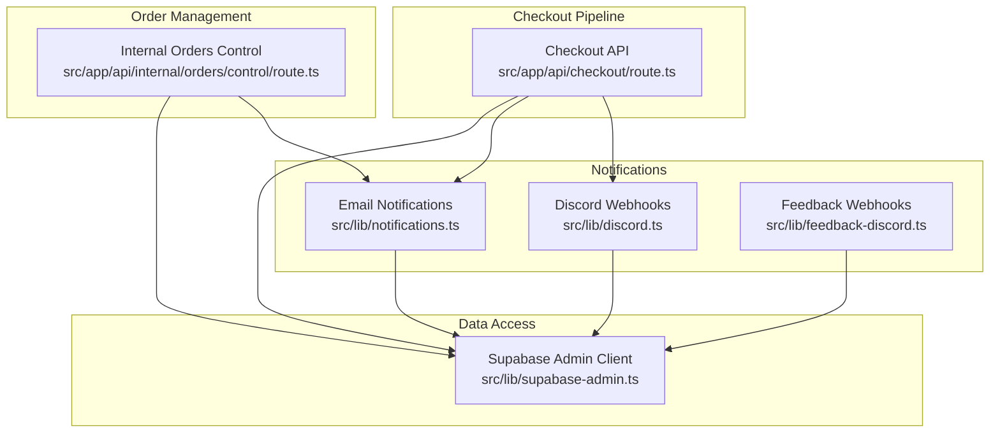
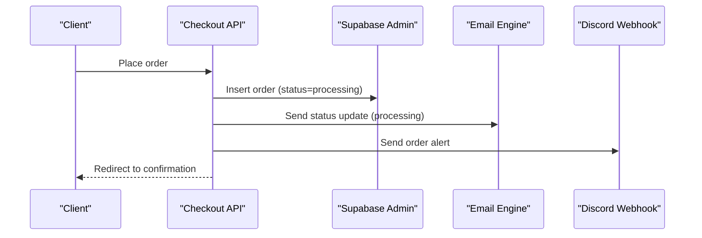
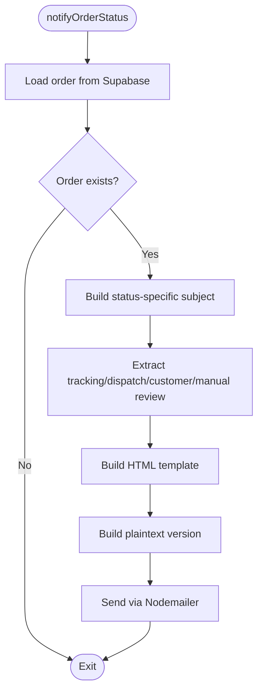
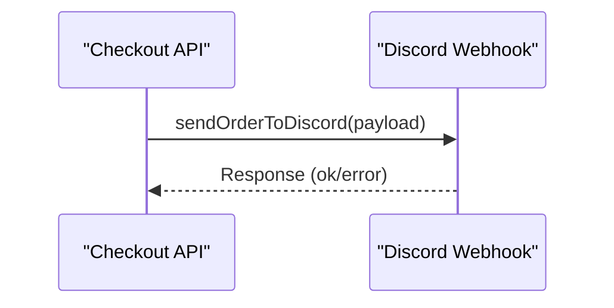
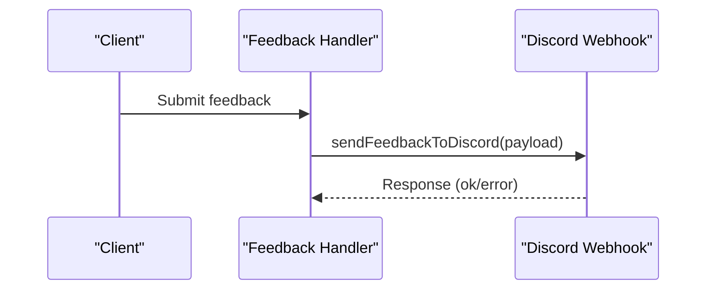
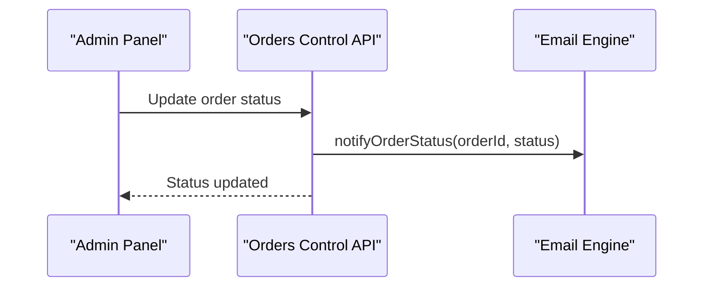
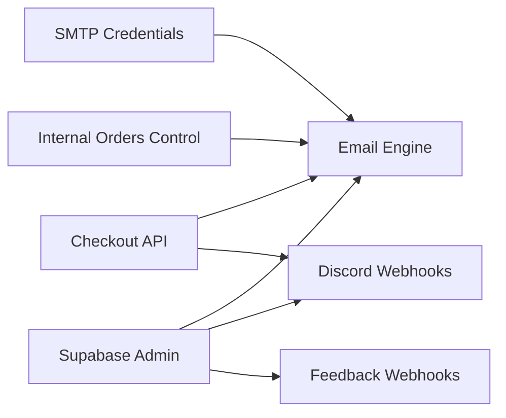

# Order Notification System

<cite>
**Referenced Files in This Document**
- [notifications.ts](file://src/lib/notifications.ts)
- [discord.ts](file://src/lib/discord.ts)
- [feedback-discord.ts](file://src/lib/feedback-discord.ts)
- [checkout\route.ts](file://src/app/api/checkout/route.ts)
- [internal\orders\control\route.ts](file://src/app/api/internal/orders/control/route.ts)
- [supabase-admin.ts](file://src/lib/supabase-admin.ts)
- [webhooks\logistics\route.ts](file://src/app/api/webhooks/logistics/route.ts)
- [webhooks\whatsapp\route.ts](file://src/app/api/webhooks/whatsapp/route.ts)
- [orders\confirm-email\route.ts](file://src/app/api/orders/confirm-email/route.ts)
- [orders\resend-confirmation\route.ts](file://src/app/api/orders/resend-confirmation/route.ts)
</cite>

## Table of Contents
1. [Introduction](#introduction)
2. [Project Structure](#project-structure)
3. [Core Components](#core-components)
4. [Architecture Overview](#architecture-overview)
5. [Detailed Component Analysis](#detailed-component-analysis)
6. [Dependency Analysis](#dependency-analysis)
7. [Performance Considerations](#performance-considerations)
8. [Troubleshooting Guide](#troubleshooting-guide)
9. [Conclusion](#conclusion)

## Introduction
This document explains the order notification and communication system for the e-commerce platform. It covers:
- Email confirmation workflow and templating
- Automated notification triggers and delivery status tracking
- Discord webhook integration for order alerts, feedback notifications, and administrative updates
- Integration with external communication platforms and notification scheduling
- Retry mechanisms, fallback strategies, and monitoring approaches
- Examples of notification workflows and troubleshooting steps

## Project Structure
The notification system spans several modules:
- Email notifications: built around Nodemailer and order status updates
- Discord webhooks: order alerts, cancellation results, moderation actions, and feedback
- Checkout pipeline: order creation and initial status transitions
- Internal order control: status change triggers and administrative controls
- Legacy endpoints: deprecated email confirmation routes

**Diagram sources**
- [checkout\route.ts:1-872](file://src/app/api/checkout/route.ts#L1-L872)
- [internal\orders\control\route.ts:1-600](file://src/app/api/internal/orders/control/route.ts#L1-L600)
- [notifications.ts:1-408](file://src/lib/notifications.ts#L1-L408)
- [discord.ts:1-379](file://src/lib/discord.ts#L1-L379)
- [feedback-discord.ts:1-125](file://src/lib/feedback-discord.ts#L1-L125)
- [supabase-admin.ts:1-31](file://src/lib/supabase-admin.ts#L1-L31)

**Section sources**
- [checkout\route.ts:1-872](file://src/app/api/checkout/route.ts#L1-L872)
- [internal\orders\control\route.ts:1-600](file://src/app/api/internal/orders/control/route.ts#L1-L600)
- [notifications.ts:1-408](file://src/lib/notifications.ts#L1-L408)
- [discord.ts:1-379](file://src/lib/discord.ts#L1-L379)
- [feedback-discord.ts:1-125](file://src/lib/feedback-discord.ts#L1-L125)
- [supabase-admin.ts:1-31](file://src/lib/supabase-admin.ts#L1-L31)

## Core Components
- Email notification engine:
  - Builds HTML and plaintext templates for order status updates
  - Extracts metadata from order notes (tracking codes, dispatch references, customer notes, manual review status)
  - Sends via Nodemailer using Gmail SMTP
- Discord webhook integrations:
  - Order alerts with embedded details and admin action commands
  - Feedback notifications with sanitized payloads
  - Cancellation result reporting
  - Low stock alerts with cooldown
- Order lifecycle triggers:
  - Checkout API creates orders and sends initial notifications
  - Internal order control updates statuses and triggers follow-up emails
- Deprecated endpoints:
  - Legacy email confirmation routes are disabled

**Section sources**
- [notifications.ts:1-408](file://src/lib/notifications.ts#L1-L408)
- [discord.ts:1-379](file://src/lib/discord.ts#L1-L379)
- [feedback-discord.ts:1-125](file://src/lib/feedback-discord.ts#L1-L125)
- [checkout\route.ts:1-872](file://src/app/api/checkout/route.ts#L1-L872)
- [internal\orders\control\route.ts:1-600](file://src/app/api/internal/orders/control/route.ts#L1-L600)
- [orders\confirm-email\route.ts:1-28](file://src/app/api/orders/confirm-email/route.ts#L1-L28)
- [orders\resend-confirmation\route.ts:1-28](file://src/app/api/orders/resend-confirmation/route.ts#L1-L28)

## Architecture Overview
The system integrates three primary channels:
- Email: customer-centric order status updates
- Discord: operational visibility and administrative controls
- Feedback: customer insights and error reporting

**Diagram sources**
- [checkout\route.ts:759-800](file://src/app/api/checkout/route.ts#L759-L800)
- [notifications.ts:89-130](file://src/lib/notifications.ts#L89-L130)
- [discord.ts:79-130](file://src/lib/discord.ts#L79-L130)

**Section sources**
- [checkout\route.ts:759-800](file://src/app/api/checkout/route.ts#L759-L800)
- [notifications.ts:89-130](file://src/lib/notifications.ts#L89-L130)
- [discord.ts:79-130](file://src/lib/discord.ts#L79-L130)

## Detailed Component Analysis

### Email Notification Engine
Responsibilities:
- Load order details from Supabase
- Build localized HTML and plaintext messages
- Extract metadata from order notes for tracking, dispatch references, customer notes, and manual review status
- Send via Nodemailer using Gmail SMTP

Key behaviors:
- Subject and content adapt to order status
- Uses brand-specific styles and pill indicators for status
- Includes order summary, items table, and optional customer note
- Provides a tracking link when available

**Diagram sources**
- [notifications.ts:89-130](file://src/lib/notifications.ts#L89-L130)
- [notifications.ts:316-319](file://src/lib/notifications.ts#L316-L319)

**Section sources**
- [notifications.ts:1-408](file://src/lib/notifications.ts#L1-L408)
- [supabase-admin.ts:1-31](file://src/lib/supabase-admin.ts#L1-L31)

### Discord Order Alerts
Responsibilities:
- Send rich embeds with order details and admin action commands
- Provide moderation commands (block/unblock IP) and order actions (cancel)
- Support ETA, carrier, and shipping metadata
- Include checklist and technical fields for operators

**Diagram sources**
- [checkout\route.ts:801-801](file://src/app/api/checkout/route.ts#L801-L801)
- [discord.ts:79-130](file://src/lib/discord.ts#L79-L130)

**Section sources**
- [discord.ts:1-379](file://src/lib/discord.ts#L1-L379)
- [checkout\route.ts:801-801](file://src/app/api/checkout/route.ts#L801-L801)

### Feedback Notifications to Discord
Responsibilities:
- Sanitize and structure feedback payloads
- Color-code by type (error, suggestion, comment)
- Attach client IP and user agent for traceability

**Diagram sources**
- [feedback-discord.ts:34-123](file://src/lib/feedback-discord.ts#L34-L123)

**Section sources**
- [feedback-discord.ts:1-125](file://src/lib/feedback-discord.ts#L1-L125)

### Internal Order Control Triggers
Responsibilities:
- On status changes, trigger email notifications
- Supports cancellation result reporting to Discord

**Diagram sources**
- [internal\orders\control\route.ts:580-590](file://src/app/api/internal/orders/control/route.ts#L580-L590)
- [notifications.ts:89-130](file://src/lib/notifications.ts#L89-L130)

**Section sources**
- [internal\orders\control\route.ts:580-590](file://src/app/api/internal/orders/control/route.ts#L580-L590)
- [notifications.ts:89-130](file://src/lib/notifications.ts#L89-L130)

### Deprecated Email Confirmation Endpoints
Responsibilities:
- Legacy routes for email confirmation codes are disabled
- Returns deprecation notices

**Section sources**
- [orders\confirm-email\route.ts:1-28](file://src/app/api/orders/confirm-email/route.ts#L1-L28)
- [orders\resend-confirmation\route.ts:1-28](file://src/app/api/orders/resend-confirmation/route.ts#L1-L28)

## Dependency Analysis
- Email engine depends on:
  - Supabase admin client for order retrieval
  - Environment variables for SMTP and sender identity
- Discord integrations depend on:
  - Environment variable for webhook URL
  - Optional in-memory cooldown for low stock alerts
- Checkout and internal order control orchestrate triggers:
  - Checkout creates orders and sends initial notifications
  - Internal control updates status and triggers follow-ups

**Diagram sources**
- [notifications.ts:26-41](file://src/lib/notifications.ts#L26-L41)
- [discord.ts:6-12](file://src/lib/discord.ts#L6-L12)
- [feedback-discord.ts:1-3](file://src/lib/feedback-discord.ts#L1-L3)
- [checkout\route.ts:1-50](file://src/app/api/checkout/route.ts#L1-L50)
- [internal\orders\control\route.ts:1-20](file://src/app/api/internal/orders/control/route.ts#L1-L20)

**Section sources**
- [notifications.ts:1-408](file://src/lib/notifications.ts#L1-L408)
- [discord.ts:1-379](file://src/lib/discord.ts#L1-L379)
- [feedback-discord.ts:1-125](file://src/lib/feedback-discord.ts#L1-L125)
- [checkout\route.ts:1-872](file://src/app/api/checkout/route.ts#L1-L872)
- [internal\orders\control\route.ts:1-600](file://src/app/api/internal/orders/control/route.ts#L1-L600)

## Performance Considerations
- Email throughput:
  - Nodemailer is synchronous; consider batching or queueing for high volume
  - Template rendering is lightweight; avoid heavy computations in hot paths
- Discord webhooks:
  - Fetch calls are fire-and-forget; ensure timeouts are acceptable
  - Low stock alerts use an in-memory cooldown to prevent spam
- Database access:
  - Supabase queries are minimal; ensure indexes on order lookup fields
- Idempotency:
  - Checkout uses idempotency keys to prevent duplicate orders

[No sources needed since this section provides general guidance]

## Troubleshooting Guide

Common issues and resolutions:
- Email delivery failures
  - Verify SMTP credentials and sender domain configuration
  - Check logs for Nodemailer errors
  - Ensure customer email is present and valid
- Discord webhook failures
  - Confirm webhook URL is set and reachable
  - Inspect response status and error bodies
  - For low stock alerts, ensure cooldown does not suppress repeated alerts
- Order status notifications not sent
  - Confirm Supabase admin client is configured
  - Verify order exists and status transitions occur
- Deprecated endpoints
  - Legacy email confirmation routes return deprecation errors; remove client-side reliance

Operational checks:
- Environment variables
  - SMTP_USER, SMTP_PASSWORD, EMAIL_FROM
  - NEXT_PUBLIC_APP_URL or APP_URL for tracking links
  - DISCORD_WEBHOOK_URL
  - NEXT_PUBLIC_SUPABASE_URL and SUPABASE_SERVICE_ROLE_KEY
- Monitoring
  - Email: inspect console logs after send attempts
  - Discord: capture response.ok and error logs
  - Feedback: validate webhook response and error messages

**Section sources**
- [notifications.ts:383-406](file://src/lib/notifications.ts#L383-L406)
- [discord.ts:215-228](file://src/lib/discord.ts#L215-L228)
- [feedback-discord.ts:113-123](file://src/lib/feedback-discord.ts#L113-L123)
- [supabase-admin.ts:18-31](file://src/lib/supabase-admin.ts#L18-L31)

## Conclusion
The order notification system combines targeted email updates with operational Discord visibility. It leverages structured order notes for rich customer communications, provides actionable admin commands, and maintains robust logging for troubleshooting. While the checkout flow is fully automated and the legacy email confirmation endpoints are deprecated, the core notification stack remains extensible for future enhancements such as scheduled notifications, advanced retry policies, and expanded external integrations.