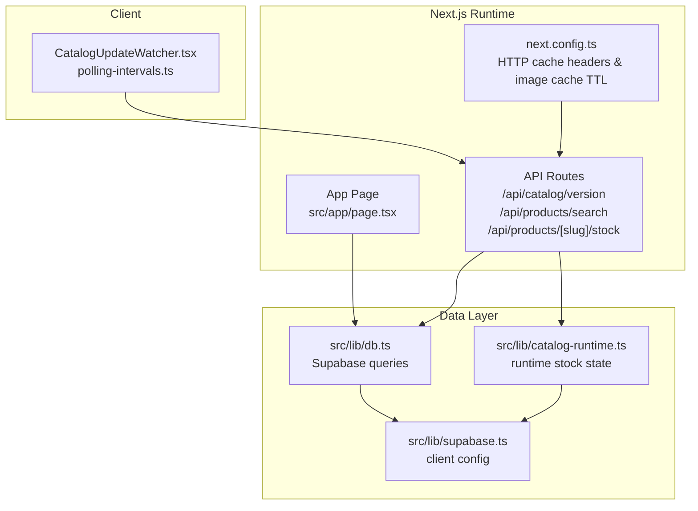
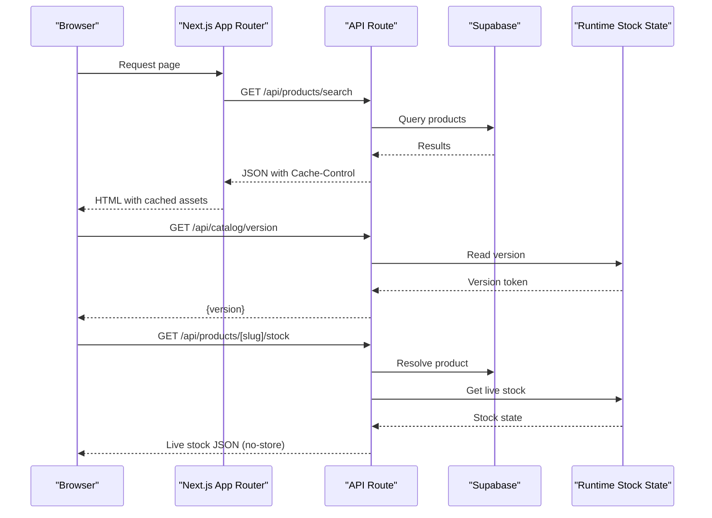
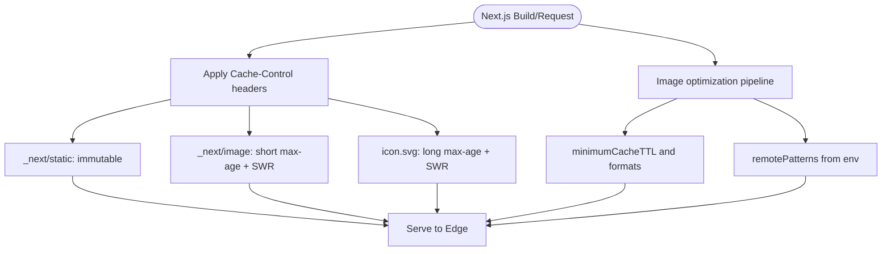
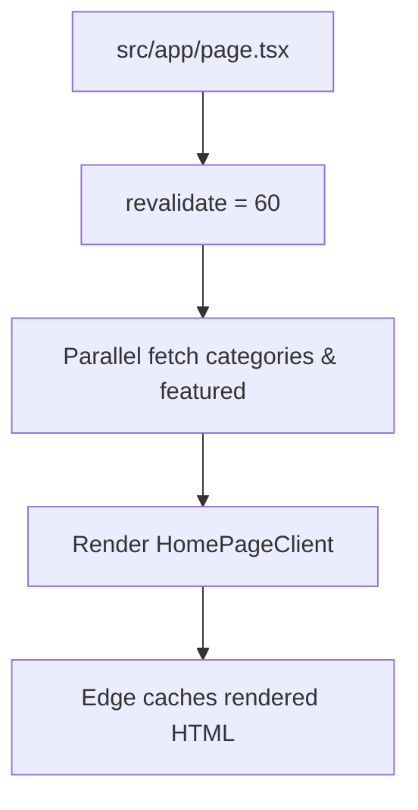
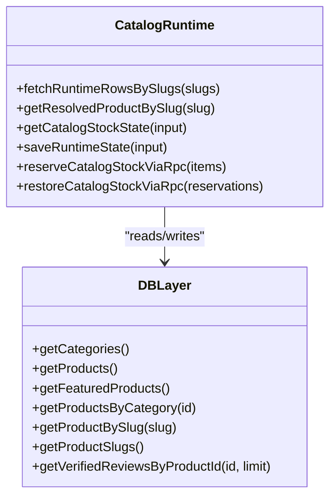
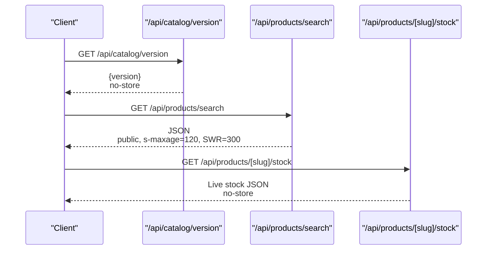
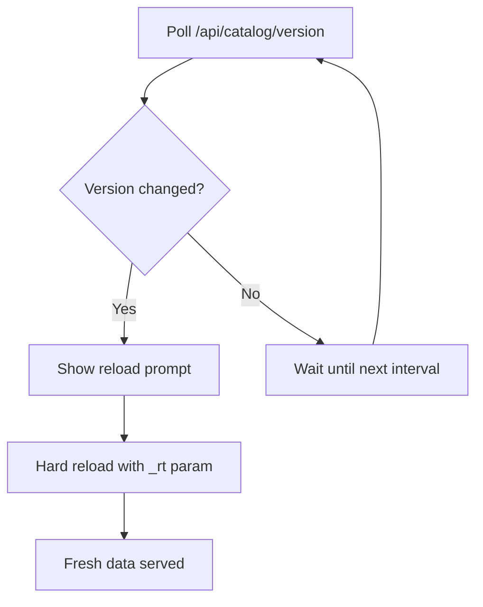
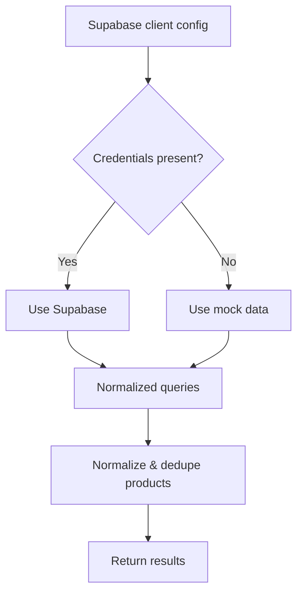
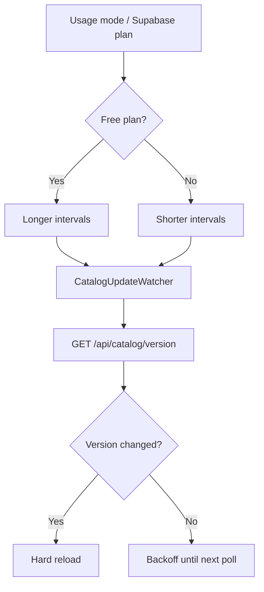
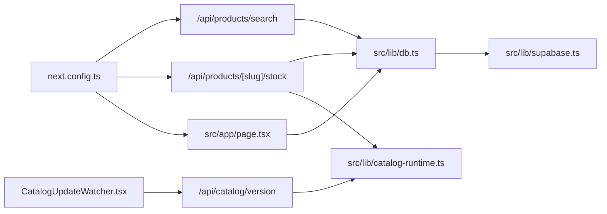

# Caching Strategies

<cite>
**Referenced Files in This Document**
- [next.config.ts](file://next.config.ts)
- [db.ts](file://src/lib/db.ts)
- [supabase.ts](file://src/lib/supabase.ts)
- [polling-intervals.ts](file://src/lib/polling-intervals.ts)
- [route.ts](file://src/app/api/catalog/version/route.ts)
- [route.ts](file://src/app/api/products/search/route.ts)
- [route.ts](file://src/app/api/products/[slug]/stock/route.ts)
- [CatalogUpdateWatcher.tsx](file://src/components/CatalogUpdateWatcher.tsx)
- [catalog-runtime.ts](file://src/lib/catalog-runtime.ts)
- [page.tsx](file://src/app/page.tsx)
</cite>

## Table of Contents
1. [Introduction](#introduction)
2. [Project Structure](#project-structure)
3. [Core Components](#core-components)
4. [Architecture Overview](#architecture-overview)
5. [Detailed Component Analysis](#detailed-component-analysis)
6. [Dependency Analysis](#dependency-analysis)
7. [Performance Considerations](#performance-considerations)
8. [Troubleshooting Guide](#troubleshooting-guide)
9. [Conclusion](#conclusion)

## Introduction
This document explains AllShop’s caching strategies across Next.js App Router caching, static generation caching, server-side caching, Supabase-backed runtime stock state, and real-time update polling. It also covers cache invalidation, edge caching with Vercel, database query result caching, cache warming, stale-while-revalidate patterns, performance monitoring, and common challenges such as cache consistency and deployment warming.

## Project Structure
AllShop organizes caching concerns across:
- Next.js configuration for image caching and HTTP cache headers
- API routes implementing cache-control policies and revalidation hints
- Database access utilities that conditionally use Supabase or mocks
- Client components that poll for catalog updates
- Runtime stock state utilities that maintain a server-only operational stock table

**Diagram sources**
- [next.config.ts:53-114](file://next.config.ts#L53-L114)
- [route.ts](file://src/app/api/catalog/version/route.ts)
- [route.ts](file://src/app/api/products/search/route.ts)
- [route.ts](file://src/app/api/products/[slug]/stock/route.ts)
- [page.tsx:1-26](file://src/app/page.tsx#L1-L26)
- [CatalogUpdateWatcher.tsx:1-119](file://src/components/CatalogUpdateWatcher.tsx#L1-L119)
- [db.ts:113-309](file://src/lib/db.ts#L113-L309)
- [supabase.ts:1-20](file://src/lib/supabase.ts#L1-L20)
- [catalog-runtime.ts:1-800](file://src/lib/catalog-runtime.ts#L1-L800)

**Section sources**
- [next.config.ts:53-114](file://next.config.ts#L53-L114)
- [page.tsx:1-26](file://src/app/page.tsx#L1-L26)

## Core Components
- Next.js HTTP cache headers and image cache TTL
  - Immutable static assets and short-lived image caching with stale-while-revalidate
- API routes with explicit cache-control and revalidate hints
- Database access utilities that switch between Supabase and mock data
- Real-time polling for catalog updates with configurable intervals
- Server-only runtime stock state for live stock availability

**Section sources**
- [next.config.ts:75-114](file://next.config.ts#L75-L114)
- [route.ts](file://src/app/api/catalog/version/route.ts)
- [route.ts](file://src/app/api/products/search/route.ts)
- [route.ts](file://src/app/api/products/[slug]/stock/route.ts)
- [db.ts:113-309](file://src/lib/db.ts#L113-L309)
- [polling-intervals.ts:1-18](file://src/lib/polling-intervals.ts#L1-L18)
- [catalog-runtime.ts:13-14](file://src/lib/catalog-runtime.ts#L13-L14)

## Architecture Overview
The caching architecture combines:
- Edge caching via Vercel with HTTP cache headers
- Server-side caching of runtime stock state
- Client-side polling for catalog updates
- Database query result caching through Supabase and local normalization

**Diagram sources**
- [route.ts](file://src/app/api/products/search/route.ts)
- [route.ts](file://src/app/api/catalog/version/route.ts)
- [route.ts](file://src/app/api/products/[slug]/stock/route.ts)
- [db.ts:146-181](file://src/lib/db.ts#L146-L181)
- [catalog-runtime.ts:465-508](file://src/lib/catalog-runtime.ts#L465-L508)

## Detailed Component Analysis

### Next.js App Router Caching and Image Cache TTL
- HTTP cache headers:
  - Immutable static assets under “/_next/static”
  - Short-lived image caching with long stale-while-revalidate windows
  - Additional cache headers for icons
- Image optimization:
  - WebP/AVIF formats
  - Remote image hosts from environment
  - Long default cache TTL for images

**Diagram sources**
- [next.config.ts:53-114](file://next.config.ts#L53-L114)

**Section sources**
- [next.config.ts:64-74](file://next.config.ts#L64-L74)
- [next.config.ts:75-114](file://next.config.ts#L75-L114)

### Static Generation Caching (App Router)
- Pages can opt-in to revalidation:
  - Home page sets a revalidation interval to refresh categories and featured products periodically
- Benefits:
  - Reduced server load and faster responses
  - Controlled staleness with revalidate hints

**Diagram sources**
- [page.tsx:5-6](file://src/app/page.tsx#L5-L6)
- [page.tsx:13-25](file://src/app/page.tsx#L13-L25)

**Section sources**
- [page.tsx:5-6](file://src/app/page.tsx#L5-L6)
- [page.tsx:14-17](file://src/app/page.tsx#L14-L17)

### Server-Side Caching Mechanisms
- Runtime stock state:
  - Server-only module maintains a dedicated operational stock table
  - Provides live stock availability with fallbacks to manual snapshots and product variants
- Supabase-backed queries:
  - Conditional Supabase usage based on environment configuration
  - Normalization and deduplication of product records to reduce variability

**Diagram sources**
- [catalog-runtime.ts:465-508](file://src/lib/catalog-runtime.ts#L465-L508)
- [catalog-runtime.ts:510-536](file://src/lib/catalog-runtime.ts#L510-L536)
- [catalog-runtime.ts:605-633](file://src/lib/catalog-runtime.ts#L605-L633)
- [db.ts:113-309](file://src/lib/db.ts#L113-L309)

**Section sources**
- [catalog-runtime.ts:1-12](file://src/lib/catalog-runtime.ts#L1-L12)
- [catalog-runtime.ts:13-14](file://src/lib/catalog-runtime.ts#L13-L14)
- [db.ts:109-111](file://src/lib/db.ts#L109-L111)

### API Routes: Cache-Control and Revalidation
- Catalog version endpoint:
  - Forces dynamic behavior and disables caching
- Products search endpoint:
  - Public caching with s-maxage and stale-while-revalidate
  - Revalidate hint to refresh cached responses
- Product stock endpoint:
  - No-store headers for live stock checks
  - Rate limiting applied per IP

**Diagram sources**
- [route.ts](file://src/app/api/catalog/version/route.ts)
- [route.ts](file://src/app/api/products/search/route.ts)
- [route.ts](file://src/app/api/products/[slug]/stock/route.ts)

**Section sources**
- [route.ts](file://src/app/api/catalog/version/route.ts)
- [route.ts](file://src/app/api/products/search/route.ts)
- [route.ts](file://src/app/api/products/[slug]/stock/route.ts)

### Cache Invalidation Strategies
- Dynamic endpoints:
  - Force-dynamic routes with zero revalidate and no-store headers prevent caching
- Stale-while-revalidate:
  - API responses specify stale-while-revalidate to serve stale while validating in the background
- Client-driven reload:
  - Catalog update watcher polls for version changes and prompts a hard reload

**Diagram sources**
- [CatalogUpdateWatcher.tsx:14-75](file://src/components/CatalogUpdateWatcher.tsx#L14-L75)
- [route.ts](file://src/app/api/catalog/version/route.ts)

**Section sources**
- [CatalogUpdateWatcher.tsx:14-75](file://src/components/CatalogUpdateWatcher.tsx#L14-L75)
- [route.ts](file://src/app/api/catalog/version/route.ts)

### Edge Caching with Vercel
- HTTP cache headers:
  - Immutable static assets
  - Short-lived images with long stale-while-revalidate
- Implications:
  - Reduced origin load and lower latency
  - Background revalidation keeps content fresh

**Section sources**
- [next.config.ts:75-114](file://next.config.ts#L75-L114)

### Database Query Result Caching
- Supabase client configuration:
  - Guardrails to avoid sending requests when credentials are missing
- Query utilities:
  - Normalize and deduplicate product lists
  - Conditional Supabase usage with mock fallbacks

**Diagram sources**
- [supabase.ts:1-20](file://src/lib/supabase.ts#L1-L20)
- [db.ts:109-111](file://src/lib/db.ts#L109-L111)
- [db.ts:80-107](file://src/lib/db.ts#L80-L107)

**Section sources**
- [supabase.ts:7-12](file://src/lib/supabase.ts#L7-L12)
- [db.ts:109-111](file://src/lib/db.ts#L109-L111)
- [db.ts:80-107](file://src/lib/db.ts#L80-L107)

### Real-Time Data Updates: Polling Intervals
- Polling intervals vary by plan/usage mode:
  - Free plan mode increases intervals for cost-conscious operation
- Components:
  - Catalog update watcher triggers periodic checks and reloads when needed

**Diagram sources**
- [polling-intervals.ts:1-18](file://src/lib/polling-intervals.ts#L1-L18)
- [CatalogUpdateWatcher.tsx:14-75](file://src/components/CatalogUpdateWatcher.tsx#L14-L75)

**Section sources**
- [polling-intervals.ts:1-18](file://src/lib/polling-intervals.ts#L1-L18)
- [CatalogUpdateWatcher.tsx:14-75](file://src/components/CatalogUpdateWatcher.tsx#L14-L75)

### Cache Warming Techniques
- Pre-warm popular routes:
  - Trigger initial fetch of frequently accessed pages and API endpoints
- Image cache warming:
  - Proactively request optimized images to populate edge caches
- Server-side warming:
  - Warm runtime stock state by precomputing and upserting recent states

[No sources needed since this section provides general guidance]

### Stale-While-Revalidate Patterns
- API responses specify stale-while-revalidate to keep serving stale while refreshing in the background
- Next.js App Router revalidate hints on pages to refresh content periodically

**Section sources**
- [route.ts](file://src/app/api/products/search/route.ts)
- [page.tsx:5-6](file://src/app/page.tsx#L5-L6)

### Practical Examples of Cache Configuration
- Image cache TTL and formats:
  - Configure image hosts and cache TTL in Next.js config
- API cache-control:
  - Use public, s-maxage, and stale-while-revalidate headers for search
  - Use no-store for live stock and catalog version
- Revalidate hints:
  - Apply revalidate on pages to control freshness

**Section sources**
- [next.config.ts:64-74](file://next.config.ts#L64-L74)
- [route.ts](file://src/app/api/products/search/route.ts)
- [route.ts](file://src/app/api/catalog/version/route.ts)
- [page.tsx:5-6](file://src/app/page.tsx#L5-L6)

### Performance Monitoring and Cache Hit Ratio Optimization
- Monitor cache hit ratios at the CDN level (Vercel) and adjust headers accordingly
- Observe image cache effectiveness and tune formats and TTL
- Track API cache behavior and adjust stale-while-revalidate windows

[No sources needed since this section provides general guidance]

### Relationship Between Caching and Supabase Performance
- Conditional Supabase usage reduces unnecessary network calls
- Normalization and deduplication reduce payload sizes and improve cache locality
- Runtime stock state minimizes repeated complex joins and calculations

**Section sources**
- [supabase.ts:7-12](file://src/lib/supabase.ts#L7-L12)
- [db.ts:80-107](file://src/lib/db.ts#L80-L107)
- [catalog-runtime.ts:465-508](file://src/lib/catalog-runtime.ts#L465-L508)

### CDN Integration Benefits
- Immutable static assets reduce origin requests
- Short-lived images with stale-while-revalidate keep content fresh while minimizing bandwidth
- Edge caching improves global latency

**Section sources**
- [next.config.ts:75-114](file://next.config.ts#L75-L114)

### Memory Usage Optimization
- Server-only runtime stock state avoids client-side duplication
- Normalize product lists to reduce memory footprint
- Use targeted API responses (e.g., partial product data) to minimize payloads

**Section sources**
- [catalog-runtime.ts:1-12](file://src/lib/catalog-runtime.ts#L1-L12)
- [db.ts:80-107](file://src/lib/db.ts#L80-L107)

## Dependency Analysis

**Diagram sources**
- [page.tsx:1-26](file://src/app/page.tsx#L1-L26)
- [db.ts:113-309](file://src/lib/db.ts#L113-L309)
- [supabase.ts:1-20](file://src/lib/supabase.ts#L1-L20)
- [route.ts](file://src/app/api/catalog/version/route.ts)
- [route.ts](file://src/app/api/products/search/route.ts)
- [route.ts](file://src/app/api/products/[slug]/stock/route.ts)
- [CatalogUpdateWatcher.tsx:1-119](file://src/components/CatalogUpdateWatcher.tsx#L1-L119)
- [next.config.ts:53-114](file://next.config.ts#L53-L114)

**Section sources**
- [page.tsx:1-26](file://src/app/page.tsx#L1-L26)
- [db.ts:113-309](file://src/lib/db.ts#L113-L309)
- [route.ts](file://src/app/api/catalog/version/route.ts)
- [route.ts](file://src/app/api/products/search/route.ts)
- [route.ts](file://src/app/api/products/[slug]/stock/route.ts)
- [CatalogUpdateWatcher.tsx:1-119](file://src/components/CatalogUpdateWatcher.tsx#L1-L119)
- [next.config.ts:53-114](file://next.config.ts#L53-L114)

## Performance Considerations
- Tune s-maxage and stale-while-revalidate to balance freshness and origin load
- Prefer immutable static assets for long-term caching
- Use targeted API responses to reduce payload sizes
- Monitor CDN hit rates and adjust cache headers accordingly

[No sources needed since this section provides general guidance]

## Troubleshooting Guide
- Cache not updating:
  - Verify API routes set appropriate cache-control headers and revalidate hints
  - Confirm client-side polling is active and reloads when version changes
- Live stock appears stale:
  - Ensure stock endpoint uses no-store headers and bypasses cache
  - Check runtime stock state table readiness and RPC functions
- Supabase queries failing:
  - Confirm Supabase client is configured and credentials are valid
  - Verify mock fallbacks are triggered when Supabase is unavailable

**Section sources**
- [route.ts](file://src/app/api/products/[slug]/stock/route.ts)
- [route.ts](file://src/app/api/catalog/version/route.ts)
- [catalog-runtime.ts:226-268](file://src/lib/catalog-runtime.ts#L226-L268)
- [supabase.ts:7-12](file://src/lib/supabase.ts#L7-L12)

## Conclusion
AllShop’s caching strategy leverages Next.js HTTP cache headers, App Router revalidation, server-side runtime stock state, and client-side polling to deliver fast, consistent experiences. By combining edge caching, targeted API caching, and controlled invalidation, the system balances performance and correctness. Tuning polling intervals, headers, and stale-while-revalidate windows further optimizes cache hit ratios and reduces origin load.