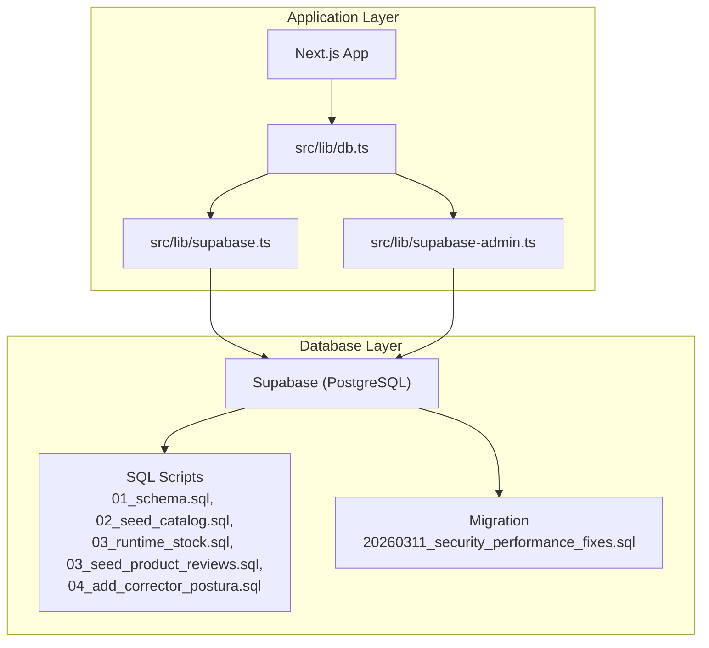
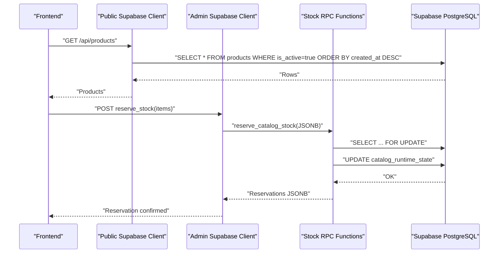
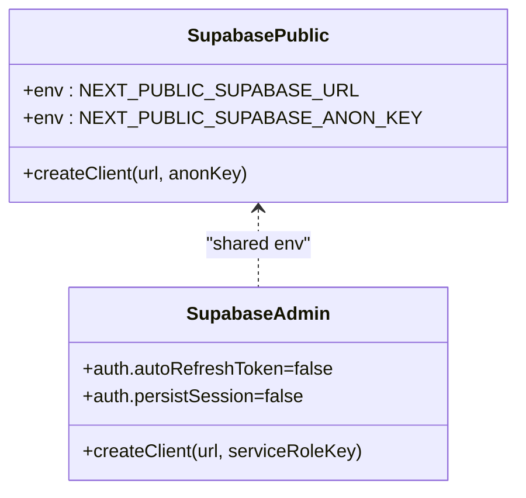
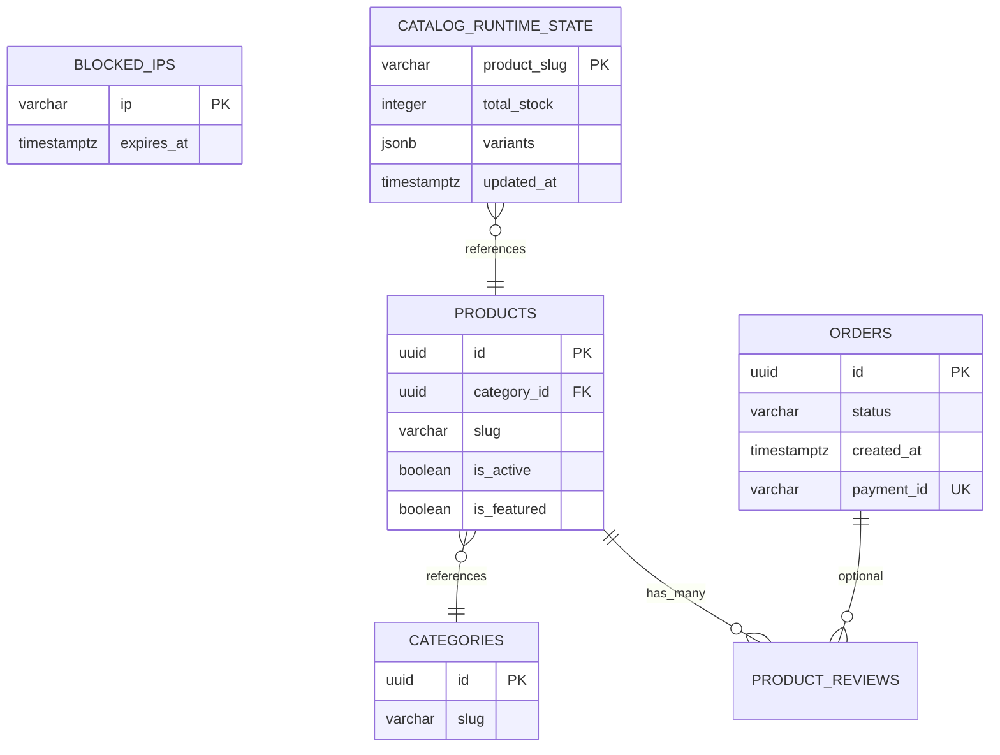
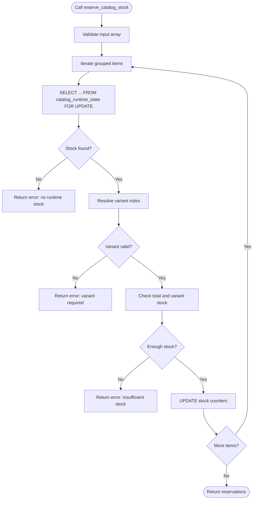
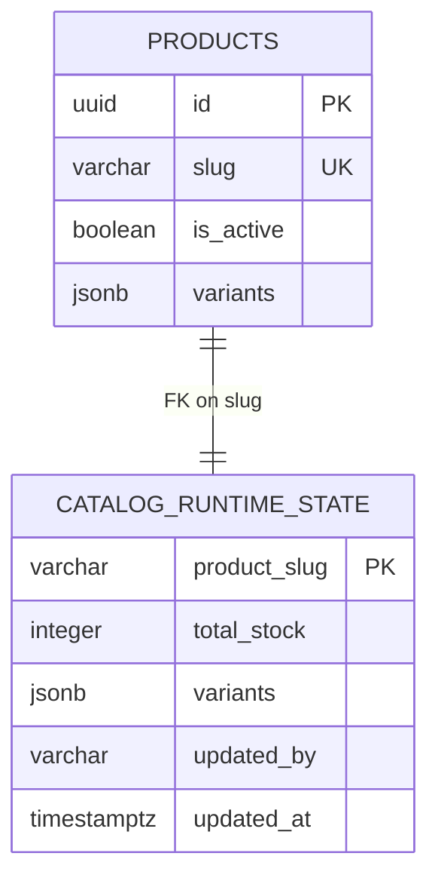
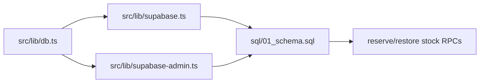

# Database Performance Tuning

<cite>
**Referenced Files in This Document**
- [db.ts](file://src/lib/db.ts)
- [supabase.ts](file://src/lib/supabase.ts)
- [supabase-admin.ts](file://src/lib/supabase-admin.ts)
- [01_schema.sql](file://sql/01_schema.sql)
- [02_seed_catalog.sql](file://sql/02_seed_catalog.sql)
- [03_runtime_stock.sql](file://sql/03_runtime_stock.sql)
- [03_seed_product_reviews.sql](file://sql/03_seed_product_reviews.sql)
- [04_add_corrector_postura.sql](file://sql/04_add_corrector_postura.sql)
- [20260311_security_performance_fixes.sql](file://supabase/migrations/20260311_security_performance_fixes.sql)
- [full_database_update.sql](file://full_database_update.sql)
- [supabase_bootstrap.sql](file://supabase_bootstrap.sql)
</cite>

## Table of Contents
1. [Introduction](#introduction)
2. [Project Structure](#project-structure)
3. [Core Components](#core-components)
4. [Architecture Overview](#architecture-overview)
5. [Detailed Component Analysis](#detailed-component-analysis)
6. [Dependency Analysis](#dependency-analysis)
7. [Performance Considerations](#performance-considerations)
8. [Troubleshooting Guide](#troubleshooting-guide)
9. [Conclusion](#conclusion)
10. [Appendices](#appendices)

## Introduction
This document provides a comprehensive guide to database performance optimization for AllShop, focusing on PostgreSQL tuning within a Supabase environment. It covers query optimization techniques, indexing strategies, connection management, Supabase-specific optimizations, stored procedure efficiency, schema design, caching strategies, read replica usage, write optimization, monitoring, and operational maintenance. Practical examples are linked to concrete files and migrations to ensure actionable insights for developers and operators.

## Project Structure
AllShop’s database layer is implemented using Supabase client libraries and a set of SQL scripts that define the schema, seed data, runtime stock state, and performance-focused migrations. The application code interacts with Supabase through typed and untyped clients depending on the use case (public vs admin).

**Diagram sources**
- [db.ts:113-308](file://src/lib/db.ts#L113-L308)
- [supabase.ts:1-20](file://src/lib/supabase.ts#L1-L20)
- [supabase-admin.ts:1-31](file://src/lib/supabase-admin.ts#L1-L31)
- [01_schema.sql:13-160](file://sql/01_schema.sql#L13-L160)
- [20260311_security_performance_fixes.sql:6-86](file://supabase/migrations/20260311_security_performance_fixes.sql#L6-L86)

**Section sources**
- [db.ts:113-308](file://src/lib/db.ts#L113-L308)
- [supabase.ts:1-20](file://src/lib/supabase.ts#L1-L20)
- [supabase-admin.ts:1-31](file://src/lib/supabase-admin.ts#L1-L31)
- [01_schema.sql:13-160](file://sql/01_schema.sql#L13-L160)
- [20260311_security_performance_fixes.sql:6-86](file://supabase/migrations/20260311_security_performance_fixes.sql#L6-L86)

## Core Components
- Public client for frontend-to-backend reads/writes with typed access to core tables.
- Admin client for server-side operations requiring dynamic tables and RPC functions.
- Typed database interface for type-safe access to Supabase tables.
- Stored procedures for stock reservation and restoration with explicit locking and atomic updates.
- Indexes optimized for frequent filters and joins (active products, product slugs, order status, etc.).

Key implementation references:
- Public client initialization and configuration: [supabase.ts:1-20](file://src/lib/supabase.ts#L1-L20)
- Admin client initialization and configuration: [supabase-admin.ts:1-31](file://src/lib/supabase-admin.ts#L1-L31)
- Typed Database generic usage: [supabase.ts](file://src/lib/supabase.ts#L2)
- Public data access functions (categories, products, reviews): [db.ts:113-308](file://src/lib/db.ts#L113-L308)
- Stock reservation and restoration procedures: [01_schema.sql:253-493](file://sql/01_schema.sql#L253-L493)
- Indexes and RLS policies: [01_schema.sql:137-240](file://sql/01_schema.sql#L137-L240)
- Additional indexes and RLS fixes: [20260311_security_performance_fixes.sql:6-86](file://supabase/migrations/20260311_security_performance_fixes.sql#L6-L86)

**Section sources**
- [supabase.ts:1-20](file://src/lib/supabase.ts#L1-L20)
- [supabase-admin.ts:1-31](file://src/lib/supabase-admin.ts#L1-L31)
- [db.ts:113-308](file://src/lib/db.ts#L113-L308)
- [01_schema.sql:137-240](file://sql/01_schema.sql#L137-L240)
- [20260311_security_performance_fixes.sql:6-86](file://supabase/migrations/20260311_security_performance_fixes.sql#L6-L86)

## Architecture Overview
The application uses two Supabase clients:
- Public client for read-heavy storefront operations with typed access to core tables.
- Admin client for server-side tasks (orders, fulfillment logs, dynamic tables, and RPC functions).

Stored procedures encapsulate critical write paths (stock reservation/restore) with explicit locking to prevent race conditions.

**Diagram sources**
- [db.ts:146-181](file://src/lib/db.ts#L146-L181)
- [01_schema.sql:253-404](file://sql/01_schema.sql#L253-L404)
- [supabase-admin.ts:28-31](file://src/lib/supabase-admin.ts#L28-L31)

**Section sources**
- [db.ts:146-181](file://src/lib/db.ts#L146-L181)
- [01_schema.sql:253-404](file://sql/01_schema.sql#L253-L404)
- [supabase-admin.ts:28-31](file://src/lib/supabase-admin.ts#L28-L31)

## Detailed Component Analysis

### Supabase Client Configuration and Connection Management
- Public client uses environment variables for URL and anonymous key, with safe fallbacks to avoid exposing secrets in the browser.
- Admin client uses a service role key for privileged operations and disables auto-refresh to reduce overhead.
- Both clients leverage Supabase’s built-in connection pooling and session management.

**Diagram sources**
- [supabase.ts:1-20](file://src/lib/supabase.ts#L1-L20)
- [supabase-admin.ts:15-31](file://src/lib/supabase-admin.ts#L15-L31)

**Section sources**
- [supabase.ts:1-20](file://src/lib/supabase.ts#L1-L20)
- [supabase-admin.ts:15-31](file://src/lib/supabase-admin.ts#L15-L31)

### Query Optimization and Indexing Strategies
- Compound index on orders for status and created_at improves filtering and sorting of order lists.
- Dedicated indexes on product slug, active flag, and category improve storefront queries.
- Unique index on orders.payment_id prevents duplicate payments.
- Index on blocked_ips.expires_at accelerates cleanup of expired blocks.
- Index on catalog_runtime_state.updated_at supports efficient scans of recent stock changes.

**Diagram sources**
- [01_schema.sql:13-160](file://sql/01_schema.sql#L13-L160)
- [20260311_security_performance_fixes.sql:6-86](file://supabase/migrations/20260311_security_performance_fixes.sql#L6-L86)

**Section sources**
- [01_schema.sql:137-160](file://sql/01_schema.sql#L137-L160)
- [20260311_security_performance_fixes.sql:6-86](file://supabase/migrations/20260311_security_performance_fixes.sql#L6-L86)

### Stored Procedure Efficiency and Transaction Optimization
- reserve_catalog_stock groups items by slug/variant, validates stock availability, and performs atomic updates with row-level locks.
- restore_catalog_stock reverses reservations safely, ensuring consistency after failed transactions.
- Both procedures use explicit FOR UPDATE and JSONB manipulation to minimize contention and maximize throughput.

**Diagram sources**
- [01_schema.sql:253-404](file://sql/01_schema.sql#L253-L404)

**Section sources**
- [01_schema.sql:253-404](file://sql/01_schema.sql#L253-L404)

### Database Schema Design for Optimal Performance
- Separate runtime stock table decouples inventory from product metadata, enabling targeted updates and reduced lock contention.
- JSONB variants support flexible variant definitions without schema churn.
- Triggers automatically maintain updated_at timestamps for auditability and performance-friendly ordering.
- Row Level Security policies restrict client access to public data, keeping sensitive tables invisible to end-users.

**Diagram sources**
- [01_schema.sql:24-45](file://sql/01_schema.sql#L24-L45)
- [01_schema.sql:105-111](file://sql/01_schema.sql#L105-L111)

**Section sources**
- [01_schema.sql:24-45](file://sql/01_schema.sql#L24-L45)
- [01_schema.sql:105-111](file://sql/01_schema.sql#L105-L111)

### Caching Strategies for Database Queries
- Application-level deduplication and normalization reduce redundant fetches and ensures consistent slugs.
- Use selective column projections (e.g., slug-only queries) to minimize payload sizes.
- Consider short-lived cache layers for frequently accessed storefront data (categories, featured products) to reduce database load.

Implementation references:
- Slug normalization and deduplication: [db.ts:80-107](file://src/lib/db.ts#L80-L107)
- Slug-only retrieval for product lists: [db.ts:250-274](file://src/lib/db.ts#L250-L274)

**Section sources**
- [db.ts:80-107](file://src/lib/db.ts#L80-L107)
- [db.ts:250-274](file://src/lib/db.ts#L250-L274)

### Read Replica Usage
- Current schema and client usage do not explicitly configure read replicas.
- Recommendation: Offload read-heavy queries (e.g., product listings, category browsing) to a read replica to reduce primary load. Ensure eventual consistency and handle stale reads carefully for checkout paths.

[No sources needed since this section provides general guidance]

### Write Optimization Techniques
- Batch stock updates via stored procedures to minimize round-trips.
- Use FOR UPDATE to serialize conflicting reservations.
- Keep JSONB structures compact and indexed where needed (variants, audit logs).

References:
- Stock reservation/restore procedures: [01_schema.sql:253-493](file://sql/01_schema.sql#L253-L493)

**Section sources**
- [01_schema.sql:253-493](file://sql/01_schema.sql#L253-L493)

### Practical Examples

#### Example: Optimizing Product Lookup by Slug
- Use the slug index and slug-normalization logic to ensure fast lookups and avoid duplicates.
- Reference: [db.ts:183-224](file://src/lib/db.ts#L183-L224), [01_schema.sql:139-142](file://sql/01_schema.sql#L139-L142)

#### Example: Filtering Active Products Efficiently
- Use the active flag index to quickly filter visible products.
- Reference: [db.ts:146-181](file://src/lib/db.ts#L146-L181), [01_schema.sql:141-142](file://sql/01_schema.sql#L141-L142)

#### Example: Monitoring Order Status
- Use the compound index on orders(status, created_at) for efficient order listing and analytics.
- Reference: [20260311_security_performance_fixes.sql:7-8](file://supabase/migrations/20260311_security_performance_fixes.sql#L7-L8)

**Section sources**
- [db.ts:146-181](file://src/lib/db.ts#L146-L181)
- [db.ts:183-224](file://src/lib/db.ts#L183-L224)
- [01_schema.sql:139-142](file://sql/01_schema.sql#L139-L142)
- [20260311_security_performance_fixes.sql:7-8](file://supabase/migrations/20260311_security_performance_fixes.sql#L7-L8)

## Dependency Analysis
- Public data access functions depend on the public Supabase client and typed database interface.
- Admin operations depend on the admin client and untyped Supabase client for dynamic tables and RPCs.
- Stored procedures depend on the catalog_runtime_state table and enforce referential integrity via foreign keys.

**Diagram sources**
- [db.ts:1-309](file://src/lib/db.ts#L1-L309)
- [supabase.ts:1-20](file://src/lib/supabase.ts#L1-L20)
- [supabase-admin.ts:1-31](file://src/lib/supabase-admin.ts#L1-L31)
- [01_schema.sql:253-493](file://sql/01_schema.sql#L253-L493)

**Section sources**
- [db.ts:1-309](file://src/lib/db.ts#L1-L309)
- [supabase.ts:1-20](file://src/lib/supabase.ts#L1-L20)
- [supabase-admin.ts:1-31](file://src/lib/supabase-admin.ts#L1-L31)
- [01_schema.sql:253-493](file://sql/01_schema.sql#L253-L493)

## Performance Considerations
- Connection pooling: Supabase manages connections; avoid creating multiple clients unnecessarily. Prefer a single public and admin client per process.
- Query patterns: Favor selective projections, appropriate indexes, and filtered scans. Use LIMIT for paginated lists.
- Transactions: Keep stored procedure transactions short; release locks promptly after updates.
- Monitoring: Track slow queries and long-running transactions using Supabase’s logging and metrics dashboards.

[No sources needed since this section provides general guidance]

## Troubleshooting Guide
Common issues and remedies:
- Slow queries
  - Verify indexes exist for filters (e.g., product slug, active flag, order status).
  - Use EXPLAIN/EXPLAIN ANALYZE to inspect query plans.
  - References: [01_schema.sql:137-160](file://sql/01_schema.sql#L137-L160), [20260311_security_performance_fixes.sql:6-86](file://supabase/migrations/20260311_security_performance_fixes.sql#L6-L86)

- Connection timeouts
  - Ensure clients are configured with appropriate timeouts and retry logic.
  - Avoid long-lived sessions; rely on Supabase’s managed sessions.
  - References: [supabase.ts:1-20](file://src/lib/supabase.ts#L1-L20), [supabase-admin.ts:28-31](file://src/lib/supabase-admin.ts#L28-L31)

- Memory usage optimization
  - Limit result sets with LIMIT and OFFSET.
  - Use slug-only queries for bulk operations.
  - References: [db.ts:250-274](file://src/lib/db.ts#L250-L274)

- Race conditions during checkout
  - Use stored procedures with FOR UPDATE to serialize stock reservations.
  - References: [01_schema.sql:253-404](file://sql/01_schema.sql#L253-L404)

**Section sources**
- [01_schema.sql:137-160](file://sql/01_schema.sql#L137-L160)
- [20260311_security_performance_fixes.sql:6-86](file://supabase/migrations/20260311_security_performance_fixes.sql#L6-L86)
- [supabase.ts:1-20](file://src/lib/supabase.ts#L1-L20)
- [supabase-admin.ts:28-31](file://src/lib/supabase-admin.ts#L28-L31)
- [db.ts:250-274](file://src/lib/db.ts#L250-L274)
- [01_schema.sql:253-404](file://sql/01_schema.sql#L253-L404)

## Conclusion
AllShop’s database design leverages Supabase’s managed PostgreSQL with strategic indexes, RLS policies, and stored procedures to achieve strong performance for both read-heavy storefront operations and critical write paths like stock reservation. By aligning application query patterns with schema indexes, using the admin client for privileged operations, and applying the recommended optimization techniques, teams can maintain low-latency responses and scalable performance under load.

[No sources needed since this section summarizes without analyzing specific files]

## Appendices

### Appendix A: Database Maintenance and Backup Strategies
- Regular backups: Use Supabase’s automated backup retention policies.
- Index rebuilds: Periodically analyze fragmentation and rebuild heavy indexes if necessary.
- Audit logs: Monitor catalog_runtime_state changes via catalog_audit_logs for compliance and troubleshooting.
- References: [01_schema.sql:113-122](file://sql/01_schema.sql#L113-L122)

**Section sources**
- [01_schema.sql:113-122](file://sql/01_schema.sql#L113-L122)

### Appendix B: Supabase-Specific Optimizations Checklist
- Enable RLS on sensitive tables and deny client access to admin-only tables.
- Use service role key for server-side operations.
- Keep stored procedures minimal and transactional.
- References: [supabase-admin.ts:15-31](file://src/lib/supabase-admin.ts#L15-L31), [01_schema.sql:194-240](file://sql/01_schema.sql#L194-L240)

**Section sources**
- [supabase-admin.ts:15-31](file://src/lib/supabase-admin.ts#L15-L31)
- [01_schema.sql:194-240](file://sql/01_schema.sql#L194-L240)