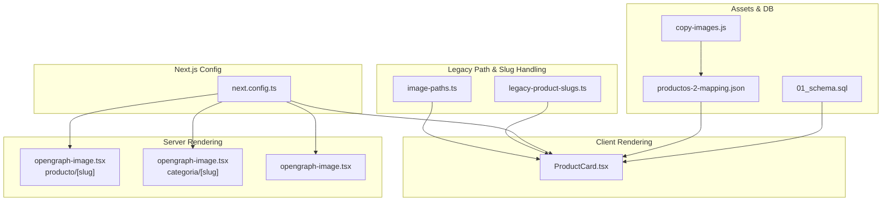
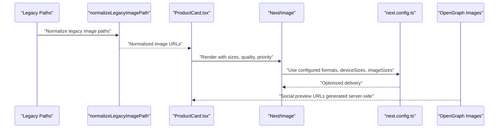
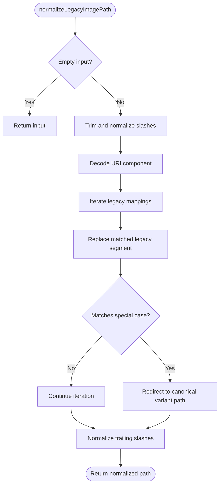
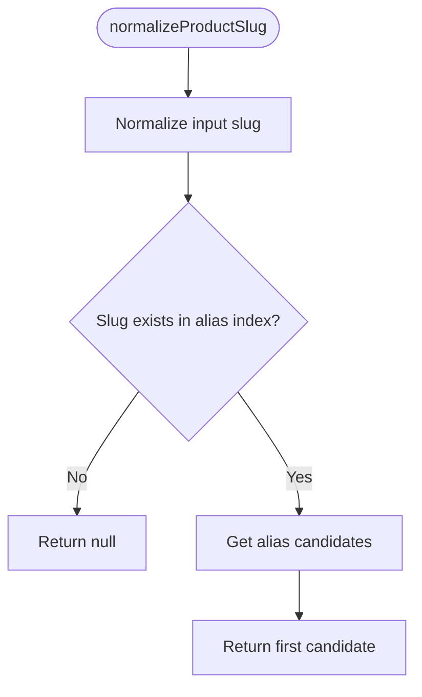
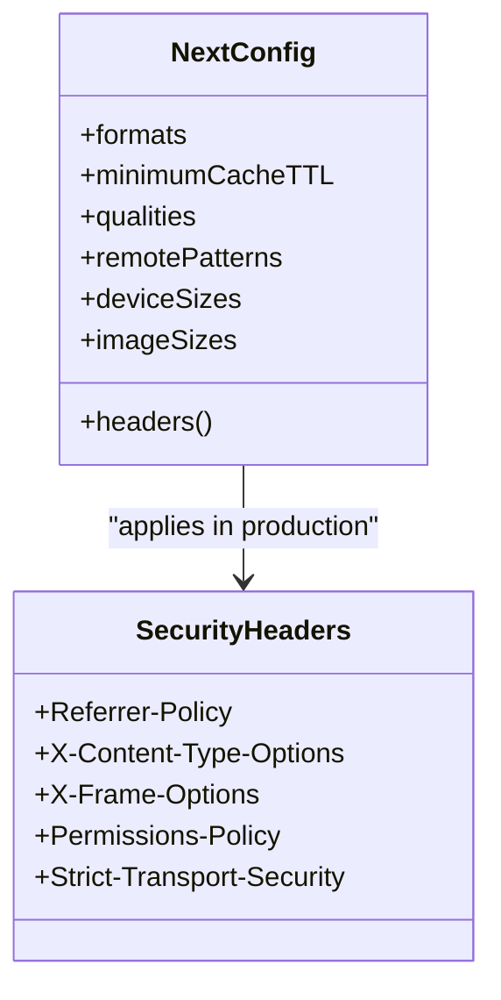
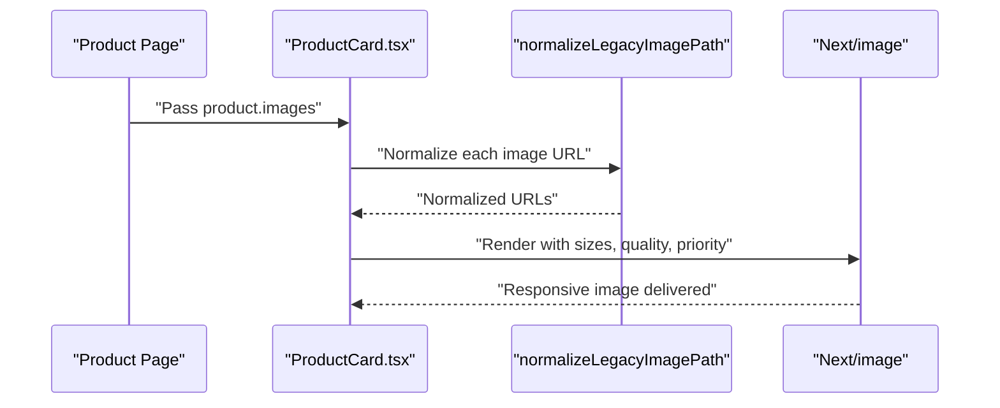
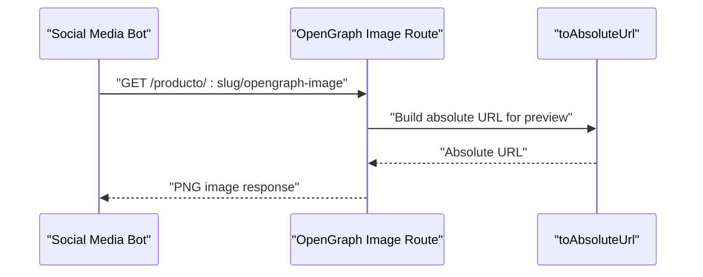
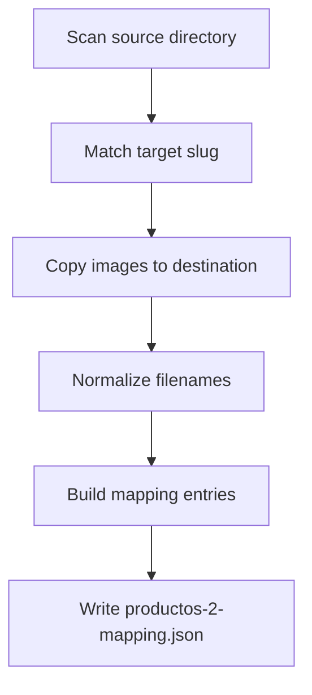
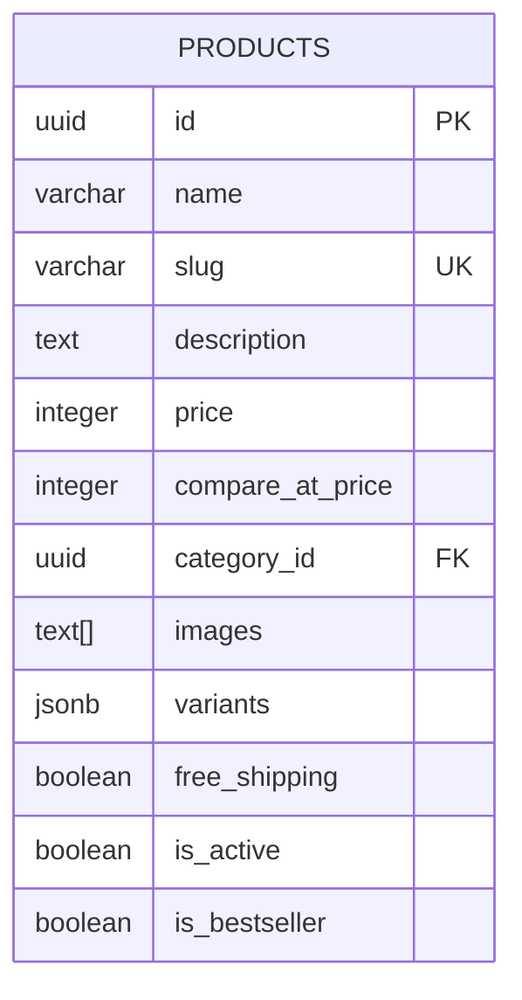
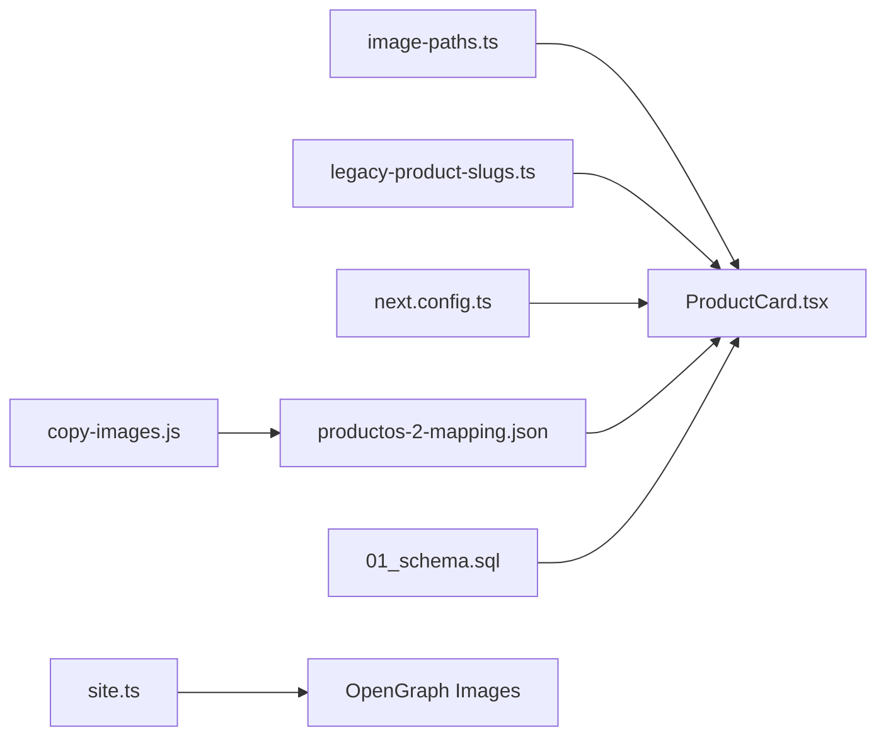

# Image Optimization

<cite>
**Referenced Files in This Document**
- [image-paths.ts](file://src/lib/image-paths.ts)
- [legacy-product-slugs.ts](file://src/lib/legacy-product-slugs.ts)
- [next.config.ts](file://next.config.ts)
- [copy-images.js](file://scripts/copy-images.js)
- [productos-2-mapping.json](file://productos-2-mapping.json)
- [ProductCard.tsx](file://src/components/ProductCard.tsx)
- [page.tsx](file://src/app/producto/[slug]/page.tsx)
- [opengraph-image.tsx](file://src/app/opengraph-image.tsx)
- [opengraph-image.tsx](file://src/app/producto/[slug]/opengraph-image.tsx)
- [opengraph-image.tsx](file://src/app/categoria/[slug]/opengraph-image.tsx)
- [site.ts](file://src/lib/site.ts)
- [01_schema.sql](file://sql/01_schema.sql)
- [package.json](file://package.json)
</cite>

## Table of Contents
1. [Introduction](#introduction)
2. [Project Structure](#project-structure)
3. [Core Components](#core-components)
4. [Architecture Overview](#architecture-overview)
5. [Detailed Component Analysis](#detailed-component-analysis)
6. [Dependency Analysis](#dependency-analysis)
7. [Performance Considerations](#performance-considerations)
8. [Troubleshooting Guide](#troubleshooting-guide)
9. [Conclusion](#conclusion)
10. [Appendices](#appendices)

## Introduction
This document explains AllShop’s image optimization techniques, focusing on:
- Legacy image path normalization and backward compatibility
- Image format optimization and delivery via Next.js Image Optimization
- Responsive images and lazy loading
- Compression and caching strategies
- Integration with Vercel’s platform capabilities and performance monitoring
- Practical configuration, measurement, and troubleshooting guidance

It synthesizes the implementation across legacy path mapping, Next.js configuration, client-side rendering, and server-rendered OpenGraph assets.

## Project Structure
AllShop organizes image-related logic across:
- Legacy path normalization and slug aliasing
- Next.js image optimization configuration
- Client-side rendering with Next/image for responsive images and lazy loading
- Server-rendered OpenGraph images for social previews
- Asset ingestion pipeline and mapping

**Diagram sources**
- [image-paths.ts:1-78](file://src/lib/image-paths.ts#L1-L78)
- [legacy-product-slugs.ts:1-69](file://src/lib/legacy-product-slugs.ts#L1-L69)
- [next.config.ts:1-117](file://next.config.ts#L1-L117)
- [ProductCard.tsx:1-305](file://src/components/ProductCard.tsx#L1-L305)
- [opengraph-image.tsx:1-102](file://src/app/opengraph-image.tsx#L1-L102)
- [opengraph-image.tsx:1-89](file://src/app/producto/[slug]/opengraph-image.tsx#L1-L89)
- [opengraph-image.tsx:1-77](file://src/app/categoria/[slug]/opengraph-image.tsx#L1-L77)
- [copy-images.js:1-50](file://scripts/copy-images.js#L1-L50)
- [productos-2-mapping.json:1-73](file://productos-2-mapping.json#L1-L73)
- [01_schema.sql:24-45](file://sql/01_schema.sql#L24-L45)

**Section sources**
- [image-paths.ts:1-78](file://src/lib/image-paths.ts#L1-L78)
- [legacy-product-slugs.ts:1-69](file://src/lib/legacy-product-slugs.ts#L1-L69)
- [next.config.ts:1-117](file://next.config.ts#L1-L117)
- [ProductCard.tsx:1-305](file://src/components/ProductCard.tsx#L1-L305)
- [opengraph-image.tsx:1-102](file://src/app/opengraph-image.tsx#L1-L102)
- [opengraph-image.tsx:1-89](file://src/app/producto/[slug]/opengraph-image.tsx#L1-L89)
- [opengraph-image.tsx:1-77](file://src/app/categoria/[slug]/opengraph-image.tsx#L1-L77)
- [copy-images.js:1-50](file://scripts/copy-images.js#L1-L50)
- [productos-2-mapping.json:1-73](file://productos-2-mapping.json#L1-L73)
- [01_schema.sql:24-45](file://sql/01_schema.sql#L24-L45)

## Core Components
- Legacy image path normalization: Converts legacy folder paths and handles special-case redirects while preserving modern URLs.
- Slug alias resolution: Normalizes product slugs to canonical forms for routing and metadata generation.
- Next.js image optimization: Configures supported formats, cache TTL, device sizes, image sizes, and remote hosts.
- Client-side responsive images: Uses Next/image with sizes and quality attributes for responsive delivery and lazy loading.
- Server-rendered OpenGraph images: Generates branded OG images at Edge runtime for product and category pages.
- Asset ingestion pipeline: Copies legacy assets and generates a mapping for modern consumption.

**Section sources**
- [image-paths.ts:1-78](file://src/lib/image-paths.ts#L1-L78)
- [legacy-product-slugs.ts:1-69](file://src/lib/legacy-product-slugs.ts#L1-L69)
- [next.config.ts:64-74](file://next.config.ts#L64-L74)
- [ProductCard.tsx:139-147](file://src/components/ProductCard.tsx#L139-L147)
- [opengraph-image.tsx:1-102](file://src/app/opengraph-image.tsx#L1-L102)
- [opengraph-image.tsx:1-89](file://src/app/producto/[slug]/opengraph-image.tsx#L1-L89)
- [opengraph-image.tsx:1-77](file://src/app/categoria/[slug]/opengraph-image.tsx#L1-L77)
- [copy-images.js:1-50](file://scripts/copy-images.js#L1-L50)
- [productos-2-mapping.json:1-73](file://productos-2-mapping.json#L1-L73)

## Architecture Overview
The image optimization architecture integrates legacy compatibility with modern delivery:

**Diagram sources**
- [image-paths.ts:40-72](file://src/lib/image-paths.ts#L40-L72)
- [ProductCard.tsx:139-147](file://src/components/ProductCard.tsx#L139-L147)
- [next.config.ts:64-74](file://next.config.ts#L64-L74)
- [opengraph-image.tsx:1-102](file://src/app/opengraph-image.tsx#L1-L102)

## Detailed Component Analysis

### Legacy Image Path Normalization
Purpose:
- Normalize inconsistent legacy paths to modern canonical URLs
- Apply product-specific legacy-to-new folder mappings
- Ensure safe decoding and slash normalization

Key behaviors:
- Trims whitespace, normalizes slashes, and preserves absolute URLs
- Iteratively replaces legacy segments with modern equivalents
- Applies special-case correction for a legacy product variant naming pattern
- Returns normalized paths for downstream consumers

**Diagram sources**
- [image-paths.ts:33-72](file://src/lib/image-paths.ts#L33-L72)

**Section sources**
- [image-paths.ts:1-78](file://src/lib/image-paths.ts#L1-L78)

### Legacy Product Slug Aliasing
Purpose:
- Provide lookup candidates for legacy slugs to resolve to canonical forms
- Maintain backward compatibility for routes and metadata

Key behaviors:
- Builds an index of slug alias groups
- Normalizes input to lowercase and trims whitespace
- Returns the canonical slug as the first candidate

**Diagram sources**
- [legacy-product-slugs.ts:32-68](file://src/lib/legacy-product-slugs.ts#L32-L68)

**Section sources**
- [legacy-product-slugs.ts:1-69](file://src/lib/legacy-product-slugs.ts#L1-L69)

### Next.js Image Optimization Configuration
Purpose:
- Configure supported image formats, cache TTL, device sizes, image sizes, and remote hosts
- Apply security headers and cache-control policies for static and optimized images

Key behaviors:
- Formats: AVIF and WebP for modern browsers
- Minimum cache TTL: ~30 days
- Qualities: 70–90 for adaptive quality
- Remote patterns: Supabase and app base URLs
- Device sizes: 640–1200 for responsive selection
- Image sizes: small thumbnails for fast loading
- Headers: strict caching for static assets and optimized images

**Diagram sources**
- [next.config.ts:64-113](file://next.config.ts#L64-L113)

**Section sources**
- [next.config.ts:1-117](file://next.config.ts#L1-L117)

### Client-Side Responsive Images and Lazy Loading
Purpose:
- Deliver responsive images with appropriate sizes and quality
- Optimize perceived performance with priority and lazy loading

Key behaviors:
- Normalizes product images using legacy path normalization
- Renders images with:
  - sizes for viewport-aware selection
  - priority for above-the-fold items
  - quality for perceptual fidelity
- Supports image rotation for multiple product images

**Diagram sources**
- [page.tsx:104-124](file://src/app/producto/[slug]/page.tsx#L104-L124)
- [ProductCard.tsx:44-47](file://src/components/ProductCard.tsx#L44-L47)
- [ProductCard.tsx:139-147](file://src/components/ProductCard.tsx#L139-L147)
- [image-paths.ts:40-72](file://src/lib/image-paths.ts#L40-L72)

**Section sources**
- [ProductCard.tsx:1-305](file://src/components/ProductCard.tsx#L1-L305)
- [page.tsx:104-124](file://src/app/producto/[slug]/page.tsx#L104-L124)
- [image-paths.ts:40-72](file://src/lib/image-paths.ts#L40-L72)

### Server-Rendered OpenGraph Images
Purpose:
- Generate branded social media previews at Edge runtime
- Maintain consistent branding and performance for product and category pages

Key behaviors:
- Edge runtime for low-latency generation
- Fixed dimensions (1200x630) with PNG content type
- Dynamic title extraction from slug for product OG images
- Absolute URLs generated via site utilities

**Diagram sources**
- [opengraph-image.tsx:1-89](file://src/app/producto/[slug]/opengraph-image.tsx#L1-L89)
- [site.ts:22-25](file://src/lib/site.ts#L22-L25)

**Section sources**
- [opengraph-image.tsx:1-102](file://src/app/opengraph-image.tsx#L1-L102)
- [opengraph-image.tsx:1-89](file://src/app/producto/[slug]/opengraph-image.tsx#L1-L89)
- [opengraph-image.tsx:1-77](file://src/app/categoria/[slug]/opengraph-image.tsx#L1-L77)
- [site.ts:17-25](file://src/lib/site.ts#L17-L25)

### Asset Ingestion Pipeline and Mapping
Purpose:
- Copy legacy images from source directories to modern structure
- Generate a mapping for normalized image URLs and associated texts

Key behaviors:
- Scans source directories and matches target slugs
- Copies images and normalizes filenames
- Writes mapping JSON with image paths and informational texts

**Diagram sources**
- [copy-images.js:8-49](file://scripts/copy-images.js#L8-L49)

**Section sources**
- [copy-images.js:1-50](file://scripts/copy-images.js#L1-L50)
- [productos-2-mapping.json:1-73](file://productos-2-mapping.json#L1-L73)

### Database Schema and Image Storage
Purpose:
- Store product image URLs as an array for efficient retrieval and rendering

Key behaviors:
- products.images column stores text[] of image URLs
- Used by client components to render responsive images

**Diagram sources**
- [01_schema.sql:24-45](file://sql/01_schema.sql#L24-L45)

**Section sources**
- [01_schema.sql:24-45](file://sql/01_schema.sql#L24-L45)

## Dependency Analysis
- Legacy path normalization depends on:
  - Legacy mapping constants
  - URI decoding and normalization utilities
- Client rendering depends on:
  - Normalized image URLs
  - Next.js Image Optimization configuration
- OpenGraph images depend on:
  - Edge runtime
  - Absolute URL generation
- Asset pipeline depends on:
  - Source directory structure
  - Target slug mapping

**Diagram sources**
- [image-paths.ts:1-78](file://src/lib/image-paths.ts#L1-L78)
- [legacy-product-slugs.ts:1-69](file://src/lib/legacy-product-slugs.ts#L1-L69)
- [next.config.ts:1-117](file://next.config.ts#L1-L117)
- [ProductCard.tsx:1-305](file://src/components/ProductCard.tsx#L1-L305)
- [copy-images.js:1-50](file://scripts/copy-images.js#L1-L50)
- [productos-2-mapping.json:1-73](file://productos-2-mapping.json#L1-L73)
- [01_schema.sql:24-45](file://sql/01_schema.sql#L24-L45)
- [site.ts:17-25](file://src/lib/site.ts#L17-L25)

**Section sources**
- [image-paths.ts:1-78](file://src/lib/image-paths.ts#L1-L78)
- [legacy-product-slugs.ts:1-69](file://src/lib/legacy-product-slugs.ts#L1-L69)
- [next.config.ts:1-117](file://next.config.ts#L1-L117)
- [ProductCard.tsx:1-305](file://src/components/ProductCard.tsx#L1-L305)
- [copy-images.js:1-50](file://scripts/copy-images.js#L1-L50)
- [productos-2-mapping.json:1-73](file://productos-2-mapping.json#L1-L73)
- [01_schema.sql:24-45](file://sql/01_schema.sql#L24-L45)
- [site.ts:17-25](file://src/lib/site.ts#L17-L25)

## Performance Considerations
- Format selection: AVIF and WebP reduce bandwidth while maintaining quality for modern browsers.
- Adaptive quality: Quality tiers balance file size and visual fidelity.
- Cache TTL: Long cache TTL minimizes origin requests and leverages CDN caching.
- Responsive sizing: deviceSizes and imageSizes ensure optimal pixel density and reduced over-delivery.
- Priority hints: priority for above-the-fold images improves Core Web Vitals.
- Edge OG generation: Reduces server load and latency for social previews.
- CDN benefits: Next.js Image Optimization and static asset caching improve global delivery.

[No sources needed since this section provides general guidance]

## Troubleshooting Guide
Common issues and resolutions:
- Broken legacy image paths
  - Symptom: 404s for old URLs
  - Resolution: Use legacy path normalization to convert to modern URLs
  - Reference: [image-paths.ts:40-72](file://src/lib/image-paths.ts#L40-L72)
- Incorrect slug routing after migration
  - Symptom: Redirect loops or wrong canonical URL
  - Resolution: Normalize slugs to canonical form
  - Reference: [legacy-product-slugs.ts:52-68](file://src/lib/legacy-product-slugs.ts#L52-L68)
- Missing or misconfigured image optimization
  - Symptom: No responsive images or slow loads
  - Resolution: Verify formats, deviceSizes, imageSizes, and remotePatterns
  - Reference: [next.config.ts:64-74](file://next.config.ts#L64-L74)
- OG image not appearing on social platforms
  - Symptom: Blank or missing preview
  - Resolution: Confirm Edge runtime and absolute URL generation
  - References: [opengraph-image.tsx:1-89](file://src/app/producto/[slug]/opengraph-image.tsx#L1-L89), [site.ts:22-25](file://src/lib/site.ts#L22-L25)
- Assets not copied or mapped
  - Symptom: Missing images in UI
  - Resolution: Run ingestion script and check mapping JSON
  - References: [copy-images.js:1-50](file://scripts/copy-images.js#L1-L50), [productos-2-mapping.json:1-73](file://productos-2-mapping.json#L1-L73)

**Section sources**
- [image-paths.ts:40-72](file://src/lib/image-paths.ts#L40-L72)
- [legacy-product-slugs.ts:52-68](file://src/lib/legacy-product-slugs.ts#L52-L68)
- [next.config.ts:64-74](file://next.config.ts#L64-L74)
- [opengraph-image.tsx:1-89](file://src/app/producto/[slug]/opengraph-image.tsx#L1-L89)
- [site.ts:22-25](file://src/lib/site.ts#L22-L25)
- [copy-images.js:1-50](file://scripts/copy-images.js#L1-L50)
- [productos-2-mapping.json:1-73](file://productos-2-mapping.json#L1-L73)

## Conclusion
AllShop’s image optimization strategy blends legacy compatibility with modern delivery:
- Legacy path normalization ensures backward compatibility for migrated assets
- Next.js Image Optimization configures formats, caching, and responsive sizing
- Client-side rendering with Next/image enables responsive images and lazy loading
- Server-rendered OpenGraph images deliver consistent social previews
- Asset ingestion pipeline and mapping streamline modern asset consumption

Together, these components reduce bandwidth, improve perceived performance, and maintain reliability across devices and networks.

[No sources needed since this section summarizes without analyzing specific files]

## Appendices

### Practical Configuration Examples
- Next.js image optimization settings
  - Formats: AVIF and WebP
  - Device sizes: 640, 750, 828, 1080, 1200
  - Image sizes: 16–256
  - Minimum cache TTL: ~30 days
  - Remote hosts: Supabase and app base URL
  - References: [next.config.ts:64-74](file://next.config.ts#L64-L74)
- Client-side rendering with Next/image
  - sizes: viewport-aware selection
  - quality: 80
  - priority: for above-the-fold items
  - References: [ProductCard.tsx:139-147](file://src/components/ProductCard.tsx#L139-L147)
- OpenGraph image generation
  - Runtime: Edge
  - Dimensions: 1200x630
  - Content type: PNG
  - References: [opengraph-image.tsx:1-102](file://src/app/opengraph-image.tsx#L1-L102)

**Section sources**
- [next.config.ts:64-74](file://next.config.ts#L64-L74)
- [ProductCard.tsx:139-147](file://src/components/ProductCard.tsx#L139-L147)
- [opengraph-image.tsx:1-102](file://src/app/opengraph-image.tsx#L1-L102)

### Performance Measurement and Monitoring
- Vercel Analytics and Speed Insights
  - Dependencies included for analytics and performance monitoring
  - Reference: [package.json:14-15](file://package.json#L14-L15)

**Section sources**
- [package.json:14-15](file://package.json#L14-L15)