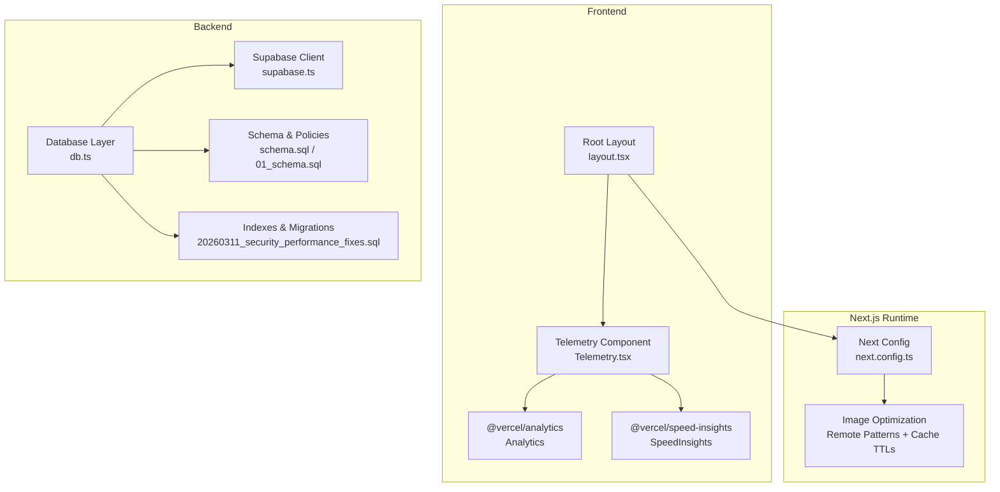
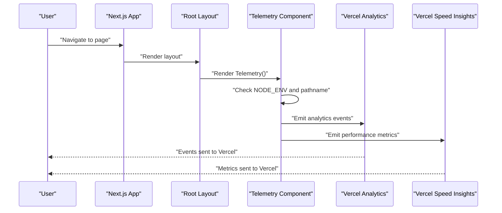
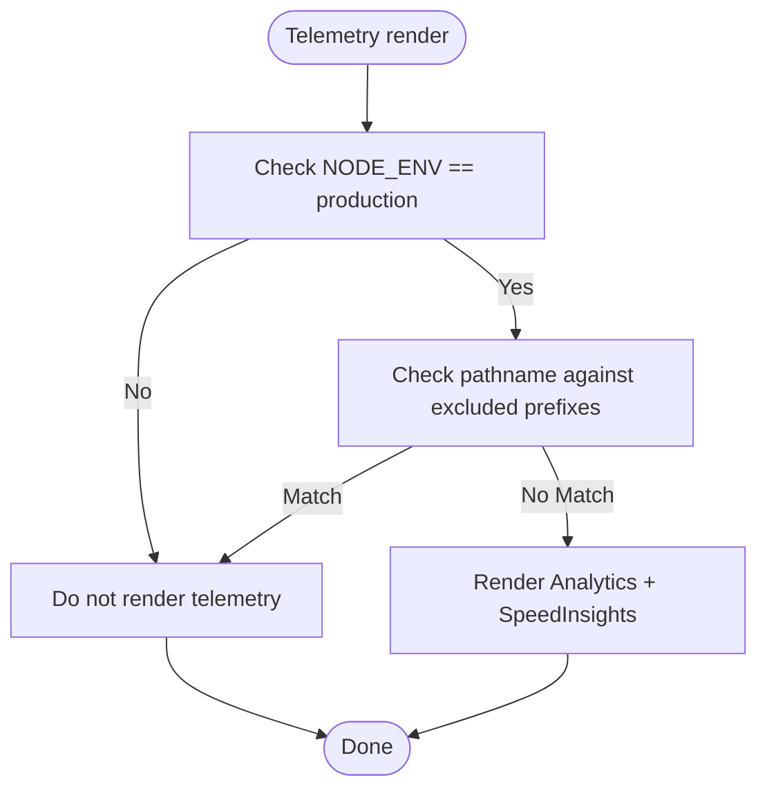
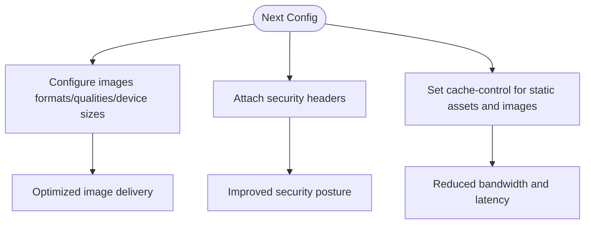
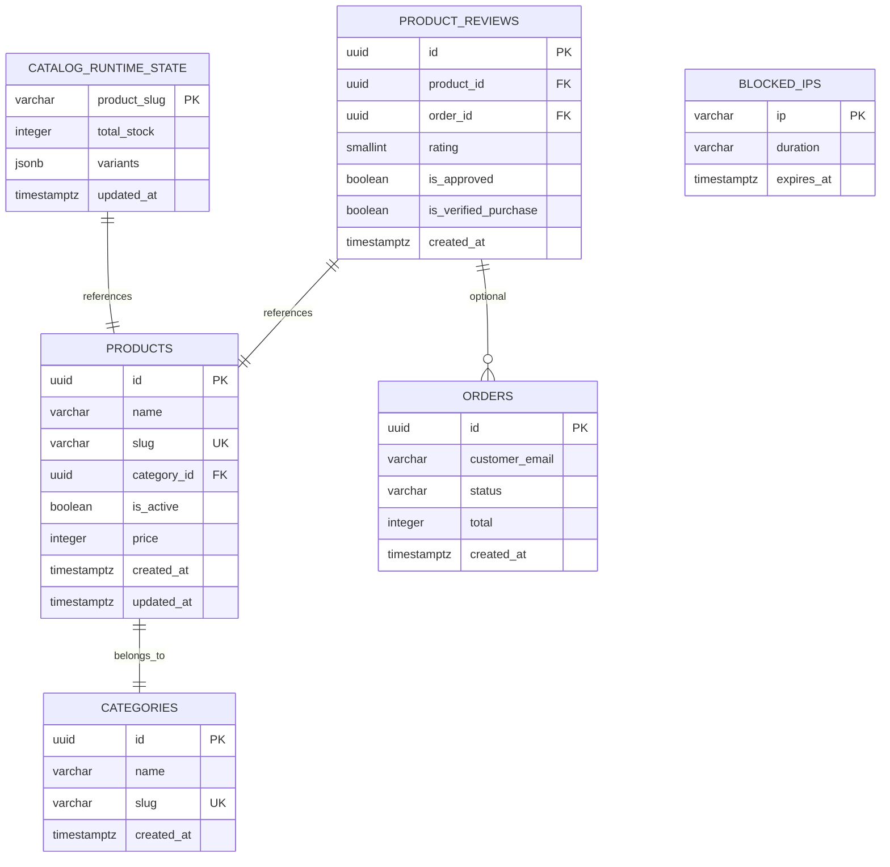
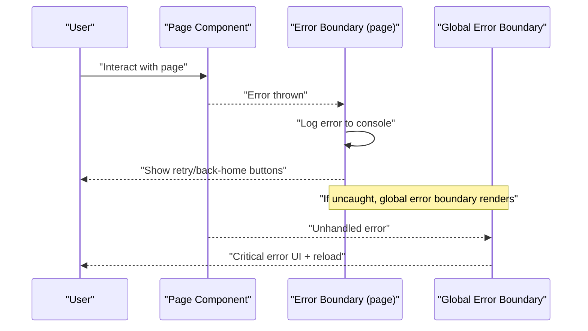
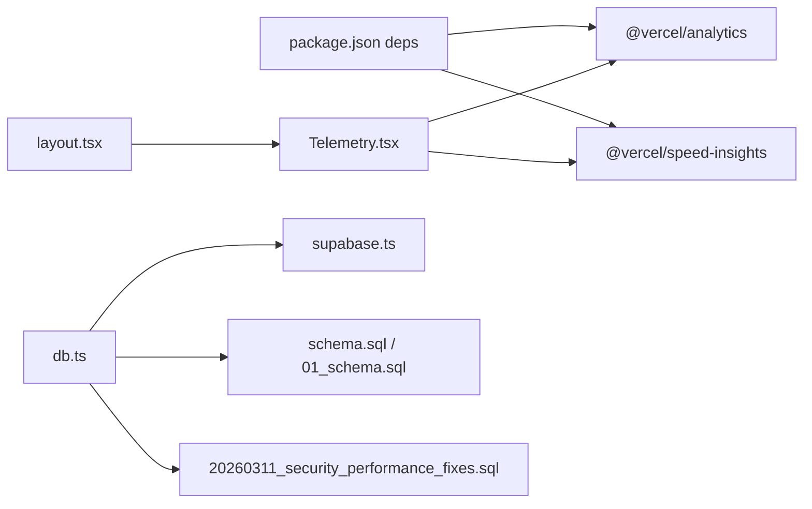

# Monitoring and Analytics

<cite>
**Referenced Files in This Document**
- [Telemetry.tsx](file://src/components/Telemetry.tsx)
- [layout.tsx](file://src/app/layout.tsx)
- [db.ts](file://src/lib/db.ts)
- [supabase.ts](file://src/lib/supabase.ts)
- [schema.sql](file://schema.sql)
- [01_schema.sql](file://sql/01_schema.sql)
- [20260311_security_performance_fixes.sql](file://supabase/migrations/20260311_security_performance_fixes.sql)
- [next.config.ts](file://next.config.ts)
- [package.json](file://package.json)
- [error.tsx](file://src/app/error.tsx)
- [global-error.tsx](file://src/app/global-error.tsx)
</cite>

## Table of Contents
1. [Introduction](#introduction)
2. [Project Structure](#project-structure)
3. [Core Components](#core-components)
4. [Architecture Overview](#architecture-overview)
5. [Detailed Component Analysis](#detailed-component-analysis)
6. [Dependency Analysis](#dependency-analysis)
7. [Performance Considerations](#performance-considerations)
8. [Troubleshooting Guide](#troubleshooting-guide)
9. [Conclusion](#conclusion)
10. [Appendices](#appendices)

## Introduction
This document explains how AllShop monitors and analyzes performance using Vercel Analytics and Speed Insights for frontend telemetry, along with database-level indexing and Row Level Security (RLS) policies to improve backend responsiveness. It also outlines strategies for tracking page load times, server response times, database query performance, error tracking, user behavior analytics, and alerting. Guidance is provided for integrating external monitoring tools, building custom dashboards, and automating performance tests. Practical examples demonstrate configuration, analysis workflows, and troubleshooting using existing telemetry and database infrastructure.

## Project Structure
AllShop integrates monitoring at three layers:
- Frontend telemetry via Vercel Analytics and Speed Insights, controlled by a dedicated client component.
- Next.js configuration for caching, image optimization, and security headers to influence performance characteristics.
- Supabase database schema and migrations that define indexes and policies impacting query performance and data access.

**Diagram sources**
- [layout.tsx:112-202](file://src/app/layout.tsx#L112-L202)
- [Telemetry.tsx:1-27](file://src/components/Telemetry.tsx#L1-L27)
- [next.config.ts:53-117](file://next.config.ts#L53-L117)
- [db.ts:1-309](file://src/lib/db.ts#L1-L309)
- [supabase.ts:1-20](file://src/lib/supabase.ts#L1-L20)
- [schema.sql:131-230](file://schema.sql#L131-L230)
- [01_schema.sql:137-160](file://sql/01_schema.sql#L137-L160)
- [20260311_security_performance_fixes.sql:6-76](file://supabase/migrations/20260311_security_performance_fixes.sql#L6-L76)

**Section sources**
- [layout.tsx:112-202](file://src/app/layout.tsx#L112-L202)
- [Telemetry.tsx:1-27](file://src/components/Telemetry.tsx#L1-L27)
- [next.config.ts:53-117](file://next.config.ts#L53-L117)
- [db.ts:1-309](file://src/lib/db.ts#L1-L309)
- [supabase.ts:1-20](file://src/lib/supabase.ts#L1-L20)
- [schema.sql:131-230](file://schema.sql#L131-L230)
- [01_schema.sql:137-160](file://sql/01_schema.sql#L137-L160)
- [20260311_security_performance_fixes.sql:6-76](file://supabase/migrations/20260311_security_performance_fixes.sql#L6-L76)

## Core Components
- Vercel Analytics and Speed Insights integration:
  - Implemented in a client component that renders Analytics and SpeedInsights only in production and excludes specific routes.
  - Integrated into the root layout to ensure telemetry is present on all public pages.
- Next.js configuration:
  - Image optimization settings and cache-control headers designed to reduce bandwidth and latency.
  - Security headers to improve trust and reduce risk-related delays.
- Database layer and schema:
  - Supabase client initialization with guarded credentials.
  - Database schema with indexes and RLS policies to accelerate queries and secure data access.
  - Dedicated migrations for performance-focused indexes and auxiliary tables (blocked IPs, rate limits).

**Section sources**
- [Telemetry.tsx:1-27](file://src/components/Telemetry.tsx#L1-L27)
- [layout.tsx:194-194](file://src/app/layout.tsx#L194-L194)
- [next.config.ts:53-117](file://next.config.ts#L53-L117)
- [supabase.ts:1-20](file://src/lib/supabase.ts#L1-L20)
- [schema.sql:131-230](file://schema.sql#L131-L230)
- [01_schema.sql:137-160](file://sql/01_schema.sql#L137-L160)
- [20260311_security_performance_fixes.sql:6-76](file://supabase/migrations/20260311_security_performance_fixes.sql#L6-L76)

## Architecture Overview
The monitoring architecture combines client-side telemetry, server-side database performance controls, and Next.js runtime optimizations.

**Diagram sources**
- [layout.tsx:112-202](file://src/app/layout.tsx#L112-L202)
- [Telemetry.tsx:9-26](file://src/components/Telemetry.tsx#L9-L26)

## Detailed Component Analysis

### Vercel Analytics and Speed Insights Integration
- Purpose:
  - Track page views, navigation, and performance metrics (e.g., Largest Contentful Paint, Cumulative Layout Shift) via Speed Insights.
- Implementation:
  - Client component checks production environment and pathname prefixes to exclude admin and blocked routes.
  - Renders Analytics and SpeedInsights components conditionally.
- Placement:
  - Rendered in the root layout to ensure telemetry coverage across public pages.

**Diagram sources**
- [Telemetry.tsx:9-26](file://src/components/Telemetry.tsx#L9-L26)

**Section sources**
- [Telemetry.tsx:1-27](file://src/components/Telemetry.tsx#L1-L27)
- [layout.tsx:194-194](file://src/app/layout.tsx#L194-L194)

### Next.js Performance Configuration
- Image optimization:
  - Formats, qualities, device sizes, and image sizes configured for efficient delivery.
  - Remote patterns include Supabase and app URLs to enable optimized remote images.
- Cache-control headers:
  - Static assets and images served with long-lived caches to reduce repeat loads.
- Security headers:
  - Strict Transport Security, Referrer-Policy, X-Content-Type-Options, X-Frame-Options, Permissions-Policy enhance security posture and reduce risky redirects.

**Diagram sources**
- [next.config.ts:53-117](file://next.config.ts#L53-L117)

**Section sources**
- [next.config.ts:53-117](file://next.config.ts#L53-L117)

### Database Layer and Performance Controls
- Supabase client:
  - Initializes with environment variables and guards against placeholder values.
- Schema and indexes:
  - Indexes on product slugs, active products, product reviews, orders, categories, and runtime stock improve query performance.
  - RLS policies restrict client access to sensitive tables while allowing read-only access to public data.
- Migrations:
  - Additional indexes for orders and runtime state, plus auxiliary tables for IP blocking and rate limiting to improve operational performance and security.

**Diagram sources**
- [schema.sql:11-230](file://schema.sql#L11-L230)
- [01_schema.sql:13-122](file://sql/01_schema.sql#L13-L122)
- [20260311_security_performance_fixes.sql:22-46](file://supabase/migrations/20260311_security_performance_fixes.sql#L22-L46)

**Section sources**
- [supabase.ts:1-20](file://src/lib/supabase.ts#L1-L20)
- [schema.sql:131-230](file://schema.sql#L131-L230)
- [01_schema.sql:137-160](file://sql/01_schema.sql#L137-L160)
- [20260311_security_performance_fixes.sql:6-76](file://supabase/migrations/20260311_security_performance_fixes.sql#L6-L76)

### Error Tracking and User Experience Signals
- Client error boundaries:
  - Page-level error boundary logs runtime errors to the console and offers retry/reset actions.
  - Global error boundary displays a friendly message and a reload button, optionally showing a digest for debugging.
- Integration opportunity:
  - Capture error digests and send them to an external error tracking service (e.g., Sentry) by extending the error boundary handlers.

**Diagram sources**
- [error.tsx:9-57](file://src/app/error.tsx#L9-L57)
- [global-error.tsx:5-56](file://src/app/global-error.tsx#L5-L56)

**Section sources**
- [error.tsx:9-57](file://src/app/error.tsx#L9-L57)
- [global-error.tsx:5-56](file://src/app/global-error.tsx#L5-L56)

## Dependency Analysis
- Telemetry depends on:
  - Environment detection and pathname checks to decide whether to render.
  - Vercel packages (@vercel/analytics, @vercel/speed-insights) installed in the project.
- Next.js configuration affects:
  - Image optimization pipeline and caching behavior, indirectly influencing page load performance.
- Database layer depends on:
  - Supabase client initialization and schema/index availability to serve queries efficiently.

**Diagram sources**
- [package.json:12-26](file://package.json#L12-L26)
- [layout.tsx:194-194](file://src/app/layout.tsx#L194-L194)
- [Telemetry.tsx:4-5](file://src/components/Telemetry.tsx#L4-L5)
- [db.ts:1-309](file://src/lib/db.ts#L1-L309)
- [supabase.ts:1-20](file://src/lib/supabase.ts#L1-L20)
- [schema.sql:131-230](file://schema.sql#L131-L230)
- [01_schema.sql:137-160](file://sql/01_schema.sql#L137-L160)
- [20260311_security_performance_fixes.sql:6-76](file://supabase/migrations/20260311_security_performance_fixes.sql#L6-L76)

**Section sources**
- [package.json:12-26](file://package.json#L12-L26)
- [layout.tsx:194-194](file://src/app/layout.tsx#L194-L194)
- [Telemetry.tsx:4-5](file://src/components/Telemetry.tsx#L4-L5)
- [db.ts:1-309](file://src/lib/db.ts#L1-L309)
- [supabase.ts:1-20](file://src/lib/supabase.ts#L1-L20)
- [schema.sql:131-230](file://schema.sql#L131-L230)
- [01_schema.sql:137-160](file://sql/01_schema.sql#L137-L160)
- [20260311_security_performance_fixes.sql:6-76](file://supabase/migrations/20260311_security_performance_fixes.sql#L6-L76)

## Performance Considerations
- Page load times:
  - Enable image optimization and leverage cache-control headers to minimize round trips.
  - Use Speed Insights to monitor Core Web Vitals and identify slow pages.
- Server response times:
  - Ensure database queries utilize indexes (e.g., product slug, active products, product reviews).
  - Keep Supabase connection strings secure and avoid exposing development keys in production.
- Database query performance:
  - Use indexed columns for filtering and sorting (orders by status, created_at; products by slug, is_active).
  - Apply RLS policies judiciously; they add overhead but protect data—ensure they align with access patterns.
- Error tracking:
  - Capture error digests and surface them in a dashboard for trending issues.
- User behavior analytics:
  - Use Analytics to track page views and navigation flows; combine with Speed Insights metrics for UX insights.
- Alerting:
  - Configure alerts for increased error rates, degraded CLS/LCP, or database query timeouts.

[No sources needed since this section provides general guidance]

## Troubleshooting Guide
- Telemetry not reporting:
  - Verify production environment and that pathname is not excluded by the Telemetry component’s prefix list.
  - Confirm Vercel Analytics and Speed Insights are installed and imported.
- Slow page loads:
  - Review Next.js image optimization settings and cache headers.
  - Use Speed Insights to identify heavy resources and long tasks.
- Database query slowness:
  - Check for missing indexes on frequently filtered/sorted columns.
  - Validate RLS policies are not overly restrictive for legitimate reads.
- Frequent errors:
  - Inspect page-level and global error boundaries for recurring digests.
  - Integrate external error tracking to correlate errors with user sessions and paths.

**Section sources**
- [Telemetry.tsx:12-18](file://src/components/Telemetry.tsx#L12-L18)
- [next.config.ts:64-113](file://next.config.ts#L64-L113)
- [schema.sql:135-154](file://schema.sql#L135-L154)
- [error.tsx:18-20](file://src/app/error.tsx#L18-L20)
- [global-error.tsx:43-49](file://src/app/global-error.tsx#L43-L49)

## Conclusion
AllShop integrates Vercel Analytics and Speed Insights for frontend telemetry, Next.js optimizations for image delivery and caching, and a robust database schema with indexes and RLS policies to improve backend performance. By leveraging these components, teams can track page load times, server response times, and database query performance, while also capturing errors and user behavior signals. Extending this foundation with external monitoring tools, custom dashboards, and automated performance tests enables proactive identification and resolution of bottlenecks and maintains strong user experience metrics.

[No sources needed since this section summarizes without analyzing specific files]

## Appendices
- Monitoring configuration checklist:
  - Confirm production-only telemetry rendering.
  - Validate image optimization and cache headers.
  - Ensure database indexes exist for hot paths.
  - Verify Supabase credentials are properly configured.
  - Set up error boundary logging and optional external error tracking.
- Performance analysis workflow:
  - Use Speed Insights to identify problematic pages and metrics.
  - Cross-reference with database query plans and index usage.
  - Monitor error trends and user session correlation.
- Automated performance testing:
  - Run Lighthouse or similar audits in CI.
  - Track regressions in Core Web Vitals and server response times.

[No sources needed since this section provides general guidance]