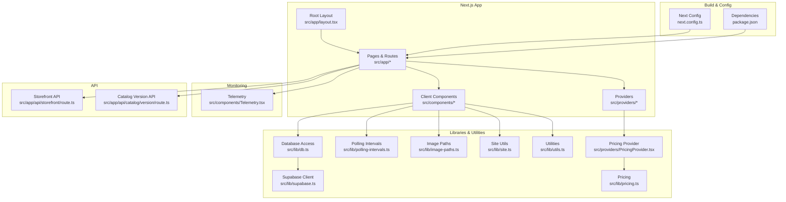
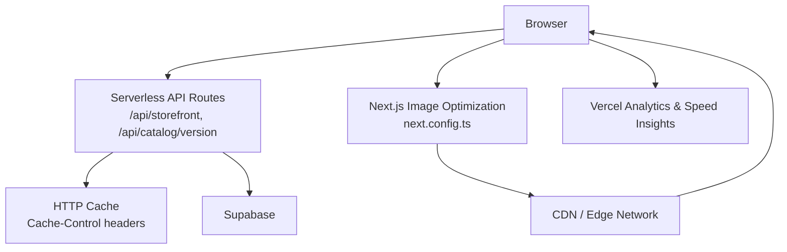
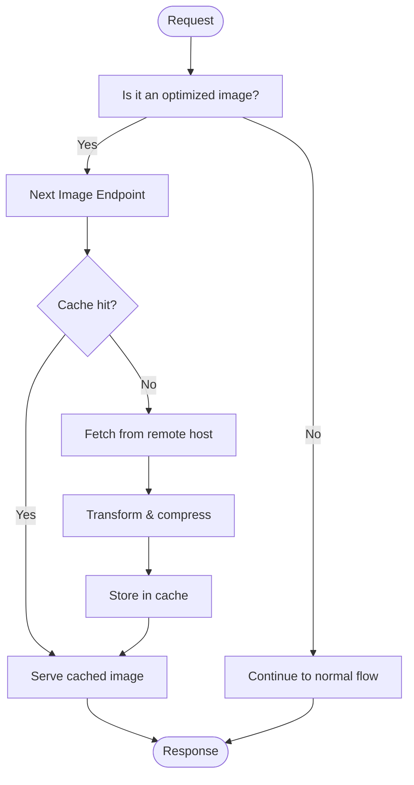
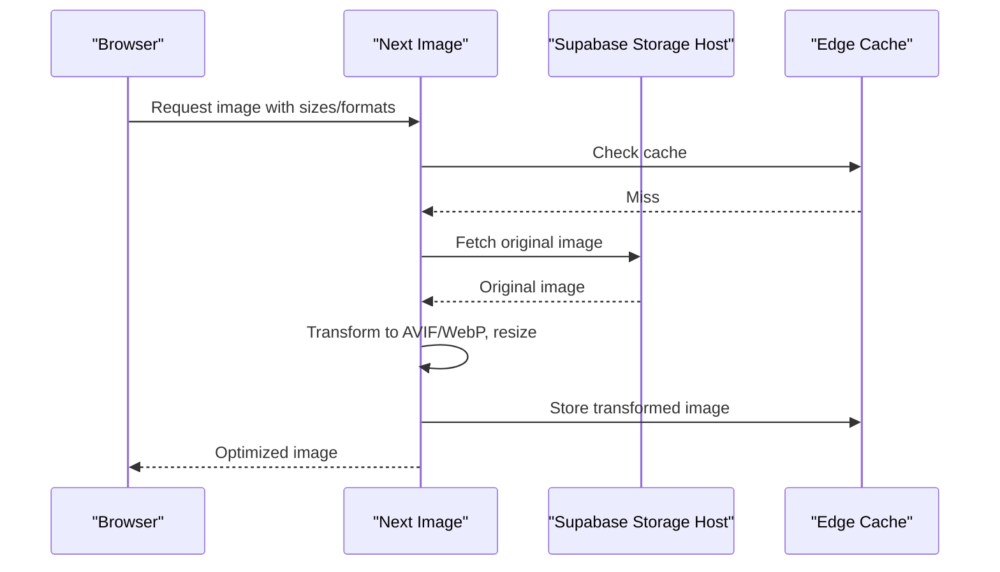
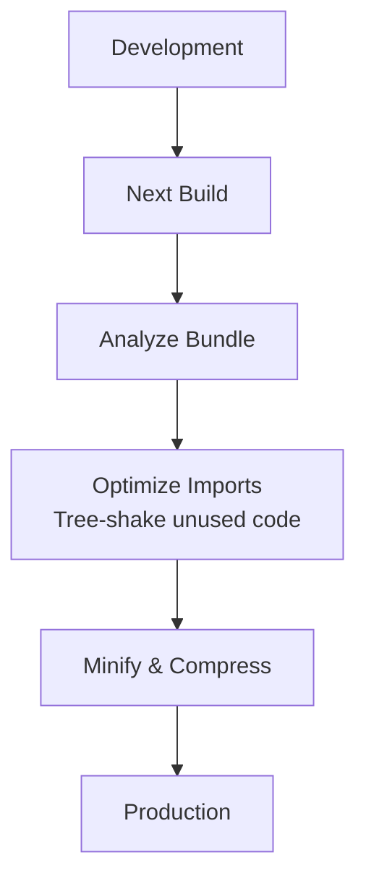
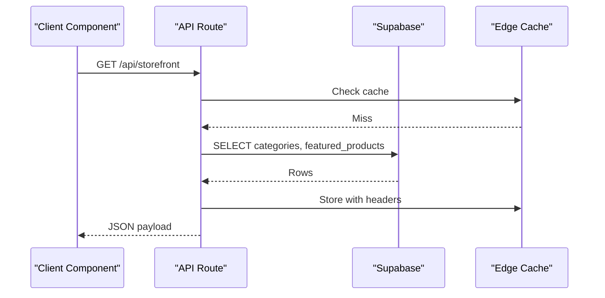
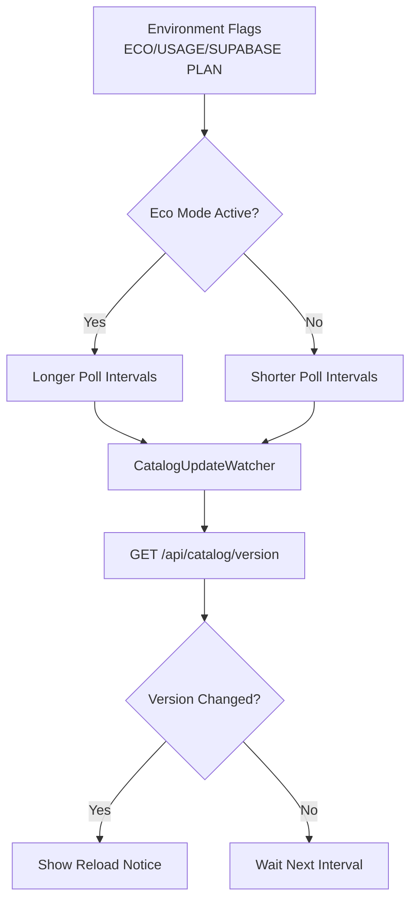
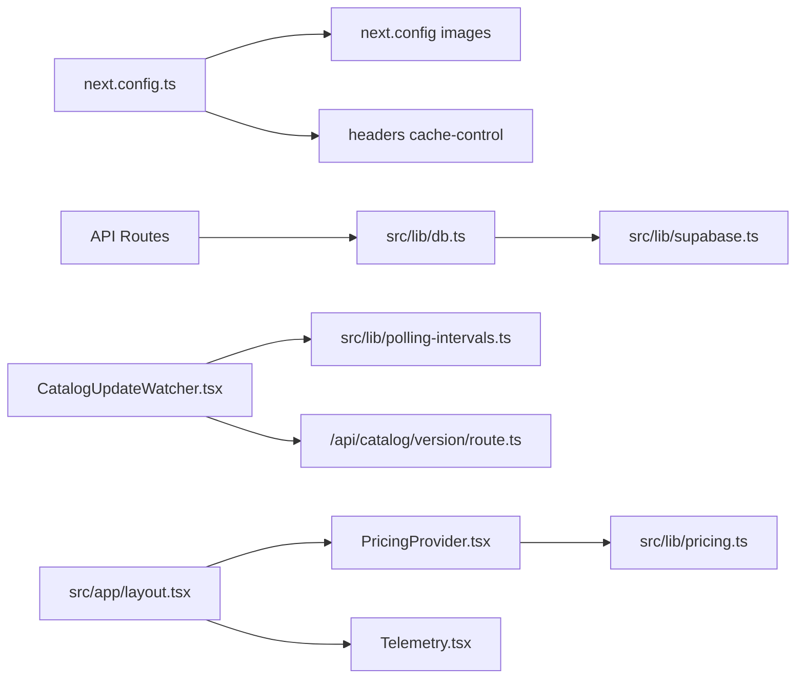

# Performance Optimization

<cite>
**Referenced Files in This Document**
- [next.config.ts](file://next.config.ts)
- [package.json](file://package.json)
- [src/lib/db.ts](file://src/lib/db.ts)
- [src/lib/supabase.ts](file://src/lib/supabase.ts)
- [src/lib/polling-intervals.ts](file://src/lib/polling-intervals.ts)
- [src/app/layout.tsx](file://src/app/layout.tsx)
- [src/components/CatalogUpdateWatcher.tsx](file://src/components/CatalogUpdateWatcher.tsx)
- [src/app/api/storefront/route.ts](file://src/app/api/storefront/route.ts)
- [src/app/api/catalog/version/route.ts](file://src/app/api/catalog/version/route.ts)
- [src/components/Telemetry.tsx](file://src/components/Telemetry.tsx)
- [src/lib/image-paths.ts](file://src/lib/image-paths.ts)
- [src/lib/site.ts](file://src/lib/site.ts)
- [src/lib/utils.ts](file://src/lib/utils.ts)
- [src/providers/PricingProvider.tsx](file://src/providers/PricingProvider.tsx)
- [src/lib/pricing.ts](file://src/lib/pricing.ts)
</cite>

## Table of Contents
1. [Introduction](#introduction)
2. [Project Structure](#project-structure)
3. [Core Components](#core-components)
4. [Architecture Overview](#architecture-overview)
5. [Detailed Component Analysis](#detailed-component-analysis)
6. [Dependency Analysis](#dependency-analysis)
7. [Performance Considerations](#performance-considerations)
8. [Troubleshooting Guide](#troubleshooting-guide)
9. [Conclusion](#conclusion)
10. [Appendices](#appendices)

## Introduction
This document presents a comprehensive guide to performance optimization in AllShop. It covers caching strategies, image optimization, bundle optimization, database performance tuning, eco-mode and polling interval management, resource utilization optimization, static generation and SSR enhancements, client-side performance improvements, Supabase and CDN integration, monitoring systems, and platform-specific optimizations on Vercel. Practical examples and measurement techniques are included to help teams diagnose and resolve common performance issues such as slow page loads, database query bottlenecks, and excessive memory usage.

## Project Structure
AllShop is a Next.js application with a clear separation of concerns:
- Application pages and layouts under src/app
- Client components under src/components
- Data access and database utilities under src/lib
- Providers for cross-cutting concerns under src/providers
- Build-time configuration under next.config.ts and package.json

**Diagram sources**
- [src/app/layout.tsx:112-202](file://src/app/layout.tsx#L112-L202)
- [src/lib/db.ts:113-309](file://src/lib/db.ts#L113-L309)
- [src/lib/supabase.ts:1-20](file://src/lib/supabase.ts#L1-L20)
- [src/lib/polling-intervals.ts:1-18](file://src/lib/polling-intervals.ts#L1-L18)
- [src/lib/image-paths.ts:1-78](file://src/lib/image-paths.ts#L1-L78)
- [src/lib/site.ts:17-26](file://src/lib/site.ts#L17-L26)
- [src/lib/utils.ts:56-67](file://src/lib/utils.ts#L56-L67)
- [src/lib/pricing.ts:1-146](file://src/lib/pricing.ts#L1-L146)
- [src/providers/PricingProvider.tsx:1-63](file://src/providers/PricingProvider.tsx#L1-L63)
- [next.config.ts:53-117](file://next.config.ts#L53-L117)
- [package.json:12-26](file://package.json#L12-L26)
- [src/components/Telemetry.tsx:1-27](file://src/components/Telemetry.tsx#L1-L27)
- [src/app/api/storefront/route.ts:1-30](file://src/app/api/storefront/route.ts#L1-L30)
- [src/app/api/catalog/version/route.ts:1-23](file://src/app/api/catalog/version/route.ts#L1-L23)

**Section sources**
- [next.config.ts:53-117](file://next.config.ts#L53-L117)
- [package.json:12-26](file://package.json#L12-L26)
- [src/app/layout.tsx:112-202](file://src/app/layout.tsx#L112-L202)

## Core Components
- Image optimization pipeline: Next.js Image Optimization with AVIF/WebP, cache TTLs, and remote pattern allowlists.
- Database access layer: Centralized Supabase queries with deduplication and normalization for products.
- Polling intervals: Environment-driven intervals for catalog updates, stock checks, and order polling to reduce load on free plans.
- Monitoring: Vercel Analytics and Speed Insights enabled in production and excluded from admin/private routes.
- Storefront API: Revalidation and caching headers for storefront data aggregation.
- Pricing provider: Localized currency conversion and formatting with fallback rates.

**Section sources**
- [next.config.ts:64-74](file://next.config.ts#L64-L74)
- [src/lib/db.ts:113-309](file://src/lib/db.ts#L113-L309)
- [src/lib/polling-intervals.ts:1-18](file://src/lib/polling-intervals.ts#L1-L18)
- [src/components/Telemetry.tsx:1-27](file://src/components/Telemetry.tsx#L1-L27)
- [src/app/api/storefront/route.ts:4-28](file://src/app/api/storefront/route.ts#L4-L28)
- [src/providers/PricingProvider.tsx:1-63](file://src/providers/PricingProvider.tsx#L1-L63)

## Architecture Overview
The performance architecture integrates client-side polling, server-side caching, and CDN-backed assets. Supabase serves as the primary data source with local normalization and deduplication. Vercel’s edge network and Next.js Image Optimization handle asset delivery and caching.

**Diagram sources**
- [next.config.ts:64-74](file://next.config.ts#L64-L74)
- [next.config.ts:75-113](file://next.config.ts#L75-L113)
- [src/app/api/storefront/route.ts:4-28](file://src/app/api/storefront/route.ts#L4-L28)
- [src/app/api/catalog/version/route.ts:4-22](file://src/app/api/catalog/version/route.ts#L4-L22)
- [src/lib/supabase.ts:1-20](file://src/lib/supabase.ts#L1-L20)
- [src/components/Telemetry.tsx:1-27](file://src/components/Telemetry.tsx#L1-L27)

## Detailed Component Analysis

### Caching Mechanisms
- Next.js Image Optimization:
  - Formats: AVIF and WebP for modern browsers.
  - Minimum cache TTL: long-lived for static images.
  - Remote patterns: allowlisted hosts from environment variables.
  - Device and image sizes configured for responsive delivery.
- Security and asset caching headers:
  - Immutable static assets under _next/static.
  - Stale-while-revalidate for optimized images.
  - Icon caching tuned for weekly refresh cycles.
- Storefront API caching:
  - Public cache with s-maxage and stale-while-revalidate.
  - Revalidation interval set to balance freshness and cost.

**Diagram sources**
- [next.config.ts:64-74](file://next.config.ts#L64-L74)
- [next.config.ts:75-113](file://next.config.ts#L75-L113)

**Section sources**
- [next.config.ts:64-74](file://next.config.ts#L64-L74)
- [next.config.ts:75-113](file://next.config.ts#L75-L113)
- [src/app/api/storefront/route.ts:4-28](file://src/app/api/storefront/route.ts#L4-L28)

### Image Optimization Techniques
- Next.js Image Optimization:
  - Automatic format selection (AVIF/WebP).
  - Device pixel ratio sizing and multiple widths.
  - Remote image allowlisting to avoid mixed-content and unoptimized domains.
- Legacy image path normalization:
  - Normalize legacy folder paths and product slugs to ensure consistent URLs and cache hits.
- CDN integration:
  - Images served via Next’s optimized endpoint, which leverages Vercel edge for global distribution.

**Diagram sources**
- [next.config.ts:64-74](file://next.config.ts#L64-L74)
- [src/lib/image-paths.ts:40-77](file://src/lib/image-paths.ts#L40-L77)

**Section sources**
- [next.config.ts:64-74](file://next.config.ts#L64-L74)
- [src/lib/image-paths.ts:1-78](file://src/lib/image-paths.ts#L1-L78)

### Bundle Optimization
- Package imports optimization:
  - OptimizePackageImports configured for specific libraries to reduce bundle size.
- Modern browser targets:
  - Browserslist configured to target recent browsers, enabling tree-shaking and native features.
- Client-side libraries:
  - Framer Motion and Lucide React are commonly used; ensure only used components are imported to minimize payload.

**Diagram sources**
- [next.config.ts:57-63](file://next.config.ts#L57-L63)
- [package.json:40-47](file://package.json#L40-L47)

**Section sources**
- [next.config.ts:57-63](file://next.config.ts#L57-L63)
- [package.json:40-47](file://package.json#L40-L47)

### Database Performance Tuning
- Centralized data access:
  - Single source of truth for categories, products, and reviews via Supabase.
  - Deduplication and normalization of product slugs and images to reduce inconsistencies.
- Query patterns:
  - Use equality filters and ordering to leverage indexes.
  - Batch requests where possible (e.g., storefront aggregates categories and featured products).
- Supabase client configuration:
  - Safe client creation with environment guards to avoid runtime errors.

**Diagram sources**
- [src/app/api/storefront/route.ts:6-20](file://src/app/api/storefront/route.ts#L6-L20)
- [src/lib/db.ts:113-181](file://src/lib/db.ts#L113-L181)

**Section sources**
- [src/lib/db.ts:113-309](file://src/lib/db.ts#L113-L309)
- [src/app/api/storefront/route.ts:4-28](file://src/app/api/storefront/route.ts#L4-L28)
- [src/lib/supabase.ts:1-20](file://src/lib/supabase.ts#L1-L20)

### Eco-Mode Implementation and Polling Interval Management
- Eco-mode:
  - Controlled by environment flags: usage mode, Supabase plan, and explicit eco flag.
  - Reduces polling frequency for catalog version, product stock, and order confirmation checks.
- Client-side watcher:
  - Periodic polling of catalog version endpoint with environment-driven intervals.
  - Visibility-aware polling to avoid unnecessary checks outside storefront routes.

**Diagram sources**
- [src/lib/polling-intervals.ts:1-18](file://src/lib/polling-intervals.ts#L1-L18)
- [src/components/CatalogUpdateWatcher.tsx:14-75](file://src/components/CatalogUpdateWatcher.tsx#L14-L75)
- [src/app/api/catalog/version/route.ts:4-22](file://src/app/api/catalog/version/route.ts#L4-L22)

**Section sources**
- [src/lib/polling-intervals.ts:1-18](file://src/lib/polling-intervals.ts#L1-L18)
- [src/components/CatalogUpdateWatcher.tsx:14-75](file://src/components/CatalogUpdateWatcher.tsx#L14-L75)
- [src/app/api/catalog/version/route.ts:4-22](file://src/app/api/catalog/version/route.ts#L4-L22)

### Resource Utilization Optimization
- Client IP extraction:
  - Uses trusted headers from Vercel’s edge network to avoid expensive reverse DNS lookups.
- Pricing provider:
  - Memoized computations and localized formatting to reduce render overhead.
- Layout and fonts:
  - Font display swap and minimal layout shifts improve perceived performance.

**Section sources**
- [src/lib/utils.ts:56-67](file://src/lib/utils.ts#L56-L67)
- [src/providers/PricingProvider.tsx:33-57](file://src/providers/PricingProvider.tsx#L33-L57)
- [src/app/layout.tsx:21-32](file://src/app/layout.tsx#L21-L32)

### Static Generation and SSR Optimizations
- Storefront aggregation:
  - API route performs parallel fetches and returns cached JSON to clients.
- Metadata and Open Graph:
  - Canonical and OG images generated at runtime; ensure page-level overrides for SEO and caching.
- Layout:
  - Global providers and telemetry injected once per page.

**Section sources**
- [src/app/api/storefront/route.ts:6-20](file://src/app/api/storefront/route.ts#L6-L20)
- [src/app/layout.tsx:34-103](file://src/app/layout.tsx#L34-L103)

### Client-Side Performance Improvements
- Suspense boundaries:
  - Lazy loading of third-party widgets to avoid blocking the main thread.
- Scroll progress and animations:
  - Lightweight scroll indicators and motion primitives to minimize layout thrash.
- Telemetry:
  - Analytics and speed insights loaded conditionally in production and excluded from private/admin routes.

**Section sources**
- [src/app/layout.tsx:180-197](file://src/app/layout.tsx#L180-L197)
- [src/components/Telemetry.tsx:1-27](file://src/components/Telemetry.tsx#L1-L27)

### Monitoring Systems and Vercel Platform Features
- Vercel Analytics and Speed Insights:
  - Integrated via Telemetry component; disabled in development and excluded from private routes.
- Edge caching:
  - Next.js headers define immutable static assets and stale-while-revalidate for images.
- Supabase performance:
  - Queries use equality and ordering; consider adding indexes on frequently filtered columns.

**Section sources**
- [src/components/Telemetry.tsx:1-27](file://src/components/Telemetry.tsx#L1-L27)
- [next.config.ts:75-113](file://next.config.ts#L75-L113)
- [src/lib/db.ts:116-155](file://src/lib/db.ts#L116-L155)

## Dependency Analysis
The following diagram highlights key dependencies among performance-critical modules.

**Diagram sources**
- [next.config.ts:53-117](file://next.config.ts#L53-L117)
- [src/app/api/storefront/route.ts:1-30](file://src/app/api/storefront/route.ts#L1-L30)
- [src/lib/db.ts:113-309](file://src/lib/db.ts#L113-L309)
- [src/lib/supabase.ts:1-20](file://src/lib/supabase.ts#L1-L20)
- [src/components/CatalogUpdateWatcher.tsx:1-119](file://src/components/CatalogUpdateWatcher.tsx#L1-L119)
- [src/lib/polling-intervals.ts:1-18](file://src/lib/polling-intervals.ts#L1-L18)
- [src/app/api/catalog/version/route.ts:1-23](file://src/app/api/catalog/version/route.ts#L1-L23)
- [src/providers/PricingProvider.tsx:1-63](file://src/providers/PricingProvider.tsx#L1-L63)
- [src/lib/pricing.ts:1-146](file://src/lib/pricing.ts#L1-L146)
- [src/app/layout.tsx:112-202](file://src/app/layout.tsx#L112-L202)
- [src/components/Telemetry.tsx:1-27](file://src/components/Telemetry.tsx#L1-L27)

**Section sources**
- [next.config.ts:53-117](file://next.config.ts#L53-L117)
- [src/lib/db.ts:113-309](file://src/lib/db.ts#L113-L309)
- [src/lib/polling-intervals.ts:1-18](file://src/lib/polling-intervals.ts#L1-L18)
- [src/components/CatalogUpdateWatcher.tsx:1-119](file://src/components/CatalogUpdateWatcher.tsx#L1-L119)
- [src/app/api/storefront/route.ts:1-30](file://src/app/api/storefront/route.ts#L1-L30)
- [src/app/api/catalog/version/route.ts:1-23](file://src/app/api/catalog/version/route.ts#L1-L23)
- [src/providers/PricingProvider.tsx:1-63](file://src/providers/PricingProvider.tsx#L1-L63)
- [src/lib/pricing.ts:1-146](file://src/lib/pricing.ts#L1-L146)
- [src/app/layout.tsx:112-202](file://src/app/layout.tsx#L112-L202)
- [src/components/Telemetry.tsx:1-27](file://src/components/Telemetry.tsx#L1-L27)

## Performance Considerations
- Image optimization
  - Prefer AVIF/WebP; ensure remote images are allowlisted to avoid bypassing optimization.
  - Use appropriate deviceSizes and imageSizes to reduce overfetching.
- Caching strategy
  - Leverage immutable static assets and stale-while-revalidate for images.
  - Tune API cache headers to balance freshness and bandwidth.
- Database queries
  - Add indexes on slug, category_id, is_active, and created_at for faster filtering and sorting.
  - Consider partitioning or materialized views for frequently accessed aggregates.
- Polling and real-time updates
  - Use eco-mode intervals for free-tier deployments.
  - Debounce or coalesce frequent client-side checks to reduce network load.
- Bundle size
  - Audit imports and enable tree-shaking; prefer component-level imports for large libraries.
- Monitoring
  - Track Largest Contentful Paint (LCP), First Input Delay (FID), and Cumulative Layout Shift (CLS) via Speed Insights.
  - Monitor API latency and error rates for database-heavy endpoints.

[No sources needed since this section provides general guidance]

## Troubleshooting Guide
- Slow page loads
  - Verify cache headers for static and image assets.
  - Inspect API response times and consider parallelizing data fetching.
- Database query bottlenecks
  - Confirm indexes exist on filter/sort columns.
  - Review query patterns and avoid N+1 selects.
- Memory usage optimization
  - Avoid storing large arrays in client state; use pagination and virtualization.
  - Limit concurrent polling intervals and cancel timers on route changes.
- Monitoring and measurement
  - Use Vercel Analytics and Speed Insights dashboards to identify regressions.
  - Implement logging around API routes and database calls for diagnostics.

**Section sources**
- [src/app/api/storefront/route.ts:6-20](file://src/app/api/storefront/route.ts#L6-L20)
- [src/lib/db.ts:113-309](file://src/lib/db.ts#L113-L309)
- [src/components/Telemetry.tsx:1-27](file://src/components/Telemetry.tsx#L1-L27)

## Conclusion
AllShop’s performance strategy centers on efficient asset delivery via Next.js Image Optimization and CDN-backed caching, disciplined database query patterns, environment-aware polling intervals, and robust monitoring. By tuning cache headers, optimizing bundles, indexing database queries, and leveraging Vercel’s edge capabilities, teams can achieve fast, reliable experiences while keeping hosting costs manageable—especially under eco-mode constraints.

[No sources needed since this section summarizes without analyzing specific files]

## Appendices
- Practical examples
  - Measure LCP and FID using Speed Insights.
  - Compare image sizes with and without optimization; adjust deviceSizes accordingly.
  - Profile bundle size with Next.js analyzer and remove unused imports.
  - Add indexes on slug, category_id, is_active, created_at in Supabase.
- Analytics-driven optimization
  - Use Vercel Analytics to track conversion funnels and drop-off points.
  - A/B test image formats and polling intervals to quantify impact.
- A/B testing for performance
  - Randomize polling intervals per user cohort and measure impact on UX and costs.

[No sources needed since this section provides general guidance]