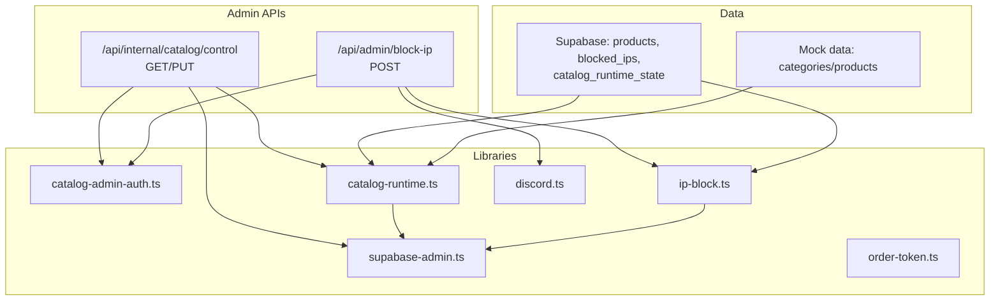
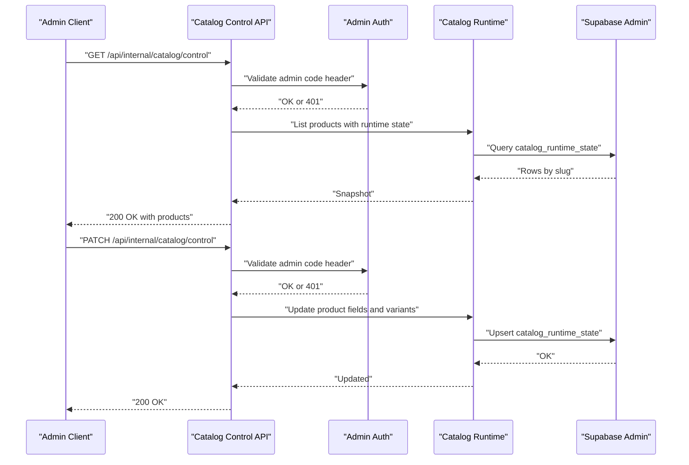
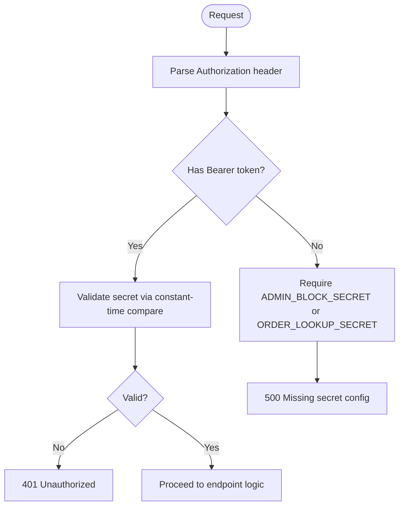
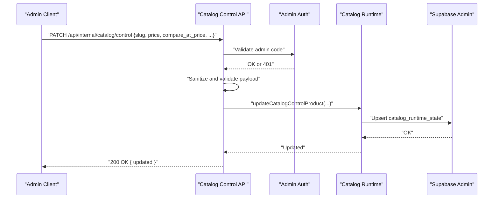
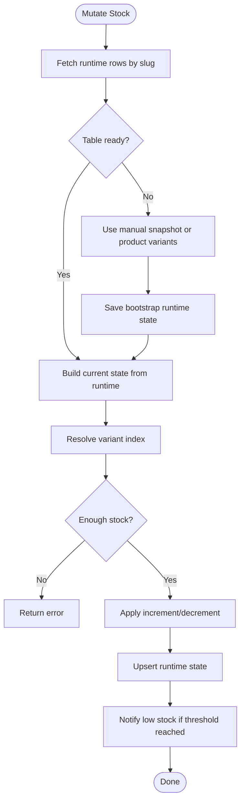
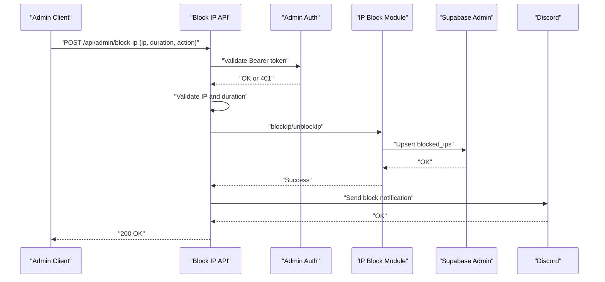
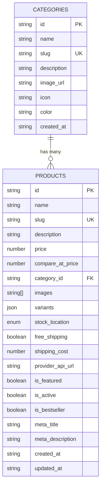
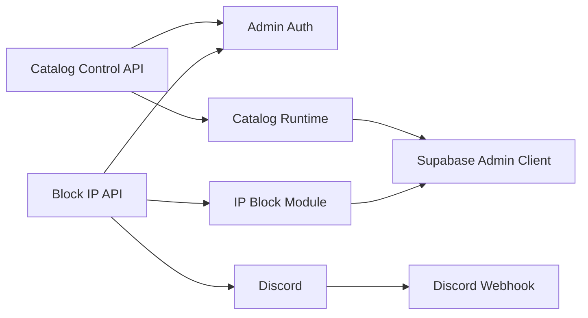

# Administrative Interface

<cite>
**Referenced Files in This Document**
- [catalog-admin-auth.ts](file://src/lib/catalog-admin-auth.ts)
- [route.ts](file://src/app/api/admin/block-ip/route.ts)
- [supabase-admin.ts](file://src/lib/supabase-admin.ts)
- [route.ts](file://src/app/api/internal/catalog/control/route.ts)
- [catalog-runtime.ts](file://src/lib/catalog-runtime.ts)
- [ip-block.ts](file://src/lib/ip-block.ts)
- [order-token.ts](file://src/lib/order-token.ts)
- [discord.ts](file://src/lib/discord.ts)
- [database.ts](file://src/types/database.ts)
- [mock.ts](file://src/data/mock.ts)
</cite>

## Table of Contents
1. [Introduction](#introduction)
2. [Project Structure](#project-structure)
3. [Core Components](#core-components)
4. [Architecture Overview](#architecture-overview)
5. [Detailed Component Analysis](#detailed-component-analysis)
6. [Dependency Analysis](#dependency-analysis)
7. [Performance Considerations](#performance-considerations)
8. [Troubleshooting Guide](#troubleshooting-guide)
9. [Conclusion](#conclusion)
10. [Appendices](#appendices)

## Introduction
This document describes the administrative catalog management interface and its supporting systems. It covers admin authentication, token-based access control, permission enforcement, and the catalog control panel. It also documents product CRUD operations, bulk updates, content moderation, variant and inventory management, pricing updates, promotional content editing, reporting and analytics, workflow automation, approval processes, and audit trails. Examples of admin usage, bulk operations, and content management workflows are included to guide administrators.

## Project Structure
The administrative interface spans server-side libraries, API routes, and Supabase integration:
- Authentication and secrets management for admin endpoints
- Admin catalog control panel API
- IP blocking and moderation endpoints
- Inventory and stock mutation logic
- Discord notifications for moderation actions and low stock
- Types and data models for products, categories, and orders

**Diagram sources**
- [route.ts:1-191](file://src/app/api/internal/catalog/control/route.ts#L1-L191)
- [route.ts:1-140](file://src/app/api/admin/block-ip/route.ts#L1-L140)
- [catalog-admin-auth.ts:1-65](file://src/lib/catalog-admin-auth.ts#L1-L65)
- [catalog-runtime.ts:1-1305](file://src/lib/catalog-runtime.ts#L1-L1305)
- [ip-block.ts:1-210](file://src/lib/ip-block.ts#L1-L210)
- [supabase-admin.ts:1-31](file://src/lib/supabase-admin.ts#L1-L31)
- [discord.ts:1-379](file://src/lib/discord.ts#L1-L379)
- [mock.ts:1-345](file://src/data/mock.ts#L1-L345)

**Section sources**
- [route.ts:1-191](file://src/app/api/internal/catalog/control/route.ts#L1-L191)
- [route.ts:1-140](file://src/app/api/admin/block-ip/route.ts#L1-L140)
- [catalog-admin-auth.ts:1-65](file://src/lib/catalog-admin-auth.ts#L1-L65)
- [catalog-runtime.ts:1-1305](file://src/lib/catalog-runtime.ts#L1-L1305)
- [ip-block.ts:1-210](file://src/lib/ip-block.ts#L1-L210)
- [supabase-admin.ts:1-31](file://src/lib/supabase-admin.ts#L1-L31)
- [discord.ts:1-379](file://src/lib/discord.ts#L1-L379)
- [mock.ts:1-345](file://src/data/mock.ts#L1-L345)

## Core Components
- Admin authentication and secrets:
  - Admin code header validation for catalog control panel
  - Bearer token parsing and admin action secret validation for moderation endpoints
- Catalog control panel:
  - Lists products with runtime inventory and variants
  - Updates price, compare-at price, shipping flags, shipping cost, total stock, and variants
- Inventory and stock:
  - Runtime state table for manual stock snapshots
  - Variant stock resolution and mutation with retries
  - Low stock alerts via Discord
- Moderation and security:
  - IP blocking/unblocking with duration and persistence
  - Discord notifications for moderation actions
- Order lookup tokens:
  - HMAC-signed tokens with TTL for order visibility and cancellation
- Supabase admin client:
  - Service role client for dynamic tables and RPC functions

**Section sources**
- [catalog-admin-auth.ts:1-65](file://src/lib/catalog-admin-auth.ts#L1-L65)
- [route.ts:1-191](file://src/app/api/internal/catalog/control/route.ts#L1-L191)
- [catalog-runtime.ts:1-1305](file://src/lib/catalog-runtime.ts#L1-L1305)
- [ip-block.ts:1-210](file://src/lib/ip-block.ts#L1-L210)
- [discord.ts:1-379](file://src/lib/discord.ts#L1-L379)
- [order-token.ts:1-65](file://src/lib/order-token.ts#L1-L65)
- [supabase-admin.ts:1-31](file://src/lib/supabase-admin.ts#L1-L31)

## Architecture Overview
The admin interface relies on strict access controls and layered validation:
- Requests to the catalog control panel must present a valid admin code via a dedicated header
- Moderation endpoints require a Bearer token validated against configured secrets
- Inventory updates leverage a runtime state table and fallback mechanisms
- IP blocking persists to Supabase and notifies via Discord
- Notifications and alerts integrate with Discord webhooks

**Diagram sources**
- [route.ts:1-191](file://src/app/api/internal/catalog/control/route.ts#L1-L191)
- [catalog-admin-auth.ts:1-65](file://src/lib/catalog-admin-auth.ts#L1-L65)
- [catalog-runtime.ts:1-1305](file://src/lib/catalog-runtime.ts#L1-L1305)
- [supabase-admin.ts:1-31](file://src/lib/supabase-admin.ts#L1-L31)

## Detailed Component Analysis

### Admin Authentication and Access Control
- Admin code validation:
  - Endpoint requires a dedicated header containing the admin code
  - Code is validated using a constant-time comparison against the configured environment variable
- Bearer token parsing and admin action secret:
  - Authorization header is parsed for Bearer tokens
  - Admin action secret supports two environment variables with fallback
  - Secret validation uses constant-time comparison
- Token-based order lookup:
  - HMAC-SHA256 signed tokens with expiration
  - Configurable TTL within bounds

**Diagram sources**
- [catalog-admin-auth.ts:1-65](file://src/lib/catalog-admin-auth.ts#L1-L65)
- [route.ts:20-41](file://src/app/api/admin/block-ip/route.ts#L20-L41)
- [order-token.ts:1-65](file://src/lib/order-token.ts#L1-L65)

**Section sources**
- [catalog-admin-auth.ts:1-65](file://src/lib/catalog-admin-auth.ts#L1-L65)
- [route.ts:1-140](file://src/app/api/admin/block-ip/route.ts#L1-L140)
- [order-token.ts:1-65](file://src/lib/order-token.ts#L1-L65)

### Catalog Control Panel
- Purpose:
  - Retrieve a snapshot of products with runtime inventory and variants
  - Update pricing, promotions, shipping flags, shipping cost, total stock, and variants
- Request flow:
  - Validates admin code via header
  - Parses and sanitizes update payload
  - Applies numeric and format validations
  - Persists changes to the runtime state table
- Data model:
  - Products include slug, name, images, price, compare-at price, discount percent, total stock, shipping flags, variants, and timestamps
  - Variants include name, stock, and optional variation ID

**Diagram sources**
- [route.ts:1-191](file://src/app/api/internal/catalog/control/route.ts#L1-L191)
- [catalog-runtime.ts:1-1305](file://src/lib/catalog-runtime.ts#L1-L1305)
- [supabase-admin.ts:1-31](file://src/lib/supabase-admin.ts#L1-L31)

**Section sources**
- [route.ts:1-191](file://src/app/api/internal/catalog/control/route.ts#L1-L191)
- [catalog-runtime.ts:51-82](file://src/lib/catalog-runtime.ts#L51-L82)

### Inventory Management and Stock Mutations
- Runtime state:
  - Maintains per-slug total stock and variants
  - Falls back to manual snapshots and product variants when runtime table is missing
- Stock mutation:
  - Supports increment/decrement with retry logic
  - Validates variant selection and sufficient stock
  - Calculates totals from variants when needed
- Low stock alerts:
  - Emits Discord notifications when thresholds are met
  - Cooldown prevents repeated alerts

**Diagram sources**
- [catalog-runtime.ts:465-833](file://src/lib/catalog-runtime.ts#L465-L833)
- [discord.ts:326-379](file://src/lib/discord.ts#L326-L379)

**Section sources**
- [catalog-runtime.ts:465-833](file://src/lib/catalog-runtime.ts#L465-L833)
- [discord.ts:326-379](file://src/lib/discord.ts#L326-L379)

### Content Moderation and IP Blocking
- IP blocking endpoint:
  - Accepts POST with JSON payload including IP, duration, and action
  - Validates IP format and duration
  - Blocks/unblocks with persistence to Supabase and in-memory cache
  - Sends Discord notification on block
- Rate limiting:
  - Admin endpoints enforce per-IP rate limits
- Order moderation:
  - Discord embeds include moderation command examples for blocking and unblocking IPs
  - Order cancellation commands are included in notifications

**Diagram sources**
- [route.ts:1-140](file://src/app/api/admin/block-ip/route.ts#L1-L140)
- [catalog-admin-auth.ts:57-64](file://src/lib/catalog-admin-auth.ts#L57-L64)
- [ip-block.ts:103-171](file://src/lib/ip-block.ts#L103-L171)
- [discord.ts:230-262](file://src/lib/discord.ts#L230-L262)

**Section sources**
- [route.ts:1-140](file://src/app/api/admin/block-ip/route.ts#L1-L140)
- [ip-block.ts:1-210](file://src/lib/ip-block.ts#L1-L210)
- [discord.ts:95-111](file://src/lib/discord.ts#L95-L111)

### Product Creation Forms, Variants, and Categories
- Product creation and updates:
  - Products include name, slug, description, price, compare-at price, category ID, images, variants, shipping flags, and metadata
  - Variants define option sets (e.g., color)
- Categories:
  - Categories include name, slug, description, image/icon/color, and timestamps
- Mock data:
  - Provides sample categories and products for development and testing

**Diagram sources**
- [database.ts:96-288](file://src/types/database.ts#L96-L288)
- [mock.ts:3-54](file://src/data/mock.ts#L3-L54)
- [mock.ts:56-344](file://src/data/mock.ts#L56-L344)

**Section sources**
- [database.ts:39-86](file://src/types/database.ts#L39-L86)
- [database.ts:96-288](file://src/types/database.ts#L96-L288)
- [mock.ts:3-54](file://src/data/mock.ts#L3-L54)
- [mock.ts:56-344](file://src/data/mock.ts#L56-L344)

### Pricing Updates and Promotional Content Editing
- Catalog control panel supports:
  - Price updates
  - Compare-at price edits (including removal by setting to null)
  - Free shipping flags and shipping cost adjustments
- Promotion logic:
  - Discount percent computed from price and compare-at price
  - Validation ensures non-negative integers and proper null semantics

**Section sources**
- [route.ts:112-175](file://src/app/api/internal/catalog/control/route.ts#L112-L175)
- [catalog-runtime.ts:199-204](file://src/lib/catalog-runtime.ts#L199-L204)

### Reporting, Analytics, and Audit Trails
- Low stock monitoring:
  - Threshold configurable via environment variable
  - Alerts sent to Discord with product, variant, and stock level
- Discord notifications:
  - Order alerts include moderation and cancellation command examples
  - Block notifications and cancellation results are posted to Discord
- Audit logs:
  - Dedicated table referenced in runtime logic suggests audit logging capability

**Section sources**
- [catalog-runtime.ts:15-20](file://src/lib/catalog-runtime.ts#L15-L20)
- [discord.ts:326-379](file://src/lib/discord.ts#L326-L379)
- [discord.ts:79-228](file://src/lib/discord.ts#L79-L228)
- [catalog-runtime.ts:239-250](file://src/lib/catalog-runtime.ts#L239-L250)

### Workflow Automation, Approval Processes, and Audit Trails
- Moderation automation:
  - Discord webhook embeds provide ready-to-use curl commands for blocking/unblocking IPs and canceling orders
- Approval processes:
  - Product review approvals are modeled in the schema (is_approved flag)
- Audit trails:
  - Catalog audit table presence checked in runtime logic indicates audit support

**Section sources**
- [discord.ts:95-111](file://src/lib/discord.ts#L95-L111)
- [database.ts:27-37](file://src/types/database.ts#L27-L37)
- [catalog-runtime.ts:239-250](file://src/lib/catalog-runtime.ts#L239-L250)

### Examples of Admin Interface Usage
- Bulk operations:
  - Use the catalog control panel to update multiple products by iterating over slugs and sending PATCH requests with sanitized payloads
- Content management workflows:
  - Update pricing and promotions in bulk via compare-at price adjustments
  - Assign categories and manage product metadata through product creation/update flows
- Moderation workflows:
  - Block suspicious IPs with 1-hour, 24-hour, or permanent durations
  - Unban IPs when appropriate and verify enforcement across instances

[No sources needed since this section provides general usage guidance]

## Dependency Analysis
- Internal dependencies:
  - Catalog control API depends on admin auth and runtime logic
  - IP blocking depends on admin auth, IP block module, and Discord notifications
  - Runtime logic depends on Supabase admin client and manual stock snapshots
- External dependencies:
  - Supabase service role client for admin operations
  - Discord webhook for notifications

**Diagram sources**
- [route.ts:1-191](file://src/app/api/internal/catalog/control/route.ts#L1-L191)
- [route.ts:1-140](file://src/app/api/admin/block-ip/route.ts#L1-L140)
- [catalog-admin-auth.ts:1-65](file://src/lib/catalog-admin-auth.ts#L1-L65)
- [catalog-runtime.ts:1-1305](file://src/lib/catalog-runtime.ts#L1-L1305)
- [ip-block.ts:1-210](file://src/lib/ip-block.ts#L1-L210)
- [supabase-admin.ts:1-31](file://src/lib/supabase-admin.ts#L1-L31)
- [discord.ts:1-379](file://src/lib/discord.ts#L1-L379)

**Section sources**
- [route.ts:1-191](file://src/app/api/internal/catalog/control/route.ts#L1-L191)
- [route.ts:1-140](file://src/app/api/admin/block-ip/route.ts#L1-L140)
- [catalog-runtime.ts:1-1305](file://src/lib/catalog-runtime.ts#L1-L1305)
- [ip-block.ts:1-210](file://src/lib/ip-block.ts#L1-L210)
- [supabase-admin.ts:1-31](file://src/lib/supabase-admin.ts#L1-L31)
- [discord.ts:1-379](file://src/lib/discord.ts#L1-L379)

## Performance Considerations
- Rate limiting:
  - Admin endpoints enforce per-minute limits to prevent abuse
- Runtime table readiness:
  - Graceful handling when the runtime table is missing, falling back to manual snapshots and product variants
- Retry logic:
  - Stock mutations retry up to a configured maximum to handle concurrent updates
- In-memory caching:
  - IP block module caches entries in memory with periodic DB sync for fast lookups

[No sources needed since this section provides general guidance]

## Troubleshooting Guide
- Admin access denied:
  - Verify admin code header and environment variable configuration
  - Ensure Bearer token matches configured admin action secret
- Catalog control panel errors:
  - Check payload format and numeric constraints
  - Confirm runtime table exists and is accessible
- IP blocking failures:
  - Validate IP format and duration values
  - Confirm Supabase configuration and webhook URL
- Low stock alerts not firing:
  - Adjust threshold environment variable and verify Discord configuration

**Section sources**
- [route.ts:59-79](file://src/app/api/internal/catalog/control/route.ts#L59-L79)
- [route.ts:24-41](file://src/app/api/admin/block-ip/route.ts#L24-L41)
- [catalog-runtime.ts:479-494](file://src/lib/catalog-runtime.ts#L479-L494)
- [ip-block.ts:37-71](file://src/lib/ip-block.ts#L37-L71)
- [discord.ts:10-12](file://src/lib/discord.ts#L10-L12)

## Conclusion
The administrative interface provides a secure, extensible foundation for managing the product catalog, inventory, and moderation workflows. Strict access controls, robust validation, and integrated notifications streamline daily operations. The modular design enables incremental enhancements for reporting, approval processes, and audit trails.

## Appendices
- Environment variables:
  - Admin code and Bearer token secrets
  - Supabase service role credentials
  - Discord webhook URL
  - Low stock alert threshold and enable flag
  - Order lookup token TTL and secret

[No sources needed since this section provides general guidance]