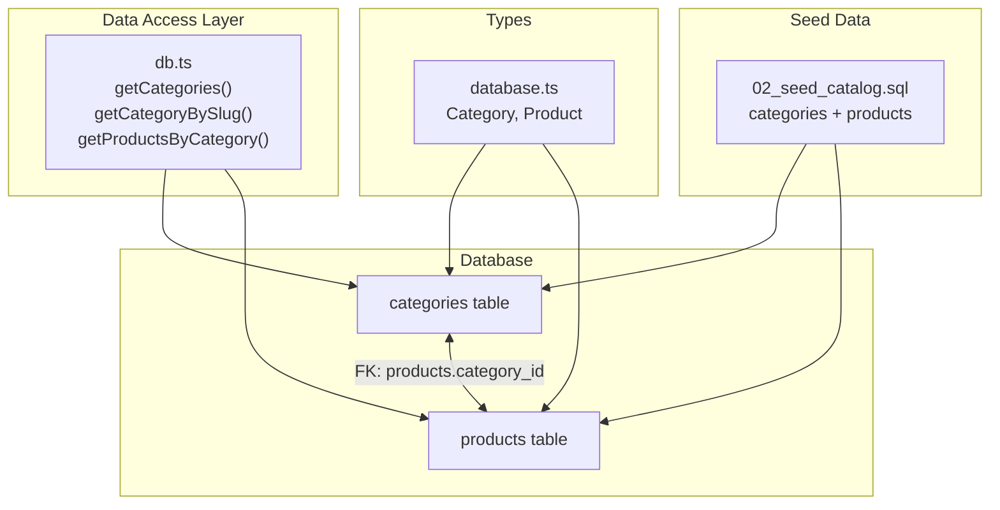
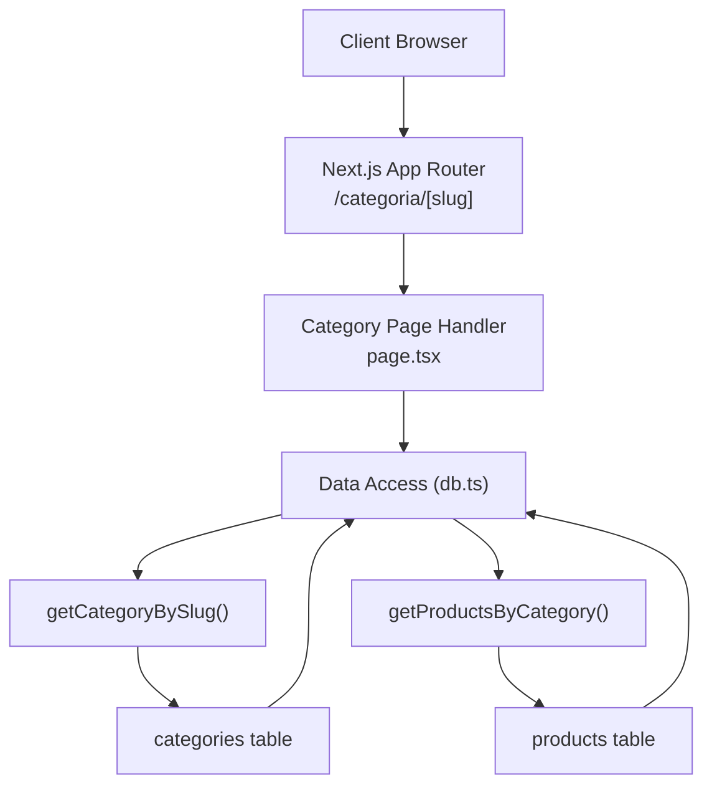
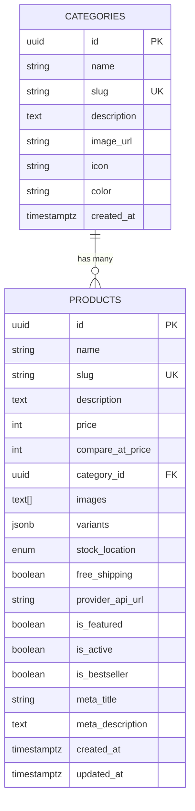
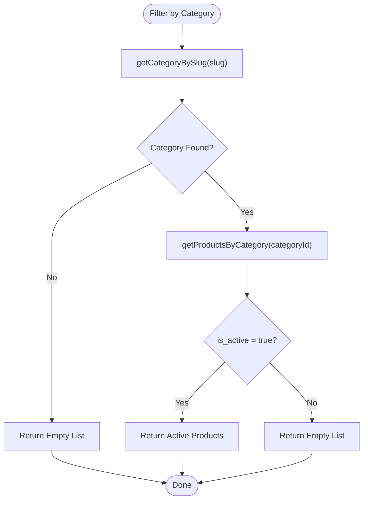
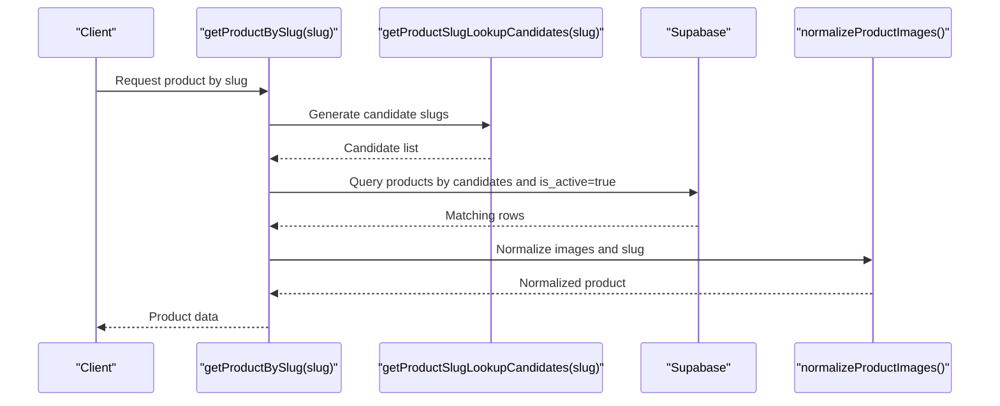
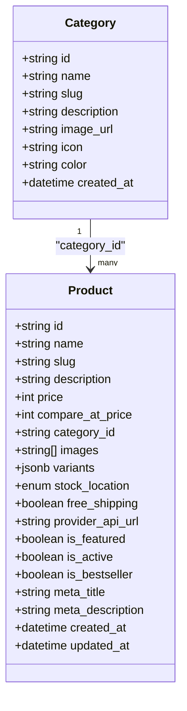
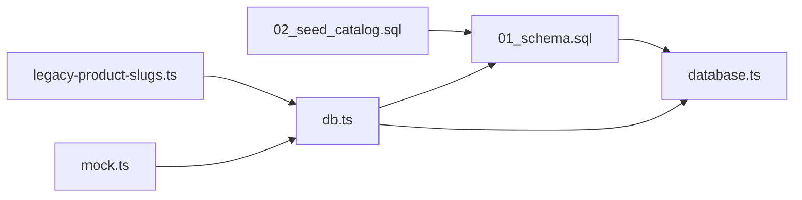

# Category System

<cite>
**Referenced Files in This Document**
- [01_schema.sql](file://sql/01_schema.sql)
- [02_seed_catalog.sql](file://sql/02_seed_catalog.sql)
- [db.ts](file://src/lib/db.ts)
- [legacy-product-slugs.ts](file://src/lib/legacy-product-slugs.ts)
- [database.ts](file://src/types/database.ts)
- [mock.ts](file://src/data/mock.ts)
</cite>

## Table of Contents
1. [Introduction](#introduction)
2. [Project Structure](#project-structure)
3. [Core Components](#core-components)
4. [Architecture Overview](#architecture-overview)
5. [Detailed Component Analysis](#detailed-component-analysis)
6. [Dependency Analysis](#dependency-analysis)
7. [Performance Considerations](#performance-considerations)
8. [Troubleshooting Guide](#troubleshooting-guide)
9. [Conclusion](#conclusion)

## Introduction
This document explains the category management system used to organize products into hierarchical categories, enable slug-based routing, and support category-based product filtering. It covers the Category entity model, its relationship to products, category pages, breadcrumb navigation, and category-based product listings. It also documents category slugs, URL generation, legacy category URL compatibility, category selection UI components, filtering mechanisms, hierarchy traversal, parent-child relationships, and category-specific product queries. Finally, it provides examples of category creation, organization, and product categorization workflows.

## Project Structure
The category system spans database schema, seeding data, data access utilities, and type definitions. The key areas are:
- Database schema defining categories and products, including foreign key relationships
- Seeding script establishing initial categories and linking products to categories
- Data access layer providing category and product retrieval APIs
- Type definitions ensuring strong typing for Category and Product entities
- Legacy slug normalization enabling backward compatibility for URLs

**Diagram sources**
- [01_schema.sql:13-45](file://sql/01_schema.sql#L13-L45)
- [02_seed_catalog.sql:8-50](file://sql/02_seed_catalog.sql#L8-L50)
- [db.ts:113-144](file://src/lib/db.ts#L113-L144)
- [database.ts:96-148](file://src/types/database.ts#L96-L148)

**Section sources**
- [01_schema.sql:13-45](file://sql/01_schema.sql#L13-L45)
- [02_seed_catalog.sql:8-50](file://sql/02_seed_catalog.sql#L8-L50)
- [db.ts:113-144](file://src/lib/db.ts#L113-L144)
- [database.ts:96-148](file://src/types/database.ts#L96-L148)

## Core Components
- Category entity model: id, name, slug, description, image_url, icon, color, created_at
- Product entity model: id, name, slug, description, price, compare_at_price, category_id (foreign key), images, variants, stock_location, free_shipping, provider_api_url, is_featured, is_active, is_bestseller, meta_title, meta_description, created_at, updated_at
- Category-to-Product relationship: Many products belong to one category via category_id
- Data access functions:
  - getCategories(): fetch all categories ordered by name
  - getCategoryBySlug(slug): fetch a single category by slug
  - getProductsByCategory(categoryId): fetch active products by category id
  - getCategoriesSlugs(): fetch all category slugs
  - getProductBySlug(slug): fetch a product by slug with legacy slug support
  - getProductSlugs(): fetch all active product slugs with normalization

These components form the foundation for category pages, filtering, and URL routing.

**Section sources**
- [01_schema.sql:13-45](file://sql/01_schema.sql#L13-L45)
- [db.ts:113-144](file://src/lib/db.ts#L113-L144)
- [db.ts:226-248](file://src/lib/db.ts#L226-L248)
- [db.ts:276-287](file://src/lib/db.ts#L276-L287)
- [db.ts:183-224](file://src/lib/db.ts#L183-L224)
- [db.ts:250-274](file://src/lib/db.ts#L250-L274)
- [database.ts:96-148](file://src/types/database.ts#L96-L148)

## Architecture Overview
The category system architecture centers around the database schema and a thin data access layer. Categories and products are stored in separate tables with a foreign key relationship. The data access layer abstracts Supabase queries and provides normalized product lists. Legacy slug normalization ensures backward compatibility for product URLs.

**Diagram sources**
- [db.ts:125-144](file://src/lib/db.ts#L125-L144)
- [db.ts:226-248](file://src/lib/db.ts#L226-L248)
- [01_schema.sql:13-45](file://sql/01_schema.sql#L13-L45)

## Detailed Component Analysis

### Category Entity Model and Relationship to Products
- Category fields: id, name, slug (unique), description, image_url, icon, color, created_at
- Product fields: id, name, slug (unique), description, price, compare_at_price, category_id (FK), images, variants, stock_location, free_shipping, provider_api_url, is_featured, is_active, is_bestseller, meta_title, meta_description, created_at, updated_at
- Relationship: products.category_id references categories.id; enforced by foreign key constraint

**Diagram sources**
- [01_schema.sql:13-45](file://sql/01_schema.sql#L13-L45)
- [database.ts:96-148](file://src/types/database.ts#L96-L148)

**Section sources**
- [01_schema.sql:13-45](file://sql/01_schema.sql#L13-L45)
- [database.ts:96-148](file://src/types/database.ts#L96-L148)

### Category Pages and Slug-Based Routing
- Route pattern: /categoria/[slug] resolves to a category page
- Data fetching:
  - getCategoryBySlug(slug) retrieves category metadata for the page
  - getProductsByCategory(categoryId) retrieves active products in that category
- SEO and metadata:
  - Category metadata (description, image_url, color) can be used for OpenGraph and page metadata
  - Product metadata (meta_title, meta_description) supports product SEO

Note: The actual page implementation files are referenced by route pattern; the data access and type definitions shown here underpin the category page behavior.

**Section sources**
- [db.ts:125-144](file://src/lib/db.ts#L125-L144)
- [db.ts:226-248](file://src/lib/db.ts#L226-L248)

### Category-Based Product Filtering
- Filtering mechanism:
  - getProductsByCategory(categoryId) filters products by category_id and is_active
  - getProducts() fetches all active products for general browsing
- Sorting:
  - Products are ordered by created_at descending for freshness
- Variants and stock:
  - Products include variants JSONB for size/color/etc. options
  - Runtime stock is managed separately via catalog_runtime_state

**Diagram sources**
- [db.ts:125-144](file://src/lib/db.ts#L125-L144)
- [db.ts:226-248](file://src/lib/db.ts#L226-L248)

**Section sources**
- [db.ts:226-248](file://src/lib/db.ts#L226-L248)

### Category Slugs, URL Generation, and Legacy URL Compatibility
- Category slugs:
  - Unique and used in category URLs (/categoria/[slug])
  - Retrieved via getCategorySlugs() for dynamic routes
- Product slug normalization:
  - Legacy-product-slugs.ts defines alias groups for product slugs
  - getProductSlugLookupCandidates(slug) returns normalized candidates
  - normalizeProductSlug(slug) selects canonical slug from candidates
  - getProductBySlug(slug) uses candidates to resolve legacy URLs
- Image normalization:
  - normalizeProductImages() normalizes product images and slugs during product retrieval

**Diagram sources**
- [legacy-product-slugs.ts:52-68](file://src/lib/legacy-product-slugs.ts#L52-L68)
- [db.ts:183-224](file://src/lib/db.ts#L183-L224)
- [db.ts:14-21](file://src/lib/db.ts#L14-L21)

**Section sources**
- [legacy-product-slugs.ts:1-69](file://src/lib/legacy-product-slugs.ts#L1-L69)
- [db.ts:183-224](file://src/lib/db.ts#L183-L224)
- [db.ts:14-21](file://src/lib/db.ts#L14-L21)
- [db.ts:250-274](file://src/lib/db.ts#L250-L274)

### Category Selection UI Components and Filtering Mechanisms
- Category selection:
  - getCategories() provides category list for navigation menus and filters
  - Categories are ordered by name for consistent presentation
- Filtering:
  - Filter by category_id using getProductsByCategory(categoryId)
  - Combine with other filters (e.g., is_featured, price range) by extending queries
- Mock data:
  - mock.ts provides in-memory categories and products for development/testing

**Diagram sources**
- [database.ts:96-148](file://src/types/database.ts#L96-L148)

**Section sources**
- [db.ts:113-123](file://src/lib/db.ts#L113-L123)
- [mock.ts:3-54](file://src/data/mock.ts#L3-L54)
- [database.ts:96-148](file://src/types/database.ts#L96-L148)

### Category Hierarchy Traversal and Parent-Child Relationships
- Current schema:
  - categories table does not include a parent_id field
  - No explicit parent-child hierarchy exists in the schema
- Implications:
  - Single-level categories only
  - Navigation and filtering operate at category level without nested traversal
- Recommendations for future enhancement:
  - Add parent_id column with self-referencing foreign key
  - Implement recursive traversal for breadcrumbs and nested navigation
  - Add category depth and path fields for efficient queries

[No sources needed since this section analyzes schema absence and provides recommendations]

### Category-Specific Product Queries
- Retrieve category by slug:
  - getCategoryBySlug(slug) returns category metadata for rendering
- Retrieve products in a category:
  - getProductsByCategory(categoryId) returns active products ordered by newest
- Retrieve all category slugs:
  - getCategorySlugs() supports dynamic route generation and sitemaps
- Retrieve all product slugs:
  - getProductSlugs() supports canonicalization and redirects

**Section sources**
- [db.ts:125-144](file://src/lib/db.ts#L125-L144)
- [db.ts:226-248](file://src/lib/db.ts#L226-L248)
- [db.ts:276-287](file://src/lib/db.ts#L276-L287)
- [db.ts:250-274](file://src/lib/db.ts#L250-L274)

### Examples: Category Creation, Organization, and Product Categorization
- Create categories:
  - Seed categories via 02_seed_catalog.sql with name, slug, description, image_url, icon, color
  - Ensure slug uniqueness to avoid conflicts
- Organize products:
  - Assign category_id when inserting/upserting products
  - Use category slug to resolve category_id during upsert
- Product categorization workflow:
  - On product creation/update, set category_id based on chosen category slug
  - Ensure is_active flag controls visibility in category listings
  - Use variants to differentiate product options within a category

**Section sources**
- [02_seed_catalog.sql:8-50](file://sql/02_seed_catalog.sql#L8-L50)
- [02_seed_catalog.sql:226-326](file://sql/02_seed_catalog.sql#L226-L326)
- [01_schema.sql:24-45](file://sql/01_schema.sql#L24-L45)

## Dependency Analysis
The category system exhibits low coupling and clear separation of concerns:
- Database schema defines entities and relationships
- Data access layer encapsulates queries and normalization
- Types define contract between layers
- Legacy slug utilities support backward compatibility

**Diagram sources**
- [01_schema.sql:13-45](file://sql/01_schema.sql#L13-L45)
- [02_seed_catalog.sql:8-50](file://sql/02_seed_catalog.sql#L8-L50)
- [database.ts:96-148](file://src/types/database.ts#L96-L148)
- [db.ts:113-144](file://src/lib/db.ts#L113-L144)
- [legacy-product-slugs.ts:52-68](file://src/lib/legacy-product-slugs.ts#L52-L68)
- [mock.ts:3-54](file://src/data/mock.ts#L3-L54)

**Section sources**
- [01_schema.sql:13-45](file://sql/01_schema.sql#L13-L45)
- [02_seed_catalog.sql:8-50](file://sql/02_seed_catalog.sql#L8-L50)
- [db.ts:113-144](file://src/lib/db.ts#L113-L144)
- [legacy-product-slugs.ts:52-68](file://src/lib/legacy-product-slugs.ts#L52-L68)
- [mock.ts:3-54](file://src/data/mock.ts#L3-L54)

## Performance Considerations
- Indexes:
  - categories(slug) and products(category_id) improve lookup performance
  - Additional indexes on frequently filtered columns (e.g., is_active, is_featured) can accelerate category-based queries
- Query patterns:
  - Prefer category-based filtering with is_active=true to reduce result sets
  - Use ordering by created_at desc judiciously; consider pagination for large categories
- Normalization:
  - normalizeProductList() deduplicates and normalizes product entries to prevent redundant rendering
- Legacy slug resolution:
  - Limit candidate slug lists to minimize query fan-out

[No sources needed since this section provides general guidance]

## Troubleshooting Guide
- Category not found:
  - Verify slug correctness and existence via getCategoryBySlug(slug)
  - Confirm category is not renamed or deleted
- Products not appearing in category:
  - Ensure products have is_active=true and correct category_id
  - Check getProductsByCategory(categoryId) returns expected results
- Legacy product URL broken:
  - Use getProductBySlug(slug) which resolves aliases via getProductSlugLookupCandidates(slug)
  - Confirm legacy-product-slugs.ts includes the slug alias group
- Slug conflicts:
  - Ensure category slugs are unique; duplicates cause routing ambiguity
  - Use getCategorySlugs() to validate uniqueness during seeding

**Section sources**
- [db.ts:125-144](file://src/lib/db.ts#L125-L144)
- [db.ts:226-248](file://src/lib/db.ts#L226-L248)
- [db.ts:183-224](file://src/lib/db.ts#L183-L224)
- [legacy-product-slugs.ts:52-68](file://src/lib/legacy-product-slugs.ts#L52-L68)
- [db.ts:276-287](file://src/lib/db.ts#L276-L287)

## Conclusion
The category management system leverages a clean relational schema, robust data access utilities, and type-safe abstractions to deliver slug-based routing, category-based filtering, and legacy URL compatibility. While the current schema supports single-level categories, the modular design enables straightforward extension for hierarchical categories. By following the documented workflows and best practices, teams can reliably create, organize, and present categories and products across the storefront.