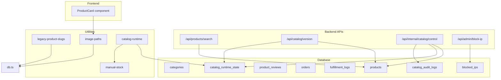
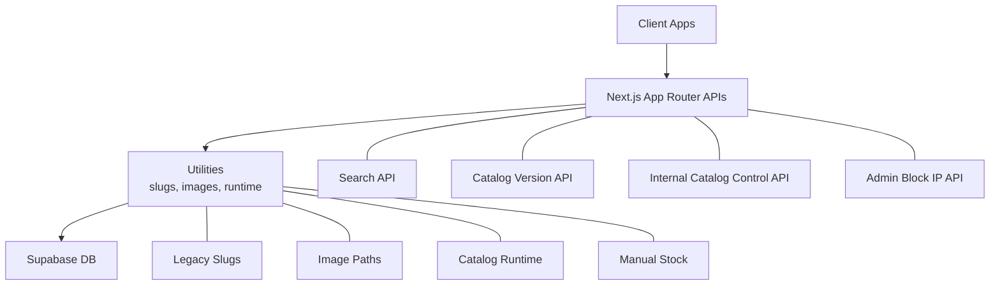
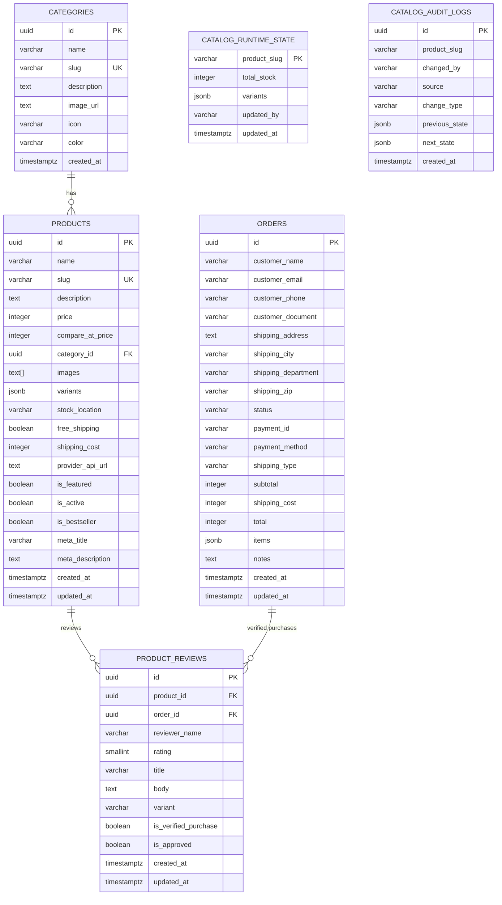
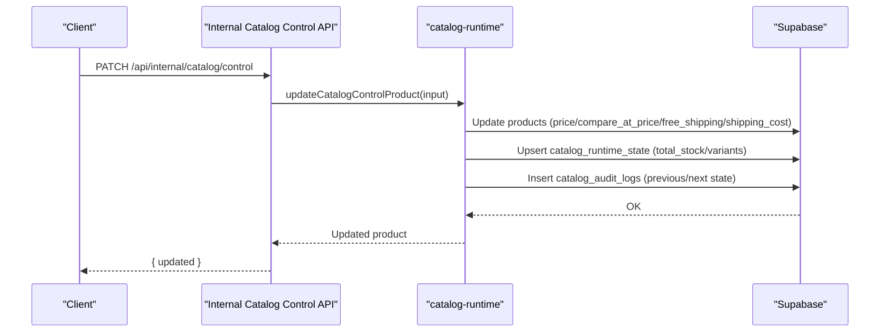
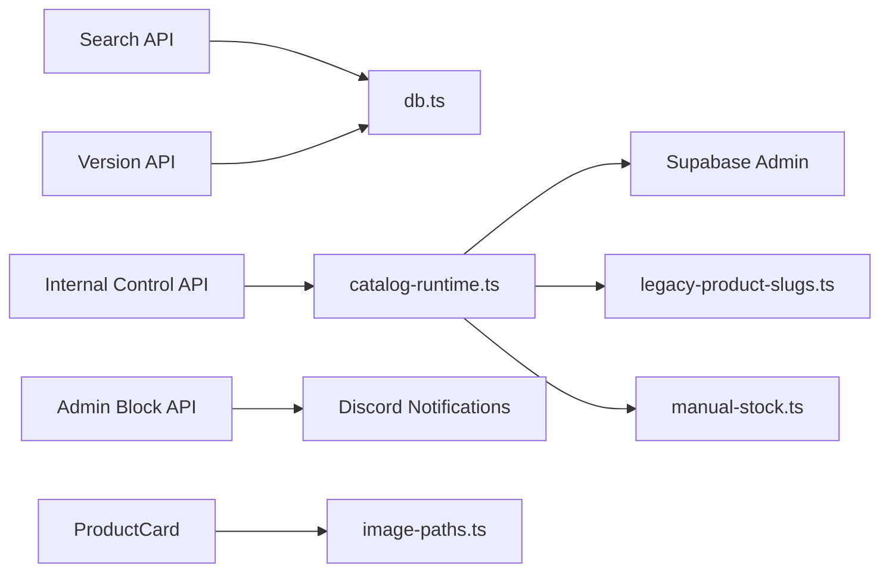

# Product Catalog Management

<cite>
**Referenced Files in This Document**
- [schema.sql](file://schema.sql)
- [01_schema.sql](file://sql/01_schema.sql)
- [db.ts](file://src/lib/db.ts)
- [database.ts](file://src/types/database.ts)
- [legacy-product-slugs.ts](file://src/lib/legacy-product-slugs.ts)
- [image-paths.ts](file://src/lib/image-paths.ts)
- [catalog-runtime.ts](file://src/lib/catalog-runtime.ts)
- [manual-stock.ts](file://src/lib/manual-stock.ts)
- [route.ts](file://src/app/api/products/search/route.ts)
- [route.ts](file://src/app/api/catalog/version/route.ts)
- [route.ts](file://src/app/api/internal/catalog/control/route.ts)
- [route.ts](file://src/app/api/admin/block-ip/route.ts)
- [mock.ts](file://src/data/mock.ts)
- [ProductCard.tsx](file://src/components/ProductCard.tsx)
</cite>

## Table of Contents
1. [Introduction](#introduction)
2. [Project Structure](#project-structure)
3. [Core Components](#core-components)
4. [Architecture Overview](#architecture-overview)
5. [Detailed Component Analysis](#detailed-component-analysis)
6. [Dependency Analysis](#dependency-analysis)
7. [Performance Considerations](#performance-considerations)
8. [Troubleshooting Guide](#troubleshooting-guide)
9. [Conclusion](#conclusion)
10. [Appendices](#appendices)

## Introduction
This document describes the product catalog management system, focusing on the data model, variant handling, pricing tiers, inventory tracking, category organization, search and filtering, display components, slug normalization, legacy URL compatibility, and administrative controls. It also covers database schema, content workflows, and image handling, along with operational concerns such as duplication prevention, slug conflicts, and performance optimization for large catalogs.

## Project Structure
The catalog system spans database schema, backend APIs, frontend components, and utilities for slug normalization and image path mapping. Key areas:
- Database schema defines categories, products, product_reviews, orders, fulfillment_logs, blocked_ips, catalog_runtime_state, and catalog_audit_logs.
- Backend APIs expose catalog search, catalog versioning, internal catalog control, and admin IP blocking.
- Frontend components render product cards and integrate with pricing, shipping, and image normalization utilities.
- Utilities manage slug alias groups, legacy image paths, and runtime stock state.

**Diagram sources**
- [schema.sql:11-47](file://schema.sql#L11-L47)
- [01_schema.sql:13-122](file://sql/01_schema.sql#L13-L122)
- [route.ts:1-31](file://src/app/api/products/search/route.ts#L1-L31)
- [route.ts:1-23](file://src/app/api/catalog/version/route.ts#L1-L23)
- [route.ts:1-191](file://src/app/api/internal/catalog/control/route.ts#L1-L191)
- [route.ts:1-140](file://src/app/api/admin/block-ip/route.ts#L1-L140)
- [ProductCard.tsx:1-305](file://src/components/ProductCard.tsx#L1-L305)
- [legacy-product-slugs.ts:1-69](file://src/lib/legacy-product-slugs.ts#L1-L69)
- [image-paths.ts:1-78](file://src/lib/image-paths.ts#L1-L78)
- [catalog-runtime.ts:1-1305](file://src/lib/catalog-runtime.ts#L1-L1305)
- [manual-stock.ts:1-100](file://src/lib/manual-stock.ts#L1-L100)

**Section sources**
- [schema.sql:11-229](file://schema.sql#L11-L229)
- [01_schema.sql:13-240](file://sql/01_schema.sql#L13-L240)
- [route.ts:1-31](file://src/app/api/products/search/route.ts#L1-L31)
- [route.ts:1-23](file://src/app/api/catalog/version/route.ts#L1-L23)
- [route.ts:1-191](file://src/app/api/internal/catalog/control/route.ts#L1-L191)
- [route.ts:1-140](file://src/app/api/admin/block-ip/route.ts#L1-L140)
- [ProductCard.tsx:1-305](file://src/components/ProductCard.tsx#L1-L305)
- [legacy-product-slugs.ts:1-69](file://src/lib/legacy-product-slugs.ts#L1-L69)
- [image-paths.ts:1-78](file://src/lib/image-paths.ts#L1-L78)
- [catalog-runtime.ts:1-1305](file://src/lib/catalog-runtime.ts#L1-L1305)
- [manual-stock.ts:1-100](file://src/lib/manual-stock.ts#L1-L100)

## Core Components
- Data model and schema
  - Categories define hierarchical grouping with unique slugs and metadata.
  - Products include pricing, compare-at pricing, category relationship, images array, variants JSONB, stock location, shipping flags, and SEO fields.
  - Reviews, orders, fulfillment logs, and blocked IPs support commerce and security.
  - Runtime state and audit logs track operational stock and changes.
- Slug normalization and legacy compatibility
  - Alias groups normalize multiple slugs to canonical forms.
  - Legacy image paths are mapped to new canonical locations.
- Runtime stock management
  - Stored in catalog_runtime_state with optimistic concurrency and fallbacks to manual snapshots and product variants.
  - RPC functions reserve and restore stock with detailed error handling.
- Administrative control
  - Internal API lists and updates catalog items with price/stock/variants.
  - Audit logging captures changes with previous/next state.
  - Admin endpoints enforce access codes and rate limits.

**Section sources**
- [schema.sql:11-47](file://schema.sql#L11-L47)
- [01_schema.sql:13-122](file://sql/01_schema.sql#L13-L122)
- [database.ts:13-66](file://src/types/database.ts#L13-L66)
- [legacy-product-slugs.ts:1-69](file://src/lib/legacy-product-slugs.ts#L1-L69)
- [image-paths.ts:1-78](file://src/lib/image-paths.ts#L1-L78)
- [catalog-runtime.ts:1-1305](file://src/lib/catalog-runtime.ts#L1-L1305)
- [route.ts:1-191](file://src/app/api/internal/catalog/control/route.ts#L1-L191)

## Architecture Overview
The system separates concerns across database, backend APIs, runtime stock, and frontend rendering:
- Database: schema, indices, triggers, RLS policies.
- Backend: public search and version APIs, internal catalog control, admin IP management.
- Runtime: optimistic stock updates, RPC reserve/restore, low stock alerts.
- Frontend: product card rendering with image normalization and pricing.

**Diagram sources**
- [route.ts:1-31](file://src/app/api/products/search/route.ts#L1-L31)
- [route.ts:1-23](file://src/app/api/catalog/version/route.ts#L1-L23)
- [route.ts:1-191](file://src/app/api/internal/catalog/control/route.ts#L1-L191)
- [route.ts:1-140](file://src/app/api/admin/block-ip/route.ts#L1-L140)
- [legacy-product-slugs.ts:1-69](file://src/lib/legacy-product-slugs.ts#L1-L69)
- [image-paths.ts:1-78](file://src/lib/image-paths.ts#L1-L78)
- [catalog-runtime.ts:1-1305](file://src/lib/catalog-runtime.ts#L1-L1305)
- [manual-stock.ts:1-100](file://src/lib/manual-stock.ts#L1-L100)

## Detailed Component Analysis

### Data Model and Schema
- Categories
  - Unique slug, optional icon/color, and description.
  - Indexed by slug for fast lookup.
- Products
  - Unique slug, category foreign key, images array, variants JSONB, pricing fields, shipping flags, and SEO metadata.
  - Indices on category, slug, featured, and active filters.
  - RLS policy restricts select to active products.
- Runtime and audit
  - catalog_runtime_state stores total_stock and variants per product slug with optimistic concurrency.
  - catalog_audit_logs records price/stock/variants changes with previous/next state snapshots.
- Orders and reviews
  - Orders track status, items, and shipping cost.
  - Reviews require approval and verified purchase for public visibility.

**Diagram sources**
- [schema.sql:11-47](file://schema.sql#L11-L47)
- [schema.sql:78-93](file://schema.sql#L78-L93)
- [schema.sql:120-128](file://schema.sql#L120-L128)
- [schema.sql:120-122](file://schema.sql#L120-L122)

**Section sources**
- [schema.sql:11-229](file://schema.sql#L11-L229)
- [01_schema.sql:13-240](file://sql/01_schema.sql#L13-L240)
- [database.ts:96-182](file://src/types/database.ts#L96-L182)

### Product Data Model Details
- Variants
  - Stored as JSONB with name and options arrays. Runtime state normalizes and deduplicates variants.
- Pricing tiers
  - price and compare_at_price support promotional pricing; discount calculation derived from these fields.
- Inventory tracking
  - Total stock and per-variant stock stored in catalog_runtime_state; optimistic concurrency enforced by updated_at.
  - Fallbacks to manual snapshots and product variants when runtime table is missing.
- Attributes and metadata
  - SEO fields (meta_title, meta_description), flags (is_featured, is_bestseller, free_shipping), and stock location.

**Section sources**
- [database.ts:13-66](file://src/types/database.ts#L13-L66)
- [catalog-runtime.ts:30-82](file://src/lib/catalog-runtime.ts#L30-L82)
- [manual-stock.ts:9-76](file://src/lib/manual-stock.ts#L9-L76)

### Category System and Filtering
- Hierarchical organization
  - Categories define top-level groupings; products reference category_id.
- Filtering
  - Backend queries filter by category_id and active status.
  - Public search API exposes minimal product metadata for search indexing.
- Slug handling
  - Categories indexed by slug for quick lookup.

**Section sources**
- [db.ts:226-248](file://src/lib/db.ts#L226-L248)
- [route.ts:6-26](file://src/app/api/products/search/route.ts#L6-L26)
- [schema.sql:135-151](file://schema.sql#L135-L151)

### Search Functionality
- Search API
  - Returns a curated subset of product data (id, slug, name, price, images slice, category_id) with caching headers.
  - Revalidation configured to balance freshness and performance.

**Section sources**
- [route.ts:1-31](file://src/app/api/products/search/route.ts#L1-L31)

### Slug Generation and Legacy URL Compatibility
- Slug alias groups
  - Multiple legacy slugs map to canonical forms for backward compatibility.
- Legacy image path normalization
  - Mappings convert legacy folder paths to canonical product folders; special-case handling for specific product paths.
- Frontend image normalization
  - Product images are normalized before rendering.

**Section sources**
- [legacy-product-slugs.ts:1-69](file://src/lib/legacy-product-slugs.ts#L1-L69)
- [image-paths.ts:1-78](file://src/lib/image-paths.ts#L1-L78)
- [ProductCard.tsx:44-47](file://src/components/ProductCard.tsx#L44-L47)

### Product Display Components
- ProductCard
  - Renders product image grid with rotation, badges for discount/free shipping/bestseller, ratings, and pricing.
  - Integrates with pricing provider, shipping utilities, and cart store.
  - Handles variant selection and add-to-cart actions.

**Section sources**
- [ProductCard.tsx:1-305](file://src/components/ProductCard.tsx#L1-L305)

### Runtime Stock Management and Catalog Synchronization
- Optimistic concurrency
  - Updates to catalog_runtime_state include updated_at checks to prevent lost updates.
- RPC reserve/restore
  - reserve_catalog_stock and restore_catalog_stock provide atomic stock adjustments with detailed reservations.
- Fallbacks
  - When runtime table is missing, system falls back to manual snapshots and product variants.
- Audit logging
  - Internal catalog control updates capture previous/next state for traceability.

**Diagram sources**
- [route.ts:106-191](file://src/app/api/internal/catalog/control/route.ts#L106-L191)
- [catalog-runtime.ts:1032-1210](file://src/lib/catalog-runtime.ts#L1032-L1210)

**Section sources**
- [catalog-runtime.ts:293-363](file://src/lib/catalog-runtime.ts#L293-L363)
- [catalog-runtime.ts:667-875](file://src/lib/catalog-runtime.ts#L667-L875)
- [catalog-runtime.ts:1032-1210](file://src/lib/catalog-runtime.ts#L1032-L1210)

### Administrative Interfaces
- Internal catalog control
  - Lists active products with computed stock totals and variants; supports updating price, compare-at price, shipping flags, and stock.
  - Requires admin access code via header.
- Catalog version token
  - Exposes a version derived from latest product and runtime updates for cache invalidation.
- Admin IP blocking
  - Blocks/unblocks IPs with configurable durations and Discord notifications; rate-limited.

**Section sources**
- [route.ts:1-191](file://src/app/api/internal/catalog/control/route.ts#L1-L191)
- [route.ts:1-23](file://src/app/api/catalog/version/route.ts#L1-L23)
- [route.ts:1-140](file://src/app/api/admin/block-ip/route.ts#L1-L140)

### Content Workflows and Image Handling
- Mock data
  - Sample categories and products demonstrate structure and variants.
- Image handling
  - Legacy image paths normalized to canonical URLs; product images normalized before rendering.

**Section sources**
- [mock.ts:3-54](file://src/data/mock.ts#L3-L54)
- [mock.ts:56-344](file://src/data/mock.ts#L56-L344)
- [image-paths.ts:1-78](file://src/lib/image-paths.ts#L1-L78)
- [ProductCard.tsx:44-47](file://src/components/ProductCard.tsx#L44-L47)

## Dependency Analysis
- Backend API dependencies
  - Search API depends on db.ts to fetch products.
  - Catalog version API depends on db.ts and runtime state.
  - Internal catalog control API depends on catalog-runtime.ts and database.
  - Admin block IP API depends on ip-block utilities and Discord notifications.
- Runtime stock dependencies
  - catalog-runtime.ts depends on Supabase admin client, legacy slugs, manual stock, and Discord notifications.
- Frontend dependencies
  - ProductCard depends on image-paths, pricing provider, shipping utilities, and cart store.

**Diagram sources**
- [route.ts:1-31](file://src/app/api/products/search/route.ts#L1-L31)
- [route.ts:1-23](file://src/app/api/catalog/version/route.ts#L1-L23)
- [route.ts:1-191](file://src/app/api/internal/catalog/control/route.ts#L1-L191)
- [route.ts:1-140](file://src/app/api/admin/block-ip/route.ts#L1-L140)
- [catalog-runtime.ts:1-1305](file://src/lib/catalog-runtime.ts#L1-L1305)
- [legacy-product-slugs.ts:1-69](file://src/lib/legacy-product-slugs.ts#L1-L69)
- [manual-stock.ts:1-100](file://src/lib/manual-stock.ts#L1-L100)
- [image-paths.ts:1-78](file://src/lib/image-paths.ts#L1-L78)
- [ProductCard.tsx:1-305](file://src/components/ProductCard.tsx#L1-L305)

**Section sources**
- [route.ts:1-31](file://src/app/api/products/search/route.ts#L1-L31)
- [route.ts:1-23](file://src/app/api/catalog/version/route.ts#L1-L23)
- [route.ts:1-191](file://src/app/api/internal/catalog/control/route.ts#L1-L191)
- [route.ts:1-140](file://src/app/api/admin/block-ip/route.ts#L1-L140)
- [catalog-runtime.ts:1-1305](file://src/lib/catalog-runtime.ts#L1-L1305)
- [legacy-product-slugs.ts:1-69](file://src/lib/legacy-product-slugs.ts#L1-L69)
- [manual-stock.ts:1-100](file://src/lib/manual-stock.ts#L1-L100)
- [image-paths.ts:1-78](file://src/lib/image-paths.ts#L1-L78)
- [ProductCard.tsx:1-305](file://src/components/ProductCard.tsx#L1-L305)

## Performance Considerations
- Database
  - Indices on category_id, slug, is_featured, is_active, product_reviews public view, orders status/email, and runtime state updated_at improve query performance.
  - RLS policies ensure safe reads while maintaining performance.
- Backend APIs
  - Search API sets cache-control headers to leverage CDN caching.
  - Internal control and version APIs disable caching to ensure fresh data for admin operations.
- Frontend
  - ProductCard uses image lazy loading and responsive sizing; image normalization reduces redundant requests.
- Runtime stock
  - Optimistic concurrency minimizes contention; RPC reserve/restore provides atomic operations when available.

[No sources needed since this section provides general guidance]

## Troubleshooting Guide
- Product duplication and slug conflicts
  - Use alias groups to normalize slugs; db.ts deduplicates products by canonical slug and selects preferred entries based on timestamps and image counts.
- Missing runtime table
  - catalog-runtime.ts detects missing catalog_runtime_state and returns appropriate errors; fallback to manual snapshots and product variants occurs automatically.
- Stock reservation failures
  - reserveCatalogStock returns detailed messages for insufficient stock or missing variants; rollback handled by restoreCatalogStock.
- Admin access denied
  - Internal control and admin block endpoints validate access codes and return 401/400 errors with guidance.
- Low stock alerts
  - Low stock thresholds configurable via environment; alerts sent to Discord when stock drops below threshold.

**Section sources**
- [db.ts:42-107](file://src/lib/db.ts#L42-L107)
- [catalog-runtime.ts:226-268](file://src/lib/catalog-runtime.ts#L226-L268)
- [catalog-runtime.ts:1212-1281](file://src/lib/catalog-runtime.ts#L1212-L1281)
- [route.ts:59-79](file://src/app/api/internal/catalog/control/route.ts#L59-L79)
- [route.ts:24-41](file://src/app/api/admin/block-ip/route.ts#L24-L41)

## Conclusion
The catalog system integrates a robust data model with flexible variant and pricing structures, resilient runtime stock management, and strong administrative controls. Slug normalization and legacy compatibility ensure continuity during migrations, while optimized queries and caching deliver performance at scale. The internal APIs and audit logs provide transparency and control for content moderation and bulk updates.

[No sources needed since this section summarizes without analyzing specific files]

## Appendices

### Practical Examples from the Codebase
- Product creation and variant management
  - Example product entries demonstrate variants with options and pricing fields.
  - Internal control API updates price, compare-at price, shipping flags, and stock/variants.
- Catalog synchronization
  - Catalog version token reflects latest product and runtime updates for cache invalidation.
- Stock operations
  - Reserve and restore stock via RPC or fallback mutations with optimistic concurrency.

**Section sources**
- [mock.ts:56-344](file://src/data/mock.ts#L56-L344)
- [route.ts:106-191](file://src/app/api/internal/catalog/control/route.ts#L106-L191)
- [route.ts:7-22](file://src/app/api/catalog/version/route.ts#L7-L22)
- [catalog-runtime.ts:1212-1281](file://src/lib/catalog-runtime.ts#L1212-L1281)