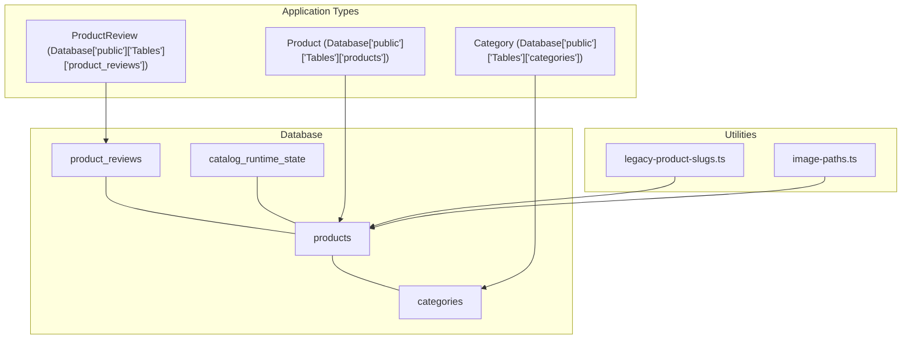
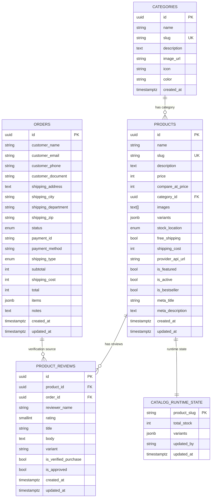
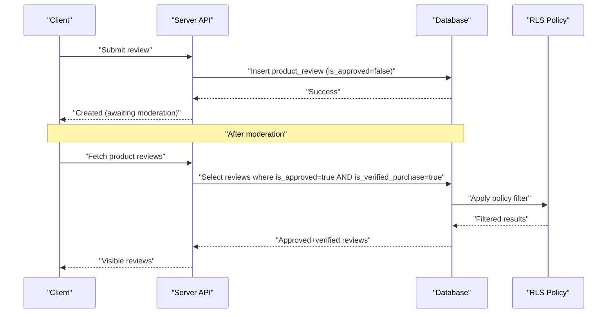
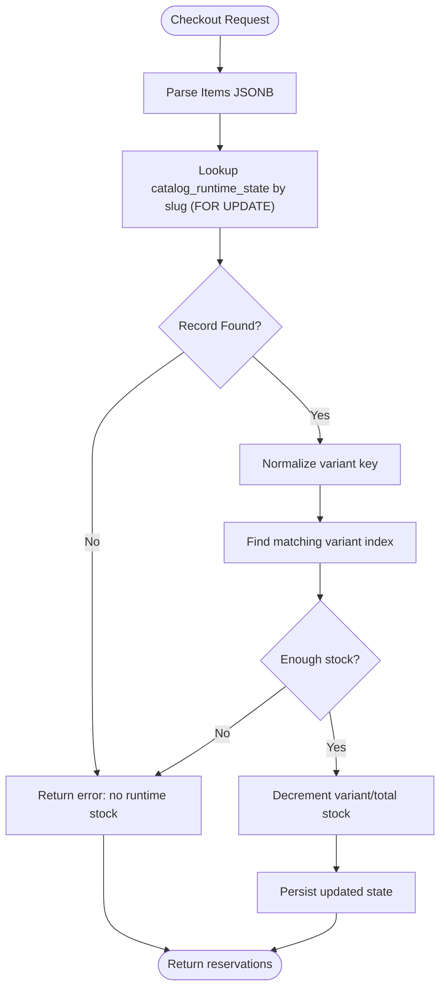
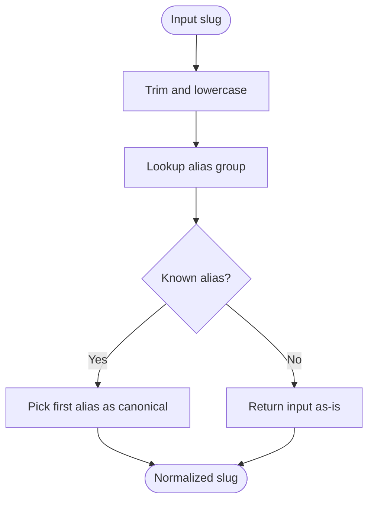
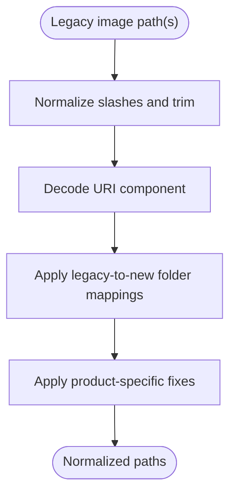
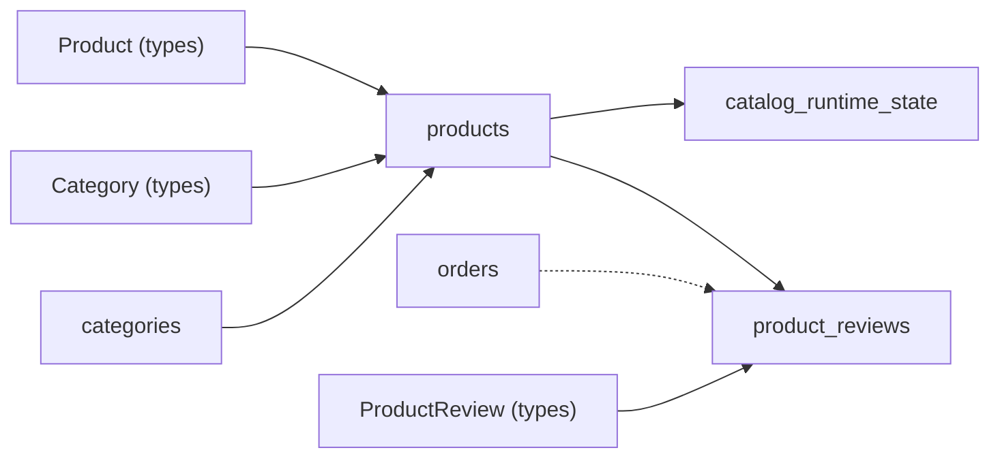

# Product Data Model

<cite>
**Referenced Files in This Document**
- [schema.sql](file://schema.sql)
- [01_schema.sql](file://sql/01_schema.sql)
- [database.ts](file://src/types/database.ts)
- [legacy-product-slugs.ts](file://src/lib/legacy-product-slugs.ts)
- [image-paths.ts](file://src/lib/image-paths.ts)
- [03_seed_product_reviews.sql](file://sql/03_seed_product_reviews.sql)
- [product-page-content.ts](file://src/lib/product-page-content.ts)
- [search.route.ts](file://src/app/api/products/search/route.ts)
</cite>

## Table of Contents
1. [Introduction](#introduction)
2. [Project Structure](#project-structure)
3. [Core Components](#core-components)
4. [Architecture Overview](#architecture-overview)
5. [Detailed Component Analysis](#detailed-component-analysis)
6. [Dependency Analysis](#dependency-analysis)
7. [Performance Considerations](#performance-considerations)
8. [Troubleshooting Guide](#troubleshooting-guide)
9. [Conclusion](#conclusion)
10. [Appendices](#appendices)

## Introduction
This document describes the product data model for the ecommerce system. It covers the Product entity, ProductVariant, ProductReview, and supporting structures. It also documents relationships among products, categories, and variants, along with validation rules, business constraints, and normalization utilities for legacy slugs and image paths. Examples illustrate product creation, variant management, and runtime stock normalization.

## Project Structure
The product domain spans database schema, TypeScript type definitions, and runtime utilities:
- Database schema defines tables, constraints, indexes, triggers, and policies.
- Type definitions describe entity shapes and relationships in the application layer.
- Utilities handle legacy slug normalization and image path normalization.

**Diagram sources**
- [schema.sql:11-47](file://schema.sql#L11-L47)
- [01_schema.sql:13-85](file://sql/01_schema.sql#L13-L85)
- [database.ts:96-182](file://src/types/database.ts#L96-L182)
- [legacy-product-slugs.ts:1-69](file://src/lib/legacy-product-slugs.ts#L1-L69)
- [image-paths.ts:1-78](file://src/lib/image-paths.ts#L1-L78)

**Section sources**
- [schema.sql:11-47](file://schema.sql#L11-L47)
- [01_schema.sql:13-85](file://sql/01_schema.sql#L13-L85)
- [database.ts:96-182](file://src/types/database.ts#L96-L182)
- [legacy-product-slugs.ts:1-69](file://src/lib/legacy-product-slugs.ts#L1-L69)
- [image-paths.ts:1-78](file://src/lib/image-paths.ts#L1-L78)

## Core Components
This section defines the primary entities and their fields, types, constraints, and relationships.

- categories
  - Purpose: Product taxonomy with unique slugs and optional metadata.
  - Key fields: id, name, slug (unique), description, image_url, icon, color, created_at.
  - Constraints: Unique slug; created_at default timestamp.
  - Indexes: slug.

- products
  - Purpose: Base product record with pricing, inventory metadata, SEO fields, and variants container.
  - Key fields:
    - id, name, slug (unique), description, price (non-negative), compare_at_price (optional, non-negative), category_id (foreign key to categories), images (array of URLs), variants (JSONB array of variants), stock_location ("nacional" | "internacional" | "ambos"), free_shipping, shipping_cost, provider_api_url, is_featured, is_active, is_bestseller, meta_title, meta_description, created_at, updated_at.
  - Constraints: Category reference restrict; price and compare_at_price non-negative; stock_location enum; unique slug; RLS policy exposes only active products to public select.
  - Indexes: category_id, slug, is_featured (filtered), is_active (filtered), updated_at on catalog_runtime_state.

- product_reviews
  - Purpose: Customer feedback with verification and approval workflow.
  - Key fields:
    - id, product_id (FK to products), order_id (FK to orders), reviewer_name, rating (1–5), title, body (min length after trimming), variant, is_verified_purchase, is_approved, created_at, updated_at.
  - Constraints: Rating range; body min length; RLS policy exposes only approved and verified purchases for public select.

- catalog_runtime_state
  - Purpose: Operational stock snapshot per product slug with variant-level stock and total stock.
  - Key fields: product_slug (PK, references products(slug)), total_stock (non-negative), variants (JSONB), updated_by, updated_at.
  - Constraints: Cascade delete on slug change; normalized variant keys via helper function; RLS policies block client access.

- Orders and Fulfillment Logs
  - Orders: Customer info, shipping, status, items (JSONB), totals, notes.
  - Fulfillment logs: Order actions, payloads, responses, status.
  - These support product review linkage to purchase verification and stock reservation workflows.

Relationships
- products.category_id → categories.id (RESTRICT)
- product_reviews.product_id → products.id (CASCADE)
- product_reviews.order_id → orders.id (SET NULL)
- catalog_runtime_state.product_slug → products.slug (CASCADE)

Validation and Business Rules
- Price and cost fields are integers representing cents or smallest currency unit; non-negative checks enforced.
- Variants stored as JSONB; variant selection validated via normalized keys.
- Slug uniqueness ensures deterministic product lookup.
- RLS policies:
  - Public can select active products.
  - Public can select approved and verified reviews.
  - Orders, fulfillment logs, and runtime state are fully restricted to service roles.

**Section sources**
- [schema.sql:11-47](file://schema.sql#L11-L47)
- [schema.sql:78-93](file://schema.sql#L78-L93)
- [schema.sql:120-128](file://schema.sql#L120-L128)
- [01_schema.sql:13-45](file://sql/01_schema.sql#L13-L45)
- [01_schema.sql:72-85](file://sql/01_schema.sql#L72-L85)
- [01_schema.sql:105-111](file://sql/01_schema.sql#L105-L111)
- [01_schema.sql:213-221](file://sql/01_schema.sql#L213-L221)

## Architecture Overview
The product data model integrates database constraints, application types, and runtime utilities to support:
- Product catalog ingestion and presentation
- Variant selection and stock management
- Review moderation and visibility
- Legacy slug and asset path normalization

**Diagram sources**
- [schema.sql:11-47](file://schema.sql#L11-L47)
- [schema.sql:78-93](file://schema.sql#L78-L93)
- [schema.sql:120-128](file://schema.sql#L120-L128)

## Detailed Component Analysis

### Product Entity
Fields and constraints
- Identity: id (UUID), slug (unique)
- Content: name, description, meta_title, meta_description
- Pricing: price (non-negative), compare_at_price (optional, non-negative)
- Inventory and logistics: images (array), variants (JSONB), stock_location enum, free_shipping, shipping_cost, provider_api_url
- Flags: is_featured, is_active, is_bestseller
- Timestamps: created_at, updated_at (auto-updated via trigger)
- Relationships: category_id → categories.id (RESTRICT)

Validation and normalization
- Slug uniqueness prevents ambiguity in lookup.
- Price and cost fields are integers; non-negative checks enforce financial integrity.
- Variants stored as JSONB; variant selection validated via normalized keys in runtime stock functions.

Runtime stock integration
- catalog_runtime_state holds operational stock snapshots keyed by product slug, enabling reserve/restore stock operations without locking product rows during checkout.

**Section sources**
- [schema.sql:25-47](file://schema.sql#L25-L47)
- [01_schema.sql:24-45](file://sql/01_schema.sql#L24-L45)
- [01_schema.sql:253-394](file://sql/01_schema.sql#L253-L394)

### ProductVariant Model
Structure
- name: Variant descriptor (e.g., "Color", "Size").
- options: List of selectable values (e.g., ["Red", "Blue"], ["Small", "Large"]).

Usage
- Stored in products.variants as JSONB array.
- Selected during checkout; normalized via helper function to match stored variant names.

Normalization and selection
- Variant keys normalized to lowercase, trimmed, and collapsed whitespace to ensure robust matching against stored variants.

**Section sources**
- [database.ts:13-16](file://src/types/database.ts#L13-L16)
- [01_schema.sql:244-251](file://sql/01_schema.sql#L244-L251)
- [01_schema.sql:324-329](file://sql/01_schema.sql#L324-L329)

### ProductReview Model and Workflows
Fields
- product_id (FK), order_id (FK), reviewer_name, rating (1–5), title, body (min length after trimming), variant, is_verified_purchase, is_approved, timestamps.

Verification and approval workflow
- is_verified_purchase defaults to true; linked to order_id to confirm purchase.
- is_approved defaults to false; public visibility requires both is_approved=true and is_verified_purchase=true.
- Seed script inserts realistic reviews with approved=true for demonstration.

**Diagram sources**
- [schema.sql:78-93](file://schema.sql#L78-L93)
- [01_schema.sql:72-85](file://sql/01_schema.sql#L72-L85)
- [01_schema.sql:219-221](file://sql/01_schema.sql#L219-L221)

**Section sources**
- [schema.sql:78-93](file://schema.sql#L78-L93)
- [01_schema.sql:72-85](file://sql/01_schema.sql#L72-L85)
- [03_seed_product_reviews.sql:8-28](file://sql/03_seed_product_reviews.sql#L8-L28)
- [03_seed_product_reviews.sql:30-49](file://sql/03_seed_product_reviews.sql#L30-L49)

### Runtime Stock Management and Variant Matching
Purpose
- Reserve and restore stock atomically per product slug and variant, ensuring consistency during checkout.

Key functions
- reserve_catalog_stock(items JSONB, updated_by TEXT):
  - Groups items by slug and variant, validates presence, normalizes variant keys, checks availability, decrements variant and/or total stock, updates catalog_runtime_state, and returns reservations.
- restore_catalog_stock(reservations JSONB, updated_by TEXT):
  - Reverses reservations by incrementing variant and/or total stock.

**Diagram sources**
- [01_schema.sql:253-394](file://sql/01_schema.sql#L253-L394)
- [01_schema.sql:397-493](file://sql/01_schema.sql#L397-L493)

**Section sources**
- [01_schema.sql:253-394](file://sql/01_schema.sql#L253-L394)
- [01_schema.sql:397-493](file://sql/01_schema.sql#L397-L493)

### Legacy Product Slug Handling
Purpose
- Normalize potentially inconsistent slugs to canonical forms for reliable product lookup.

Mechanics
- Groupings define alias sets for related slugs.
- Normalization trims, lowercases, and selects the first alias as canonical.

**Diagram sources**
- [legacy-product-slugs.ts:32-69](file://src/lib/legacy-product-slugs.ts#L32-L69)

**Section sources**
- [legacy-product-slugs.ts:1-69](file://src/lib/legacy-product-slugs.ts#L1-L69)

### Image Path Normalization
Purpose
- Normalize legacy image paths to current folder structure and handle special cases.

Mechanics
- Normalize slashes, decode URI, apply legacy-to-new folder mappings, and adjust specific product folders when patterns match.

**Diagram sources**
- [image-paths.ts:33-78](file://src/lib/image-paths.ts#L33-L78)

**Section sources**
- [image-paths.ts:1-78](file://src/lib/image-paths.ts#L1-L78)

### Product Page Content and Social Proof
Purpose
- Provide highlights, guarantees, and social proof badges per product slug for marketing and trust signals.

Mechanics
- Slugs mapped to predefined arrays; defaults applied when missing.

**Section sources**
- [product-page-content.ts:13-239](file://src/lib/product-page-content.ts#L13-L239)

### Example Workflows

#### Creating a Product
Steps
- Define base product with name, slug, description, price, category_id, images, variants, stock_location, flags, and metadata.
- Ensure slug uniqueness and non-negative prices.
- Optionally set free_shipping and shipping_cost.

Validation
- Database enforces unique slug, non-negative prices, and category foreign key.

**Section sources**
- [schema.sql:25-47](file://schema.sql#L25-L47)
- [01_schema.sql:24-45](file://sql/01_schema.sql#L24-L45)

#### Managing Variants
Steps
- Store variants as JSONB array with name and options.
- During checkout, normalize variant input and match against stored variants.
- Reserve/restore stock per variant and total stock.

Validation
- Variant keys normalized to avoid mismatches due to whitespace or casing.

**Section sources**
- [database.ts:13-16](file://src/types/database.ts#L13-L16)
- [01_schema.sql:244-251](file://sql/01_schema.sql#L244-L251)
- [01_schema.sql:324-329](file://sql/01_schema.sql#L324-L329)

#### Data Normalization Processes
Steps
- Normalize legacy slugs before lookup to ensure canonical resolution.
- Normalize legacy image paths to current folder structure to maintain asset accessibility.

**Section sources**
- [legacy-product-slugs.ts:32-69](file://src/lib/legacy-product-slugs.ts#L32-L69)
- [image-paths.ts:33-78](file://src/lib/image-paths.ts#L33-L78)

## Dependency Analysis
- Products depend on categories via category_id.
- Reviews depend on products and optionally on orders for verification.
- Runtime stock depends on product slugs and variant normalization.
- Application types mirror database schemas and relationships.

**Diagram sources**
- [schema.sql:11-47](file://schema.sql#L11-L47)
- [schema.sql:78-93](file://schema.sql#L78-L93)
- [schema.sql:120-128](file://schema.sql#L120-L128)
- [database.ts:96-182](file://src/types/database.ts#L96-L182)

**Section sources**
- [schema.sql:11-47](file://schema.sql#L11-L47)
- [schema.sql:78-93](file://schema.sql#L78-L93)
- [schema.sql:120-128](file://schema.sql#L120-L128)
- [database.ts:96-182](file://src/types/database.ts#L96-L182)

## Performance Considerations
- Indexes
  - Products: category_id, slug, is_featured filtered, is_active filtered.
  - Reviews: product_id, composite index for public visibility.
  - Runtime state: updated_at descending for recent queries.
- Triggers
  - Auto-update updated_at on products and reviews to support efficient sorting and caching.
- RLS
  - Policies limit exposure to active products and approved+verified reviews, reducing unnecessary scans.

[No sources needed since this section provides general guidance]

## Troubleshooting Guide
Common issues and resolutions
- Duplicate slug errors
  - Cause: Attempting to insert/update product with existing slug.
  - Resolution: Ensure slug uniqueness; use canonicalization utilities for legacy slugs.

- Negative price or cost values
  - Cause: Invalid numeric input.
  - Resolution: Enforce non-negative checks; validate before insert/update.

- Variant mismatch during checkout
  - Cause: Whitespace or casing differences between selected variant and stored variant names.
  - Resolution: Normalize variant keys using provided helper; confirm variants array contains expected options.

- Insufficient stock
  - Cause: Attempting to reserve more than available.
  - Resolution: Check catalog_runtime_state; ensure variant and/or total stock is sufficient.

- Review not visible
  - Cause: is_approved or is_verified_purchase not set appropriately.
  - Resolution: Confirm moderation and purchase verification; ensure RLS policy conditions are met.

**Section sources**
- [schema.sql:25-47](file://schema.sql#L25-L47)
- [schema.sql:78-93](file://schema.sql#L78-L93)
- [01_schema.sql:253-394](file://sql/01_schema.sql#L253-L394)
- [01_schema.sql:219-221](file://sql/01_schema.sql#L219-L221)

## Conclusion
The product data model combines relational integrity with JSONB flexibility to represent variants and runtime stock. Robust constraints, indexes, and RLS policies ensure correctness, performance, and controlled access. Utilities for slug and image path normalization improve resilience against legacy inconsistencies. The review workflow balances user-generated content with moderation controls, while stock functions enable safe concurrent checkout operations.

[No sources needed since this section summarizes without analyzing specific files]

## Appendices

### Field Reference: Products
- id: UUID, primary key
- name: Text, required
- slug: Text, unique, required
- description: Text, required
- price: Integer, required, non-negative
- compare_at_price: Integer, nullable, non-negative
- category_id: UUID, foreign key to categories
- images: Text[], required, default empty
- variants: JSONB, required, default empty array
- stock_location: Enum ("nacional","internacional","ambos")
- free_shipping: Boolean, default false
- shipping_cost: Integer, nullable
- provider_api_url: Text, nullable
- is_featured: Boolean, default false
- is_active: Boolean, default true
- is_bestseller: Boolean, nullable
- meta_title: Text, nullable
- meta_description: Text, nullable
- created_at/updated_at: Timestamps, auto-managed

**Section sources**
- [schema.sql:25-47](file://schema.sql#L25-L47)
- [01_schema.sql:24-45](file://sql/01_schema.sql#L24-L45)

### Field Reference: Categories
- id: UUID, primary key
- name: Text, required
- slug: Text, unique, required
- description: Text, nullable
- image_url: Text, nullable
- icon: Text, nullable
- color: Text, nullable
- created_at: Timestamp

**Section sources**
- [schema.sql:11-20](file://schema.sql#L11-L20)
- [01_schema.sql:13-22](file://sql/01_schema.sql#L13-L22)

### Field Reference: ProductReviews
- id: UUID, primary key
- product_id: UUID, foreign key to products
- order_id: UUID, foreign key to orders
- reviewer_name: Text, nullable
- rating: Small integer, required, 1–5
- title: Text, nullable
- body: Text, required, minimum length after trimming
- variant: Text, nullable
- is_verified_purchase: Boolean, default true
- is_approved: Boolean, default false
- created_at/updated_at: Timestamps, auto-managed

**Section sources**
- [schema.sql:78-93](file://schema.sql#L78-L93)
- [01_schema.sql:72-85](file://sql/01_schema.sql#L72-L85)

### Field Reference: Catalog Runtime State
- product_slug: Text, primary key, references products(slug)
- total_stock: Integer, nullable, non-negative
- variants: JSONB, required, default empty array
- updated_by: Text, nullable
- updated_at: Timestamp, default now

**Section sources**
- [schema.sql:120-128](file://schema.sql#L120-L128)
- [01_schema.sql:105-111](file://sql/01_schema.sql#L105-L111)

### Example: Product Search Endpoint
- Returns minimal product data for search indexing and caching.
- Applies cache headers for performance.

**Section sources**
- [search.route.ts:1-31](file://src/app/api/products/search/route.ts#L1-L31)