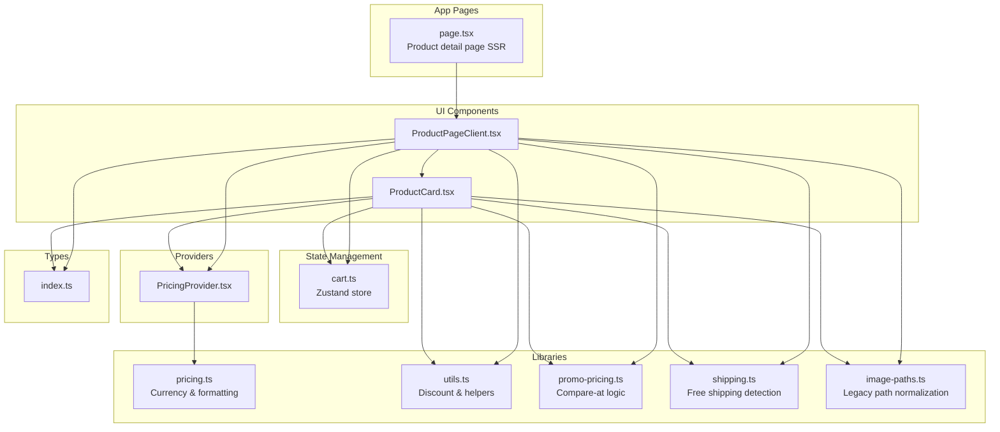
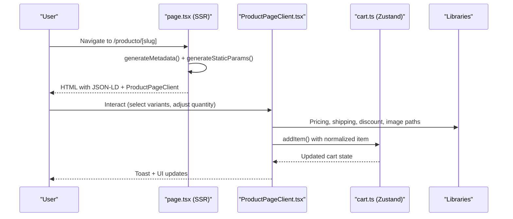
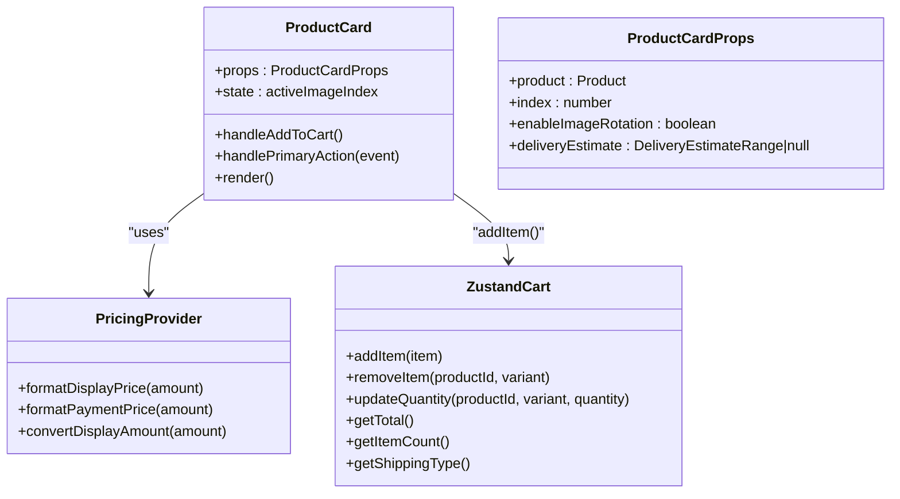
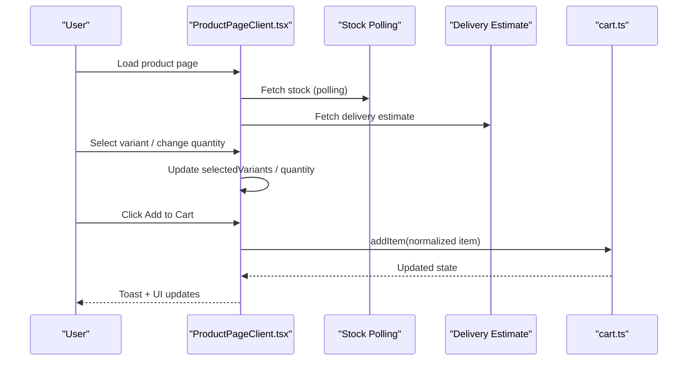
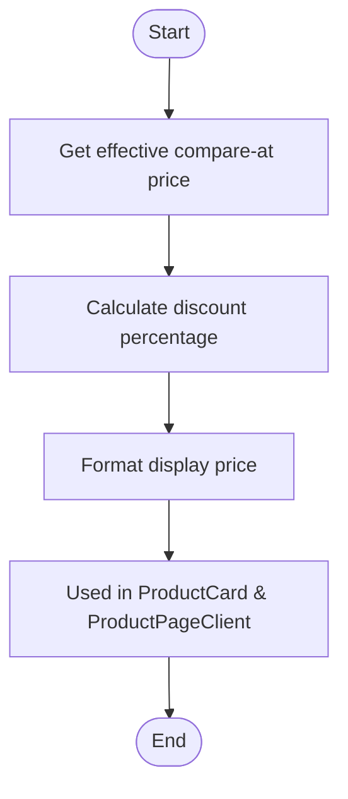
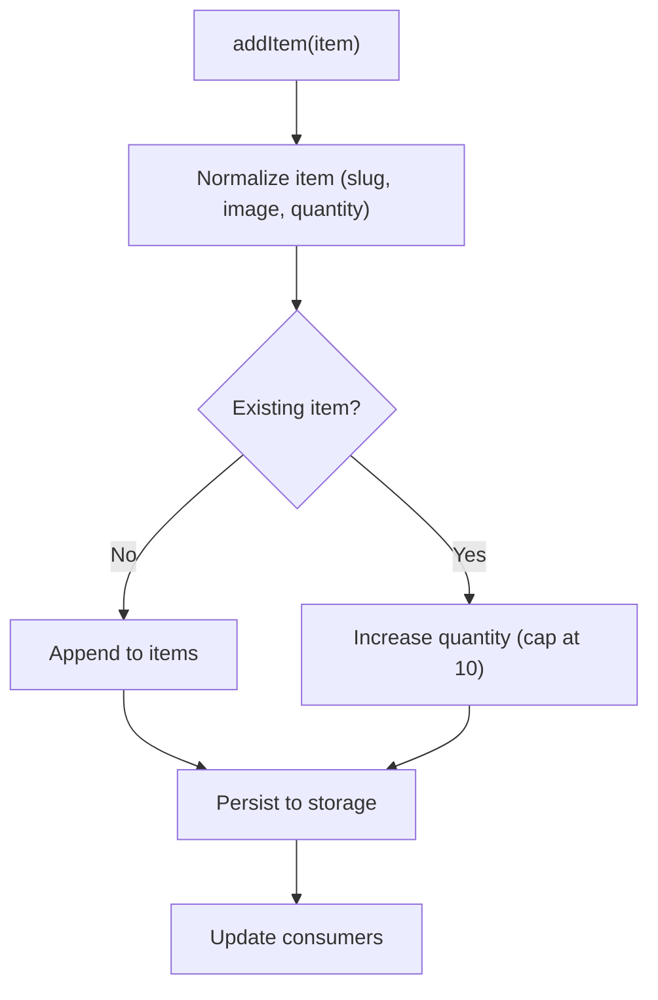
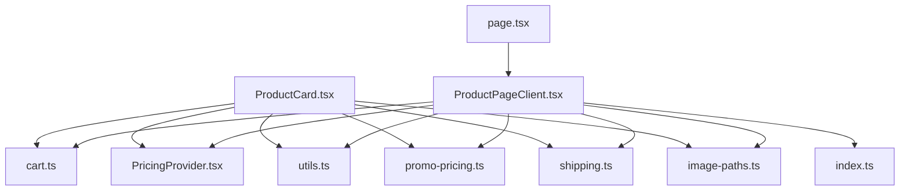

# Product Display Components

<cite>
**Referenced Files in This Document**
- [ProductCard.tsx](file://src/components/ProductCard.tsx)
- [ProductPageClient.tsx](file://src/app/producto/[slug]/ProductPageClient.tsx)
- [page.tsx](file://src/app/producto/[slug]/page.tsx)
- [cart.ts](file://src/store/cart.ts)
- [pricing.ts](file://src/lib/pricing.ts)
- [utils.ts](file://src/lib/utils.ts)
- [promo-pricing.ts](file://src/lib/promo-pricing.ts)
- [shipping.ts](file://src/lib/shipping.ts)
- [image-paths.ts](file://src/lib/image-paths.ts)
- [PricingProvider.tsx](file://src/providers/PricingProvider.tsx)
- [index.ts](file://src/types/index.ts)
</cite>

## Table of Contents
1. [Introduction](#introduction)
2. [Project Structure](#project-structure)
3. [Core Components](#core-components)
4. [Architecture Overview](#architecture-overview)
5. [Detailed Component Analysis](#detailed-component-analysis)
6. [Dependency Analysis](#dependency-analysis)
7. [Performance Considerations](#performance-considerations)
8. [Accessibility and SEO](#accessibility-and-seo)
9. [Troubleshooting Guide](#troubleshooting-guide)
10. [Conclusion](#conclusion)

## Introduction
This document provides comprehensive documentation for product display components and UI elements in the e-commerce application. It focuses on:
- ProductCard component: image display, pricing, ratings, and add-to-cart functionality
- Product detail page: image galleries, variant selectors, quantity controls, and specification displays
- Component props, state management, and user interaction patterns
- Responsive design considerations, lazy loading for images, and performance optimizations
- Integration with shopping cart state, stock availability indicators, and pricing calculations
- Accessibility features, SEO optimization through structured data, and cross-browser compatibility

## Project Structure
The product display functionality spans several layers:
- UI components under src/components
- Product detail page under src/app/producto/[slug]
- State management under src/store
- Pricing and utility libraries under src/lib
- Providers under src/providers
- Type definitions under src/types

**Diagram sources**
- [ProductCard.tsx:1-305](file://src/components/ProductCard.tsx#L1-L305)
- [ProductPageClient.tsx:1-1099](file://src/app/producto/[slug]/ProductPageClient.tsx#L1-L1099)
- [page.tsx:1-249](file://src/app/producto/[slug]/page.tsx#L1-L249)
- [cart.ts:1-149](file://src/store/cart.ts#L1-L149)
- [pricing.ts:1-146](file://src/lib/pricing.ts#L1-L146)
- [utils.ts:1-102](file://src/lib/utils.ts#L1-L102)
- [promo-pricing.ts:1-25](file://src/lib/promo-pricing.ts#L1-L25)
- [shipping.ts:1-73](file://src/lib/shipping.ts#L1-L73)
- [image-paths.ts:1-78](file://src/lib/image-paths.ts#L1-L78)
- [PricingProvider.tsx:1-63](file://src/providers/PricingProvider.tsx#L1-L63)
- [index.ts:1-30](file://src/types/index.ts#L1-L30)

**Section sources**
- [ProductCard.tsx:1-305](file://src/components/ProductCard.tsx#L1-L305)
- [ProductPageClient.tsx:1-1099](file://src/app/producto/[slug]/ProductPageClient.tsx#L1-L1099)
- [page.tsx:1-249](file://src/app/producto/[slug]/page.tsx#L1-L249)

## Core Components
This section documents the primary components involved in product display and interaction.

### ProductCard
The ProductCard component renders a compact product preview with:
- Image gallery with rotation support
- Pricing display with compare-at price and discount calculation
- Ratings and trust badges
- Add-to-cart action with variant-aware selection
- Free shipping badge and delivery estimate integration

Key props and behavior:
- Props: product (Product), index (number), enableImageRotation (boolean), deliveryEstimate (DeliveryEstimateRange|null)
- State: activeImageIndex for rotating images
- Actions: handleAddToCart, handlePrimaryAction (navigate vs add)
- Integrations: PricingProvider for display formatting, shipping detection, discount calculation, image normalization

Responsive and accessibility features:
- Next.js Image with sizes and priority attributes
- Hover effects and focus-visible ring for keyboard navigation
- ARIA labels for screen readers

**Section sources**
- [ProductCard.tsx:20-32](file://src/components/ProductCard.tsx#L20-L32)
- [ProductCard.tsx:33-115](file://src/components/ProductCard.tsx#L33-L115)
- [ProductCard.tsx:119-304](file://src/components/ProductCard.tsx#L119-L304)

### Product Detail Page (SSR + Client)
The product detail page combines server-rendered metadata and client-side interactivity:
- SSR: generateMetadata, generateStaticParams, canonical URLs, Open Graph, Twitter cards, and structured data (JSON-LD)
- Client: interactive image gallery, variant selectors, quantity controls, stock polling, delivery estimates, add-to-cart

Key features:
- Image gallery with thumbnail navigation and lazy loading
- Variant selection logic with color mapping and stock-aware options
- Quantity controls with disabled states when out of stock
- Real-time stock updates and urgency indicators
- Delivery estimate fetching with fallbacks
- Structured data for SEO (Product, AggregateRating, BreadcrumbList)

**Section sources**
- [page.tsx:19-34](file://src/app/producto/[slug]/page.tsx#L19-L34)
- [page.tsx:36-102](file://src/app/producto/[slug]/page.tsx#L36-L102)
- [page.tsx:104-248](file://src/app/producto/[slug]/page.tsx#L104-L248)
- [ProductPageClient.tsx:98-104](file://src/app/producto/[slug]/ProductPageClient.tsx#L98-L104)
- [ProductPageClient.tsx:452-1099](file://src/app/producto/[slug]/ProductPageClient.tsx#L452-L1099)

## Architecture Overview
The product display architecture integrates SSR metadata generation with client-side interactivity and state management.

**Diagram sources**
- [page.tsx:36-102](file://src/app/producto/[slug]/page.tsx#L36-L102)
- [ProductPageClient.tsx:322-336](file://src/app/producto/[slug]/ProductPageClient.tsx#L322-L336)
- [cart.ts:62-81](file://src/store/cart.ts#L62-L81)
- [pricing.ts:113-144](file://src/lib/pricing.ts#L113-L144)
- [utils.ts:24-27](file://src/lib/utils.ts#L24-L27)
- [shipping.ts:37-53](file://src/lib/shipping.ts#L37-L53)
- [image-paths.ts:40-72](file://src/lib/image-paths.ts#L40-L72)

## Detailed Component Analysis

### ProductCard Component Analysis
The ProductCard component encapsulates a single product preview with integrated cart actions and visual enhancements.

**Diagram sources**
- [ProductCard.tsx:20-32](file://src/components/ProductCard.tsx#L20-L32)
- [ProductCard.tsx:34-103](file://src/components/ProductCard.tsx#L34-L103)
- [cart.ts:39-51](file://src/store/cart.ts#L39-L51)
- [PricingProvider.tsx:12-18](file://src/providers/PricingProvider.tsx#L12-L18)

Implementation highlights:
- Image rotation loop controlled by enableImageRotation and visibility checks
- Discount calculation using compare-at price and product price
- Fake rating and sold count derived from product slug for deterministic UX
- Free shipping badge determined by shipping library
- Pricing formatting via PricingProvider

**Section sources**
- [ProductCard.tsx:41-86](file://src/components/ProductCard.tsx#L41-L86)
- [ProductCard.tsx:88-115](file://src/components/ProductCard.tsx#L88-L115)
- [ProductCard.tsx:134-192](file://src/components/ProductCard.tsx#L134-L192)
- [ProductCard.tsx:234-272](file://src/components/ProductCard.tsx#L234-L272)
- [ProductCard.tsx:276-300](file://src/components/ProductCard.tsx#L276-L300)

### Product Detail Page Client Analysis
The ProductPageClient component manages the full product detail experience with advanced interactivity.

**Diagram sources**
- [ProductPageClient.tsx:380-450](file://src/app/producto/[slug]/ProductPageClient.tsx#L380-L450)
- [ProductPageClient.tsx:338-378](file://src/app/producto/[slug]/ProductPageClient.tsx#L338-L378)
- [ProductPageClient.tsx:322-336](file://src/app/producto/[slug]/ProductPageClient.tsx#L322-L336)
- [cart.ts:62-81](file://src/store/cart.ts#L62-L81)

Key features and logic:
- Variant selection with color mapping and stock-aware options
- Color image hints for precise image association
- Stock polling with live updates and urgency indicators
- Delivery estimate fetching with delayed initialization
- Quantity controls with disabled states when out of stock
- Out-of-stock placeholders and messaging
- Structured data rendering for SEO

**Section sources**
- [ProductPageClient.tsx:105-131](file://src/app/producto/[slug]/ProductPageClient.tsx#L105-L131)
- [ProductPageClient.tsx:155-217](file://src/app/producto/[slug]/ProductPageClient.tsx#L155-L217)
- [ProductPageClient.tsx:234-247](file://src/app/producto/[slug]/ProductPageClient.tsx#L234-L247)
- [ProductPageClient.tsx:249-275](file://src/app/producto/[slug]/ProductPageClient.tsx#L249-L275)
- [ProductPageClient.tsx:322-336](file://src/app/producto/[slug]/ProductPageClient.tsx#L322-L336)
- [ProductPageClient.tsx:380-450](file://src/app/producto/[slug]/ProductPageClient.tsx#L380-L450)
- [ProductPageClient.tsx:743-793](file://src/app/producto/[slug]/ProductPageClient.tsx#L743-L793)
- [ProductPageClient.tsx:802-844](file://src/app/producto/[slug]/ProductPageClient.tsx#L802-L844)

### Pricing and Discount Calculation
Pricing and discount logic ensures consistent display and calculation across components.

**Diagram sources**
- [promo-pricing.ts:15-23](file://src/lib/promo-pricing.ts#L15-L23)
- [utils.ts:24-27](file://src/lib/utils.ts#L24-L27)
- [PricingProvider.tsx:34-55](file://src/providers/PricingProvider.tsx#L34-L55)

**Section sources**
- [promo-pricing.ts:1-25](file://src/lib/promo-pricing.ts#L1-L25)
- [utils.ts:24-27](file://src/lib/utils.ts#L24-L27)
- [PricingProvider.tsx:34-55](file://src/providers/PricingProvider.tsx#L34-L55)

### Shopping Cart Integration
The cart store manages product items with normalization and persistence.

**Diagram sources**
- [cart.ts:62-81](file://src/store/cart.ts#L62-L81)
- [cart.ts:21-31](file://src/store/cart.ts#L21-L31)
- [cart.ts:125-147](file://src/store/cart.ts#L125-L147)

**Section sources**
- [cart.ts:39-51](file://src/store/cart.ts#L39-L51)
- [cart.ts:62-102](file://src/store/cart.ts#L62-L102)
- [cart.ts:125-147](file://src/store/cart.ts#L125-L147)

## Dependency Analysis
This section maps dependencies between components and libraries.

**Diagram sources**
- [ProductCard.tsx:1-17](file://src/components/ProductCard.tsx#L1-L17)
- [ProductPageClient.tsx:1-41](file://src/app/producto/[slug]/ProductPageClient.tsx#L1-L41)
- [page.tsx:1-14](file://src/app/producto/[slug]/page.tsx#L1-L14)
- [cart.ts:1-8](file://src/store/cart.ts#L1-L8)
- [pricing.ts:1-10](file://src/lib/pricing.ts#L1-L10)
- [utils.ts:1-6](file://src/lib/utils.ts#L1-L6)
- [promo-pricing.ts:1-5](file://src/lib/promo-pricing.ts#L1-L5)
- [shipping.ts:1-8](file://src/lib/shipping.ts#L1-L8)
- [image-paths.ts:1-6](file://src/lib/image-paths.ts#L1-L6)
- [index.ts:1-14](file://src/types/index.ts#L1-L14)

**Section sources**
- [ProductCard.tsx:1-17](file://src/components/ProductCard.tsx#L1-L17)
- [ProductPageClient.tsx:1-41](file://src/app/producto/[slug]/ProductPageClient.tsx#L1-L41)
- [page.tsx:1-14](file://src/app/producto/[slug]/page.tsx#L1-L14)

## Performance Considerations
Performance optimizations implemented across components:

- Lazy loading and sizing:
  - ProductCard uses sizes and priority for first few items to improve Core Web Vitals
  - ProductPageClient uses lazy loading for thumbnails and eager loading for active image
  - Next.js Image with appropriate quality settings

- State and rendering:
  - useMemo for derived values (discount, rating, sold count)
  - useEffect cleanup for intervals and timers
  - startTransition for smooth variant updates

- Network and polling:
  - Stock polling with controlled intervals and visibility-aware refresh
  - Delivery estimate fetching with delayed initialization
  - No-cache fetch for stock endpoint to ensure freshness

- Bundle and hydration:
  - Minimal client-side code in SSR page
  - Zustand persistence with hydration guard

**Section sources**
- [ProductCard.tsx:77-86](file://src/components/ProductCard.tsx#L77-L86)
- [ProductCard.tsx:139-147](file://src/components/ProductCard.tsx#L139-L147)
- [ProductPageClient.tsx:540-567](file://src/app/producto/[slug]/ProductPageClient.tsx#L540-L567)
- [ProductPageClient.tsx:507-516](file://src/app/producto/[slug]/ProductPageClient.tsx#L507-L516)
- [ProductPageClient.tsx:380-450](file://src/app/producto/[slug]/ProductPageClient.tsx#L380-L450)
- [ProductPageClient.tsx:338-378](file://src/app/producto/[slug]/ProductPageClient.tsx#L338-L378)

## Accessibility and SEO
Accessibility features:
- Focus-visible rings for keyboard navigation
- ARIA labels for buttons and interactive elements
- Semantic headings and landmarks
- Proper contrast and readable typography
- Disabled states for out-of-stock options

SEO optimization:
- Structured data (JSON-LD) for Product, AggregateRating, and BreadcrumbList
- Canonical URLs and alternate links
- Open Graph and Twitter card metadata
- Dynamic meta title and description generation
- Revalidation and static generation for performance

Cross-browser compatibility:
- Tailwind CSS utilities with broad browser support
- Next.js Image optimization across browsers
- Polyfills for modern JavaScript features where applicable

**Section sources**
- [page.tsx:36-102](file://src/app/producto/[slug]/page.tsx#L36-L102)
- [page.tsx:130-176](file://src/app/producto/[slug]/page.tsx#L130-L176)
- [page.tsx:202-229](file://src/app/producto/[slug]/page.tsx#L202-L229)
- [ProductCard.tsx:128-132](file://src/components/ProductCard.tsx#L128-L132)
- [ProductPageClient.tsx:807-814](file://src/app/producto/[slug]/ProductPageClient.tsx#L807-L814)

## Troubleshooting Guide
Common issues and resolutions:

- Out-of-stock variants:
  - Symptom: Variant buttons show as disabled/out-of-stock
  - Cause: Stock payload indicates zero or negative stock
  - Resolution: Users can select another variant or wait for restock

- Delivery estimate not loading:
  - Symptom: Loading message persists
  - Cause: Network error or service unavailability
  - Resolution: Retry after delay; fallback to unavailable state

- Cart item normalization:
  - Symptom: Unexpected slug or image path in cart
  - Cause: Legacy image paths or slugs
  - Resolution: Normalization functions handle legacy formats automatically

- Stock polling failures:
  - Symptom: Stock status shows message instead of counts
  - Cause: API errors or timeouts
  - Resolution: Automatic retry; check console for errors

**Section sources**
- [ProductPageClient.tsx:390-425](file://src/app/producto/[slug]/ProductPageClient.tsx#L390-L425)
- [ProductPageClient.tsx:434-450](file://src/app/producto/[slug]/ProductPageClient.tsx#L434-L450)
- [cart.ts:12-31](file://src/store/cart.ts#L12-L31)
- [cart.ts:127-147](file://src/store/cart.ts#L127-L147)

## Conclusion
The product display components provide a robust, accessible, and performant shopping experience:
- ProductCard delivers quick product previews with essential information and seamless add-to-cart actions
- Product detail page offers comprehensive interactivity with variant selection, stock awareness, and delivery estimates
- Integrated pricing, shipping, and cart systems ensure consistent user experience
- Strong emphasis on performance, accessibility, and SEO best practices

These components form the backbone of the product presentation layer and integrate seamlessly with the broader application architecture.