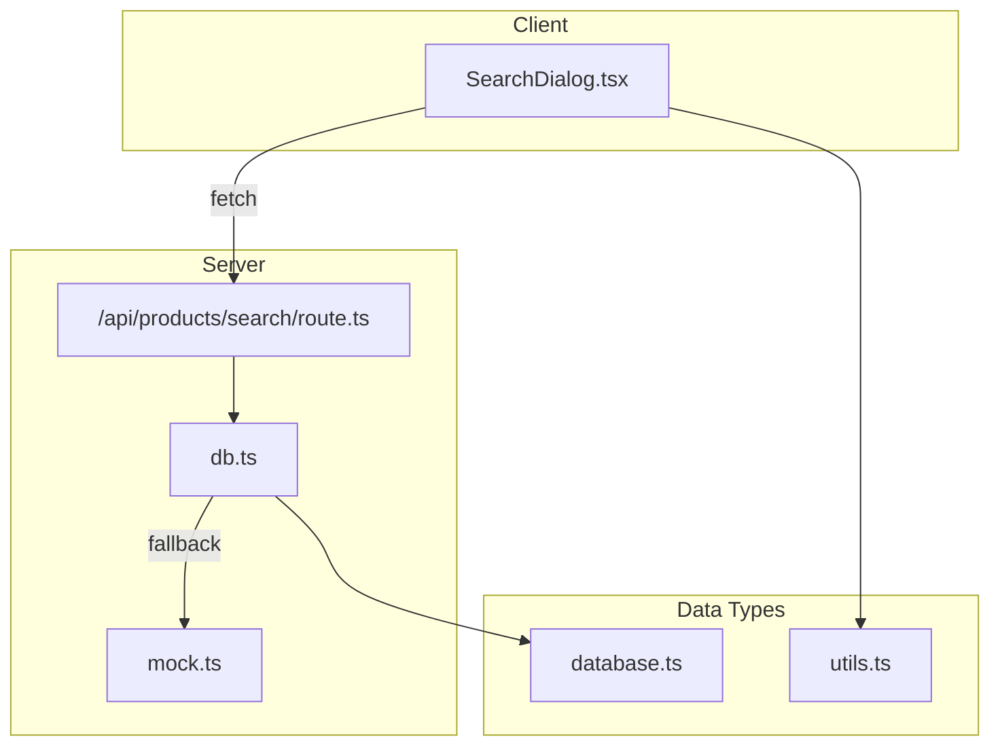
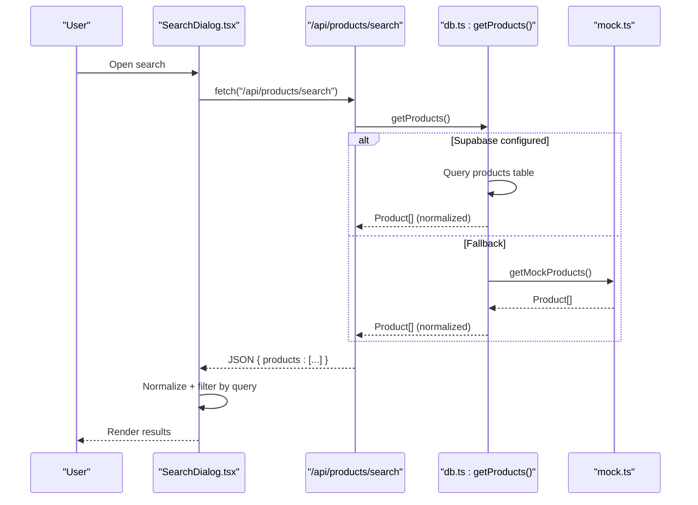
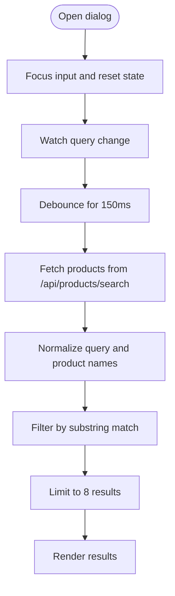
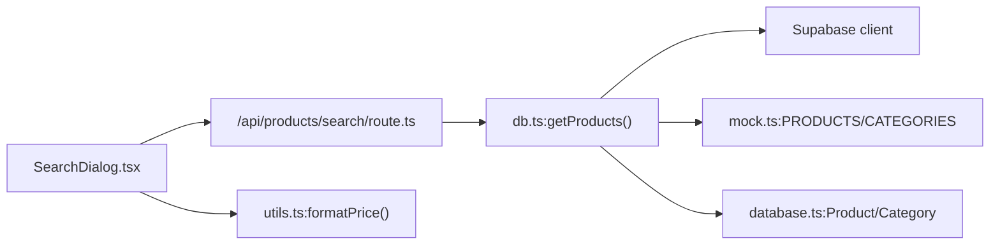

# Search and Discovery

<cite>
**Referenced Files in This Document**
- [route.ts](file://src/app/api/products/search/route.ts)
- [SearchDialog.tsx](file://src/components/SearchDialog.tsx)
- [db.ts](file://src/lib/db.ts)
- [mock.ts](file://src/data/mock.ts)
- [database.ts](file://src/types/database.ts)
- [utils.ts](file://src/lib/utils.ts)
</cite>

## Table of Contents
1. [Introduction](#introduction)
2. [Project Structure](#project-structure)
3. [Core Components](#core-components)
4. [Architecture Overview](#architecture-overview)
5. [Detailed Component Analysis](#detailed-component-analysis)
6. [Dependency Analysis](#dependency-analysis)
7. [Performance Considerations](#performance-considerations)
8. [Troubleshooting Guide](#troubleshooting-guide)
9. [Conclusion](#conclusion)
10. [Appendices](#appendices)

## Introduction
This document explains the product search and discovery system implemented in the application. It covers the current search algorithm (text matching), autocomplete and suggestions, faceted search capabilities, API endpoints, and performance characteristics. It also outlines areas for enhancement such as fuzzy search, relevance scoring, advanced filtering, analytics, and personalization.

## Project Structure
The search and discovery system spans a small set of focused modules:
- API endpoint for retrieving product search data
- Client-side search dialog with live filtering
- Data access layer for products and categories
- Mock data for development and fallback
- Type definitions for product and category entities
- Utility helpers for formatting and normalization

**Diagram sources**
- [route.ts:1-31](file://src/app/api/products/search/route.ts#L1-L31)
- [SearchDialog.tsx:1-202](file://src/components/SearchDialog.tsx#L1-L202)
- [db.ts:146-161](file://src/lib/db.ts#L146-L161)
- [mock.ts:56-344](file://src/data/mock.ts#L56-L344)
- [database.ts:96-294](file://src/types/database.ts#L96-L294)
- [utils.ts:8-22](file://src/lib/utils.ts#L8-L22)

**Section sources**
- [route.ts:1-31](file://src/app/api/products/search/route.ts#L1-L31)
- [SearchDialog.tsx:1-202](file://src/components/SearchDialog.tsx#L1-L202)
- [db.ts:146-161](file://src/lib/db.ts#L146-L161)
- [mock.ts:56-344](file://src/data/mock.ts#L56-L344)
- [database.ts:96-294](file://src/types/database.ts#L96-L294)
- [utils.ts:8-22](file://src/lib/utils.ts#L8-L22)

## Core Components
- Search API endpoint: Returns a curated subset of product data for client-side search and autocomplete.
- Client search dialog: Implements debounced search, normalization, and client-side filtering.
- Data access: Provides product retrieval with deduplication and canonical slug handling.
- Mock data: Supplies development-time product and category datasets.
- Types and utilities: Define product/category shapes and formatting helpers.

Key behaviors:
- The API endpoint caches results for 120 seconds and allows stale-while-revalidate for up to 300 seconds.
- The client performs text normalization and substring matching against product names.
- Products are normalized for slugs and images before being returned.

**Section sources**
- [route.ts:4-26](file://src/app/api/products/search/route.ts#L4-L26)
- [SearchDialog.tsx:24-94](file://src/components/SearchDialog.tsx#L24-L94)
- [db.ts:146-161](file://src/lib/db.ts#L146-L161)
- [mock.ts:56-344](file://src/data/mock.ts#L56-L344)
- [database.ts:114-148](file://src/types/database.ts#L114-L148)
- [utils.ts:8-22](file://src/lib/utils.ts#L8-L22)

## Architecture Overview
The search pipeline is client-server split:
- Server: Serves a static-like snapshot of product metadata.
- Client: Performs interactive filtering and presentation.

**Diagram sources**
- [route.ts:6-26](file://src/app/api/products/search/route.ts#L6-L26)
- [db.ts:146-161](file://src/lib/db.ts#L146-L161)
- [mock.ts:27-29](file://src/data/mock.ts#L27-L29)

**Section sources**
- [route.ts:6-26](file://src/app/api/products/search/route.ts#L6-L26)
- [db.ts:146-161](file://src/lib/db.ts#L146-L161)
- [SearchDialog.tsx:59-73](file://src/components/SearchDialog.tsx#L59-L73)

## Detailed Component Analysis

### Search API Endpoint
- Purpose: Serve product metadata for client-side search.
- Behavior:
  - Retrieves products via the data layer.
  - Maps to a compact shape: id, slug, name, price, first image, category_id.
  - Applies cache-control headers for short-lived caching and background revalidation.
  - Returns empty array on failure for resilience.
- Current limitations:
  - No query parameters, filtering, pagination, or relevance scoring.
  - No autocomplete or suggestions endpoint.

Implementation highlights:
- Endpoint export and caching configuration.
- Response shaping and header configuration.
- Error-handling fallback.

**Section sources**
- [route.ts:1-31](file://src/app/api/products/search/route.ts#L1-L31)
- [db.ts:146-161](file://src/lib/db.ts#L146-L161)

### Client Search Dialog
- Debounced input: Updates the debounced query after 150 ms.
- Normalization: Removes accents, lowercases, trims for robust matching.
- Filtering: Substring match on product name; displays up to 8 results.
- Loading and empty states: Spinner, “no results,” and “no products” messaging.
- Navigation: Links to product pages using slugs.

Algorithm flow:

**Diagram sources**
- [SearchDialog.tsx:33-94](file://src/components/SearchDialog.tsx#L33-L94)
- [route.ts:6-26](file://src/app/api/products/search/route.ts#L6-L26)

**Section sources**
- [SearchDialog.tsx:32-98](file://src/components/SearchDialog.tsx#L32-L98)
- [route.ts:6-26](file://src/app/api/products/search/route.ts#L6-L26)

### Data Access Layer
- getProducts():
  - Uses Supabase when configured; otherwise falls back to mock data.
  - Normalizes products (images, slugs) and removes duplicates by canonical slug.
  - Filters to active products and sorts by creation date.
- Slug normalization and deduplication:
  - Chooses preferred canonical entry based on canonical slug, recency, and image count.
- Other relevant functions:
  - getCategories(), getCategoryBySlug(), getProductsByCategory(), getProductSlugs(), getCategorySlugs().

Data model references:
- Product entity definition includes id, name, slug, description, price, category_id, images, variants, flags, and timestamps.

**Section sources**
- [db.ts:146-161](file://src/lib/db.ts#L146-L161)
- [db.ts:80-107](file://src/lib/db.ts#L80-L107)
- [database.ts:114-148](file://src/types/database.ts#L114-L148)

### Mock Data
- PRODUCTS: Sample product dataset used in development and fallback scenarios.
- CATEGORIES: Sample category dataset for development and fallback scenarios.

Usage:
- getProducts() uses mock data when Supabase is not configured.
- Used to populate initial product lists and for slug normalization.

**Section sources**
- [mock.ts:56-344](file://src/data/mock.ts#L56-L344)
- [db.ts:147-149](file://src/lib/db.ts#L147-L149)

### Types and Utilities
- database.ts: Defines Product, Category, and related table shapes.
- utils.ts: Provides price formatting helpers used by the client to render prices.

**Section sources**
- [database.ts:114-148](file://src/types/database.ts#L114-L148)
- [utils.ts:8-22](file://src/lib/utils.ts#L8-L22)

## Dependency Analysis

**Diagram sources**
- [SearchDialog.tsx:38-39](file://src/components/SearchDialog.tsx#L38-L39)
- [route.ts:1-2](file://src/app/api/products/search/route.ts#L1-L2)
- [db.ts:1-12](file://src/lib/db.ts#L1-L12)
- [mock.ts:1-8](file://src/data/mock.ts#L1-L8)
- [database.ts:96-294](file://src/types/database.ts#L96-L294)
- [utils.ts:8-22](file://src/lib/utils.ts#L8-L22)

**Section sources**
- [SearchDialog.tsx:38-39](file://src/components/SearchDialog.tsx#L38-L39)
- [route.ts:1-2](file://src/app/api/products/search/route.ts#L1-L2)
- [db.ts:1-12](file://src/lib/db.ts#L1-L12)
- [database.ts:96-294](file://src/types/database.ts#L96-L294)

## Performance Considerations
Current state:
- API caching: Short-lived cache with background revalidation reduces server load.
- Client-side filtering: Efficient for moderate product counts but scales poorly as data grows.
- Deduplication and normalization: Prevents redundant rendering and improves slug correctness.

Recommendations (conceptual):
- Indexing strategies:
  - Full-text search index on product name/description.
  - Materialized views for frequently accessed subsets.
- Caching:
  - Add Redis or CDN caching for product snapshots.
  - Cache-filtered result sets per query term.
- Query optimization:
  - Paginate results on the server.
  - Use server-side facets aggregation.
- Client-side:
  - Virtualize long result lists.
  - Debounce thresholds tuned to user behavior.

[No sources needed since this section provides general guidance]

## Troubleshooting Guide
Common issues and resolutions:
- No products shown:
  - Verify Supabase configuration flag and connectivity.
  - Confirm mock data availability during fallback.
- Accent-insensitive matching not working:
  - Ensure normalization logic is applied consistently on both sides.
- Slow filtering on large catalogs:
  - Move filtering to the server with indexed fields and pagination.
- Price formatting inconsistencies:
  - Use the shared formatting utility to ensure locale-appropriate display.

**Section sources**
- [db.ts:147-149](file://src/lib/db.ts#L147-L149)
- [SearchDialog.tsx:24-29](file://src/components/SearchDialog.tsx#L24-L29)
- [utils.ts:8-22](file://src/lib/utils.ts#L8-L22)

## Conclusion
The current search and discovery system provides a functional, client-side search experience backed by a simple API endpoint and mock data fallback. To evolve toward a production-grade solution, introduce server-side filtering, faceted search, fuzzy matching, relevance scoring, and analytics. These enhancements will improve accuracy, performance, and user engagement.

[No sources needed since this section summarizes without analyzing specific files]

## Appendices

### API Reference: Product Search
- Endpoint: GET /api/products/search
- Purpose: Retrieve product metadata for client-side search and autocomplete.
- Response shape:
  - products: array of objects containing id, slug, name, price, images (first image), category_id.
- Caching:
  - Cache-Control: public, s-maxage=120, stale-while-revalidate=300.
- Error handling:
  - On failure, returns an empty products array.

Planned enhancements (conceptual):
- Query parameters: q, category_id, min_price, max_price, sort_by, page, limit.
- Autocomplete endpoint: /api/products/autocomplete with suggestions.
- Facets: Aggregated counts by category, price range, attributes.
- Analytics: Track popular queries and clicked results.

**Section sources**
- [route.ts:6-26](file://src/app/api/products/search/route.ts#L6-L26)
- [db.ts:146-161](file://src/lib/db.ts#L146-L161)

### Example Scenarios
- Basic search:
  - Enter a product name; client filters results by substring match.
- Category browsing:
  - Use category pages to narrow results; combine with text search.
- Popular products:
  - Feature dedicated endpoint for bestsellers or featured items.

**Section sources**
- [SearchDialog.tsx:88-94](file://src/components/SearchDialog.tsx#L88-L94)
- [db.ts:163-181](file://src/lib/db.ts#L163-L181)