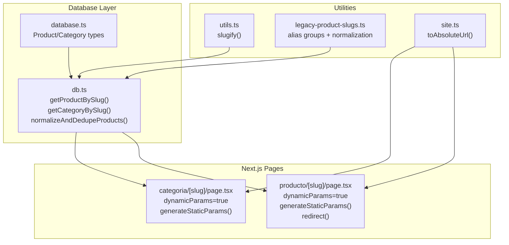
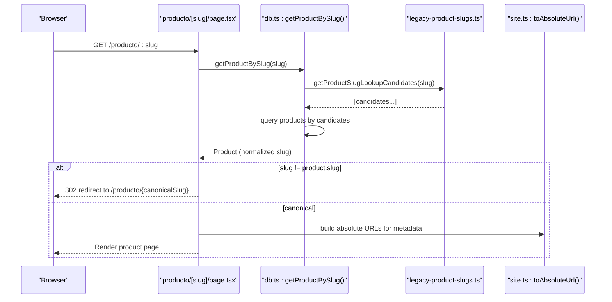
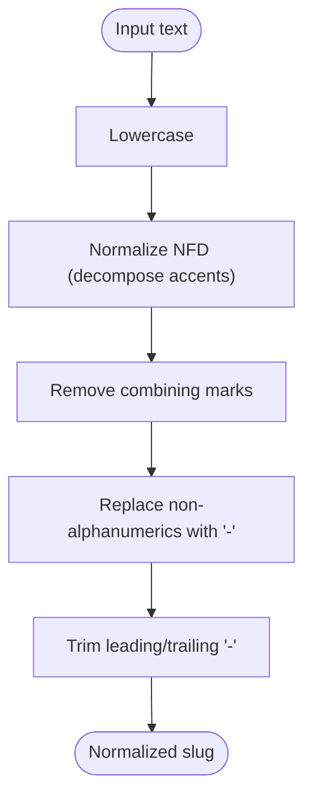
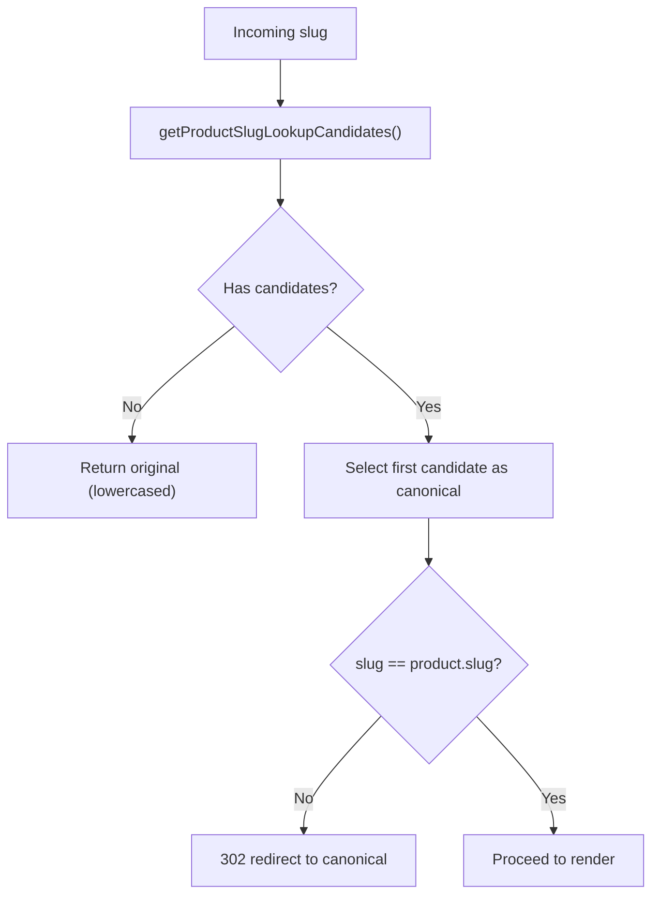
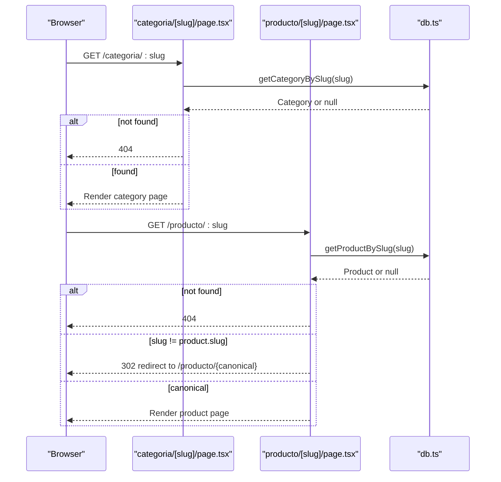
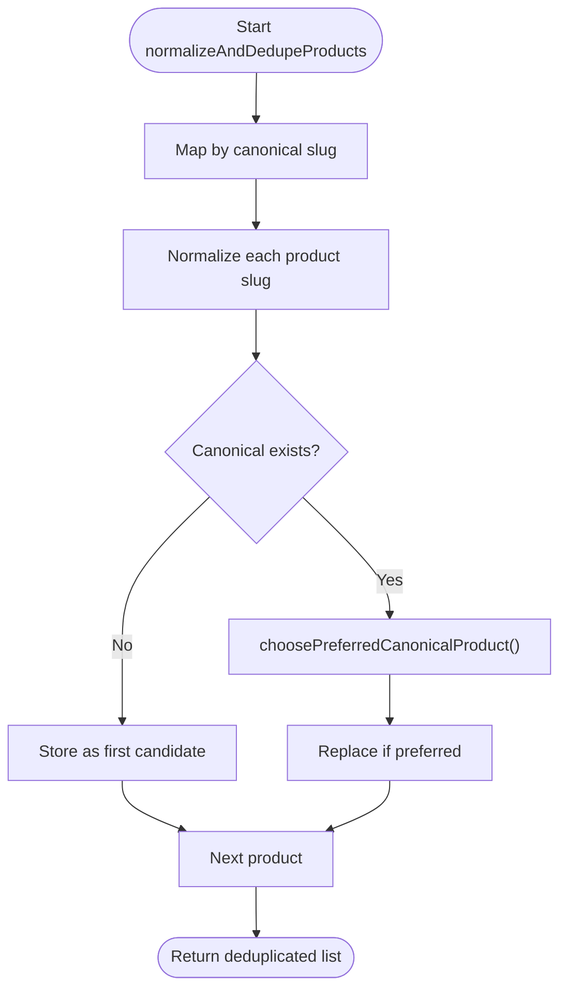
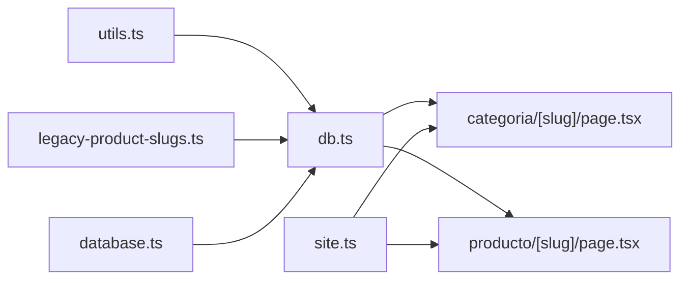

# Slug Generation and URL Routing

<cite>
**Referenced Files in This Document**
- [legacy-product-slugs.ts](file://src/lib/legacy-product-slugs.ts)
- [utils.ts](file://src/lib/utils.ts)
- [db.ts](file://src/lib/db.ts)
- [site.ts](file://src/lib/site.ts)
- [database.ts](file://src/types/database.ts)
- [categoria [slug] page.tsx](file://src/app/categoria/[slug]/page.tsx)
- [producto [slug] page.tsx](file://src/app/producto/[slug]/page.tsx)
</cite>

## Table of Contents
1. [Introduction](#introduction)
2. [Project Structure](#project-structure)
3. [Core Components](#core-components)
4. [Architecture Overview](#architecture-overview)
5. [Detailed Component Analysis](#detailed-component-analysis)
6. [Dependency Analysis](#dependency-analysis)
7. [Performance Considerations](#performance-considerations)
8. [Troubleshooting Guide](#troubleshooting-guide)
9. [Conclusion](#conclusion)

## Introduction
This document explains the slug generation and URL routing system used by the application. It covers:
- Slug normalization for product slugs, including legacy alias handling and duplicate removal
- URL routing using Next.js dynamic routes with slug-based patterns
- Slug generation algorithms for product names, categories, and brands
- Legacy slug detection and redirection to maintain SEO value
- URL structure consistency, parameter encoding, and internationalization considerations
- Slug conflict resolution, uniqueness validation, and slug update workflows

## Project Structure
The slug and routing system spans several layers:
- Utilities for slug generation and normalization
- Database layer for retrieving and normalizing slugs
- Next.js pages using dynamic routes for categories and products
- Type definitions for database entities

**Diagram sources**
- [utils.ts:29-36](file://src/lib/utils.ts#L29-L36)
- [legacy-product-slugs.ts:1-69](file://src/lib/legacy-product-slugs.ts#L1-L69)
- [site.ts:22-25](file://src/lib/site.ts#L22-L25)
- [db.ts:183-224](file://src/lib/db.ts#L183-L224)
- [db.ts:80-107](file://src/lib/db.ts#L80-L107)
- [database.ts:96-148](file://src/types/database.ts#L96-L148)
- [categoria [slug] page.tsx:12-22](file://src/app/categoria/[slug]/page.tsx#L12-L22)
- [producto [slug] page.tsx:16-34](file://src/app/producto/[slug]/page.tsx#L16-L34)

**Section sources**
- [utils.ts:29-36](file://src/lib/utils.ts#L29-L36)
- [legacy-product-slugs.ts:1-69](file://src/lib/legacy-product-slugs.ts#L1-L69)
- [db.ts:80-107](file://src/lib/db.ts#L80-L107)
- [db.ts:183-224](file://src/lib/db.ts#L183-L224)
- [categoria [slug] page.tsx:12-22](file://src/app/categoria/[slug]/page.tsx#L12-L22)
- [producto [slug] page.tsx:16-34](file://src/app/producto/[slug]/page.tsx#L16-L34)

## Core Components
- Slug generation and normalization utilities
- Legacy slug alias resolution
- Database retrieval and deduplication logic
- Next.js dynamic route handlers for categories and products
- Absolute URL construction for metadata and canonical links

Key responsibilities:
- Generate slugs from product/category names using a consistent, Unicode-aware algorithm
- Normalize legacy slugs to preferred canonical forms
- Resolve conflicts and duplicates during product listing normalization
- Route requests to category/product pages via dynamic routes
- Redirect legacy slugs to canonical URLs to preserve SEO

**Section sources**
- [utils.ts:29-36](file://src/lib/utils.ts#L29-L36)
- [legacy-product-slugs.ts:38-68](file://src/lib/legacy-product-slugs.ts#L38-L68)
- [db.ts:80-107](file://src/lib/db.ts#L80-L107)
- [db.ts:183-224](file://src/lib/db.ts#L183-L224)
- [categoria [slug] page.tsx:12-22](file://src/app/categoria/[slug]/page.tsx#L12-L22)
- [producto [slug] page.tsx:16-34](file://src/app/producto/[slug]/page.tsx#L16-L34)

## Architecture Overview
The slug and routing pipeline integrates utilities, database queries, and Next.js pages:

**Diagram sources**
- [producto [slug] page.tsx:104-110](file://src/app/producto/[slug]/page.tsx#L104-L110)
- [db.ts:183-224](file://src/lib/db.ts#L183-L224)
- [legacy-product-slugs.ts:52-60](file://src/lib/legacy-product-slugs.ts#L52-L60)
- [site.ts:22-25](file://src/lib/site.ts#L22-L25)

## Detailed Component Analysis

### Slug Generation and Normalization
- Unicode-aware normalization removes accents and converts to ASCII-like segments
- Non-alphanumeric sequences are replaced with hyphens; leading/trailing hyphens are trimmed
- Lowercase conversion ensures consistent comparisons
- Legacy alias groups define equivalent slugs; normalization selects a canonical representative

**Diagram sources**
- [utils.ts:29-36](file://src/lib/utils.ts#L29-L36)

**Section sources**
- [utils.ts:29-36](file://src/lib/utils.ts#L29-L36)
- [legacy-product-slugs.ts:1-69](file://src/lib/legacy-product-slugs.ts#L1-L69)

### Legacy Slug Detection and Redirection
- Alias groups map multiple legacy slugs to a single canonical form
- Lookup candidates are generated for incoming slugs
- Product retrieval checks candidates and redirects if the requested slug differs from canonical

**Diagram sources**
- [legacy-product-slugs.ts:52-60](file://src/lib/legacy-product-slugs.ts#L52-L60)
- [db.ts:183-224](file://src/lib/db.ts#L183-L224)
- [producto [slug] page.tsx:108-110](file://src/app/producto/[slug]/page.tsx#L108-L110)

**Section sources**
- [legacy-product-slugs.ts:38-68](file://src/lib/legacy-product-slugs.ts#L38-L68)
- [db.ts:183-224](file://src/lib/db.ts#L183-L224)
- [producto [slug] page.tsx:108-110](file://src/app/producto/[slug]/page.tsx#L108-L110)

### Slug-Based URL Routing with Next.js Dynamic Routes
- Category and product pages use dynamic routes: /categoria/[slug] and /producto/[slug]
- Both pages enable dynamicParams and generate static params for SEO and ISR
- Category page fetches category and associated products
- Product page fetches product, redirects if slug is not canonical, and renders metadata

**Diagram sources**
- [categoria [slug] page.tsx:82-85](file://src/app/categoria/[slug]/page.tsx#L82-L85)
- [producto [slug] page.tsx:104-110](file://src/app/producto/[slug]/page.tsx#L104-L110)
- [db.ts:125-144](file://src/lib/db.ts#L125-L144)
- [db.ts:183-224](file://src/lib/db.ts#L183-L224)

**Section sources**
- [categoria [slug] page.tsx:12-22](file://src/app/categoria/[slug]/page.tsx#L12-L22)
- [categoria [slug] page.tsx:82-85](file://src/app/categoria/[slug]/page.tsx#L82-L85)
- [producto [slug] page.tsx:16-34](file://src/app/producto/[slug]/page.tsx#L16-L34)
- [producto [slug] page.tsx:104-110](file://src/app/producto/[slug]/page.tsx#L104-L110)
- [db.ts:125-144](file://src/lib/db.ts#L125-L144)
- [db.ts:183-224](file://src/lib/db.ts#L183-L224)

### Slug Generation Algorithms for Products, Categories, and Brands
- Product slugs are generated from product names using the shared slugify utility
- Category slugs are stored in the database and used as-is for routing
- Brand identifiers are part of product records; brand slugs are not generated here

Implementation notes:
- Product slug generation uses Unicode normalization and hyphenation rules
- Category slugs are provided by the catalog and validated via database queries
- Brand slugs are not generated in the reviewed code; brand identity is represented by the brand name field in product records

**Section sources**
- [utils.ts:29-36](file://src/lib/utils.ts#L29-L36)
- [database.ts:96-148](file://src/types/database.ts#L96-L148)

### URL Structure Consistency, Parameter Encoding, and Internationalization
- Absolute URLs are constructed using a base URL utility to ensure consistency across locales
- Open Graph and Twitter metadata use absolute URLs for canonical and image references
- Locale is set to a Spanish-speaking region for metadata generation
- Parameter encoding follows Next.js dynamic route conventions; slugs are passed as-is after normalization

**Section sources**
- [site.ts:17-25](file://src/lib/site.ts#L17-L25)
- [categoria [slug] page.tsx:44-79](file://src/app/categoria/[slug]/page.tsx#L44-L79)
- [producto [slug] page.tsx:58-101](file://src/app/producto/[slug]/page.tsx#L58-L101)

### Slug Conflict Resolution, Uniqueness Validation, and Update Workflows
- During product listing normalization, multiple entries with equivalent canonical slugs are deduplicated
- The deduplication logic prefers canonical sources, recency, and richer content (more images)
- Slugs are normalized at retrieval time; updates to slugs propagate automatically to routes and metadata
- Static generation includes all legacy candidates to ensure coverage across old URLs

**Diagram sources**
- [db.ts:80-107](file://src/lib/db.ts#L80-L107)
- [db.ts:42-78](file://src/lib/db.ts#L42-L78)

**Section sources**
- [db.ts:80-107](file://src/lib/db.ts#L80-L107)
- [db.ts:42-78](file://src/lib/db.ts#L42-L78)
- [db.ts:250-274](file://src/lib/db.ts#L250-L274)
- [db.ts:183-224](file://src/lib/db.ts#L183-L224)
- [producto [slug] page.tsx:23-34](file://src/app/producto/[slug]/page.tsx#L23-L34)

### Examples
- Slug generation example: product names are transformed using the shared slugify utility
- URL routing example: dynamic routes resolve /categoria/:slug and /producto/:slug
- Legacy compatibility example: incoming legacy slugs are redirected to canonical URLs

**Section sources**
- [utils.ts:29-36](file://src/lib/utils.ts#L29-L36)
- [categoria [slug] page.tsx:12-22](file://src/app/categoria/[slug]/page.tsx#L12-L22)
- [producto [slug] page.tsx:16-34](file://src/app/producto/[slug]/page.tsx#L16-L34)
- [db.ts:183-224](file://src/lib/db.ts#L183-L224)
- [producto [slug] page.tsx:108-110](file://src/app/producto/[slug]/page.tsx#L108-L110)

## Dependency Analysis
The slug and routing system exhibits clean separation of concerns:
- Utilities depend on no external modules and are reused across the app
- Database layer depends on utilities and legacy slug helpers
- Next.js pages depend on database layer and site utilities for metadata
- Types define the shape of product and category entities

**Diagram sources**
- [utils.ts:29-36](file://src/lib/utils.ts#L29-L36)
- [legacy-product-slugs.ts:1-69](file://src/lib/legacy-product-slugs.ts#L1-L69)
- [db.ts:183-224](file://src/lib/db.ts#L183-L224)
- [categoria [slug] page.tsx:82-85](file://src/app/categoria/[slug]/page.tsx#L82-L85)
- [producto [slug] page.tsx:104-110](file://src/app/producto/[slug]/page.tsx#L104-L110)
- [site.ts:22-25](file://src/lib/site.ts#L22-L25)
- [database.ts:96-148](file://src/types/database.ts#L96-L148)

**Section sources**
- [utils.ts:29-36](file://src/lib/utils.ts#L29-L36)
- [legacy-product-slugs.ts:1-69](file://src/lib/legacy-product-slugs.ts#L1-L69)
- [db.ts:183-224](file://src/lib/db.ts#L183-L224)
- [categoria [slug] page.tsx:82-85](file://src/app/categoria/[slug]/page.tsx#L82-L85)
- [producto [slug] page.tsx:104-110](file://src/app/producto/[slug]/page.tsx#L104-L110)
- [site.ts:22-25](file://src/lib/site.ts#L22-L25)
- [database.ts:96-148](file://src/types/database.ts#L96-L148)

## Performance Considerations
- Static generation of slugs for product pages reduces runtime work and improves caching
- Deduplication occurs once per list operation; keep product lists reasonably sized
- Legacy slug alias resolution is O(n) per lookup; alias index minimizes repeated computation
- Absolute URL construction avoids redundant base URL parsing

## Troubleshooting Guide
Common issues and resolutions:
- 404 on product/category: verify slug existence in database and ensure static params include legacy candidates
- Redirect loop on product: ensure canonical slug matches the requested slug; check alias groups for typos
- Duplicate content warnings: confirm canonical metadata and hreflang alternates are set consistently
- Image or metadata URLs broken: verify base URL configuration and absolute URL construction

**Section sources**
- [db.ts:183-224](file://src/lib/db.ts#L183-L224)
- [db.ts:250-274](file://src/lib/db.ts#L250-L274)
- [categoria [slug] page.tsx:44-79](file://src/app/categoria/[slug]/page.tsx#L44-L79)
- [producto [slug] page.tsx:58-101](file://src/app/producto/[slug]/page.tsx#L58-L101)
- [site.ts:17-25](file://src/lib/site.ts#L17-L25)

## Conclusion
The application’s slug and routing system combines robust normalization, legacy compatibility, and SEO-friendly redirects. By generating consistent slugs, resolving aliases to canonical forms, and leveraging Next.js dynamic routes with static generation, the system maintains URL stability and improves discoverability. The deduplication logic and absolute URL utilities further ensure correctness and performance across product and category pages.