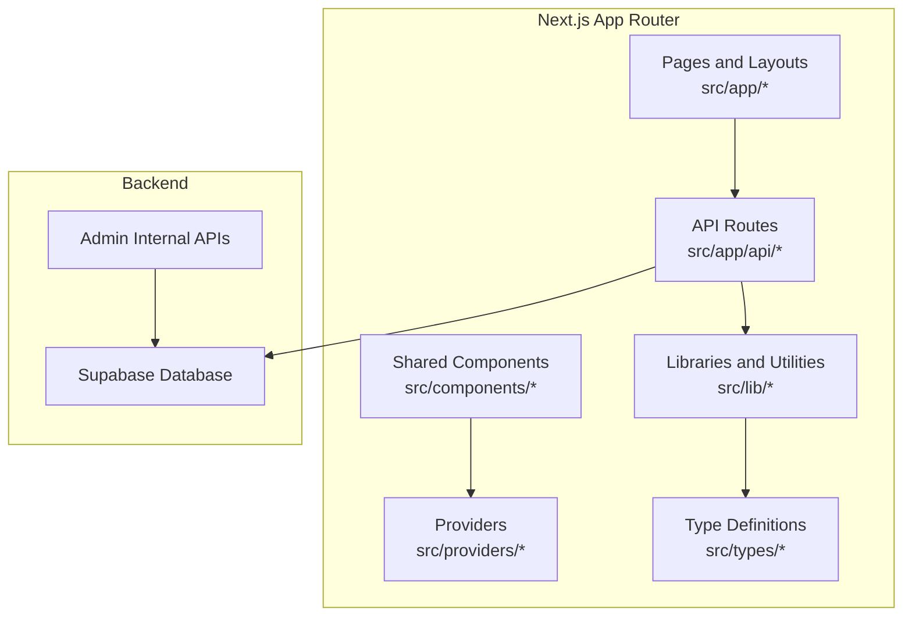
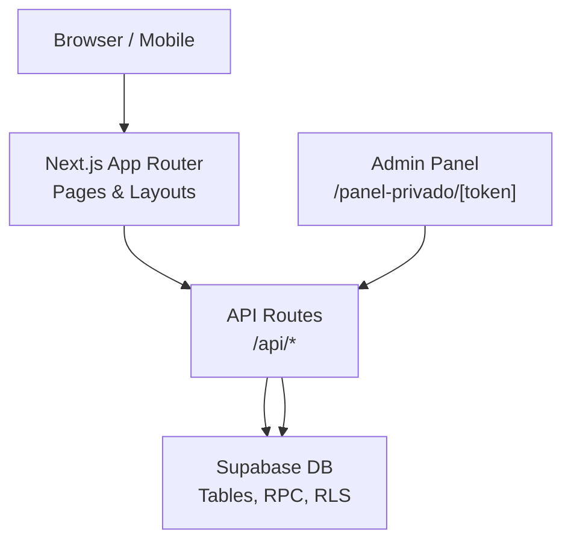
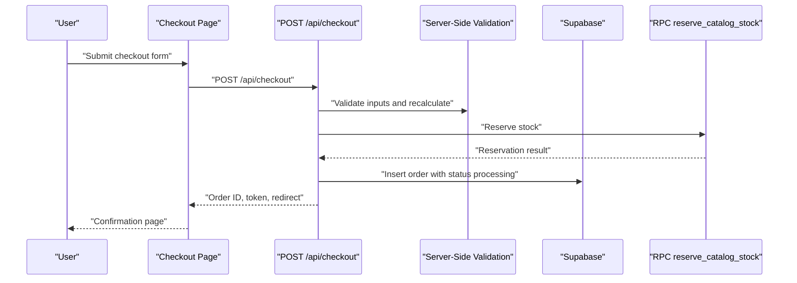
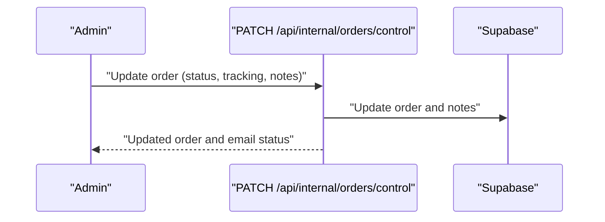
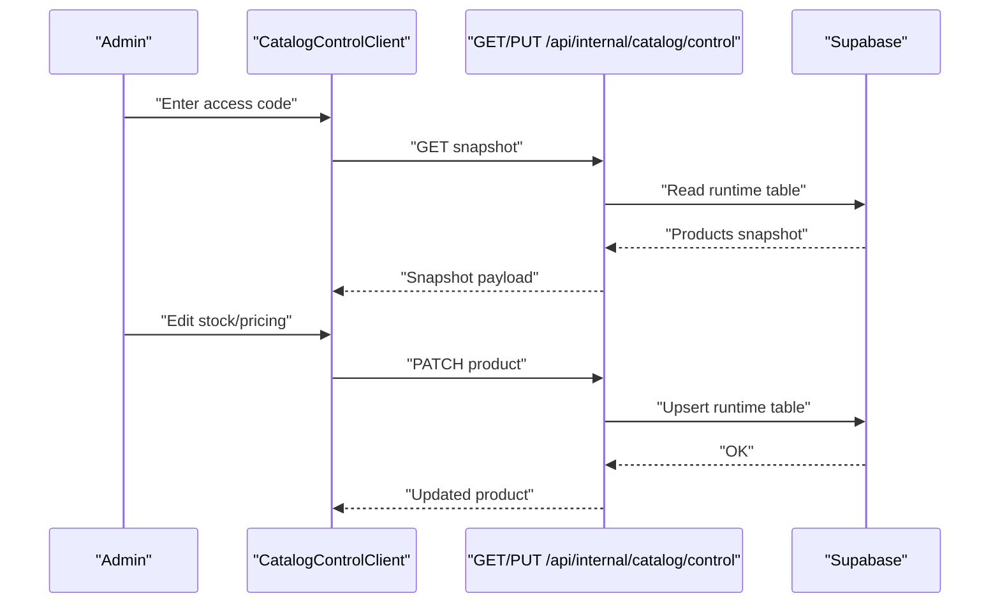
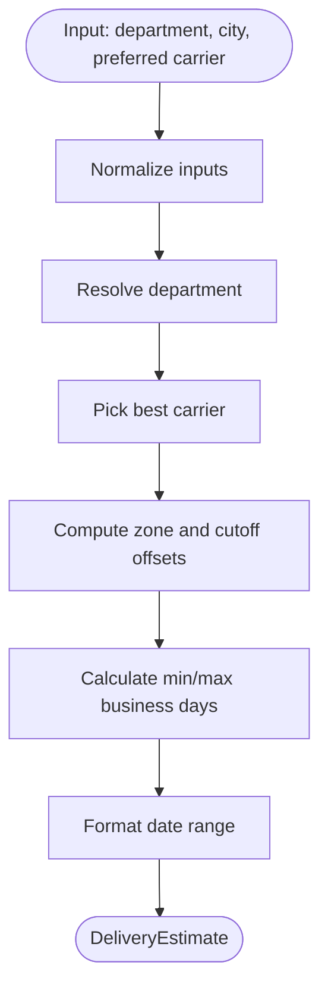
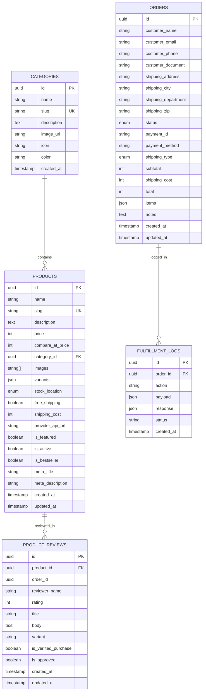
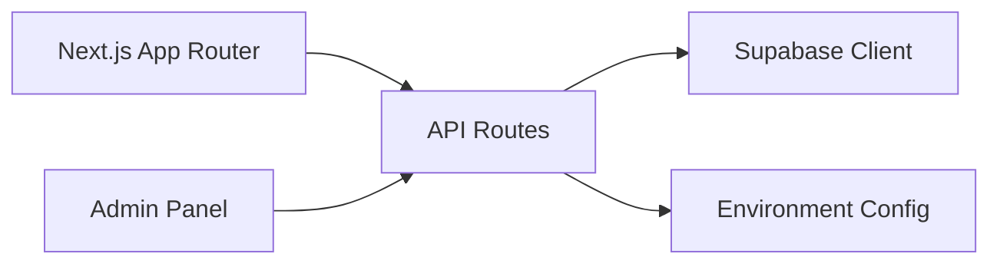

# Project Overview

<cite>
**Referenced Files in This Document**
- [README.md](file://README.md)
- [package.json](file://package.json)
- [src/app/layout.tsx](file://src/app/layout.tsx)
- [src/app/page.tsx](file://src/app/page.tsx)
- [src/lib/supabase.ts](file://src/lib/supabase.ts)
- [src/types/database.ts](file://src/types/database.ts)
- [src/app/api/checkout/route.ts](file://src/app/api/checkout/route.ts)
- [src/app/api/internal/orders/control/route.ts](file://src/app/api/internal/orders/control/route.ts)
- [src/app/api/catalog/version/route.ts](file://src/app/api/catalog/version/route.ts)
- [src/app/api/products/search/route.ts](file://src/app/api/products/search/route.ts)
- [src/app/panel-privado/[token]/CatalogControlClient.tsx](file://src/app/panel-privado/[token]/CatalogControlClient.tsx)
- [src/lib/catalog-runtime.ts](file://src/lib/catalog-runtime.ts)
- [src/lib/delivery.ts](file://src/lib/delivery.ts)
- [src/lib/shipping.ts](file://src/lib/shipping.ts)
</cite>

## Table of Contents
1. [Introduction](#introduction)
2. [Project Structure](#project-structure)
3. [Core Components](#core-components)
4. [Architecture Overview](#architecture-overview)
5. [Detailed Component Analysis](#detailed-component-analysis)
6. [Dependency Analysis](#dependency-analysis)
7. [Performance Considerations](#performance-considerations)
8. [Troubleshooting Guide](#troubleshooting-guide)
9. [Conclusion](#conclusion)

## Introduction
AllShop is a Colombian cash-on-delivery (contra entrega) marketplace built with Next.js 16 App Router. It targets customers across Colombia who prefer paying upon delivery and value national shipping coverage. The platform emphasizes manual dispatch management (“despacho manual”) and a “canonical catalog” (catalogo canonico) to maintain a single source of truth for product and stock data. The system integrates a Supabase backend for data persistence, real-time catalog updates, and administrative controls, enabling efficient order lifecycle management from placement to dispatch and customer notification.

Key positioning:
- Cash-on-delivery payments with strict validation and server-side recalculation.
- National shipping coverage with intelligent delivery estimates tailored to Colombian departments and cities.
- Manual dispatch workflow with internal admin controls for order status updates, tracking, and notifications.
- Operational catalog control for real-time stock and pricing adjustments (“catalogo canonico”).

## Project Structure
The project follows a modern Next.js 16 App Router structure with a clear separation of concerns:
- Application pages and layouts under src/app
- Shared UI components under src/components
- Providers for localization, pricing, and state management under src/providers
- Utilities and libraries under src/lib
- Type definitions under src/types
- API routes under src/app/api for server actions and internal controls
- Administrative panels under src/app/panel-privado for catalog and order management

**Diagram sources**
- [src/app/layout.tsx:112-202](file://src/app/layout.tsx#L112-L202)
- [src/app/page.tsx:13-25](file://src/app/page.tsx#L13-L25)
- [src/lib/supabase.ts:1-20](file://src/lib/supabase.ts#L1-L20)

**Section sources**
- [README.md:1-127](file://README.md#L1-L127)
- [package.json:1-49](file://package.json#L1-L49)
- [src/app/layout.tsx:1-203](file://src/app/layout.tsx#L1-L203)
- [src/app/page.tsx:1-26](file://src/app/page.tsx#L1-L26)

## Core Components
- Canonical catalog and runtime stock: Implements a “catalogo canonico” with a dedicated runtime table for real-time stock and pricing, enabling immediate operational updates and transactional stock reservations during checkout.
- Cash-on-delivery checkout pipeline: Validates customer data, recalculates totals server-side, reserves stock via RPC, and transitions orders to processing for manual dispatch.
- Manual dispatch control panel: Provides admin capabilities to update order status, add tracking/reference, internal/customer notes, and trigger notifications.
- Delivery estimation engine: Computes delivery windows for Colombia, factoring department zones, carrier selection, cutoff times, and remote regions.
- Supabase integration: Centralized data access, RLS, and RPC functions for stock operations and order management.

Practical examples:
- A customer places a cash-on-delivery order in Bogotá with mixed items; the system validates data, reserves stock, calculates shipping, and moves the order to processing for dispatch.
- An administrator reviews pending orders, advances statuses, records tracking, and sends email notifications to the customer.

**Section sources**
- [src/lib/catalog-runtime.ts:1-800](file://src/lib/catalog-runtime.ts#L1-L800)
- [src/app/api/checkout/route.ts:1-872](file://src/app/api/checkout/route.ts#L1-L872)
- [src/app/api/internal/orders/control/route.ts:1-664](file://src/app/api/internal/orders/control/route.ts#L1-L664)
- [src/lib/delivery.ts:1-488](file://src/lib/delivery.ts#L1-L488)
- [src/lib/shipping.ts:1-73](file://src/lib/shipping.ts#L1-L73)

## Architecture Overview
The system architecture centers around Next.js App Router pages and API routes, with Supabase as the backend. The checkout flow is fully server-rendered and validated, ensuring data integrity and preventing manipulation. Admin operations leverage internal APIs protected by access codes and environment secrets.

**Diagram sources**
- [src/app/layout.tsx:112-202](file://src/app/layout.tsx#L112-L202)
- [src/app/api/checkout/route.ts:1-872](file://src/app/api/checkout/route.ts#L1-L872)
- [src/app/api/internal/orders/control/route.ts:1-664](file://src/app/api/internal/orders/control/route.ts#L1-L664)
- [src/lib/supabase.ts:1-20](file://src/lib/supabase.ts#L1-L20)

## Detailed Component Analysis

### Checkout Pipeline (Cash-on-Delivery)
The checkout endpoint orchestrates:
- Request validation (payer info, shipping, verifications)
- Product resolution and pricing
- Stock reservation via RPC
- Delivery estimation and shipping cost calculation
- Order creation and idempotent handling
- Email notifications and Discord alerts

**Diagram sources**
- [src/app/api/checkout/route.ts:497-800](file://src/app/api/checkout/route.ts#L497-L800)
- [src/lib/catalog-runtime.ts:293-338](file://src/lib/catalog-runtime.ts#L293-L338)

**Section sources**
- [src/app/api/checkout/route.ts:1-872](file://src/app/api/checkout/route.ts#L1-L872)
- [src/lib/shipping.ts:62-73](file://src/lib/shipping.ts#L62-L73)
- [src/lib/delivery.ts:438-487](file://src/lib/delivery.ts#L438-L487)

### Manual Dispatch Control Panel
Administrators manage orders through an internal panel:
- Load orders filtered by status and query
- Update status, add tracking/reference, notes
- Trigger email notifications
- Delete orders when necessary

**Diagram sources**
- [src/app/api/internal/orders/control/route.ts:349-617](file://src/app/api/internal/orders/control/route.ts#L349-L617)

**Section sources**
- [src/app/api/internal/orders/control/route.ts:1-664](file://src/app/api/internal/orders/control/route.ts#L1-L664)

### Catalog Control and Real-Time Stock
The catalog control panel enables real-time stock and pricing updates:
- Access via token-protected route
- Fetch and patch product attributes (price, compare-at, free shipping, shipping cost, stock)
- Maintain a “catalogo canonico” runtime table for immediate visibility

**Diagram sources**
- [src/app/panel-privado/[token]/CatalogControlClient.tsx](file://src/app/panel-privado/[token]/CatalogControlClient.tsx#L87-L177)
- [src/lib/catalog-runtime.ts:465-508](file://src/lib/catalog-runtime.ts#L465-L508)
- [src/lib/catalog-runtime.ts:605-633](file://src/lib/catalog-runtime.ts#L605-L633)

**Section sources**
- [src/app/panel-privado/[token]/CatalogControlClient.tsx](file://src/app/panel-privado/[token]/CatalogControlClient.tsx#L1-L555)
- [src/lib/catalog-runtime.ts:1-800](file://src/lib/catalog-runtime.ts#L1-L800)

### Delivery Estimation Engine
Delivery estimates for Colombia consider:
- Department/city normalization
- Carrier selection (priority, insurance, availability)
- Remote/fast zones and cutoff times
- Business-day calculations

**Diagram sources**
- [src/lib/delivery.ts:438-487](file://src/lib/delivery.ts#L438-L487)

**Section sources**
- [src/lib/delivery.ts:1-488](file://src/lib/delivery.ts#L1-L488)
- [src/lib/shipping.ts:1-73](file://src/lib/shipping.ts#L1-L73)

### Data Model Overview
The database model defines core entities for products, categories, orders, and fulfillment logs, with enums for order status and shipping type.

**Diagram sources**
- [src/types/database.ts:96-288](file://src/types/database.ts#L96-L288)

**Section sources**
- [src/types/database.ts:1-294](file://src/types/database.ts#L1-L294)

## Dependency Analysis
- Next.js 16 App Router: Pages, layouts, and API routes define the surface area for user and admin experiences.
- Supabase: Provides database, RLS, RPC functions, and client initialization.
- Environment-driven configuration: Controls admin access, free shipping flags, polling modes, and low stock alerts.
- Internal APIs: Admin endpoints enforce access codes and protect sensitive operations.

**Diagram sources**
- [src/lib/supabase.ts:1-20](file://src/lib/supabase.ts#L1-L20)
- [README.md:10-61](file://README.md#L10-L61)

**Section sources**
- [src/lib/supabase.ts:1-20](file://src/lib/supabase.ts#L1-L20)
- [README.md:10-61](file://README.md#L10-L61)

## Performance Considerations
- Server-side rendering and caching: Pages and API routes use appropriate caching headers and revalidation strategies to balance freshness and performance.
- Idempotency: Checkout endpoints prevent duplicate orders using idempotency keys and payment IDs.
- Rate limiting: Sensitive endpoints enforce rate limits to mitigate abuse.
- ECO mode and polling intervals: Optional environment flags reduce resource usage in free-tier scenarios.

[No sources needed since this section provides general guidance]

## Troubleshooting Guide
Common issues and resolutions:
- Supabase not configured: Ensure NEXT_PUBLIC_SUPABASE_URL and NEXT_PUBLIC_SUPABASE_ANON_KEY are set; otherwise, client initialization falls back safely.
- Admin access denied: Verify CATALOG_ADMIN_ACCESS_CODE and ADMIN_BLOCK_SECRET are configured for internal admin endpoints.
- Order lookup token missing: Configure ORDER_LOOKUP_SECRET for secure order retrieval.
- Free shipping flags: Set FREE_SHIPPING_PRODUCT_IDS or FREE_SHIPPING_PRODUCT_SLUGS to enable blanket free shipping for specific items.
- Low stock alerts: Enable LOW_STOCK_ALERTS_ENABLED and set LOW_STOCK_ALERT_THRESHOLD to receive Discord notifications when stock drops below threshold.
- Maintenance cleanup: Use MAINTENANCE_SECRET to trigger internal cleanup of expired pending orders.

**Section sources**
- [README.md:10-61](file://README.md#L10-L61)
- [src/lib/supabase.ts:7-12](file://src/lib/supabase.ts#L7-L12)

## Conclusion
AllShop delivers a robust, Colombia-focused cash-on-delivery marketplace with strong operational controls. Its “despacho manual” workflow and “catalogo canonico” ensure reliable order processing and real-time inventory visibility. Built on Next.js 16 and Supabase, the platform balances developer productivity with scalability and security, supporting both customer-facing experiences and internal administration needs.