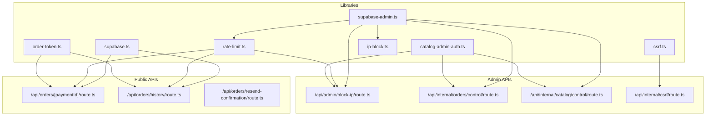
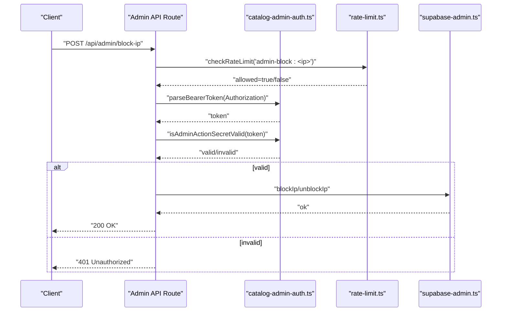
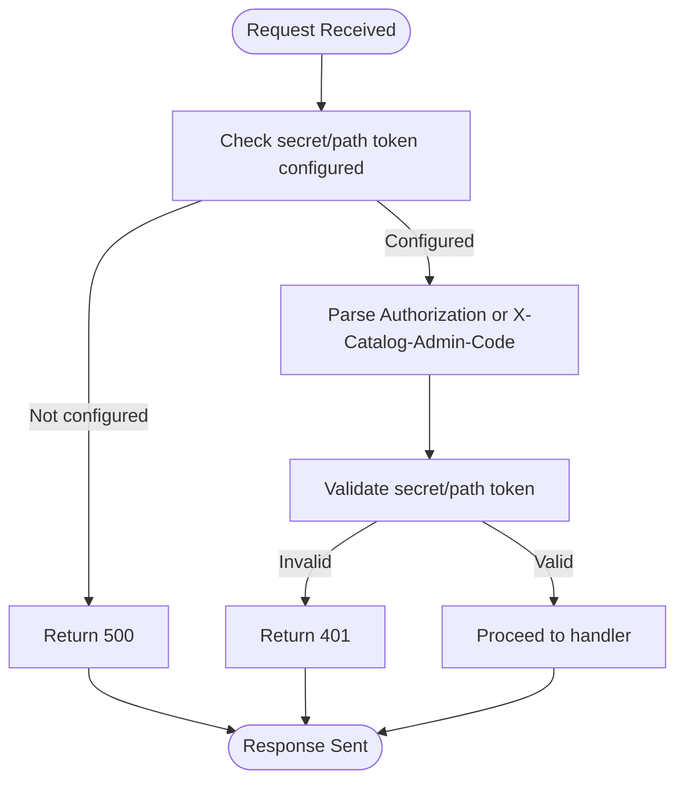
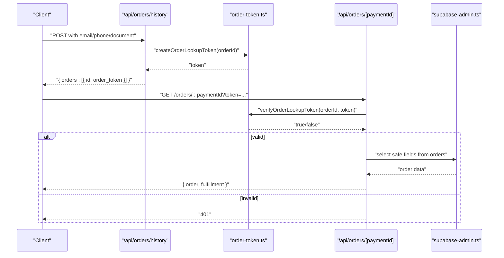
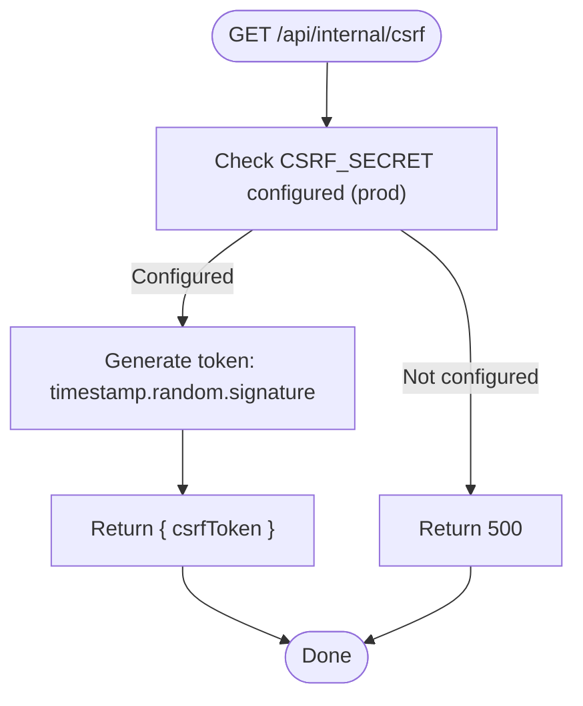
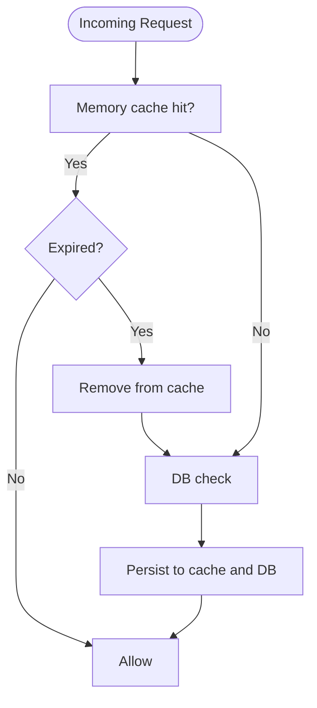
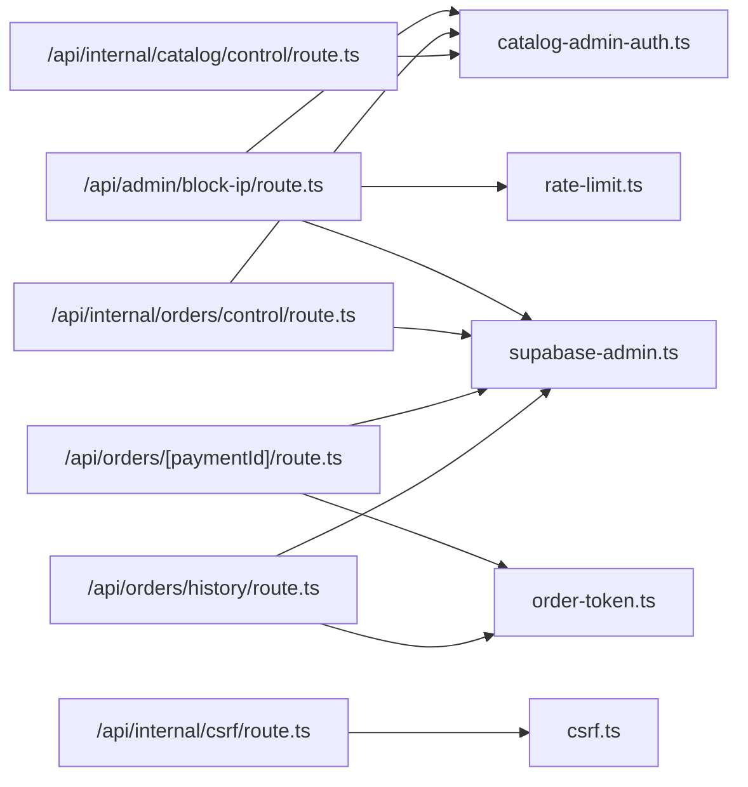

# Authentication & Authorization

<cite>
**Referenced Files in This Document**
- [src/lib/supabase-admin.ts](file://src/lib/supabase-admin.ts)
- [src/lib/supabase.ts](file://src/lib/supabase.ts)
- [src/lib/catalog-admin-auth.ts](file://src/lib/catalog-admin-auth.ts)
- [src/lib/order-token.ts](file://src/lib/order-token.ts)
- [src/lib/csrf.ts](file://src/lib/csrf.ts)
- [src/lib/ip-block.ts](file://src/lib/ip-block.ts)
- [src/lib/rate-limit.ts](file://src/lib/rate-limit.ts)
- [src/app/api/admin/block-ip/route.ts](file://src/app/api/admin/block-ip/route.ts)
- [src/app/api/internal/orders/control/route.ts](file://src/app/api/internal/orders/control/route.ts)
- [src/app/api/internal/catalog/control/route.ts](file://src/app/api/internal/catalog/control/route.ts)
- [src/app/api/internal/csrf/route.ts](file://src/app/api/internal/csrf/route.ts)
- [src/app/api/orders/[paymentId]/route.ts](file://src/app/api/orders/[paymentId]/route.ts)
- [src/app/api/orders/history/route.ts](file://src/app/api/orders/history/route.ts)
- [src/app/api/orders/resend-confirmation/route.ts](file://src/app/api/orders/resend-confirmation/route.ts)
</cite>

## Table of Contents
1. [Introduction](#introduction)
2. [Project Structure](#project-structure)
3. [Core Components](#core-components)
4. [Architecture Overview](#architecture-overview)
5. [Detailed Component Analysis](#detailed-component-analysis)
6. [Dependency Analysis](#dependency-analysis)
7. [Performance Considerations](#performance-considerations)
8. [Troubleshooting Guide](#troubleshooting-guide)
9. [Conclusion](#conclusion)

## Introduction
This document explains AllShop’s authentication and authorization system with a focus on:
- Admin access controls for catalog and order management
- Token-based mechanisms for order lookup and CSRF protection
- Supabase integration for admin operations and rate limiting
- Role-based access patterns and secure endpoint protection
- Practical guidance for implementing authenticated routes, token refresh strategies, and session management
- Security considerations for token storage, transport, and logout

## Project Structure
The authentication and authorization logic spans several libraries and API routes:
- Supabase clients for admin and public access
- Admin authentication helpers for catalog and order admin flows
- Order lookup token generator/verifier
- CSRF token generator/validator
- IP blocking and rate limiting utilities
- API routes enforcing admin access and protecting sensitive operations

**Diagram sources**
- [src/lib/supabase-admin.ts:1-31](file://src/lib/supabase-admin.ts#L1-L31)
- [src/lib/supabase.ts:1-20](file://src/lib/supabase.ts#L1-L20)
- [src/lib/catalog-admin-auth.ts:1-65](file://src/lib/catalog-admin-auth.ts#L1-L65)
- [src/lib/order-token.ts:1-65](file://src/lib/order-token.ts#L1-L65)
- [src/lib/csrf.ts:1-119](file://src/lib/csrf.ts#L1-L119)
- [src/lib/ip-block.ts:1-210](file://src/lib/ip-block.ts#L1-L210)
- [src/lib/rate-limit.ts:1-165](file://src/lib/rate-limit.ts#L1-L165)
- [src/app/api/admin/block-ip/route.ts:1-140](file://src/app/api/admin/block-ip/route.ts#L1-L140)
- [src/app/api/internal/orders/control/route.ts:1-664](file://src/app/api/internal/orders/control/route.ts#L1-L664)
- [src/app/api/internal/catalog/control/route.ts:1-191](file://src/app/api/internal/catalog/control/route.ts#L1-L191)
- [src/app/api/internal/csrf/route.ts:1-35](file://src/app/api/internal/csrf/route.ts#L1-L35)
- [src/app/api/orders/[paymentId]/route.ts](file://src/app/api/orders/[paymentId]/route.ts#L1-L101)
- [src/app/api/orders/history/route.ts:1-145](file://src/app/api/orders/history/route.ts#L1-L145)
- [src/app/api/orders/resend-confirmation/route.ts:1-28](file://src/app/api/orders/resend-confirmation/route.ts#L1-L28)

**Section sources**
- [src/lib/supabase-admin.ts:1-31](file://src/lib/supabase-admin.ts#L1-L31)
- [src/lib/supabase.ts:1-20](file://src/lib/supabase.ts#L1-L20)
- [src/lib/catalog-admin-auth.ts:1-65](file://src/lib/catalog-admin-auth.ts#L1-L65)
- [src/lib/order-token.ts:1-65](file://src/lib/order-token.ts#L1-L65)
- [src/lib/csrf.ts:1-119](file://src/lib/csrf.ts#L1-L119)
- [src/lib/ip-block.ts:1-210](file://src/lib/ip-block.ts#L1-L210)
- [src/lib/rate-limit.ts:1-165](file://src/lib/rate-limit.ts#L1-L165)
- [src/app/api/admin/block-ip/route.ts:1-140](file://src/app/api/admin/block-ip/route.ts#L1-L140)
- [src/app/api/internal/orders/control/route.ts:1-664](file://src/app/api/internal/orders/control/route.ts#L1-L664)
- [src/app/api/internal/catalog/control/route.ts:1-191](file://src/app/api/internal/catalog/control/route.ts#L1-L191)
- [src/app/api/internal/csrf/route.ts:1-35](file://src/app/api/internal/csrf/route.ts#L1-L35)
- [src/app/api/orders/[paymentId]/route.ts](file://src/app/api/orders/[paymentId]/route.ts#L1-L101)
- [src/app/api/orders/history/route.ts:1-145](file://src/app/api/orders/history/route.ts#L1-L145)
- [src/app/api/orders/resend-confirmation/route.ts:1-28](file://src/app/api/orders/resend-confirmation/route.ts#L1-L28)

## Core Components
- Supabase Admin Client
  - Provides admin-only access to dynamic tables and RPCs without strict typing for flexibility.
  - Disables auto-refresh and persistence to avoid unintended session side effects in serverless.
- Supabase Public Client
  - Typed client for public-facing operations.
- Catalog Admin Authentication
  - Validates admin access via environment-configured secrets and path tokens.
  - Includes safe comparison utilities and Bearer token parsing.
- Order Lookup Tokens
  - Generates and validates short-lived tokens for order visibility with HMAC-SHA256 signatures.
  - Enforces TTL bounds and safe comparisons.
- CSRF Protection
  - Generates and validates time-bound CSRF tokens using HMAC-SHA256.
  - Supports fallback to ORDER_LOOKUP_SECRET and development fallback.
- IP Blocking and Rate Limiting
  - Maintains in-memory cache synchronized with Supabase for fast checks and enforcement.
  - Provides in-memory and DB-backed rate limiting for admin and public endpoints.

**Section sources**
- [src/lib/supabase-admin.ts:1-31](file://src/lib/supabase-admin.ts#L1-L31)
- [src/lib/supabase.ts:1-20](file://src/lib/supabase.ts#L1-L20)
- [src/lib/catalog-admin-auth.ts:1-65](file://src/lib/catalog-admin-auth.ts#L1-L65)
- [src/lib/order-token.ts:1-65](file://src/lib/order-token.ts#L1-L65)
- [src/lib/csrf.ts:1-119](file://src/lib/csrf.ts#L1-L119)
- [src/lib/ip-block.ts:1-210](file://src/lib/ip-block.ts#L1-L210)
- [src/lib/rate-limit.ts:1-165](file://src/lib/rate-limit.ts#L1-L165)

## Architecture Overview
AllShop employs layered access control:
- Environment-driven secrets and tokens gate admin endpoints
- Supabase admin client underpins catalog and order management
- Order lookup uses signed tokens to prevent unauthorized exposure
- CSRF tokens protect internal forms and actions
- IP blocking and rate limiting defend against abuse

**Diagram sources**
- [src/app/api/admin/block-ip/route.ts:1-140](file://src/app/api/admin/block-ip/route.ts#L1-L140)
- [src/lib/catalog-admin-auth.ts:1-65](file://src/lib/catalog-admin-auth.ts#L1-L65)
- [src/lib/rate-limit.ts:1-165](file://src/lib/rate-limit.ts#L1-L165)
- [src/lib/supabase-admin.ts:1-31](file://src/lib/supabase-admin.ts#L1-L31)

## Detailed Component Analysis

### Admin Access Control Patterns
- Catalog Admin Code
  - Enforced via header-based code validation for internal catalog and order control routes.
  - Uses safe string comparison to mitigate timing attacks.
- Admin Action Secret
  - Enforced via Bearer token for sensitive admin endpoints (e.g., IP blocking).
  - Supports fallback to ORDER_LOOKUP_SECRET for backward compatibility.

**Diagram sources**
- [src/lib/catalog-admin-auth.ts:1-65](file://src/lib/catalog-admin-auth.ts#L1-L65)
- [src/app/api/internal/orders/control/route.ts:55-79](file://src/app/api/internal/orders/control/route.ts#L55-L79)
- [src/app/api/internal/catalog/control/route.ts:59-79](file://src/app/api/internal/catalog/control/route.ts#L59-L79)
- [src/app/api/admin/block-ip/route.ts:20-41](file://src/app/api/admin/block-ip/route.ts#L20-L41)

**Section sources**
- [src/lib/catalog-admin-auth.ts:1-65](file://src/lib/catalog-admin-auth.ts#L1-L65)
- [src/app/api/internal/orders/control/route.ts:55-79](file://src/app/api/internal/orders/control/route.ts#L55-L79)
- [src/app/api/internal/catalog/control/route.ts:59-79](file://src/app/api/internal/catalog/control/route.ts#L59-L79)
- [src/app/api/admin/block-ip/route.ts:20-41](file://src/app/api/admin/block-ip/route.ts#L20-L41)

### Order Lookup Token Verification
- Token Generation
  - Payload includes order ID and expiration timestamp.
  - Signature derived from HMAC-SHA256 using ORDER_LOOKUP_SECRET.
- Token Validation
  - Verifies expiration and signature using safe comparison.
  - Enforces TTL bounds and rejects malformed tokens.
- Endpoint Behavior
  - Returns sanitized order fields only.
  - Requires token when ORDER_LOOKUP_SECRET is configured; blocks in production without it.

**Diagram sources**
- [src/app/api/orders/history/route.ts:1-145](file://src/app/api/orders/history/route.ts#L1-L145)
- [src/lib/order-token.ts:1-65](file://src/lib/order-token.ts#L1-L65)
- [src/app/api/orders/[paymentId]/route.ts](file://src/app/api/orders/[paymentId]/route.ts#L1-L101)
- [src/lib/supabase-admin.ts:1-31](file://src/lib/supabase-admin.ts#L1-L31)

**Section sources**
- [src/lib/order-token.ts:1-65](file://src/lib/order-token.ts#L1-L65)
- [src/app/api/orders/history/route.ts:1-145](file://src/app/api/orders/history/route.ts#L1-L145)
- [src/app/api/orders/[paymentId]/route.ts](file://src/app/api/orders/[paymentId]/route.ts#L1-L101)

### CSRF Protection
- Token Generation
  - Timestamp-based payload with random component and HMAC signature.
  - Validity window enforced (2 hours).
- Token Validation
  - Validates signature, timestamp range, and same-origin heuristics.
- Endpoint Usage
  - Internal CSRF token endpoint returns a fresh token for protected actions.

**Diagram sources**
- [src/app/api/internal/csrf/route.ts:1-35](file://src/app/api/internal/csrf/route.ts#L1-L35)
- [src/lib/csrf.ts:1-119](file://src/lib/csrf.ts#L1-L119)

**Section sources**
- [src/lib/csrf.ts:1-119](file://src/lib/csrf.ts#L1-L119)
- [src/app/api/internal/csrf/route.ts:1-35](file://src/app/api/internal/csrf/route.ts#L1-L35)

### IP Blocking and Rate Limiting
- IP Blocking
  - In-memory cache for fast checks; DB sync ensures enforcement across serverless instances.
  - Supports permanent, 24h, and 1h durations with background persistence.
- Rate Limiting
  - In-memory sliding-window buckets with periodic cleanup.
  - Optional DB-backed rate limiting using Supabase for critical paths.

**Diagram sources**
- [src/lib/ip-block.ts:1-210](file://src/lib/ip-block.ts#L1-L210)
- [src/lib/rate-limit.ts:1-165](file://src/lib/rate-limit.ts#L1-L165)

**Section sources**
- [src/lib/ip-block.ts:1-210](file://src/lib/ip-block.ts#L1-L210)
- [src/lib/rate-limit.ts:1-165](file://src/lib/rate-limit.ts#L1-L165)

### Supabase Integration
- Admin Client
  - Used for catalog/runtime operations, blocked IPs, rate limits, and audit logs.
  - Disabled auto-refresh and persistence to avoid side effects.
- Public Client
  - Typed client for public-facing queries.

**Section sources**
- [src/lib/supabase-admin.ts:1-31](file://src/lib/supabase-admin.ts#L1-L31)
- [src/lib/supabase.ts:1-20](file://src/lib/supabase.ts#L1-L20)

## Dependency Analysis
- Admin routes depend on:
  - catalog-admin-auth for access validation
  - rate-limit for abuse prevention
  - supabase-admin for database operations
- Order lookup depends on:
  - order-token for signed tokens
  - supabase-admin for read-only order data
- CSRF depends on:
  - csrf library for token lifecycle
- IP blocking depends on:
  - supabase-admin for persistence
  - in-memory cache for performance

**Diagram sources**
- [src/app/api/admin/block-ip/route.ts:1-140](file://src/app/api/admin/block-ip/route.ts#L1-L140)
- [src/app/api/internal/orders/control/route.ts:1-664](file://src/app/api/internal/orders/control/route.ts#L1-L664)
- [src/app/api/internal/catalog/control/route.ts:1-191](file://src/app/api/internal/catalog/control/route.ts#L1-L191)
- [src/app/api/orders/[paymentId]/route.ts](file://src/app/api/orders/[paymentId]/route.ts#L1-L101)
- [src/app/api/orders/history/route.ts:1-145](file://src/app/api/orders/history/route.ts#L1-L145)
- [src/app/api/internal/csrf/route.ts:1-35](file://src/app/api/internal/csrf/route.ts#L1-L35)
- [src/lib/catalog-admin-auth.ts:1-65](file://src/lib/catalog-admin-auth.ts#L1-L65)
- [src/lib/order-token.ts:1-65](file://src/lib/order-token.ts#L1-L65)
- [src/lib/csrf.ts:1-119](file://src/lib/csrf.ts#L1-L119)
- [src/lib/supabase-admin.ts:1-31](file://src/lib/supabase-admin.ts#L1-L31)

**Section sources**
- [src/app/api/admin/block-ip/route.ts:1-140](file://src/app/api/admin/block-ip/route.ts#L1-L140)
- [src/app/api/internal/orders/control/route.ts:1-664](file://src/app/api/internal/orders/control/route.ts#L1-L664)
- [src/app/api/internal/catalog/control/route.ts:1-191](file://src/app/api/internal/catalog/control/route.ts#L1-L191)
- [src/app/api/orders/[paymentId]/route.ts](file://src/app/api/orders/[paymentId]/route.ts#L1-L101)
- [src/app/api/orders/history/route.ts:1-145](file://src/app/api/orders/history/route.ts#L1-L145)
- [src/app/api/internal/csrf/route.ts:1-35](file://src/app/api/internal/csrf/route.ts#L1-L35)
- [src/lib/catalog-admin-auth.ts:1-65](file://src/lib/catalog-admin-auth.ts#L1-L65)
- [src/lib/order-token.ts:1-65](file://src/lib/order-token.ts#L1-L65)
- [src/lib/csrf.ts:1-119](file://src/lib/csrf.ts#L1-L119)
- [src/lib/supabase-admin.ts:1-31](file://src/lib/supabase-admin.ts#L1-L31)

## Performance Considerations
- In-memory caches for IP blocking and rate limiting reduce DB load and improve latency.
- Sliding-window cleanup keeps memory footprint bounded.
- DB-backed rate limiting provides stronger guarantees for critical paths when Supabase is configured.
- Order lookup returns minimal fields to reduce payload size and exposure.

[No sources needed since this section provides general guidance]

## Troubleshooting Guide
- Admin endpoints return 500 when required secrets are not configured
  - Verify ADMIN_BLOCK_SECRET or ORDER_LOOKUP_SECRET for IP blocking.
  - Verify CATALOG_ADMIN_ACCESS_CODE for catalog/order control panels.
- Unauthorized responses (401) indicate invalid or missing tokens/secrets
  - Confirm Authorization header format and token validity.
  - Ensure ORDER_LOOKUP_SECRET is set for order lookup endpoints.
- Rate limit exceeded (429)
  - Respect Retry-After header and reduce request frequency.
  - Consider DB-backed rate limiting for critical paths.
- IP blocking not effective across instances
  - Ensure Supabase admin client is configured and blocked_ips table exists.
  - Confirm background persistence completes after blocking.

**Section sources**
- [src/app/api/admin/block-ip/route.ts:24-41](file://src/app/api/admin/block-ip/route.ts#L24-L41)
- [src/app/api/internal/orders/control/route.ts:59-79](file://src/app/api/internal/orders/control/route.ts#L59-L79)
- [src/app/api/internal/catalog/control/route.ts:59-79](file://src/app/api/internal/catalog/control/route.ts#L59-L79)
- [src/app/api/orders/[paymentId]/route.ts](file://src/app/api/orders/[paymentId]/route.ts#L71-L79)
- [src/lib/rate-limit.ts:43-88](file://src/lib/rate-limit.ts#L43-L88)
- [src/lib/ip-block.ts:139-171](file://src/lib/ip-block.ts#L139-L171)

## Conclusion
AllShop’s authentication and authorization system combines environment-driven secrets, signed tokens, and Supabase-backed persistence to secure admin operations and order visibility. Admin endpoints enforce strict access checks, rate limits, and IP blocking to mitigate abuse. Order lookup tokens provide controlled visibility with strong cryptographic validation. CSRF tokens protect internal actions. Together, these mechanisms form a robust, layered defense suitable for production environments.