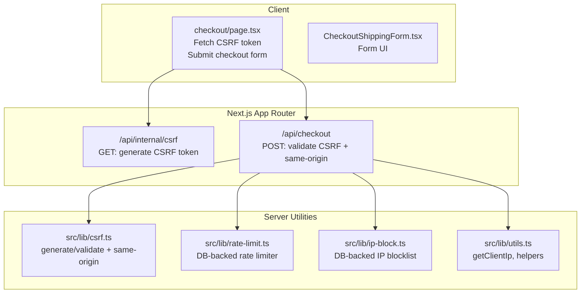
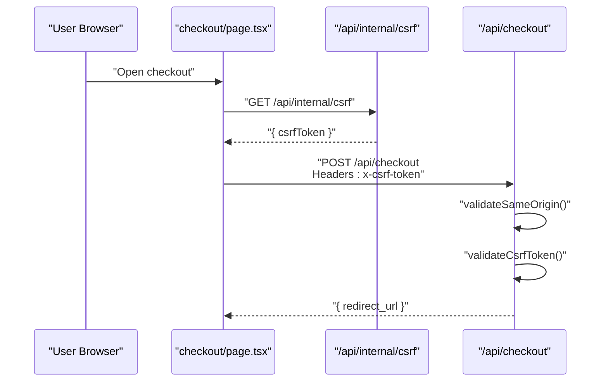
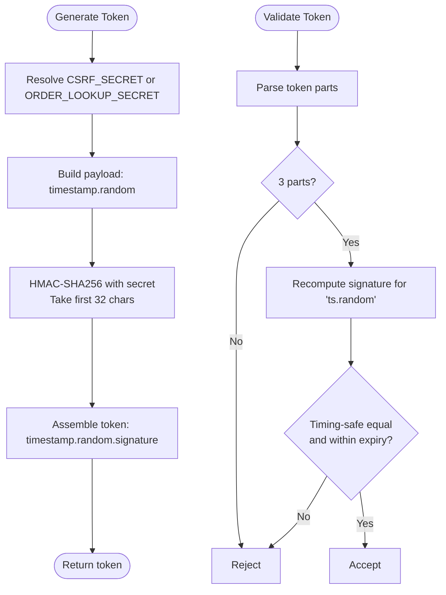
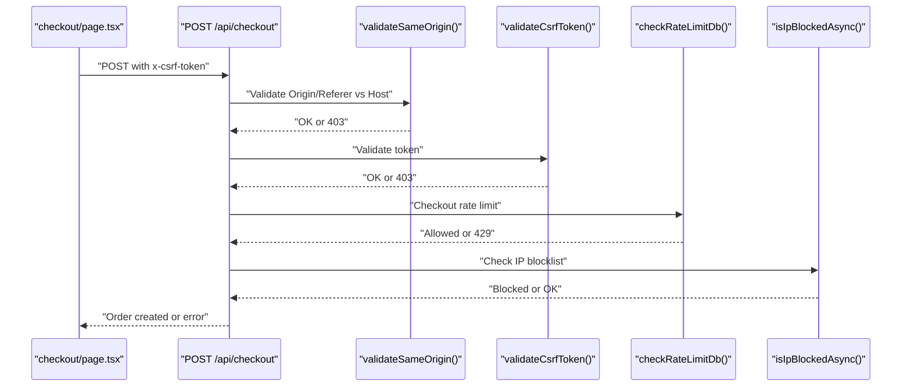
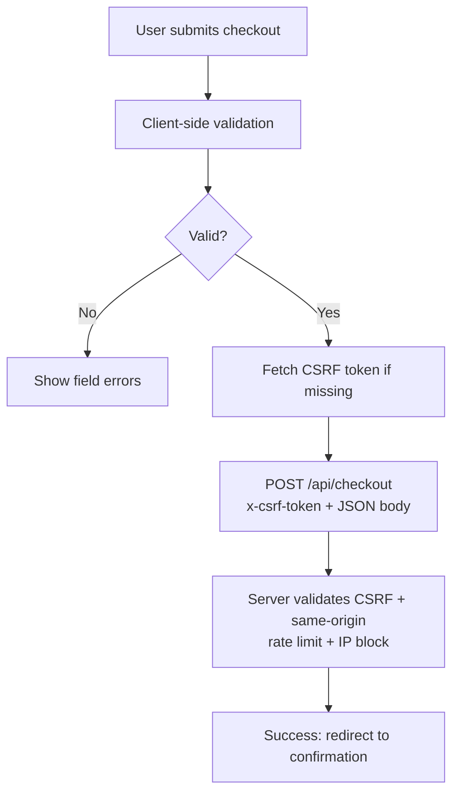
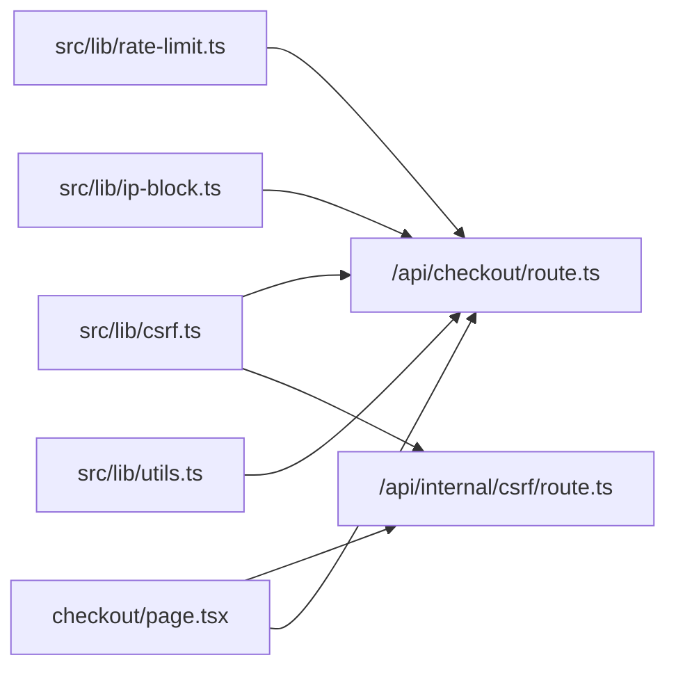

# CSRF Protection

<cite>
**Referenced Files in This Document**
- [csrf.ts](file://src/lib/csrf.ts)
- [csrf route.ts](file://src/app/api/internal/csrf/route.ts)
- [checkout route.ts](file://src/app/api/checkout/route.ts)
- [checkout page.tsx](file://src/app/checkout/page.tsx)
- [CheckoutShippingForm.tsx](file://src/components/checkout/CheckoutShippingForm.tsx)
- [rate-limit.ts](file://src/lib/rate-limit.ts)
- [ip-block.ts](file://src/lib/ip-block.ts)
- [block-ip route.ts](file://src/app/api/admin/block-ip/route.ts)
- [order cancel route.ts](file://src/app/api/admin/orders/cancel/route.ts)
- [utils.ts](file://src/lib/utils.ts)
- [validation.ts](file://src/lib/validation.ts)
</cite>

## Table of Contents
1. [Introduction](#introduction)
2. [Project Structure](#project-structure)
3. [Core Components](#core-components)
4. [Architecture Overview](#architecture-overview)
5. [Detailed Component Analysis](#detailed-component-analysis)
6. [Dependency Analysis](#dependency-analysis)
7. [Performance Considerations](#performance-considerations)
8. [Troubleshooting Guide](#troubleshooting-guide)
9. [Conclusion](#conclusion)

## Introduction
This document explains AllShop’s Cross-Site Request Forgery (CSRF) protection implementation. It covers the token-based mechanism, generation and validation lifecycles, secure transmission, and integration with Next.js API routes and client-side forms. It also documents how CSRF protection interacts with rate limiting and IP blocking, and provides guidance for handling token expiration, regeneration, and error scenarios.

## Project Structure
CSRF protection spans three layers:
- Token generation and validation utilities (server-only)
- Internal endpoint to fetch CSRF tokens for clients
- API routes that enforce CSRF validation and same-origin checks

**Diagram sources**
- [checkout page.tsx:257-266](file://src/app/checkout/page.tsx#L257-L266)
- [csrf route.ts:1-35](file://src/app/api/internal/csrf/route.ts#L1-L35)
- [checkout route.ts:497-530](file://src/app/api/checkout/route.ts#L497-L530)
- [csrf.ts:40-84](file://src/lib/csrf.ts#L40-L84)
- [rate-limit.ts:101-164](file://src/lib/rate-limit.ts#L101-L164)
- [ip-block.ts:25-72](file://src/lib/ip-block.ts#L25-L72)
- [utils.ts:56-67](file://src/lib/utils.ts#L56-L67)

**Section sources**
- [csrf.ts:1-119](file://src/lib/csrf.ts#L1-L119)
- [csrf route.ts:1-35](file://src/app/api/internal/csrf/route.ts#L1-L35)
- [checkout route.ts:497-530](file://src/app/api/checkout/route.ts#L497-L530)
- [checkout page.tsx:257-266](file://src/app/checkout/page.tsx#L257-L266)

## Core Components
- CSRF token generator and validator (server-only):
  - Generates tokens with timestamp, randomness, and HMAC signature
  - Validates signature, timing-safe comparison, and expiry window
- Same-origin enforcement:
  - Validates Origin or Referer against Host header
- Internal token endpoint:
  - Produces a fresh CSRF token for client-side use
- Checkout API route:
  - Enforces CSRF token presence and validity
  - Enforces same-origin policy in production
  - Integrates with rate limiting and IP blocking

**Section sources**
- [csrf.ts:13-84](file://src/lib/csrf.ts#L13-L84)
- [csrf route.ts:6-26](file://src/app/api/internal/csrf/route.ts#L6-L26)
- [checkout route.ts:515-530](file://src/app/api/checkout/route.ts#L515-L530)

## Architecture Overview
The CSRF protection architecture ensures that only legitimate browser sessions can submit sensitive actions. Tokens are short-lived and bound to the session via a shared secret.

**Diagram sources**
- [checkout page.tsx:257-274](file://src/app/checkout/page.tsx#L257-L274)
- [csrf route.ts:6-26](file://src/app/api/internal/csrf/route.ts#L6-L26)
- [checkout route.ts:515-530](file://src/app/api/checkout/route.ts#L515-L530)

## Detailed Component Analysis

### Token Generation and Validation
- Token format: base36 timestamp + dot + hex random + dot + HMAC signature slice
- Signature: HMAC-SHA256 over “timestamp.random” using a shared secret
- Validation:
  - Split into parts and check non-empty segments
  - Timing-safe HMAC comparison
  - Expiry within configured validity window
- Secret resolution:
  - Prefers explicit CSRF_SECRET
  - Falls back to ORDER_LOOKUP_SECRET
  - In production, missing secrets cause failure; in development, a random fallback is used

**Diagram sources**
- [csrf.ts:40-84](file://src/lib/csrf.ts#L40-L84)

**Section sources**
- [csrf.ts:13-84](file://src/lib/csrf.ts#L13-L84)

### Same-Origin Enforcement
- Validates Origin header against Host
- Falls back to Referer header if Origin absent
- Blocks in production when neither Origin nor Referer matches Host
- Allows broader acceptance in non-production environments

**Section sources**
- [csrf.ts:91-118](file://src/lib/csrf.ts#L91-L118)

### Internal CSRF Token Endpoint
- GET /api/internal/csrf
- Enforces production readiness: requires CSRF_SECRET or ORDER_LOOKUP_SECRET
- Returns token with cache-control headers to prevent caching
- Logs and returns structured errors on failure

**Section sources**
- [csrf route.ts:6-34](file://src/app/api/internal/csrf/route.ts#L6-L34)

### Checkout API Route Integration
- Enforces CSRF:
  - Reads x-csrf-token header
  - Rejects with 403 if invalid
- Enforces same-origin in production
- Integrates with:
  - DB-backed rate limiting for checkout
  - IP blocklist checks
  - VPN/proxy detection
- On success, creates order and returns redirect URL

**Diagram sources**
- [checkout route.ts:515-554](file://src/app/api/checkout/route.ts#L515-L554)

**Section sources**
- [checkout route.ts:497-530](file://src/app/api/checkout/route.ts#L497-L530)
- [checkout route.ts:532-554](file://src/app/api/checkout/route.ts#L532-L554)

### Client-Side Integration (Checkout Page)
- On submit, fetches a fresh CSRF token from /api/internal/csrf if not cached
- Sends token in x-csrf-token header along with JSON payload
- Clears cart and redirects on success

**Section sources**
- [checkout page.tsx:257-274](file://src/app/checkout/page.tsx#L257-L274)

### Form Submission Flow (Checkout)
- Client collects form data and validations
- Validates fields before submission
- Submits to /api/checkout with CSRF token and idempotency key

**Diagram sources**
- [checkout page.tsx:227-353](file://src/app/checkout/page.tsx#L227-L353)
- [validation.ts:79-110](file://src/lib/validation.ts#L79-L110)

**Section sources**
- [checkout page.tsx:227-353](file://src/app/checkout/page.tsx#L227-L353)
- [validation.ts:79-110](file://src/lib/validation.ts#L79-L110)

### Admin Actions and Related Security Controls
While admin endpoints (e.g., block IP, cancel order) do not use CSRF tokens, they apply:
- Bearer token authentication (ADMIN_BLOCK_SECRET or ORDER_LOOKUP_SECRET)
- Rate limiting per IP
- IP blocking checks

These controls complement CSRF protection by ensuring only authorized administrators can perform privileged actions.

**Section sources**
- [block-ip route.ts:51-67](file://src/app/api/admin/block-ip/route.ts#L51-L67)
- [block-ip route.ts:68-89](file://src/app/api/admin/block-ip/route.ts#L68-L89)
- [order cancel route.ts:67-83](file://src/app/api/admin/orders/cancel/route.ts#L67-L83)

## Dependency Analysis
CSRF protection integrates with several security utilities:

**Diagram sources**
- [csrf.ts:40-84](file://src/lib/csrf.ts#L40-L84)
- [csrf route.ts:6-26](file://src/app/api/internal/csrf/route.ts#L6-L26)
- [checkout route.ts:515-554](file://src/app/api/checkout/route.ts#L515-L554)
- [rate-limit.ts:101-164](file://src/lib/rate-limit.ts#L101-L164)
- [ip-block.ts:25-72](file://src/lib/ip-block.ts#L25-L72)
- [utils.ts:56-67](file://src/lib/utils.ts#L56-L67)
- [checkout page.tsx:257-274](file://src/app/checkout/page.tsx#L257-L274)

**Section sources**
- [csrf.ts:40-84](file://src/lib/csrf.ts#L40-L84)
- [checkout route.ts:515-554](file://src/app/api/checkout/route.ts#L515-L554)
- [rate-limit.ts:101-164](file://src/lib/rate-limit.ts#L101-L164)
- [ip-block.ts:25-72](file://src/lib/ip-block.ts#L25-L72)
- [utils.ts:56-67](file://src/lib/utils.ts#L56-L67)
- [checkout page.tsx:257-274](file://src/app/checkout/page.tsx#L257-L274)

## Performance Considerations
- Token generation uses HMAC-SHA256 and random bytes; negligible overhead
- Same-origin check is lightweight (header parsing and URL comparison)
- DB-backed rate limiting for checkout provides strong throttling while falling back to in-memory for non-critical paths
- IP blocklist uses in-memory cache with DB sync for fast lookups and cross-instance consistency

[No sources needed since this section provides general guidance]

## Troubleshooting Guide
Common issues and resolutions:
- Missing CSRF secret in production:
  - Symptom: Internal CSRF endpoint returns 500; checkout rejects requests
  - Resolution: Set CSRF_SECRET or ORDER_LOOKUP_SECRET
- Invalid or expired CSRF token:
  - Symptom: 403 on checkout
  - Resolution: Refresh page to fetch a new token; ensure client sends x-csrf-token header
- Same-origin violation:
  - Symptom: 403 in production when Origin/Referer mismatch occurs
  - Resolution: Ensure requests originate from the same host; avoid external script injection
- Rate limit exceeded:
  - Symptom: 429 with Retry-After
  - Resolution: Back off and retry after indicated seconds
- Blocked IP:
  - Symptom: 403 with restriction message
  - Resolution: Contact support; avoid VPN/proxy; retry from allowed IP

**Section sources**
- [csrf route.ts:7-15](file://src/app/api/internal/csrf/route.ts#L7-L15)
- [checkout route.ts:505-521](file://src/app/api/checkout/route.ts#L505-L521)
- [checkout route.ts:532-546](file://src/app/api/checkout/route.ts#L532-L546)
- [checkout route.ts:548-554](file://src/app/api/checkout/route.ts#L548-L554)

## Conclusion
AllShop’s CSRF protection combines server-generated, time-bound tokens with same-origin enforcement and layered defenses (rate limiting, IP blocking). Client-side flows fetch tokens securely and attach them to sensitive requests. Admin endpoints add bearer authentication and rate limiting. Together, these mechanisms mitigate CSRF risks while maintaining usability and performance.