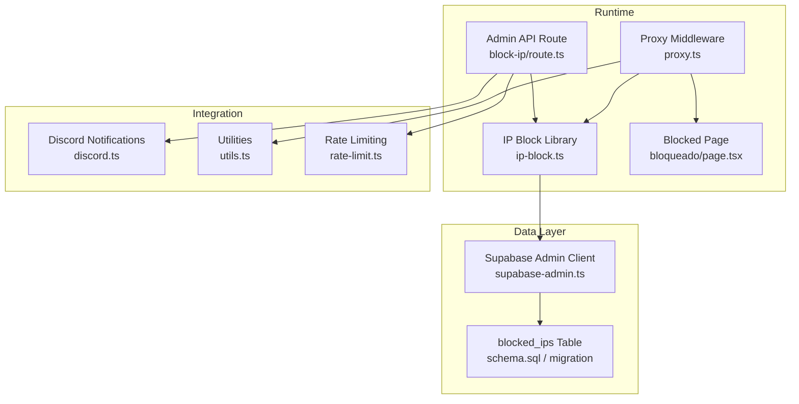
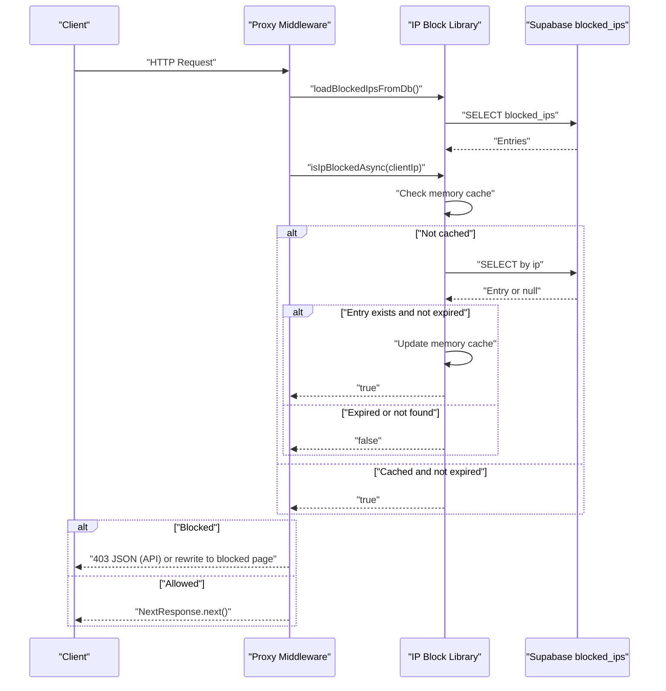
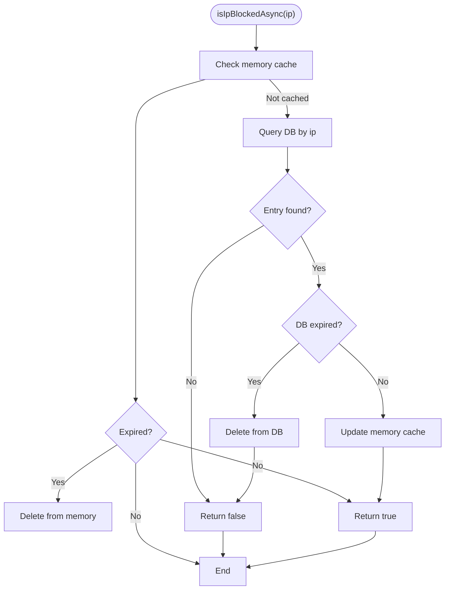
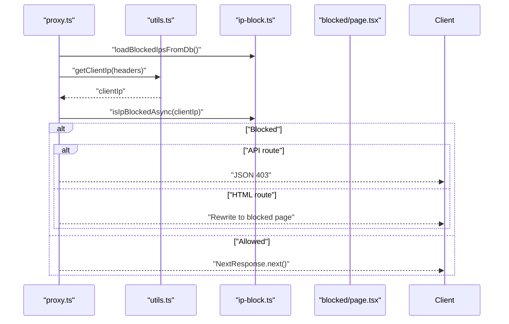
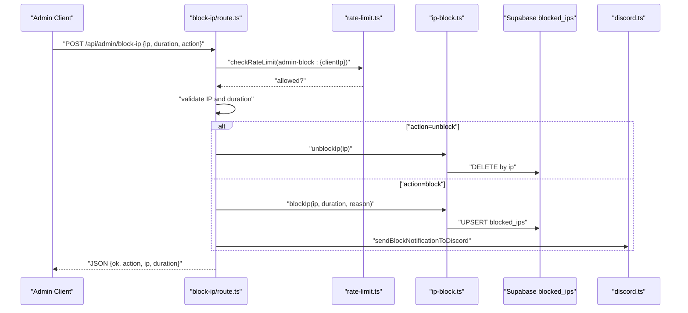
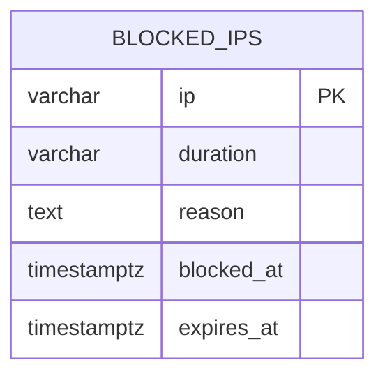
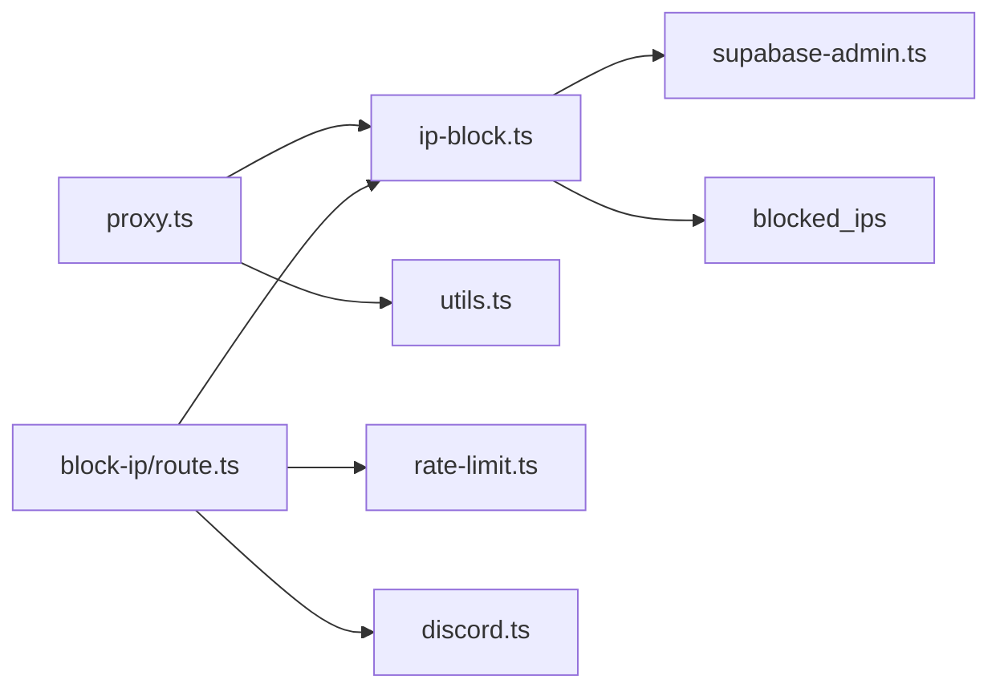

# IP Blocking System

<cite>
**Referenced Files in This Document**
- [ip-block.ts](file://src/lib/ip-block.ts)
- [route.ts](file://src/app/api/admin/block-ip/route.ts)
- [proxy.ts](file://src/proxy.ts)
- [page.tsx](file://src/app/bloqueado/page.tsx)
- [schema.sql](file://schema.sql)
- [20260311_security_performance_fixes.sql](file://supabase/migrations/20260311_security_performance_fixes.sql)
- [discord.ts](file://src/lib/discord.ts)
- [rate-limit.ts](file://src/lib/rate-limit.ts)
- [utils.ts](file://src/lib/utils.ts)
- [supabase-admin.ts](file://src/lib/supabase-admin.ts)
</cite>

## Table of Contents
1. [Introduction](#introduction)
2. [Project Structure](#project-structure)
3. [Core Components](#core-components)
4. [Architecture Overview](#architecture-overview)
5. [Detailed Component Analysis](#detailed-component-analysis)
6. [Dependency Analysis](#dependency-analysis)
7. [Performance Considerations](#performance-considerations)
8. [Troubleshooting Guide](#troubleshooting-guide)
9. [Conclusion](#conclusion)
10. [Appendices](#appendices)

## Introduction
This document explains AllShop’s IP blocking system architecture and implementation. It covers the dual-layer enforcement model that combines an in-memory cache with persistent Supabase storage to ensure reliable cross-instance blocking in serverless environments. It documents the blocking entry structure, expiration handling, automatic cleanup, and the administrative interface for managing IP blocks. It also provides guidance on integrating with proxy layers, webhook triggers, and automated threat detection workflows, along with troubleshooting tips for common issues.

## Project Structure
The IP blocking system spans several modules:
- In-memory cache and persistence logic
- Proxy middleware for enforcing blocks across requests
- Administrative API for adding/removing blocks
- Database schema and migration for storing blocked IPs
- Notification integration for admin actions
- Supporting utilities for IP extraction and validation

**Diagram sources**
- [proxy.ts:1-85](file://src/proxy.ts#L1-L85)
- [ip-block.ts:1-210](file://src/lib/ip-block.ts#L1-L210)
- [route.ts:1-140](file://src/app/api/admin/block-ip/route.ts#L1-L140)
- [page.tsx:1-42](file://src/app/bloqueado/page.tsx#L1-L42)
- [schema.sql:108-118](file://schema.sql#L108-L118)
- [20260311_security_performance_fixes.sql:22-29](file://supabase/migrations/20260311_security_performance_fixes.sql#L22-L29)
- [discord.ts:230-262](file://src/lib/discord.ts#L230-L262)
- [utils.ts:56-89](file://src/lib/utils.ts#L56-L89)
- [rate-limit.ts:1-165](file://src/lib/rate-limit.ts#L1-L165)
- [supabase-admin.ts:15-31](file://src/lib/supabase-admin.ts#L15-L31)

**Section sources**
- [ip-block.ts:1-210](file://src/lib/ip-block.ts#L1-L210)
- [route.ts:1-140](file://src/app/api/admin/block-ip/route.ts#L1-L140)
- [proxy.ts:1-85](file://src/proxy.ts#L1-L85)
- [page.tsx:1-42](file://src/app/bloqueado/page.tsx#L1-L42)
- [schema.sql:108-118](file://schema.sql#L108-L118)
- [20260311_security_performance_fixes.sql:22-29](file://supabase/migrations/20260311_security_performance_fixes.sql#L22-L29)
- [discord.ts:230-262](file://src/lib/discord.ts#L230-L262)
- [utils.ts:56-89](file://src/lib/utils.ts#L56-L89)
- [rate-limit.ts:1-165](file://src/lib/rate-limit.ts#L1-L165)
- [supabase-admin.ts:15-31](file://src/lib/supabase-admin.ts#L15-L31)

## Core Components
- IP Block Library: Provides in-memory cache and DB-backed enforcement, expiration handling, and persistence.
- Proxy Middleware: Enforces blocks on incoming requests, with special handling for API routes and static assets.
- Admin API: Validates requests, authenticates administrators, and applies blocks with notifications.
- Database: Stores blocked IPs with duration, reason, timestamps, and expiry.
- Utilities: Extracts client IP and validates IP addresses.
- Notifications: Sends Discord alerts for block actions.

Key responsibilities:
- Fast local lookup via memory cache
- Reliable enforcement across serverless instances via DB verification
- Automatic cleanup of expired entries
- Admin-driven block/unblock with configurable durations
- Non-intrusive integration with proxy and Next.js middleware

**Section sources**
- [ip-block.ts:12-210](file://src/lib/ip-block.ts#L12-L210)
- [proxy.ts:8-40](file://src/proxy.ts#L8-L40)
- [route.ts:51-129](file://src/app/api/admin/block-ip/route.ts#L51-L129)
- [schema.sql:108-118](file://schema.sql#L108-L118)
- [utils.ts:56-89](file://src/lib/utils.ts#L56-L89)
- [discord.ts:230-262](file://src/lib/discord.ts#L230-L262)

## Architecture Overview
The system enforces IP blocks at the edge via a proxy middleware that loads blocked IPs from the database on first request, checks the client IP against the in-memory cache, and falls back to DB verification for serverless reliability. Administrators can block or unblock IPs through a protected API that persists changes to the database and notifies admins via Discord.

**Diagram sources**
- [proxy.ts:8-40](file://src/proxy.ts#L8-L40)
- [ip-block.ts:25-72](file://src/lib/ip-block.ts#L25-L72)
- [schema.sql:108-118](file://schema.sql#L108-L118)

## Detailed Component Analysis

### IP Block Library
Responsibilities:
- Define the BlockEntry structure with IP, reason, blockedAt, and expiresAt.
- Maintain an in-memory Map for fast lookups.
- Provide asynchronous and synchronous blocking checks.
- Persist blocks to Supabase and remove them when expired.
- Load initial blocked IPs from DB on first use.

Blocking entry structure:
- Fields: ip, reason, blockedAt (epoch ms), expiresAt (epoch ms or null for permanent).
- Expiration: null means permanent; otherwise, expired entries are removed from both memory and DB.

Expiration handling:
- Memory: On access, if expiresAt is set and in the past, delete from memory.
- DB: On lookup, if expiresAt is set and in the past, delete from DB and return false.
- Background persistence: blockIp writes to DB asynchronously.

Automatic cleanup:
- Memory: On access, expired entries are evicted.
- DB: Migration defines an index on expires_at; optional cron job suggested for periodic cleanup.

**Diagram sources**
- [ip-block.ts:25-72](file://src/lib/ip-block.ts#L25-L72)
- [ip-block.ts:178-210](file://src/lib/ip-block.ts#L178-L210)

**Section sources**
- [ip-block.ts:12-210](file://src/lib/ip-block.ts#L12-L210)
- [20260311_security_performance_fixes.sql:45-46](file://supabase/migrations/20260311_security_performance_fixes.sql#L45-L46)

### Proxy Middleware Integration
Behavior:
- Loads blocked IPs from DB on first request.
- Skips enforcement for the blocked page, admin API routes, and static assets.
- Uses isIpBlockedAsync to ensure DB-backed enforcement in serverless.
- Returns JSON 403 for API routes or rewrites to the blocked page for HTML routes.

**Diagram sources**
- [proxy.ts:8-40](file://src/proxy.ts#L8-L40)
- [utils.ts:56-67](file://src/lib/utils.ts#L56-L67)
- [ip-block.ts:25-72](file://src/lib/ip-block.ts#L25-L72)
- [page.tsx:1-42](file://src/app/bloqueado/page.tsx#L1-L42)

**Section sources**
- [proxy.ts:8-40](file://src/proxy.ts#L8-L40)
- [utils.ts:56-67](file://src/lib/utils.ts#L56-L67)

### Administrative Interface
Endpoints and flow:
- Endpoint: POST /api/admin/block-ip
- Authentication: Bearer token validated via admin secret.
- Validation: IP format checked; duration must be permanent, 24h, or 1h.
- Actions: block or unblock; unblock removes from memory and DB.
- Persistence: block persists to DB via upsert; unblock deletes.
- Notifications: sends Discord alert on successful block.

**Diagram sources**
- [route.ts:51-129](file://src/app/api/admin/block-ip/route.ts#L51-L129)
- [rate-limit.ts:43-88](file://src/lib/rate-limit.ts#L43-L88)
- [ip-block.ts:103-137](file://src/lib/ip-block.ts#L103-L137)
- [discord.ts:230-262](file://src/lib/discord.ts#L230-L262)

**Section sources**
- [route.ts:51-129](file://src/app/api/admin/block-ip/route.ts#L51-L129)
- [rate-limit.ts:1-165](file://src/lib/rate-limit.ts#L1-L165)
- [ip-block.ts:103-137](file://src/lib/ip-block.ts#L103-L137)
- [discord.ts:230-262](file://src/lib/discord.ts#L230-L262)

### Database Schema and Migration
Schema:
- blocked_ips table stores ip, duration, reason, blocked_at, expires_at.
- Index on expires_at for efficient cleanup.

Migration:
- Creates blocked_ips table and enforces RLS to deny client access.
- Includes optional cron job comments for periodic cleanup.

**Diagram sources**
- [schema.sql:108-118](file://schema.sql#L108-L118)
- [20260311_security_performance_fixes.sql:22-29](file://supabase/migrations/20260311_security_performance_fixes.sql#L22-L29)
- [20260311_security_performance_fixes.sql:45-46](file://supabase/migrations/20260311_security_performance_fixes.sql#L45-L46)

**Section sources**
- [schema.sql:108-118](file://schema.sql#L108-L118)
- [20260311_security_performance_fixes.sql:22-29](file://supabase/migrations/20260311_security_performance_fixes.sql#L22-L29)
- [20260311_security_performance_fixes.sql:45-46](file://supabase/migrations/20260311_security_performance_fixes.sql#L45-L46)

### Utilities and Notifications
- getClientIp extracts the client IP from trusted headers (x-forwarded-for, x-real-ip).
- isValidIpAddress validates IPv4 and IPv6 formats.
- sendBlockNotificationToDiscord posts a structured embed to Discord on block actions.

**Section sources**
- [utils.ts:56-89](file://src/lib/utils.ts#L56-L89)
- [discord.ts:230-262](file://src/lib/discord.ts#L230-L262)

## Dependency Analysis
High-level dependencies:
- proxy.ts depends on ip-block.ts and utils.ts.
- ip-block.ts depends on supabase-admin.ts and schema/migration for DB.
- route.ts depends on ip-block.ts, utils.ts, rate-limit.ts, and discord.ts.
- discord.ts depends on environment configuration and external webhook.

**Diagram sources**
- [proxy.ts:1-85](file://src/proxy.ts#L1-L85)
- [ip-block.ts:1-210](file://src/lib/ip-block.ts#L1-L210)
- [route.ts:1-140](file://src/app/api/admin/block-ip/route.ts#L1-L140)
- [discord.ts:1-379](file://src/lib/discord.ts#L1-L379)
- [supabase-admin.ts:1-31](file://src/lib/supabase-admin.ts#L1-L31)

**Section sources**
- [proxy.ts:1-85](file://src/proxy.ts#L1-L85)
- [ip-block.ts:1-210](file://src/lib/ip-block.ts#L1-L210)
- [route.ts:1-140](file://src/app/api/admin/block-ip/route.ts#L1-L140)
- [discord.ts:1-379](file://src/lib/discord.ts#L1-L379)
- [supabase-admin.ts:1-31](file://src/lib/supabase-admin.ts#L1-L31)

## Performance Considerations
- In-memory cache reduces DB load and latency for frequent checks.
- Serverless note: in-memory maps are per-instance; DB verification ensures cross-instance enforcement.
- Index on expires_at supports efficient cleanup; consider enabling the suggested cron job for periodic cleanup.
- Rate limiting on admin endpoints prevents abuse.
- Proxy matcher excludes static assets and admin routes to minimize overhead.

[No sources needed since this section provides general guidance]

## Troubleshooting Guide
Common issues and resolutions:
- Stale cache entries
  - Symptom: Previously blocked IP still allowed after unblocking.
  - Cause: Memory cache not yet updated or expired.
  - Resolution: Wait for DB-backed refresh on next check; ensure unblockIp is called and DB deletion occurs.

- Database connectivity problems
  - Symptom: isIpBlockedAsync returns false despite DB having entries.
  - Cause: Supabase admin client not configured or DB unreachable.
  - Resolution: Verify environment variables for Supabase URL and service role key; check DB availability.

- Incorrect client IP
  - Symptom: Blocks not applied as expected.
  - Cause: Misconfigured proxy headers or missing trusted headers.
  - Resolution: Ensure x-forwarded-for/x-real-ip are present and valid; validate with isValidIpAddress.

- Admin endpoint failures
  - Symptom: 401 Unauthorized or 400 Bad Request on /api/admin/block-ip.
  - Cause: Missing or invalid Authorization header; invalid IP or duration.
  - Resolution: Confirm ADMIN_BLOCK_SECRET is set and used; validate IP format and duration values.

- Expiration not taking effect
  - Symptom: Expired blocks still enforced.
  - Cause: Memory cache not refreshed or DB not cleaned up.
  - Resolution: Allow DB check to remove expired entries; optionally enable cron cleanup.

**Section sources**
- [ip-block.ts:25-72](file://src/lib/ip-block.ts#L25-L72)
- [ip-block.ts:178-210](file://src/lib/ip-block.ts#L178-L210)
- [supabase-admin.ts:18-23](file://src/lib/supabase-admin.ts#L18-L23)
- [utils.ts:56-89](file://src/lib/utils.ts#L56-L89)
- [route.ts:24-41](file://src/app/api/admin/block-ip/route.ts#L24-L41)

## Conclusion
AllShop’s IP blocking system combines an in-memory cache with DB-backed enforcement to reliably block malicious IPs across serverless instances. The administrative interface enables quick, auditable block/unblock actions with notifications. The database schema and migration support robust storage and optional cleanup. Integrations with proxy middleware, utilities, and Discord provide a complete, production-ready solution.

[No sources needed since this section summarizes without analyzing specific files]

## Appendices

### Implementation Examples

- Checking IP status
  - Use the asynchronous check to ensure DB-backed enforcement in serverless:
    - [isIpBlockedAsync:25-72](file://src/lib/ip-block.ts#L25-L72)

- Programmatically blocking a malicious IP
  - Temporary (1 hour):
    - [blockIp(ip, "1h", reason):103-132](file://src/lib/ip-block.ts#L103-L132)
  - Temporary (24 hours):
    - [blockIp(ip, "24h", reason):103-132](file://src/lib/ip-block.ts#L103-L132)
  - Permanent:
    - [blockIp(ip, "permanent", reason):103-132](file://src/lib/ip-block.ts#L103-L132)

- Unblocking an IP
  - [unblockIp(ip):134-137](file://src/lib/ip-block.ts#L134-L137)

- Monitoring blocked IP activity
  - Use the Discord notification hook for block actions:
    - [sendBlockNotificationToDiscord:230-262](file://src/lib/discord.ts#L230-L262)

- Enforcing blocks at the edge
  - Integrate with proxy middleware:
    - [proxy.ts:8-40](file://src/proxy.ts#L8-L40)

- Extracting client IP
  - [getClientIp(headers):56-67](file://src/lib/utils.ts#L56-L67)

- Validating IP addresses
  - [isValidIpAddress(ip):72-89](file://src/lib/utils.ts#L72-L89)

- Database schema reference
  - [blocked_ips table:108-118](file://schema.sql#L108-L118)
  - [Migration with RLS and index:22-46](file://supabase/migrations/20260311_security_performance_fixes.sql#L22-L46)

**Section sources**
- [ip-block.ts:25-137](file://src/lib/ip-block.ts#L25-L137)
- [discord.ts:230-262](file://src/lib/discord.ts#L230-L262)
- [proxy.ts:8-40](file://src/proxy.ts#L8-L40)
- [utils.ts:56-89](file://src/lib/utils.ts#L56-L89)
- [schema.sql:108-118](file://schema.sql#L108-L118)
- [20260311_security_performance_fixes.sql:22-46](file://supabase/migrations/20260311_security_performance_fixes.sql#L22-L46)