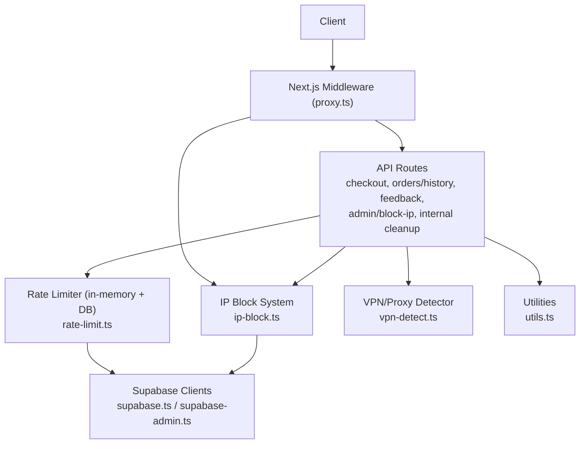
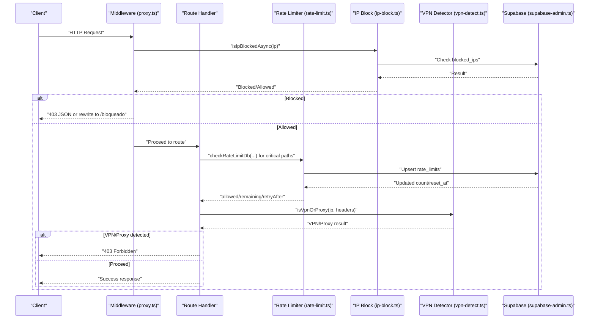
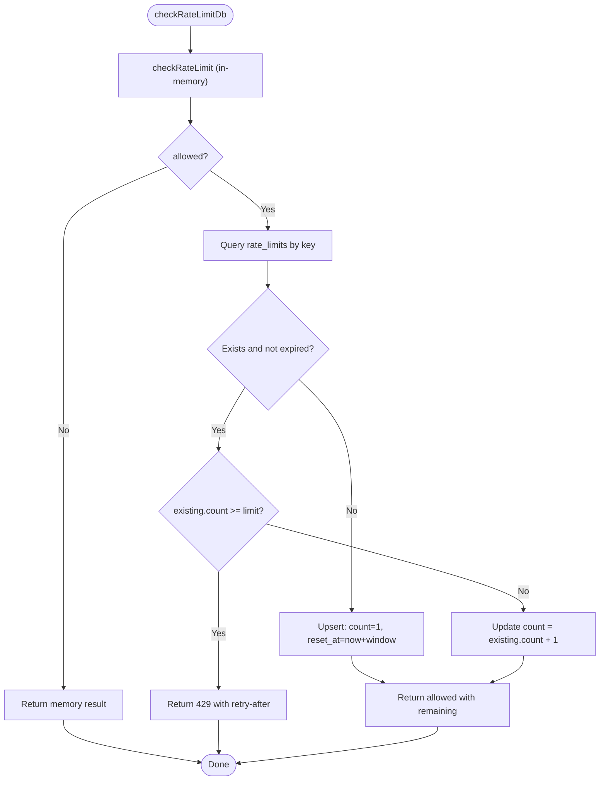
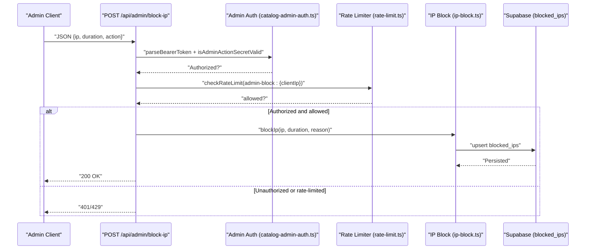
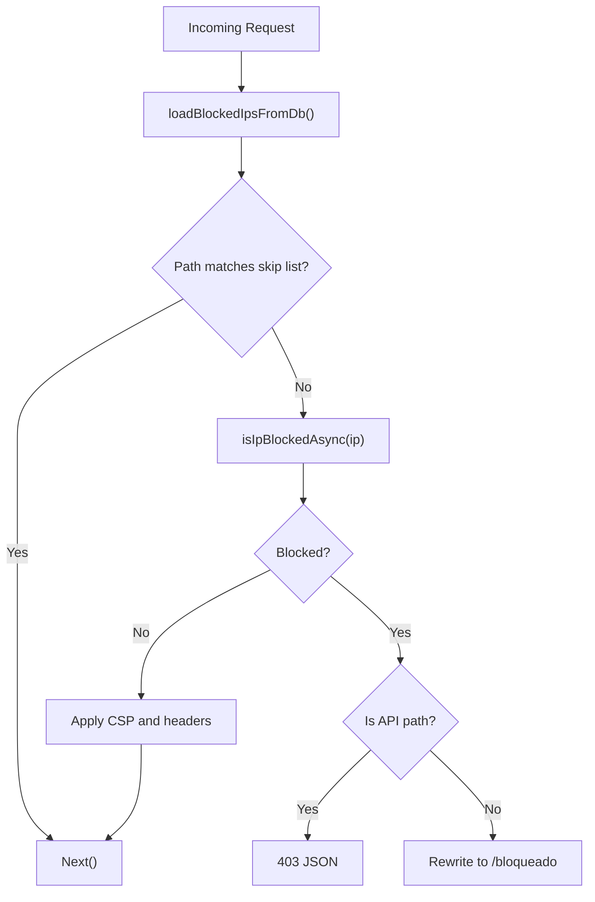
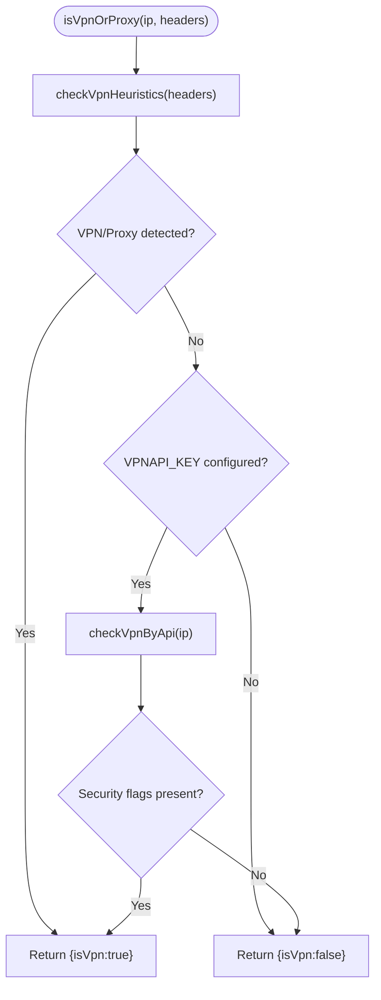
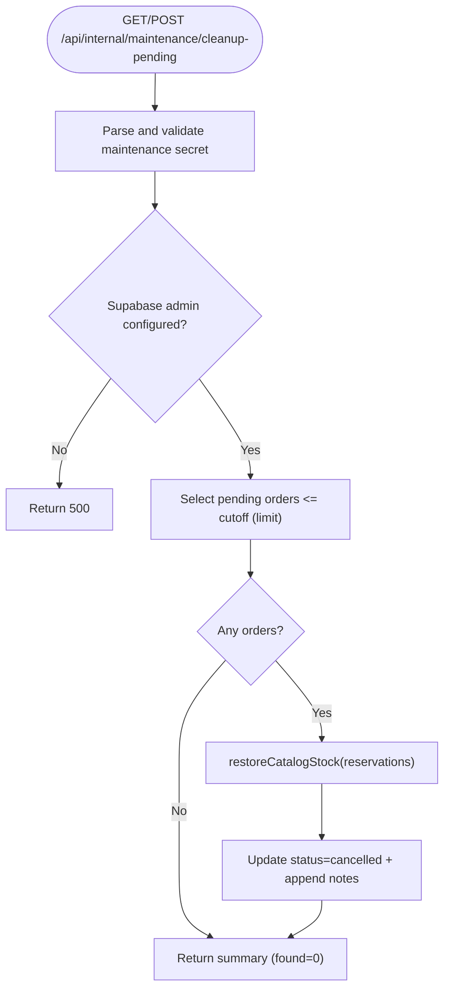
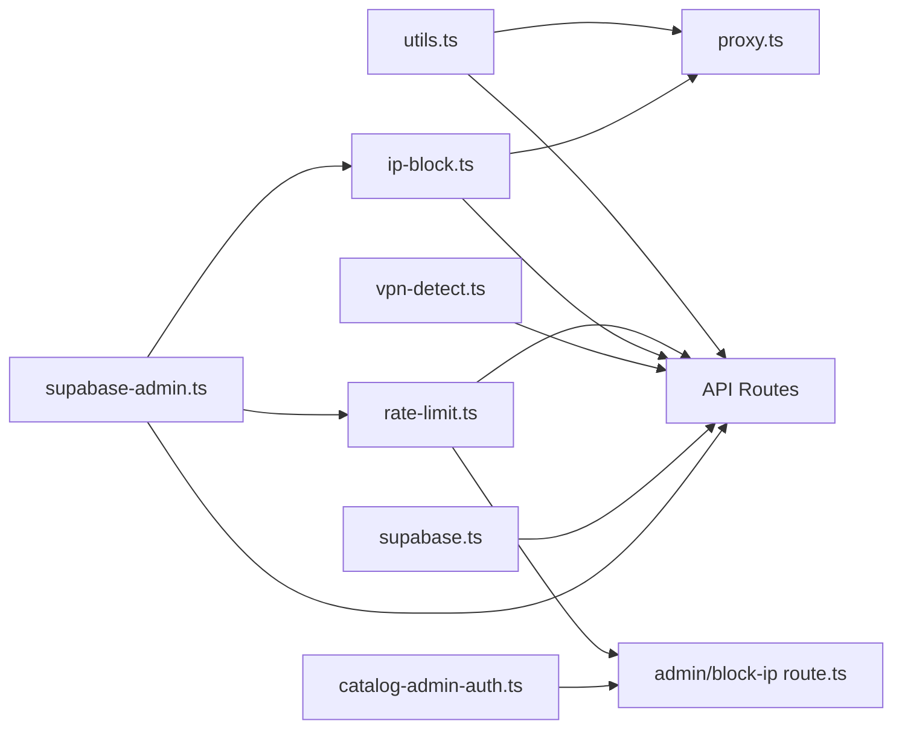

# Rate Limiting & Protection

<cite>
**Referenced Files in This Document**
- [rate-limit.ts](file://src/lib/rate-limit.ts)
- [ip-block.ts](file://src/lib/ip-block.ts)
- [proxy.ts](file://src/proxy.ts)
- [supabase-admin.ts](file://src/lib/supabase-admin.ts)
- [supabase.ts](file://src/lib/supabase.ts)
- [utils.ts](file://src/lib/utils.ts)
- [vpn-detect.ts](file://src/lib/vpn-detect.ts)
- [checkout route.ts](file://src/app/api/checkout/route.ts)
- [block-ip route.ts](file://src/app/api/admin/block-ip/route.ts)
- [order-history route.ts](file://src/app/api/orders/history/route.ts)
- [feedback route.ts](file://src/app/api/feedback/route.ts)
- [cleanup-pending route.ts](file://src/app/api/internal/maintenance/cleanup-pending/route.ts)
- [catalog-admin-auth.ts](file://src/lib/catalog-admin-auth.ts)
</cite>

## Table of Contents
1. [Introduction](#introduction)
2. [Project Structure](#project-structure)
3. [Core Components](#core-components)
4. [Architecture Overview](#architecture-overview)
5. [Detailed Component Analysis](#detailed-component-analysis)
6. [Dependency Analysis](#dependency-analysis)
7. [Performance Considerations](#performance-considerations)
8. [Troubleshooting Guide](#troubleshooting-guide)
9. [Conclusion](#conclusion)
10. [Appendices](#appendices)

## Introduction
This document explains AllShop’s rate limiting and protection mechanisms, focusing on distributed enforcement using Supabase, abuse prevention patterns, and operational safeguards. It covers:
- Distributed rate limiting with sliding window semantics
- Abuse protections for checkout spamming, order flooding, and API endpoint attacks
- Temporary IP blocking with persistence and in-memory caching
- Request throttling and automated cleanup processes
- Integration with Vercel Edge Functions via a proxy middleware for low-latency protection
- Fallbacks for serverless environments and configuration guidance for different endpoint protection levels
- Monitoring and detection strategies for suspicious activity

## Project Structure
The protection stack spans shared libraries, API routes, and a proxy middleware:
- Shared protection utilities: rate limiting, IP blocking, client IP extraction, VPN detection
- API routes: checkout, order history, feedback, admin IP block, maintenance cleanup
- Proxy middleware: centralized IP block enforcement and security headers

**Diagram sources**
- [proxy.ts:8-71](file://src/proxy.ts#L8-L71)
- [rate-limit.ts:43-88](file://src/lib/rate-limit.ts#L43-L88)
- [ip-block.ts:25-72](file://src/lib/ip-block.ts#L25-L72)
- [vpn-detect.ts:22-100](file://src/lib/vpn-detect.ts#L22-L100)
- [supabase-admin.ts:15-31](file://src/lib/supabase-admin.ts#L15-L31)
- [supabase.ts:4-19](file://src/lib/supabase.ts#L4-L19)
- [utils.ts:56-89](file://src/lib/utils.ts#L56-L89)

**Section sources**
- [proxy.ts:8-71](file://src/proxy.ts#L8-L71)
- [rate-limit.ts:11-165](file://src/lib/rate-limit.ts#L11-L165)
- [ip-block.ts:1-210](file://src/lib/ip-block.ts#L1-L210)
- [vpn-detect.ts:1-101](file://src/lib/vpn-detect.ts#L1-L101)
- [supabase-admin.ts:1-31](file://src/lib/supabase-admin.ts#L1-L31)
- [supabase.ts:1-20](file://src/lib/supabase.ts#L1-L20)
- [utils.ts:1-102](file://src/lib/utils.ts#L1-L102)

## Core Components
- Distributed rate limiter with sliding window:
  - In-memory bucket per key with periodic cleanup
  - DB-backed fallback for critical paths using Supabase
- IP blocking system:
  - In-memory cache synchronized with Supabase
  - Always consults DB for authoritative checks in serverless
- Proxy middleware:
  - Enforces IP blocks and applies security headers
- VPN/Proxy detection:
  - Heuristics plus optional API check with fail-open behavior
- Utilities:
  - Client IP extraction and IP validation
- Maintenance cleanup:
  - Automated cancellation and stock restoration for stale pending orders

**Section sources**
- [rate-limit.ts:43-165](file://src/lib/rate-limit.ts#L43-L165)
- [ip-block.ts:25-210](file://src/lib/ip-block.ts#L25-L210)
- [proxy.ts:8-71](file://src/proxy.ts#L8-L71)
- [vpn-detect.ts:22-100](file://src/lib/vpn-detect.ts#L22-L100)
- [utils.ts:56-89](file://src/lib/utils.ts#L56-L89)
- [cleanup-pending route.ts:98-220](file://src/app/api/internal/maintenance/cleanup-pending/route.ts#L98-L220)

## Architecture Overview
The system combines local and distributed enforcement:
- Local fast-path: in-memory rate buckets
- Distributed enforcement: Supabase-backed counters for critical endpoints
- Global IP block enforcement: DB-backed with in-memory cache and authoritative DB checks
- Edge-first protection: middleware validates IPs before hitting route handlers
- Anti-abuse: VPN/proxy detection and administrative controls

**Diagram sources**
- [proxy.ts:25-36](file://src/proxy.ts#L25-L36)
- [ip-block.ts:25-72](file://src/lib/ip-block.ts#L25-L72)
- [rate-limit.ts:101-165](file://src/lib/rate-limit.ts#L101-L165)
- [vpn-detect.ts:89-100](file://src/lib/vpn-detect.ts#L89-L100)
- [supabase-admin.ts:15-31](file://src/lib/supabase-admin.ts#L15-L31)

## Detailed Component Analysis

### Distributed Rate Limiting (Sliding Window)
- In-memory sliding window:
  - Buckets track count and resetAt timestamps
  - Cleanup runs periodically or probabilistically to keep memory bounded
- DB-backed enforcement:
  - Critical paths (e.g., checkout) use DB counters via Supabase
  - Upserts maintain count and reset_at atomically
  - Fallback to in-memory if DB is unavailable or table missing
- Result contract:
  - allowed, remaining, retryAfterSeconds returned to route handlers

**Diagram sources**
- [rate-limit.ts:101-165](file://src/lib/rate-limit.ts#L101-L165)

**Section sources**
- [rate-limit.ts:43-165](file://src/lib/rate-limit.ts#L43-L165)

### IP Blocking System (Temporary Blocks)
- In-memory cache synchronized with Supabase:
  - Fast synchronous checks via memory
  - Authoritative checks via DB for serverless reliability
- Administrative control:
  - Admin endpoint allows blocking/unblocking with duration and reason
  - Persists to Supabase with upsert and removes expired entries
- Proxy enforcement:
  - Middleware loads blocked IPs on first request and enforces blocks globally

**Diagram sources**
- [block-ip route.ts:51-129](file://src/app/api/admin/block-ip/route.ts#L51-L129)
- [catalog-admin-auth.ts:57-64](file://src/lib/catalog-admin-auth.ts#L57-L64)
- [rate-limit.ts:43-88](file://src/lib/rate-limit.ts#L43-L88)
- [ip-block.ts:103-132](file://src/lib/ip-block.ts#L103-L132)
- [supabase-admin.ts:15-31](file://src/lib/supabase-admin.ts#L15-L31)

**Section sources**
- [ip-block.ts:25-210](file://src/lib/ip-block.ts#L25-L210)
- [block-ip route.ts:51-129](file://src/app/api/admin/block-ip/route.ts#L51-L129)
- [catalog-admin-auth.ts:27-64](file://src/lib/catalog-admin-auth.ts#L27-L64)

### Proxy Middleware and Edge Enforcement
- Loads blocked IPs from DB on first request
- Skips middleware for specific paths (blocked page, admin API, static assets)
- Enforces IP blocks before route execution
- Applies CSP and other security headers in production

**Diagram sources**
- [proxy.ts:8-71](file://src/proxy.ts#L8-L71)

**Section sources**
- [proxy.ts:8-71](file://src/proxy.ts#L8-L71)

### VPN/Proxy Detection
- Heuristic checks on x-forwarded-for chain
- Optional API check via vpnapi.io with fail-open behavior
- Designed as a supplementary measure alongside other protections

**Diagram sources**
- [vpn-detect.ts:89-100](file://src/lib/vpn-detect.ts#L89-L100)

**Section sources**
- [vpn-detect.ts:22-100](file://src/lib/vpn-detect.ts#L22-L100)

### Endpoint Protection Examples

#### Checkout (Critical Path)
- Sliding window: 5 requests per 10 minutes per IP
- DB-backed enforcement for strong distribution
- Additional protections: CSRF validation, same-origin check, VPN/Proxy detection, duplicate order guard, stock reservation, and idempotency

```mermaid
sequenceDiagram
participant C as "Client"
participant M as "Middleware"
participant Ch as "POST /api/checkout"
participant RL as "checkRateLimitDb"
participant IP as "isIpBlockedAsync"
participant VP as "isVpnOrProxy"
C->>M : "Request"
M->>IP : "Check"
IP-->>M : "Allowed/Blocked"
alt Blocked
M-->>C : "403"
else Allowed
M->>Ch : "Proceed"
Ch->>RL : "Rate limit (DB)"
RL-->>Ch : "allowed?"
alt Not allowed
Ch-->>C : "429 Retry-After"
else Allowed
Ch->>VP : "VPN/Proxy check"
VP-->>Ch : "Allowed/Blocked"
alt Blocked
Ch-->>C : "403"
else Allowed
Ch-->>C : "Success"
end
end
end
```

**Diagram sources**
- [checkout route.ts:532-566](file://src/app/api/checkout/route.ts#L532-L566)
- [rate-limit.ts:101-165](file://src/lib/rate-limit.ts#L101-L165)
- [ip-block.ts:25-72](file://src/lib/ip-block.ts#L25-L72)
- [vpn-detect.ts:89-100](file://src/lib/vpn-detect.ts#L89-L100)

**Section sources**
- [checkout route.ts:532-566](file://src/app/api/checkout/route.ts#L532-L566)

#### Order History Lookup
- Sliding window: 10 requests per 10 minutes per IP
- Best-effort in-memory rate limiting for non-critical path

**Section sources**
- [order-history route.ts:43-59](file://src/app/api/orders/history/route.ts#L43-L59)

#### Feedback Endpoint
- Sliding window: 8 requests per 10 minutes per IP
- Best-effort in-memory rate limiting for non-critical path

**Section sources**
- [feedback route.ts:38-54](file://src/app/api/feedback/route.ts#L38-L54)

### Abuse Scenarios and Mitigations
- Checkout spamming:
  - DB-backed sliding window prevents rapid repeated submissions
  - VPN/Proxy block reduces anonymity-driven abuse
- Order flooding:
  - In-memory rate limiting on order history and lookup endpoints
  - Idempotency and duplicate detection reduce redundant writes
- API endpoint attacks:
  - Admin endpoints rate-limited and protected by bearer token
  - Middleware blocks IPs globally before reaching sensitive routes
- DDoS attempts:
  - Edge middleware blocks IPs early; VPN detection adds another signal
- Credential stuffing and form spam:
  - IP-based rate limiting and temporary blocks
  - VPN detection helps flag suspicious networks

**Section sources**
- [checkout route.ts:532-566](file://src/app/api/checkout/route.ts#L532-L566)
- [order-history route.ts:43-59](file://src/app/api/orders/history/route.ts#L43-L59)
- [feedback route.ts:38-54](file://src/app/api/feedback/route.ts#L38-L54)
- [block-ip route.ts:51-64](file://src/app/api/admin/block-ip/route.ts#L51-L64)
- [proxy.ts:25-36](file://src/proxy.ts#L25-L36)
- [vpn-detect.ts:89-100](file://src/lib/vpn-detect.ts#L89-L100)

### Automated Cleanup Processes
- Maintenance job cancels stale pending orders and restores stock:
  - Validates maintenance secret
  - Queries orders older than TTL threshold
  - Restores stock and updates order notes
  - Returns summary metrics for observability

**Diagram sources**
- [cleanup-pending route.ts:98-220](file://src/app/api/internal/maintenance/cleanup-pending/route.ts#L98-L220)

**Section sources**
- [cleanup-pending route.ts:98-220](file://src/app/api/internal/maintenance/cleanup-pending/route.ts#L98-L220)

## Dependency Analysis
- Supabase clients:
  - Public client for typed access to core tables
  - Admin client for dynamic tables and privileged operations
- Utilities:
  - Client IP extraction relies on Vercel edge headers trust model
- Route dependencies:
  - Checkout depends on rate limiting, IP blocking, VPN detection, and catalog stock management
  - Admin block endpoint depends on rate limiting and admin auth

**Diagram sources**
- [utils.ts:56-89](file://src/lib/utils.ts#L56-L89)
- [proxy.ts:8-71](file://src/proxy.ts#L8-L71)
- [rate-limit.ts:11-165](file://src/lib/rate-limit.ts#L11-L165)
- [ip-block.ts:10-210](file://src/lib/ip-block.ts#L10-L210)
- [vpn-detect.ts:1-101](file://src/lib/vpn-detect.ts#L1-L101)
- [supabase.ts:1-20](file://src/lib/supabase.ts#L1-L20)
- [supabase-admin.ts:1-31](file://src/lib/supabase-admin.ts#L1-L31)
- [catalog-admin-auth.ts:1-65](file://src/lib/catalog-admin-auth.ts#L1-L65)
- [block-ip route.ts:1-140](file://src/app/api/admin/block-ip/route.ts#L1-L140)

**Section sources**
- [utils.ts:56-89](file://src/lib/utils.ts#L56-L89)
- [proxy.ts:8-71](file://src/proxy.ts#L8-L71)
- [rate-limit.ts:11-165](file://src/lib/rate-limit.ts#L11-L165)
- [ip-block.ts:10-210](file://src/lib/ip-block.ts#L10-L210)
- [vpn-detect.ts:1-101](file://src/lib/vpn-detect.ts#L1-L101)
- [supabase.ts:1-20](file://src/lib/supabase.ts#L1-L20)
- [supabase-admin.ts:1-31](file://src/lib/supabase-admin.ts#L1-L31)
- [catalog-admin-auth.ts:1-65](file://src/lib/catalog-admin-auth.ts#L1-L65)
- [block-ip route.ts:1-140](file://src/app/api/admin/block-ip/route.ts#L1-L140)

## Performance Considerations
- In-memory rate limiter:
  - O(1) per request with probabilistic cleanup to bound memory growth
- DB-backed rate limiting:
  - Upsert pattern minimizes contention; fallback ensures resilience
- IP block cache:
  - Memory cache accelerates checks; DB authoritative for serverless
- Edge middleware:
  - Early IP block enforcement reduces downstream work
- Recommendations:
  - Tune limits per endpoint based on traffic profiles
  - Monitor retry-after usage and 429 rates for tuning
  - Ensure Supabase connection pooling and indexes on rate_limits.key and blocked_ips.ip

[No sources needed since this section provides general guidance]

## Troubleshooting Guide
- Rate limiting frequently denies requests:
  - Verify windowMs and limit values; adjust for expected burstiness
  - Confirm DB availability; fallback to in-memory may be insufficient under heavy load
- IP blocks not applied:
  - Ensure Supabase admin is configured and blocked_ips table exists
  - Confirm middleware matcher excludes intended paths
- VPN detection flags legitimate users:
  - Review heuristic thresholds and API key configuration
  - Consider adding allow-lists for known good networks
- Maintenance cleanup does not run:
  - Verify maintenance secret and Supabase admin configuration
  - Check TTL and limit parameters for reasonableness

**Section sources**
- [rate-limit.ts:101-165](file://src/lib/rate-limit.ts#L101-L165)
- [ip-block.ts:178-210](file://src/lib/ip-block.ts#L178-L210)
- [proxy.ts:73-84](file://src/proxy.ts#L73-L84)
- [vpn-detect.ts:37-84](file://src/lib/vpn-detect.ts#L37-L84)
- [cleanup-pending route.ts:20-42](file://src/app/api/internal/maintenance/cleanup-pending/route.ts#L20-L42)

## Conclusion
AllShop’s protection stack blends edge enforcement, in-memory best-effort rate limiting, and DB-backed counters for critical paths. IP blocking, VPN detection, and administrative controls provide layered defense against abuse. The design favors low-latency edge checks with resilient fallbacks and automated cleanup for operational hygiene.

[No sources needed since this section summarizes without analyzing specific files]

## Appendices

### Configuration Examples
- Admin block endpoint:
  - Authorization: Bearer <ADMIN_BLOCK_SECRET> or ORDER_LOOKUP_SECRET
  - Body: { ip, duration: "permanent"|"24h"|"1h", action: "block"|"unblock" }
- Maintenance cleanup:
  - Secret via X-Maintenance-Secret header or secret query param
  - Parameters: ttl_minutes (default 120), limit (default 50)
- VPN detection:
  - Optional: VPNAPI_KEY for enhanced checks; otherwise heuristics only

**Section sources**
- [block-ip route.ts:14-18](file://src/app/api/admin/block-ip/route.ts#L14-L18)
- [catalog-admin-auth.ts:27-31](file://src/lib/catalog-admin-auth.ts#L27-L31)
- [cleanup-pending route.ts:20-42](file://src/app/api/internal/maintenance/cleanup-pending/route.ts#L20-L42)
- [vpn-detect.ts:44-46](file://src/lib/vpn-detect.ts#L44-L46)

### Monitoring Approaches
- Track 429 responses and retry-after values per endpoint
- Observe rate-limit remaining counts and resetAt drift
- Monitor blocked_ips table growth and expiry cleanup
- Log VPN detection outcomes and false positives
- Observe maintenance cleanup metrics: found, cancelled, restored_stock_for, restore_errors

**Section sources**
- [rate-limit.ts:130-159](file://src/lib/rate-limit.ts#L130-L159)
- [ip-block.ts:178-210](file://src/lib/ip-block.ts#L178-L210)
- [vpn-detect.ts:37-84](file://src/lib/vpn-detect.ts#L37-L84)
- [cleanup-pending route.ts:211-219](file://src/app/api/internal/maintenance/cleanup-pending/route.ts#L211-L219)